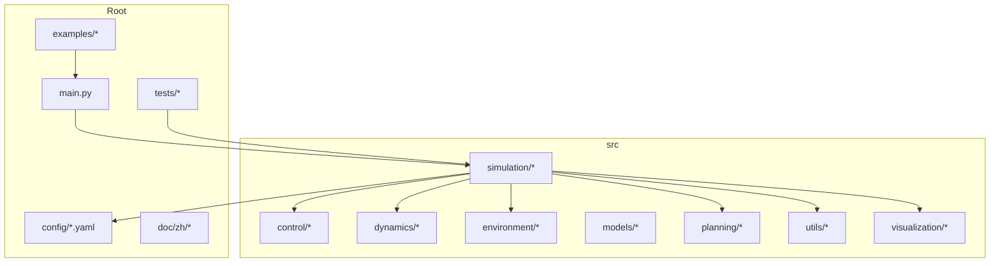
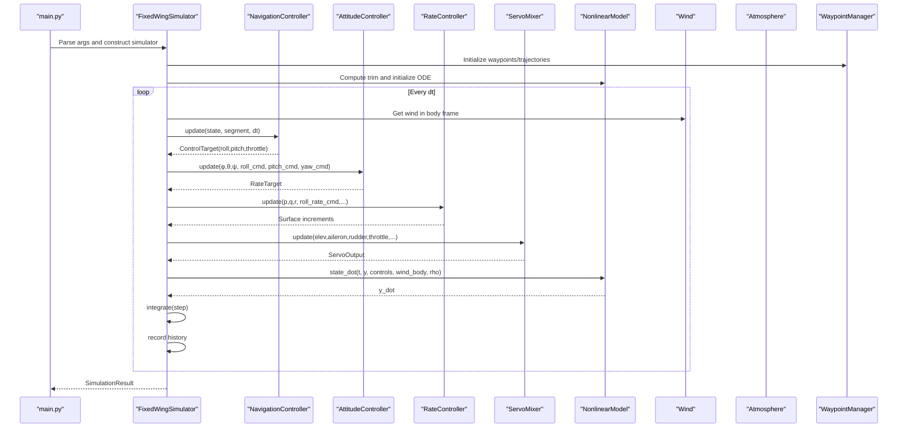
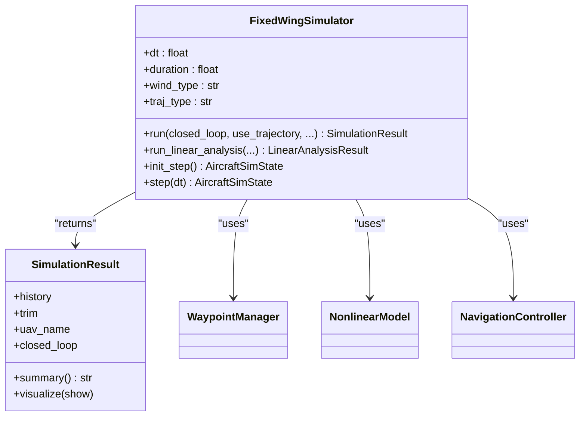
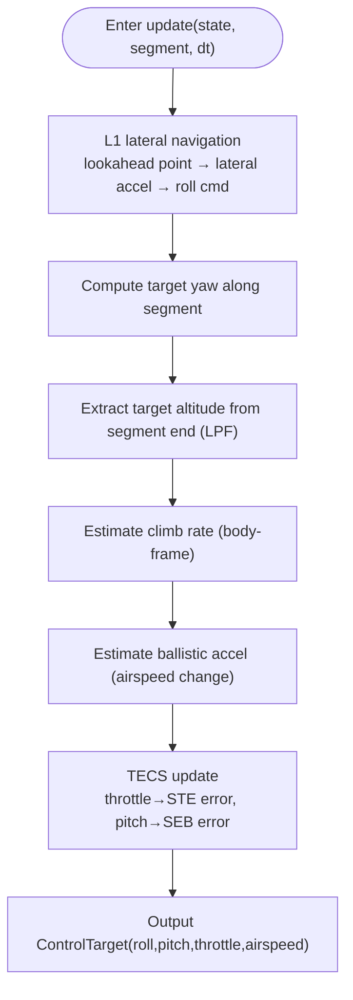
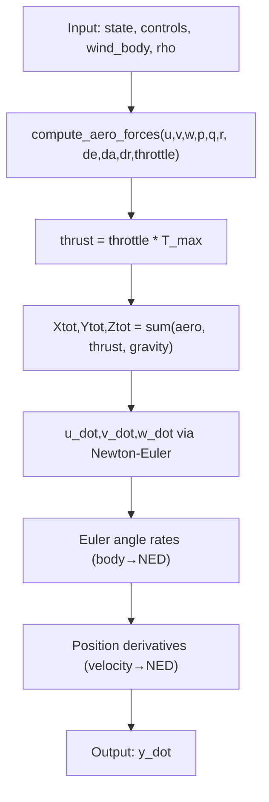
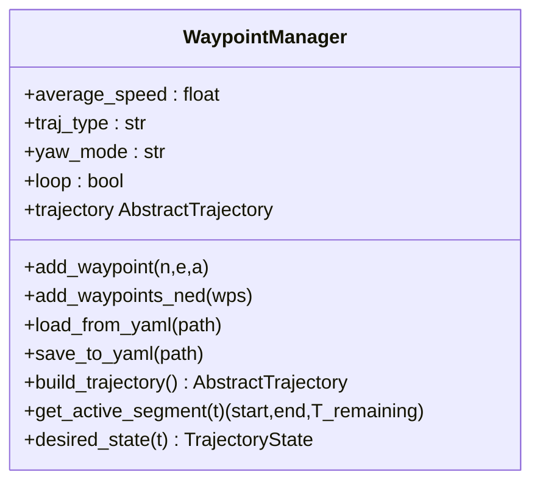
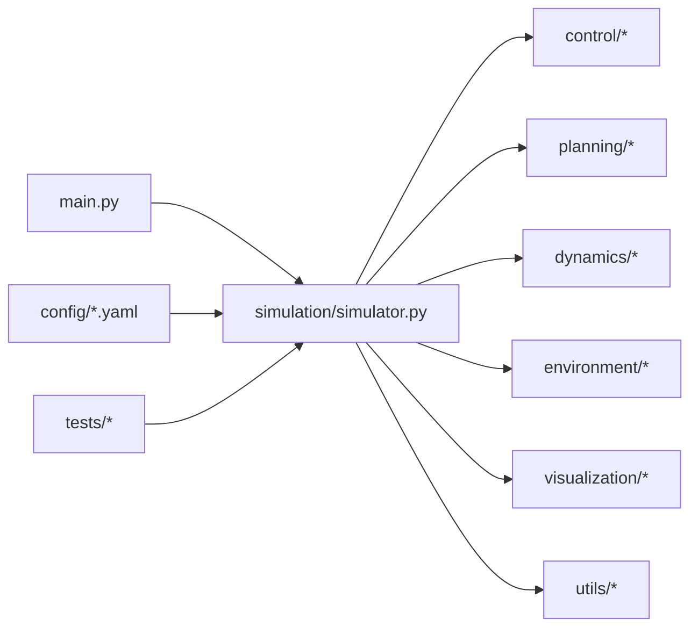

# Developer Guidelines

<cite>
**Referenced Files in This Document**
- [main.py](file://main.py)
- [setup.py](file://setup.py)
- [requirements.txt](file://requirements.txt)
- [src/simulation/simulator.py](file://src/simulation/simulator.py)
- [src/simulation/integrator.py](file://src/simulation/integrator.py)
- [src/simulation/state_manager.py](file://src/simulation/state_manager.py)
- [src/dynamics/nonlinear_model.py](file://src/dynamics/nonlinear_model.py)
- [src/dynamics/linear_model.py](file://src/dynamics/linear_model.py)
- [src/dynamics/aerodynamics.py](file://src/dynamics/aerodynamics.py)
- [src/environment/atmosphere_model.py](file://src/environment/atmosphere_model.py)
- [src/control/tecs_controller.py](file://src/control/tecs_controller.py)
- [src/control/ardupilot_compat.py](file://src/control/ardupilot_compat.py)
- [src/planning/waypoint_manager.py](file://src/planning/waypoint_manager.py)
- [src/utils/config_loader.py](file://src/utils/config_loader.py)
- [src/utils/logger.py](file://src/utils/logger.py)
- [src/visualization/plotter.py](file://src/visualization/plotter.py)
- [tests/test_integration.py](file://tests/test_integration.py)
- [tests/test_control.py](file://tests/test_control.py)
- [tests/test_dynamics.py](file://tests/test_dynamics.py)
- [tests/test_planning.py](file://tests/test_planning.py)
- [debug_long.py](file://debug_long.py)
- [debug_segment.py](file://debug_segment.py)
- [debug_tecs.py](file://debug_tecs.py)
- [debug_trim.py](file://debug_trim.py)
- [config/aircraft.yaml](file://config/aircraft.yaml)
- [config/control_params.yaml](file://config/control_params.yaml)
- [config/simulation.yaml](file://config/simulation.yaml)
- [config/trajectory.yaml](file://config/trajectory.yaml)
- [examples/example_1_linear_response.py](file://examples/example_1_linear_response.py)
- [examples/example_2_nonlinear_dynamics.py](file://examples/example_2_nonlinear_dynamics.py)
</cite>

## Table of Contents
1. [Introduction](#introduction)
2. [Project Structure](#project-structure)
3. [Core Components](#core-components)
4. [Architecture Overview](#architecture-overview)
5. [Detailed Component Analysis](#detailed-component-analysis)
6. [Dependency Analysis](#dependency-analysis)
7. [Performance Considerations](#performance-considerations)
8. [Troubleshooting Guide](#troubleshooting-guide)
9. [Contribution Workflow](#contribution-workflow)
10. [Code Review and Testing Standards](#code-review-and-testing-standards)
11. [Documentation Standards](#documentation-standards)
12. [Architectural Decision-Making and Extension Guidelines](#architectural-decision-making-and-extension-guidelines)
13. [Community Contributions and Issue Reporting](#community-contributions-and-issue-reporting)
14. [Conclusion](#conclusion)

## Introduction
This document provides comprehensive developer guidelines for the FixedWingSimulator project. It covers development environment setup, coding standards, contribution workflows, performance optimization, memory management, debugging methodologies, profiling, troubleshooting, code review processes, testing requirements, documentation standards, architectural decision-making, design pattern usage, and system extension guidelines. The goal is to enable contributors to develop, validate, and extend the simulation platform efficiently and consistently.

## Project Structure
The project follows a modular, domain-driven layout:
- Root: entry points, examples, tests, configuration, and documentation
- src: core modules organized by domain (simulation, control, dynamics, environment, models, planning, utils, visualization)
- config: runtime configuration files for aircraft, simulation, control, and trajectory
- tests: integration and unit tests
- examples: runnable scripts demonstrating typical use cases
- docs: localized developer documentation

**Diagram sources**
- [main.py](file://main.py#L1-L145)
- [src/simulation/simulator.py](file://src/simulation/simulator.py#L1-L642)

**Section sources**
- [main.py](file://main.py#L1-L145)
- [setup.py](file://setup.py#L1-L23)
- [requirements.txt](file://requirements.txt#L1-L8)

## Core Components
- FixedWingSimulator: orchestrates configuration, aircraft parameters, environment, control layers, planning, dynamics, and visualization; supports closed-loop, open-loop, and linear analysis modes
- Control chain: ArduPilot-style navigation (L1 + TECS), attitude, rate, and servo mixing
- Dynamics: 6-DOF nonlinear model and 4-DOF linear model for modal analysis
- Planning: WaypointManager and trajectory builders (minimum snap/jerk)
- Environment: wind and atmosphere models
- Utilities: configuration loading, math utilities, logging
- Visualization: plotting and animation

**Section sources**
- [src/simulation/simulator.py](file://src/simulation/simulator.py#L115-L642)
- [src/control/tecs_controller.py](file://src/control/tecs_controller.py#L50-L647)
- [src/dynamics/nonlinear_model.py](file://src/dynamics/nonlinear_model.py#L104-L386)
- [src/planning/waypoint_manager.py](file://src/planning/waypoint_manager.py#L20-L208)

## Architecture Overview
The system implements a layered control-oriented architecture:
- Control chain: NavigationController (L1 + TECS) → AttitudeController → RateController → ServoMixer
- Planning: WaypointManager builds trajectories and provides desired states
- Dynamics: NonlinearModel computes state derivatives; LinearModel supports linear analysis
- Simulation: Integrator and StateHistory manage numerical integration and history
- Environment: Wind and Atmosphere models influence dynamics

**Diagram sources**
- [src/simulation/simulator.py](file://src/simulation/simulator.py#L239-L567)
- [src/control/tecs_controller.py](file://src/control/tecs_controller.py#L247-L315)
- [src/dynamics/nonlinear_model.py](file://src/dynamics/nonlinear_model.py#L160-L255)

## Detailed Component Analysis

### FixedWingSimulator
- Responsibilities: assemble subsystems, run closed/open-loop simulations, perform linear analysis, expose stepwise interface
- Key flows: initialization (load configs, create subsystems), run loop (wind → nav → att → rate → mix → dyn → integrate → record), result packaging
- Extension points: new flight modes, trajectory types, control laws, wind models

**Diagram sources**
- [src/simulation/simulator.py](file://src/simulation/simulator.py#L115-L642)

**Section sources**
- [src/simulation/simulator.py](file://src/simulation/simulator.py#L115-L642)

### Navigation Controller (L1 + TECS)
- L1 lateral navigation computes target sideslip acceleration from path segment and converts to roll command
- TECS longitudinal control manages total energy (oil throttle) and energy balance (pitch) to couple altitude and speed control
- Parameters sourced from control parameters configuration and ArduPilot compatibility layer

**Diagram sources**
- [src/control/tecs_controller.py](file://src/control/tecs_controller.py#L247-L315)

**Section sources**
- [src/control/tecs_controller.py](file://src/control/tecs_controller.py#L50-L647)

### Nonlinear Dynamics Model (6-DOF)
- State: body velocities, angular rates, Euler angles, NED positions
- Inputs: elevator, aileron, rudder, throttle
- Forces/torques: aerodynamics, thrust, gravity
- Provides: trim solution, state derivatives, batch simulation

**Diagram sources**
- [src/dynamics/nonlinear_model.py](file://src/dynamics/nonlinear_model.py#L160-L255)

**Section sources**
- [src/dynamics/nonlinear_model.py](file://src/dynamics/nonlinear_model.py#L104-L386)

### Waypoint and Trajectory Management
- WaypointManager maintains NED waypoints, builds trajectories (minimum snap/jerk), provides active segment and desired state
- Supports adding/modifying waypoints, YAML import/export, looping, and yaw modes

**Diagram sources**
- [src/planning/waypoint_manager.py](file://src/planning/waypoint_manager.py#L20-L208)

**Section sources**
- [src/planning/waypoint_manager.py](file://src/planning/waypoint_manager.py#L20-L208)

## Dependency Analysis
- Package dependencies: NumPy, SciPy, Matplotlib, Plotly, PyYAML, Pandas declared in setup.py and requirements.txt
- Runtime import path resolution ensures modules under src are importable from project root
- Configuration dependencies: aircraft, simulation, control, trajectory YAML files

**Diagram sources**
- [setup.py](file://setup.py#L11-L18)
- [requirements.txt](file://requirements.txt#L1-L8)
- [main.py](file://main.py#L21-L27)

**Section sources**
- [setup.py](file://setup.py#L1-L23)
- [requirements.txt](file://requirements.txt#L1-L8)
- [main.py](file://main.py#L21-L27)

## Performance Considerations
- Numerical integration: default dopri5 (RK45) for adaptive accuracy; configure rtol/atol and max_step for performance/precision trade-offs
- Control update frequency: align with integration step; avoid excessive updates
- Estimation filters: TECS uses complementary filtering and LPF to reduce noise sensitivity
- Wind/atmosphere: compute density by altitude; transform wind vectors to body frame to minimize overhead
- Visualization: disable plots for batch runs to reduce overhead

**Section sources**
- [src/simulation/integrator.py](file://src/simulation/integrator.py#L17-L108)
- [src/simulation/simulator.py](file://src/simulation/simulator.py#L339-L339)
- [config/simulation.yaml](file://config/simulation.yaml#L1-L30)

## Troubleshooting Guide
Common issues and checks:
- Numerical divergence: inspect wind/atmosphere models, integration tolerances, control saturation and integral anti-windup
- Control saturation and integral saturation: review TECS outputs and integral terms; tune TECS parameters (damping, integral gain, bank-to-throttle compensation)
- Trajectory boundary/oscillation: verify segment.end and desired position clamping consistency
- Wind effects: confirm NED→body transformation correctness and L1 robustness against sideslip

**Section sources**
- [tests/test_integration.py](file://tests/test_integration.py#L41-L58)
- [src/control/tecs_controller.py](file://src/control/tecs_controller.py#L553-L647)
- [src/simulation/simulator.py](file://src/simulation/simulator.py#L478-L498)

## Contribution Workflow
- Environment setup
  - Recommended to use a virtual environment
  - Install development dependencies: pip install -e .[dev] or pip install -r requirements.txt
  - Run example scripts to validate environment; ensure plots are saved to output directory
  - Execute pytest tests/ to verify all tests pass
- Branching and commits
  - Fork the repository and create feature branches with descriptive names
  - Ensure local tests and examples pass before submitting
- Pull Request process
  - Describe the change, impact, and test results clearly
  - For configuration changes, note defaults and compatibility
  - At least one maintainer approval required; CI must pass; ensure documentation and examples are updated

**Section sources**
- [setup.py](file://setup.py#L19-L21)
- [requirements.txt](file://requirements.txt#L1-L8)
- [tests/test_integration.py](file://tests/test_integration.py#L1-L391)

## Code Review and Testing Standards
- Unit tests
  - tests/test_control.py: controller logic (PID, attitude, rate, servo mixing)
  - tests/test_dynamics.py: dynamics and coordinate transforms
  - tests/test_planning.py: trajectory planning and waypoint management
  - tests/test_integration.py: end-to-end coverage (open-loop, closed-loop, linear analysis, step API consistency)
- Review focus areas
  - Numerical stability and boundary condition handling
  - Compatibility with existing APIs
  - Documentation and example synchronization

**Section sources**
- [tests/test_control.py](file://tests/test_control.py#L1-L371)
- [tests/test_dynamics.py](file://tests/test_dynamics.py#L1-L336)
- [tests/test_planning.py](file://tests/test_planning.py#L1-L328)
- [tests/test_integration.py](file://tests/test_integration.py#L1-L391)

## Documentation Standards
- Configuration documentation
  - Include field descriptions and defaults in config/*.yaml
  - Example scripts specify output files and save locations
- Example scripts
  - Each script includes purpose, output artifacts, and uses non-interactive backends for CI
- API documentation
  - Public classes and methods include docstrings describing purpose, parameters, and return values
  - Provide serialization helpers (e.g., to_dict/to_csv) for histories and states

**Section sources**
- [config/aircraft.yaml](file://config/aircraft.yaml#L1-L13)
- [config/control_params.yaml](file://config/control_params.yaml#L1-L45)
- [config/simulation.yaml](file://config/simulation.yaml#L1-L30)
- [config/trajectory.yaml](file://config/trajectory.yaml#L1-L23)
- [examples/example_1_linear_response.py](file://examples/example_1_linear_response.py#L1-L20)
- [examples/example_2_nonlinear_dynamics.py](file://examples/example_2_nonlinear_dynamics.py#L1-L20)

## Architectural Decision-Making and Extension Guidelines
- Design patterns
  - Factory pattern: AircraftFactory for parameter assembly
  - Strategy pattern: FlightMode switching and trajectory strategies
- Extension points
  - New aircraft: add entries to aircraft database and keep field consistency
  - New control law: implement controller class with update/reset and register in FlightModeManager
  - New trajectory: implement AbstractTrajectory and register in WaypointManager
  - New environment model: extend Wind or add environment module maintaining consistent interface
- Pluginization
  - Use registry-like mappings for pluggable components
  - Select implementations via configuration to avoid hard-coded coupling
- Testing and examples
  - Add unit tests covering edge cases and typical scenarios
  - Provide example scripts demonstrating new capabilities

**Section sources**
- [src/models/aircraft_factory.py](file://src/models/aircraft_factory.py#L15-L136)
- [src/planning/waypoint_manager.py](file://src/planning/waypoint_manager.py#L127-L160)
- [src/environment/wind_model.py](file://src/environment/wind_model.py#L32-L71)

## Community Contributions and Issue Reporting
- How to report issues
  - Provide clear problem statements, reproduction steps, and expected vs. actual behavior
  - Attach logs, plots, and minimal reproducible configurations
- Feature requests
  - Describe motivation, scope, and potential impacts
  - Propose configuration options and compatibility considerations
- Communication channels
  - Use repository issue tracker for bugs and feature requests
  - Discuss major architectural changes in dedicated threads or milestones

[No sources needed since this section provides general guidance]

## Conclusion
FixedWingSimulator employs a modular, layered architecture with clear separation of concerns. Dedicated debugging scripts, comprehensive configuration, and robust testing practices support rapid iteration and reliable validation. Contributors should adhere to established coding and documentation standards, follow the contribution workflow, and leverage performance and troubleshooting guidance to maintain quality and scalability.