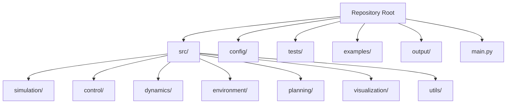
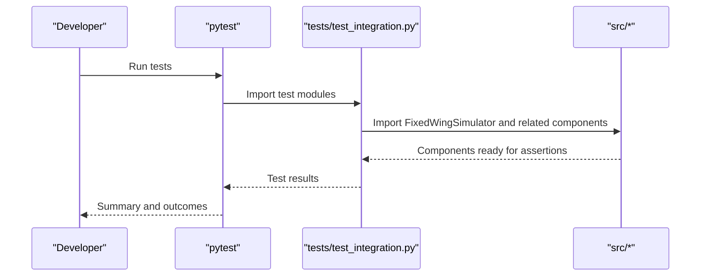

# Development Setup

<cite>
**Referenced Files in This Document**
- [README.md](file://README.md)
- [setup.py](file://setup.py)
- [requirements.txt](file://requirements.txt)
- [.gitignore](file://.gitignore)
- [main.py](file://main.py)
- [config/aircraft.yaml](file://config/aircraft.yaml)
- [config/simulation.yaml](file://config/simulation.yaml)
- [tests/test_integration.py](file://tests/test_integration.py)
- [tests/test_control.py](file://tests/test_control.py)
- [doc/zh/content/开发指南/开发指南.md](file://doc/zh/content/开发指南/开发指南.md)
</cite>

## Table of Contents
1. [Introduction](#introduction)
2. [System Requirements](#system-requirements)
3. [Python Version Compatibility](#python-version-compatibility)
4. [Virtual Environment Setup](#virtual-environment-setup)
5. [IDE Configuration Recommendations](#ide-configuration-recommendations)
6. [Dependency Installation](#dependency-installation)
7. [Code Formatting Standards](#code-formatting-standards)
8. [Linting Configuration](#linting-configuration)
9. [Pre-commit Hooks Setup](#pre-commit-hooks-setup)
10. [Project Structure Navigation](#project-structure-navigation)
11. [Build Processes](#build-processes)
12. [Testing Environment Preparation](#testing-environment-preparation)
13. [Development Workflow Organization](#development-workflow-organization)
14. [Operating System Installation Guides](#operating-system-installation-guides)
15. [Troubleshooting Guide](#troubleshooting-guide)
16. [Conclusion](#conclusion)

## Introduction
This guide provides a complete development environment setup for the FixedWingSimulator project. It covers system requirements, Python version compatibility, virtual environment creation, dependency installation, IDE configuration, code formatting and linting standards, pre-commit hooks, project structure navigation, build processes, testing environment preparation, and step-by-step installation instructions for common operating systems. The goal is to enable contributors to quickly establish a reproducible and maintainable development workflow aligned with the project’s architecture and testing practices.

## System Requirements
- Operating systems: Linux, macOS, Windows (WSL recommended for Windows)
- Python interpreter: See Python version compatibility below
- Disk space: Minimal for source and dependencies; additional space for generated outputs and logs
- Memory: At least 4 GB RAM; more recommended for numerical simulations and plotting
- Optional: GPU acceleration is not required; CPU-only is sufficient

## Python Version Compatibility
- Minimum supported Python version is defined in the project metadata.
- The project declares a minimum Python version requirement via the packaging metadata.
- Ensure your Python interpreter meets or exceeds the declared minimum to avoid runtime import errors.

**Section sources**
- [setup.py](file://setup.py#L10-L10)

## Virtual Environment Setup
- Create a dedicated virtual environment to isolate project dependencies.
- Recommended naming: venv or .venv
- Activate the environment before installing dependencies.
- Keep the environment updated with the latest pip to ensure compatibility with modern package indexes.

**Section sources**
- [.gitignore](file://.gitignore#L8-L12)

## IDE Configuration Recommendations
- Supported IDEs: VS Code, PyCharm, or any editor with Python support
- Configure the interpreter to point to the virtual environment’s Python executable
- Enable automatic formatting on save and integrate with the project’s formatting/linting tools
- Set the working directory to the repository root for proper relative imports and script execution

## Dependency Installation
- Install production dependencies using the project’s dependency specification.
- Install developer dependencies for testing and local development tasks.
- After installation, verify that the package can be imported from the project root.

Notes:
- The project uses a standard Python package layout with explicit package discovery.
- The main entry script adjusts the Python path to import from the src directory, ensuring local development without global installation.

**Section sources**
- [requirements.txt](file://requirements.txt#L1-L8)
- [setup.py](file://setup.py#L11-L21)
- [main.py](file://main.py#L25-L26)

## Code Formatting Standards
- Use type hints consistently to improve readability and maintainability.
- Naming conventions:
  - Classes: PascalCase
  - Variables and functions: snake_case
- Module-level documentation strings and function-level comments are encouraged to explain responsibilities, inputs, outputs, and key algorithmic details.
- Keep modules focused and cohesive; new modules should include a concise README-style description.

**Section sources**
- [doc/zh/content/开发指南/开发指南.md](file://doc/zh/content/开发指南/开发指南.md#L386-L398)

## Linting Configuration
- The project does not include a dedicated linter configuration file in the repository snapshot.
- Recommended approach: Integrate a linter (for example, a commonly adopted style) and align it with the project’s formatting standards.
- Ensure that linting is part of the pre-commit hook workflow to catch issues early.

[No sources needed since this section provides general guidance]

## Pre-commit Hooks Setup
- The repository does not include a pre-commit configuration file in the snapshot.
- Recommended setup: Initialize pre-commit in the repository and configure hooks for formatting and linting.
- This ensures consistent code quality across contributions and reduces review overhead.

**Section sources**
- [.gitignore](file://.gitignore#L1-L39)

## Project Structure Navigation
- src/: Core modules organized by functional domains (simulation, control, dynamics, environment, planning, visualization, utils)
- config/: YAML configuration files for aircraft, simulation, control parameters, and trajectories
- tests/: Integration and unit tests validating end-to-end behavior and component correctness
- examples/: Example scripts demonstrating usage patterns
- output/: Generated artifacts such as CSV data and plots
- main.py: Command-line entry point for running simulations and analyses

**Diagram sources**
- [main.py](file://main.py#L1-L145)
- [config/aircraft.yaml](file://config/aircraft.yaml#L1-L13)
- [config/simulation.yaml](file://config/simulation.yaml#L1-L30)

**Section sources**
- [doc/zh/content/开发指南/开发指南.md](file://doc/zh/content/开发指南/开发指南.md#L41-L53)

## Build Processes
- The project uses a standard Python packaging setup with explicit package discovery.
- The main entry script modifies the Python path to import from src, enabling local development without installing the package globally.
- No separate build step is required for typical development; running scripts directly imports the local modules.

**Section sources**
- [setup.py](file://setup.py#L8-L9)
- [main.py](file://main.py#L25-L26)

## Testing Environment Preparation
- Install developer dependencies to enable running tests.
- Tests are structured to validate:
  - Full simulation pipelines (integration tests)
  - Individual control components (unit tests)
- Tests rely on importing from src via the project root, mirroring the main entry behavior.

**Diagram sources**
- [tests/test_integration.py](file://tests/test_integration.py#L1-L391)
- [tests/test_control.py](file://tests/test_control.py#L1-L371)

**Section sources**
- [tests/test_integration.py](file://tests/test_integration.py#L1-L391)
- [tests/test_control.py](file://tests/test_control.py#L1-L371)

## Development Workflow Organization
- Use the main entry point to run simulations and analyses from the command line.
- Leverage configuration files under config/ to adjust aircraft, simulation parameters, wind conditions, and trajectory types.
- Run integration and unit tests to validate changes across control, dynamics, and simulation components.
- Generate outputs (CSV, plots) under output/ for inspection and verification.

**Section sources**
- [main.py](file://main.py#L98-L144)
- [config/aircraft.yaml](file://config/aircraft.yaml#L1-L13)
- [config/simulation.yaml](file://config/simulation.yaml#L1-L30)

## Operating System Installation Guides

### Linux (Ubuntu/Debian)
- Install system prerequisites (example packages; adjust according to your distribution)
- Create and activate a virtual environment
- Install dependencies using the project’s dependency files
- Verify imports from the project root

**Section sources**
- [requirements.txt](file://requirements.txt#L1-L8)
- [setup.py](file://setup.py#L11-L21)
- [main.py](file://main.py#L25-L26)

### macOS
- Install Python via pyenv or Homebrew to manage versions
- Create and activate a virtual environment
- Install dependencies using the project’s dependency files
- Confirm that the main entry point can import from src

**Section sources**
- [requirements.txt](file://requirements.txt#L1-L8)
- [setup.py](file://setup.py#L11-L21)
- [main.py](file://main.py#L25-L26)

### Windows (WSL)
- Install WSL and a Linux distribution
- Install Python and create a virtual environment
- Install dependencies using the project’s dependency files
- Run the main entry point from the repository root

**Section sources**
- [requirements.txt](file://requirements.txt#L1-L8)
- [setup.py](file://setup.py#L11-L21)
- [main.py](file://main.py#L25-L26)

## Troubleshooting Guide
- Import errors when running scripts:
  - Ensure the virtual environment is activated and the interpreter points to the environment’s Python
  - Confirm that the main entry script can import from src
- Dependency conflicts:
  - Reinstall dependencies using the project’s dependency files
  - Upgrade pip to the latest version
- Test failures:
  - Verify that tests can import from src via the project root
  - Check that configuration files are present and correctly formatted
- Path and working directory issues:
  - Set the IDE’s working directory to the repository root
  - Confirm that relative imports resolve correctly

**Section sources**
- [main.py](file://main.py#L25-L26)
- [tests/test_integration.py](file://tests/test_integration.py#L27-L30)
- [tests/test_control.py](file://tests/test_control.py#L22-L25)

## Conclusion
By following this guide, you can establish a robust development environment tailored to the FixedWingSimulator project. Adhering to the Python version requirements, using a virtual environment, installing dependencies correctly, configuring your IDE, and integrating code formatting and linting will streamline collaboration and maintenance. The testing and configuration practices outlined here ensure reliable simulation behavior and facilitate iterative development across control, dynamics, and visualization components.