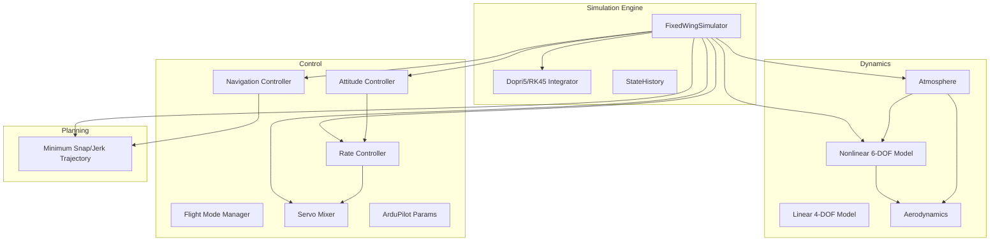
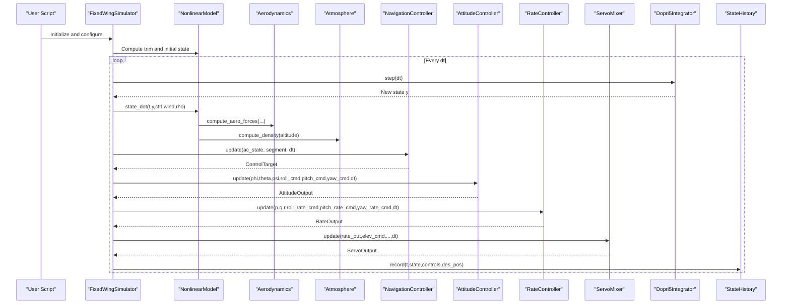
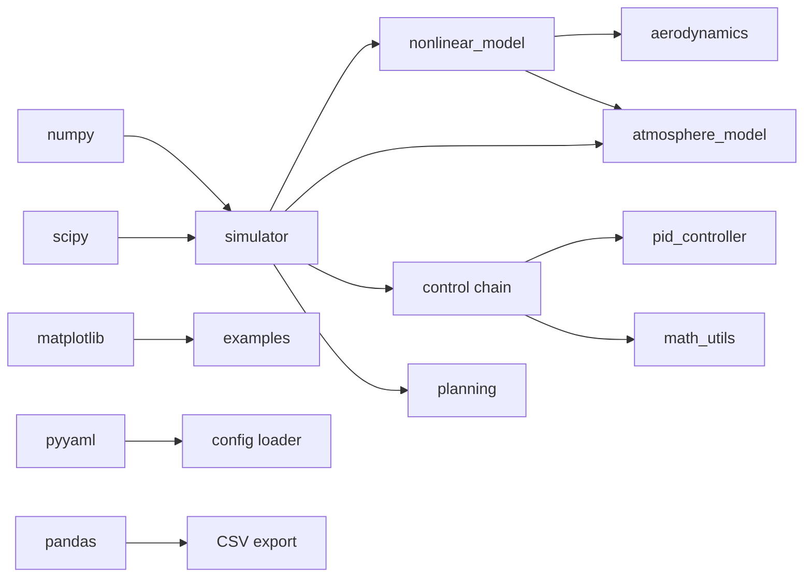

# Performance Optimization

<cite>
**Referenced Files in This Document**
- [src/simulation/integrator.py](file://src/simulation/integrator.py)
- [src/simulation/simulator.py](file://src/simulation/simulator.py)
- [src/simulation/state_manager.py](file://src/simulation/state_manager.py)
- [src/dynamics/nonlinear_model.py](file://src/dynamics/nonlinear_model.py)
- [src/dynamics/linear_model.py](file://src/dynamics/linear_model.py)
- [src/dynamics/aerodynamics.py](file://src/dynamics/aerodynamics.py)
- [src/utils/math_utils.py](file://src/utils/math_utils.py)
- [src/environment/atmosphere_model.py](file://src/environment/atmosphere_model.py)
- [src/environment/aerodynamic_forces.py](file://src/environment/aerodynamic_forces.py)
- [src/control/ardupilot_compat.py](file://src/control/ardupilot_compat.py)
- [src/control/attitude_controller.py](file://src/control/attitude_controller.py)
- [src/control/rate_controller.py](file://src/control/rate_controller.py)
- [src/planning/minimum_snap.py](file://src/planning/minimum_snap.py)
- [src/models/aircraft_database.py](file://src/models/aircraft_database.py)
- [config/simulation.yaml](file://config/simulation.yaml)
- [config/control_params.yaml](file://config/control_params.yaml)
- [doc/zh/content/开发指南/性能优化与最佳实践.md](file://doc/zh/content/开发指南/性能优化与最佳实践.md)
</cite>

## Table of Contents
1. [Introduction](#introduction)
2. [Project Structure](#project-structure)
3. [Core Components](#core-components)
4. [Architecture Overview](#architecture-overview)
5. [Detailed Component Analysis](#detailed-component-analysis)
6. [Dependency Analysis](#dependency-analysis)
7. [Performance Considerations](#performance-considerations)
8. [Troubleshooting Guide](#troubleshooting-guide)
9. [Conclusion](#conclusion)
10. [Appendices](#appendices)

## Introduction
This document provides comprehensive performance optimization guidance for the FixedWingSimulator. It focuses on computational efficiency, memory management, numerical stability, profiling methodologies, bottleneck identification, and optimization implementation patterns. It also covers numerical integration tuning, mathematical function optimization, algorithmic complexity reduction, parallelization and vectorization strategies, cache-friendly coding patterns, simulation scaling, real-time constraints, and resource utilization.

## Project Structure
The simulator is organized into modular layers: simulation engine, dynamics (nonlinear and linear), environment modeling, control systems, planning/trajactory generation, and utilities. This separation enables targeted optimization per module and facilitates testing and benchmarking.

**Diagram sources**
- [src/simulation/simulator.py](file://src/simulation/simulator.py#L115-L642)
- [src/simulation/integrator.py](file://src/simulation/integrator.py#L17-L108)
- [src/simulation/state_manager.py](file://src/simulation/state_manager.py#L95-L193)
- [src/dynamics/nonlinear_model.py](file://src/dynamics/nonlinear_model.py#L104-L386)
- [src/dynamics/linear_model.py](file://src/dynamics/linear_model.py#L107-L319)
- [src/dynamics/aerodynamics.py](file://src/dynamics/aerodynamics.py#L35-L148)
- [src/environment/atmosphere_model.py](file://src/environment/atmosphere_model.py#L24-L77)
- [src/control/attitude_controller.py](file://src/control/attitude_controller.py#L33-L134)
- [src/control/rate_controller.py](file://src/control/rate_controller.py#L32-L109)
- [src/planning/minimum_snap.py](file://src/planning/minimum_snap.py#L167-L253)

**Section sources**
- [src/simulation/simulator.py](file://src/simulation/simulator.py#L1-L642)
- [src/simulation/integrator.py](file://src/simulation/integrator.py#L1-L108)
- [src/simulation/state_manager.py](file://src/simulation/state_manager.py#L1-L193)
- [src/dynamics/nonlinear_model.py](file://src/dynamics/nonlinear_model.py#L1-L386)
- [src/dynamics/linear_model.py](file://src/dynamics/linear_model.py#L1-L319)
- [src/dynamics/aerodynamics.py](file://src/dynamics/aerodynamics.py#L1-L148)
- [src/environment/atmosphere_model.py](file://src/environment/atmosphere_model.py#L1-L77)
- [src/control/attitude_controller.py](file://src/control/attitude_controller.py#L1-L134)
- [src/control/rate_controller.py](file://src/control/rate_controller.py#L1-L109)
- [src/planning/minimum_snap.py](file://src/planning/minimum_snap.py#L1-L253)

## Core Components
- Numerical integrators: Dopri5 (step-by-step, real-time) and RK45 (batch solve_ivp, offline).
- Nonlinear 6-DOF dynamics: ODE-based equations integrating translational/rotational kinematics, aerodynamics, thrust, gravity.
- Linear 4-DOF model: Longitudinal state-space for modal analysis and controller verification.
- Control chain: Five-layer ArduPilot-compatible pipeline (navigation → attitude → rate → servo).
- Planning: Minimum-snap/jerk trajectories with caching and activity segment lookup.
- State management: Pre-allocated NumPy buffers for efficient history recording and trimming.
- Environment: ISA atmosphere density and speed-of-sound computation by altitude.

**Section sources**
- [src/simulation/integrator.py](file://src/simulation/integrator.py#L17-L108)
- [src/dynamics/nonlinear_model.py](file://src/dynamics/nonlinear_model.py#L104-L386)
- [src/dynamics/linear_model.py](file://src/dynamics/linear_model.py#L107-L319)
- [src/control/ardupilot_compat.py](file://src/control/ardupilot_compat.py#L17-L130)
- [src/planning/minimum_snap.py](file://src/planning/minimum_snap.py#L167-L253)
- [src/simulation/state_manager.py](file://src/simulation/state_manager.py#L95-L193)
- [src/environment/atmosphere_model.py](file://src/environment/atmosphere_model.py#L24-L77)

## Architecture Overview
The main simulation loop integrates the ODE at each time step, computes control targets, updates controllers, and records state history. The sequence highlights real-time constraints and hotspots.

**Diagram sources**
- [src/simulation/simulator.py](file://src/simulation/simulator.py#L239-L567)
- [src/dynamics/nonlinear_model.py](file://src/dynamics/nonlinear_model.py#L160-L256)
- [src/dynamics/aerodynamics.py](file://src/dynamics/aerodynamics.py#L35-L148)
- [src/environment/atmosphere_model.py](file://src/environment/atmosphere_model.py#L48-L53)
- [src/control/attitude_controller.py](file://src/control/attitude_controller.py#L81-L123)
- [src/control/rate_controller.py](file://src/control/rate_controller.py#L68-L99)
- [src/simulation/integrator.py](file://src/simulation/integrator.py#L50-L67)
- [src/simulation/state_manager.py](file://src/simulation/state_manager.py#L124-L169)

## Detailed Component Analysis

### Numerical Integrators: Dopri5 vs RK45
- Dopri5 step-by-step: adaptive step-size with single-step API; suitable for real-time closed-loop control. Failure raises a runtime error; must be handled upstream.
- RK45 batch solve_ivp: for offline linear/nonlinear analysis requiring full time history; configurable rtol/atol and max_step.

Optimization tips:
- Tune rtol/atol to balance accuracy and speed; reduce tolerance only when acceptable.
- For fixed dt scenarios, consider fixed-step explicit integrators (validate stability).
- In batch mode, predefine t_eval to minimize intermediate storage.

**Section sources**
- [src/simulation/integrator.py](file://src/simulation/integrator.py#L17-L108)
- [src/simulation/simulator.py](file://src/simulation/simulator.py#L339-L339)

### Nonlinear 6-DOF Dynamics and Aerodynamics
- state_dot integrates translational accelerations, rotational rates with inertia coupling, Euler kinematics, and NED position.
- Aerodynamic forces/moments dominate CPU usage; compute_aero_forces is a frequent hotspot.

Optimization strategies:
- Vectorize aerodynamic computations to process batches of frames efficiently.
- Cache derived quantities (dynamic pressure q_bar, air density rho) by altitude/state to avoid recomputation.
- Near-stall or low-speed regimes: employ linear approximations to reduce trigonometric calls.

Complexity:
- Each state_dot call: O(1) with several trigonometric and scalar ops.
- compute_aero_forces: O(1) with polynomial combinations and limited trigonometry.

**Section sources**
- [src/dynamics/nonlinear_model.py](file://src/dynamics/nonlinear_model.py#L160-L256)
- [src/dynamics/aerodynamics.py](file://src/dynamics/aerodynamics.py#L35-L148)
- [src/utils/math_utils.py](file://src/utils/math_utils.py#L107-L124)

### Linear 4-DOF Model and Modal Analysis
- build constructs A/B matrices; analyze_modes performs eigen-decomposition; simulate solves the linear system.
- Useful for offline analysis and controller design verification.

Optimization:
- Precompute and cache A/B matrices; avoid repeated construction.
- For larger problems, consider structured/sparse libraries to improve scalability.

Complexity:
- Build A/B: O(1) (constant 4×4).
- Eigen-decomposition: O(1) (constant size).

**Section sources**
- [src/dynamics/linear_model.py](file://src/dynamics/linear_model.py#L129-L201)
- [src/dynamics/linear_model.py](file://src/dynamics/linear_model.py#L206-L252)
- [src/dynamics/linear_model.py](file://src/dynamics/linear_model.py#L258-L307)

### Control Chain and Parameter Containers
- ArduPilot parameter container ensures standardized naming and validation.
- Attitude and rate controllers are independent PID loops supporting live gain updates.

Optimization:
- Vectorize PID updates when processing batches.
- Apply saturation and limits early to avoid unnecessary downstream work.
- Perform parameter validation and defaults at initialization to avoid runtime checks.

**Section sources**
- [src/control/ardupilot_compat.py](file://src/control/ardupilot_compat.py#L17-L130)
- [src/control/attitude_controller.py](file://src/control/attitude_controller.py#L33-L134)
- [src/control/rate_controller.py](file://src/control/rate_controller.py#L32-L109)

### Planning and Waypoint Management
- WaypointManager builds and caches trajectories; activity segment lookup uses binary search O(log N).
- Minimum-snap/jerk trajectories precompute polynomial coefficients.

Optimization:
- Rebuild trajectory only when waypoints change.
- Use efficient segment queries and avoid redundant recomputations.

**Section sources**
- [src/planning/minimum_snap.py](file://src/planning/minimum_snap.py#L167-L253)

### State Management and Memory Usage
- StateHistory preallocates NumPy arrays and writes via indexed assignment; trim removes unused tail.
- AircraftSimState computes derived quantities (airspeed, alpha, beta) from the 12-D state.

Optimization:
- Estimate n_steps accurately to prevent reallocation.
- Prefer views over copies; export CSV column-wise to reduce temporaries.

**Section sources**
- [src/simulation/state_manager.py](file://src/simulation/state_manager.py#L95-L193)

### Atmosphere Modeling
- compute_density returns density and speed-of-sound by altitude; used inside the ODE to avoid recomputation.

Optimization:
- Cache density/SoS by altitude bins or windows to reduce function calls.
- For continuous altitude changes, use interpolation within cached windows.

**Section sources**
- [src/environment/atmosphere_model.py](file://src/environment/atmosphere_model.py#L24-L77)

### Mathematical Utilities and Numerical Stability
- Angle wrapping, saturation, deg/rad conversions are vectorized.
- Stability safeguards: small ε in Euler rate computation near singularities; clipping for arcsin domain; minimum airspeed thresholds.

Guidelines:
- Favor vectorized math utilities to eliminate Python loops.
- Maintain numerical safeguards to prevent division-by-zero and out-of-domain errors.

**Section sources**
- [src/utils/math_utils.py](file://src/utils/math_utils.py#L1-L124)
- [src/dynamics/nonlinear_model.py](file://src/dynamics/nonlinear_model.py#L87-L100)

### Wind-Induced Aerodynamic Perturbations
- compute_wind_drag_forces estimates incremental body-frame drag due to relative wind speed; useful for sensitivity analysis.

Optimization:
- Reuse precomputed quantities; avoid recomputation when wind/body states are unchanged.

**Section sources**
- [src/environment/aerodynamic_forces.py](file://src/environment/aerodynamic_forces.py#L1-L54)

## Dependency Analysis
External dependencies and their roles:
- NumPy/SciPy: core numerical and ODE routines.
- Matplotlib: visualization outputs.
- PyYAML: configuration loading.
- Pandas: CSV export support.

**Diagram sources**
- [src/simulation/simulator.py](file://src/simulation/simulator.py#L33-L52)

**Section sources**
- [src/simulation/simulator.py](file://src/simulation/simulator.py#L33-L52)

## Performance Considerations

### Computational Efficiency Best Practices
- Vectorization: Batch-process multiple frames through compute_aero_forces to reduce Python overhead.
- Caching: Precompute and reuse derived parameters (U0, rho, q_bar) and cached density/SoS by altitude.
- Approximation: Near-stall or low-speed regimes can benefit from linearized models to reduce trigonometric evaluations.

### Memory Management Techniques
- Preallocate StateHistory arrays; trim tail after simulation to free unused capacity.
- Export CSV column-wise to minimize temporary concatenation.
- Avoid frequent reallocations; estimate n_steps conservatively.

### Numerical Stability Considerations
- Euler rate singularities: add small ε to avoid division by cos θ.
- Side slip angle: clip v/V to unit range for arcsin domain.
- Minimum airspeed thresholds to prevent numerical noise and divide-by-zero.

### Profiling Methodologies and Bottleneck Identification
- Time profiling: measure per-step wall time including integration and control updates.
- Accuracy checks: compare steady-state error and convergence under varying rtol/atol and max_step.
- Visualization: leverage built-in plotting/animator to inspect transient behavior and detect anomalies.

### Optimization Implementation Patterns
- Tuning rtol/atol and max_step to trade off accuracy and speed.
- Fixed-step explicit integrators (when stable) to reduce adaptive overhead.
- Parallelization: batch RK45 naturally parallelizes; real-time closed-loop can parallelize independent simulations (multi-UAV).

### Numerical Integration Performance Tuning
- Choose Dopri5 for real-time closed-loop; RK45 for offline analysis requiring full history.
- Adjust solver tolerances to meet performance targets without sacrificing stability.

### Mathematical Function Optimization
- Use vectorized math utilities (deg2rad/rad2deg) to avoid Python loops.
- Precompute constants and derived parameters (U0, q_bar) during initialization.

### Algorithmic Complexity Reduction
- Nonlinear 6-DOF: per-step O(1) dominated by trigonometry and arithmetic.
- Linear 4-DOF: per-step O(1) with constant-size matrix ops.
- Aerodynamics: per-step O(1) but invoked frequently; vectorize to amortize overhead.

### Parallel Processing and Vectorization
- Vectorize aerodynamic and linear model computations.
- Batch trajectory construction and linear analysis.
- Real-time: parallelize independent simulation instances.

### Cache-Friendly Coding Patterns
- Access contiguous NumPy arrays in-order.
- Minimize branching and dictionary lookups inside tight loops.
- Reuse buffers and avoid short-lived allocations.

### Simulation Scaling, Real-Time Constraints, and Resource Utilization
- Real-time closed-loop: prioritize Dopri5 with tuned tolerances; monitor per-step latency.
- Offline analysis: leverage RK45 with optimized t_eval and reduced tolerances for speed.
- Resource budgets: cap logging verbosity and frequency; disable non-essential plots in production runs.

[No sources needed since this section provides general guidance]

## Troubleshooting Guide
- Integration failure: Dopri5 raises runtime error on failure; check control limits, initial conditions, and environmental abruptness.
- Numerical divergence: inspect PID gains, saturation, and aerodynamic parameters.
- Incomplete history: confirm n_steps estimation, record boundaries, and trim behavior.
- Parameter out-of-range: validate ArduPilot parameter ranges and units.

**Section sources**
- [src/simulation/integrator.py](file://src/simulation/integrator.py#L54-L56)
- [src/simulation/state_manager.py](file://src/simulation/state_manager.py#L170-L175)
- [src/control/ardupilot_compat.py](file://src/control/ardupilot_compat.py#L104-L130)

## Conclusion
By focusing on vectorization, caching, and judicious tolerance tuning, and by selecting appropriate integrators for the scenario, the simulator can achieve significant performance gains while maintaining numerical stability. Preallocating state buffers, minimizing Python overhead in hot loops, and leveraging batch processing for offline analysis further improve throughput. Continuous profiling and targeted optimization yield predictable real-time behavior and scalable offline workflows.

[No sources needed since this section summarizes without analyzing specific files]

## Appendices

### Configuration References
- Simulation settings: dt, duration, integrator choice, tolerances, initial conditions, wind, logging.
- Control parameters: cruise speeds, L1 damping, PID gains, TECS settings, limits.

**Section sources**
- [config/simulation.yaml](file://config/simulation.yaml#L1-L30)
- [config/control_params.yaml](file://config/control_params.yaml#L1-L45)

### Performance Guidance References
- In-project guidance covering vectorization, caching, parallelization ideas, and complexity analysis.

**Section sources**
- [doc/zh/content/开发指南/性能优化与最佳实践.md](file://doc/zh/content/开发指南/性能优化与最佳实践.md#L194-L348)