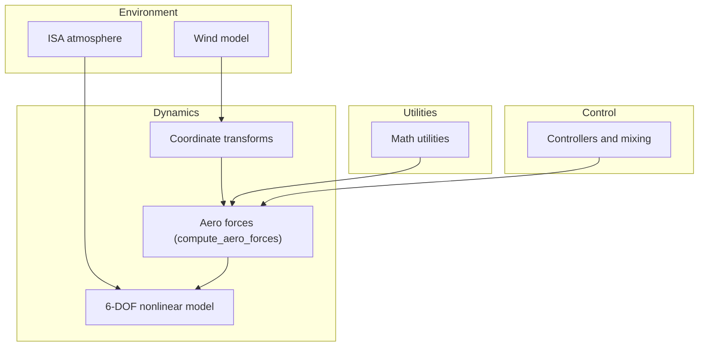
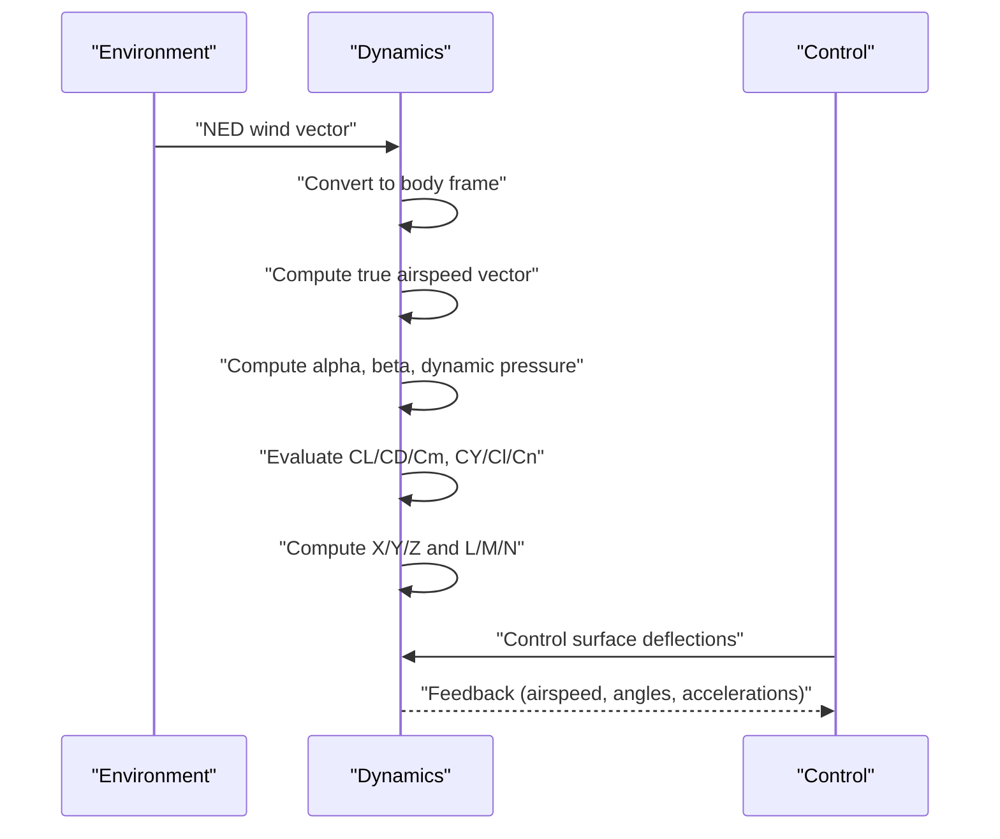
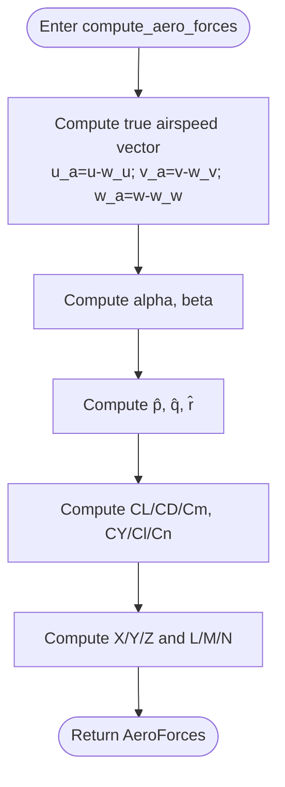
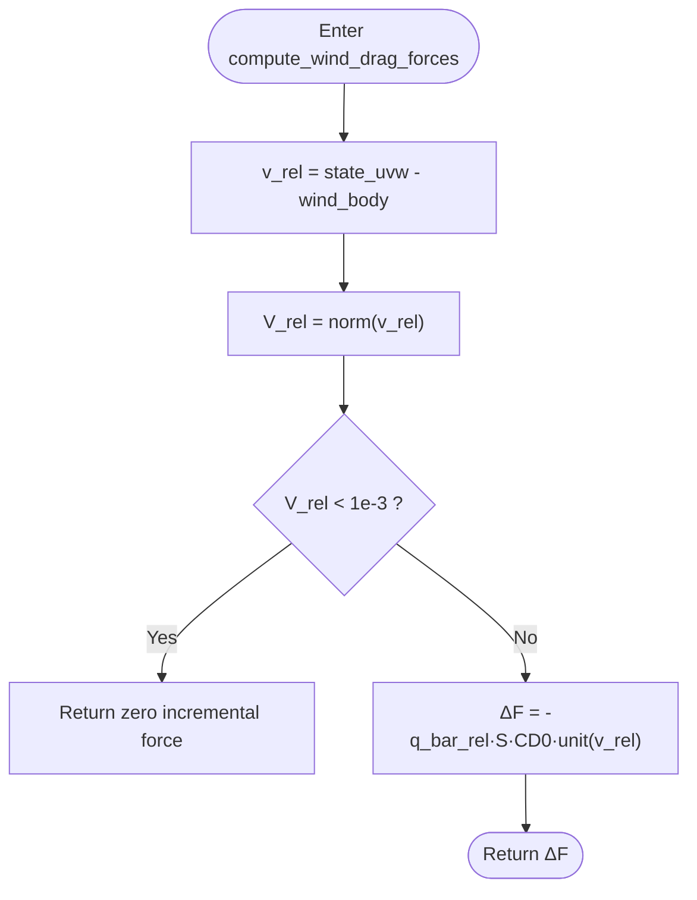
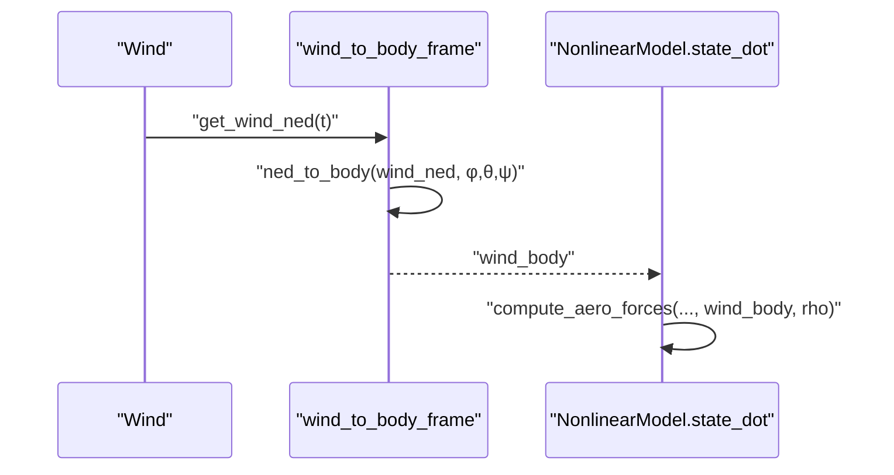
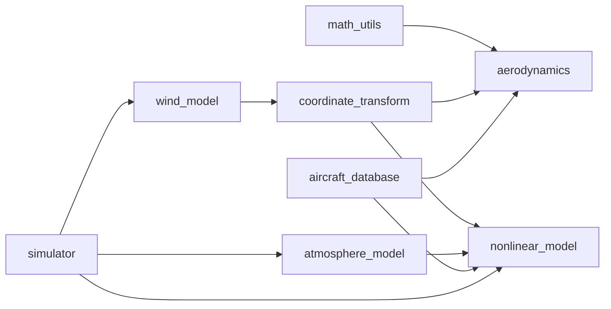

# Aerodynamic Force Calculations

<cite>
**Referenced Files in This Document**
- [aerodynamics.py](file://src/dynamics/aerodynamics.py)
- [aerodynamic_forces.py](file://src/environment/aerodynamic_forces.py)
- [aircraft_database.py](file://src/models/aircraft_database.py)
- [math_utils.py](file://src/utils/math_utils.py)
- [coordinate_transform.py](file://src/dynamics/coordinate_transform.py)
- [wind_model.py](file://src/environment/wind_model.py)
- [atmosphere_model.py](file://src/environment/atmosphere_model.py)
- [nonlinear_model.py](file://src/dynamics/nonlinear_model.py)
- [aircraft.yaml](file://config/aircraft.yaml)
- [control_params.yaml](file://config/control_params.yaml)
</cite>

## Table of Contents
1. [Introduction](#introduction)
2. [Project Structure](#project-structure)
3. [Core Components](#core-components)
4. [Architecture Overview](#architecture-overview)
5. [Detailed Component Analysis](#detailed-component-analysis)
6. [Dependency Analysis](#dependency-analysis)
7. [Performance Considerations](#performance-considerations)
8. [Troubleshooting Guide](#troubleshooting-guide)
9. [Conclusion](#conclusion)
10. [Appendices](#appendices)

## Introduction
This document explains the aerodynamic force and moment calculation pipeline used in the fixed-wing simulator. It covers how lift, drag, and side forces are computed from airspeed, angle of attack, sideslip, and control surface deflections. It documents the coefficient model (linear polynomial dependence on angles and non-dimensional angular rates), the transformation of forces and moments into body-fixed coordinates, and the integration of environmental effects such as wind and density variations. Practical guidance is included for validating coefficients against wind tunnel or CFD data, integrating wind effects, calibrating models, and ensuring numerical stability and efficiency.

## Project Structure
The aerodynamic computation sits at the intersection of environment, dynamics, and control layers:
- Environment: wind models and standard atmosphere
- Dynamics: aerodynamic force/moment computation and 6-DOF equations of motion
- Control: feedback loops that command control surfaces
- Utilities: math utilities for angles, rotations, and dynamic pressure

**Diagram sources**
- [wind_model.py](file://src/environment/wind_model.py#L18-L113)
- [coordinate_transform.py](file://src/dynamics/coordinate_transform.py#L39-L70)
- [aerodynamics.py](file://src/dynamics/aerodynamics.py#L35-L148)
- [nonlinear_model.py](file://src/dynamics/nonlinear_model.py#L104-L386)
- [math_utils.py](file://src/utils/math_utils.py#L107-L124)

**Section sources**
- [wind_model.py](file://src/environment/wind_model.py#L18-L113)
- [coordinate_transform.py](file://src/dynamics/coordinate_transform.py#L39-L70)
- [aerodynamics.py](file://src/dynamics/aerodynamics.py#L35-L148)
- [nonlinear_model.py](file://src/dynamics/nonlinear_model.py#L104-L386)
- [math_utils.py](file://src/utils/math_utils.py#L107-L124)

## Core Components
- Aerodynamic force and moment computation in body-fixed frame using linear polynomial dependence on angle of attack, sideslip, non-dimensional angular rates, and control surface deflections.
- Wind-induced incremental drag calculation for perturbation analysis.
- Wind vector generation in NED and conversion to body-fixed frame.
- Atmospheric density computation for dynamic pressure updates.
- Aircraft parameter database providing geometry, inertia, and aerodynamic coefficients.

**Section sources**
- [aerodynamics.py](file://src/dynamics/aerodynamics.py#L35-L148)
- [aerodynamic_forces.py](file://src/environment/aerodynamic_forces.py#L13-L54)
- [wind_model.py](file://src/environment/wind_model.py#L18-L113)
- [coordinate_transform.py](file://src/dynamics/coordinate_transform.py#L39-L70)
- [atmosphere_model.py](file://src/environment/atmosphere_model.py#L48-L77)
- [aircraft_database.py](file://src/models/aircraft_database.py#L143-L166)

## Architecture Overview
The aerodynamic computation chain integrates environmental and geometric inputs to produce forces and moments in body-fixed coordinates, which feed the 6-DOF equations of motion.

**Diagram sources**
- [nonlinear_model.py](file://src/dynamics/nonlinear_model.py#L160-L203)
- [aerodynamics.py](file://src/dynamics/aerodynamics.py#L35-L148)
- [coordinate_transform.py](file://src/dynamics/coordinate_transform.py#L39-L70)

## Detailed Component Analysis

### Aerodynamic Force and Moment Model
The core computation evaluates non-dimensional coefficients as linear polynomials in angle of attack, sideslip, non-dimensional angular rates, and control surface deflections. Forces and moments are then computed from dynamic pressure, reference area, and geometry.

Key steps:
- Compute true airspeed vector by subtracting wind in body frame from body velocity.
- Calculate angle of attack and sideslip using robust numerical utilities.
- Compute non-dimensional angular rates using reference speed and length scales.
- Evaluate CL, CD, Cm (longitudinal) and CY, Cl, Cn (lateral-directional) as linear combinations of coefficients and states.
- Transform to body-fixed forces and moments using dynamic pressure and geometry.

**Diagram sources**
- [aerodynamics.py](file://src/dynamics/aerodynamics.py#L68-L147)
- [math_utils.py](file://src/utils/math_utils.py#L107-L124)

**Section sources**
- [aerodynamics.py](file://src/dynamics/aerodynamics.py#L35-L148)
- [math_utils.py](file://src/utils/math_utils.py#L107-L124)

### Wind-Induced Incremental Drag
This module computes incremental body-fixed forces caused by wind relative to the aircraft’s motion, useful for sensitivity and perturbation analysis.

Method:
- Compute relative velocity in body frame and its norm.
- If the norm is below a small threshold, return zero incremental force.
- Otherwise, compute magnitude proportional to dynamic pressure of relative velocity, area, and baseline drag coefficient, and scale by the unit vector of relative velocity with appropriate sign.

**Diagram sources**
- [aerodynamic_forces.py](file://src/environment/aerodynamic_forces.py#L13-L54)

**Section sources**
- [aerodynamic_forces.py](file://src/environment/aerodynamic_forces.py#L13-L54)

### Wind Field Models and Coordinate Transforms
Wind models support several types:
- NONE: zero wind
- FIXED: constant wind vector
- SINE: sinusoidal harmonics per axis
- RANDOMSINE: random mean plus sinusoidal harmonics

Coordinate transforms convert between NED and body-fixed frames using direction cosine matrices. The wind body velocity is obtained by rotating the NED wind vector using the transpose of the DCM.

**Diagram sources**
- [wind_model.py](file://src/environment/wind_model.py#L76-L108)
- [coordinate_transform.py](file://src/dynamics/coordinate_transform.py#L39-L53)
- [nonlinear_model.py](file://src/dynamics/nonlinear_model.py#L160-L203)

**Section sources**
- [wind_model.py](file://src/environment/wind_model.py#L18-L113)
- [coordinate_transform.py](file://src/dynamics/coordinate_transform.py#L39-L70)
- [nonlinear_model.py](file://src/dynamics/nonlinear_model.py#L160-L203)

### Atmospheric Density and Dynamic Pressure
Density varies with altitude according to the International Standard Atmosphere (ISA). Dynamic pressure is recomputed at each step using current altitude-derived density and computed airspeed.

**Section sources**
- [atmosphere_model.py](file://src/environment/atmosphere_model.py#L48-L77)
- [nonlinear_model.py](file://src/dynamics/nonlinear_model.py#L336-L337)

### Aircraft Parameter Database and Derived Fields
The aircraft database supplies geometry, inertia, and aerodynamic coefficients. On retrieval, derived quantities are injected:
- Reference speed U0 = Mach × speed of sound
- Sea-level density rho = 1.225 kg/m³
- Dynamic pressure q_bar = 0.5 · rho · U0²

These are used by the aerodynamics and nonlinear model.

**Section sources**
- [aircraft_database.py](file://src/models/aircraft_database.py#L143-L166)
- [aircraft.yaml](file://config/aircraft.yaml#L1-L13)

## Dependency Analysis
The aerodynamic computation depends on:
- Math utilities for angles, sideslip, and dynamic pressure
- Aircraft parameters for geometry and coefficients
- Wind model outputs converted to body-fixed frame
- Atmospheric density for dynamic pressure

**Diagram sources**
- [math_utils.py](file://src/utils/math_utils.py#L107-L124)
- [aerodynamics.py](file://src/dynamics/aerodynamics.py#L13-L14)
- [coordinate_transform.py](file://src/dynamics/coordinate_transform.py#L11-L16)
- [nonlinear_model.py](file://src/dynamics/nonlinear_model.py#L27-L28)
- [wind_model.py](file://src/environment/wind_model.py#L14-L15)
- [atmosphere_model.py](file://src/environment/atmosphere_model.py#L8-L9)
- [aircraft_database.py](file://src/models/aircraft_database.py#L12-L20)
- [simulator.py](file://src/simulation/simulator.py#L33-L52)

**Section sources**
- [simulator.py](file://src/simulation/simulator.py#L33-L52)
- [nonlinear_model.py](file://src/dynamics/nonlinear_model.py#L27-L28)
- [aerodynamics.py](file://src/dynamics/aerodynamics.py#L13-L14)

## Performance Considerations
- Computational complexity: The aerodynamic evaluation is O(1), dominated by trigonometric and linear operations.
- Numerical stability:
  - Use of atan2 and arcsin ensures continuous and bounded angles.
  - Side slip is clamped for very small airspeed to avoid numerical issues.
  - Non-dimensional angular rates are normalized by reference length and speed to maintain conditioning.
  - Wind-induced incremental drag returns zero below a small relative speed threshold to avoid noise amplification.
- Efficiency tips:
  - Reuse precomputed quantities (e.g., DCM, dynamic pressure) when feasible.
  - Avoid redundant trigonometric calls in tight loops.
  - Update density from ISA at each step for realistic but minimal overhead.

**Section sources**
- [math_utils.py](file://src/utils/math_utils.py#L107-L124)
- [aerodynamic_forces.py](file://src/environment/aerodynamic_forces.py#L42-L43)
- [nonlinear_model.py](file://src/dynamics/nonlinear_model.py#L260-L281)
- [atmosphere_model.py](file://src/environment/atmosphere_model.py#L48-L77)

## Troubleshooting Guide
Common issues and remedies:
- Zero or near-zero airspeed:
  - Verify that wind body velocity does not cancel body velocity.
  - Confirm wind model type and direction settings.
- Unexpected angles or NaNs:
  - Ensure side slip is computed with proper clamping for small airspeed.
  - Confirm inputs are in radians and within expected ranges.
- Incorrect forces or moments:
  - Validate control surface deflections and coefficient signs.
  - Check that parameters are loaded from the database and include derived fields.
- Density inconsistencies:
  - Confirm altitude sign convention and ISA interface usage.
- Wind effects not visible:
  - For RANDOMSINE, increase simulation duration to observe statistical convergence.
  - Verify wind direction and speed settings.

**Section sources**
- [math_utils.py](file://src/utils/math_utils.py#L107-L124)
- [aerodynamic_forces.py](file://src/environment/aerodynamic_forces.py#L42-L43)
- [atmosphere_model.py](file://src/environment/atmosphere_model.py#L48-L77)
- [simulator.py](file://src/simulation/simulator.py#L336-L337)

## Conclusion
The aerodynamic subsystem combines a robust, linearized coefficient model with accurate angle computation and coordinate transforms. Wind and atmospheric effects are integrated cleanly, enabling realistic simulations and effective control loop validation. The design emphasizes numerical stability, computational efficiency, and straightforward parameterization for calibration and testing.

## Appendices

### Implementation Details: Coefficient Model and Transformation
- Coefficient model:
  - Longitudinal: CL, CD, Cm depend on α, q̂, and elevator deflection.
  - Lateral-directional: CY, Cl, Cn depend on β, p̂, r̂, aileron, and rudder deflections.
- Transformation:
  - Forces: X, Y, Z computed from dynamic pressure, area, and coefficients.
  - Moments: L, M, N computed using reference length scales and coefficients.

**Section sources**
- [aerodynamics.py](file://src/dynamics/aerodynamics.py#L90-L127)
- [aerodynamics.py](file://src/dynamics/aerodynamics.py#L130-L146)

### Practical Examples: Validation, Wind Tunnel Integration, Calibration
- Validation against wind tunnel or CFD:
  - Fit CL and CD polynomials to tabular data; adjust CD0 and shape factors.
  - Compare steady-state trim and response to step inputs with experimentally measured data.
- Wind tunnel integration:
  - Use wind table data to define CL/CD versus α and reconcile with the polynomial model.
  - Calibrate S and CD0 using measured drag at known speeds and densities.
- Model calibration procedures:
  - Perform trim analysis at target speeds and altitudes; adjust coefficients to match measured lift and pitching moment curves.
  - Introduce controlled disturbances (step inputs) and compare open-loop vs closed-loop responses to refine control gains.

**Section sources**
- [aircraft_database.py](file://src/models/aircraft_database.py#L143-L166)
- [nonlinear_model.py](file://src/dynamics/nonlinear_model.py#L132-L154)

### Edge Cases and Stall Modeling
- Current implementation:
  - Uses linear polynomial models in α, β, p̂, q̂, r̂ and control deflections.
  - No explicit stall model or hysteresis in this module.
- Recommendations:
  - Introduce a maximum CL bound as a function of α near stall.
  - Add hysteresis or separation onset logic if simulating stall shedding.
  - Incorporate CD bump near stall and reduction in CL slope.

[No sources needed since this section provides general guidance]

### Compressibility, Reynolds Number, and Damping Effects
- Compressibility:
  - The database supplies Mach number; U0 is derived from Mach × speed of sound.
  - For transonic/higher Mach regimes, consider local Mach-based corrections to coefficients.
- Reynolds number:
  - Not explicitly modeled; can be approximated via dynamic viscosity from ISA and airspeed.
  - For low-Re effects (e.g., stall shift), introduce empirical adjustments to CL/CD.
- Damping:
  - q̂ terms capture pitch damping; ensure realistic values from wind tunnel data.
  - Lateral damping (p̂, r̂) influences roll and yaw stability.

**Section sources**
- [aircraft_database.py](file://src/models/aircraft_database.py#L160-L166)
- [nonlinear_model.py](file://src/dynamics/nonlinear_model.py#L121-L127)

### Control Surface Effectiveness and Mixing
- Elevator effectiveness appears in CL_deltae and Cm_deltae.
- Aileron effectiveness appears in Clda and Cldr; rudder in CYdr, Cndr.
- Control authority limits and mixing are handled by the control layer; ensure deflections remain within physically meaningful bounds.

**Section sources**
- [aerodynamics.py](file://src/dynamics/aerodynamics.py#L94-L123)
- [control_params.yaml](file://config/control_params.yaml#L24-L44)