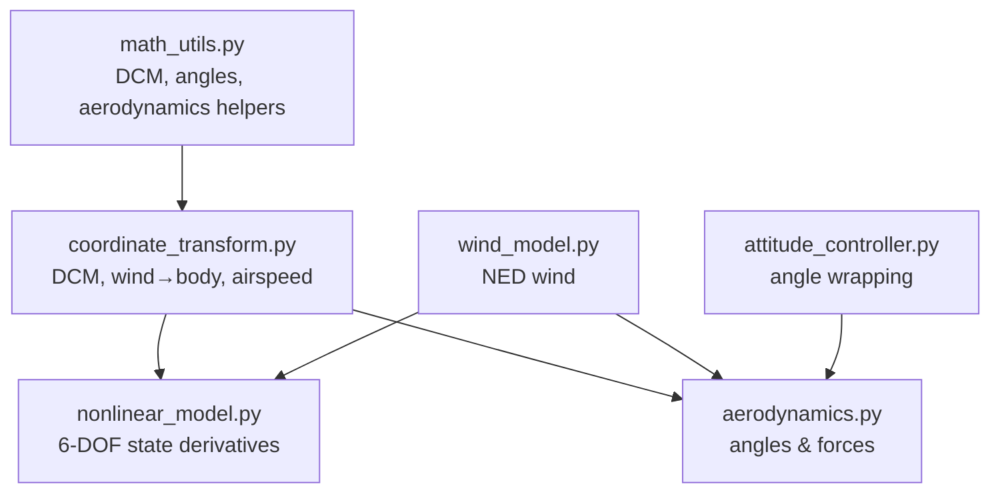
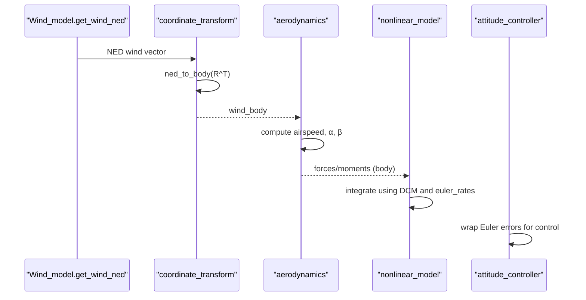
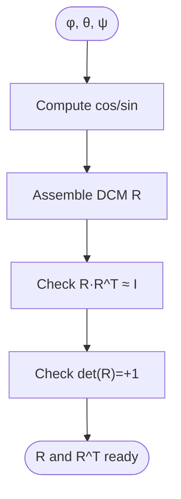
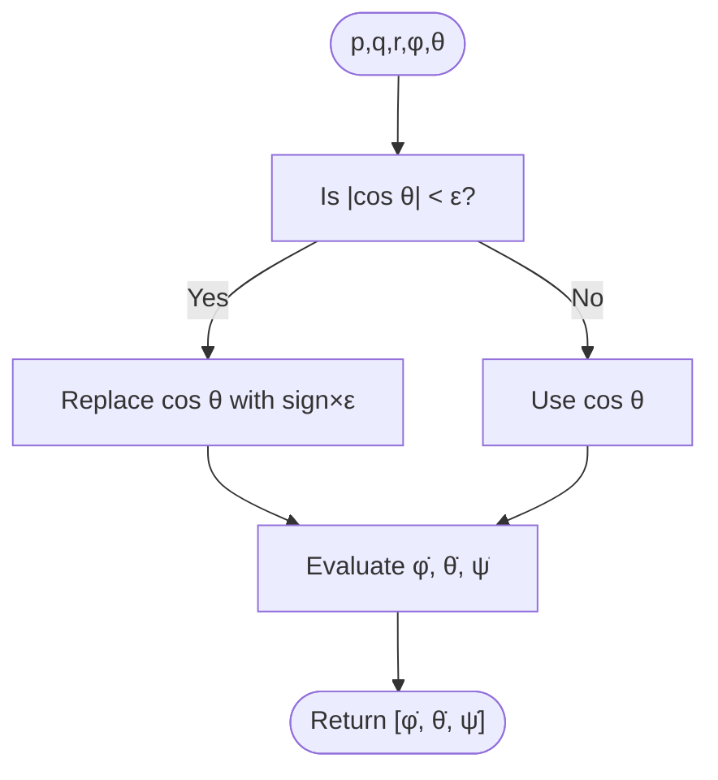
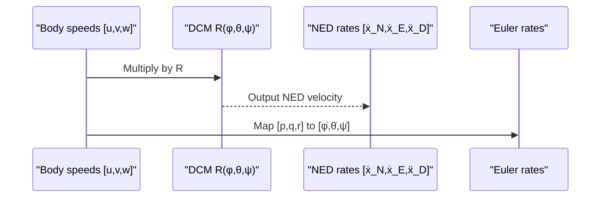
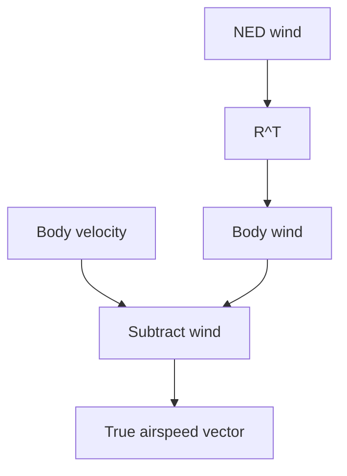
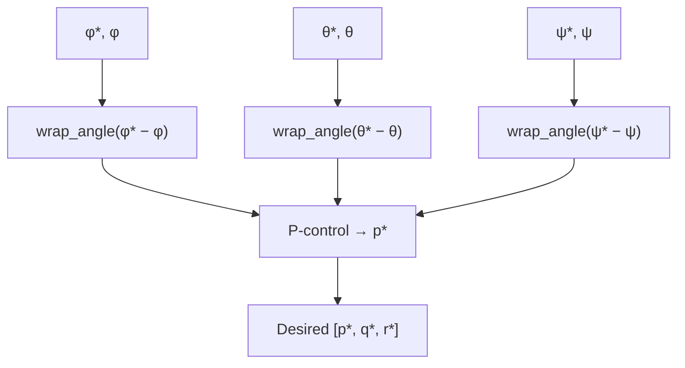
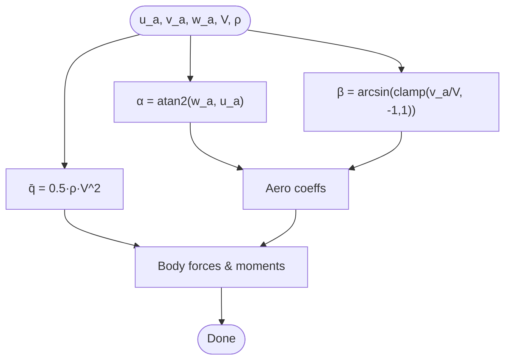
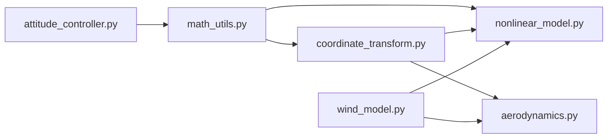

# Coordinate System Transformations

<cite>
**Referenced Files in This Document**
- [coordinate_transform.py](file://src/dynamics/coordinate_transform.py)
- [math_utils.py](file://src/utils/math_utils.py)
- [nonlinear_model.py](file://src/dynamics/nonlinear_model.py)
- [aerodynamics.py](file://src/dynamics/aerodynamics.py)
- [wind_model.py](file://src/environment/wind_model.py)
- [attitude_controller.py](file://src/control/attitude_controller.py)
- [test_dynamics.py](file://tests/test_dynamics.py)
</cite>

## Table of Contents
1. [Introduction](#introduction)
2. [Project Structure](#project-structure)
3. [Core Components](#core-components)
4. [Architecture Overview](#architecture-overview)
5. [Detailed Component Analysis](#detailed-component-analysis)
6. [Dependency Analysis](#dependency-analysis)
7. [Performance Considerations](#performance-considerations)
8. [Troubleshooting Guide](#troubleshooting-guide)
9. [Conclusion](#conclusion)
10. [Appendices](#appendices)

## Introduction
This document explains the coordinate system transformations used in flight dynamics within the simulator. It covers the conversion between inertial-like NED (North-East-Down), Earth-fixed (NED), local horizontal (NED), body-fixed, and wind axes. It documents Euler angle representations using a 3-2-1 (Z-Y-X) rotation sequence, intrinsic rotations, and singularities handling. It also details direction cosine matrices (DCMs), vector transformations for velocity, acceleration, and angular rates, and provides implementation insights for trigonometric computations, numerical stability, and angle normalization. Practical examples illustrate frame conversions, attitude updates, and vector transformations, along with common pitfalls and optimizations.

## Project Structure
The coordinate transformation logic is centered around two modules:
- math_utils: Provides rotation matrices, angle wrapping, saturation, and aerodynamic helpers.
- coordinate_transform: Exposes convenience functions for DCM construction, wind-to-body transforms, and true airspeed computation.

These modules integrate with:
- nonlinear_model: Uses DCMs and Euler rates for position and attitude updates.
- aerodynamics: Computes airspeed and aerodynamic angles in the body frame.
- wind_model: Generates NED wind vectors consumed by coordinate_transform.
- attitude_controller: Uses angle wrapping for attitude error computation.

**Diagram sources**
- [math_utils.py](file://src/utils/math_utils.py#L43-L123)
- [coordinate_transform.py](file://src/dynamics/coordinate_transform.py#L29-L70)
- [nonlinear_model.py](file://src/dynamics/nonlinear_model.py#L240-L281)
- [aerodynamics.py](file://src/dynamics/aerodynamics.py#L60-L148)
- [wind_model.py](file://src/environment/wind_model.py#L76-L108)
- [attitude_controller.py](file://src/control/attitude_controller.py#L107-L122)

**Section sources**
- [coordinate_transform.py](file://src/dynamics/coordinate_transform.py#L1-L70)
- [math_utils.py](file://src/utils/math_utils.py#L1-L124)
- [nonlinear_model.py](file://src/dynamics/nonlinear_model.py#L240-L281)
- [aerodynamics.py](file://src/dynamics/aerodynamics.py#L60-L148)
- [wind_model.py](file://src/environment/wind_model.py#L76-L108)
- [attitude_controller.py](file://src/control/attitude_controller.py#L107-L122)

## Core Components
- Direction cosine matrix (DCM) and 3-2-1 Euler angles: Constructs the rotation matrix from roll φ, pitch θ, and yaw ψ, mapping body vectors to NED coordinates.
- Vector transforms: body_to_ned and ned_to_body via matrix multiplication with the DCM and its transpose.
- Euler angle rates: Translates body angular rates [p, q, r] to [φ̇, θ̇, ψ̇] with singularity protection near θ = ±90°.
- Wind-to-body conversion: Converts NED wind vectors to body coordinates using the transpose of the DCM.
- True airspeed: Computes the airspeed vector by subtracting body-frame wind from body-frame velocity.
- Aerodynamic angles: Computes angle-of-attack (α) and sideslip angle (β) from body velocities and airspeed.

**Section sources**
- [coordinate_transform.py](file://src/dynamics/coordinate_transform.py#L29-L70)
- [math_utils.py](file://src/utils/math_utils.py#L43-L123)
- [nonlinear_model.py](file://src/dynamics/nonlinear_model.py#L240-L248)
- [aerodynamics.py](file://src/dynamics/aerodynamics.py#L68-L124)

## Architecture Overview
The coordinate transformation pipeline connects wind generation, coordinate transforms, aerodynamics, and dynamics:
- Wind_model generates NED wind vectors.
- coordinate_transform converts NED wind to body coordinates.
- aerodynamics computes airspeed and angles in the body frame.
- nonlinear_model integrates equations of motion using DCMs for kinematic updates.
- attitude_controller normalizes Euler angle errors for control commands.

**Diagram sources**
- [wind_model.py](file://src/environment/wind_model.py#L76-L108)
- [coordinate_transform.py](file://src/dynamics/coordinate_transform.py#L39-L70)
- [aerodynamics.py](file://src/dynamics/aerodynamics.py#L68-L124)
- [nonlinear_model.py](file://src/dynamics/nonlinear_model.py#L240-L281)
- [attitude_controller.py](file://src/control/attitude_controller.py#L107-L122)

## Detailed Component Analysis

### Euler Angles, DCMs, and Rotation Conventions
- Convention: 3-2-1 (Z-Y-X) Euler sequence with φ (roll), θ (pitch), ψ (yaw). The DCM maps body vectors to NED coordinates.
- Implementation: rotation_matrix_321 constructs the matrix from cos/sin of φ, θ, ψ. body_to_ned applies R; ned_to_body applies R^T.
- Verification: unit tests confirm identity at zero angles, orthogonality (R·R^T ≈ I), determinant = +1, and round-trip consistency.

**Diagram sources**
- [math_utils.py](file://src/utils/math_utils.py#L43-L66)
- [test_dynamics.py](file://tests/test_dynamics.py#L69-L84)

**Section sources**
- [math_utils.py](file://src/utils/math_utils.py#L43-L76)
- [test_dynamics.py](file://tests/test_dynamics.py#L69-L84)

### Euler Rate Mapping and Singularity Handling
- Mapping: From [p, q, r] to [φ̇, θ̇, ψ̇] uses analytic expressions involving tan θ and sin/cos φ terms.
- Protection: Near θ = ±90°, cos θ is clamped to ±ε to avoid division by zero.
- Tests: Confirm that at θ = 0, Euler rates reduce to body rates; otherwise mapping holds.

**Diagram sources**
- [math_utils.py](file://src/utils/math_utils.py#L79-L100)
- [test_dynamics.py](file://tests/test_dynamics.py#L107-L113)

**Section sources**
- [math_utils.py](file://src/utils/math_utils.py#L79-L100)
- [test_dynamics.py](file://tests/test_dynamics.py#L107-L113)

### Velocity, Acceleration, and Angular Rate Transformations
- Velocity: DCM transforms body speeds [u, v, w] to NED: [ẋ_N, ẋ_E, ẍ_D] = R · [u, v, w].
- Acceleration: In the 6-DOF model, accelerations are solved in the body frame; DCM maps to NED for position updates.
- Angular rate: euler_rates maps [p, q, r] to [φ̇, θ̇, ψ̇] for attitude evolution.

**Diagram sources**
- [nonlinear_model.py](file://src/dynamics/nonlinear_model.py#L246-L248)
- [math_utils.py](file://src/utils/math_utils.py#L69-L76)
- [math_utils.py](file://src/utils/math_utils.py#L79-L100)

**Section sources**
- [nonlinear_model.py](file://src/dynamics/nonlinear_model.py#L240-L255)
- [math_utils.py](file://src/utils/math_utils.py#L69-L100)

### Wind Field to Body Coordinates and True Airspeed
- Wind generation: Wind.get_wind_ned returns NED wind vectors for various wind types.
- Conversion: ned_to_body transforms NED wind to body coordinates using R^T.
- Airspeed: True airspeed vector = body velocity − body wind velocity; aerodynamics uses this for α, β and dynamic pressure.

**Diagram sources**
- [wind_model.py](file://src/environment/wind_model.py#L76-L108)
- [coordinate_transform.py](file://src/dynamics/coordinate_transform.py#L39-L70)
- [aerodynamics.py](file://src/dynamics/aerodynamics.py#L68-L84)

**Section sources**
- [wind_model.py](file://src/environment/wind_model.py#L76-L108)
- [coordinate_transform.py](file://src/dynamics/coordinate_transform.py#L39-L70)
- [aerodynamics.py](file://src/dynamics/aerodynamics.py#L68-L84)

### Attitude Updates and Angle Normalization
- Attitude controller computes desired angular rates from Euler angle errors.
- Angle wrapping ensures errors remain in [-π, π], preventing discontinuities across the ±π boundary.
- This normalization is essential for smooth control and accurate attitude tracking.

**Diagram sources**
- [attitude_controller.py](file://src/control/attitude_controller.py#L107-L122)
- [math_utils.py](file://src/utils/math_utils.py#L13-L25)

**Section sources**
- [attitude_controller.py](file://src/control/attitude_controller.py#L81-L122)
- [math_utils.py](file://src/utils/math_utils.py#L13-L25)

### Aerodynamic Angles and Dynamic Pressure
- Angle of attack (α): computed via arctan2(w_a, u_a).
- Sideslip angle (β): computed via arcsin(clamp(v_a / V, −1, 1)); airspeed is numerically clamped to prevent division by zero.
- Dynamic pressure (q̄): computed as 0.5 · ρ · V^2.

**Diagram sources**
- [aerodynamics.py](file://src/dynamics/aerodynamics.py#L68-L124)
- [math_utils.py](file://src/utils/math_utils.py#L107-L123)

**Section sources**
- [aerodynamics.py](file://src/dynamics/aerodynamics.py#L68-L124)
- [math_utils.py](file://src/utils/math_utils.py#L107-L123)

## Dependency Analysis
- coordinate_transform depends on math_utils for DCM construction, vector transforms, and Euler rates.
- nonlinear_model depends on math_utils for DCM and euler_rates and integrates them into state derivatives.
- aerodynamics depends on math_utils for α, β, and q̄; it consumes wind_body from coordinate_transform.
- wind_model independently produces NED wind; during simulation, nonlinear_model optionally converts it to body coordinates via DCM transpose.
- attitude_controller depends on math_utils for angle wrapping.

**Diagram sources**
- [coordinate_transform.py](file://src/dynamics/coordinate_transform.py#L10-L16)
- [math_utils.py](file://src/utils/math_utils.py#L1-L124)
- [nonlinear_model.py](file://src/dynamics/nonlinear_model.py#L27-L28)
- [aerodynamics.py](file://src/dynamics/aerodynamics.py#L11-L13)
- [wind_model.py](file://src/environment/wind_model.py#L1-L113)
- [attitude_controller.py](file://src/control/attitude_controller.py#L107-L122)

**Section sources**
- [coordinate_transform.py](file://src/dynamics/coordinate_transform.py#L10-L16)
- [math_utils.py](file://src/utils/math_utils.py#L1-L124)
- [nonlinear_model.py](file://src/dynamics/nonlinear_model.py#L27-L28)
- [aerodynamics.py](file://src/dynamics/aerodynamics.py#L11-L13)
- [wind_model.py](file://src/environment/wind_model.py#L1-L113)
- [attitude_controller.py](file://src/control/attitude_controller.py#L107-L122)

## Performance Considerations
- Computational cost: DCM assembly and trigonometric calls are O(1); repeated per integration step.
- Memory: Temporary arrays for DCM, wind/body vectors, and airspeed grow linearly with simulation steps.
- Stability: Euler-rate mapping uses ε-clamping near singularities; sideslip angle uses numerical clamping to avoid NaN.
- Optimization tips:
  - Reuse intermediate results (e.g., cos/sin) when computing multiple DCMs.
  - Precompute wind components where appropriate.
  - Prefer vectorized operations (already used with NumPy).

[No sources needed since this section provides general guidance]

## Troubleshooting Guide
- DCM anomalies:
  - Symptom: Drifting positions or unstable attitude.
  - Action: Verify DCM orthogonality and determinant; ensure correct R vs R^T usage; check zero-angle identity.
- Euler-rate divergence:
  - Symptom: Instability near vertical attitudes (θ ≈ ±90°).
  - Action: Confirm ε-protection is active; limit operating envelope to avoid singular regions.
- Airspeed inconsistencies:
  - Symptom: Incorrect forces or unrealistic α/β.
  - Action: Ensure wind_body is derived from R^T · wind_ned; confirm subtraction order and units.
- Navigation/tracking errors:
  - Symptom: Incorrect ground track due to wind or sideslip.
  - Action: Use [u, v] projection for ground course; apply wrap_angle to Euler errors.

**Section sources**
- [test_dynamics.py](file://tests/test_dynamics.py#L69-L121)
- [math_utils.py](file://src/utils/math_utils.py#L79-L100)
- [coordinate_transform.py](file://src/dynamics/coordinate_transform.py#L39-L70)
- [aerodynamics.py](file://src/dynamics/aerodynamics.py#L68-L84)
- [attitude_controller.py](file://src/control/attitude_controller.py#L107-L122)

## Conclusion
The simulator employs a robust 3-2-1 Euler-angle framework with DCMs to consistently transform between NED and body coordinates. Numerical protections address singularities in Euler-rate mapping, while angle wrapping ensures stable control loops. The integration of wind modeling, coordinate transforms, aerodynamics, and dynamics yields accurate and efficient fixed-wing simulations. For advanced scenarios, consider extending to quaternion-based representations to further mitigate singularities and enhance numerical conditioning.

[No sources needed since this section summarizes without analyzing specific files]

## Appendices

### Practical Examples and Workflows
- Frame conversions:
  - NED wind → body wind: ned_to_body using R^T.
  - Body velocity → NED velocity: body_to_ned using R.
- Attitude updates:
  - Compute Euler errors with wrap_angle; feed to PID to obtain [p*, q*, r*].
- Vector transformations:
  - Use DCM for kinematic updates; use euler_rates for attitude evolution.

[No sources needed since this section doesn't analyze specific files]

### Mathematical Definitions and Notes
- Euler angles: φ (roll), θ (pitch), ψ (yaw) with 3-2-1 sequence.
- DCM: Proper orthogonal matrix with determinant +1; R^T for inverse transforms.
- Angles: wrap_angle constrains to [-π, π]; wrap_angle_deg constrains to [-180, 180].

[No sources needed since this section doesn't analyze specific files]