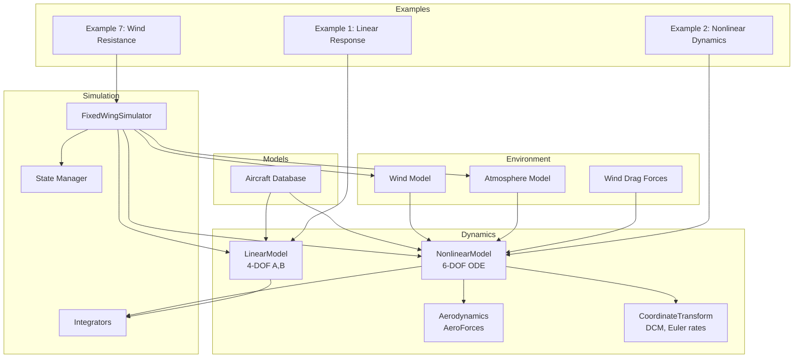
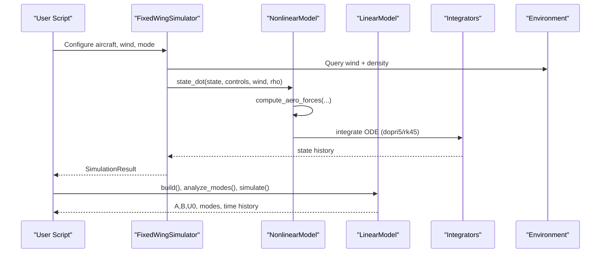
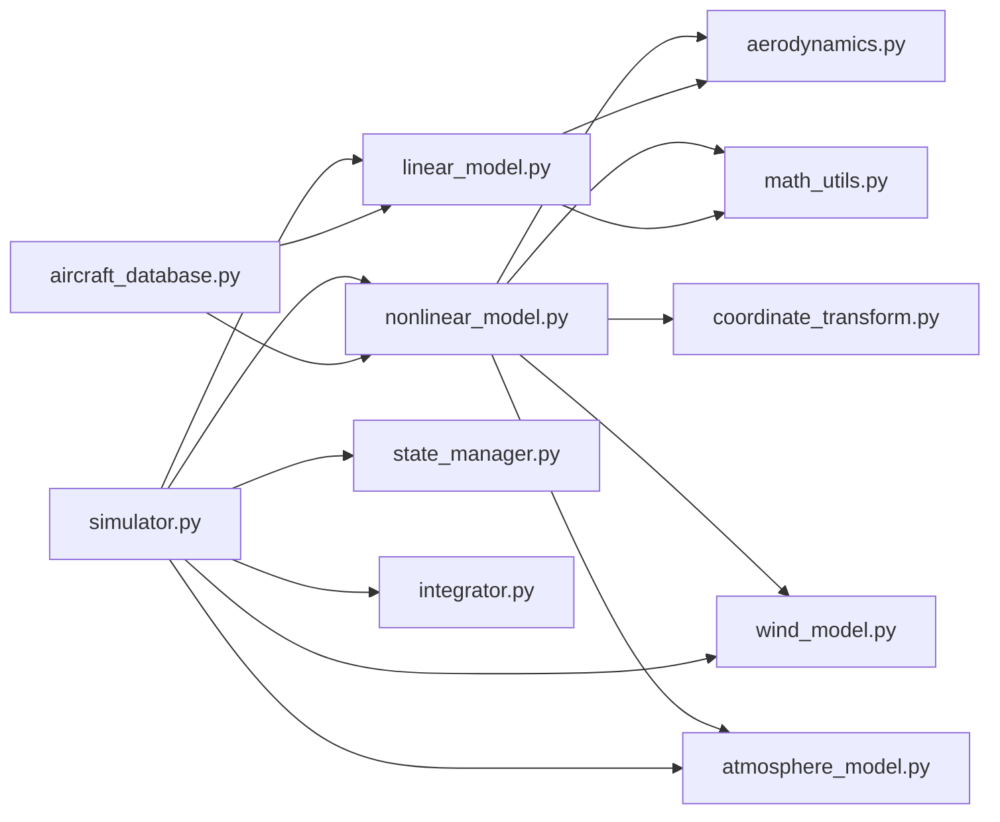

# Dynamics and Flight Mechanics

<cite>
**Referenced Files in This Document**
- [nonlinear_model.py](file://src/dynamics/nonlinear_model.py)
- [linear_model.py](file://src/dynamics/linear_model.py)
- [aerodynamics.py](file://src/dynamics/aerodynamics.py)
- [coordinate_transform.py](file://src/dynamics/coordinate_transform.py)
- [math_utils.py](file://src/utils/math_utils.py)
- [aircraft_database.py](file://src/models/aircraft_database.py)
- [wind_model.py](file://src/environment/wind_model.py)
- [atmosphere_model.py](file://src/environment/atmosphere_model.py)
- [aerodynamic_forces.py](file://src/environment/aerodynamic_forces.py)
- [simulator.py](file://src/simulation/simulator.py)
- [state_manager.py](file://src/simulation/state_manager.py)
- [integrator.py](file://src/simulation/integrator.py)
- [example_1_linear_response.py](file://examples/example_1_linear_response.py)
- [example_2_nonlinear_dynamics.py](file://examples/example_2_nonlinear_dynamics.py)
- [example_7_wind_resistance.py](file://examples/example_7_wind_resistance.py)
- [aircraft.yaml](file://config/aircraft.yaml)
- [simulation.yaml](file://config/simulation.yaml)
</cite>

## Table of Contents
1. [Introduction](#introduction)
2. [Project Structure](#project-structure)
3. [Core Components](#core-components)
4. [Architecture Overview](#architecture-overview)
5. [Detailed Component Analysis](#detailed-component-analysis)
6. [Dependency Analysis](#dependency-analysis)
7. [Performance Considerations](#performance-considerations)
8. [Troubleshooting Guide](#troubleshooting-guide)
9. [Conclusion](#conclusion)
10. [Appendices](#appendices)

## Introduction
This document explains the flight dynamics and mechanics system implemented in the FixedWingSimulator. It covers:
- The 6-degree-of-freedom (6-DOF) nonlinear equations of motion in NED coordinates
- The 4-degree-of-freedom (4-DOF) linearized longitudinal model for control design
- Aerodynamic force and moment computations, including wind effects
- Coordinate transformations and Euler angle kinematics
- Implementation details, numerical methods, and practical usage examples
- Parameter sensitivity analysis and validation procedures
- Computational efficiency, numerical stability, and accuracy considerations

## Project Structure
The dynamics system is organized around dedicated modules:
- Dynamics: nonlinear and linear models, aerodynamics, and coordinate transforms
- Environment: wind and atmosphere models
- Simulation: integrators, state containers, and the main simulator orchestrating all layers
- Examples: runnable scripts demonstrating open-loop and closed-loop analyses

**Diagram sources**
- [nonlinear_model.py](file://src/dynamics/nonlinear_model.py#L104-L386)
- [linear_model.py](file://src/dynamics/linear_model.py#L107-L319)
- [aerodynamics.py](file://src/dynamics/aerodynamics.py#L35-L148)
- [coordinate_transform.py](file://src/dynamics/coordinate_transform.py#L29-L70)
- [wind_model.py](file://src/environment/wind_model.py#L18-L113)
- [atmosphere_model.py](file://src/environment/atmosphere_model.py#L24-L77)
- [aerodynamic_forces.py](file://src/environment/aerodynamic_forces.py#L13-L54)
- [simulator.py](file://src/simulation/simulator.py#L115-L200)
- [state_manager.py](file://src/simulation/state_manager.py#L16-L193)
- [integrator.py](file://src/simulation/integrator.py#L17-L108)
- [aircraft_database.py](file://src/models/aircraft_database.py#L143-L167)
- [example_1_linear_response.py](file://examples/example_1_linear_response.py#L83-L206)
- [example_2_nonlinear_dynamics.py](file://examples/example_2_nonlinear_dynamics.py#L77-L215)
- [example_7_wind_resistance.py](file://examples/example_7_wind_resistance.py#L1-L52)

**Section sources**
- [nonlinear_model.py](file://src/dynamics/nonlinear_model.py#L1-L386)
- [linear_model.py](file://src/dynamics/linear_model.py#L1-L319)
- [aerodynamics.py](file://src/dynamics/aerodynamics.py#L1-L148)
- [coordinate_transform.py](file://src/dynamics/coordinate_transform.py#L1-L70)
- [wind_model.py](file://src/environment/wind_model.py#L1-L113)
- [atmosphere_model.py](file://src/environment/atmosphere_model.py#L1-L77)
- [aerodynamic_forces.py](file://src/environment/aerodynamic_forces.py#L1-L54)
- [simulator.py](file://src/simulation/simulator.py#L1-L200)
- [state_manager.py](file://src/simulation/state_manager.py#L1-L193)
- [integrator.py](file://src/simulation/integrator.py#L1-L108)
- [aircraft_database.py](file://src/models/aircraft_database.py#L1-L183)
- [example_1_linear_response.py](file://examples/example_1_linear_response.py#L1-L206)
- [example_2_nonlinear_dynamics.py](file://examples/example_2_nonlinear_dynamics.py#L1-L215)
- [example_7_wind_resistance.py](file://examples/example_7_wind_resistance.py#L1-L52)

## Core Components
- NonlinearModel: Implements 6-DOF equations of motion in NED, computes trim, integrates ODEs, and returns derived quantities.
- LinearModel: Constructs 4-DOF longitudinal linearized state-space (A, B) matrices and performs modal analysis and time-domain simulation.
- Aerodynamics: Computes aerodynamic forces and moments from body-frame state, control inputs, and wind; exposes AeroForces container.
- CoordinateTransform: Provides direction cosine matrices, Euler rate kinematics, and wind-to-body conversions.
- MathUtils: Utility functions for rotations, Euler rates, angles, and dynamic pressure.
- AircraftDatabase: Supplies aircraft parameters and derived fields (U0, rho, q_bar) used by dynamics.
- Environment: WindModel and AtmosphereModel provide wind vectors and air density; AerodynamicForces computes incremental wind drag.
- Simulation: Integrators (Dopri5, RK45), StateHistory, and FixedWingSimulator orchestrate closed-loop runs.

**Section sources**
- [nonlinear_model.py](file://src/dynamics/nonlinear_model.py#L104-L386)
- [linear_model.py](file://src/dynamics/linear_model.py#L107-L319)
- [aerodynamics.py](file://src/dynamics/aerodynamics.py#L35-L148)
- [coordinate_transform.py](file://src/dynamics/coordinate_transform.py#L29-L70)
- [math_utils.py](file://src/utils/math_utils.py#L43-L124)
- [aircraft_database.py](file://src/models/aircraft_database.py#L143-L167)
- [wind_model.py](file://src/environment/wind_model.py#L18-L113)
- [atmosphere_model.py](file://src/environment/atmosphere_model.py#L24-L77)
- [aerodynamic_forces.py](file://src/environment/aerodynamic_forces.py#L13-L54)
- [integrator.py](file://src/simulation/integrator.py#L17-L108)
- [state_manager.py](file://src/simulation/state_manager.py#L16-L193)
- [simulator.py](file://src/simulation/simulator.py#L115-L200)

## Architecture Overview
The system integrates aerodynamics, environment, and control layers through the simulator. The nonlinear model drives real-time simulations, while the linear model enables fast modal analysis and controller design.

**Diagram sources**
- [simulator.py](file://src/simulation/simulator.py#L115-L200)
- [nonlinear_model.py](file://src/dynamics/nonlinear_model.py#L160-L281)
- [linear_model.py](file://src/dynamics/linear_model.py#L129-L319)
- [integrator.py](file://src/simulation/integrator.py#L17-L108)
- [wind_model.py](file://src/environment/wind_model.py#L76-L108)
- [atmosphere_model.py](file://src/environment/atmosphere_model.py#L48-L77)

## Detailed Component Analysis

### 6-DOF Nonlinear Equations of Motion
- State vector (12-D, NED frame): body velocities [u, v, w], body angular rates [p, q, r], Euler angles [phi, theta, psi], and NED position [x_N, x_E, x_D].
- Forces and moments:
  - Aerodynamic: computed via AeroForces from angle-of-attack, sideslip, and stability derivatives.
  - Thrust: simple proportional model based on throttle and trim thrust-to-weight ratio.
  - Gravity: projected into body frame from NED orientation.
- Translational dynamics: Newton’s law in body frame with Coriolis terms.
- Rotational dynamics: Euler equations with inertia coupling and 3D rigid-body inertia tensor.
- Kinematics:
  - Euler rates: [phi_dot, theta_dot, psi_dot] from body rates and Euler angles.
  - Position update: body-to-NED rotation matrix applied to [u, v, w].

Implementation highlights:
- state_dot integrates forces/moments, gravity, and kinematic updates.
- make_ode_func adapts controls, wind, and density for real-time integration.
- simulate builds control pulses, computes trim, initializes state, and solves the ODE with a robust integrator.

Practical usage:
- Open-loop pulse responses and closed-loop stabilization comparisons are demonstrated in examples.

Validation:
- Trim computation ensures level-flight equilibrium for baseline conditions.
- Derived quantities (alpha, beta, airspeed, energy) enable quick diagnostics.

**Section sources**
- [nonlinear_model.py](file://src/dynamics/nonlinear_model.py#L104-L386)
- [aerodynamics.py](file://src/dynamics/aerodynamics.py#L35-L148)
- [math_utils.py](file://src/utils/math_utils.py#L43-L101)
- [coordinate_transform.py](file://src/dynamics/coordinate_transform.py#L29-L70)
- [example_2_nonlinear_dynamics.py](file://examples/example_2_nonlinear_dynamics.py#L77-L215)

### 4-DOF Linearized Longitudinal Model
- State: [u_p, alpha, q, theta], where u_p is normalized forward-speed perturbation (Δu/U0).
- Inputs: [delta_T, delta_e], throttle and elevator perturbations.
- Construction:
  - Non-dimensionalize mass, moment of inertia, and length scales using freestream conditions.
  - Assemble A and B from stability derivatives (CXu, CXa, CZu, CZa, Cm, etc.) and dimensional relations.
- Modal analysis:
  - Eigenvalues grouped into Short Period, Phugoid, and Subsidence modes with damping ratios and natural frequencies.
- Time-domain simulation:
  - Linear ODE y’ = Ay + Bu for elevator pulses; optional throttle step.

Usage:
- Example demonstrates open-loop modal analysis and overlay with closed-loop PID response.

**Section sources**
- [linear_model.py](file://src/dynamics/linear_model.py#L107-L319)
- [example_1_linear_response.py](file://examples/example_1_linear_response.py#L83-L206)

### Aerodynamic Force and Moment Calculations
- Airspeed vector corrected by body-frame wind: v_air = [u,v,w] − [u_w,v_w,w_w].
- Angles: alpha = atan2(w, u), beta = arcsin(clamp(v/V, −1, 1)).
- Non-dimensional angular rates: p̂ = p·b/(2U0), q̂ = q·c/(2U0), r̂ = r·b/(2U0).
- Longitudinal coefficients: CL, CD, Cm as linear functions of alpha, q̂, and elevator deflection.
- Lateral-directional coefficients: CY, Cl, Cn as linear functions of beta, p̂, r̂, and aileron/rudder deflections.
- Forces and moments: exact wind-axis to body-axis transformation yields X, Y, Z and L, M, N.
- Incremental wind drag: optional model computes ΔF = −0.5·rho·S·CD0·|v_rel|·û_rel for sensitivity analysis.

Wind effects:
- Wind vector supplied in NED; converted to body frame using DCM.
- Airspeed vector subtracted by wind in body frame prior to angle-of-attack and sideslip computation.

**Section sources**
- [aerodynamics.py](file://src/dynamics/aerodynamics.py#L35-L148)
- [aerodynamic_forces.py](file://src/environment/aerodynamic_forces.py#L13-L54)
- [coordinate_transform.py](file://src/dynamics/coordinate_transform.py#L39-L70)
- [math_utils.py](file://src/utils/math_utils.py#L107-L124)

### Coordinate Transformations and Euler Angles
- Direction cosine matrix (DCM) from 3-2-1 Euler angles converts between body and NED frames.
- Euler rates kinematics: singular-region protection via small epsilon.
- Utilities support angle wrapping, saturation, and conversions between radians/degrees.

**Section sources**
- [coordinate_transform.py](file://src/dynamics/coordinate_transform.py#L29-L70)
- [math_utils.py](file://src/utils/math_utils.py#L43-L101)

### Aircraft Parameters and Derived Fields
- Database supplies geometry, inertia, aerodynamic coefficients, and Mach number.
- Derived fields injected at runtime: U0 = Mach·a(T=288.15K), rho0, q_bar = 0.5·rho0·U0^2.

**Section sources**
- [aircraft_database.py](file://src/models/aircraft_database.py#L143-L167)

### Environment: Wind and Atmosphere
- WindModel supports NONE, FIXED, SINE, RANDOMSINE with configurable mean, directions, harmonics, and amplitudes.
- AtmosphereModel computes density, pressure, temperature, and speed of sound using ISA profiles.
- AerodynamicForces computes incremental wind drag for perturbation analysis.

**Section sources**
- [wind_model.py](file://src/environment/wind_model.py#L18-L113)
- [atmosphere_model.py](file://src/environment/atmosphere_model.py#L24-L77)
- [aerodynamic_forces.py](file://src/environment/aerodynamic_forces.py#L13-L54)

### Numerical Methods and Simulation Engine
- Integrators:
  - Dopri5Integrator: real-time step-by-step with adaptive step size.
  - RK45Integrator: batch solve_ivp for offline analysis.
- StateHistory: pre-allocated buffers for efficient logging.
- Simulator orchestrates aircraft, environment, control, planning, and dynamics layers; supports closed-loop runs with configurable flight modes.

**Section sources**
- [integrator.py](file://src/simulation/integrator.py#L17-L108)
- [state_manager.py](file://src/simulation/state_manager.py#L95-L193)
- [simulator.py](file://src/simulation/simulator.py#L115-L200)

## Dependency Analysis
The following diagram shows key module dependencies among dynamics, environment, and simulation components.

**Diagram sources**
- [nonlinear_model.py](file://src/dynamics/nonlinear_model.py#L22-L28)
- [linear_model.py](file://src/dynamics/linear_model.py#L18-L20)
- [aerodynamics.py](file://src/dynamics/aerodynamics.py#L11-L13)
- [coordinate_transform.py](file://src/dynamics/coordinate_transform.py#L10-L16)
- [wind_model.py](file://src/environment/wind_model.py#L14-L15)
- [atmosphere_model.py](file://src/environment/atmosphere_model.py#L8-L9)
- [simulator.py](file://src/simulation/simulator.py#L33-L52)
- [state_manager.py](file://src/simulation/state_manager.py#L11-L13)
- [integrator.py](file://src/simulation/integrator.py#L12-L14)
- [aircraft_database.py](file://src/models/aircraft_database.py#L14-L21)

**Section sources**
- [nonlinear_model.py](file://src/dynamics/nonlinear_model.py#L22-L28)
- [linear_model.py](file://src/dynamics/linear_model.py#L18-L20)
- [aerodynamics.py](file://src/dynamics/aerodynamics.py#L11-L13)
- [coordinate_transform.py](file://src/dynamics/coordinate_transform.py#L10-L16)
- [wind_model.py](file://src/environment/wind_model.py#L14-L15)
- [atmosphere_model.py](file://src/environment/atmosphere_model.py#L8-L9)
- [simulator.py](file://src/simulation/simulator.py#L33-L52)
- [state_manager.py](file://src/simulation/state_manager.py#L11-L13)
- [integrator.py](file://src/simulation/integrator.py#L12-L14)
- [aircraft_database.py](file://src/models/aircraft_database.py#L14-L21)

## Performance Considerations
- Computational efficiency:
  - Nonlinear state_dot evaluates aerodynamics and kinematics per step; precomputed derived parameters reduce repeated work.
  - Linear model avoids trigonometric overhead by operating on normalized states and pre-built A/B matrices.
- Numerical stability:
  - Euler rates include small epsilon protection near singularities.
  - Integrators use moderate tolerances (rtol/atol) and max_step constraints to balance accuracy and speed.
- Accuracy:
  - Aerodynamic coefficients are linear in relevant variables; higher-order terms are omitted for tractability.
  - Wind effects are modeled as additive perturbations; nonlinear wake/ground effects are not included.
- Practical tips:
  - Prefer RK45 for offline analysis; Dopri5 for real-time loops.
  - Monitor derived quantities (alpha, beta, airspeed) to detect numerical issues early.

[No sources needed since this section provides general guidance]

## Troubleshooting Guide
Common issues and remedies:
- Integration failure:
  - Symptom: RuntimeError indicating integration failure.
  - Action: Reduce dt or check control inputs for abrupt changes; verify wind/body conversion.
- Singular Euler rates:
  - Symptom: Kinematic divergence near theta ≈ ±90°.
  - Action: Avoid excessive pitch maneuvers or add small damping in control loops.
- Trim infeasibility:
  - Symptom: Linear algebra errors solving trim.
  - Action: Adjust Mach/U0 or verify CL/Cm stability derivatives; fallback solution is used internally.
- Wind/body mismatch:
  - Symptom: Unexpected airspeed angles.
  - Action: Ensure wind_ned is transformed to body frame using DCM before computing v_air.

**Section sources**
- [nonlinear_model.py](file://src/dynamics/nonlinear_model.py#L132-L154)
- [nonlinear_model.py](file://src/dynamics/nonlinear_model.py#L258-L281)
- [math_utils.py](file://src/utils/math_utils.py#L79-L100)
- [coordinate_transform.py](file://src/dynamics/coordinate_transform.py#L39-L53)

## Conclusion
The FixedWingSimulator provides a modular, numerically robust framework for fixed-wing flight dynamics:
- 6-DOF nonlinear model captures full rigid-body motion with accurate aerodynamics and wind effects.
- 4-DOF linearized model enables rapid control design and modal analysis.
- Utilities and environment modules support realistic scenarios and validation.
- Examples demonstrate open-loop and closed-loop analyses, wind resistance, and parameter sensitivity.

[No sources needed since this section summarizes without analyzing specific files]

## Appendices

### Mathematical Derivations and Definitions
- 6-DOF translational dynamics:
  - u_dot = r·v − q·w + X/m
  - v_dot = p·w − r·u + Y/m
  - w_dot = q·u − p·v + Z/m
- Rotational dynamics (Euler equations with inertia coupling):
  - p_dot, q_dot, r_dot derived from L, M, N and inertia terms.
- Euler kinematics:
  - [phi_dot, theta_dot, psi_dot] from body rates and Euler angles with singularity protection.
- 4-DOF linear model:
  - States: [u_p, alpha, q, theta]; Inputs: [delta_T, delta_e].
  - A, B assembled from stability derivatives and dimensional scaling.

[No sources needed since this section provides general derivations]

### Practical Examples and Validation Procedures
- Linear response:
  - Open-loop modal analysis and closed-loop PID overlay; compare pitch rate and angle responses.
- Nonlinear dynamics:
  - Open-loop aileron pulse and closed-loop STABILIZE mode; compare roll angle and rate.
- Wind resistance:
  - FBW_B mode under RANDOMSINE wind; assess altitude and airspeed deviations.

Validation checklist:
- Confirm trim computation yields reasonable alpha_trim and delta_e_trim.
- Verify derived quantities (airspeed, alpha, beta) remain physically meaningful.
- Compare linear and nonlinear responses for small perturbations; expect close agreement.
- Test wind effects by comparing no-wind vs wind cases; ensure disturbances are absorbed by control loops.

**Section sources**
- [example_1_linear_response.py](file://examples/example_1_linear_response.py#L83-L206)
- [example_2_nonlinear_dynamics.py](file://examples/example_2_nonlinear_dynamics.py#L77-L215)
- [example_7_wind_resistance.py](file://examples/example_7_wind_resistance.py#L1-L52)

### Configuration References
- Aircraft selection and overrides:
  - [aircraft.yaml](file://config/aircraft.yaml#L1-L13)
- Simulation parameters (dt, duration, integrator, wind):
  - [simulation.yaml](file://config/simulation.yaml#L1-L30)

**Section sources**
- [aircraft.yaml](file://config/aircraft.yaml#L1-L13)
- [simulation.yaml](file://config/simulation.yaml#L1-L30)