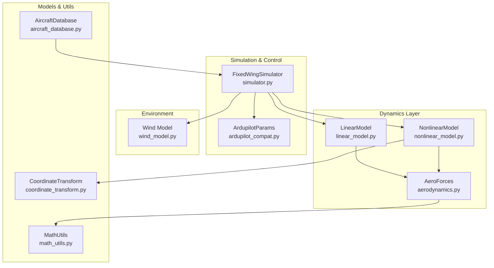
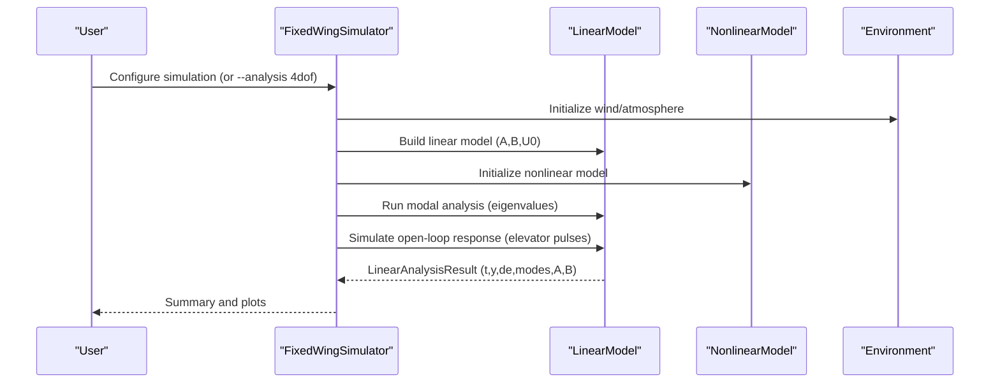
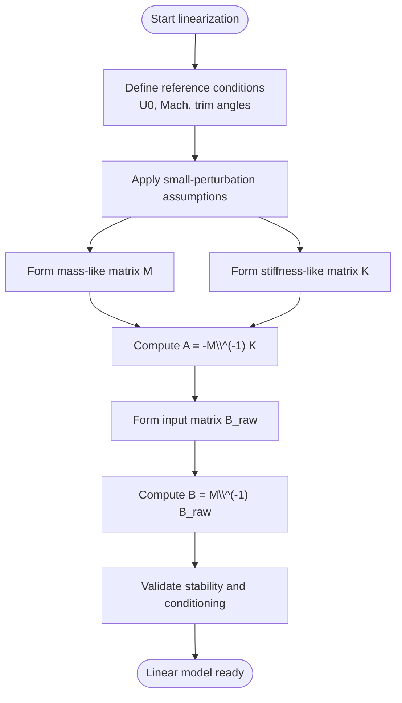
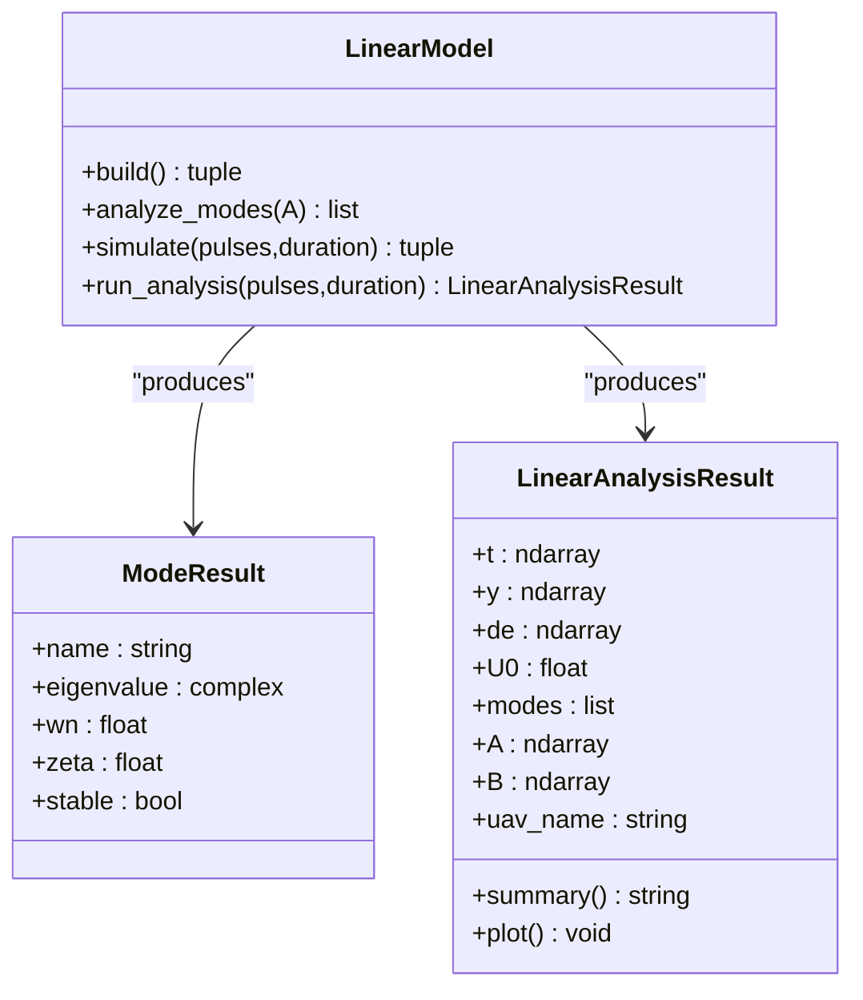
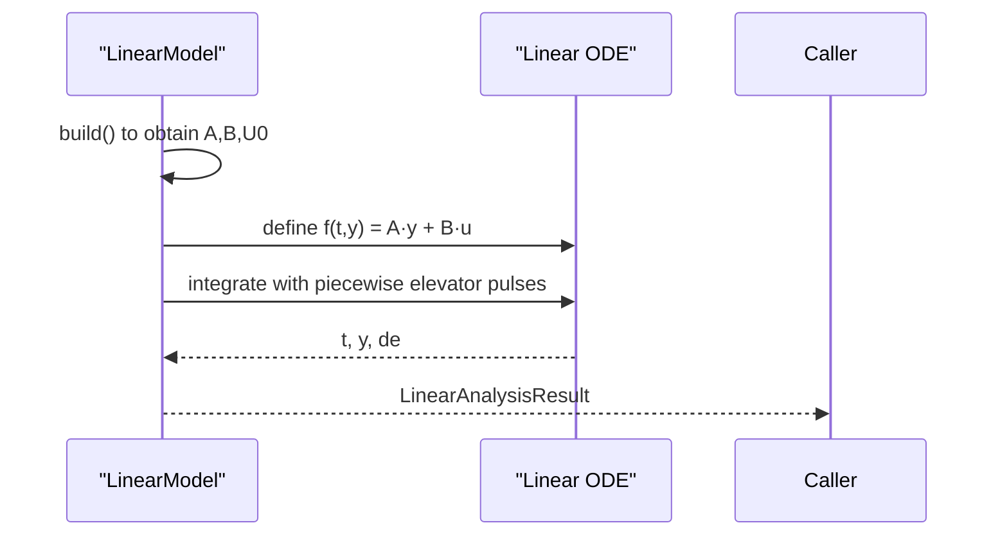
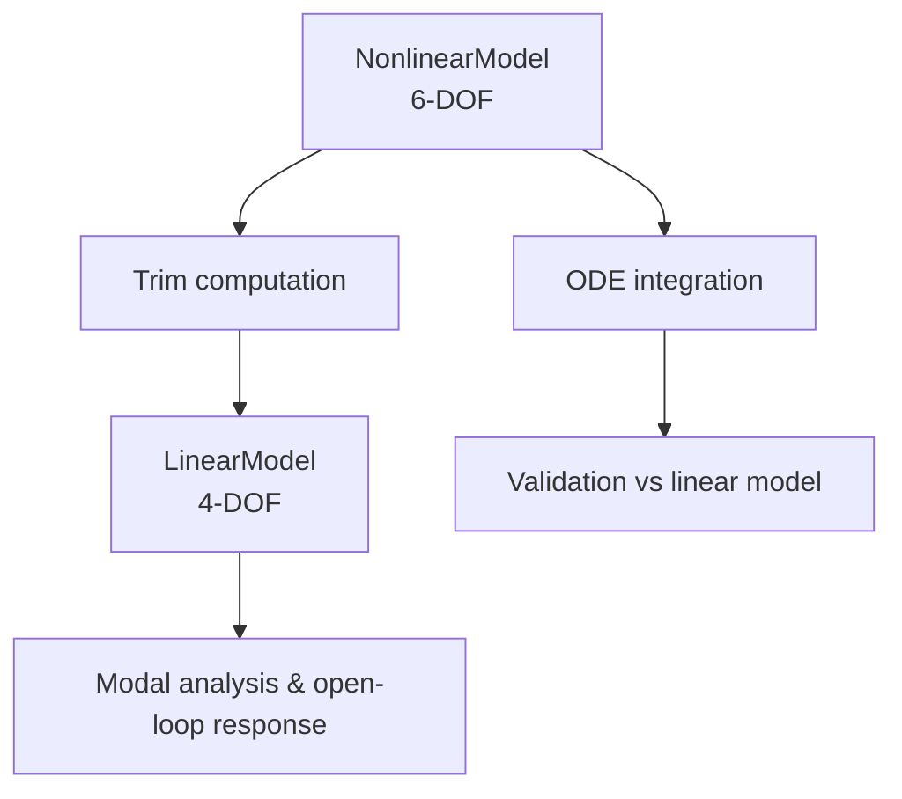
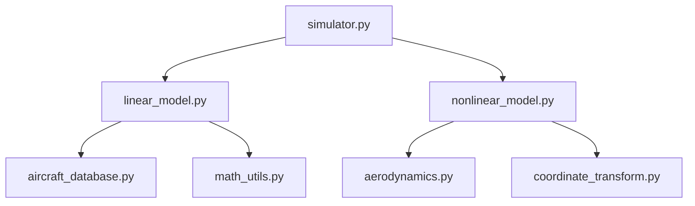

# Linear 4-DOF Analysis Model

<cite>
**Referenced Files in This Document**
- [linear_model.py](file://src/dynamics/linear_model.py)
- [4自由度线性化动力学模型.md](file://doc/zh/content/动力学系统/4自由度线性化动力学模型.md)
- [nonlinear_model.py](file://src/dynamics/nonlinear_model.py)
- [aerodynamics.py](file://src/dynamics/aerodynamics.py)
- [coordinate_transform.py](file://src/dynamics/coordinate_transform.py)
- [aircraft_database.py](file://src/models/aircraft_database.py)
- [math_utils.py](file://src/utils/math_utils.py)
- [simulator.py](file://src/simulation/simulator.py)
- [main.py](file://main.py)
</cite>

## Table of Contents
1. [Introduction](#introduction)
2. [Project Structure](#project-structure)
3. [Core Components](#core-components)
4. [Architecture Overview](#architecture-overview)
5. [Detailed Component Analysis](#detailed-component-analysis)
6. [Dependency Analysis](#dependency-analysis)
7. [Performance Considerations](#performance-considerations)
8. [Troubleshooting Guide](#troubleshooting-guide)
9. [Conclusion](#conclusion)
10. [Appendices](#appendices)

## Introduction
This document explains the 4-degree-of-freedom (4-DOF) longitudinal linearized flight dynamics model implemented in the FixedWingSimulator. It covers the linearization process from the full 6-DOF nonlinear equations around a steady, trimmed flight condition, the reduced state vector focusing on longitudinal dynamics (airspeed perturbation, angle of attack, pitch rate, pitch angle), and the state-space representation with matrices A, B, C, D. It also documents modal analysis capabilities, eigenvalue computation, and stability assessment, along with practical examples of linear model generation, time-domain analysis, and control design applications. Limitations of linearization, validity regions, and transitions to nonlinear analysis are addressed, alongside guidance for parameter selection to achieve accurate linear approximations.

## Project Structure
The linear 4-DOF model is part of a modular simulation framework that integrates aircraft parameterization, nonlinear 6-DOF dynamics, aerodynamic force computation, coordinate transforms, and a control system compatible with ArduPilot. The linear model is orchestrated by the main simulator and can be run standalone for open-loop analysis.

**Diagram sources**
- [linear_model.py](file://src/dynamics/linear_model.py#L107-L319)
- [nonlinear_model.py](file://src/dynamics/nonlinear_model.py#L104-L386)
- [simulator.py](file://src/simulation/simulator.py#L115-L200)

**Section sources**
- [linear_model.py](file://src/dynamics/linear_model.py#L1-L319)
- [nonlinear_model.py](file://src/dynamics/nonlinear_model.py#L1-L386)
- [simulator.py](file://src/simulation/simulator.py#L1-L200)

## Core Components
- LinearModel: Builds the 4-DOF longitudinal linearized state-space model (A, B matrices) from aircraft parameters and Mach number, performs eigenvalue-based modal analysis, and simulates open-loop responses to elevator pulses.
- LinearAnalysisResult: Aggregates time histories, computed modes, and provides summary and plotting utilities.
- ModeResult: Encapsulates eigenvalue, natural frequency, damping ratio, and stability classification for individual modes.
- Aircraft parameter database: Supplies geometric, inertial, and aerodynamic coefficients used by both linear and nonlinear models.
- Aerodynamics: Computes non-dimensional coefficients and body-fixed forces/moments for the full 6-DOF model.
- Coordinate transforms: Provides conversions between body and NED frames and Euler-rate kinematics.
- Simulator orchestration: Integrates linear and nonlinear models, wind, and control layers; supports dedicated 4-DOF linear analysis mode.

**Section sources**
- [linear_model.py](file://src/dynamics/linear_model.py#L107-L319)
- [aircraft_database.py](file://src/models/aircraft_database.py#L29-L183)
- [aerodynamics.py](file://src/dynamics/aerodynamics.py#L19-L148)
- [coordinate_transform.py](file://src/dynamics/coordinate_transform.py#L29-L70)
- [simulator.py](file://src/simulation/simulator.py#L115-L200)

## Architecture Overview
The system employs a layered architecture. The LinearModel consumes aircraft parameters and constructs a linear state-space model for longitudinal dynamics. The simulator orchestrates environment, control, and planning modules and can run either closed-loop simulations using the nonlinear model or open-loop linear analysis using the LinearModel.

**Diagram sources**
- [simulator.py](file://src/simulation/simulator.py#L115-L200)
- [linear_model.py](file://src/dynamics/linear_model.py#L129-L200)
- [nonlinear_model.py](file://src/dynamics/nonlinear_model.py#L160-L256)

## Detailed Component Analysis

### Linearization Process and Reduced State-Space
- Assumptions: Small perturbations around a steady trimmed flight condition; linearization retains first-order terms; gravity balancing is implicit in the reference condition.
- Longitudinal state vector: [u_p, α, q, θ] where u_p is normalized forward-speed perturbation (Δu/U0), α is angle-of-attack perturbation, q is pitch rate, θ is pitch-angle perturbation.
- Inputs: [δ_T, δ_e] where δ_T is throttle-normalized perturbation and δ_e is elevator deflection.
- Non-dimensionalization: Mass and inertia terms are normalized by freestream dynamic pressure and reference length/chord; Mach number defines reference speed.
- Construction: The implementation builds matrices M, K, and B_raw, then solves A = -M^{-1}·K and B = M^{-1}·B_raw to form the linear state-space ẏ = A·y + B·u.

**Diagram sources**
- [linear_model.py](file://src/dynamics/linear_model.py#L129-L200)

**Section sources**
- [linear_model.py](file://src/dynamics/linear_model.py#L4-L16)
- [linear_model.py](file://src/dynamics/linear_model.py#L129-L200)

### State-Space Representation and Physical Interpretation
- State matrix A: Captures the intrinsic dynamics of the longitudinal system, linking state rates to current states and inputs. Its eigenvalues reveal stability and oscillatory characteristics.
- Input matrix B: Relates elevator and throttle perturbations to state rates.
- Output matrix C and feedthrough D: Not exposed in the current LinearModel interface; the primary outputs are internal states (u_p, α, q, θ) and elevator history.

Practical interpretation:
- Short period mode: High-frequency, lightly damped oscillation involving α and θ.
- Phugoid mode: Low-frequency, long-period energy exchange between airspeed and altitude.
- Subsidence mode: Purely decaying mode (often associated with θ or α depending on formulation).

**Section sources**
- [linear_model.py](file://src/dynamics/linear_model.py#L107-L319)

### Modal Analysis and Stability Assessment
- Eigenvalue decomposition of A yields complex conjugate pairs and real eigenvalues.
- Classification:
  - Short Period: High-frequency complex conjugate pair.
  - Phugoid: Lower-frequency complex conjugate pair.
  - Subsidence: Real negative eigenvalue.
- Stability: Negative real parts imply stability; damping ratio derived from σ/ωn.

**Diagram sources**
- [linear_model.py](file://src/dynamics/linear_model.py#L107-L319)

**Section sources**
- [linear_model.py](file://src/dynamics/linear_model.py#L206-L252)
- [linear_model.py](file://src/dynamics/linear_model.py#L30-L105)

### Time-Domain Simulation and Open-Loop Response
- The simulate method integrates the linear ODE with piecewise constant elevator inputs (pulses) and zero throttle inputs.
- Outputs include time vector, state history, and applied elevator history for post-processing and visualization.

**Diagram sources**
- [linear_model.py](file://src/dynamics/linear_model.py#L258-L306)

**Section sources**
- [linear_model.py](file://src/dynamics/linear_model.py#L258-L306)

### Practical Examples and Workflows
- Standalone linear analysis:
  - Retrieve aircraft parameters from the database.
  - Instantiate LinearModel and run run_analysis with elevator pulse inputs.
  - Print summary and plot time responses.
- Integration with simulator:
  - Use FixedWingSimulator with --analysis 4dof to run open-loop linear analysis and visualize results.

Note: The example scripts referenced in the documentation are present under examples/, and the main entry supports a dedicated 4-DOF analysis mode.

**Section sources**
- [aircraft_database.py](file://src/models/aircraft_database.py#L143-L166)
- [main.py](file://main.py#L124-L130)
- [simulator.py](file://src/simulation/simulator.py#L115-L200)

### Relationship to Nonlinear 6-DOF Model
- The nonlinear model implements the full 6-DOF equations with states [u, v, w, p, q, r, φ, θ, ψ, x_N, x_E, x_D] and provides trim computation and ODE integration.
- The linear model focuses on longitudinal dynamics and is intended for short-term transient analysis and control design around a trim condition determined by the nonlinear model.

**Diagram sources**
- [nonlinear_model.py](file://src/dynamics/nonlinear_model.py#L132-L154)
- [linear_model.py](file://src/dynamics/linear_model.py#L129-L200)

**Section sources**
- [nonlinear_model.py](file://src/dynamics/nonlinear_model.py#L104-L200)
- [linear_model.py](file://src/dynamics/linear_model.py#L107-L200)

## Dependency Analysis
- Internal dependencies:
  - LinearModel depends on aircraft parameters (mass, area, chord, inertia, aerodynamic derivatives) and Mach number to compute U0 and non-dimensional coefficients.
  - Aerodynamics module supplies angle-of-attack, sideslip, dynamic pressure, and non-dimensional coefficients used by the nonlinear model; the linear model’s construction is self-contained.
  - Coordinate transforms support conversion between body and NED frames and Euler-rate kinematics.
- External dependencies:
  - NumPy for numerical operations.
  - SciPy for ODE integration.
  - Matplotlib for quick plotting of results.

**Diagram sources**
- [linear_model.py](file://src/dynamics/linear_model.py#L18-L21)
- [nonlinear_model.py](file://src/dynamics/nonlinear_model.py#L22-L29)
- [simulator.py](file://src/simulation/simulator.py#L33-L53)

**Section sources**
- [linear_model.py](file://src/dynamics/linear_model.py#L18-L21)
- [nonlinear_model.py](file://src/dynamics/nonlinear_model.py#L22-L29)
- [simulator.py](file://src/simulation/simulator.py#L33-L53)

## Performance Considerations
- Matrix solving: The implementation solves linear systems using numerically stable routines; avoid explicit matrix inversion.
- Precomputation: Reference speed U0 and derived parameters are precomputed per aircraft to reduce repeated work.
- Vectorization: Operations leverage NumPy arrays for efficient computation.
- Numerical tolerances: solve_ivp is configured with tight relative and absolute tolerances for accuracy during linear simulation.

[No sources needed since this section provides general guidance]

## Troubleshooting Guide
- Unstable modes:
  - Symptom: Negative real parts of eigenvalues indicating instability.
  - Causes: Operating outside the linear validity region, unrealistic aerodynamic derivatives, or numerical errors.
  - Actions: Verify trim conditions, check Mach number and air density, and adjust tolerances.
- Simulation divergence:
  - Symptom: Nonlinear simulation diverges or exhibits unrealistic oscillations.
  - Causes: Large time steps, aggressive control gains, or complex environmental conditions.
  - Actions: Reduce time step, inspect control parameters, and simplify environment for debugging.
- Parameter mismatches:
  - Symptom: Discrepancies between linear and nonlinear responses.
  - Causes: Incorrect Mach number, missing wind effects, or inconsistent units.
  - Actions: Confirm aircraft parameters, ensure consistent units, and align trim conditions.

**Section sources**
- [linear_model.py](file://src/dynamics/linear_model.py#L206-L252)
- [simulator.py](file://src/simulation/simulator.py#L239-L400)

## Conclusion
The 4-DOF longitudinal linearized model provides an efficient and insightful tool for analyzing short-term dynamic behavior, identifying dominant modes, and designing controllers. By building A and B matrices from validated aircraft parameters and operating around a trim condition, the model enables rapid open-loop analysis and modal stability assessment. While it is limited to small perturbations and longitudinal focus, it serves as a crucial stepping stone toward integrated closed-loop simulations using the full 6-DOF nonlinear model.

[No sources needed since this section summarizes without analyzing specific files]

## Appendices

### A. Linear Model API Overview
- Build A and B matrices from aircraft parameters and Mach number.
- Analyze eigenvalues to classify short period, phugoid, and subsidence modes.
- Simulate open-loop responses to elevator pulses.
- Produce a LinearAnalysisResult with time histories, modes, and plotting utilities.

**Section sources**
- [linear_model.py](file://src/dynamics/linear_model.py#L129-L200)
- [linear_model.py](file://src/dynamics/linear_model.py#L206-L252)
- [linear_model.py](file://src/dynamics/linear_model.py#L258-L306)
- [linear_model.py](file://src/dynamics/linear_model.py#L312-L319)

### B. Example: Running 4-DOF Linear Analysis
- From the command line, use the --analysis 4dof flag to run the linear analysis mode, which internally constructs the LinearModel, computes modes, simulates responses, and prints a summary with plots.

**Section sources**
- [main.py](file://main.py#L124-L130)
- [simulator.py](file://src/simulation/simulator.py#L115-L200)

### C. Parameter Selection Guidelines for Accurate Linear Approximation
- Choose trim conditions representative of the flight envelope; avoid stall or high-disturbance regimes.
- Ensure Mach number and air density are consistent with the intended operating range.
- Validate aerodynamic derivatives for small perturbations; avoid regions with strong nonlinearities (e.g., high angles of attack).
- Confirm that elevator authority and throttle effects are within reasonable bounds for the selected trim.

**Section sources**
- [aircraft_database.py](file://src/models/aircraft_database.py#L143-L166)
- [linear_model.py](file://src/dynamics/linear_model.py#L129-L200)