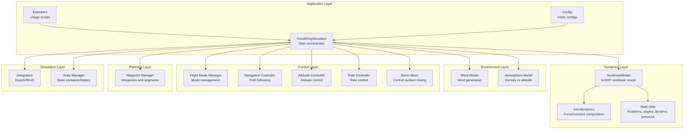
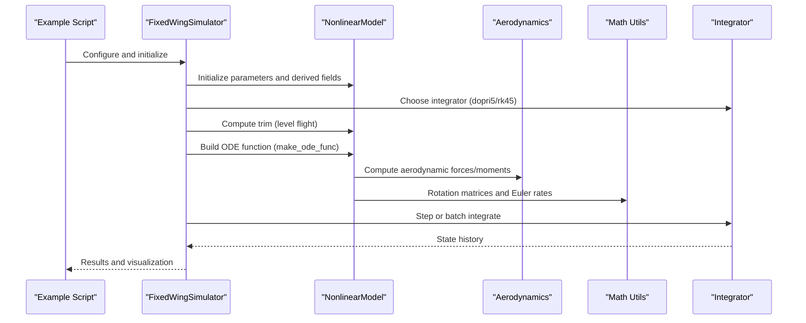
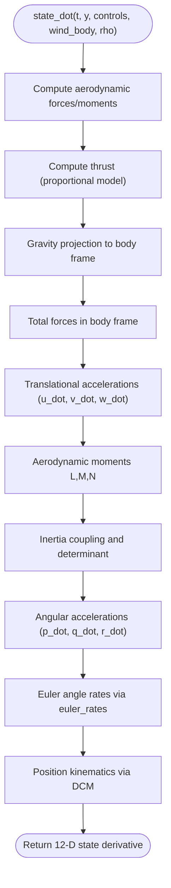
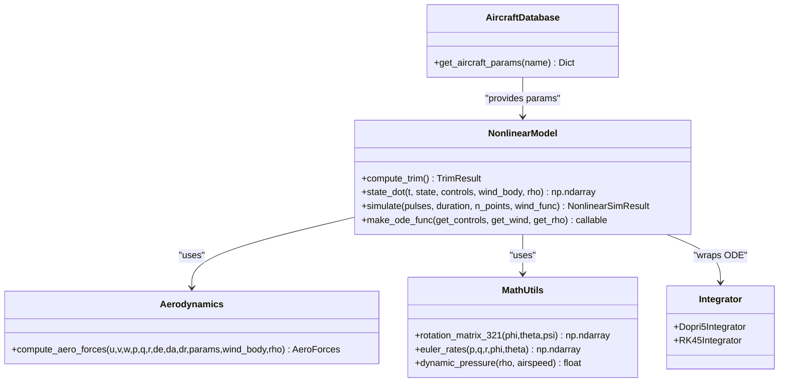
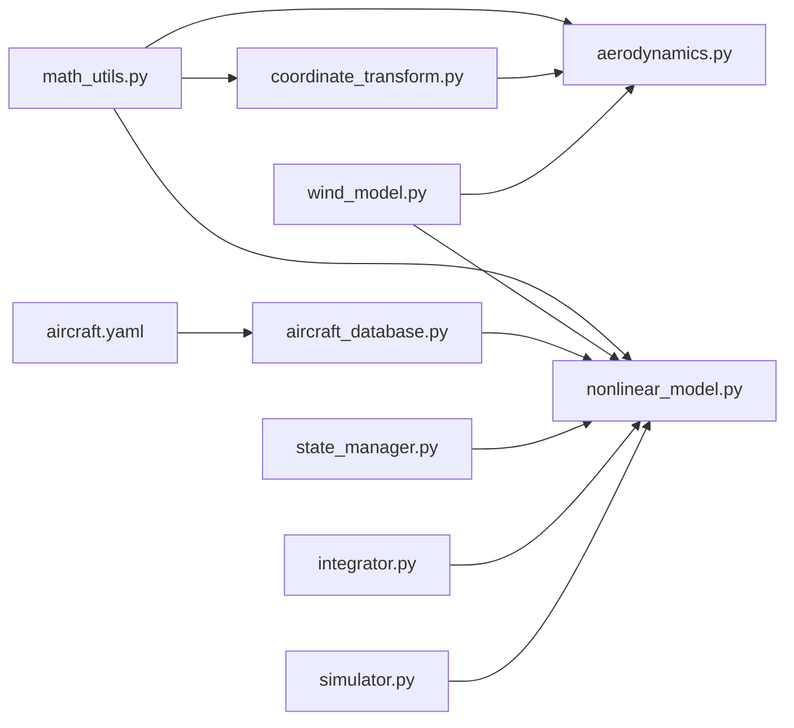

# Nonlinear 6-DOF Dynamics

<cite>
**Referenced Files in This Document**
- [src/dynamics/nonlinear_model.py](file://src/dynamics/nonlinear_model.py)
- [src/dynamics/aerodynamics.py](file://src/dynamics/aerodynamics.py)
- [src/dynamics/coordinate_transform.py](file://src/dynamics/coordinate_transform.py)
- [src/utils/math_utils.py](file://src/utils/math_utils.py)
- [src/simulation/integrator.py](file://src/simulation/integrator.py)
- [src/simulation/state_manager.py](file://src/simulation/state_manager.py)
- [src/models/aircraft_database.py](file://src/models/aircraft_database.py)
- [src/simulation/simulator.py](file://src/simulation/simulator.py)
- [config/aircraft.yaml](file://config/aircraft.yaml)
- [doc/zh/content/动力学系统/6自由度非线性动力学模型.md](file://doc/zh/content/动力学系统/6自由度非线性动力学模型.md)
- [doc/zh/content/核心概念/坐标系与变换.md](file://doc/zh/content/核心概念/坐标系与变换.md)
- [doc/zh/content/环境系统/气动力计算.md](file://doc/zh/content/环境系统/气动力计算.md)
</cite>

## Table of Contents
1. [Introduction](#introduction)
2. [Project Structure](#project-structure)
3. [Core Components](#core-components)
4. [Architecture Overview](#architecture-overview)
5. [Detailed Component Analysis](#detailed-component-analysis)
6. [Dependency Analysis](#dependency-analysis)
7. [Performance Considerations](#performance-considerations)
8. [Troubleshooting Guide](#troubleshooting-guide)
9. [Conclusion](#conclusion)
10. [Appendices](#appendices)

## Introduction
This document provides comprehensive technical documentation for the 6-degree-of-freedom (6-DOF) nonlinear flight dynamics model implemented in the FixedWingSimulator project. It covers the complete equations of motion, state vector definition, force and moment computation, rigid body dynamics, Euler angle kinematics, rotation matrix computations, numerical integration, and practical usage patterns. It also includes guidance on initialization, state updates, validation approaches, computational efficiency, numerical stability, and parameter sensitivity analysis.

## Project Structure
The simulation framework is modular and layered:
- Dynamics layer: Nonlinear 6-DOF model, aerodynamic force/moment calculation, math utilities for rotations and angles
- Environment layer: Wind model and atmosphere model
- Control layer: ArduPilot-compatible control chain (mode management, navigation, attitude/attitude-rate control, servo mixing)
- Planning layer: Waypoint and trajectory management
- Simulation layer: Integrators, state containers, and history recording
- Application layer: Main simulator orchestrating modules and examples/configuration

**Diagram sources**
- [src/dynamics/nonlinear_model.py](file://src/dynamics/nonlinear_model.py#L104-L386)
- [src/dynamics/aerodynamics.py](file://src/dynamics/aerodynamics.py#L35-L148)
- [src/utils/math_utils.py](file://src/utils/math_utils.py#L43-L124)
- [src/simulation/integrator.py](file://src/simulation/integrator.py#L17-L108)
- [src/simulation/simulator.py](file://src/simulation/simulator.py#L115-L200)

**Section sources**
- [doc/zh/content/动力学系统/6自由度非线性动力学模型.md](file://doc/zh/content/动力学系统/6自由度非线性动力学模型.md#L38-L92)
- [src/dynamics/nonlinear_model.py](file://src/dynamics/nonlinear_model.py#L1-L386)
- [src/dynamics/aerodynamics.py](file://src/dynamics/aerodynamics.py#L1-L148)
- [src/utils/math_utils.py](file://src/utils/math_utils.py#L1-L124)
- [src/simulation/integrator.py](file://src/simulation/integrator.py#L1-L108)
- [src/simulation/simulator.py](file://src/simulation/simulator.py#L1-L200)

## Core Components
- Nonlinear 6-DOF model: Implements translational and rotational equations of motion, trim computation, and open-loop simulation interface.
- Aerodynamics module: Computes aerodynamic forces and moments in body coordinates using angle-of-attack, sideslip, normalized angular rates, and control surface deflections.
- Math utilities: Provides direction cosine matrices (DCM), Euler angle rates, angle utilities, and dynamic pressure.
- Integrators: Offers Dopri5 (adaptive step-size, single-step) and RK45 (batch solve_ivp) integrators.
- Aircraft database and factory: Loads and injects derived parameters (U0, rho, q_bar) used by dynamics.
- Main simulator: Orchestrates modules for real-time closed-loop operation and visualization.

**Section sources**
- [src/dynamics/nonlinear_model.py](file://src/dynamics/nonlinear_model.py#L104-L386)
- [src/dynamics/aerodynamics.py](file://src/dynamics/aerodynamics.py#L35-L148)
- [src/utils/math_utils.py](file://src/utils/math_utils.py#L43-L124)
- [src/simulation/integrator.py](file://src/simulation/integrator.py#L17-L108)
- [src/models/aircraft_database.py](file://src/models/aircraft_database.py#L143-L166)
- [src/simulation/simulator.py](file://src/simulation/simulator.py#L115-L200)

## Architecture Overview
The 6-DOF model integrates with aerodynamics, math utilities, and integrators. The main simulator selects wind/atmosphere, builds control targets, and runs either real-time (Dopri5) or batch (RK45) simulations.

**Diagram sources**
- [src/simulation/simulator.py](file://src/simulation/simulator.py#L115-L200)
- [src/dynamics/nonlinear_model.py](file://src/dynamics/nonlinear_model.py#L261-L281)
- [src/dynamics/aerodynamics.py](file://src/dynamics/aerodynamics.py#L35-L148)
- [src/utils/math_utils.py](file://src/utils/math_utils.py#L43-L101)
- [src/simulation/integrator.py](file://src/simulation/integrator.py#L17-L108)

## Detailed Component Analysis

### State Vector Definition and Coordinate Systems
- 12-dimensional state vector in NED coordinates:
  - Body velocities: u (north), v (east), w (down)
  - Body angular rates: p (roll), q (pitch), r (yaw)
  - Euler angles: φ (roll), θ (pitch), ψ (yaw)
  - NED positions: x_N (north), x_E (east), x_D (down, positive down)
- Coordinate conventions:
  - NED geographic frame
  - Body frame with 3-2-1 Euler angles (φ=roll, θ=pitch, ψ=yaw)
  - Forces and moments computed in body frame and transformed appropriately in the ODE

**Section sources**
- [src/dynamics/nonlinear_model.py](file://src/dynamics/nonlinear_model.py#L4-L20)
- [src/utils/math_utils.py](file://src/utils/math_utils.py#L43-L77)
- [doc/zh/content/核心概念/坐标系与变换.md](file://doc/zh/content/核心概念/坐标系与变换.md#L155-L182)

### Translational and Rotational Equations of Motion
- Translational dynamics (body frame accelerations):
  - u_dot, v_dot, w_dot include Coriolis/coupling terms r*v - q*w, p*w - r*u, q*u - p*v
  - Forces include aerodynamic forces, thrust, and gravity projected to body frame
- Rotational dynamics (Euler angles with inertia coupling):
  - Angular acceleration components p_dot, q_dot, r_dot derived from L, M, N moments using inertia tensor and determinant Ixx*Izz - Ixz^2
  - Coupling terms reflect the role of Ixz and differences among principal moments
- Euler angle kinematics:
  - Rates computed from body rates using 3-2-1 Euler transformation with small ε protection near singularities
- Position kinematics:
  - Velocity in NED computed via DCM from body velocities

**Diagram sources**
- [src/dynamics/nonlinear_model.py](file://src/dynamics/nonlinear_model.py#L160-L256)
- [src/dynamics/aerodynamics.py](file://src/dynamics/aerodynamics.py#L35-L148)
- [src/utils/math_utils.py](file://src/utils/math_utils.py#L79-L101)

**Section sources**
- [src/dynamics/nonlinear_model.py](file://src/dynamics/nonlinear_model.py#L160-L256)
- [src/dynamics/aerodynamics.py](file://src/dynamics/aerodynamics.py#L35-L148)
- [src/utils/math_utils.py](file://src/utils/math_utils.py#L79-L101)

### Force and Moment Calculations
- Aerodynamic forces and moments:
  - Inputs: body-frame velocity (u,v,w), angular rates (p,q,r), control deflections (de, da, dr), parameters dictionary, optional wind in body frame, air density
  - Computation pipeline:
    - Vacuum airspeed vector (subtract wind in body frame)
    - Compute angle of attack α and sideslip β
    - Normalize angular rates (p_hat, q_hat, r_hat) using reference length/c
    - Evaluate longitudinal coefficients CL, CD, Cm and lateral-directional coefficients CY, Cl, Cn using linear combinations of parameters and inputs
    - Compute forces X, Y, Z and moments L, M, N using dynamic pressure q_bar = 0.5·ρ·V^2 and reference area S
- Thrust model:
  - Proportional to throttle with maximum thrust chosen to balance weight for typical cruise/climb scenarios
- Gravity:
  - Projected to body frame using Euler angles in NED convention (z positive down)

**Section sources**
- [src/dynamics/aerodynamics.py](file://src/dynamics/aerodynamics.py#L35-L148)
- [src/dynamics/nonlinear_model.py](file://src/dynamics/nonlinear_model.py#L199-L222)
- [src/utils/math_utils.py](file://src/utils/math_utils.py#L107-L124)

### Mathematical Formulation: Rigid Body Dynamics, Euler Kinematics, Rotation Matrix
- Rigid body dynamics:
  - Translational: F_total = m·a_body + cross terms involving angular rates and velocity
  - Rotational: Moments = inertia tensor times angular acceleration plus coupling terms
- Euler angle kinematics:
  - 3-2-1 Euler transformation yields explicit expressions for φ̇, θ̇, ψ̇ in terms of p, q, r and Euler angles
  - Small ε protection prevents division by cos θ near singularities
- Rotation matrix computations:
  - Direction cosine matrix (DCM) from Euler angles transforms vectors between body and NED frames
  - Body→NED: R(φ,θ,ψ)
  - NED→Body: R^T(φ,θ,ψ)

**Section sources**
- [src/utils/math_utils.py](file://src/utils/math_utils.py#L43-L101)
- [src/dynamics/coordinate_transform.py](file://src/dynamics/coordinate_transform.py#L29-L36)

### Implementation Details: Numerical Integration, State Propagation, and Force Transformation
- Integrators:
  - Dopri5Integrator: single-step integration with adaptive step size, suitable for real-time loops
  - RK45Integrator: batch integration via solve_ivp, suitable for offline analysis
- State propagation:
  - make_ode_func wraps NonlinearModel.state_dot to accept time-dependent control, wind, and density
  - Wind conversion: wind in NED is transformed to body frame using current Euler angles before computing aerodynamics
  - Density rho is evaluated at altitude (negative of x_D) when provided by get_rho
- Simulation workflow:
  - compute_trim solves level, straight flight trim for (α_trim, δe_trim) using linear system
  - simulate sets up control pulses, initial state from trim, and integrates using solve_ivp

**Diagram sources**
- [src/dynamics/nonlinear_model.py](file://src/dynamics/nonlinear_model.py#L104-L386)
- [src/dynamics/aerodynamics.py](file://src/dynamics/aerodynamics.py#L35-L148)
- [src/utils/math_utils.py](file://src/utils/math_utils.py#L43-L124)
- [src/simulation/integrator.py](file://src/simulation/integrator.py#L17-L108)
- [src/models/aircraft_database.py](file://src/models/aircraft_database.py#L143-L166)

**Section sources**
- [src/simulation/integrator.py](file://src/simulation/integrator.py#L17-L108)
- [src/dynamics/nonlinear_model.py](file://src/dynamics/nonlinear_model.py#L261-L386)
- [src/dynamics/aerodynamics.py](file://src/dynamics/aerodynamics.py#L35-L148)
- [src/utils/math_utils.py](file://src/utils/math_utils.py#L43-L124)

### Practical Examples: Initialization, State Updates, Validation
- Initialization:
  - Load aircraft parameters via AircraftFactory and get_aircraft_params; derived fields U0, rho, q_bar are injected
  - Configure wind type and direction; atmosphere density computed from altitude
- Open-loop simulation:
  - Define control pulses (elevator, aileron, rudder, throttle) over time windows
  - Call NonlinearModel.simulate to integrate and collect histories
- Closed-loop operation:
  - FixedWingSimulator orchestrates control layers (mode manager, navigation, attitude/attitude-rate control, servo mixer) and integrates with the 6-DOF model
- Validation approaches:
  - Compare trim conditions with analytical lift/weight balance
  - Validate Euler rates near singularities using small ε protection
  - Compare against linearized models for short/long period modes

**Section sources**
- [src/models/aircraft_database.py](file://src/models/aircraft_database.py#L143-L166)
- [src/dynamics/nonlinear_model.py](file://src/dynamics/nonlinear_model.py#L287-L386)
- [src/simulation/simulator.py](file://src/simulation/simulator.py#L115-L200)
- [doc/zh/content/动力学系统/6自由度非线性动力学模型.md](file://doc/zh/content/动力学系统/6自由度非线性动力学模型.md#L244-L248)

## Dependency Analysis
- Module dependencies:
  - NonlinearModel depends on Aerodynamics and Math Utils for forces and transformations
  - Integrators encapsulate ODE integration for both real-time and batch modes
  - AircraftDatabase supplies parameters and derived fields to dynamics
  - FixedWingSimulator orchestrates all modules and exposes a unified API
- External libraries:
  - NumPy for numerical operations
  - SciPy for ODE integration (dopri5 and solve_ivp)

**Diagram sources**
- [src/utils/math_utils.py](file://src/utils/math_utils.py#L1-L124)
- [src/dynamics/coordinate_transform.py](file://src/dynamics/coordinate_transform.py#L1-L70)
- [src/dynamics/aerodynamics.py](file://src/dynamics/aerodynamics.py#L1-L148)
- [src/dynamics/nonlinear_model.py](file://src/dynamics/nonlinear_model.py#L1-L200)
- [src/models/aircraft_database.py](file://src/models/aircraft_database.py#L1-L183)
- [src/simulation/integrator.py](file://src/simulation/integrator.py#L1-L108)
- [src/simulation/simulator.py](file://src/simulation/simulator.py#L1-L200)
- [config/aircraft.yaml](file://config/aircraft.yaml#L1-L13)

**Section sources**
- [src/utils/math_utils.py](file://src/utils/math_utils.py#L1-L124)
- [src/dynamics/coordinate_transform.py](file://src/dynamics/coordinate_transform.py#L1-L70)
- [src/dynamics/aerodynamics.py](file://src/dynamics/aerodynamics.py#L1-L148)
- [src/dynamics/nonlinear_model.py](file://src/dynamics/nonlinear_model.py#L1-L200)
- [src/models/aircraft_database.py](file://src/models/aircraft_database.py#L1-L183)
- [src/simulation/integrator.py](file://src/simulation/integrator.py#L1-L108)
- [src/simulation/simulator.py](file://src/simulation/simulator.py#L1-L200)
- [config/aircraft.yaml](file://config/aircraft.yaml#L1-L13)

## Performance Considerations
- Computational complexity:
  - Aerodynamic computation is O(1) with trigonometric polynomials; nonlinear ODE per step involves dozens of floating-point operations
- Memory and caching:
  - Pre-compute derived parameters (U0, rho, q_bar) to reduce repeated calculations
- Stability and convergence:
  - Prefer adaptive step-size (Dopri5) for nonlinear systems; set tolerances and max step to balance accuracy and performance
- Multi-aircraft/multi-task:
  - Independent simulations can be parallelized; ensure thread-safe access to shared wind/atmosphere models

**Section sources**
- [doc/zh/content/动力学系统/6自由度非线性动力学模型.md](file://doc/zh/content/动力学系统/6自由度非线性动力学模型.md#L295-L306)
- [src/simulation/integrator.py](file://src/simulation/integrator.py#L17-L108)
- [src/dynamics/nonlinear_model.py](file://src/dynamics/nonlinear_model.py#L114-L127)

## Troubleshooting Guide
- Integration failure:
  - Verify reasonable initial conditions; reduce max step or tighten tolerances
- Euler angle singularity:
  - Confirm small ε protection in euler_rates is active near θ ≈ ±90°
- Parameter mismatch:
  - Ensure mass/inertia/area parameters match database entries
- Wind model anomalies:
  - Check wind type/direction and consistency with configuration

**Section sources**
- [src/simulation/integrator.py](file://src/simulation/integrator.py#L54-L56)
- [src/utils/math_utils.py](file://src/utils/math_utils.py#L89-L91)
- [doc/zh/content/核心概念/坐标系与变换.md](file://doc/zh/content/核心概念/坐标系与变换.md#L362-L375)

## Conclusion
The 6-DOF nonlinear dynamics model is modularly implemented with clear separation between aerodynamics, rigid body dynamics, and numerical integration. It supports both real-time and batch simulation modes, integrates seamlessly with wind/atmosphere environments, and provides robust trim computation and state propagation. For engineering applications, combine nonlinear simulations with linearized models for controller design and leverage parameter sensitivity analysis to tune control parameters effectively.

## Appendices

### A. Parameter Sources and Configuration
- Aircraft parameters include geometry, inertia, and aerodynamic coefficients; derived fields U0, rho, q_bar are injected automatically
- Configuration files support aircraft selection and overrides

**Section sources**
- [src/models/aircraft_database.py](file://src/models/aircraft_database.py#L143-L166)
- [config/aircraft.yaml](file://config/aircraft.yaml#L1-L13)

### B. Example Workflows and Output
- Example scripts demonstrate open-loop pulse responses and wind resistance analysis; outputs include CSV and plots for further analysis

**Section sources**
- [doc/zh/content/动力学系统/6自由度非线性动力学模型.md](file://doc/zh/content/动力学系统/6自由度非线性动力学模型.md#L244-L248)
- [doc/zh/content/环境系统/气动力计算.md](file://doc/zh/content/环境系统/气动力计算.md#L226-L234)