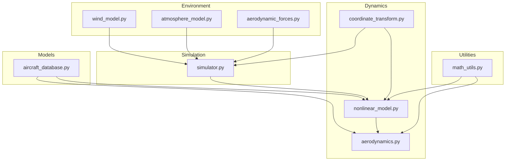
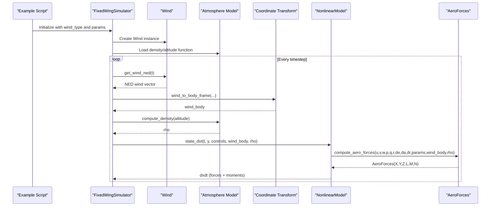
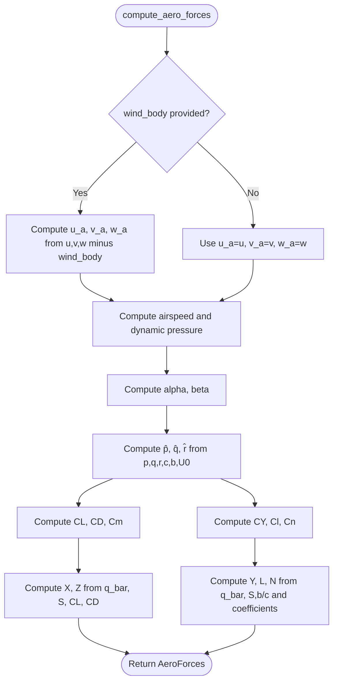
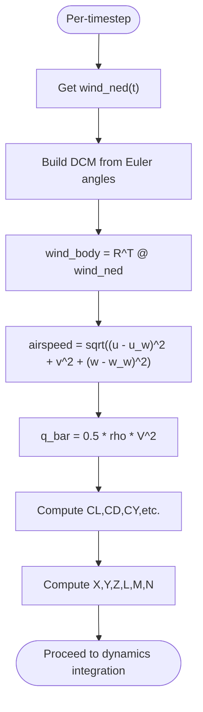
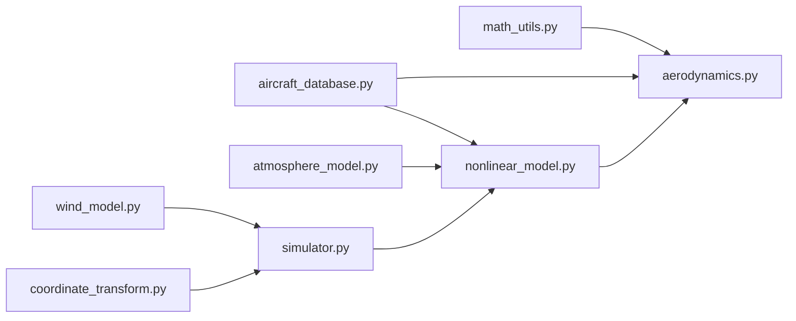

# Aerodynamic Force Calculations

<cite>
**Referenced Files in This Document**
- [aerodynamics.py](file://src/dynamics/aerodynamics.py)
- [aerodynamic_forces.py](file://src/environment/aerodynamic_forces.py)
- [wind_model.py](file://src/environment/wind_model.py)
- [atmosphere_model.py](file://src/environment/atmosphere_model.py)
- [coordinate_transform.py](file://src/dynamics/coordinate_transform.py)
- [nonlinear_model.py](file://src/dynamics/nonlinear_model.py)
- [simulator.py](file://src/simulation/simulator.py)
- [aircraft_database.py](file://src/models/aircraft_database.py)
- [math_utils.py](file://src/utils/math_utils.py)
- [7_wind_resistance.py](file://examples/7_wind_resistance.py)
- [气动力学计算.md](file://doc/zh/content/动力学系统/气动力学计算.md)
- [风场模型.md](file://doc/zh/content/环境系统/风场模型.md)
</cite>

## Table of Contents
1. [Introduction](#introduction)
2. [Project Structure](#project-structure)
3. [Core Components](#core-components)
4. [Architecture Overview](#architecture-overview)
5. [Detailed Component Analysis](#detailed-component-analysis)
6. [Dependency Analysis](#dependency-analysis)
7. [Performance Considerations](#performance-considerations)
8. [Troubleshooting Guide](#troubleshooting-guide)
9. [Conclusion](#conclusion)
10. [Appendices](#appendices)

## Introduction
This document explains the aerodynamic force calculation system used in the fixed-wing simulation engine. It covers how environmental effects—specifically wind—are integrated into aerodynamic force computations, including true airspeed estimation, apparent wind calculations, and environmental correction factors such as atmospheric density. It documents the force and moment algorithms that incorporate atmospheric density, wind velocity, and aircraft state, and explains the transformation between body-fixed and inertial frames for force application. Practical workflows, parameterization, and validation procedures are included, along with computational efficiency and numerical stability considerations for high-speed simulations.

## Project Structure
The aerodynamic force system spans several modules:
- Dynamics: aerodynamic force and moment computation in body coordinates, including wind influence and angle-of-attack/sideslip computation.
- Environment: wind field generation and atmospheric model providing density and speed of sound.
- Utilities: math utilities for angles, dynamic pressure, and coordinate transforms.
- Simulation: orchestration of wind, atmosphere, and dynamics during integration.

**Diagram sources**
- [aerodynamics.py](file://src/dynamics/aerodynamics.py#L1-L148)
- [coordinate_transform.py](file://src/dynamics/coordinate_transform.py#L1-L70)
- [nonlinear_model.py](file://src/dynamics/nonlinear_model.py#L1-L386)
- [wind_model.py](file://src/environment/wind_model.py#L1-L113)
- [atmosphere_model.py](file://src/environment/atmosphere_model.py#L1-L77)
- [aerodynamic_forces.py](file://src/environment/aerodynamic_forces.py#L1-L54)
- [math_utils.py](file://src/utils/math_utils.py#L1-L124)
- [simulator.py](file://src/simulation/simulator.py#L1-L642)
- [aircraft_database.py](file://src/models/aircraft_database.py#L1-L183)

**Section sources**
- [aerodynamics.py](file://src/dynamics/aerodynamics.py#L1-L148)
- [wind_model.py](file://src/environment/wind_model.py#L1-L113)
- [atmosphere_model.py](file://src/environment/atmosphere_model.py#L1-L77)
- [coordinate_transform.py](file://src/dynamics/coordinate_transform.py#L1-L70)
- [nonlinear_model.py](file://src/dynamics/nonlinear_model.py#L1-L386)
- [simulator.py](file://src/simulation/simulator.py#L1-L642)
- [aircraft_database.py](file://src/models/aircraft_database.py#L1-L183)
- [math_utils.py](file://src/utils/math_utils.py#L1-L124)

## Core Components
- Aerodynamic force computation in body coordinates, including lift, drag, side force, and rolling, pitching, and yawing moments. Supports wind influence by computing true airspeed as body velocity minus wind in body coordinates.
- Wind field models supporting none, fixed, sine, and random sine disturbances in NED coordinates, with conversion to body coordinates for aerodynamic computations.
- Atmospheric model providing density and speed of sound as functions of altitude, enabling accurate dynamic pressure computation.
- Coordinate transforms for converting between NED and body frames and computing airspeed vectors.
- Integration within the nonlinear 6-DOF dynamics, including gravity and thrust contributions, and Euler kinematics.

**Section sources**
- [aerodynamics.py](file://src/dynamics/aerodynamics.py#L35-L147)
- [wind_model.py](file://src/environment/wind_model.py#L18-L112)
- [atmosphere_model.py](file://src/environment/atmosphere_model.py#L48-L76)
- [coordinate_transform.py](file://src/dynamics/coordinate_transform.py#L39-L69)
- [nonlinear_model.py](file://src/dynamics/nonlinear_model.py#L160-L255)

## Architecture Overview
The simulation orchestrates wind and atmosphere inputs, computes aerodynamic forces in body coordinates, and integrates the 6-DOF equations of motion.

**Diagram sources**
- [simulator.py](file://src/simulation/simulator.py#L329-L337)
- [wind_model.py](file://src/environment/wind_model.py#L76-L108)
- [coordinate_transform.py](file://src/dynamics/coordinate_transform.py#L39-L53)
- [atmosphere_model.py](file://src/environment/atmosphere_model.py#L48-L52)
- [nonlinear_model.py](file://src/dynamics/nonlinear_model.py#L160-L203)
- [aerodynamics.py](file://src/dynamics/aerodynamics.py#L35-L147)

## Detailed Component Analysis

### Aerodynamic Force Computation (Body Frame)
- Inputs: body velocities (u, v, w), body angular rates (p, q, r), control deflections (elevator, aileron, rudder), aircraft parameters, optional wind in body coordinates, and air density.
- True airspeed is computed by subtracting wind from body velocity before calculating angles of attack and sideslip.
- Dynamic pressure uses density and true airspeed; non-dimensional coefficients (CL, CD, CY, Cl, Cm, Cn) are computed as linear functions of angles and normalized rates.
- Forces and moments are computed from dynamic pressure, reference area/lengths, and coefficients, with precise wind-axis to body-axis transformation.

**Diagram sources**
- [aerodynamics.py](file://src/dynamics/aerodynamics.py#L35-L147)
- [math_utils.py](file://src/utils/math_utils.py#L107-L124)

**Section sources**
- [aerodynamics.py](file://src/dynamics/aerodynamics.py#L35-L147)
- [math_utils.py](file://src/utils/math_utils.py#L107-L124)

### Wind Influence and Apparent Wind
- Wind is generated in NED coordinates and transformed to body coordinates using the current Euler angles.
- Apparent wind in body coordinates is subtracted from body velocity to compute true airspeed and angles used in aerodynamic computations.
- An additional function computes incremental wind-induced drag in body coordinates for sensitivity analysis.

**Diagram sources**
- [simulator.py](file://src/simulation/simulator.py#L329-L337)
- [coordinate_transform.py](file://src/dynamics/coordinate_transform.py#L39-L53)
- [aerodynamics.py](file://src/dynamics/aerodynamics.py#L68-L77)

**Section sources**
- [wind_model.py](file://src/environment/wind_model.py#L76-L108)
- [coordinate_transform.py](file://src/dynamics/coordinate_transform.py#L39-L53)
- [aerodynamic_forces.py](file://src/environment/aerodynamic_forces.py#L13-L53)

### Atmospheric Density and Environmental Correction Factors
- Density is computed from altitude using the ISA model; speed of sound is also derived from temperature.
- Dynamic pressure depends explicitly on density and true airspeed, ensuring environmental corrections propagate into aerodynamic forces.

**Section sources**
- [atmosphere_model.py](file://src/environment/atmosphere_model.py#L48-L76)
- [aerodynamics.py](file://src/dynamics/aerodynamics.py#L76-L77)

### Transformation Between Body-Fixed and Inertial Frames
- Euler angles convert between NED and body frames for wind vectors and kinematics.
- Airspeed vector is defined as body velocity minus wind in body coordinates.

**Section sources**
- [coordinate_transform.py](file://src/dynamics/coordinate_transform.py#L29-L70)
- [math_utils.py](file://src/utils/math_utils.py#L61-L101)

### Integration with Dynamics Simulation
- The nonlinear 6-DOF model integrates aerodynamic forces, thrust, and gravity to produce translational and rotational accelerations.
- Euler angles evolve according to angular rates; positions evolve via DCM from body velocities.

**Section sources**
- [nonlinear_model.py](file://src/dynamics/nonlinear_model.py#L160-L255)

### API and Parameter Requirements
- compute_aero_forces signature includes state, rates, control deflections, parameters, optional wind_body, and rho.
- Parameters include geometry (S, c, b), inertia, and stability derivatives; derived parameters (U0, rho, q_bar) are injected by the aircraft database.
- Wind constructor supports wind_type, speed, direction_deg, and seed; get_wind_ned returns NED wind vector.

**Section sources**
- [aerodynamics.py](file://src/dynamics/aerodynamics.py#L35-L60)
- [aircraft_database.py](file://src/models/aircraft_database.py#L143-L166)
- [wind_model.py](file://src/environment/wind_model.py#L32-L56)

### Practical Examples and Workflows
- Example script demonstrates FBW_B mode under RANDOMSINE wind, adding waypoints and visualizing altitude and airspeed deviations.
- Workflow steps:
  - Instantiate FixedWingSimulator with desired wind_type.
  - Add waypoints to define mission.
  - Run closed-loop simulation; monitor history for validation.

**Section sources**
- [7_wind_resistance.py](file://examples/7_wind_resistance.py#L20-L40)

## Dependency Analysis
- aerodynamics depends on math_utils for angles and dynamic pressure; used by nonlinear_model.
- nonlinear_model depends on aerodynamics, math_utils, and atmospheric density.
- simulator composes wind, atmosphere, and dynamics; passes wind_body and rho into dynamics.
- wind_model and coordinate_transform are used by simulator and nonlinear_model.

**Diagram sources**
- [aerodynamics.py](file://src/dynamics/aerodynamics.py#L11-L13)
- [nonlinear_model.py](file://src/dynamics/nonlinear_model.py#L22-L34)
- [simulator.py](file://src/simulation/simulator.py#L37-L52)
- [wind_model.py](file://src/environment/wind_model.py#L14-L15)
- [coordinate_transform.py](file://src/dynamics/coordinate_transform.py#L10-L16)
- [atmosphere_model.py](file://src/environment/atmosphere_model.py#L8-L16)

**Section sources**
- [aerodynamics.py](file://src/dynamics/aerodynamics.py#L11-L13)
- [nonlinear_model.py](file://src/dynamics/nonlinear_model.py#L22-L34)
- [simulator.py](file://src/simulation/simulator.py#L37-L52)

## Performance Considerations
- compute_aero_forces is O(1) per step; negligible overhead.
- Wind generation is O(A×K) per step for SINE/RANDOMSINE; constants are small.
- Numerical protections: small thresholds for airspeed and angle wrapping avoid singularities.
- High-altitude/high-speed: ISA density and speed of sound ensure physically meaningful dynamic pressure.

[No sources needed since this section provides general guidance]

## Troubleshooting Guide
- Incorrect force signs: verify angle conventions and wind-axis to body-axis transformation.
- Non-zero forces at zero speed: confirm dynamic pressure clamping and relative velocity handling.
- Simulation divergence: adjust control gains, reduce wind intensity, or tighten integrator tolerances.
- Wind type errors: ensure wind_type is one of the supported types.

**Section sources**
- [aerodynamics.py](file://src/dynamics/aerodynamics.py#L76-L83)
- [wind_model.py](file://src/environment/wind_model.py#L39-L41)
- [nonlinear_model.py](file://src/dynamics/nonlinear_model.py#L261-L281)

## Conclusion
The aerodynamic force calculation system integrates wind and atmospheric effects seamlessly into body-fixed force/moment computation. It leverages precise angle definitions, dynamic pressure, and coordinate transforms to support robust 6-DOF dynamics. The modular design enables efficient real-time simulation, validated through examples and documented workflows.

[No sources needed since this section summarizes without analyzing specific files]

## Appendices

### Validation Procedures
- Zero-wind baseline: compare computed forces with theoretical coefficients at trim conditions.
- Side-wind tests: assess lateral force and yawing moment; compare with wind-induced drag estimates.
- High-altitude checks: verify force reduction with decreasing density.
- Time history plots: use example scripts to visualize altitude and airspeed under disturbances.

**Section sources**
- [7_wind_resistance.py](file://examples/7_wind_resistance.py#L38-L51)
- [气动力学计算.md](file://doc/zh/content/动力学系统/气动力学计算.md#L297-L305)

### Computational Efficiency Optimizations
- Precompute derived parameters (U0, rho, q_bar) in the aircraft database and nonlinear model initialization.
- Reuse rotation matrices and angle computations; avoid recomputing DCM per step if Euler angles change slowly.
- Keep wind generation constants precomputed (frequencies, phases, amplitudes) to minimize per-step work.

**Section sources**
- [aircraft_database.py](file://src/models/aircraft_database.py#L143-L166)
- [nonlinear_model.py](file://src/dynamics/nonlinear_model.py#L114-L127)
- [wind_model.py](file://src/environment/wind_model.py#L58-L71)

### Numerical Stability Considerations
- Clamp airspeed below a small threshold to prevent division-by-zero and oscillations.
- Wrap angles to [-π, π]; handle singularities in Euler-rate computation with small epsilon padding.
- Use robust dynamic pressure formulation and ensure rho is always positive.

**Section sources**
- [math_utils.py](file://src/utils/math_utils.py#L13-L25)
- [math_utils.py](file://src/utils/math_utils.py#L87-L100)
- [aerodynamics.py](file://src/dynamics/aerodynamics.py#L76-L77)