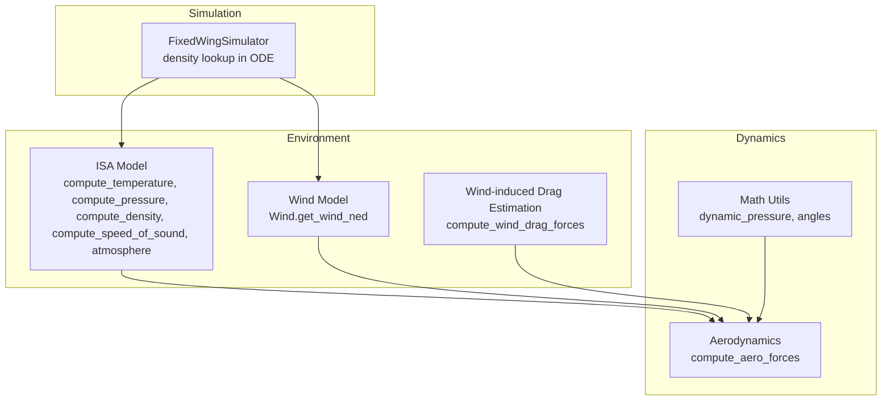
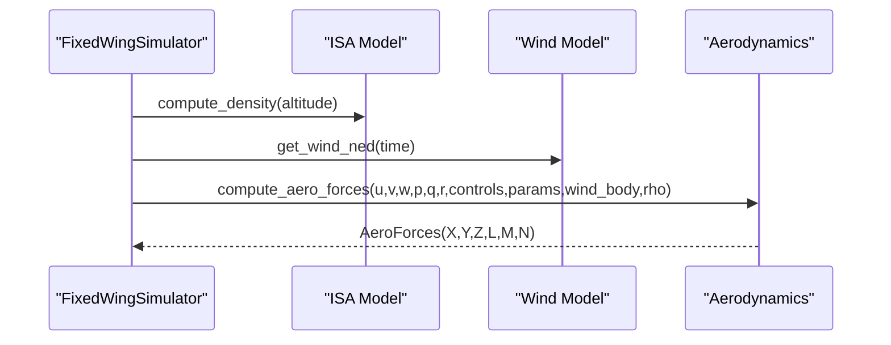
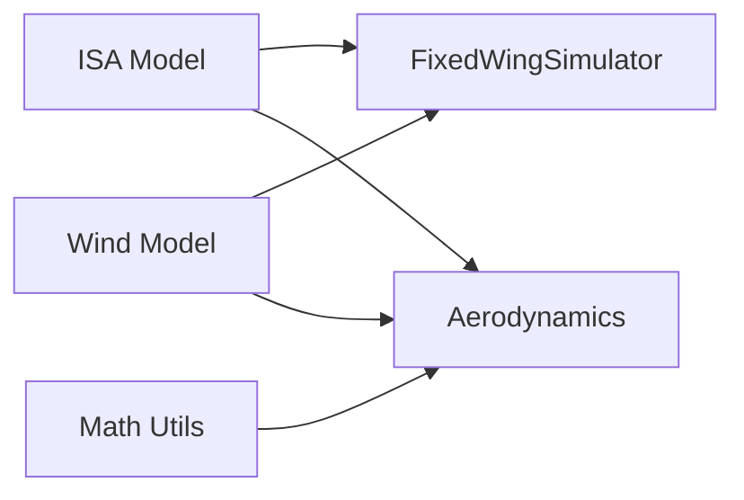

# Atmospheric Models

<cite>
**Referenced Files in This Document**
- [atmosphere_model.py](file://src/environment/atmosphere_model.py)
- [wind_model.py](file://src/environment/wind_model.py)
- [aerodynamic_forces.py](file://src/environment/aerodynamic_forces.py)
- [aerodynamics.py](file://src/dynamics/aerodynamics.py)
- [math_utils.py](file://src/utils/math_utils.py)
- [simulation.yaml](file://config/simulation.yaml)
- [simulator.py](file://src/simulation/simulator.py)
- [example_7_wind_resistance.py](file://examples/7_wind_resistance.py)
- [test_dynamics.py](file://tests/test_dynamics.py)
</cite>

## Table of Contents
1. [Introduction](#introduction)
2. [Project Structure](#project-structure)
3. [Core Components](#core-components)
4. [Architecture Overview](#architecture-overview)
5. [Detailed Component Analysis](#detailed-component-analysis)
6. [Dependency Analysis](#dependency-analysis)
7. [Performance Considerations](#performance-considerations)
8. [Troubleshooting Guide](#troubleshooting-guide)
9. [Conclusion](#conclusion)
10. [Appendices](#appendices)

## Introduction
This document describes the atmospheric modeling system used in the fixed-wing simulation framework. It focuses on the International Standard Atmosphere (ISA) implementation, covering temperature, pressure, density, and speed of sound as functions of altitude. It explains the mathematical relationships, numerical behavior, and integration with aerodynamic force computations. Practical usage patterns, performance characteristics, and validation approaches are included to support accurate and efficient simulations.

## Project Structure
The atmospheric modeling capability resides primarily in the environment package and integrates with dynamics and simulation modules:
- Environment: ISA model, wind models, and auxiliary wind-induced drag estimation
- Dynamics: Aerodynamic force and moment computation in the body frame
- Utilities: Mathematical helpers for angles, rotations, and dynamic pressure
- Simulation: Orchestration that queries atmospheric density during integration



**Diagram sources**
- [atmosphere_model.py](file://src/environment/atmosphere_model.py#L24-L76)
- [wind_model.py](file://src/environment/wind_model.py#L18-L113)
- [aerodynamic_forces.py](file://src/environment/aerodynamic_forces.py#L13-L53)
- [aerodynamics.py](file://src/dynamics/aerodynamics.py#L35-L147)
- [math_utils.py](file://src/utils/math_utils.py#L107-L123)
- [simulator.py](file://src/simulation/simulator.py#L335-L337)

**Section sources**
- [atmosphere_model.py](file://src/environment/atmosphere_model.py#L1-L77)
- [wind_model.py](file://src/environment/wind_model.py#L1-L113)
- [aerodynamic_forces.py](file://src/environment/aerodynamic_forces.py#L1-L54)
- [aerodynamics.py](file://src/dynamics/aerodynamics.py#L1-L148)
- [math_utils.py](file://src/utils/math_utils.py#L1-L124)
- [simulator.py](file://src/simulation/simulator.py#L1-L642)

## Core Components
- ISA Model: Computes temperature, pressure, density, and speed of sound as piecewise functions of altitude, covering the troposphere and lower stratosphere.
- Wind Model: Provides wind vectors in NED coordinates for various wind types (none, fixed, sine, random sine).
- Wind-Induced Drag Estimator: Estimates additional body-frame drag due to relative wind speed for perturbation analysis.
- Aerodynamics: Computes forces and moments in the body frame using dynamic pressure, angles, and linearized coefficients.
- Math Utilities: Supplies angle wrapping, rotation matrices, and dynamic pressure.

Key API surface for atmospheric properties:
- Temperature: compute_temperature(altitude_m)
- Pressure: compute_pressure(altitude_m)
- Density: compute_density(altitude_m)
- Speed of sound: compute_speed_of_sound(altitude_m)
- Combined: atmosphere(altitude_m) returns (density, pressure, temperature, speed of sound)

**Section sources**
- [atmosphere_model.py](file://src/environment/atmosphere_model.py#L24-L76)
- [wind_model.py](file://src/environment/wind_model.py#L18-L113)
- [aerodynamic_forces.py](file://src/environment/aerodynamic_forces.py#L13-L53)
- [aerodynamics.py](file://src/dynamics/aerodynamics.py#L35-L147)
- [math_utils.py](file://src/utils/math_utils.py#L107-L123)

## Architecture Overview
The ISA model supplies density to the simulation’s ODE function at each step. Wind is transformed from NED to body frame and combined with aircraft velocity to form the true airspeed vector used by aerodynamics. The wind-induced drag estimator optionally augments aerodynamic forces for sensitivity analysis.



**Diagram sources**
- [simulator.py](file://src/simulation/simulator.py#L329-L337)
- [atmosphere_model.py](file://src/environment/atmosphere_model.py#L48-L52)
- [wind_model.py](file://src/environment/wind_model.py#L76-L108)
- [aerodynamics.py](file://src/dynamics/aerodynamics.py#L35-L147)

## Detailed Component Analysis

### International Standard Atmosphere (ISA) Model
The ISA implementation defines:
- Sea-level standard temperature, pressure, density, gas constant, ratio of specific heats
- Tropospheric temperature lapse rate and tropopause altitude
- Derived quantities at the tropopause (temperature, pressure, density)
- Piecewise computation functions:
  - Temperature: linear decrease in the troposphere, constant in the lower stratosphere
  - Pressure: uses temperature in the troposphere via an exponential relation; exponential decay in the stratosphere
  - Density: derived from ideal gas law using computed pressure and temperature
  - Speed of sound: depends only on temperature and ratio of specific heats
  - Convenience function returns all four properties together

```mermaid
flowchart TD
Start(["Input altitude"]) --> Clip["Clip to valid range"]
Clip --> Layer{"Below tropopause?"}
Layer --> |Yes| TempTrop["T = T0 + L*h"]
Layer --> |No| TempStrat["T = T_trop (constant)"]
TempTrop --> PressTrop["P = P0*(T/T0)^(-g/(L*R))"
TempStrat --> PressStrat["P = P_trop*exp(-g*dh/(R*T_trop))"]
PressTrop --> DenTrop["rho = P/(R*T)"]
PressStrat --> DenStrat["rho = P/(R*T)"]
DenTrop --> Sound["a = sqrt(gamma*R*T)"]
DenStrat --> Sound
Sound --> End(["Outputs: rho, P, T, a"])
```

**Diagram sources**
- [atmosphere_model.py](file://src/environment/atmosphere_model.py#L24-L76)

Implementation highlights:
- Altitude clipping prevents extreme extrapolation outside the model range.
- Tropopause boundary ensures continuity of temperature and smooth transition to stratospheric pressure decay.
- Ideal gas law and thermodynamic relations yield consistent density and speed of sound.

Practical usage:
- Single-property queries for density, pressure, temperature, speed of sound
- Combined query for all properties at once

Validation references:
- Dynamic pressure test verifies expected value at sea level and 30 m/s
- Tests confirm numerical stability and expected scaling with density

**Section sources**
- [atmosphere_model.py](file://src/environment/atmosphere_model.py#L10-L21)
- [atmosphere_model.py](file://src/environment/atmosphere_model.py#L24-L76)
- [test_dynamics.py](file://tests/test_dynamics.py#L190-L194)

### Wind Model
The Wind class supports multiple wind types:
- NONE: zero wind
- FIXED: constant wind vector in NED coordinates
- SINE: sinusoidal superposition across three axes with randomized frequencies and phases
- RANDOMSINE: mean plus sinusoidal fluctuations resembling turbulence

Key behaviors:
- Wind FROM direction follows meteorological convention; fixed wind precomputes NED unit vector
- SINE/RANDOMSINE initialize amplitudes, frequencies, and phases using a pseudorandom number generator
- get_wind_ned returns the NED wind vector at time t

Integration:
- Simulator transforms NED wind to body frame for aerodynamic computations
- Wind configuration is controlled via simulation configuration

**Section sources**
- [wind_model.py](file://src/environment/wind_model.py#L18-L113)
- [simulation.yaml](file://config/simulation.yaml#L22-L25)
- [simulator.py](file://src/simulation/simulator.py#L331-L334)

### Wind-Induced Drag Estimator
Estimates additional body-frame drag caused by relative wind speed beyond baseline aerodynamics:
- Computes relative velocity between aircraft body velocity and wind body velocity
- If relative speed is below a small threshold, returns zero force
- Otherwise, computes dynamic pressure using provided density and uses reference area and baseline drag coefficient
- Returns a force vector in the body frame, opposing the direction of relative velocity

Usage context:
- Useful for perturbation/sensitivity analysis where wind-induced effects are isolated

**Section sources**
- [aerodynamic_forces.py](file://src/environment/aerodynamic_forces.py#L13-L53)

### Aerodynamics (Body Frame)
Computes aerodynamic forces and moments in the body frame:
- Inputs: body-frame velocities, angular rates, control deflections, wind body velocity, density
- Computes true airspeed vector by subtracting wind body velocity
- Calculates angle of attack and sideslip angle
- Uses dynamic pressure from density and airspeed
- Applies linearized aerodynamic coefficients to compute force and moment coefficients
- Converts coefficients to forces and moments in the body frame

Integration with atmosphere:
- Density is supplied by ISA density lookup from altitude
- Dynamic pressure depends on density and airspeed, both altitude-dependent

**Section sources**
- [aerodynamics.py](file://src/dynamics/aerodynamics.py#L35-L147)
- [math_utils.py](file://src/utils/math_utils.py#L107-L123)
- [simulator.py](file://src/simulation/simulator.py#L335-L337)

## Dependency Analysis
- ISA model is consumed by the simulation engine to supply density at each integration step.
- Wind model is used to obtain NED wind vectors, transformed to body frame for aerodynamics.
- Aerodynamic computations depend on density, angles, and dynamic pressure.
- Math utilities provide angle wrapping, rotation matrices, and dynamic pressure.



**Diagram sources**
- [simulator.py](file://src/simulation/simulator.py#L335-L337)
- [wind_model.py](file://src/environment/wind_model.py#L76-L108)
- [aerodynamics.py](file://src/dynamics/aerodynamics.py#L76-L77)
- [math_utils.py](file://src/utils/math_utils.py#L121-L123)

**Section sources**
- [simulator.py](file://src/simulation/simulator.py#L329-L337)
- [aerodynamics.py](file://src/dynamics/aerodynamics.py#L76-L77)
- [math_utils.py](file://src/utils/math_utils.py#L121-L123)

## Performance Considerations
- Computational complexity: ISA model operations are scalar/vector arithmetic with minimal branching; suitable for real-time simulation.
- Numerical stability: Altitude clipping and small thresholds in dynamic pressure and relative velocity prevent pathological cases.
- Memory and cache: Wind model precomputes unit vectors and sinusoidal parameters; repeated calls avoid recomputation.
- Real-time integration: Simulation step size and integrator tolerances are configured centrally to balance accuracy and performance.

[No sources needed since this section provides general guidance]

## Troubleshooting Guide
Common issues and resolutions:
- Unexpected atmospheric parameters:
  - Verify altitude is within the valid range; the ISA model clips inputs.
  - If pressure or density appear incorrect, inspect computed temperature for extreme values.
- Wind configuration problems:
  - Ensure wind type is one of the supported values; direction and speed must follow conventions.
  - For random sine wind, confirm initialization of frequencies and phases.
- Aerodynamic computation anomalies:
  - Very small relative velocities lead to zero wind-induced drag; adjust inputs or thresholds.
  - Angle calculations rely on numerical safeguards; check airspeed magnitude and velocity components.
- Simulation configuration:
  - Wind type, speed, and direction are configurable; command-line overrides apply where used.

**Section sources**
- [atmosphere_model.py](file://src/environment/atmosphere_model.py#L30-L34)
- [wind_model.py](file://src/environment/wind_model.py#L39-L41)
- [aerodynamic_forces.py](file://src/environment/aerodynamic_forces.py#L42-L43)
- [math_utils.py](file://src/utils/math_utils.py#L117-L118)
- [simulation.yaml](file://config/simulation.yaml#L22-L25)

## Conclusion
The atmospheric modeling system provides a robust, efficient ISA implementation integrated with wind models and aerodynamic computations. It enables accurate, real-time simulations of fixed-wing flight across altitudes and wind conditions. The modular design allows straightforward extension and validation, supporting both closed-loop and open-loop analyses.

[No sources needed since this section summarizes without analyzing specific files]

## Appendices

### API Reference: Atmospheric Properties
- compute_temperature(altitude_m): returns temperature in Kelvin
- compute_pressure(altitude_m): returns pressure in Pascals
- compute_density(altitude_m): returns density in kg/m³
- compute_speed_of_sound(altitude_m): returns speed of sound in m/s
- atmosphere(altitude_m): returns (density, pressure, temperature, speed of sound)

Usage examples:
- Single-property queries for targeted computations
- Combined query for density-pressure-temperature-speed-of-sound tuples

**Section sources**
- [atmosphere_model.py](file://src/environment/atmosphere_model.py#L24-L76)

### Mathematical Foundations
- Temperature profile:
  - Troposphere: T(h) = T0 + L · h
  - Stratosphere: T = constant (T_trop)
- Pressure:
  - Troposphere: P(h) = P0 · (T(h)/T0)^(−g/(L·R))
  - Stratosphere: P(h) = P_trop · exp(−g·Δh/(R·T_trop))
- Density:
  - ρ = P/(R·T)
- Speed of sound:
  - a = sqrt(γ·R·T)

These formulas align with the ISA model implementation and are used consistently across the simulation pipeline.

**Section sources**
- [atmosphere_model.py](file://src/environment/atmosphere_model.py#L10-L21)
- [atmosphere_model.py](file://src/environment/atmosphere_model.py#L37-L58)

### Integration Patterns
- Simulation loop obtains NED wind, transforms to body frame, queries density from ISA, and computes aerodynamic forces.
- Example script demonstrates closed-loop flight under random sine wind with waypoint tracking.

**Section sources**
- [simulator.py](file://src/simulation/simulator.py#L329-L337)
- [example_7_wind_resistance.py](file://examples/7_wind_resistance.py#L24-L39)

### Validation Approaches
- Dynamic pressure verification at sea level and 30 m/s airspeed
- Tests ensure numerical stability and expected scaling with density and airspeed
- Aerodynamic computations validated for sign conventions, symmetry, and sensitivity to wind

**Section sources**
- [test_dynamics.py](file://tests/test_dynamics.py#L190-L194)
- [aerodynamics.py](file://src/dynamics/aerodynamics.py#L128-L140)