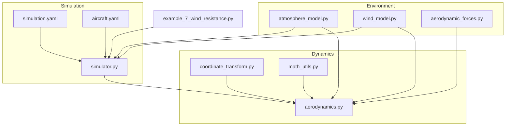
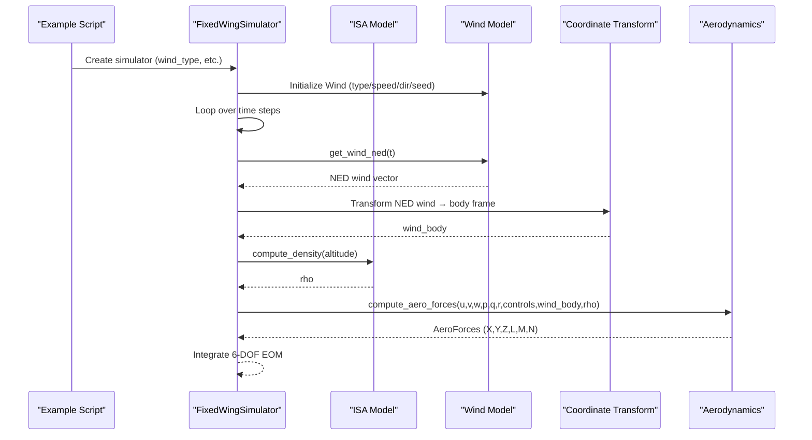
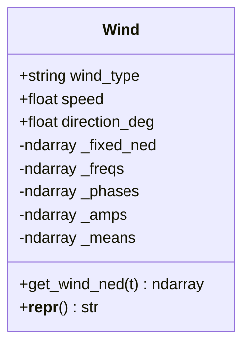
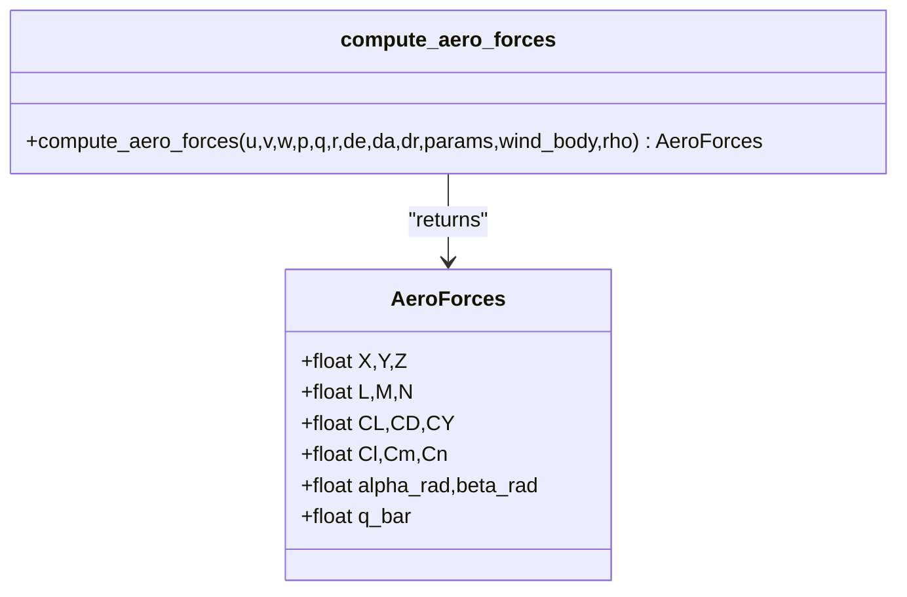
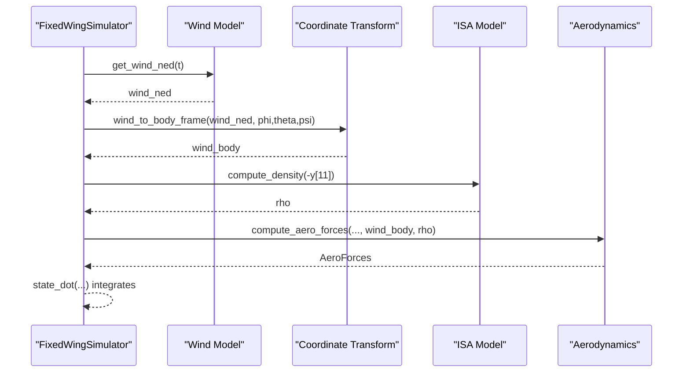
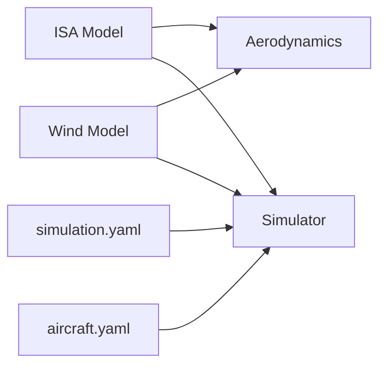

# Environment and Weather Modeling

<cite>
**Referenced Files in This Document**
- [atmosphere_model.py](file://src/environment/atmosphere_model.py)
- [wind_model.py](file://src/environment/wind_model.py)
- [aerodynamic_forces.py](file://src/environment/aerodynamic_forces.py)
- [aerodynamics.py](file://src/dynamics/aerodynamics.py)
- [coordinate_transform.py](file://src/dynamics/coordinate_transform.py)
- [math_utils.py](file://src/utils/math_utils.py)
- [simulator.py](file://src/simulation/simulator.py)
- [simulation.yaml](file://config/simulation.yaml)
- [aircraft.yaml](file://config/aircraft.yaml)
- [example_7_wind_resistance.py](file://examples/example_7_wind_resistance.py)
</cite>

## Table of Contents
1. [Introduction](#introduction)
2. [Project Structure](#project-structure)
3. [Core Components](#core-components)
4. [Architecture Overview](#architecture-overview)
5. [Detailed Component Analysis](#detailed-component-analysis)
6. [Dependency Analysis](#dependency-analysis)
7. [Performance Considerations](#performance-considerations)
8. [Troubleshooting Guide](#troubleshooting-guide)
9. [Conclusion](#conclusion)
10. [Appendices](#appendices)

## Introduction
This document describes the environmental modeling system used by the fixed-wing simulator. It covers:
- International Standard Atmosphere (ISA) model for temperature, pressure, density, and speed of sound
- Wind field generation supporting calm, steady, sinusoidal, and random-sine disturbances
- Aerodynamic force calculation integrating environmental effects (density and wind)
- Practical configuration examples and validation approaches
- Computational efficiency and realism considerations

## Project Structure
The environment system is organized into three primary modules:
- Atmosphere model: computes thermodynamic properties from altitude
- Wind model: generates NED wind vectors over time
- Aerodynamic forces: computes incremental wind-induced drag

These feed into the dynamics module, which computes forces and moments in the body frame, and the simulation orchestrator, which ties everything together.



**Diagram sources**
- [atmosphere_model.py](file://src/environment/atmosphere_model.py#L1-L77)
- [wind_model.py](file://src/environment/wind_model.py#L1-L113)
- [aerodynamic_forces.py](file://src/environment/aerodynamic_forces.py#L1-L54)
- [aerodynamics.py](file://src/dynamics/aerodynamics.py#L1-L148)
- [coordinate_transform.py](file://src/dynamics/coordinate_transform.py#L1-L70)
- [math_utils.py](file://src/utils/math_utils.py#L1-L124)
- [simulator.py](file://src/simulation/simulator.py#L1-L200)
- [simulation.yaml](file://config/simulation.yaml#L1-L30)
- [aircraft.yaml](file://config/aircraft.yaml#L1-L13)
- [example_7_wind_resistance.py](file://examples/example_7_wind_resistance.py#L1-L52)

**Section sources**
- [atmosphere_model.py](file://src/environment/atmosphere_model.py#L1-L77)
- [wind_model.py](file://src/environment/wind_model.py#L1-L113)
- [aerodynamic_forces.py](file://src/environment/aerodynamic_forces.py#L1-L54)
- [aerodynamics.py](file://src/dynamics/aerodynamics.py#L1-L148)
- [coordinate_transform.py](file://src/dynamics/coordinate_transform.py#L1-L70)
- [math_utils.py](file://src/utils/math_utils.py#L1-L124)
- [simulator.py](file://src/simulation/simulator.py#L1-L200)
- [simulation.yaml](file://config/simulation.yaml#L1-L30)
- [aircraft.yaml](file://config/aircraft.yaml#L1-L13)
- [example_7_wind_resistance.py](file://examples/example_7_wind_resistance.py#L1-L52)

## Core Components
- International Standard Atmosphere (ISA): computes T, P, ρ, and speed of sound from altitude, covering the troposphere and lower stratosphere.
- Wind model: supports NONE, FIXED, SINE, and RANDOMSINE wind types; returns NED wind vectors at any time t.
- Aerodynamic forces: computes incremental body-frame drag due to wind-relative velocity using a simplified quadratic drag model.
- Dynamics integration: computes full aerodynamic forces and moments using body-frame velocities, angular rates, control surface deflections, wind, and density.

**Section sources**
- [atmosphere_model.py](file://src/environment/atmosphere_model.py#L24-L76)
- [wind_model.py](file://src/environment/wind_model.py#L18-L113)
- [aerodynamic_forces.py](file://src/environment/aerodynamic_forces.py#L13-L53)
- [aerodynamics.py](file://src/dynamics/aerodynamics.py#L35-L147)

## Architecture Overview
The simulation loop retrieves NED wind from the wind model, transforms it to the body frame, queries density from the ISA model, and computes aerodynamic forces. The simulator integrates the 6-DOF equations of motion.



**Diagram sources**
- [simulator.py](file://src/simulation/simulator.py#L329-L337)
- [atmosphere_model.py](file://src/environment/atmosphere_model.py#L48-L52)
- [wind_model.py](file://src/environment/wind_model.py#L76-L108)
- [coordinate_transform.py](file://src/dynamics/coordinate_transform.py#L39-L53)
- [aerodynamics.py](file://src/dynamics/aerodynamics.py#L35-L147)
- [example_7_wind_resistance.py](file://examples/example_7_wind_resistance.py#L20-L36)

## Detailed Component Analysis

### International Standard Atmosphere (ISA)
- Coverage: Troposphere (0–11 km) with linear temperature lapse; lower stratosphere (11–20 km) with constant temperature.
- Inputs: altitude in meters; outputs: temperature (K), pressure (Pa), density (kg/m³), speed of sound (m/s).
- Implementation highlights:
  - Temperature computed via clipping altitude to safe bounds and applying piecewise lapse rate.
  - Pressure derived from hydrostatic relations with exponential decay in the stratified region.
  - Density from ideal gas law using computed pressure and temperature.
  - Speed of sound depends only on temperature and specific heat ratio.

```mermaid
flowchart TD
Start(["Altitude input"]) --> Clip["Clip to valid range"]
Clip --> Layer{"Below tropopause?"}
Layer --> |Yes| Trop["T = T0 + L*h"]
Layer --> |No| Strat["T = constant (T_trop)"]
Trop --> PTrop["P = P0*(T/T0)^(-G0/(L*R))"
Strat --> PStrat["P = P_trop * exp(-G0*dh/(R*T_trop))"]
PTrop --> RhoTrop["rho = P/(R*T)"]
PStrat --> RhoStrat["rho = P/(R*T)"]
RhoTrop --> Sound["a = sqrt(GAMMA*R*T)"]
RhoStrat --> Sound
Sound --> End(["Outputs: rho, P, T, a"])
```

**Diagram sources**
- [atmosphere_model.py](file://src/environment/atmosphere_model.py#L24-L76)

**Section sources**
- [atmosphere_model.py](file://src/environment/atmosphere_model.py#L10-L21)
- [atmosphere_model.py](file://src/environment/atmosphere_model.py#L24-L76)

### Wind Field Model
- Supported types:
  - NONE: zero wind
  - FIXED: constant NED wind vector based on “FROM” direction and speed
  - SINE: sinusoidal superposition per axis (3 harmonics), frequency 0.1–0.5 Hz
  - RANDOMSINE: adds independent mean per axis and randomized amplitudes to SINE
- NED convention: “FROM” direction 0° is from North; wind direction is toward direction + 180°.
- Initialization precomputes:
  - Fixed NED unit vector for steady component
  - Frequency, phase, amplitude matrices (and means for RANDOMSINE)
- Runtime cost: O(1) per step; negligible overhead.



**Diagram sources**
- [wind_model.py](file://src/environment/wind_model.py#L18-L113)

**Section sources**
- [wind_model.py](file://src/environment/wind_model.py#L18-L113)
- [simulation.yaml](file://config/simulation.yaml#L22-L25)

### Aerodynamic Force Calculation with Environmental Effects
- Inputs: body-frame velocities [u, v, w], angular rates [p, q, r], control deflections [de, da, dr], wind in body frame, air density ρ.
- True airspeed vector is computed by subtracting wind_body from body velocity.
- Angles: angle-of-attack and sideslip computed numerically with safeguards.
- Dynamic pressure q_bar = 0.5·ρ·V².
- Force/moment coefficients modeled via linear/quadratic functions of angles and non-dimensional rates; forces converted to body frame.
- Wind-induced incremental drag: simple quadratic model in body frame to estimate extra drag due to relative wind.



**Diagram sources**
- [aerodynamics.py](file://src/dynamics/aerodynamics.py#L19-L147)
- [math_utils.py](file://src/utils/math_utils.py#L107-L124)

**Section sources**
- [aerodynamics.py](file://src/dynamics/aerodynamics.py#L35-L147)
- [math_utils.py](file://src/utils/math_utils.py#L107-L124)
- [aerodynamic_forces.py](file://src/environment/aerodynamic_forces.py#L13-L53)

### Integration in the Simulator
- The simulator constructs a time-varying ODE that:
  - Retrieves NED wind at time t
  - Transforms to body frame using current Euler angles
  - Queries density from ISA using altitude
  - Computes aerodynamics with environmental inputs
- This enables realistic closed-loop simulation with environmental effects integrated into the 6-DOF dynamics.



**Diagram sources**
- [simulator.py](file://src/simulation/simulator.py#L329-L337)
- [wind_model.py](file://src/environment/wind_model.py#L76-L108)
- [coordinate_transform.py](file://src/dynamics/coordinate_transform.py#L39-L53)
- [atmosphere_model.py](file://src/environment/atmosphere_model.py#L48-L52)
- [aerodynamics.py](file://src/dynamics/aerodynamics.py#L35-L147)

**Section sources**
- [simulator.py](file://src/simulation/simulator.py#L329-L337)
- [coordinate_transform.py](file://src/dynamics/coordinate_transform.py#L39-L53)
- [atmosphere_model.py](file://src/environment/atmosphere_model.py#L48-L52)
- [aerodynamics.py](file://src/dynamics/aerodynamics.py#L35-L147)

## Dependency Analysis
- Environment-to-dynamics coupling:
  - ISA model supplies density to aerodynamics
  - Wind model supplies NED wind vectors transformed to body frame for relative airspeed
- Simulation orchestration:
  - Simulator initializes Wind and ISA-dependent density
  - Integrator passes state and controls to dynamics, which incorporate environmental inputs
- Configuration:
  - simulation.yaml sets default wind type, speed, and direction
  - aircraft.yaml selects aircraft and optional parameter overrides



**Diagram sources**
- [simulator.py](file://src/simulation/simulator.py#L159-L163)
- [simulation.yaml](file://config/simulation.yaml#L22-L25)
- [aircraft.yaml](file://config/aircraft.yaml#L5-L12)

**Section sources**
- [simulator.py](file://src/simulation/simulator.py#L159-L163)
- [simulation.yaml](file://config/simulation.yaml#L22-L25)
- [aircraft.yaml](file://config/aircraft.yaml#L5-L12)

## Performance Considerations
- ISA model: scalar/vector arithmetic only; very low computational cost.
- Wind model: SINE/RANDOMSINE involve small fixed loops (per-axis sinusoids); initialization precomputes frequencies/phases/means; runtime cost remains negligible.
- Numerical stability: altitude clipping and small thresholds protect against extreme inputs and singularities.
- Real-time feasibility: with typical integration tolerances and step sizes, the environment modules impose minimal overhead.

[No sources needed since this section provides general guidance]

## Troubleshooting Guide
- ISA anomalies:
  - Verify altitude is within expected ranges; the model clips inputs.
  - If pressure/density appear invalid, confirm temperature is physically meaningful.
- Wind configuration:
  - Ensure wind_type is one of the supported values.
  - Confirm wind direction follows meteorological “FROM” convention and speed is positive.
  - For RANDOMSINE, confirm initialization generated parameters without errors.
- Aerodynamics:
  - Very small relative airspeed can yield negligible incremental drag; adjust wind/body speeds accordingly.
  - Angle and sideslip calculations include safeguards; check for extreme velocity components.
- Simulation:
  - If instability occurs with wind disturbances, reduce wind speed or frequency range.
  - Validate configuration overrides in simulation.yaml and aircraft.yaml.

**Section sources**
- [atmosphere_model.py](file://src/environment/atmosphere_model.py#L30-L34)
- [wind_model.py](file://src/environment/wind_model.py#L39-L41)
- [aerodynamic_forces.py](file://src/environment/aerodynamic_forces.py#L42-L43)
- [simulation.yaml](file://config/simulation.yaml#L22-L25)
- [aircraft.yaml](file://config/aircraft.yaml#L5-L12)

## Conclusion
The environment system combines a robust ISA model, flexible wind field generation, and body-frame aerodynamics to deliver realistic fixed-wing simulations. The modular design allows straightforward configuration and validation, while maintaining computational efficiency suitable for real-time and batch analyses.

[No sources needed since this section summarizes without analyzing specific files]

## Appendices

### Practical Configuration Examples
- Wind field generation:
  - Configure wind_type, wind_speed, and wind_direction_deg in simulation.yaml to set defaults.
  - Override at runtime by passing explicit parameters when constructing the simulator.
  - Example script demonstrates RANDOMSINE wind in FBW_B mode with a straight-line waypoint mission.
- Atmospheric conditions:
  - Density is queried automatically from altitude during simulation.
  - For sensitivity analysis, vary altitude to observe effects on lift/drag scaling.

**Section sources**
- [simulation.yaml](file://config/simulation.yaml#L22-L25)
- [example_7_wind_resistance.py](file://examples/example_7_wind_resistance.py#L20-L36)

### Validation Procedures
- Cross-check ISA outputs against standard tables at representative altitudes.
- Compare simulated dynamic pressure q_bar against analytical values at sea level and altitude.
- Evaluate disturbance rejection by comparing altitude and airspeed deviations under different wind types.
- Use the example script to visualize and compare responses across wind scenarios.

**Section sources**
- [example_7_wind_resistance.py](file://examples/example_7_wind_resistance.py#L38-L51)