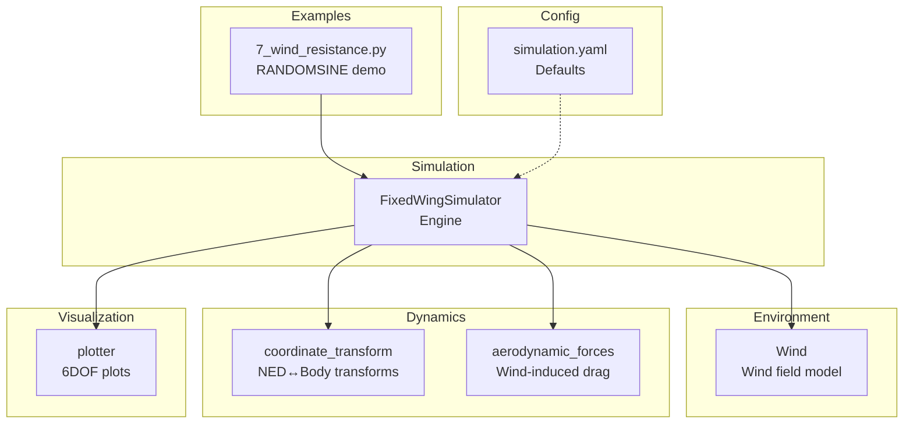
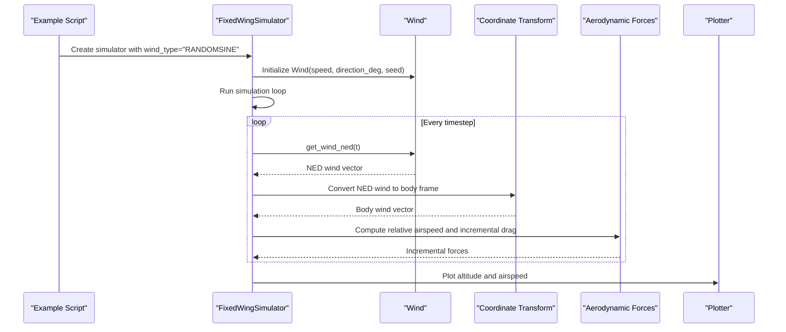
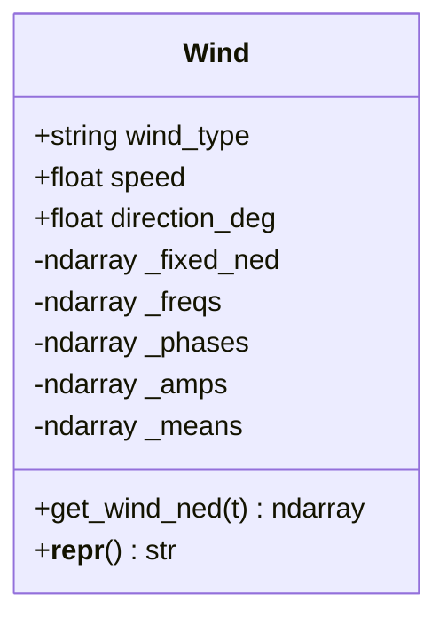
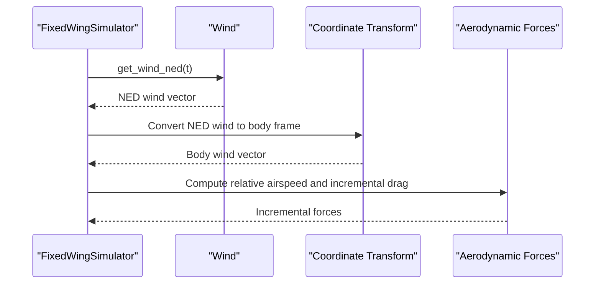
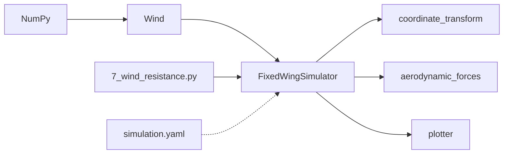

# Wind Field Models

<cite>
**Referenced Files in This Document**
- [wind_model.py](file://src/environment/wind_model.py)
- [wind_model.md](file://doc/zh/content/环境系统/风场模型.md)
- [simulator.py](file://src/simulation/simulator.py)
- [coordinate_transform.py](file://src/dynamics/coordinate_transform.py)
- [aerodynamic_forces.py](file://src/environment/aerodynamic_forces.py)
- [7_wind_resistance.py](file://examples/7_wind_resistance.py)
- [simulation.yaml](file://config/simulation.yaml)
- [plotter.py](file://src/visualization/plotter.py)
- [math_utils.py](file://src/utils/math_utils.py)
</cite>

## Table of Contents
1. [Introduction](#introduction)
2. [Project Structure](#project-structure)
3. [Core Components](#core-components)
4. [Architecture Overview](#architecture-overview)
5. [Detailed Component Analysis](#detailed-component-analysis)
6. [Dependency Analysis](#dependency-analysis)
7. [Performance Considerations](#performance-considerations)
8. [Troubleshooting Guide](#troubleshooting-guide)
9. [Conclusion](#conclusion)
10. [Appendices](#appendices)

## Introduction
This document provides comprehensive technical documentation for the wind field modeling system used in the fixed-wing simulation framework. It explains the four supported wind types—NONE (zero wind), FIXED (constant wind vector), SINE (sinusoidal superposition of multiple harmonics), and RANDOMSINE (random mean plus sinusoidal fluctuations for turbulence-like effects)—and details the Wind class implementation, initialization parameters, NED coordinate conventions, and vector calculation logic. It also covers the mathematical formulations, frequency generation, amplitude distributions, and phase randomization used to model turbulence-like disturbances. Practical configuration examples, parameter tuning guidelines, integration with the simulation engine, computational efficiency considerations, numerical stability, and validation procedures are included to support reliable and reproducible simulations.

## Project Structure
The wind field model resides in the environment module and integrates with the simulation engine, coordinate transforms, aerodynamic force computations, and visualization tools. The example scripts demonstrate typical usage scenarios, particularly for turbulence-like disturbances.

**Diagram sources**
- [wind_model.py](file://src/environment/wind_model.py#L18-L112)
- [simulator.py](file://src/simulation/simulator.py#L130-L200)
- [coordinate_transform.py](file://src/dynamics/coordinate_transform.py#L39-L69)
- [aerodynamic_forces.py](file://src/environment/aerodynamic_forces.py#L13-L53)
- [7_wind_resistance.py](file://examples/7_wind_resistance.py#L20-L28)
- [simulation.yaml](file://config/simulation.yaml#L22-L25)

**Section sources**
- [wind_model.py](file://src/environment/wind_model.py#L1-L112)
- [simulator.py](file://src/simulation/simulator.py#L130-L200)
- [simulation.yaml](file://config/simulation.yaml#L22-L25)

## Core Components
- Wind class: Generates NED wind vectors for four modes—NONE, FIXED, SINE, RANDOMSINE—based on configurable parameters and internal randomization.
- FixedWingSimulator: Initializes the Wind instance using configuration defaults or explicit parameters and retrieves wind vectors during the simulation loop.
- Coordinate transforms: Converts NED wind vectors to the body frame for computing relative airspeed and integrating wind effects into the dynamics.
- Aerodynamic forces: Computes incremental drag forces due to relative wind for sensitivity and disturbance analysis.
- Example and visualization: Demonstrates RANDOMSINE wind usage and plots altitude and airspeed responses.

**Section sources**
- [wind_model.py](file://src/environment/wind_model.py#L18-L112)
- [simulator.py](file://src/simulation/simulator.py#L130-L200)
- [coordinate_transform.py](file://src/dynamics/coordinate_transform.py#L39-L69)
- [aerodynamic_forces.py](file://src/environment/aerodynamic_forces.py#L13-L53)
- [7_wind_resistance.py](file://examples/7_wind_resistance.py#L20-L28)
- [plotter.py](file://src/visualization/plotter.py#L161-L244)

## Architecture Overview
The simulation loop obtains the NED wind vector from the Wind model, converts it to the body frame, computes relative airspeed, and feeds the aerodynamic model to evaluate wind-induced effects. The example script configures RANDOMSINE wind and runs a closed-loop flight profile.

**Diagram sources**
- [7_wind_resistance.py](file://examples/7_wind_resistance.py#L20-L28)
- [simulator.py](file://src/simulation/simulator.py#L329-L337)
- [wind_model.py](file://src/environment/wind_model.py#L76-L108)
- [coordinate_transform.py](file://src/dynamics/coordinate_transform.py#L39-L69)
- [aerodynamic_forces.py](file://src/environment/aerodynamic_forces.py#L13-L53)
- [plotter.py](file://src/visualization/plotter.py#L161-L244)

## Detailed Component Analysis

### Wind Class: Implementation and Mathematical Formulations
- Initialization parameters:
  - wind_type: One of NONE, FIXED, SINE, RANDOMSINE.
  - speed: Mean wind speed in m/s.
  - direction_deg: Wind FROM direction in degrees (meteorological convention; 0° from North, 90° from East).
  - seed: Random number generator seed for reproducible turbulence.
- NED coordinate system:
  - Wind vectors are generated in NED (North-East-Down).
  - FIXED wind is derived from the FROM direction by converting to the toward direction and scaling by speed.
- Supported wind types:
  - NONE: Zero vector.
  - FIXED: Constant NED vector computed from speed and direction_deg.
  - SINE: Summation of sinusoidal harmonics across three axes; amplitudes are evenly distributed across harmonics.
  - RANDOMSINE: Adds per-axis random means to SINE; amplitudes are independently uniformly distributed per axis and harmonic; frequencies and phases are randomly drawn per axis and harmonic.
- Internal fields:
  - _fixed_ned: Precomputed FIXED wind vector.
  - _freqs: Frequencies per axis and harmonic (0.1–0.5 Hz).
  - _phases: Phase offsets per axis and harmonic.
  - _amps: Amplitudes per axis and harmonic.
  - _means: Per-axis random means (RANDOMSINE only).
- Vector calculation:
  - get_wind_ned(t): Evaluates the wind vector at time t using sine summation for SINE and RANDOMSINE, returns FIXED or ZERO vectors otherwise.

Mathematical formulation summary:
- FIXED: w_ned = speed × unit_vector(from direction).
- SINE: w_ax(t) = Σ_k [ amp_ax,k × sin(2π f_ax,k t + phase_ax,k) ] for ax ∈ {N, E, D}.
- RANDOMSINE: w_ax(t) = mean_ax + Σ_k [ amp_ax,k × sin(2π f_ax,k t + phase_ax,k) ] for ax ∈ {N, E, D}.

Randomization details:
- Frequencies: Uniform in [0.1 Hz, 0.5 Hz] per axis and harmonic.
- Phases: Uniform in [0, 2π) per axis and harmonic.
- Amplitudes:
  - SINE: amp_ax,k = speed / n_harmonics.
  - RANDOMSINE: amp_ax,k ~ Uniform(0, speed).
- Means (RANDOMSINE): mean_ax ~ Uniform(-0.5×speed, 0.5×speed).

Computational complexity:
- get_wind_ned is O(A×K) with A=3 axes and K=3 harmonics by default; constant-time precomputation of FIXED vector and per-step trig evaluations dominate.

**Section sources**
- [wind_model.py](file://src/environment/wind_model.py#L32-L71)
- [wind_model.py](file://src/environment/wind_model.py#L76-L108)

#### Class Diagram

**Diagram sources**
- [wind_model.py](file://src/environment/wind_model.py#L18-L112)

### Integration with Simulation Engine
- FixedWingSimulator reads configuration defaults for wind_type, wind_speed, and wind_direction_deg and creates a Wind instance accordingly.
- During the simulation loop, the engine calls get_wind_ned(t) to retrieve the NED wind vector at each timestep.
- The NED wind vector is transformed to the body frame using the current Euler angles to compute body-frame wind velocity.
- Body-frame wind is used to compute relative airspeed and incremental aerodynamic drag for analysis.

Key integration points:
- Simulator initialization pulls defaults from simulation.yaml and constructs Wind.
- Simulation loop retrieves wind and performs coordinate transformation.
- Aerodynamic forces module computes incremental drag based on relative airspeed.

**Section sources**
- [simulator.py](file://src/simulation/simulator.py#L159-L163)
- [simulator.py](file://src/simulation/simulator.py#L329-L337)
- [coordinate_transform.py](file://src/dynamics/coordinate_transform.py#L39-L69)
- [aerodynamic_forces.py](file://src/environment/aerodynamic_forces.py#L13-L53)

#### Sequence Diagram: Simulation Loop with Wind

**Diagram sources**
- [simulator.py](file://src/simulation/simulator.py#L329-L337)
- [wind_model.py](file://src/environment/wind_model.py#L76-L108)
- [coordinate_transform.py](file://src/dynamics/coordinate_transform.py#L39-L69)
- [aerodynamic_forces.py](file://src/environment/aerodynamic_forces.py#L13-L53)

### Practical Examples and Parameter Tuning
- Example usage:
  - RANDOMSINE wind under FBW_B mode to assess disturbance rejection.
  - Single-well waypoint scenario to maintain altitude and airspeed in turbulent conditions.
- Typical configurations:
  - NONE: Baseline/no wind testing.
  - FIXED: Constant head/tail wind at specified direction and speed.
  - SINE: Periodic disturbances; tune harmonics and speed for cyclic load analysis.
  - RANDOMSINE: Slow turbulence-like disturbances; adjust speed and frequency range to emulate realistic atmospheric conditions.
- Parameter tuning tips:
  - Frequency range [0.1 Hz, 0.5 Hz] balances realism and control bandwidth compatibility.
  - Amplitude distribution: SINE for deterministic periodic tests; RANDOMSINE for stochastic robustness.
  - Direction_deg aligns with meteorological convention; remember FROM direction implies opposite motion.

Validation and visualization:
- Plot altitude and airspeed responses to detect drift or oscillations under wind disturbances.
- Use the 6DOF plotting capabilities to inspect attitude and control inputs under wind.

**Section sources**
- [7_wind_resistance.py](file://examples/7_wind_resistance.py#L20-L28)
- [7_wind_resistance.py](file://examples/7_wind_resistance.py#L38-L51)
- [plotter.py](file://src/visualization/plotter.py#L161-L244)
- [wind_model.md](file://doc/zh/content/环境系统/风场模型.md#L200-L217)

## Dependency Analysis
- Wind depends on NumPy for numerical operations and random sampling.
- FixedWingSimulator depends on Wind for environmental wind input and on coordinate transforms and aerodynamic models for downstream computations.
- Example scripts depend on the simulator and plotting utilities for demonstrations.

**Diagram sources**
- [wind_model.py](file://src/environment/wind_model.py#L14-L15)
- [simulator.py](file://src/simulation/simulator.py#L38-L39)
- [coordinate_transform.py](file://src/dynamics/coordinate_transform.py#L10-L16)
- [aerodynamic_forces.py](file://src/environment/aerodynamic_forces.py#L9-L10)
- [7_wind_resistance.py](file://examples/7_wind_resistance.py#L15-L17)
- [simulation.yaml](file://config/simulation.yaml#L22-L25)

**Section sources**
- [wind_model.py](file://src/environment/wind_model.py#L14-L15)
- [simulator.py](file://src/simulation/simulator.py#L38-L39)
- [coordinate_transform.py](file://src/dynamics/coordinate_transform.py#L10-L16)
- [aerodynamic_forces.py](file://src/environment/aerodynamic_forces.py#L9-L10)
- [7_wind_resistance.py](file://examples/7_wind_resistance.py#L15-L17)
- [simulation.yaml](file://config/simulation.yaml#L22-L25)

## Performance Considerations
- Computational cost:
  - get_wind_ned is O(1) per step for FIXED and NONE.
  - SINE/RANDOMSINE scales with axes and harmonics (default 3×3); precomputation of frequencies, phases, and amplitudes minimizes per-step overhead.
- Memory footprint:
  - Small fixed-size arrays for harmonics and optional means; negligible overhead.
- Numerical stability:
  - Trigonometric evaluations and linear transforms are numerically stable.
  - Relative airspeed computation includes a small threshold to avoid division-related instabilities at very low speeds.

**Section sources**
- [wind_model.py](file://src/environment/wind_model.py#L58-L71)
- [wind_model.py](file://src/environment/wind_model.py#L76-L108)
- [math_utils.py](file://src/utils/math_utils.py#L121-L124)

## Troubleshooting Guide
- Unknown wind type:
  - Ensure wind_type is one of NONE, FIXED, SINE, RANDOMSINE.
- Unexpected wind behavior:
  - Verify wind_speed is positive and wind_direction_deg is within [0°, 360°).
  - For FIXED, confirm the FROM direction aligns with intended motion.
- Simulation instability under wind:
  - Reduce wind_speed or frequency range; verify control gains and flight mode settings.
- Visualization issues:
  - Confirm plotting dependencies and proper import of the plotter module.

**Section sources**
- [wind_model.py](file://src/environment/wind_model.py#L39-L41)
- [wind_model.md](file://doc/zh/content/环境系统/风场模型.md#L274-L283)

## Conclusion
The Wind class provides a concise and efficient foundation for modeling diverse wind environments in fixed-wing simulations. Its four supported types enable systematic testing—from baseline no-wind scenarios to realistic slow-turbulence RANDOMSINE disturbances—while maintaining computational efficiency and numerical stability. Through clear integration with the simulation engine, coordinate transforms, and aerodynamic models, the wind field model supports robust validation and control design assessments.

## Appendices

### Wind Types and Parameter Reference
- NONE: Zero wind vector.
- FIXED: Constant NED wind vector derived from wind_speed and wind_direction_deg.
- SINE: Sinusoidal superposition per axis with uniform amplitudes across harmonics.
- RANDOMSINE: Adds per-axis random means to SINE; amplitudes and means are independently randomized.

**Section sources**
- [wind_model.py](file://src/environment/wind_model.py#L7-L11)
- [wind_model.py](file://src/environment/wind_model.py#L58-L71)
- [wind_model.py](file://src/environment/wind_model.py#L76-L108)

### Configuration and Example Paths
- Configuration: [simulation.yaml](file://config/simulation.yaml#L22-L25)
- Example: [7_wind_resistance.py](file://examples/7_wind_resistance.py#L20-L28)
- Simulator integration: [simulator.py](file://src/simulation/simulator.py#L159-L163), [simulator.py](file://src/simulation/simulator.py#L329-L337)
- Coordinate transforms: [coordinate_transform.py](file://src/dynamics/coordinate_transform.py#L39-L69)
- Aerodynamic forces: [aerodynamic_forces.py](file://src/environment/aerodynamic_forces.py#L13-L53)
- Visualization: [plotter.py](file://src/visualization/plotter.py#L161-L244)