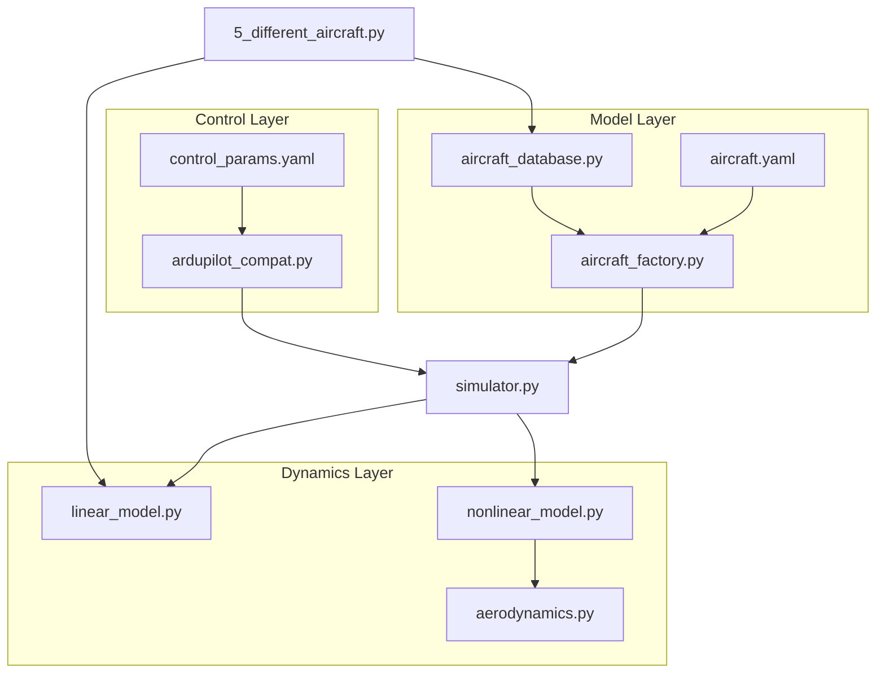
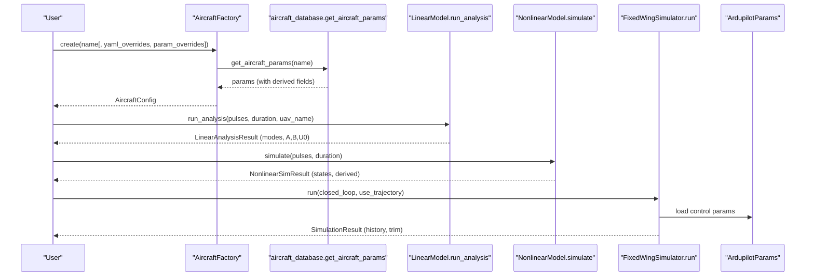
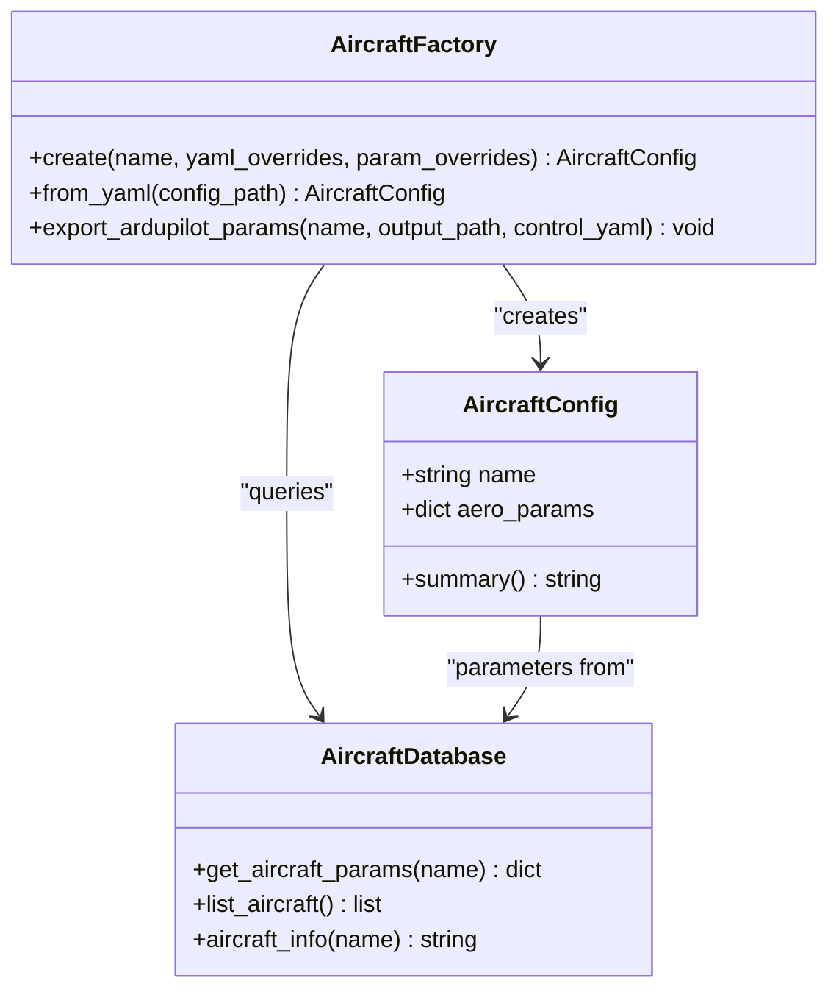
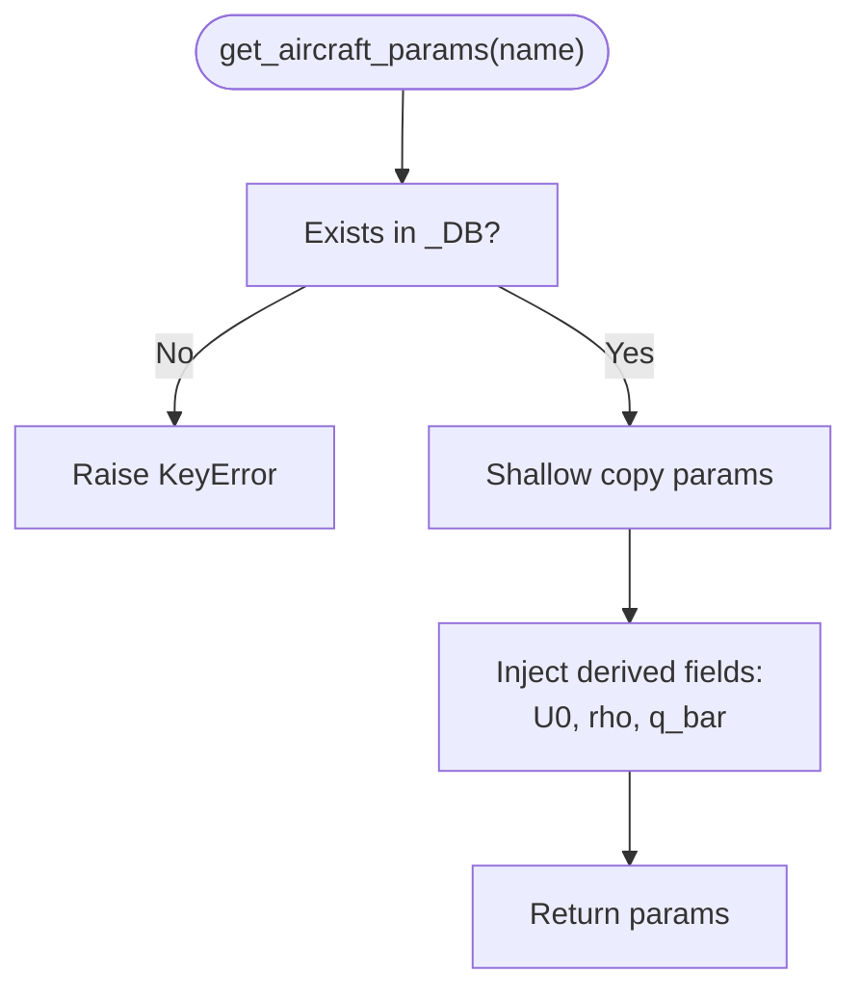
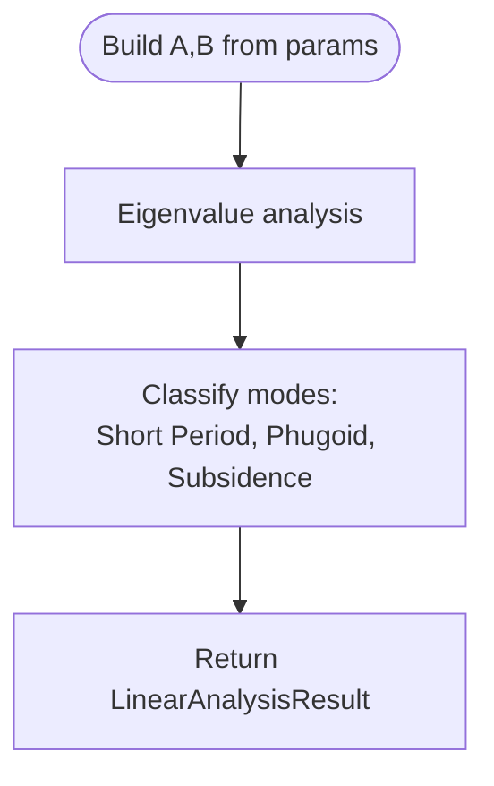
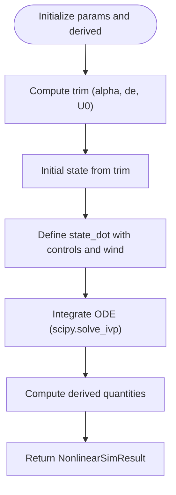
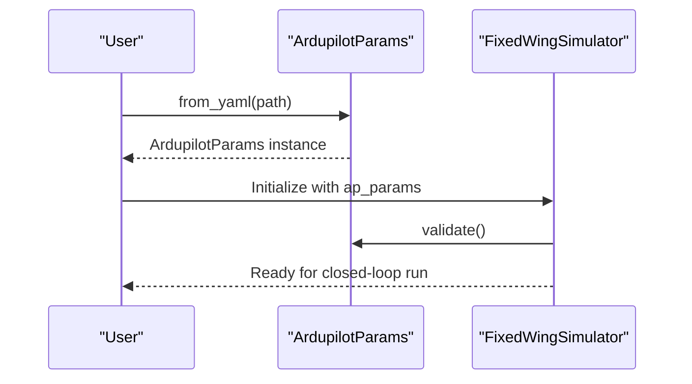
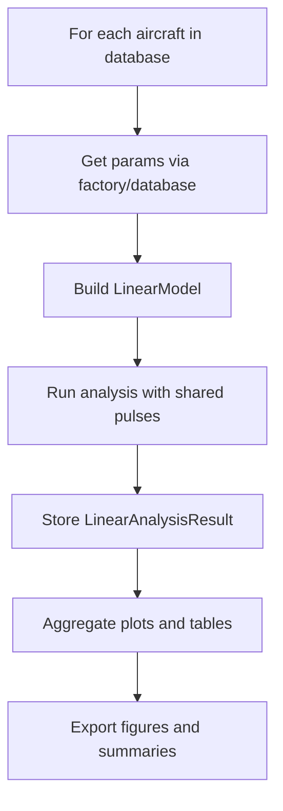
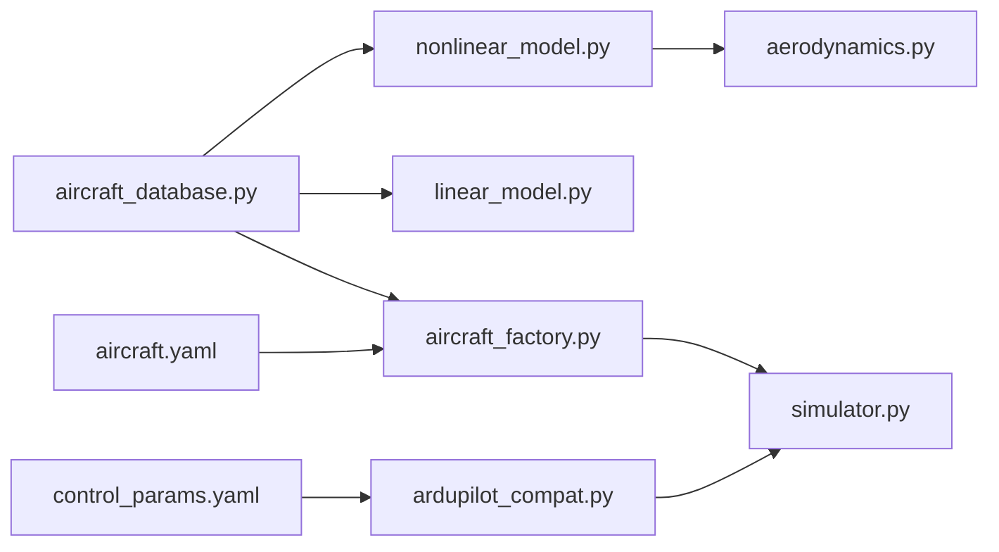

# Aircraft Comparison Studies

<cite>
**Referenced Files in This Document**
- [aircraft_factory.py](file://src/models/aircraft_factory.py)
- [aircraft_database.py](file://src/models/aircraft_database.py)
- [aircraft.yaml](file://config/aircraft.yaml)
- [control_params.yaml](file://config/control_params.yaml)
- [simulator.py](file://src/simulation/simulator.py)
- [linear_model.py](file://src/dynamics/linear_model.py)
- [nonlinear_model.py](file://src/dynamics/nonlinear_model.py)
- [aerodynamics.py](file://src/dynamics/aerodynamics.py)
- [ardupilot_compat.py](file://src/control/ardupilot_compat.py)
- [5_different_aircraft.py](file://examples/5_different_aircraft.py)
</cite>

## Table of Contents
1. [Introduction](#introduction)
2. [Project Structure](#project-structure)
3. [Core Components](#core-components)
4. [Architecture Overview](#architecture-overview)
5. [Detailed Component Analysis](#detailed-component-analysis)
6. [Dependency Analysis](#dependency-analysis)
7. [Performance Considerations](#performance-considerations)
8. [Troubleshooting Guide](#troubleshooting-guide)
9. [Conclusion](#conclusion)
10. [Appendices](#appendices)

## Introduction
This document explains how to systematically compare different fixed-wing aircraft configurations using the simulation framework. It covers:
- Parameter databases and factory-driven configuration management
- Performance characteristics extraction via linear and nonlinear analyses
- Control behavior assessment using ArduPilot-compatible control layers
- Comparative analysis methodologies for key performance indicators such as stall speed, service ceiling, endurance, and handling qualities
- Practical guidance for selecting aircraft designs suited to specific mission profiles and understanding trade-offs among design parameters

## Project Structure
The aircraft comparison capability spans several layers:
- Model layer: aircraft parameter database and factory for unified configuration
- Dynamics layer: linear and nonlinear simulation models
- Control layer: ArduPilot-compatible control parameters and controllers
- Simulation orchestrator: top-level simulator coordinating modules
- Examples: ready-to-run comparative studies

**Diagram sources**
- [aircraft_database.py](file://src/models/aircraft_database.py#L1-L183)
- [aircraft_factory.py](file://src/models/aircraft_factory.py#L1-L136)
- [aircraft.yaml](file://config/aircraft.yaml#L1-L13)
- [linear_model.py](file://src/dynamics/linear_model.py#L1-L319)
- [nonlinear_model.py](file://src/dynamics/nonlinear_model.py#L1-L386)
- [aerodynamics.py](file://src/dynamics/aerodynamics.py#L1-L148)
- [ardupilot_compat.py](file://src/control/ardupilot_compat.py#L1-L130)
- [control_params.yaml](file://config/control_params.yaml#L1-L45)
- [simulator.py](file://src/simulation/simulator.py#L1-L642)
- [5_different_aircraft.py](file://examples/5_different_aircraft.py#L1-L82)

**Section sources**
- [aircraft_database.py](file://src/models/aircraft_database.py#L1-L183)
- [aircraft_factory.py](file://src/models/aircraft_factory.py#L1-L136)
- [aircraft.yaml](file://config/aircraft.yaml#L1-L13)
- [linear_model.py](file://src/dynamics/linear_model.py#L1-L319)
- [nonlinear_model.py](file://src/dynamics/nonlinear_model.py#L1-L386)
- [aerodynamics.py](file://src/dynamics/aerodynamics.py#L1-L148)
- [ardupilot_compat.py](file://src/control/ardupilot_compat.py#L1-L130)
- [control_params.yaml](file://config/control_params.yaml#L1-L45)
- [simulator.py](file://src/simulation/simulator.py#L1-L642)
- [5_different_aircraft.py](file://examples/5_different_aircraft.py#L1-L82)

## Core Components
- Aircraft parameter database: centralized repository of 7 fixed-wing aircraft with geometric, inertial, and aerodynamic coefficients; includes derived parameters injected at runtime
- Aircraft factory: merges database defaults with optional YAML and dictionary overrides; supports ArduPilot parameter export
- Linear and nonlinear dynamics models: provide short-period/phugoid modal analysis and full 6-DOF nonlinear simulation
- Control system: ArduPilot-compatible parameter container and controllers; integrates with simulation modes
- Example comparator: demonstrates batch 4-DOF linear analysis across all aircraft

Key capabilities for comparison:
- Unified configuration via factory with deterministic parameter precedence
- Modal analysis for stability and handling quality metrics
- Nonlinear simulation for transient control behavior
- Export of ArduPilot-compatible parameters for hardware-in-the-loop validation

**Section sources**
- [aircraft_database.py](file://src/models/aircraft_database.py#L143-L182)
- [aircraft_factory.py](file://src/models/aircraft_factory.py#L42-L135)
- [linear_model.py](file://src/dynamics/linear_model.py#L107-L319)
- [nonlinear_model.py](file://src/dynamics/nonlinear_model.py#L104-L386)
- [ardupilot_compat.py](file://src/control/ardupilot_compat.py#L17-L130)
- [5_different_aircraft.py](file://examples/5_different_aircraft.py#L28-L37)

## Architecture Overview
The comparison workflow begins with configuration selection and merging, followed by analysis using linear or nonlinear models, and optionally exporting parameters for control tuning.

**Diagram sources**
- [aircraft_factory.py](file://src/models/aircraft_factory.py#L42-L92)
- [aircraft_database.py](file://src/models/aircraft_database.py#L143-L166)
- [linear_model.py](file://src/dynamics/linear_model.py#L312-L319)
- [nonlinear_model.py](file://src/dynamics/nonlinear_model.py#L287-L385)
- [simulator.py](file://src/simulation/simulator.py#L239-L567)
- [ardupilot_compat.py](file://src/control/ardupilot_compat.py#L82-L88)

## Detailed Component Analysis

### Aircraft Factory Pattern and Parameter Overrides
The factory encapsulates aircraft configuration creation and parameter merging:
- Loads base parameters from the database
- Applies YAML overrides (supports flat or nested structure)
- Applies dictionary overrides (highest priority)
- Exports ArduPilot-compatible parameter sets

**Diagram sources**
- [aircraft_factory.py](file://src/models/aircraft_factory.py#L15-L136)
- [aircraft_database.py](file://src/models/aircraft_database.py#L143-L182)

Key override precedence:
- YAML overrides (flat or nested) filter to existing keys
- Dictionary overrides take highest priority
- Derived parameters (e.g., U0, rho, q_bar) are computed per-aircraft

Practical usage patterns:
- From YAML: select base aircraft and apply minimal overrides
- From dict: adjust specific parameters for sensitivity studies
- Export ArduPilot: prepare control tuning files for real hardware

**Section sources**
- [aircraft_factory.py](file://src/models/aircraft_factory.py#L42-L135)
- [aircraft_database.py](file://src/models/aircraft_database.py#L143-L166)
- [aircraft.yaml](file://config/aircraft.yaml#L1-L13)

### Parameter Database and Derived Fields
The database defines 7 aircraft entries with standardized keys and injects derived fields:
- U0 = Mach × sound speed
- rho = sea-level ISA density
- q_bar = 0.5 × rho × U0^2

These derived fields are essential for aerodynamic computations and linear analysis.

**Diagram sources**
- [aircraft_database.py](file://src/models/aircraft_database.py#L143-L166)

**Section sources**
- [aircraft_database.py](file://src/models/aircraft_database.py#L14-L21)
- [aircraft_database.py](file://src/models/aircraft_database.py#L29-L133)
- [aircraft_database.py](file://src/models/aircraft_database.py#L143-L166)

### Linear Model: Modal Analysis for Handling Qualities
The 4-DOF linear model computes eigenvalues of the state matrix to classify modes:
- Short Period Mode: short-term pitch oscillation; damping ratio indicates stick-force persistence and pilot workload
- Phugoid Mode: long-term energy exchange; affects cruise efficiency and trim stability
- Subsidence Mode: pure roll or yaw decay; generally benign

**Diagram sources**
- [linear_model.py](file://src/dynamics/linear_model.py#L129-L200)
- [linear_model.py](file://src/dynamics/linear_model.py#L206-L252)

**Section sources**
- [linear_model.py](file://src/dynamics/linear_model.py#L107-L319)

### Nonlinear Model: Full 6-DOF Simulation and Control Behavior
The 6-DOF model integrates translational and rotational equations of motion, including:
- Aerodynamic forces and moments computed from body-frame states and controls
- Thrust modeled as throttle × T_max (based on realistic thrust-to-weight ratio)
- Trim computation for level flight and steady-state conditions
- Derived quantities: airspeed, angle of attack, sideslip, kinetic/potential energy

**Diagram sources**
- [nonlinear_model.py](file://src/dynamics/nonlinear_model.py#L114-L154)
- [nonlinear_model.py](file://src/dynamics/nonlinear_model.py#L160-L255)
- [nonlinear_model.py](file://src/dynamics/nonlinear_model.py#L287-L385)

**Section sources**
- [nonlinear_model.py](file://src/dynamics/nonlinear_model.py#L104-L386)
- [aerodynamics.py](file://src/dynamics/aerodynamics.py#L35-L148)

### Control System: ArduPilot-Compatible Parameters
The ArduPilot parameter container supports:
- Loading from YAML (flat key-value format)
- Validation against recommended ranges
- Export to ArduPilot .param files for hardware testing

Integration in the simulator:
- Control parameters loaded from control_params.yaml
- TECS and navigation controllers configured from these parameters
- Cruise throttle auto-adjusted to match trim drag for realistic endurance

**Diagram sources**
- [ardupilot_compat.py](file://src/control/ardupilot_compat.py#L82-L88)
- [ardupilot_compat.py](file://src/control/ardupilot_compat.py#L104-L129)
- [simulator.py](file://src/simulation/simulator.py#L165-L171)

**Section sources**
- [ardupilot_compat.py](file://src/control/ardupilot_compat.py#L17-L130)
- [control_params.yaml](file://config/control_params.yaml#L1-L45)
- [simulator.py](file://src/simulation/simulator.py#L165-L213)

### Comparative Analysis Methodology
Use the example script as a template for systematic comparisons:
- Iterate over all aircraft names
- Build LinearModel for each and run analysis with identical elevator pulses
- Collect and compare damping ratios, natural frequencies, and time responses
- Visualize pitch rate and angle responses across aircraft
- Export summary tables for short-period modes

**Diagram sources**
- [5_different_aircraft.py](file://examples/5_different_aircraft.py#L28-L37)
- [5_different_aircraft.py](file://examples/5_different_aircraft.py#L57-L66)

**Section sources**
- [5_different_aircraft.py](file://examples/5_different_aircraft.py#L1-L82)

## Dependency Analysis
The system exhibits clean separation of concerns:
- Model layer depends on typing and math; database is self-contained
- Factory depends on YAML, OS, and dataclasses; orchestrates database access
- Dynamics depend on aerodynamics and math utilities
- Control depends on dataclasses and YAML
- Simulation orchestrates all layers and exposes public APIs

**Diagram sources**
- [aircraft_database.py](file://src/models/aircraft_database.py#L1-L183)
- [aircraft_factory.py](file://src/models/aircraft_factory.py#L1-L136)
- [simulator.py](file://src/simulation/simulator.py#L33-L52)
- [linear_model.py](file://src/dynamics/linear_model.py#L1-L319)
- [nonlinear_model.py](file://src/dynamics/nonlinear_model.py#L1-L386)
- [aerodynamics.py](file://src/dynamics/aerodynamics.py#L1-L148)
- [ardupilot_compat.py](file://src/control/ardupilot_compat.py#L1-L130)
- [aircraft.yaml](file://config/aircraft.yaml#L1-L13)
- [control_params.yaml](file://config/control_params.yaml#L1-L45)

**Section sources**
- [aircraft_database.py](file://src/models/aircraft_database.py#L1-L183)
- [aircraft_factory.py](file://src/models/aircraft_factory.py#L1-L136)
- [simulator.py](file://src/simulation/simulator.py#L33-L52)

## Performance Considerations
- Parameter lookup: O(1) dictionary access
- Parameter merging: O(n) with n being the number of override keys
- Derived parameter injection: O(1) arithmetic operations
- Linear model: matrix assembly and eigenanalysis are efficient for small state spaces
- Nonlinear simulation: ODE integration cost scales with duration and step count; consider adaptive steps for accuracy vs. speed
- I/O: YAML reads/writes occur during initialization and exports; cache frequently used configurations

Recommendations:
- Reuse AircraftConfig instances for repeated runs of the same aircraft
- Use linear analysis for fast screening of handling qualities
- Switch to nonlinear simulations for transient control behavior and mission-specific scenarios

[No sources needed since this section provides general guidance]

## Troubleshooting Guide
Common issues and resolutions:
- Unknown aircraft name: verify spelling against the database list and available names
- YAML path errors: confirm file existence and read permissions
- Parameter range warnings: adjust ArduPilot parameters within validated ranges
- Integration errors: check initial conditions and control limits; reduce step size if unstable

Diagnostic tips:
- Print aircraft info and configuration summaries to validate parameter sets
- Inspect derived fields (U0, rho, q_bar) for correctness
- Validate control parameters before closed-loop runs

**Section sources**
- [aircraft_database.py](file://src/models/aircraft_database.py#L153-L156)
- [aircraft_factory.py](file://src/models/aircraft_factory.py#L64-L72)
- [ardupilot_compat.py](file://src/control/ardupilot_compat.py#L110-L129)
- [simulator.py](file://src/simulation/simulator.py#L558-L562)

## Conclusion
The framework enables rigorous, repeatable aircraft comparison studies by unifying parameter management, providing modal and nonlinear analyses, and integrating ArduPilot-compatible control parameters. By leveraging the factory pattern, derived fields, and standardized analysis pipelines, users can efficiently explore design trade-offs and select optimal configurations for diverse mission profiles.

[No sources needed since this section summarizes without analyzing specific files]

## Appendices

### Key Performance Indicators and How to Extract Them
- Stall speed: estimate from lift curve slope and maximum lift coefficient; compare CL_alpha and wing area; validate with nonlinear trim at reduced speeds
- Service ceiling: assess maximum altitude achievable under TECS constraints; compare thrust-to-weight ratio and induced drag at high-altitude density
- Endurance: compute propulsive efficiency and specific energy consumption; calibrate throttle cruise to trim drag for realistic energy budgets
- Handling qualities: short-period damping and frequency; phugoid time scale; pilot workload indicators from mode damping ratios

Methodologies:
- Use linear analysis to rank damping ratios and natural frequencies
- Validate with nonlinear simulations under identical control settings
- Export ArduPilot parameters to tune control loops and validate in hardware

[No sources needed since this section provides general guidance]

### Mission Profile Selection Guidelines
- Reconnaissance/high-altitude: emphasize low induced drag, high aspect ratio, and efficient lift-to-drag ratios
- Agile combat: prioritize high CL_alpha, responsive control surfaces, and adequate damping margins
- Long-endurance: optimize L/D at cruise speed; minimize parasitic drag and improve propulsion efficiency
- Low-speed operations: increase wing loading marginally for stall prevention; enhance control authority at low speeds

[No sources needed since this section provides general guidance]