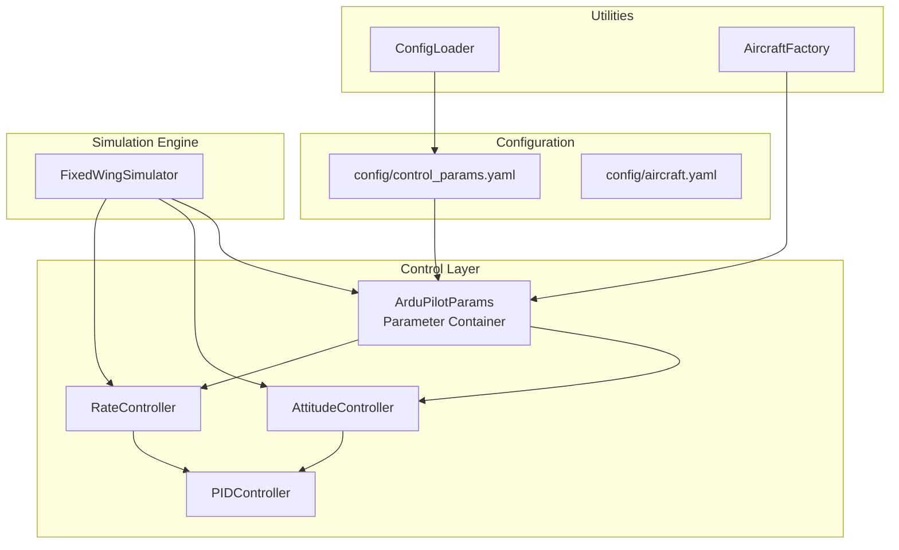
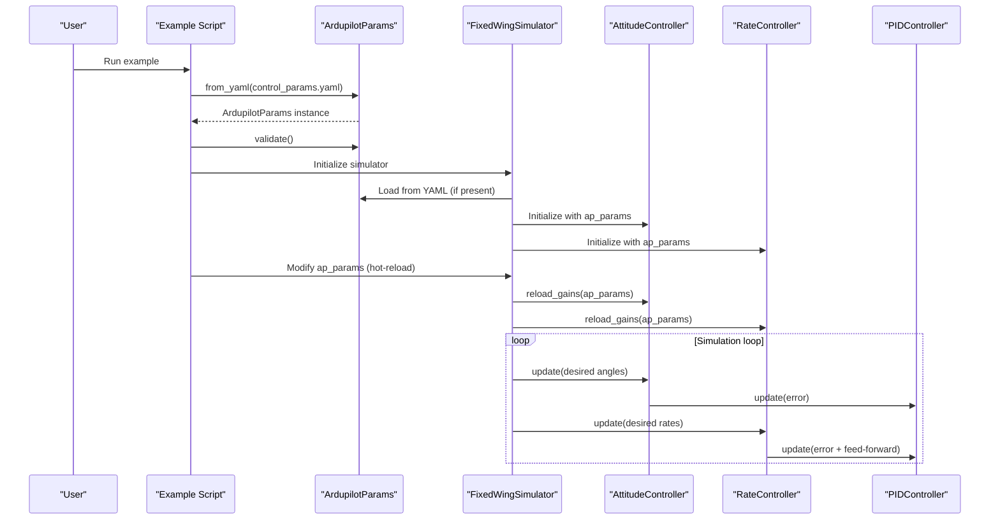
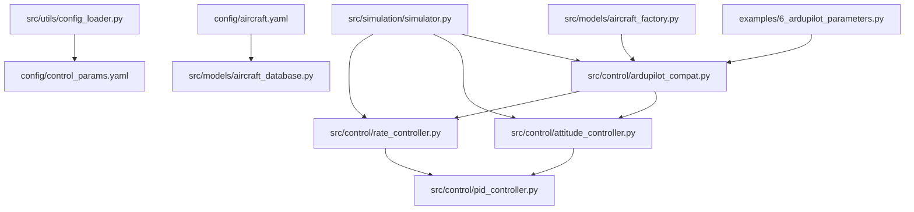

# ArduPilot Parameter Validation

<cite>
**Referenced Files in This Document**
- [ardupilot_compat.py](file://src/control/ardupilot_compat.py)
- [6_ardupilot_parameters.py](file://examples/6_ardupilot_parameters.py)
- [control_params.yaml](file://config/control_params.yaml)
- [simulator.py](file://src/simulation/simulator.py)
- [attitude_controller.py](file://src/control/attitude_controller.py)
- [rate_controller.py](file://src/control/rate_controller.py)
- [pid_controller.py](file://src/control/pid_controller.py)
- [aircraft_factory.py](file://src/models/aircraft_factory.py)
- [config_loader.py](file://src/utils/config_loader.py)
- [aircraft.yaml](file://config/aircraft.yaml)
- [aircraft_database.py](file://src/models/aircraft_database.py)
</cite>

## Table of Contents
1. [Introduction](#introduction)
2. [Project Structure](#project-structure)
3. [Core Components](#core-components)
4. [Architecture Overview](#architecture-overview)
5. [Detailed Component Analysis](#detailed-component-analysis)
6. [Dependency Analysis](#dependency-analysis)
7. [Performance Considerations](#performance-considerations)
8. [Troubleshooting Guide](#troubleshooting-guide)
9. [Conclusion](#conclusion)
10. [Appendices](#appendices)

## Introduction
This document explains the ArduPilot parameter validation example and the ArduPilot compatibility layer within the FixedWingSimulator project. It covers parameter mapping, validation procedures, module usage, and control system alignment with ArduPilot standards. The focus is on practical guidance for parameter tuning workflows, validation techniques, and integration with external ArduPilot systems, including unit conversions and ensuring control system consistency across platforms.

## Project Structure
The ArduPilot parameter validation example spans configuration files, a dedicated parameter container module, control layer components, and an example script that demonstrates parameter loading, validation, hot-reloading, and export to ArduPilot-compatible formats.

**Diagram sources**
- [ardupilot_compat.py](file://src/control/ardupilot_compat.py#L17-L130)
- [simulator.py](file://src/simulation/simulator.py#L165-L216)
- [attitude_controller.py](file://src/control/attitude_controller.py#L33-L134)
- [rate_controller.py](file://src/control/rate_controller.py#L32-L109)
- [config_loader.py](file://src/utils/config_loader.py#L59-L82)
- [aircraft_factory.py](file://src/models/aircraft_factory.py#L95-L136)

**Section sources**
- [ardupilot_compat.py](file://src/control/ardupilot_compat.py#L1-L130)
- [simulator.py](file://src/simulation/simulator.py#L165-L216)
- [config_loader.py](file://src/utils/config_loader.py#L59-L82)
- [aircraft_factory.py](file://src/models/aircraft_factory.py#L95-L136)

## Core Components
- ArdupilotParams: A dataclass that mirrors ArduPilot Plane parameter naming conventions, supports YAML import/export, and provides basic validation checks.
- Control Controllers: AttitudeController and RateController consume ArduPilotParams to configure PID gains and operational limits.
- PIDController: Implements ArduPilot-style PID with anti-windup and optional derivative filtering.
- Example Script: Demonstrates loading parameters, validation, hot-reloading, and exporting to ArduPilot-compatible .param format.

Key capabilities:
- Parameter mapping to ArduPilot conventions (e.g., PTCH_P, ROLL_P, PTCH_RATE_P/I/D/FF).
- Range validation with warnings for out-of-range values.
- YAML serialization/deserialization for persistence and sharing.
- Hot-reload capability for real-time tuning during simulation.

**Section sources**
- [ardupilot_compat.py](file://src/control/ardupilot_compat.py#L17-L130)
- [attitude_controller.py](file://src/control/attitude_controller.py#L33-L134)
- [rate_controller.py](file://src/control/rate_controller.py#L32-L109)
- [pid_controller.py](file://src/control/pid_controller.py#L17-L117)

## Architecture Overview
The ArduPilot compatibility layer integrates tightly with the simulation engine and control stack. The example script loads parameters from YAML, validates them, and demonstrates hot-reloading of gains into active controllers.

**Diagram sources**
- [6_ardupilot_parameters.py](file://examples/6_ardupilot_parameters.py#L31-L76)
- [ardupilot_compat.py](file://src/control/ardupilot_compat.py#L74-L98)
- [simulator.py](file://src/simulation/simulator.py#L165-L216)
- [attitude_controller.py](file://src/control/attitude_controller.py#L124-L127)
- [rate_controller.py](file://src/control/rate_controller.py#L100-L103)

## Detailed Component Analysis

### ArdupilotParams: Parameter Container and Validation
- Purpose: Provide ArduPilot-compatible parameter names, safe defaults, and validation.
- Fields: Grouped by axis (pitch, roll, yaw), limits, navigation, and speed/altitude parameters.
- Validation: Range checks with warnings; returns a boolean indicating pass/fail.
- Serialization: from_yaml/from_dict and to_yaml/to_dict support.

Validation highlights:
- Enforces physical and stability-safe ranges for gains and limits.
- Emphasizes safety-first bounds (e.g., pitch/roll limits, throttle bounds).
- Logs warnings for out-of-range values while continuing execution.

**Section sources**
- [ardupilot_compat.py](file://src/control/ardupilot_compat.py#L17-L130)
- [control_params.yaml](file://config/control_params.yaml#L1-L45)

### Parameter Loading and Integration in the Simulator
- The simulator loads control parameters from control_params.yaml and validates them.
- TECS parameters are merged from the same YAML file with sensible defaults.
- Navigation controller uses ArduPilotParams for L1 period/damping, max roll, cruise speed, and altitude hold.
- Attitude and Rate controllers are initialized with ArduPilotParams and operate on radians internally.

Integration specifics:
- Angle limits are converted from degrees to radians for internal computation.
- Cruise speed and altitude are used to initialize flight mode manager and navigation controller.
- TECS parameters are parsed with fallback defaults when not present.

**Section sources**
- [simulator.py](file://src/simulation/simulator.py#L165-L216)

### Attitude Controller: Outer Loop Mapping
- Mirrors ArduPilot Plane’s attitude outer loop using PTCH_P and ROLL_P.
- Yaw has no attitude outer loop in ArduPlane; yaw command is passed through.
- Uses PIDController instances configured with P-only gains and output limits.

Mapping to ArduPilot:
- PTCH_P and ROLL_P map directly to ArduPilot parameters.
- Output limits constrain desired angular rates to physically meaningful ranges.

**Section sources**
- [attitude_controller.py](file://src/control/attitude_controller.py#L33-L134)

### Rate Controller: Inner Loop and Stability Augmentation
- Implements three independent rate PIDs: PTCH_RATE_P/I/D/FF, ROLL_RATE_P/I/FF, YAW_RATE_P/I.
- Provides stability augmentation (SAS) as the innermost feedback loop.
- Feed-forward terms are applied before saturation to improve disturbance rejection.

Mapping to ArduPilot:
- PTCH_RATE_* parameters map to elevator control.
- ROLL_RATE_* parameters map to aileron control.
- YAW_RATE_* parameters map to rudder control.

**Section sources**
- [rate_controller.py](file://src/control/rate_controller.py#L32-L109)

### PID Controller: Anti-Windup and Filtering
- Implements ArduPilot-style PID with clamping-based anti-windup.
- Optional first-order derivative low-pass filter.
- Supports runtime gain updates and controller resets.

Mapping to ArduPilot:
- Matches AC_PID design patterns for gains, saturation, and anti-windup.

**Section sources**
- [pid_controller.py](file://src/control/pid_controller.py#L17-L117)

### Export to ArduPilot-Compatible Format
- AircraftFactory.export_ardupilot_params generates a .param file containing both aircraft physical parameters and control parameters.
- Aircraft parameters are mapped to ArduPilot naming conventions (e.g., MASS, WING_AREA, WING_SPAN).
- Control parameters are merged from control_params.yaml when provided.

Use cases:
- Sharing tuned parameters with external ArduPilot systems.
- Generating ArduPilot parameter sets for hardware-in-the-loop testing.

**Section sources**
- [aircraft_factory.py](file://src/models/aircraft_factory.py#L95-L136)
- [aircraft_database.py](file://src/models/aircraft_database.py#L143-L166)

### Example Script: Parameter Validation and Hot-Reload Workflow
- Loads ArduPilotParams from control_params.yaml.
- Validates parameters and prints PASS/WARNINGS.
- Demonstrates hot-reloading by adjusting PTCH_P and reloading controllers.
- Exports parameters to ArduPilot .param format.

Workflow highlights:
- Parameter interpretation: reads YAML keys and maps to ArduPilotParams fields.
- Unit conversions: angles converted to radians for internal computation.
- Consistency checks: validation ensures parameters remain within safe ranges.

**Section sources**
- [6_ardupilot_parameters.py](file://examples/6_ardupilot_parameters.py#L1-L105)

## Dependency Analysis
The parameter validation system exhibits clear separation of concerns with layered dependencies:

**Diagram sources**
- [6_ardupilot_parameters.py](file://examples/6_ardupilot_parameters.py#L24-L49)
- [ardupilot_compat.py](file://src/control/ardupilot_compat.py#L17-L130)
- [simulator.py](file://src/simulation/simulator.py#L165-L216)
- [attitude_controller.py](file://src/control/attitude_controller.py#L33-L134)
- [rate_controller.py](file://src/control/rate_controller.py#L32-L109)
- [config_loader.py](file://src/utils/config_loader.py#L59-L82)
- [aircraft_factory.py](file://src/models/aircraft_factory.py#L95-L136)
- [aircraft.yaml](file://config/aircraft.yaml#L1-L13)
- [aircraft_database.py](file://src/models/aircraft_database.py#L143-L166)

**Section sources**
- [6_ardupilot_parameters.py](file://examples/6_ardupilot_parameters.py#L24-L49)
- [simulator.py](file://src/simulation/simulator.py#L165-L216)
- [config_loader.py](file://src/utils/config_loader.py#L59-L82)

## Performance Considerations
- Memory and CPU efficiency: Dataclass-based parameter storage reduces overhead; controllers cache computed values where appropriate.
- Real-time performance: Hot-reload capability allows parameter updates without restarting the simulation.
- I/O optimization: YAML loading occurs during initialization; repeated disk access is minimized.
- Numerical stability: Anti-windup and derivative filtering in PID controllers prevent integrator windup and reduce noise sensitivity.

[No sources needed since this section provides general guidance]

## Troubleshooting Guide
Common issues and resolutions:
- Parameter range warnings: Adjust values to fall within validated ranges; review validation logs for specific out-of-range fields.
- File loading errors: Verify control_params.yaml exists and is valid YAML; check paths and permissions.
- Controller instability: Reduce P/I gains, especially integral terms; verify angle and throttle limits are appropriate for the aircraft.
- Export failures: Ensure output directory exists and is writable; confirm control_params.yaml is present when exporting.

Diagnostic tips:
- Enable logging to monitor parameter changes and validation results.
- Use the example script to reproduce issues with minimal setup.
- Cross-check parameter units (angles in radians internally, degrees externally).

**Section sources**
- [ardupilot_compat.py](file://src/control/ardupilot_compat.py#L104-L130)
- [6_ardupilot_parameters.py](file://examples/6_ardupilot_parameters.py#L36-L38)

## Conclusion
The ArduPilot parameter validation example provides a robust, ArduPilot-compatible parameter management system integrated with the control stack. It enables safe, validated parameterization, seamless export to ArduPilot formats, and real-time tuning through hot-reload. By aligning parameter names, units, and validation with ArduPilot standards, the system ensures consistency across simulation and external ArduPilot environments.

[No sources needed since this section summarizes without analyzing specific files]

## Appendices

### Parameter Interpretation and Unit Conversions
- Angle limits: Stored in centidegrees in YAML but converted to degrees via convenience property; internally converted to radians for computations.
- Speed and altitude: Stored in m/s and meters respectively; used directly for initialization and control scaling.
- Gains: Purely dimensionless multipliers; ensure proportional gains are conservative initially to avoid oscillations.

**Section sources**
- [ardupilot_compat.py](file://src/control/ardupilot_compat.py#L47-L68)
- [simulator.py](file://src/simulation/simulator.py#L193-L212)

### Parameter Tuning Workflows
- Start with conservative defaults from control_params.yaml.
- Validate parameters before running simulations.
- Tune attitude gains (PTCH_P, ROLL_P) for desired response without excessive overshoot.
- Add rate gains (PTCH_RATE_*, ROLL_RATE_*) incrementally; monitor for stability.
- Export tuned parameters to .param for external ArduPilot integration.

**Section sources**
- [control_params.yaml](file://config/control_params.yaml#L1-L45)
- [6_ardupilot_parameters.py](file://examples/6_ardupilot_parameters.py#L51-L76)

### Integration with External ArduPilot Systems
- Use AircraftFactory.export_ardupilot_params to generate .param files for hardware-in-the-loop testing.
- Ensure parameter naming and units match ArduPilot expectations.
- Validate exported parameters against ArduPilot’s parameter documentation.

**Section sources**
- [aircraft_factory.py](file://src/models/aircraft_factory.py#L95-L136)
- [aircraft.yaml](file://config/aircraft.yaml#L1-L13)
- [aircraft_database.py](file://src/models/aircraft_database.py#L143-L166)