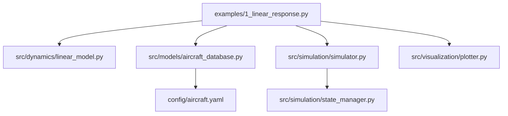
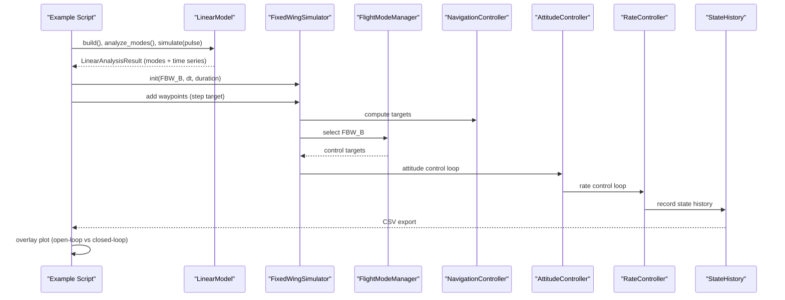
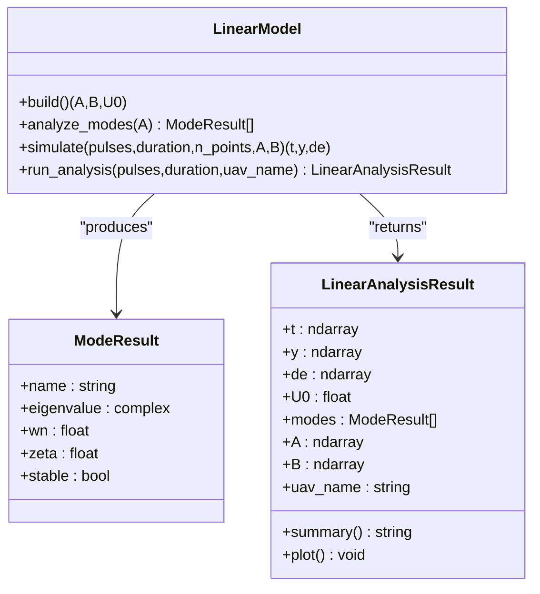
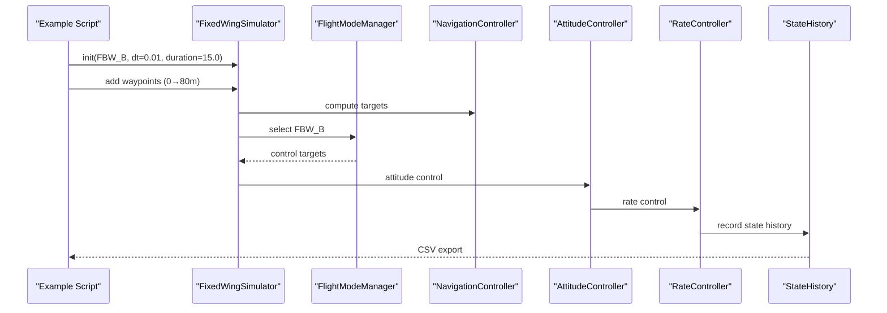
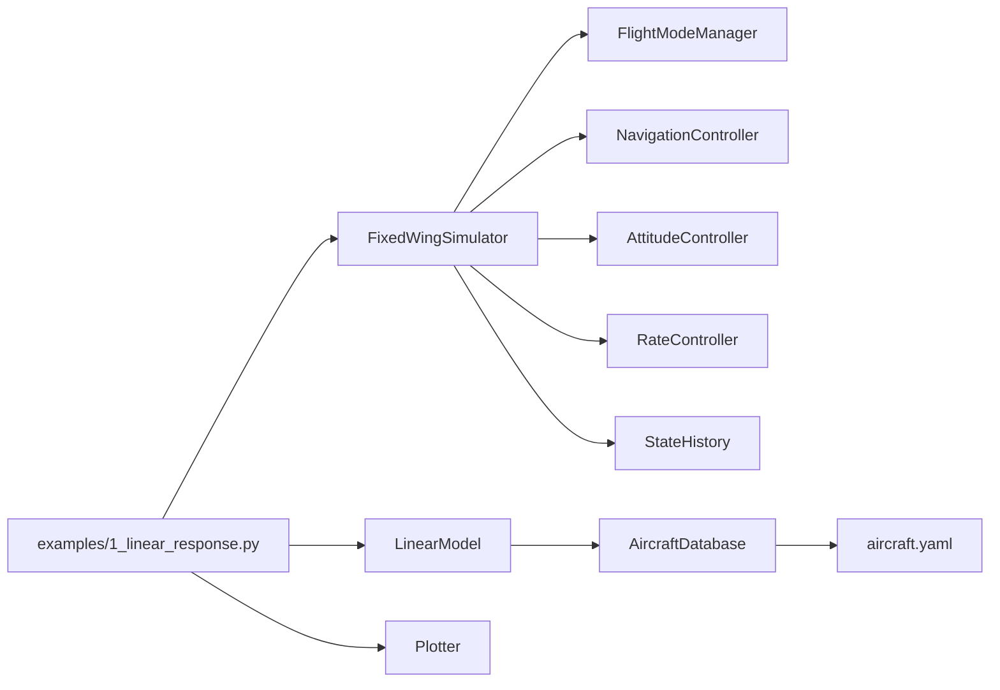

# Basic Linear Response Analysis

<cite>
**Referenced Files in This Document**
- [1_linear_response.py](file://examples/1_linear_response.py)
- [linear_model.py](file://src/dynamics/linear_model.py)
- [aircraft_database.py](file://src/models/aircraft_database.py)
- [aircraft.yaml](file://config/aircraft.yaml)
- [simulator.py](file://src/simulation/simulator.py)
- [state_manager.py](file://src/simulation/state_manager.py)
- [plotter.py](file://src/visualization/plotter.py)
- [test_dynamics.py](file://tests/test_dynamics.py)
</cite>

## Table of Contents
1. [Introduction](#introduction)
2. [Project Structure](#project-structure)
3. [Core Components](#core-components)
4. [Architecture Overview](#architecture-overview)
5. [Detailed Component Analysis](#detailed-component-analysis)
6. [Dependency Analysis](#dependency-analysis)
7. [Performance Considerations](#performance-considerations)
8. [Troubleshooting Guide](#troubleshooting-guide)
9. [Conclusion](#conclusion)
10. [Appendices](#appendices)

## Introduction
This document explains the linear response analysis example for a 4-degree-of-freedom (4-DOF) longitudinal linearized model. It covers:
- Modal analysis workflow (short period and phugoid modes)
- Pulse response testing under open-loop conditions
- Open-loop versus closed-loop comparisons using FBW_B mode
- How to use the LinearModel.run_analysis() method, configure parameters, and interpret results
- Step-by-step walkthrough of the TB2 aircraft analysis, including linearization mathematics, modal characteristics, and control implications
- Guidance on interpreting stability margins, damping ratios, and natural frequencies

## Project Structure
The example orchestrates several modules:
- Example script: defines open-loop and closed-loop workflows and saves outputs
- Linear model: constructs A and B matrices, performs modal analysis, and simulates pulse responses
- Aircraft database: supplies TB2 parameters and derived fields
- Simulator: runs closed-loop simulations in FBW_B mode with PID control
- State history: records closed-loop data for post-processing
- Plotting utilities: generate overlay plots and save figures

**Diagram sources**
- [1_linear_response.py](file://examples/1_linear_response.py#L30-L36)
- [linear_model.py](file://src/dynamics/linear_model.py#L107-L319)
- [aircraft_database.py](file://src/models/aircraft_database.py#L143-L166)
- [aircraft.yaml](file://config/aircraft.yaml#L1-L13)
- [simulator.py](file://src/simulation/simulator.py#L115-L200)
- [state_manager.py](file://src/simulation/state_manager.py#L95-L193)
- [plotter.py](file://src/visualization/plotter.py#L19-L244)

**Section sources**
- [1_linear_response.py](file://examples/1_linear_response.py#L30-L36)
- [aircraft_database.py](file://src/models/aircraft_database.py#L143-L166)
- [aircraft.yaml](file://config/aircraft.yaml#L1-L13)

## Core Components
- LinearModel: builds A and B matrices, computes eigenvalues, simulates pulse responses, and returns a structured result
- FixedWingSimulator: runs closed-loop simulations with FBW_B mode and PID control
- StateHistory: records closed-loop time histories for analysis and export
- Plotting utilities: support both Matplotlib and Plotly outputs

Key capabilities:
- Open-loop: modal analysis and pulse response for elevator inputs
- Closed-loop: step response under FBW_B mode with altitude and airspeed targets

**Section sources**
- [linear_model.py](file://src/dynamics/linear_model.py#L107-L319)
- [simulator.py](file://src/simulation/simulator.py#L115-L200)
- [state_manager.py](file://src/simulation/state_manager.py#L95-L193)
- [plotter.py](file://src/visualization/plotter.py#L19-L244)

## Architecture Overview
The example executes two complementary analyses:
- Open-loop: LinearModel constructs state-space matrices, identifies modes, and simulates a pulse input
- Closed-loop: FixedWingSimulator initializes FBW_B mode, adds a waypoint target, runs the simulation, and records state history

**Diagram sources**
- [1_linear_response.py](file://examples/1_linear_response.py#L86-L206)
- [linear_model.py](file://src/dynamics/linear_model.py#L312-L319)
- [simulator.py](file://src/simulation/simulator.py#L239-L567)
- [state_manager.py](file://src/simulation/state_manager.py#L179-L193)

## Detailed Component Analysis

### 4-DOF Linear Model and Modal Analysis
- State vector and inputs:
  - States: [forward speed perturbation u_p, angle of attack alpha, pitch rate q, pitch angle theta]
  - Inputs: [throttle delta_T, elevator delta_e]
- State-space construction:
  - Computes non-dimensional mass and inertia coefficients
  - Builds A and B matrices from stability derivatives and geometric parameters
- Modal analysis:
  - Eigenvalue decomposition of A
  - Identifies short period (high-frequency oscillatory) and phugoid (low-frequency energy exchange) modes
  - Derives natural frequency and damping ratio from eigenvalues
- Pulse response simulation:
  - Defines piecewise constant elevator inputs
  - Integrates linear ODE to obtain time histories of states and inputs

**Diagram sources**
- [linear_model.py](file://src/dynamics/linear_model.py#L107-L319)

**Section sources**
- [linear_model.py](file://src/dynamics/linear_model.py#L129-L200)
- [linear_model.py](file://src/dynamics/linear_model.py#L206-L252)
- [linear_model.py](file://src/dynamics/linear_model.py#L258-L306)
- [linear_model.py](file://src/dynamics/linear_model.py#L312-L319)

### Open-Loop Modal Analysis (Short Period and Phugoid)
- Short period mode:
  - High-frequency oscillation dominated by angle of attack and pitch rate coupling
  - Typically lightly damped; reflects rapid response to elevator inputs
- Phugoid mode:
  - Low-frequency long-period motion associated with energy exchange between kinetic and potential energy
  - Usually heavily damped; slower decay or near-constant amplitude depending on damping
- Stability:
  - Negative real parts indicate stability; larger negative real parts imply faster decay

Interpretation guidance:
- Natural frequency (ωn): higher values correspond to faster oscillations
- Damping ratio (ζ): lower values mean more oscillatory behavior; higher values imply faster settling
- Stability margin: negative real part ensures stability; closer to zero indicates marginal stability

**Section sources**
- [linear_model.py](file://src/dynamics/linear_model.py#L30-L54)
- [linear_model.py](file://src/dynamics/linear_model.py#L206-L252)

### Closed-Loop PID Step Response (FBW_B Mode)
- FBW_B mode:
  - Maintains altitude and airspeed via PID control loops
  - Generates control targets from navigation waypoints
- Control chain:
  - Navigation controller computes targets
  - Attitude controller converts targets to rates
  - Rate controller generates control surface commands
  - Servo mixer applies physical limits and converts to actuator deflections
- Step response:
  - Adding a waypoint from current altitude to target altitude triggers a pitch step
  - Closed-loop response shows stabilization behavior and steady-state tracking

**Diagram sources**
- [1_linear_response.py](file://examples/1_linear_response.py#L132-L144)
- [simulator.py](file://src/simulation/simulator.py#L239-L567)
- [state_manager.py](file://src/simulation/state_manager.py#L179-L193)

**Section sources**
- [simulator.py](file://src/simulation/simulator.py#L239-L567)
- [state_manager.py](file://src/simulation/state_manager.py#L179-L193)

### Open-Loop vs Closed-Loop Comparison
- Time scale:
  - Open-loop pulse response is typically shorter; closed-loop includes PID transient behavior
- Response shape:
  - Open-loop exhibits natural modes; closed-loop shows controlled convergence
- Steady-state:
  - Open-loop may exhibit persistent oscillations or decay depending on damping; closed-loop tracks targets with small steady-state error
- Data extraction:
  - Open-loop: extract pitch rate and pitch angle from LinearAnalysisResult
  - Closed-loop: extract pitch angle, pitch rate, altitude, and control inputs from StateHistory

**Section sources**
- [1_linear_response.py](file://examples/1_linear_response.py#L107-L151)
- [plotter.py](file://src/visualization/plotter.py#L161-L244)

### Using LinearModel.run_analysis()
Method signature and behavior:
- Parameters:
  - pulses: list of pulse dictionaries with keys start_time, duration, angle_deg
  - duration: simulation duration
  - uav_name: identifier for labeling outputs
- Workflow:
  - Build A and B matrices
  - Analyze modes from A
  - Simulate pulse response with optional override matrices
  - Return LinearAnalysisResult containing time, state history, input history, modes, and matrices

Typical usage:
- Retrieve TB2 parameters from the database
- Define a single elevator pulse input
- Call run_analysis and print a summary of modes
- Export open-loop CSV and generate overlay plots

**Section sources**
- [linear_model.py](file://src/dynamics/linear_model.py#L312-L319)
- [1_linear_response.py](file://examples/1_linear_response.py#L95-L123)

### Mathematical Background of Linearization
- Assumptions:
  - Small perturbations around a trim condition
  - Constant Mach number implies constant trim speed U0
  - Negligible higher-order terms yield linear state-space form
- Construction:
  - Non-dimensional parameters derived from mass, wing area, mean aerodynamic chord, and inertia
  - Stability derivatives (CX, CZ, Cm) evaluated at trim conditions
  - A matrix captures dynamics; B matrix captures control influence
- Modes:
  - Eigenvalues of A classify short period and phugoid modes
  - Real parts determine stability; imaginary parts determine oscillatory behavior; magnitude determines frequency

**Section sources**
- [linear_model.py](file://src/dynamics/linear_model.py#L129-L200)
- [linear_model.py](file://src/dynamics/linear_model.py#L206-L252)

### TB2 Aircraft Analysis Walkthrough
- Parameter sourcing:
  - TB2 parameters loaded from the aircraft database; derived fields include trim speed U0 and dynamic pressure q_bar
  - Configuration can be selected via aircraft.yaml
- Open-loop analysis:
  - Elevator pulse input excites pitch dynamics; open-loop response shows natural mode behavior
  - Results exported to CSV and plotted
- Closed-loop analysis:
  - FBW_B mode with altitude step target; PID stabilizes pitch and altitude
  - Closed-loop CSV exported via StateHistory.to_csv()

**Section sources**
- [aircraft_database.py](file://src/models/aircraft_database.py#L31-L48)
- [aircraft.yaml](file://config/aircraft.yaml#L5-L5)
- [1_linear_response.py](file://examples/1_linear_response.py#L95-L123)
- [1_linear_response.py](file://examples/1_linear_response.py#L132-L163)

### Interpreting Stability Margins, Damping Ratios, and Natural Frequencies
- Stability margin:
  - Negative real parts of eigenvalues indicate stability
  - Larger negative real parts imply faster decay and stronger stability margin
- Damping ratio (ζ):
  - Lower ζ: more oscillatory response; higher ζ: faster settling
  - Short period typically has low ζ; phugoid typically has high ζ
- Natural frequency (ωn):
  - Higher ωn: faster oscillations; lower ωn: slower dynamics
- Practical implications:
  - Short period affects control stick feel and handling qualities
  - Phugoid influences trim and control effectiveness at varying speeds

**Section sources**
- [linear_model.py](file://src/dynamics/linear_model.py#L30-L54)
- [linear_model.py](file://src/dynamics/linear_model.py#L206-L252)

## Dependency Analysis
- Example depends on:
  - LinearModel for open-loop analysis
  - FixedWingSimulator for closed-loop analysis
  - Aircraft database for parameter retrieval
  - StateHistory for closed-loop data export
  - Plotting utilities for visualization
- Internal simulator dependencies:
  - FlightModeManager, NavigationController, AttitudeController, RateController, ServoMixer
  - WaypointManager and integrator

**Diagram sources**
- [1_linear_response.py](file://examples/1_linear_response.py#L30-L36)
- [simulator.py](file://src/simulation/simulator.py#L33-L51)
- [state_manager.py](file://src/simulation/state_manager.py#L95-L193)

**Section sources**
- [simulator.py](file://src/simulation/simulator.py#L33-L51)
- [state_manager.py](file://src/simulation/state_manager.py#L95-L193)

## Performance Considerations
- Numerical integration:
  - Linear simulation uses a high-precision solver; closed-loop simulation uses adaptive step integration
- Control loop latency:
  - Closed-loop response includes multi-stage control processing delays; consider sampling and filtering effects
- Data recording efficiency:
  - StateHistory pre-allocates arrays to minimize memory reallocation overhead

## Troubleshooting Guide
- Parameter issues:
  - Ensure the aircraft name exists in the database and parameters are complete
- Flight mode configuration:
  - FBW_B requires valid waypoints; missing targets can lead to empty control commands
- Integration errors:
  - Closed-loop simulation may encounter numerical issues; verify environment and control settings
- Output failures:
  - Confirm write permissions for output directories; Matplotlib Agg backend avoids GUI windows

**Section sources**
- [aircraft_database.py](file://src/models/aircraft_database.py#L143-L166)
- [1_linear_response.py](file://examples/1_linear_response.py#L60-L68)
- [1_linear_response.py](file://examples/1_linear_response.py#L73-L81)

## Conclusion
This example demonstrates a complete workflow from linearized modeling to closed-loop simulation, enabling:
- Identification of short period and phugoid modes
- Evaluation of open-loop pulse responses
- Comparative analysis against PID-controlled closed-loop responses
- Practical interpretation of stability margins, damping ratios, and natural frequencies

The combination of LinearModel.run_analysis() and FBW_B mode provides a robust foundation for control design and analysis.

## Appendices

### Example Outputs and Data Export
- Open-loop CSV: time, normalized forward speed perturbation, angle of attack, pitch rate, pitch angle, elevator input
- Closed-loop CSV: comprehensive state and control history via StateHistory.to_csv()
- Overlay PNG: open-loop pitch rate and closed-loop pitch angle, plus closed-loop altitude step response

**Section sources**
- [1_linear_response.py](file://examples/1_linear_response.py#L114-L123)
- [1_linear_response.py](file://examples/1_linear_response.py#L158-L163)
- [1_linear_response.py](file://examples/1_linear_response.py#L168-L202)
- [state_manager.py](file://src/simulation/state_manager.py#L182-L193)

### Validation References
- Unit tests confirm:
  - Matrix shapes and finiteness for TB2
  - Correct number of modes (two pairs for 4-DOF)
  - Stability of the short period mode
  - Pulse input excitation of pitch response

**Section sources**
- [test_dynamics.py](file://tests/test_dynamics.py#L201-L254)