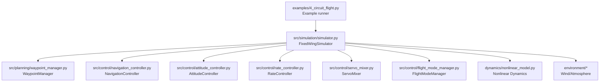
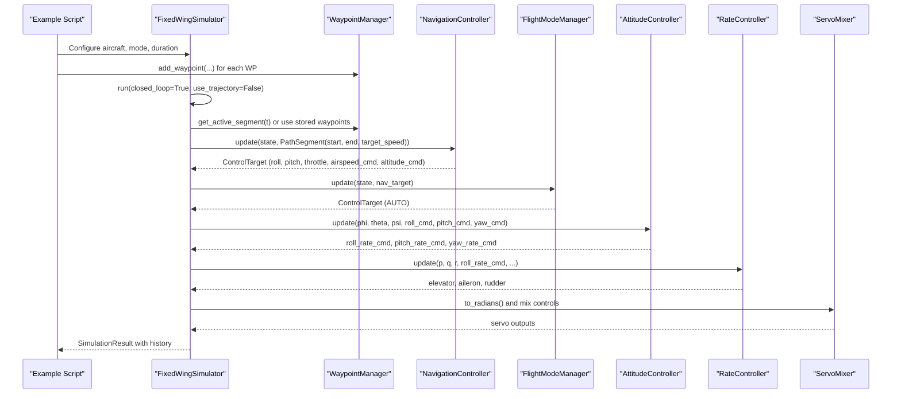
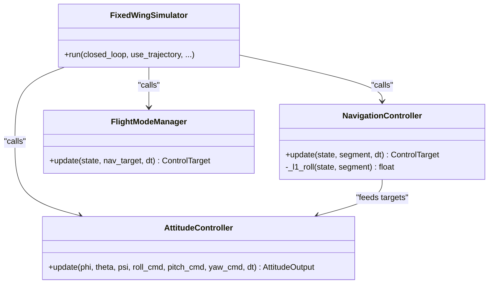
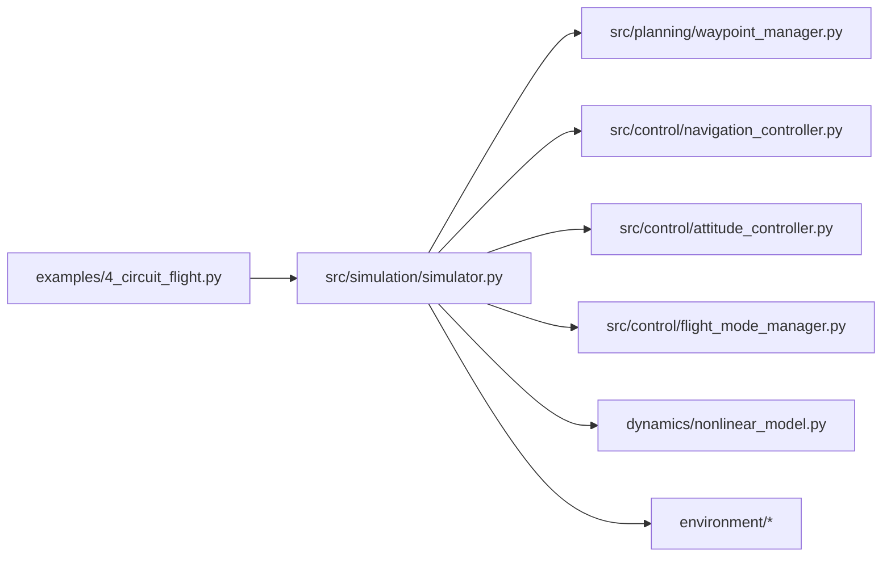

# Circuit Flight Patterns

<cite>
**Referenced Files in This Document**
- [examples/4_circuit_flight.py](file://examples/4_circuit_flight.py)
- [src/simulation/simulator.py](file://src/simulation/simulator.py)
- [src/planning/waypoint_manager.py](file://src/planning/waypoint_manager.py)
- [src/planning/minimum_snap.py](file://src/planning/minimum_snap.py)
- [src/planning/minimum_jerk.py](file://src/planning/minimum_jerk.py)
- [src/control/navigation_controller.py](file://src/control/navigation_controller.py)
- [src/control/attitude_controller.py](file://src/control/attitude_controller.py)
- [src/control/tecs_controller.py](file://src/control/tecs_controller.py)
- [src/control/flight_mode_manager.py](file://src/control/flight_mode_manager.py)
- [config/trajectory.yaml](file://config/trajectory.yaml)
</cite>

## Table of Contents
1. [Introduction](#introduction)
2. [Project Structure](#project-structure)
3. [Core Components](#core-components)
4. [Architecture Overview](#architecture-overview)
5. [Detailed Component Analysis](#detailed-component-analysis)
6. [Dependency Analysis](#dependency-analysis)
7. [Performance Considerations](#performance-considerations)
8. [Troubleshooting Guide](#troubleshooting-guide)
9. [Conclusion](#conclusion)
10. [Appendices](#appendices)

## Introduction
This document explains the implementation of standard traffic pattern maneuvers using the FixedWingSimulator circuit flight example. It covers how the system defines circuit waypoints, manages altitude and airspeed during each phase (entry, base, final, and circuit turns), coordinates navigation and attitude control, and adapts to different airport configurations. It also provides guidance on modifying pattern geometry, timing, and safety margins.

## Project Structure
The circuit flight example is implemented as a closed-loop simulation that sequences waypoints without relying on polynomial trajectories. The example script configures waypoints, initializes the simulator, and runs the simulation while generating plots and CSV logs.

**Diagram sources**
- [examples/4_circuit_flight.py](file://examples/4_circuit_flight.py#L81-L119)
- [src/simulation/simulator.py](file://src/simulation/simulator.py#L190-L567)

**Section sources**
- [examples/4_circuit_flight.py](file://examples/4_circuit_flight.py#L1-L275)
- [src/simulation/simulator.py](file://src/simulation/simulator.py#L115-L200)

## Core Components
- WaypointManager: Stores NED waypoints, supports loading from YAML, and exposes helpers to query active segments and desired states.
- NavigationController: Implements L1 lateral navigation and TECS for altitude/airspeed control, producing roll/pitch/throttle targets.
- AttitudeController: Converts desired Euler angles into desired angular rates using P-only control.
- TECSController: Total Energy Control System managing throttle and pitch to track altitude and airspeed.
- FlightModeManager: Orchestrates flight modes and produces ControlTarget commands for the control layers.
- Simulator: Integrates all subsystems, implements waypoint-sequencing logic for circuit patterns, and records history.

Key behaviors for circuit patterns:
- Waypoints define a closed rectangle at constant altitude.
- NavigationController computes lateral roll commands and desired heading along each leg.
- TECS maintains target altitude and airspeed during each leg and turn.
- FlightModeManager selects AUTO mode to accept navigation targets.

**Section sources**
- [src/planning/waypoint_manager.py](file://src/planning/waypoint_manager.py#L20-L208)
- [src/control/navigation_controller.py](file://src/control/navigation_controller.py#L45-L293)
- [src/control/attitude_controller.py](file://src/control/attitude_controller.py#L33-L134)
- [src/control/tecs_controller.py](file://src/control/tecs_controller.py#L50-L647)
- [src/control/flight_mode_manager.py](file://src/control/flight_mode_manager.py#L115-L298)
- [src/simulation/simulator.py](file://src/simulation/simulator.py#L346-L567)

## Architecture Overview
The circuit flight example runs in AUTO mode and uses a simple waypoint-sequencing strategy. The simulator constructs a PathSegment from the previous waypoint to the current target waypoint, computes navigation targets, and feeds them to the attitude controller and rate controller. TECS ensures altitude and airspeed regulation.

**Diagram sources**
- [examples/4_circuit_flight.py](file://examples/4_circuit_flight.py#L81-L119)
- [src/simulation/simulator.py](file://src/simulation/simulator.py#L346-L567)
- [src/control/navigation_controller.py](file://src/control/navigation_controller.py#L134-L202)
- [src/control/attitude_controller.py](file://src/control/attitude_controller.py#L81-L122)
- [src/control/flight_mode_manager.py](file://src/control/flight_mode_manager.py#L173-L212)

## Detailed Component Analysis

### Waypoint Configuration and Circuit Geometry
- Waypoints are defined in NED coordinates with altitudes given as positive-up; internally converted to NED down.
- The example defines a four-leg rectangle at a constant altitude, forming a closed circuit.
- WaypointManager supports loading from YAML and saving to YAML, enabling reuse across simulations.

Implementation highlights:
- Adding waypoints and clearing lists.
- Building and caching trajectories (not used in circuit mode).
- Querying active segment and total duration.

Safety and geometry considerations:
- Use a sufficient switch distance to avoid excessive overshoot at corners.
- Ensure the first waypoint aligns with the initial aircraft position to avoid immediate switch logic.

**Section sources**
- [src/planning/waypoint_manager.py](file://src/planning/waypoint_manager.py#L54-L122)
- [src/planning/waypoint_manager.py](file://src/planning/waypoint_manager.py#L127-L167)
- [examples/4_circuit_flight.py](file://examples/4_circuit_flight.py#L93-L106)
- [config/trajectory.yaml](file://config/trajectory.yaml#L12-L22)

### Navigation and Turn Coordination
- L1 navigation law computes a look-ahead point along the current segment and derives a lateral acceleration command, converted to roll angle.
- The controller accounts for ground-track velocity derived from body velocity components to handle sideslip and wind.
- TECS integrates climb-rate estimation and airspeed measurement to produce pitch and throttle commands.

Turn coordination strategies:
- Early banking onset: The path segment spans from the previous waypoint to the current waypoint, allowing anticipatory turn initiation before reaching the corner.
- Target speed is maintained along each leg; TECS adjusts pitch/throttle to regulate airspeed and altitude.

**Section sources**
- [src/control/navigation_controller.py](file://src/control/navigation_controller.py#L206-L293)
- [src/control/navigation_controller.py](file://src/control/navigation_controller.py#L134-L202)
- [src/control/tecs_controller.py](file://src/control/tecs_controller.py#L247-L316)

### Altitude Management and Airspeed Control
- TECS controls total energy via throttle and pitch to track altitude and airspeed demands.
- Climb-rate estimation uses body velocity components; vertical acceleration is estimated from body x-acceleration when available.
- Pitch demand is adjusted by trim offset to account for steady-flight equilibrium.

Steady-state behavior:
- The example evaluates steady-state altitude statistics after a transient window to assess performance.

**Section sources**
- [src/control/tecs_controller.py](file://src/control/tecs_controller.py#L247-L316)
- [src/control/tecs_controller.py](file://src/control/tecs_controller.py#L465-L552)
- [examples/4_circuit_flight.py](file://examples/4_circuit_flight.py#L249-L272)

### Circuit Pattern Phases and Timing
- Entry/base/final phases are implicit in the leg sequence and target speeds:
  - Entry: initial leg away from home.
  - Base: crosswind leg parallel to the downwind leg.
  - Final: final approach leg toward the landing area.
  - Turn coordination: executed by the L1 guidance law as the aircraft approaches each waypoint.
- Timing considerations:
  - Switch distance determines when the aircraft transitions to the next leg.
  - Minimum cooldown prevents rapid re-switching near waypoints.
  - Looping can be enabled to repeat the pattern indefinitely.

**Section sources**
- [src/simulation/simulator.py](file://src/simulation/simulator.py#L431-L477)
- [src/simulation/simulator.py](file://src/simulation/simulator.py#L450-L465)

### Integration of Navigation and Attitude Control Systems
- NavigationController produces roll/pitch/throttle targets and airspeed/altitude commands.
- FlightModeManager in AUTO mode forwards navigation targets downstream.
- AttitudeController converts desired angles to desired angular rates.
- RateController and ServoMixer translate commands into physical control surface deflections.

**Diagram sources**
- [src/control/navigation_controller.py](file://src/control/navigation_controller.py#L134-L202)
- [src/control/attitude_controller.py](file://src/control/attitude_controller.py#L81-L122)
- [src/control/flight_mode_manager.py](file://src/control/flight_mode_manager.py#L173-L212)
- [src/simulation/simulator.py](file://src/simulation/simulator.py#L499-L521)

### Trajectory Planning Options (YAML)
While the circuit example uses waypoint-sequencing mode, the planner supports trajectory types configured via YAML:
- Types: minimum_snap, minimum_jerk, minimum_accel, minimum_vel, hover.
- Average speed drives segment time estimates.
- Yaw modes: yaw_follow, zero, fixed.
- Waypoints: NED format with altitudes given as positive-up.

These options enable switching between simple waypoint sequencing and polynomial trajectory tracking when desired.

**Section sources**
- [config/trajectory.yaml](file://config/trajectory.yaml#L1-L23)
- [src/planning/waypoint_manager.py](file://src/planning/waypoint_manager.py#L80-L122)
- [src/planning/minimum_snap.py](file://src/planning/minimum_snap.py#L167-L253)
- [src/planning/minimum_jerk.py](file://src/planning/minimum_jerk.py#L17-L71)

## Dependency Analysis
The circuit flight example depends on:
- WaypointManager for waypoint storage and segment queries.
- NavigationController for lateral guidance and TECS integration.
- AttitudeController and RateController for angle-to-rate conversion and control surface mixing.
- FlightModeManager for AUTO mode operation.
- Simulator orchestrating the closed-loop integration and history recording.

**Diagram sources**
- [examples/4_circuit_flight.py](file://examples/4_circuit_flight.py#L81-L119)
- [src/simulation/simulator.py](file://src/simulation/simulator.py#L190-L567)

**Section sources**
- [src/simulation/simulator.py](file://src/simulation/simulator.py#L190-L567)
- [src/planning/waypoint_manager.py](file://src/planning/waypoint_manager.py#L20-L208)
- [src/control/navigation_controller.py](file://src/control/navigation_controller.py#L45-L293)
- [src/control/attitude_controller.py](file://src/control/attitude_controller.py#L33-L134)
- [src/control/flight_mode_manager.py](file://src/control/flight_mode_manager.py#L115-L298)

## Performance Considerations
- L1 tuning affects turn responsiveness and overshoot:
  - Period influences look-ahead distance; damping reduces oscillations.
- TECS tuning impacts altitude and airspeed tracking:
  - Climb/sink limits, time constants, and throttle/pitch gains influence transient behavior.
- Waypoint switch distance and cooldown reduce oscillatory switching near corners.
- Closed-loop stability depends on proper coupling between navigation, attitude, and rate control layers.

[No sources needed since this section provides general guidance]

## Troubleshooting Guide
Common issues and remedies:
- Excessive overshoot at corners:
  - Reduce waypoint switch distance or increase L1 damping.
  - Verify target speed is appropriate for the aircraft.
- Altitude oscillations:
  - Adjust TECS climb/sink limits and time constants.
  - Ensure airspeed measurement and acceleration feedback are available.
- Rapid re-switching near waypoints:
  - Increase minimum cooldown or adjust switch distance.
- Poor turn coordination:
  - Confirm the path segment spans from previous to current waypoint to enable anticipatory banking.

**Section sources**
- [src/simulation/simulator.py](file://src/simulation/simulator.py#L450-L465)
- [src/control/navigation_controller.py](file://src/control/navigation_controller.py#L206-L293)
- [src/control/tecs_controller.py](file://src/control/tecs_controller.py#L247-L316)

## Conclusion
The circuit flight example demonstrates a practical implementation of standard traffic pattern maneuvers using waypoint sequencing and integrated navigation/TECS control. By configuring waypoints, tuning L1 and TECS parameters, and leveraging the AUTO mode pipeline, the system achieves coordinated flight with predictable entry, base, and final phases. The modular design allows easy adaptation to different airport geometries and aircraft capabilities.

[No sources needed since this section summarizes without analyzing specific files]

## Appendices

### A. Circuit Pattern Geometry and Timing Reference
- Example circuit: square with side length and constant altitude.
- Switch distance and loop behavior are configurable in the example script.
- Trajectory YAML supports alternative trajectory types and yaw modes.

**Section sources**
- [examples/4_circuit_flight.py](file://examples/4_circuit_flight.py#L52-L56)
- [examples/4_circuit_flight.py](file://examples/4_circuit_flight.py#L93-L106)
- [config/trajectory.yaml](file://config/trajectory.yaml#L1-L23)

### B. Safety Aspects
- Use conservative switch distances to avoid tight-radius turns near waypoints.
- Monitor altitude and airspeed residuals; adjust TECS gains to minimize deviations.
- Enable looping cautiously and verify convergence after transients.

**Section sources**
- [examples/4_circuit_flight.py](file://examples/4_circuit_flight.py#L249-L272)
- [src/control/tecs_controller.py](file://src/control/tecs_controller.py#L432-L441)