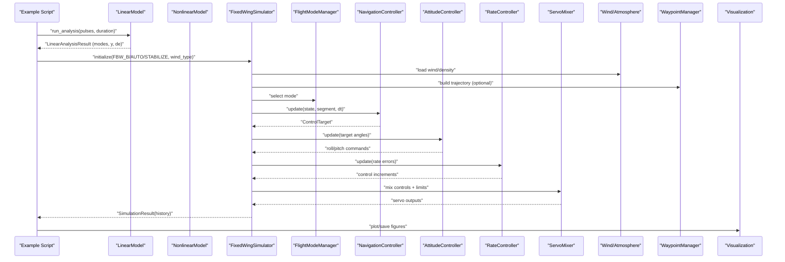
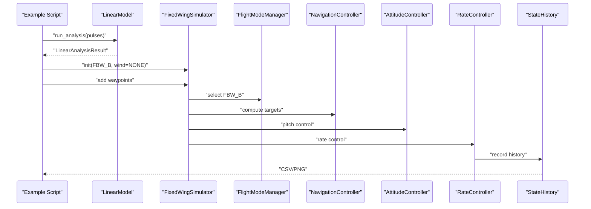
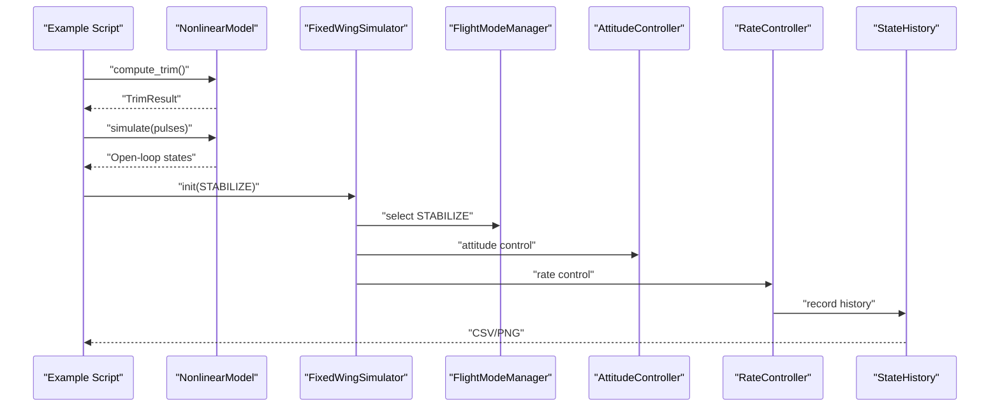
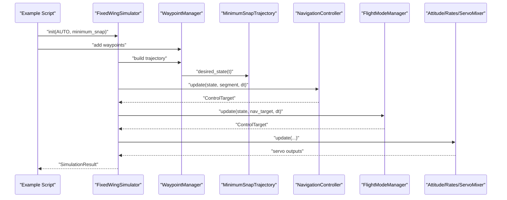
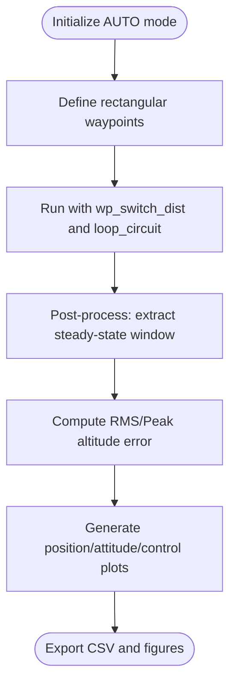
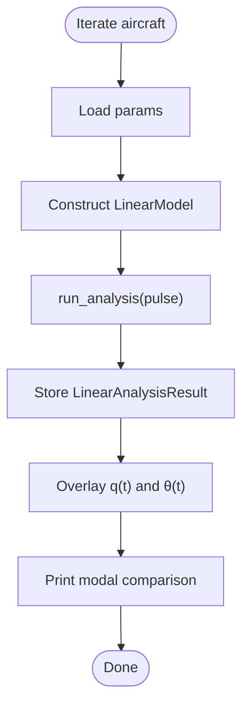
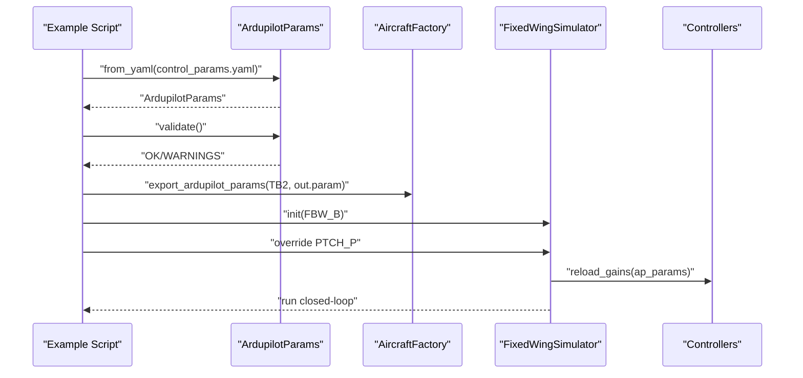
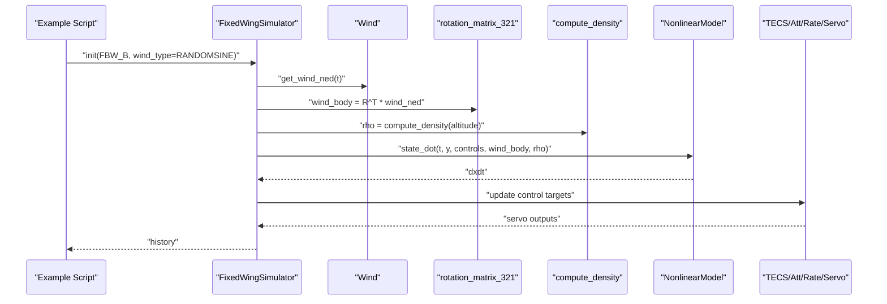
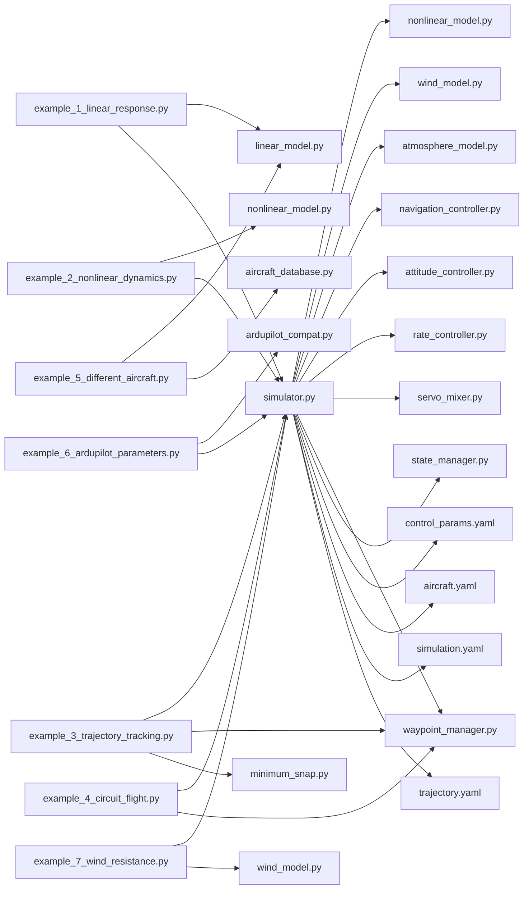

# Examples and Tutorials

<cite>
**Referenced Files in This Document**
- [example_1_linear_response.py](file://examples/example_1_linear_response.py)
- [example_2_nonlinear_dynamics.py](file://examples/example_2_nonlinear_dynamics.py)
- [example_3_trajectory_tracking.py](file://examples/example_3_trajectory_tracking.py)
- [example_4_circuit_flight.py](file://examples/example_4_circuit_flight.py)
- [example_5_different_aircraft.py](file://examples/example_5_different_aircraft.py)
- [example_6_ardupilot_parameters.py](file://examples/example_6_ardupilot_parameters.py)
- [example_7_wind_resistance.py](file://examples/example_7_wind_resistance.py)
- [linear_model.py](file://src/dynamics/linear_model.py)
- [nonlinear_model.py](file://src/dynamics/nonlinear_model.py)
- [simulator.py](file://src/simulation/simulator.py)
- [flight_mode_manager.py](file://src/control/flight_mode_manager.py)
- [navigation_controller.py](file://src/control/navigation_controller.py)
- [tecs_controller.py](file://src/control/tecs_controller.py)
- [attitude_controller.py](file://src/control/attitude_controller.py)
- [rate_controller.py](file://src/control/rate_controller.py)
- [servo_mixer.py](file://src/control/servo_mixer.py)
- [ardupilot_compat.py](file://src/control/ardupilot_compat.py)
- [waypoint_manager.py](file://src/planning/waypoint_manager.py)
- [minimum_snap.py](file://src/planning/minimum_snap.py)
- [wind_model.py](file://src/environment/wind_model.py)
- [aerodynamics.py](file://src/dynamics/aerodynamics.py)
- [state_manager.py](file://src/simulation/state_manager.py)
- [aircraft_database.py](file://src/models/aircraft_database.py)
- [aircraft_factory.py](file://src/models/aircraft_factory.py)
- [aircraft.yaml](file://config/aircraft.yaml)
- [control_params.yaml](file://config/control_params.yaml)
- [simulation.yaml](file://config/simulation.yaml)
- [trajectory.yaml](file://config/trajectory.yaml)
</cite>

## Table of Contents
1. [Introduction](#introduction)
2. [Project Structure](#project-structure)
3. [Core Components](#core-components)
4. [Architecture Overview](#architecture-overview)
5. [Detailed Component Analysis](#detailed-component-analysis)
6. [Dependency Analysis](#dependency-analysis)
7. [Performance Considerations](#performance-considerations)
8. [Troubleshooting Guide](#troubleshooting-guide)
9. [Conclusion](#conclusion)
10. [Appendices](#appendices)

## Introduction
This document provides comprehensive tutorials for all example scripts and use cases in the FixedWingSimulator project. It covers:
- Linear response analysis (short period and phugoid modes)
- Nonlinear dynamics simulation (trim and open/closed-loop comparisons)
- Trajectory tracking control (AUTO mode with minimum snap)
- Circuit flight patterns (four-leg rectangle with waypoint sequencing)
- Aircraft comparison studies (parallel 4-DOF linear analysis)
- ArduPilot parameter validation and hot reload
- Wind resistance analysis (disturbance rejection under random sine wind)

Each tutorial explains the underlying concepts, parameter setup, expected results, and analysis techniques, with step-by-step walkthroughs, code explanations, and interpretation guidelines. Comparative analysis examples and parameter study methodologies are included, along with common variations, extensions, and customization options.

## Project Structure
The repository organizes functionality into modular layers:
- examples/: runnable tutorials demonstrating specific scenarios
- src/: core modules for dynamics, control, planning, simulation, environment, models, and visualization
- config/: YAML configurations for aircraft, control, simulation, and trajectory parameters
- output/: generated figures and CSV data from examples

```mermaid
graph TB
subgraph "Examples"
E1["example_1_linear_response.py"]
E2["example_2_nonlinear_dynamics.py"]
E3["example_3_trajectory_tracking.py"]
E4["example_4_circuit_flight.py"]
E5["example_5_different_aircraft.py"]
E6["example_6_ardupilot_parameters.py"]
E7["example_7_wind_resistance.py"]
end
subgraph "Core Modules"
DYN_L["dynamics/linear_model.py"]
DYN_N["dynamics/nonlinear_model.py"]
SIM["simulation/simulator.py"]
CTRL_AP["control/ardupilot_compat.py"]
CTRL_FM["control/flight_mode_manager.py"]
CTRL_NAV["control/navigation_controller.py"]
CTRL_ATT["control/attitude_controller.py"]
CTRL_RATE["control/rate_controller.py"]
CTRL_MIX["control/servo_mixer.py"]
PLAN_WP["planning/waypoint_manager.py"]
PLAN_MS["planning/minimum_snap.py"]
ENV_W["environment/wind_model.py"]
ENV_AERO["dynamics/aerodynamics.py"]
MOD_DB["models/aircraft_database.py"]
MOD_F["models/aircraft_factory.py"]
STATE_H["simulation/state_manager.py"]
end
subgraph "Configs"
CFG_A["aircraft.yaml"]
CFG_C["control_params.yaml"]
CFG_S["simulation.yaml"]
CFG_T["trajectory.yaml"]
end
E1 --> DYN_L
E1 --> SIM
E2 --> DYN_N
E2 --> SIM
E3 --> SIM
E3 --> PLAN_WP
E3 --> PLAN_MS
E4 --> SIM
E5 --> DYN_L
E5 --> MOD_DB
E6 --> CTRL_AP
E6 --> SIM
E7 --> SIM
E7 --> ENV_W
SIM --> DYN_N
SIM --> ENV_W
SIM --> ENV_AERO
SIM --> CTRL_FM
SIM --> CTRL_NAV
SIM --> CTRL_ATT
SIM --> CTRL_RATE
SIM --> CTRL_MIX
SIM --> PLAN_WP
SIM --> PLAN_MS
SIM --> STATE_H
SIM --> CFG_S
SIM --> CFG_C
SIM --> CFG_T
SIM --> CFG_A
```

**Diagram sources**
- [example_1_linear_response.py](file://examples/example_1_linear_response.py#L30-L36)
- [example_2_nonlinear_dynamics.py](file://examples/example_2_nonlinear_dynamics.py#L34-L36)
- [example_3_trajectory_tracking.py](file://examples/example_3_trajectory_tracking.py#L34-L35)
- [example_4_circuit_flight.py](file://examples/example_4_circuit_flight.py#L38-L39)
- [example_5_different_aircraft.py](file://examples/example_5_different_aircraft.py#L18-L19)
- [example_6_ardupilot_parameters.py](file://examples/example_6_ardupilot_parameters.py#L20-L21)
- [example_7_wind_resistance.py](file://examples/example_7_wind_resistance.py#L15-L16)
- [simulator.py](file://src/simulation/simulator.py#L33-L52)

**Section sources**
- [example_1_linear_response.py](file://examples/example_1_linear_response.py#L30-L36)
- [example_2_nonlinear_dynamics.py](file://examples/example_2_nonlinear_dynamics.py#L34-L36)
- [example_3_trajectory_tracking.py](file://examples/example_3_trajectory_tracking.py#L34-L35)
- [example_4_circuit_flight.py](file://examples/example_4_circuit_flight.py#L38-L39)
- [example_5_different_aircraft.py](file://examples/example_5_different_aircraft.py#L18-L19)
- [example_6_ardupilot_parameters.py](file://examples/example_6_ardupilot_parameters.py#L20-L21)
- [example_7_wind_resistance.py](file://examples/example_7_wind_resistance.py#L15-L16)
- [simulator.py](file://src/simulation/simulator.py#L33-L52)

## Core Components
- Dynamics
  - LinearModel: 4-DOF longitudinal linearization, modal analysis, and pulse response
  - NonlinearModel: 6-DOF nonlinear equations of motion with trim computation
  - Aerodynamics: compute_aero_forces with angle-of-attack, sideslip, and moment coefficients
- Simulation Engine
  - FixedWingSimulator: orchestrates aircraft, environment, control, planning, and integration
  - StateHistory: records simulation time series for post-processing
- Control
  - FlightModeManager: manages AUTO, STABILIZE, FBW modes and control targets
  - NavigationController (L1 + TECS): lateral navigation and total energy control
  - AttitudeController, RateController, ServoMixer: three-axis control chain and actuator mixing
  - ArdupilotParams: ArduPilot-compatible parameter container with validation and export
- Planning
  - WaypointManager: manages NED waypoints and builds trajectories
  - MinimumSnapTrajectory: generates smooth 3D trajectories with minimal snap
- Environment
  - Wind: supports NONE, FIXED, SINE, RANDOMSINE wind models
  - Atmosphere: density computation by altitude
- Models
  - AircraftDatabase and AircraftFactory: parameter loading, overrides, and ArduPilot export

**Section sources**
- [linear_model.py](file://src/dynamics/linear_model.py#L107-L319)
- [nonlinear_model.py](file://src/dynamics/nonlinear_model.py#L104-L386)
- [aerodynamics.py](file://src/dynamics/aerodynamics.py#L35-L148)
- [simulator.py](file://src/simulation/simulator.py#L115-L642)
- [state_manager.py](file://src/simulation/state_manager.py#L95-L193)
- [flight_mode_manager.py](file://src/control/flight_mode_manager.py#L115-L298)
- [navigation_controller.py](file://src/control/navigation_controller.py#L45-L293)
- [tecs_controller.py](file://src/control/tecs_controller.py#L50-L200)
- [attitude_controller.py](file://src/control/attitude_controller.py#L33-L134)
- [rate_controller.py](file://src/control/rate_controller.py#L32-L109)
- [servo_mixer.py](file://src/control/servo_mixer.py#L54-L153)
- [ardupilot_compat.py](file://src/control/ardupilot_compat.py#L17-L130)
- [waypoint_manager.py](file://src/planning/waypoint_manager.py#L20-L208)
- [minimum_snap.py](file://src/planning/minimum_snap.py#L167-L253)
- [wind_model.py](file://src/environment/wind_model.py#L1-L113)
- [aircraft_database.py](file://src/models/aircraft_database.py#L143-L183)
- [aircraft_factory.py](file://src/models/aircraft_factory.py#L39-L136)

## Architecture Overview
The examples demonstrate end-to-end workflows spanning modeling, environment, control, planning, and visualization.

**Diagram sources**
- [example_1_linear_response.py](file://examples/example_1_linear_response.py#L86-L206)
- [example_2_nonlinear_dynamics.py](file://examples/example_2_nonlinear_dynamics.py#L77-L215)
- [example_3_trajectory_tracking.py](file://examples/example_3_trajectory_tracking.py#L67-L194)
- [example_4_circuit_flight.py](file://examples/example_4_circuit_flight.py#L75-L275)
- [example_6_ardupilot_parameters.py](file://examples/example_6_ardupilot_parameters.py#L44-L85)
- [simulator.py](file://src/simulation/simulator.py#L239-L567)

## Detailed Component Analysis

### Tutorial 1: Linear Response Analysis
- Objective: Open-loop modal analysis (short period, phugoid) and closed-loop step response comparison.
- Concepts:
  - 4-DOF linear longitudinal model: states [u', α, q, θ]; inputs [δ_T, δ_e]
  - Modal analysis: eigenvalue decomposition to classify stability and damping
  - Pulse response: elevator step to observe pitch dynamics
  - Closed-loop: FBW_B mode with altitude and airspeed hold via TECS and attitude control
- Parameter Setup:
  - Aircraft: TB2 via database
  - Pulse: magnitude, duration, start time
  - Simulation: dt, duration, wind type (NONE)
  - Modes: FBW_B for closed-loop
- Expected Results:
  - Open-loop: short-period and phugoid modes; pitch rate and angle responses
  - Closed-loop: reduced overshoot, steady altitude tracking
- Analysis Techniques:
  - Extract max pitch angle, final altitude, and plot overlay of open-loop vs closed-loop
  - Export CSV and PNG for offline analysis
- Step-by-step Walkthrough:
  1. Load aircraft parameters and build LinearModel
  2. Define elevator pulses and run analysis
  3. Record time series for q and θ
  4. Initialize FixedWingSimulator in FBW_B mode
  5. Add waypoints to trigger step response
  6. Run closed-loop simulation and record history
  7. Plot overlays and export CSV/PNG
- Interpretation Guidelines:
  - Short period mode: damping ratio and natural frequency indicate agility and stability
  - Phugoid mode: long-term energy exchange; affects trim and control effort
  - Closed-loop improvement: reduced steady-state error and faster settling

**Diagram sources**
- [example_1_linear_response.py](file://examples/example_1_linear_response.py#L86-L206)
- [linear_model.py](file://src/dynamics/linear_model.py#L312-L319)
- [simulator.py](file://src/simulation/simulator.py#L239-L567)

**Section sources**
- [example_1_linear_response.py](file://examples/example_1_linear_response.py#L86-L206)
- [linear_model.py](file://src/dynamics/linear_model.py#L107-L319)
- [simulator.py](file://src/simulation/simulator.py#L115-L642)
- [flight_mode_manager.py](file://src/control/flight_mode_manager.py#L115-L298)
- [navigation_controller.py](file://src/control/navigation_controller.py#L45-L293)
- [tecs_controller.py](file://src/control/tecs_controller.py#L50-L200)
- [attitude_controller.py](file://src/control/attitude_controller.py#L33-L134)
- [rate_controller.py](file://src/control/rate_controller.py#L32-L109)
- [state_manager.py](file://src/simulation/state_manager.py#L95-L193)

### Tutorial 2: Nonlinear Dynamics Simulation
- Objective: Compare open-loop 6-DOF nonlinear response to closed-loop PID stabilization.
- Concepts:
  - NonlinearModel: 6-DOF EOM with body rates, Euler angles, positions
  - Trim computation for level flight
  - Open-loop: aileron pulse without control
  - Closed-loop: STABILIZE mode with attitude and rate control
- Parameter Setup:
  - Aircraft: Predator
  - Pulse: roll input with duration and magnitude
  - Simulation: dt, duration, wind type (NONE)
  - Mode: STABILIZE
- Expected Results:
  - Open-loop: significant roll oscillations; pitch coupling
  - Closed-loop: roll suppression; altitude hold
- Analysis Techniques:
  - Compare max roll in open/closed-loop
  - Export state histories and side-by-side plots
- Step-by-step Walkthrough:
  1. Load aircraft parameters and construct NonlinearModel
  2. Compute trim (U0, alpha, delta_e)
  3. Define aileron pulse and simulate open-loop
  4. Initialize simulator in STABILIZE mode
  5. Run closed-loop and record history
  6. Plot roll angle/velocity and altitude
- Interpretation Guidelines:
  - Nonlinear effects: coupling between roll, pitch, yaw; saturation of control surfaces
  - Stability margins: check roll rate convergence and control authority

**Diagram sources**
- [example_2_nonlinear_dynamics.py](file://examples/example_2_nonlinear_dynamics.py#L77-L215)
- [nonlinear_model.py](file://src/dynamics/nonlinear_model.py#L160-L281)
- [simulator.py](file://src/simulation/simulator.py#L239-L567)

**Section sources**
- [example_2_nonlinear_dynamics.py](file://examples/example_2_nonlinear_dynamics.py#L77-L215)
- [nonlinear_model.py](file://src/dynamics/nonlinear_model.py#L104-L386)
- [simulator.py](file://src/simulation/simulator.py#L115-L642)
- [flight_mode_manager.py](file://src/control/flight_mode_manager.py#L115-L298)
- [attitude_controller.py](file://src/control/attitude_controller.py#L33-L134)
- [rate_controller.py](file://src/control/rate_controller.py#L32-L109)
- [state_manager.py](file://src/simulation/state_manager.py#L95-L193)

### Tutorial 3: Trajectory Tracking Control
- Objective: Closed-loop AUTO mode tracking a square trajectory using minimum snap.
- Concepts:
  - WaypointManager: NED waypoints, activity segments, desired state
  - MinimumSnapTrajectory: smooth 3D path with continuous curvature
  - NavigationController: L1 lateral + TECS vertical control
  - FlightModeManager: AUTO mode outputs control targets
- Parameter Setup:
  - Aircraft: TB2
  - Trajectory: minimum_snap
  - Waypoints: square pattern at constant altitude
  - Simulation: dt, duration, wind type (NONE)
- Expected Results:
  - Smooth tracking with minimal acceleration/transitions
  - Stable altitude and airspeed under TECS
- Analysis Techniques:
  - Plot position/velocity, attitude/angular rates, control inputs
  - Export full 23-channel history to CSV
- Step-by-step Walkthrough:
  1. Create FixedWingSimulator in AUTO with minimum_snap
  2. Define square waypoints and load into WaypointManager
  3. Run closed-loop simulation
  4. Generate position/attitude/control plots and 3D trajectory
  5. Export CSV for further analysis
- Interpretation Guidelines:
  - L1 tuning: period and damping affect cross-track error and overshoot
  - TECS tuning: time constant and damping impact climb/sink and speed regulation
  - Trajectory smoothness: minimum snap reduces jerk and improves passenger/ payload comfort

**Diagram sources**
- [example_3_trajectory_tracking.py](file://examples/example_3_trajectory_tracking.py#L67-L194)
- [waypoint_manager.py](file://src/planning/waypoint_manager.py#L127-L208)
- [minimum_snap.py](file://src/planning/minimum_snap.py#L167-L253)
- [navigation_controller.py](file://src/control/navigation_controller.py#L134-L202)
- [flight_mode_manager.py](file://src/control/flight_mode_manager.py#L173-L191)
- [simulator.py](file://src/simulation/simulator.py#L239-L567)

**Section sources**
- [example_3_trajectory_tracking.py](file://examples/example_3_trajectory_tracking.py#L67-L194)
- [waypoint_manager.py](file://src/planning/waypoint_manager.py#L20-L208)
- [minimum_snap.py](file://src/planning/minimum_snap.py#L167-L253)
- [navigation_controller.py](file://src/control/navigation_controller.py#L45-L293)
- [tecs_controller.py](file://src/control/tecs_controller.py#L50-L200)
- [flight_mode_manager.py](file://src/control/flight_mode_manager.py#L115-L200)
- [simulator.py](file://src/simulation/simulator.py#L115-L230)

### Tutorial 4: Circuit Flight Patterns
- Objective: Four-leg rectangular circuit using waypoint sequencing (no polynomial trajectory).
- Concepts:
  - Waypoint sequencing with wp_switch_dist threshold
  - TECS handling altitude and airspeed on each leg
  - Looping circuit with optional continuous mode
- Parameter Setup:
  - Aircraft: TB2
  - Circuit: side length, altitude, simulation duration
  - Switch distance: > minimum turn radius to reduce overshoot
  - Mode: AUTO (no trajectory interpolation)
- Expected Results:
  - Steady-state altitude tracking after transient
  - Ground track approximates a rectangle
- Analysis Techniques:
  - Compute RMS and peak altitude error over steady-state window
  - Plot position, attitude, control inputs, 2D ground track, altitude/throttle
- Step-by-step Walkthrough:
  1. Initialize simulator in AUTO mode
  2. Define rectangular waypoints and load into WaypointManager
  3. Run with use_trajectory=False and wp_switch_dist
  4. Post-process steady-state metrics and generate plots
- Interpretation Guidelines:
  - wp_switch_dist: larger than minimum turn radius improves smooth transitions
  - TECS parameters: climb/sink rates and damping influence leg tracking
  - Looping: continuous mode enables multi-turn analysis

**Diagram sources**
- [example_4_circuit_flight.py](file://examples/example_4_circuit_flight.py#L75-L275)

**Section sources**
- [example_4_circuit_flight.py](file://examples/example_4_circuit_flight.py#L75-L275)
- [waypoint_manager.py](file://src/planning/waypoint_manager.py#L127-L167)
- [navigation_controller.py](file://src/control/navigation_controller.py#L134-L202)
- [tecs_controller.py](file://src/control/tecs_controller.py#L247-L315)
- [simulator.py](file://src/simulation/simulator.py#L239-L567)

### Tutorial 5: Aircraft Comparison Studies
- Objective: Compare 7 aircraft under identical elevator pulse using 4-DOF linear model.
- Concepts:
  - Parallel linear simulations across aircraft database
  - Short-period and phugoid modal comparison
- Parameter Setup:
  - Pulse: fixed magnitude and duration
  - Duration: sufficient to observe decays
- Expected Results:
  - Distinct short-period damping and natural frequencies
  - Different phugoid characteristics across aircraft
- Analysis Techniques:
  - Overlay pitch rate and pitch angle responses
  - Print modal table with damping ratios and stability flags
- Step-by-step Walkthrough:
  1. Iterate over AIRCRAFT_NAMES
  2. Load parameters and run LinearModel analysis
  3. Store results and plot overlays
  4. Print modal comparison table
- Interpretation Guidelines:
  - Short-period damping: higher damping reduces overshoot
  - Natural frequency: higher frequency implies faster response
  - Stability: real parts of eigenvalues determine stability

**Diagram sources**
- [example_5_different_aircraft.py](file://examples/example_5_different_aircraft.py#L21-L64)
- [linear_model.py](file://src/dynamics/linear_model.py#L312-L319)

**Section sources**
- [example_5_different_aircraft.py](file://examples/example_5_different_aircraft.py#L21-L64)
- [aircraft_database.py](file://src/models/aircraft_database.py#L143-L166)
- [linear_model.py](file://src/dynamics/linear_model.py#L107-L319)

### Tutorial 6: ArduPilot Parameter Validation
- Objective: Load ArduPilot-compatible parameters, validate ranges, hot-reload gains, and compare tracking performance.
- Concepts:
  - ArdupilotParams: strict field names matching ArduPilot
  - Parameter validation and export to .param
  - Hot-reload gains during simulation
- Parameter Setup:
  - Load control_params.yaml into ArdupilotParams
  - Validate parameters
  - Export .param for hardware-in-the-loop
  - Adjust PTCH_P and re-run closed-loop tracking
- Expected Results:
  - Parameter validation pass/warnings
  - Exported .param file
  - Improved tracking with tuned pitch gain
- Analysis Techniques:
  - Compare altitude and pitch angle traces for different PTCH_P values
- Step-by-step Walkthrough:
  1. Load ArdupilotParams from YAML
  2. Validate parameters
  3. Export .param via AircraftFactory
  4. Create simulator, override PTCH_P, reload gains
  5. Run closed-loop and compare traces
- Interpretation Guidelines:
  - PTCH_P: higher gain increases responsiveness but may cause overshoot
  - Validate before hardware deployment
  - Use hot-reload for rapid iteration

**Diagram sources**
- [example_6_ardupilot_parameters.py](file://examples/example_6_ardupilot_parameters.py#L23-L85)
- [ardupilot_compat.py](file://src/control/ardupilot_compat.py#L74-L130)
- [aircraft_factory.py](file://src/models/aircraft_factory.py#L94-L136)
- [simulator.py](file://src/simulation/simulator.py#L165-L171)

**Section sources**
- [example_6_ardupilot_parameters.py](file://examples/example_6_ardupilot_parameters.py#L23-L85)
- [ardupilot_compat.py](file://src/control/ardupilot_compat.py#L17-L130)
- [aircraft_factory.py](file://src/models/aircraft_factory.py#L94-L136)
- [simulator.py](file://src/simulation/simulator.py#L130-L234)

### Tutorial 7: Wind Resistance Analysis
- Objective: Evaluate disturbance rejection under random sine wind using FBW_B mode.
- Concepts:
  - Wind model: NONE, FIXED, SINE, RANDOMSINE
  - Relative wind calculation: subtract wind body from body velocity
  - Nonlinear dynamics with wind-induced drag
- Parameter Setup:
  - Aircraft: Anka
  - Wind: RANDOMSINE
  - Mode: FBW_B (altitude + airspeed hold)
  - Trajectory: minimum_snap with distant waypoints to maintain straight flight
- Expected Results:
  - Altitude and airspeed stabilization despite wind disturbances
  - Reduced drift compared to open-loop
- Analysis Techniques:
  - Plot altitude and airspeed deviations
  - Export CSV for statistical analysis
- Step-by-step Walkthrough:
  1. Initialize simulator with RANDOMSINE wind
  2. Add waypoints to enforce straight-line flight
  3. Run closed-loop simulation
  4. Plot altitude and airspeed deviations
- Interpretation Guidelines:
  - Random sine wind emulates turbulence; assess TECS robustness
  - Body-fixed frame correction ensures accurate relative wind
  - Export data for spectral analysis and fatigue assessment

**Diagram sources**
- [example_7_wind_resistance.py](file://examples/example_7_wind_resistance.py#L20-L52)
- [wind_model.py](file://src/environment/wind_model.py#L76-L108)
- [aerodynamics.py](file://src/dynamics/aerodynamics.py#L68-L77)
- [nonlinear_model.py](file://src/dynamics/nonlinear_model.py#L160-L182)
- [simulator.py](file://src/simulation/simulator.py#L329-L521)

**Section sources**
- [example_7_wind_resistance.py](file://examples/example_7_wind_resistance.py#L20-L52)
- [wind_model.py](file://src/environment/wind_model.py#L1-L113)
- [aerodynamics.py](file://src/dynamics/aerodynamics.py#L35-L148)
- [nonlinear_model.py](file://src/dynamics/nonlinear_model.py#L104-L386)
- [simulator.py](file://src/simulation/simulator.py#L239-L567)

## Dependency Analysis
The examples depend on core modules organized by responsibility:

**Diagram sources**
- [example_1_linear_response.py](file://examples/example_1_linear_response.py#L30-L36)
- [example_2_nonlinear_dynamics.py](file://examples/example_2_nonlinear_dynamics.py#L34-L36)
- [example_3_trajectory_tracking.py](file://examples/example_3_trajectory_tracking.py#L34-L35)
- [example_4_circuit_flight.py](file://examples/example_4_circuit_flight.py#L38-L39)
- [example_5_different_aircraft.py](file://examples/example_5_different_aircraft.py#L18-L19)
- [example_6_ardupilot_parameters.py](file://examples/example_6_ardupilot_parameters.py#L20-L21)
- [example_7_wind_resistance.py](file://examples/example_7_wind_resistance.py#L15-L16)
- [simulator.py](file://src/simulation/simulator.py#L33-L52)

**Section sources**
- [simulator.py](file://src/simulation/simulator.py#L33-L52)
- [state_manager.py](file://src/simulation/state_manager.py#L95-L193)

## Performance Considerations
- Numerical integration
  - dopri5 (Dormand-Prince 5) used for real-time and batch runs; suitable for moderate wind conditions
  - For strong turbulence or stiff problems, consider tighter tolerances or higher-order integrators
- Control loop latency
  - Sampling period dt influences stability and response; ensure adequate bandwidth
  - Filters and anti-windup in PID loops improve robustness
- Data recording efficiency
  - StateHistory preallocates arrays to minimize memory churn
  - Export CSV and PNG only when needed to reduce I/O overhead
- Parameter scale and units
  - Consistent unit conversions (degrees to radians, NED to body frames) prevent numerical issues
  - Validate parameter ranges to avoid saturation and divergence

[No sources needed since this section provides general guidance]

## Troubleshooting Guide
- Parameter validation warnings
  - Use ArdupilotParams.validate() to catch invalid ranges; adjust control_params.yaml accordingly
- Wind field anomalies
  - Verify wind_type and wind_speed/direction; ensure NED-to-body rotation is correct
- Simulation divergence
  - Reduce dt, check control gains, and confirm trim computation for nonlinear simulations
- File save failures
  - Confirm write permissions for output directory; Matplotlib Agg backend avoids GUI windows
- Trajectory tracking issues
  - Inspect L1 and TECS parameters; ensure waypoints are properly ordered and altitude aligned
- Circuit tracking oscillations
  - Increase wp_switch_dist and tune TECS damping; verify loop_circuit behavior

**Section sources**
- [ardupilot_compat.py](file://src/control/ardupilot_compat.py#L104-L130)
- [wind_model.py](file://src/environment/wind_model.py#L1-L113)
- [simulator.py](file://src/simulation/simulator.py#L558-L562)
- [example_1_linear_response.py](file://examples/example_1_linear_response.py#L60-L68)
- [state_manager.py](file://src/simulation/state_manager.py#L182-L193)

## Conclusion
These tutorials showcase the FixedWingSimulator’s capabilities across linear and nonlinear dynamics, trajectory tracking, circuit flight, aircraft comparison, ArduPilot parameter validation, and wind resistance analysis. By combining precise parameter setups, robust control chains, and comprehensive post-processing, users can evaluate stability, performance, and robustness under realistic conditions. The modular architecture enables easy extension to new scenarios, parameter studies, and hardware-in-the-loop validation.

[No sources needed since this section summarizes without analyzing specific files]

## Appendices

### Comparative Analysis Methodologies
- Modal comparison across aircraft
  - Use LinearModel to compute short-period and phugoid modes; compare damping ratios and natural frequencies
  - Overlay time responses for qualitative comparison
- Control parameter sensitivity
  - Vary single parameters (e.g., PTCH_P) while keeping others fixed; compare altitude and pitch responses
  - Use CSV exports for statistical analysis (mean, std, peak error)
- Wind effect quantification
  - Compare altitude and airspeed deviations under different wind types
  - Export time histories for spectral and fatigue analysis

[No sources needed since this section provides general guidance]

### Parameter Study Methodologies
- Single-factor sweeps
  - Fix all parameters except one; vary that parameter over a meaningful range
  - Record performance metrics (steady-state error, overshoot, settling time)
- Multi-objective optimization
  - Define objectives (e.g., minimize altitude error and control effort)
  - Use Pareto analysis to select trade-off solutions
- Robustness testing
  - Test under multiple wind conditions and aircraft mismatches
  - Assess worst-case performance and safety margins

[No sources needed since this section provides general guidance]