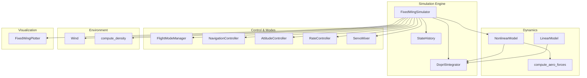
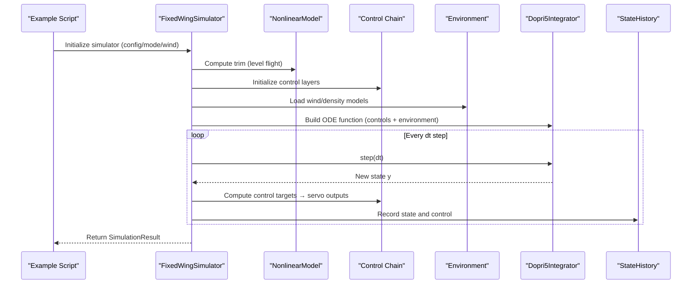
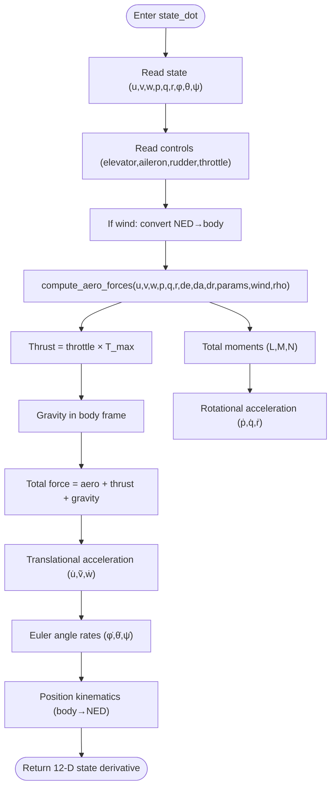
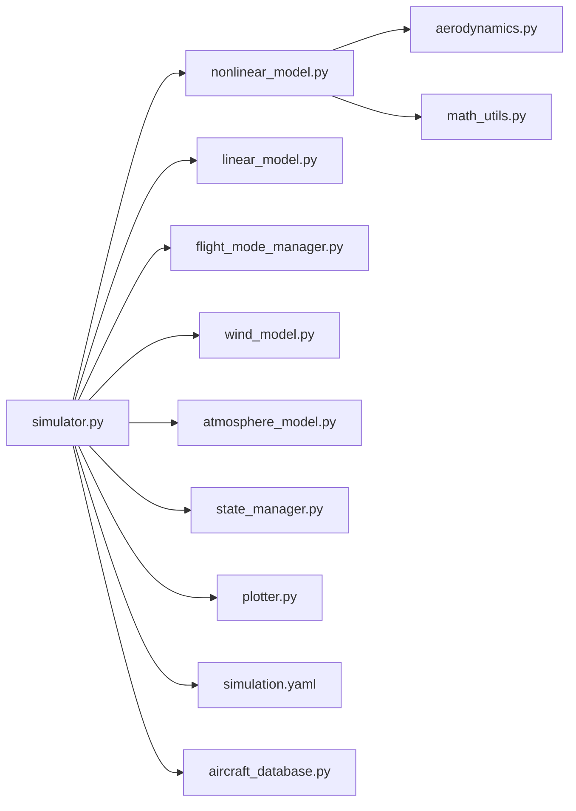

# Nonlinear Dynamics Simulation

<cite>
**Referenced Files in This Document**
- [src/dynamics/nonlinear_model.py](file://src/dynamics/nonlinear_model.py)
- [src/dynamics/aerodynamics.py](file://src/dynamics/aerodynamics.py)
- [src/utils/math_utils.py](file://src/utils/math_utils.py)
- [src/simulation/simulator.py](file://src/simulation/simulator.py)
- [src/simulation/integrator.py](file://src/simulation/integrator.py)
- [src/simulation/state_manager.py](file://src/simulation/state_manager.py)
- [src/models/aircraft_database.py](file://src/models/aircraft_database.py)
- [config/simulation.yaml](file://config/simulation.yaml)
- [config/aircraft.yaml](file://config/aircraft.yaml)
- [doc/zh/content/使用示例/非线性动力学仿真.md](file://doc/zh/content/使用示例/非线性动力学仿真.md)
- [doc/zh/content/动力学系统/6自由度非线性动力学模型.md](file://doc/zh/content/动力学系统/6自由度非线性动力学模型.md)
</cite>

## Table of Contents
1. [Introduction](#introduction)
2. [Project Structure](#project-structure)
3. [Core Components](#core-components)
4. [Architecture Overview](#architecture-overview)
5. [Detailed Component Analysis](#detailed-component-analysis)
6. [Dependency Analysis](#dependency-analysis)
7. [Performance Considerations](#performance-considerations)
8. [Troubleshooting Guide](#troubleshooting-guide)
9. [Conclusion](#conclusion)
10. [Appendices](#appendices)

## Introduction
This document explains the 6-degree-of-freedom (6-DOF) nonlinear flight dynamics simulation implemented in the FixedWingSimulator project. It covers the state vector definition, equations of motion, numerical integration methods, simulation configuration, initial conditions setup, and result interpretation. It also compares nonlinear and linear models, highlights when nonlinear effects become significant, and discusses aircraft behavior under various flight conditions, stability characteristics, and the limitations of linear approximations.

## Project Structure
The nonlinear simulation is orchestrated by the main simulator, which integrates dynamics, environment, control, planning, and visualization modules. The 6-DOF nonlinear model computes the full nonlinear equations of motion, while the integrator handles numerical propagation. Configuration files define simulation parameters and aircraft selection.

**Diagram sources**
- [src/simulation/simulator.py](file://src/simulation/simulator.py#L115-L642)
- [src/dynamics/nonlinear_model.py](file://src/dynamics/nonlinear_model.py#L104-L386)
- [src/dynamics/linear_model.py](file://src/dynamics/linear_model.py#L107-L319)
- [src/dynamics/aerodynamics.py](file://src/dynamics/aerodynamics.py#L35-L148)
- [src/simulation/integrator.py](file://src/simulation/integrator.py#L17-L108)
- [src/visualization/plotter.py](file://src/visualization/plotter.py#L19-L244)

**Section sources**
- [src/simulation/simulator.py](file://src/simulation/simulator.py#L1-L642)
- [src/dynamics/nonlinear_model.py](file://src/dynamics/nonlinear_model.py#L1-L386)
- [src/dynamics/linear_model.py](file://src/dynamics/linear_model.py#L1-L319)
- [src/dynamics/aerodynamics.py](file://src/dynamics/aerodynamics.py#L1-L148)
- [src/simulation/integrator.py](file://src/simulation/integrator.py#L1-L108)
- [src/visualization/plotter.py](file://src/visualization/plotter.py#L1-L244)

## Core Components
- Nonlinear 6-DOF model: Implements translational and rotational dynamics with full nonlinearities, including aerodynamic forces/moments, thrust, gravity, wind, and density variations.
- Aerodynamics module: Computes lift, drag, and lateral/roll/yaw moments from angle-of-attack, sideslip, dimensionless angular rates, and control surface deflections.
- Math utilities: Provides rotation matrices, Euler angle rates, and dynamic pressure.
- Integrator: Supports real-time step-by-step (Dopri5) and batch (RK45) integration.
- Simulator: Orchestrates configuration, trim computation, control loops, and state recording.
- State history: Efficiently records time-series data for post-processing and visualization.
- Aircraft database: Supplies validated aircraft parameters and derived quantities.

**Section sources**
- [src/dynamics/nonlinear_model.py](file://src/dynamics/nonlinear_model.py#L104-L386)
- [src/dynamics/aerodynamics.py](file://src/dynamics/aerodynamics.py#L35-L148)
- [src/utils/math_utils.py](file://src/utils/math_utils.py#L43-L124)
- [src/simulation/integrator.py](file://src/simulation/integrator.py#L17-L108)
- [src/simulation/simulator.py](file://src/simulation/simulator.py#L115-L642)
- [src/simulation/state_manager.py](file://src/simulation/state_manager.py#L95-L193)
- [src/models/aircraft_database.py](file://src/models/aircraft_database.py#L143-L166)

## Architecture Overview
The typical nonlinear simulation flow is:
- Load configuration and aircraft parameters.
- Compute trim for level flight.
- Build the ODE function incorporating control and environmental effects.
- Integrate in real-time (dopri5) or batch (RK45).
- Record state history and derive quantities.
- Visualize and export results.

**Diagram sources**
- [src/simulation/simulator.py](file://src/simulation/simulator.py#L239-L567)
- [src/dynamics/nonlinear_model.py](file://src/dynamics/nonlinear_model.py#L261-L281)
- [src/simulation/state_manager.py](file://src/simulation/state_manager.py#L124-L174)

## Detailed Component Analysis

### 6-DOF Nonlinear Dynamics Model
- State vector (12-D, NED frame): body velocities [u, v, w], body angular rates [p, q, r], Euler angles [φ, θ, ψ], and NED position [x_N, x_E, x_D].
- Equations of motion:
  - Translational: u̇, ṽ, ẇ from total forces (aerodynamics + thrust + gravity) divided by mass, including Coriolis-like coupling terms.
  - Rotational: ė = (L, M, N) with inertia coupling using Ixx, Iyy, Izz, and Ixz; denominators involve Ixx*Izz - Ixz^2.
  - Euler angle kinematics: φ̇, θ̇, ψ̇ from body rates via 3-2-1 Euler mapping with numerical protection near singularities.
  - Position kinematics: [ẋ_N, ẋ_E, ẋ_D] = R(φ, θ, ψ) [u, v, w] with R in NED.
- Aerodynamics: Uses angle-of-attack β, sideslip γ, dimensionless angular rates, and linearized stability derivatives to compute non-dimensional coefficients, then converts to forces and moments.
- Control inputs: Elevator, aileron, rudder, throttle; thrust modeled proportionally with a realistic maximum based on thrust-to-weight ratio.
- Wind and density: Optional NED wind converted to body frame; air density computed from altitude.

**Diagram sources**
- [src/dynamics/nonlinear_model.py](file://src/dynamics/nonlinear_model.py#L160-L255)
- [src/dynamics/aerodynamics.py](file://src/dynamics/aerodynamics.py#L35-L148)
- [src/utils/math_utils.py](file://src/utils/math_utils.py#L43-L101)

**Section sources**
- [src/dynamics/nonlinear_model.py](file://src/dynamics/nonlinear_model.py#L4-L20)
- [src/dynamics/nonlinear_model.py](file://src/dynamics/nonlinear_model.py#L160-L255)
- [src/dynamics/aerodynamics.py](file://src/dynamics/aerodynamics.py#L35-L148)
- [src/utils/math_utils.py](file://src/utils/math_utils.py#L43-L101)

### Linear vs Nonlinear Models
- Linear 4-DOF model (longitudinal): State [u_p, α, q, θ], inputs [δ_T, δ_e]; builds A and B matrices and performs modal analysis (short period, phugoid, subsidence).
- Nonlinear 6-DOF model: Captures full physics including lateral-directional coupling, Euler angle singularities, and wind/density effects; suitable for realistic transient and steady-state analysis.
- When nonlinear effects become significant:
  - Large angle maneuvers (high α/β, large φ/θ).
  - Rapid control inputs causing large p, q, r.
  - Crosswind or gusts leading to significant β and lateral coupling.
  - High-altitude low-density regimes affecting trim and control authority.
- Limitations of linear approximations:
  - Small-angle assumptions; ignores β coupling in lateral-directional modes.
  - Constant trim conditions; cannot capture transient divergence or limit cycle behavior.
  - May predict stable behavior where nonlinearities cause instability or oscillations.

**Section sources**
- [src/dynamics/linear_model.py](file://src/dynamics/linear_model.py#L107-L319)
- [doc/zh/content/动力学系统/6自由度非线性动力学模型.md](file://doc/zh/content/动力学系统/6自由度非线性动力学模型.md#L190-L248)

### Simulation Configuration and Initial Conditions
- Configuration:
  - Time step dt, duration, integrator type, tolerances, initial position/heading, wind type/speed/dir, logging.
  - Aircraft selection via YAML; optional overrides for mass, wing area, etc.
- Initial conditions:
  - From trim: level flight with zero angular rates; initial attitude equals trim angle; initial position and heading from configuration.
  - Control bias: trim elevator deflection included in control command; others zero for trim-hold open-loop runs.
- Wind and density:
  - Wind can be none, fixed, sine, or random sine; converted to body frame for relative airspeed.
  - Air density computed from altitude for realistic aerodynamic scaling.

**Section sources**
- [config/simulation.yaml](file://config/simulation.yaml#L1-L30)
- [config/aircraft.yaml](file://config/aircraft.yaml#L1-L13)
- [src/simulation/simulator.py](file://src/simulation/simulator.py#L130-L234)
- [src/simulation/simulator.py](file://src/simulation/simulator.py#L270-L339)

### Numerical Integration Methods
- Real-time loop (dopri5): Adaptive step-size single-step integrator; robust for nonlinear systems; raises explicit errors on failure.
- Batch analysis (RK45): solve_ivp with RK45; useful for offline analysis with dense output.
- Integration parameters: rtol/atol set to 1e-6; max_step 0.1s for nonlinear stability.

**Section sources**
- [src/simulation/integrator.py](file://src/simulation/integrator.py#L17-L108)
- [src/dynamics/nonlinear_model.py](file://src/dynamics/nonlinear_model.py#L348-L351)

### Result Interpretation and Post-Processing
- Results container includes time, state history, control histories, derived quantities (α, β, airspeed, kinetic/potential energy), trim results, and UAV name.
- Visualization: Matplotlib plots for all 12 states; optional animation and 3D trajectory plots.
- Post-processing: Export to CSV; trim summary; derived energy quantities for energy-balance checks.

**Section sources**
- [src/dynamics/nonlinear_model.py](file://src/dynamics/nonlinear_model.py#L54-L102)
- [src/simulation/state_manager.py](file://src/simulation/state_manager.py#L95-L193)
- [src/visualization/plotter.py](file://src/visualization/plotter.py#L68-L154)

### Differences Between Linear and Nonlinear Models
- Linear model: Predicts smooth, decaying or growing modes; eigenvalue analysis identifies short-period, phugoid, and subsidence behavior.
- Nonlinear model: Can exhibit limit cycles, hysteresis, and asymmetric responses; captures stall-like behavior, spin modes, and wind-induced lateral oscillations.
- Practical implication: Use linear model for controller design and tuning; validate with nonlinear simulations for envelope testing.

**Section sources**
- [src/dynamics/linear_model.py](file://src/dynamics/linear_model.py#L206-L252)
- [doc/zh/content/动力学系统/6自由度非线性动力学模型.md](file://doc/zh/content/动力学系统/6自由度非线性动力学模型.md#L190-L248)

### Aircraft Behavior Under Various Flight Conditions
- Low-speed/high α: Nonlinear model shows increased drag and potential stall indications; linear model may remain stable.
- Crosswind: Nonlinear model captures β-induced lateral forces and yaw coupling; linear model ignores these.
- High-altitude: Reduced density affects trim; nonlinear model adjusts thrust and control authority; linear model assumes constant trim.
- Rapid inputs: Nonlinear model exhibits larger transient responses and coupling; linear model predicts proportional responses.

**Section sources**
- [src/dynamics/nonlinear_model.py](file://src/dynamics/nonlinear_model.py#L199-L222)
- [src/dynamics/aerodynamics.py](file://src/dynamics/aerodynamics.py#L197-L208)
- [src/simulation/simulator.py](file://src/simulation/simulator.py#L275-L300)

## Dependency Analysis
The nonlinear model depends on aerodynamics and math utilities; the simulator composes these with control, environment, and visualization modules.

**Diagram sources**
- [src/simulation/simulator.py](file://src/simulation/simulator.py#L33-L52)
- [src/dynamics/nonlinear_model.py](file://src/dynamics/nonlinear_model.py#L27-L28)
- [src/dynamics/aerodynamics.py](file://src/dynamics/aerodynamics.py#L13)
- [src/utils/math_utils.py](file://src/utils/math_utils.py#L6)
- [src/simulation/state_manager.py](file://src/simulation/state_manager.py#L11-L13)
- [src/visualization/plotter.py](file://src/visualization/plotter.py#L9-L12)
- [config/simulation.yaml](file://config/simulation.yaml#L1-L30)
- [src/models/aircraft_database.py](file://src/models/aircraft_database.py#L12-L20)

**Section sources**
- [src/simulation/simulator.py](file://src/simulation/simulator.py#L33-L52)

## Performance Considerations
- Integrator choice: dopri5 for real-time stability; RK45 for offline batch analysis.
- Memory efficiency: StateHistory preallocates arrays; trim() removes unused tail.
- Control chain: Proper sampling and filtering reduce noise amplification.
- Parameterization: Precompute derived quantities (U0, rho, q_bar) to minimize repeated calculations.

[No sources needed since this section provides general guidance]

## Troubleshooting Guide
- Integration failures: Reduce step size or tighten tolerances; check initial conditions and control inputs.
- Angle singularities: Monitor θ near ±90°; numerical protection is applied in Euler-rate conversion.
- Parameter mismatches: Verify mass/inertia/planform area against database; confirm Mach/U0/q_bar derivations.
- Wind/density inconsistencies: Ensure wind direction and speed align with configuration; altitude-dependent density is used.

**Section sources**
- [src/simulation/simulator.py](file://src/simulation/simulator.py#L558-L562)
- [src/utils/math_utils.py](file://src/utils/math_utils.py#L89-L91)
- [src/simulation/state_manager.py](file://src/simulation/state_manager.py#L134-L136)
- [src/visualization/plotter.py](file://src/visualization/plotter.py#L186-L195)

## Conclusion
The FixedWingSimulator provides a robust 6-DOF nonlinear dynamics framework suitable for realistic flight analysis. By combining precise aerodynamic modeling, robust numerical integration, and comprehensive control/environment modules, it enables accurate simulation across diverse flight regimes. Use linear models for controller design and nonlinear simulations for envelope validation and nonlinear effect identification.

[No sources needed since this section summarizes without analyzing specific files]

## Appendices

### Example Workflow and Outputs
- Example scripts demonstrate open-loop pulse responses and closed-loop PID tracking, exporting CSV and PNG outputs for further analysis.

**Section sources**
- [doc/zh/content/使用示例/非线性动力学仿真.md](file://doc/zh/content/使用示例/非线性动力学仿真.md#L301-L307)

### Aircraft Parameter Database
- Seven aircraft entries with geometry, inertia, and aerodynamic coefficients; includes derived quantities for dynamics and ArduPilot compatibility.

**Section sources**
- [src/models/aircraft_database.py](file://src/models/aircraft_database.py#L29-L133)
- [src/models/aircraft_database.py](file://src/models/aircraft_database.py#L143-L166)