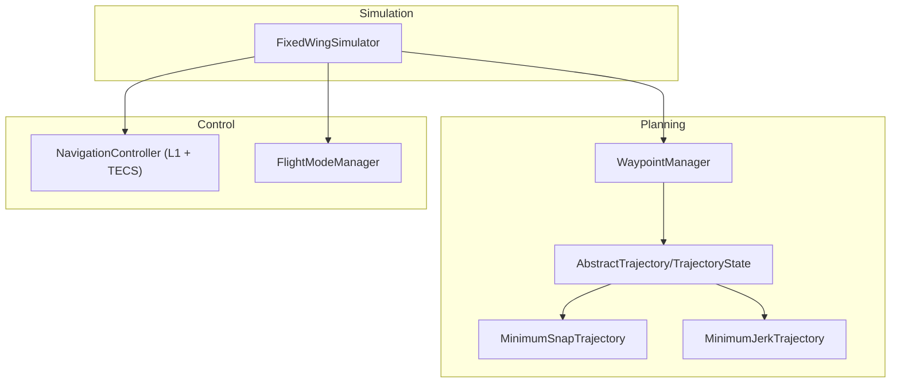
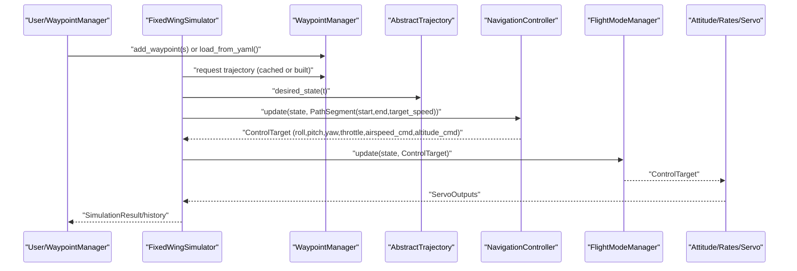
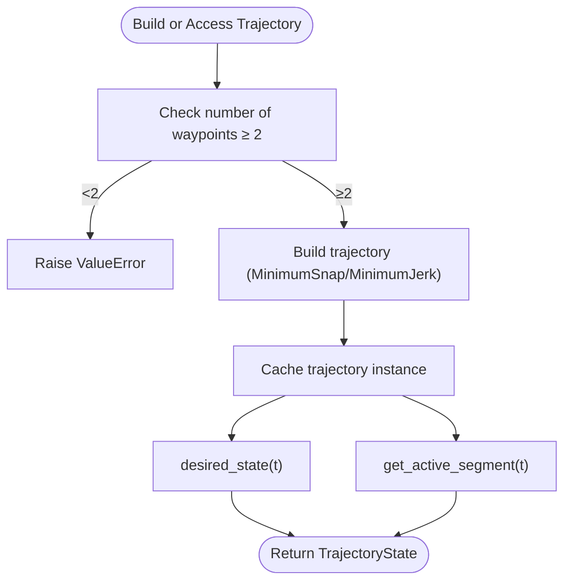
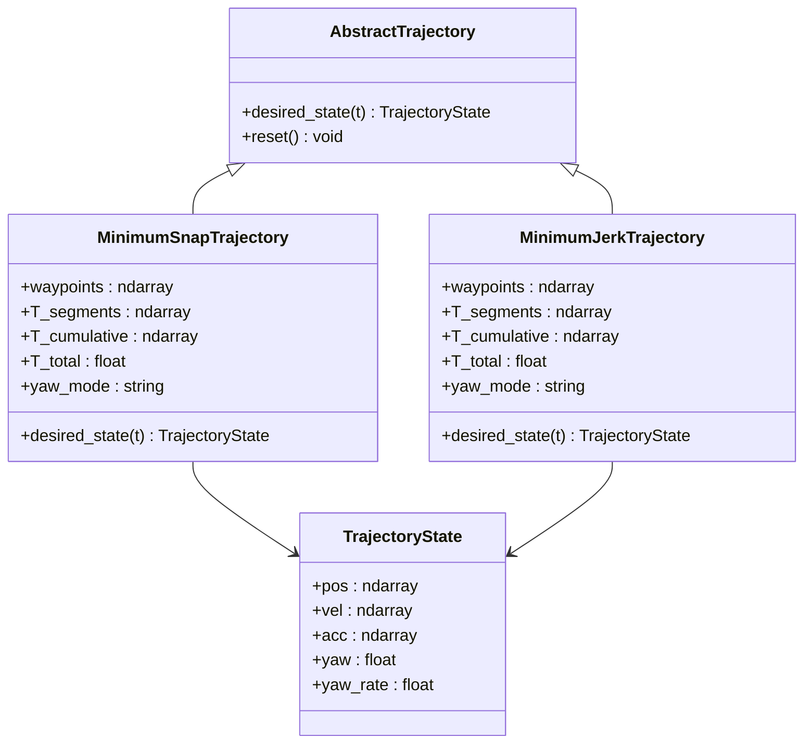
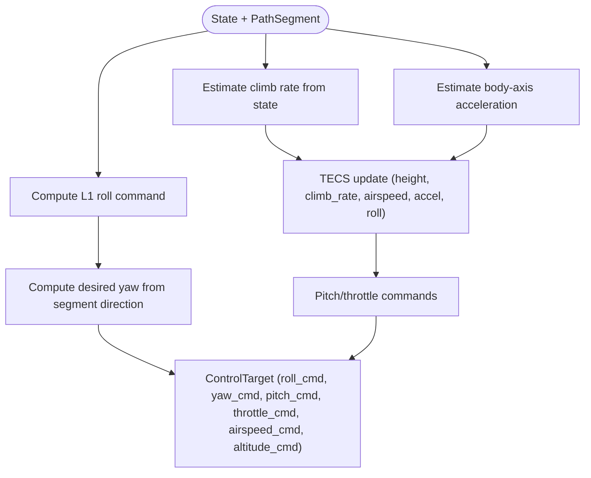
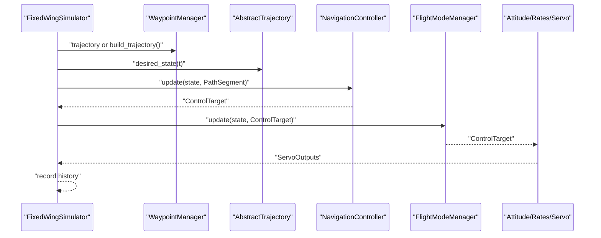
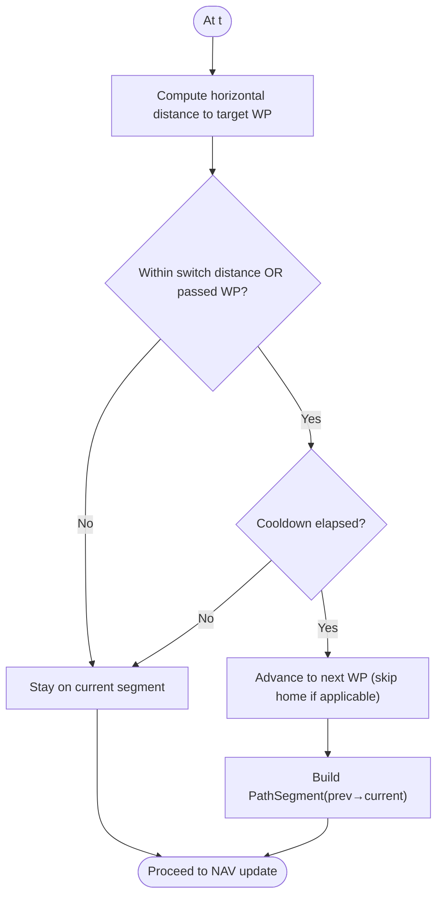
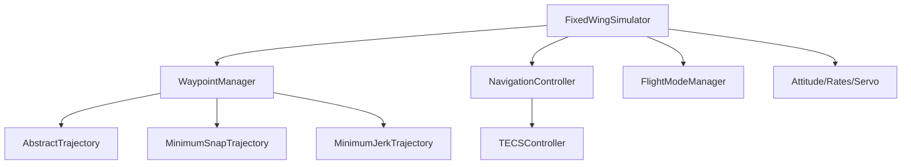

# Trajectory Tracking Control

<cite>
**Referenced Files in This Document**
- [waypoint_manager.py](file://src/planning/waypoint_manager.py)
- [trajectory_base.py](file://src/planning/trajectory_base.py)
- [minimum_snap.py](file://src/planning/minimum_snap.py)
- [minimum_jerk.py](file://src/planning/minimum_jerk.py)
- [navigation_controller.py](file://src/control/navigation_controller.py)
- [flight_mode_manager.py](file://src/control/flight_mode_manager.py)
- [simulator.py](file://src/simulation/simulator.py)
- [trajectory.yaml](file://config/trajectory.yaml)
- [control_params.yaml](file://config/control_params.yaml)
- [main.py](file://main.py)
- [plotter.py](file://src/visualization/plotter.py)
</cite>

## Table of Contents
1. [Introduction](#introduction)
2. [Project Structure](#project-structure)
3. [Core Components](#core-components)
4. [Architecture Overview](#architecture-overview)
5. [Detailed Component Analysis](#detailed-component-analysis)
6. [Dependency Analysis](#dependency-analysis)
7. [Performance Considerations](#performance-considerations)
8. [Troubleshooting Guide](#troubleshooting-guide)
9. [Conclusion](#conclusion)
10. [Appendices](#appendices)

## Introduction
This document explains the trajectory tracking control example in the FixedWingSimulator. It covers waypoint-based mission planning, navigation controller implementation, and closed-loop trajectory following. It documents the WaypointManager usage, trajectory generation, and control system integration. It also explains the L1 navigation algorithm, waypoint transitions, and tracking performance metrics. Guidance is provided for trajectory parameter tuning, waypoint placement strategies, handling dynamic constraints, and understanding the relationship between planned trajectories and actual aircraft response.

## Project Structure
The trajectory tracking control pipeline spans three layers:
- Planning and Mission: WaypointManager constructs trajectories from NED waypoints using MinimumSnap or MinimumJerk.
- Control: NavigationController computes lateral (L1) and longitudinal (TECS) commands from the desired trajectory and current state.
- Simulation: FixedWingSimulator orchestrates the closed-loop simulation, integrating planning, control, and dynamics.

**Diagram sources**
- [waypoint_manager.py](file://src/planning/waypoint_manager.py#L20-L208)
- [trajectory_base.py](file://src/planning/trajectory_base.py#L16-L47)
- [minimum_snap.py](file://src/planning/minimum_snap.py#L167-L253)
- [minimum_jerk.py](file://src/planning/minimum_jerk.py#L17-L71)
- [navigation_controller.py](file://src/control/navigation_controller.py#L45-L293)
- [flight_mode_manager.py](file://src/control/flight_mode_manager.py#L115-L298)
- [simulator.py](file://src/simulation/simulator.py#L115-L642)

**Section sources**
- [main.py](file://main.py#L32-L95)
- [simulator.py](file://src/simulation/simulator.py#L115-L230)

## Core Components
- WaypointManager: Manages NED waypoints, supports loading from YAML, caching trajectories, and segment queries. It builds either MinimumSnapTrajectory or MinimumJerkTrajectory depending on configuration.
- AbstractTrajectory and TrajectoryState: Define the common interface and state representation for desired position, velocity, acceleration, yaw, and yaw rate.
- MinimumSnapTrajectory and MinimumJerkTrajectory: Piecewise polynomial trajectories with continuity and smoothness properties; MinimumJerk reuses the MinimumSnap solver with a lower derivative order.
- NavigationController: Implements L1 lateral navigation and TECS for altitude/airspeed control, producing ControlTarget commands.
- FlightModeManager: Translates NavigationController outputs into actuator commands via attitude and rate control layers.
- FixedWingSimulator: Runs closed-loop simulation, integrates planning and control, records history, and supports visualization.

**Section sources**
- [waypoint_manager.py](file://src/planning/waypoint_manager.py#L20-L208)
- [trajectory_base.py](file://src/planning/trajectory_base.py#L16-L47)
- [minimum_snap.py](file://src/planning/minimum_snap.py#L167-L253)
- [minimum_jerk.py](file://src/planning/minimum_jerk.py#L17-L71)
- [navigation_controller.py](file://src/control/navigation_controller.py#L45-L293)
- [flight_mode_manager.py](file://src/control/flight_mode_manager.py#L115-L298)
- [simulator.py](file://src/simulation/simulator.py#L218-L567)

## Architecture Overview
The closed-loop trajectory tracking architecture integrates planning, navigation, and control:

**Diagram sources**
- [simulator.py](file://src/simulation/simulator.py#L478-L521)
- [waypoint_manager.py](file://src/planning/waypoint_manager.py#L127-L207)
- [navigation_controller.py](file://src/control/navigation_controller.py#L134-L202)
- [flight_mode_manager.py](file://src/control/flight_mode_manager.py#L173-L212)

## Detailed Component Analysis

### WaypointManager and Mission Planning
WaypointManager encapsulates:
- Adding waypoints in NED coordinates (altitudes given as positive-up are internally converted to NED down).
- Loading missions from YAML with fields for type, average_speed, yaw_mode, waypoints, and loop.
- Building and caching trajectories (MinimumSnap or MinimumJerk) and exposing desired_state(t).
- Segment queries to determine the active path segment and remaining time at time t.

Key behaviors:
- Validates minimum waypoint count and handles loop closure by duplicating the first waypoint if needed.
- Exposes total trajectory duration via the underlying trajectory’s T_total.
- Provides get_active_segment(t) to support closed-loop tracking by constraining desired altitude to the active segment bounds.

**Diagram sources**
- [waypoint_manager.py](file://src/planning/waypoint_manager.py#L127-L201)

**Section sources**
- [waypoint_manager.py](file://src/planning/waypoint_manager.py#L20-L208)
- [trajectory.yaml](file://config/trajectory.yaml#L1-L23)

### Trajectory Generation: MinimumSnap and MinimumJerk
Both trajectory types implement AbstractTrajectory and evaluate polynomials per segment:
- MinimumSnapTrajectory: Uses a matrix-based solver to enforce boundary and continuity conditions for minimum-snap trajectories; optionally computes yaw from velocity or fixed waypoints.
- MinimumJerkTrajectory: Reuses the MinimumSnap solver with deriv_order=3 to produce minimum-jerk trajectories.

Important characteristics:
- Segment times can be auto-computed from average_speed or provided explicitly.
- Yaw handling depends on yaw_mode: follow velocity direction, zero, or fixed waypoints.
- Evaluation returns pos, vel, acc, and yaw/yaw_rate for closed-loop control.

**Diagram sources**
- [trajectory_base.py](file://src/planning/trajectory_base.py#L16-L47)
- [minimum_snap.py](file://src/planning/minimum_snap.py#L167-L253)
- [minimum_jerk.py](file://src/planning/minimum_jerk.py#L17-L71)

**Section sources**
- [minimum_snap.py](file://src/planning/minimum_snap.py#L47-L253)
- [minimum_jerk.py](file://src/planning/minimum_jerk.py#L17-L71)
- [trajectory_base.py](file://src/planning/trajectory_base.py#L16-L47)

### Navigation Controller: L1 Law and TECS
The NavigationController combines:
- L1 lateral navigation: Computes desired roll from the look-ahead point based on current ground track and desired track using body-frame velocity components for accuracy.
- TECS (Total Energy Control System): Computes pitch and throttle commands to regulate altitude and airspeed based on estimated climb rate and body-axis acceleration.

Key parameters:
- L1: l1_period and l1_damping define the look-ahead distance and damping; max_roll limits commanded bank.
- TECS: configurable limits, time constants, damping, integral gain, and speed-weighting; cruise speed/altitude serve as targets.

**Diagram sources**
- [navigation_controller.py](file://src/control/navigation_controller.py#L134-L202)
- [navigation_controller.py](file://src/control/navigation_controller.py#L206-L293)

**Section sources**
- [navigation_controller.py](file://src/control/navigation_controller.py#L45-L293)

### Closed-Loop Integration in FixedWingSimulator
FixedWingSimulator orchestrates:
- Initialization of aircraft, environment, control parameters, and WaypointManager.
- Trajectory availability checks and segment clamping for desired altitude.
- PathSegment construction from current state and desired trajectory position.
- NavigationController update feeding ControlTarget to FlightModeManager.
- Attitude and rate control layers converting ControlTarget to servo outputs.
- History recording and result summarization.

**Diagram sources**
- [simulator.py](file://src/simulation/simulator.py#L478-L521)
- [navigation_controller.py](file://src/control/navigation_controller.py#L134-L202)
- [flight_mode_manager.py](file://src/control/flight_mode_manager.py#L173-L212)

**Section sources**
- [simulator.py](file://src/simulation/simulator.py#L218-L567)

### Waypoint Transitions and Circuit Mode
When not using polynomial trajectories, the simulator supports a “circuit” mode:
- Waypoints are flown sequentially; transition occurs when within a horizontal distance threshold or when the aircraft passes the waypoint.
- A minimum cooldown prevents rapid re-switching near waypoints.
- PathSegment is constructed from the previous waypoint to the current waypoint to enable anticipatory turning.

**Diagram sources**
- [simulator.py](file://src/simulation/simulator.py#L431-L477)

**Section sources**
- [simulator.py](file://src/simulation/simulator.py#L346-L477)

## Dependency Analysis
- WaypointManager depends on AbstractTrajectory implementations and configuration for trajectory type, average speed, and yaw mode.
- NavigationController depends on TECSController and math utilities for angle wrapping and saturation.
- FixedWingSimulator composes WaypointManager, NavigationController, FlightModeManager, and control layers; it also loads ArduPilot-compatible parameters from YAML.

**Diagram sources**
- [waypoint_manager.py](file://src/planning/waypoint_manager.py#L127-L167)
- [simulator.py](file://src/simulation/simulator.py#L190-L216)
- [navigation_controller.py](file://src/control/navigation_controller.py#L94-L116)

**Section sources**
- [simulator.py](file://src/simulation/simulator.py#L115-L230)
- [control_params.yaml](file://config/control_params.yaml#L1-L45)

## Performance Considerations
- Trajectory tracking error metrics:
  - Position error: Euclidean distance between actual and desired NED positions.
  - Velocity error: Difference between actual airspeed and desired airspeed.
  - Heading error: Angle difference between actual and desired yaw (wrapped).
- Control effort:
  - Monitor throttle, pitch, and roll commands against limits; check for saturation or chatter.
- Dynamic constraints:
  - Respect max_roll and TECS pitch/throttle limits.
  - Adjust L1 damping and period to balance responsiveness and stability.
- Visualization:
  - Use the plotter to compare actual vs. desired trajectories in 3D and inspect time histories.

[No sources needed since this section provides general guidance]

## Troubleshooting Guide
Common issues and remedies:
- Not enough waypoints: WaypointManager raises an error if fewer than two waypoints are defined.
- Unknown trajectory type: Ensure traj_type is supported (e.g., minimum_snap, minimum_jerk).
- Poor tracking at waypoints:
  - Verify yaw_mode and segment speed targets.
  - Increase L1 damping or reduce l1_period cautiously.
- Oscillations or saturation:
  - Reduce TECS integral gain and increase time constant.
  - Tighten TECS pitch/throttle limits to match aircraft envelope.
- Incorrect initial altitude:
  - The simulator patches the first waypoint altitude to match the initial state to avoid unwanted descent legs.

**Section sources**
- [waypoint_manager.py](file://src/planning/waypoint_manager.py#L139-L140)
- [simulator.py](file://src/simulation/simulator.py#L386-L408)
- [navigation_controller.py](file://src/control/navigation_controller.py#L186-L202)

## Conclusion
The FixedWingSimulator implements a robust closed-loop trajectory tracking system. WaypointManager plans missions in NED coordinates and exposes smooth trajectories via AbstractTrajectory. NavigationController applies L1 lateral guidance and TECS longitudinal control to track desired states. FixedWingSimulator integrates these components into a closed-loop simulation, enabling accurate tracking performance assessment and parameter tuning.

[No sources needed since this section summarizes without analyzing specific files]

## Appendices

### A. Waypoint Placement Strategies
- Use NED coordinates; altitudes are positive-up in input and converted to NED down internally.
- Space waypoints to avoid excessive curvature; short segments can cause frequent segment switches and control chatter.
- For circuits, ensure the first waypoint aligns with the initial altitude to prevent undesired transient descent.

**Section sources**
- [waypoint_manager.py](file://src/planning/waypoint_manager.py#L54-L62)
- [trajectory.yaml](file://config/trajectory.yaml#L12-L19)

### B. Trajectory Parameter Tuning
- Trajectory type:
  - MinimumSnap for smoother higher derivatives; MinimumJerk for simpler jerk minimization.
- Average speed:
  - Impacts segment times; tune to match aircraft performance and mission requirements.
- Yaw mode:
  - yaw_follow: aligns yaw with velocity direction; useful for smooth turns.
  - zero or fixed: for specific mission requirements.

**Section sources**
- [waypoint_manager.py](file://src/planning/waypoint_manager.py#L127-L160)
- [minimum_snap.py](file://src/planning/minimum_snap.py#L181-L224)
- [minimum_jerk.py](file://src/planning/minimum_jerk.py#L24-L48)
- [trajectory.yaml](file://config/trajectory.yaml#L3-L10)

### C. L1 Navigation Algorithm Details
- Look-ahead distance proportional to airspeed and l1_period.
- Desired track computed from the look-ahead point; lateral acceleration derived from the angle difference between current and desired ground tracks.
- Roll command saturated by max_roll.

**Section sources**
- [navigation_controller.py](file://src/control/navigation_controller.py#L206-L293)

### D. TECS Tuning Guidelines
- Increase TECS_TIME_CONST to reduce oscillations; larger values smooth but slow response.
- Raise TECS_PTCH_DAMP and TECS_THR_DAMP to suppress pitch/throttle oscillations.
- Lower TECS_INTEG_GAIN to eliminate integral-induced oscillations.
- Adjust TECS_SPDWEIGHT to emphasize altitude or speed control as needed.

**Section sources**
- [navigation_controller.py](file://src/control/navigation_controller.py#L57-L116)
- [control_params.yaml](file://config/control_params.yaml#L30-L45)

### E. Relationship Between Planned Trajectories and Actual Response
- The simulator compares actual NED positions with desired positions recorded during simulation.
- Use the plotter to visualize 3D trajectories and overlay desired vs. actual paths for qualitative assessment.

**Section sources**
- [simulator.py](file://src/simulation/simulator.py#L542-L555)
- [plotter.py](file://src/visualization/plotter.py#L114-L154)