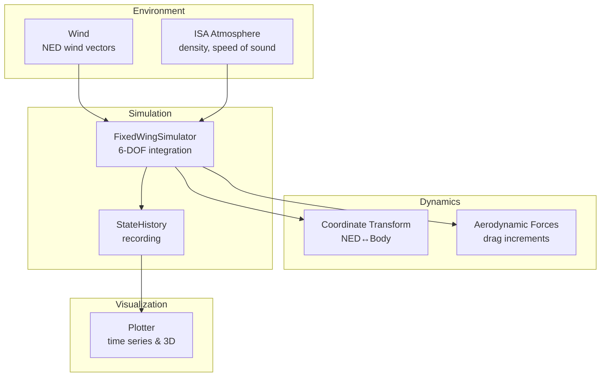
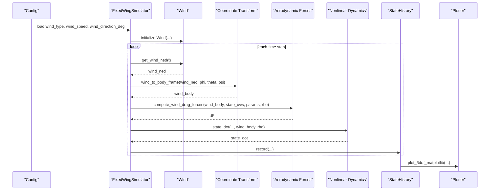
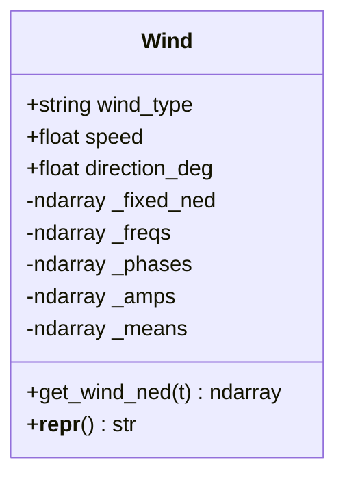
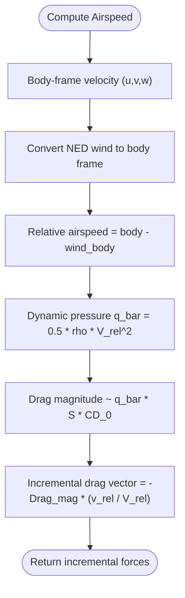
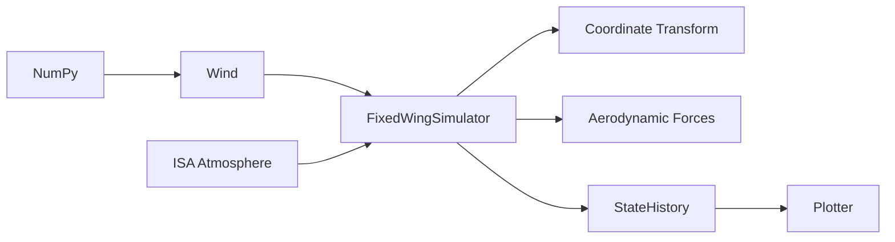

# Wind Resistance Analysis

<cite>
**Referenced Files in This Document**
- [wind_model.py](file://src/environment/wind_model.py)
- [atmosphere_model.py](file://src/environment/atmosphere_model.py)
- [aerodynamic_forces.py](file://src/environment/aerodynamic_forces.py)
- [coordinate_transform.py](file://src/dynamics/coordinate_transform.py)
- [simulator.py](file://src/simulation/simulator.py)
- [state_manager.py](file://src/simulation/state_manager.py)
- [plotter.py](file://src/visualization/plotter.py)
- [simulation.yaml](file://config/simulation.yaml)
- [风阻影响分析.md](file://doc/zh/content/使用示例/风阻影响分析.md)
- [风场模型.md](file://doc/zh/content/环境系统/风场模型.md)
</cite>

## Table of Contents
1. [Introduction](#introduction)
2. [Project Structure](#project-structure)
3. [Core Components](#core-components)
4. [Architecture Overview](#architecture-overview)
5. [Detailed Component Analysis](#detailed-component-analysis)
6. [Dependency Analysis](#dependency-analysis)
7. [Performance Considerations](#performance-considerations)
8. [Troubleshooting Guide](#troubleshooting-guide)
9. [Conclusion](#conclusion)
10. [Appendices](#appendices)

## Introduction
This document presents a comprehensive guide to wind resistance analysis using the FixedWingSimulator. It explains wind field modeling, atmospheric effects on flight performance, and comparative analysis under different wind conditions. The focus is on:
- Wind model configuration and turbulence generation
- Environmental impact assessment via airspeed and drag increments
- Steady wind effects, gust responses, and crosswind handling characteristics
- Guidance on interpreting wind measurements, quantifying performance degradation, and making operational decisions under varying atmospheric conditions

## Project Structure
The wind resistance analysis spans several modules:
- Wind field generation: Wind class produces NED wind vectors for steady, sine, and random sine disturbances
- Atmospheric context: ISA model computes density and speed of sound for drag computations
- Dynamics and transforms: Coordinate transforms convert NED wind to body frame; airspeed is computed as body velocity minus wind in body frame
- Simulation orchestration: Simulator integrates wind into the nonlinear 6-DOF dynamics and records state history
- Visualization: Plotter renders time histories and 3D trajectories for comparative analysis

**Diagram sources**
- [wind_model.py](file://src/environment/wind_model.py#L18-L112)
- [atmosphere_model.py](file://src/environment/atmosphere_model.py#L61-L76)
- [coordinate_transform.py](file://src/dynamics/coordinate_transform.py#L39-L69)
- [aerodynamic_forces.py](file://src/environment/aerodynamic_forces.py#L13-L53)
- [simulator.py](file://src/simulation/simulator.py#L329-L337)
- [state_manager.py](file://src/simulation/state_manager.py#L95-L193)
- [plotter.py](file://src/visualization/plotter.py#L161-L244)

**Section sources**
- [wind_model.py](file://src/environment/wind_model.py#L1-L112)
- [atmosphere_model.py](file://src/environment/atmosphere_model.py#L1-L77)
- [coordinate_transform.py](file://src/dynamics/coordinate_transform.py#L1-L70)
- [aerodynamic_forces.py](file://src/environment/aerodynamic_forces.py#L1-L54)
- [simulator.py](file://src/simulation/simulator.py#L1-L642)
- [state_manager.py](file://src/simulation/state_manager.py#L1-L193)
- [plotter.py](file://src/visualization/plotter.py#L1-L244)

## Core Components
- Wind: Generates NED wind vectors for four types—NONE, FIXED, SINE, RANDOMSINE—based on meteorological “FROM” direction and optional turbulence parameters
- ISA Atmosphere: Computes air density and speed of sound as functions of altitude for drag calculations
- Coordinate Transform: Converts NED wind to body frame and computes true airspeed as body velocity minus wind in body frame
- Aerodynamic Forces: Estimates incremental drag due to relative wind using a simple quadratic model
- Simulator: Integrates wind into the nonlinear 6-DOF dynamics, runs closed-loop control, and records state history
- Visualization: Provides 2D time series and 3D trajectory plots for comparative analysis

**Section sources**
- [wind_model.py](file://src/environment/wind_model.py#L18-L112)
- [atmosphere_model.py](file://src/environment/atmosphere_model.py#L61-L76)
- [coordinate_transform.py](file://src/dynamics/coordinate_transform.py#L39-L69)
- [aerodynamic_forces.py](file://src/environment/aerodynamic_forces.py#L13-L53)
- [simulator.py](file://src/simulation/simulator.py#L329-L337)
- [plotter.py](file://src/visualization/plotter.py#L161-L244)

## Architecture Overview
The wind resistance analysis pipeline integrates wind generation, atmospheric context, and control-driven dynamics into a closed-loop simulation. The Wind class supplies NED wind vectors; the simulator converts them to body frame and computes airspeed; aerodynamic forces estimate drag increments; state history is recorded and plotted.

**Diagram sources**
- [simulator.py](file://src/simulation/simulator.py#L159-L163)
- [simulator.py](file://src/simulation/simulator.py#L329-L337)
- [wind_model.py](file://src/environment/wind_model.py#L76-L108)
- [coordinate_transform.py](file://src/dynamics/coordinate_transform.py#L39-L53)
- [aerodynamic_forces.py](file://src/environment/aerodynamic_forces.py#L13-L53)
- [state_manager.py](file://src/simulation/state_manager.py#L124-L168)
- [plotter.py](file://src/visualization/plotter.py#L161-L244)

## Detailed Component Analysis

### Wind Field Modeling
- Types and behavior:
  - NONE: zero wind vector
  - FIXED: constant NED wind vector computed from “FROM” direction and speed
  - SINE: sinusoidal sum per axis with uniform frequencies (0.1–0.5 Hz), random phases, equal amplitudes
  - RANDOMSINE: adds per-axis means (±0.5×speed) and per-axis amplitudes uniformly distributed in [0, speed] to simulate slow turbulent-like disturbances
- NED convention and “FROM” direction:
  - Wind “FROM direction_deg” defines the direction FROM which the wind originates; the fixed wind vector points toward the opposite direction in NED
  - Returned wind vector is [v_north, v_east, v_down] in m/s
- Turbulence generation:
  - Frequency range 0.1–0.5 Hz to emulate slow atmospheric turbulence
  - Random phase and amplitude per axis; for RANDOMSINE, random means per axis to keep the overall disturbance bounded yet stochastic
- Implementation notes:
  - Initialization precomputes frequency, phase, and amplitude matrices; get_wind_ned evaluates sums per axis for SINE/RANDOMSINE
  - Seed controls reproducibility of random parameters

**Diagram sources**
- [wind_model.py](file://src/environment/wind_model.py#L18-L112)

**Section sources**
- [wind_model.py](file://src/environment/wind_model.py#L18-L112)
- [风场模型.md](file://doc/zh/content/环境系统/风场模型.md#L129-L158)

### Atmospheric Effects on Flight Performance
- Density and speed of sound:
  - ISA model computes density ρ and speed of sound a as functions of altitude
  - These quantities influence dynamic pressure q_bar = 0.5 × ρ × V^2 and thus aerodynamic loads and drag
- Airspeed and sideslip:
  - True airspeed vector equals body-frame velocity minus wind in body frame
  - Sideslip angle β is derived from v and airspeed, with numerical safeguards against division by small speeds
- Drag increments:
  - compute_wind_drag_forces estimates incremental body-frame drag due to relative wind using a quadratic model with reference area S and baseline drag coefficient CD_0
  - The model is suitable for perturbation/sensitivity analysis

**Diagram sources**
- [coordinate_transform.py](file://src/dynamics/coordinate_transform.py#L56-L69)
- [aerodynamic_forces.py](file://src/environment/aerodynamic_forces.py#L13-L53)
- [atmosphere_model.py](file://src/environment/atmosphere_model.py#L48-L58)

**Section sources**
- [atmosphere_model.py](file://src/environment/atmosphere_model.py#L24-L76)
- [coordinate_transform.py](file://src/dynamics/coordinate_transform.py#L39-L69)
- [aerodynamic_forces.py](file://src/environment/aerodynamic_forces.py#L13-L53)

### Comparative Analysis Under Different Wind Conditions
- NONE vs FIXED:
  - NONE provides baseline performance; FIXED introduces steady crosswind or headwind/tailwind components
  - Compare altitude, airspeed, and position deviations to assess stability and control authority
- SINE vs RANDOMSINE:
  - SINE demonstrates periodic gust response; RANDOMSINE captures stochastic gust behavior
  - Evaluate control surface activity and tracking error to gauge robustness
- Crosswind handling:
  - Examine sideslip angle β, lateral velocity v, and rudder/aileron inputs
  - Analyze bank angle and turn radius to understand crosswind compensation strategies
- Quantification:
  - Use StateHistory to export time series; compute statistics (mean, std, peak deviation) for altitude, airspeed, and position
  - Plot 3D trajectories to visualize drift and path deviations

**Section sources**
- [风阻影响分析.md](file://doc/zh/content/使用示例/风阻影响分析.md#L222-L244)
- [state_manager.py](file://src/simulation/state_manager.py#L95-L193)
- [plotter.py](file://src/visualization/plotter.py#L161-L244)

### Wind Model Configuration and Environmental Impact
- Configuration sources:
  - simulation.yaml sets default wind_type, wind_speed, and wind_direction_deg
  - Simulator constructor accepts explicit wind parameters overriding configuration
- Integration:
  - At each time step, simulator retrieves wind_ned, converts to body frame, computes airspeed, and feeds dynamics with density from altitude
- Impact assessment:
  - Monitor airspeed variations, altitude oscillations, and control inputs to infer performance degradation
  - Use drag increment estimates to quantify additional power demand under adverse winds

**Section sources**
- [simulation.yaml](file://config/simulation.yaml#L22-L25)
- [simulator.py](file://src/simulation/simulator.py#L159-L163)
- [simulator.py](file://src/simulation/simulator.py#L329-L337)

### Steady Wind Effects, Gust Responses, and Crosswind Handling
- Steady wind (FIXED):
  - Establishes constant drift and groundspeed bias; evaluate trim adjustments and control authority margins
- Gust responses (SINE/RANDOMSINE):
  - Periodic or stochastic disturbances induce transient responses; analyze control loop performance and disturbance rejection
- Crosswind handling:
  - Assess sideslip, lateral drift, and rudder/aileron usage; ensure adequate roll damping and directional stability
- Operational decision-making:
  - Adjust cruise speed and altitude to optimize energy efficiency under headwinds and exploit tailwinds
  - Plan turns with wind direction to minimize crosswind exposure and lateral drift

**Section sources**
- [wind_model.py](file://src/environment/wind_model.py#L76-L108)
- [coordinate_transform.py](file://src/dynamics/coordinate_transform.py#L56-L69)
- [aerodynamic_forces.py](file://src/environment/aerodynamic_forces.py#L13-L53)
- [风阻影响分析.md](file://doc/zh/content/使用示例/风阻影响分析.md#L235-L244)

## Dependency Analysis
- Wind depends on NumPy for numerical operations and random number generation
- Simulator composes Wind, coordinate transforms, and aerodynamic forces into the 6-DOF integration loop
- Visualization consumes StateHistory dictionaries for plotting

**Diagram sources**
- [wind_model.py](file://src/environment/wind_model.py#L14-L15)
- [simulator.py](file://src/simulation/simulator.py#L329-L337)
- [coordinate_transform.py](file://src/dynamics/coordinate_transform.py#L10-L16)
- [aerodynamic_forces.py](file://src/environment/aerodynamic_forces.py#L9-L10)
- [state_manager.py](file://src/simulation/state_manager.py#L95-L193)
- [plotter.py](file://src/visualization/plotter.py#L161-L244)
- [atmosphere_model.py](file://src/environment/atmosphere_model.py#L1-L77)

**Section sources**
- [wind_model.py](file://src/environment/wind_model.py#L14-L15)
- [simulator.py](file://src/simulation/simulator.py#L329-L337)
- [coordinate_transform.py](file://src/dynamics/coordinate_transform.py#L10-L16)
- [aerodynamic_forces.py](file://src/environment/aerodynamic_forces.py#L9-L10)
- [state_manager.py](file://src/simulation/state_manager.py#L95-L193)
- [plotter.py](file://src/visualization/plotter.py#L161-L244)
- [atmosphere_model.py](file://src/environment/atmosphere_model.py#L1-L77)

## Performance Considerations
- Computational cost:
  - get_wind_ned is O(A×K) with A=3 axes and K=default 3 sinusoidal components; negligible overhead
- Random number generation:
  - Parameters generated once at initialization; per-step evaluation is vectorized
- Numerical stability:
  - Coordinate transforms use stable rotation matrices; airspeed and sideslip include safeguards for small speeds
  - Dynamic pressure and drag increment models avoid singularities with small relative speeds

**Section sources**
- [wind_model.py](file://src/environment/wind_model.py#L58-L71)
- [wind_model.py](file://src/environment/wind_model.py#L76-L108)
- [coordinate_transform.py](file://src/dynamics/coordinate_transform.py#L56-L69)
- [aerodynamic_forces.py](file://src/environment/aerodynamic_forces.py#L39-L43)

## Troubleshooting Guide
- Unknown wind type:
  - Ensure wind_type is one of NONE, FIXED, SINE, RANDOMSINE
- Excessive wind causing instability:
  - Reduce wind_speed or wind_frequency range; verify control parameters and trim
- Visualization issues:
  - Confirm Plotly/Matplotlib availability and correct import paths
- Incorrect wind orientation:
  - Verify wind_direction_deg follows meteorological convention (0° from North, 90° from East)

**Section sources**
- [wind_model.py](file://src/environment/wind_model.py#L39-L41)
- [风场模型.md](file://doc/zh/content/环境系统/风场模型.md#L274-L282)

## Conclusion
The wind resistance analysis framework integrates a flexible wind model, realistic atmospheric context, and closed-loop simulation to assess flight performance under diverse wind conditions. By configuring wind types, monitoring state histories, and leveraging visualization tools, operators can quantify performance degradation, evaluate control robustness, and make informed operational decisions across steady, periodic, and stochastic wind environments.

## Appendices

### Wind Model Configuration Reference
- wind_type: NONE | FIXED | SINE | RANDOMSINE
- wind_speed: mean wind speed (m/s) used by FIXED/SINE/RANDOMSINE
- wind_direction_deg: “FROM” direction in degrees (meteorological convention)

**Section sources**
- [simulation.yaml](file://config/simulation.yaml#L22-L25)
- [simulator.py](file://src/simulation/simulator.py#L159-L163)

### Data Export and Visualization Paths
- StateHistory.to_dict(): export time series for analysis
- plotter.plot_6dof_matplotlib(): 2D time series plots
- plotter.plot_3d_trajectory(): 3D NED trajectory visualization

**Section sources**
- [state_manager.py](file://src/simulation/state_manager.py#L179-L193)
- [plotter.py](file://src/visualization/plotter.py#L161-L244)