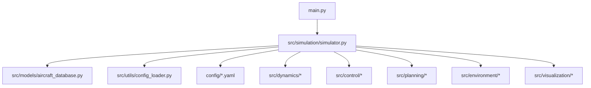
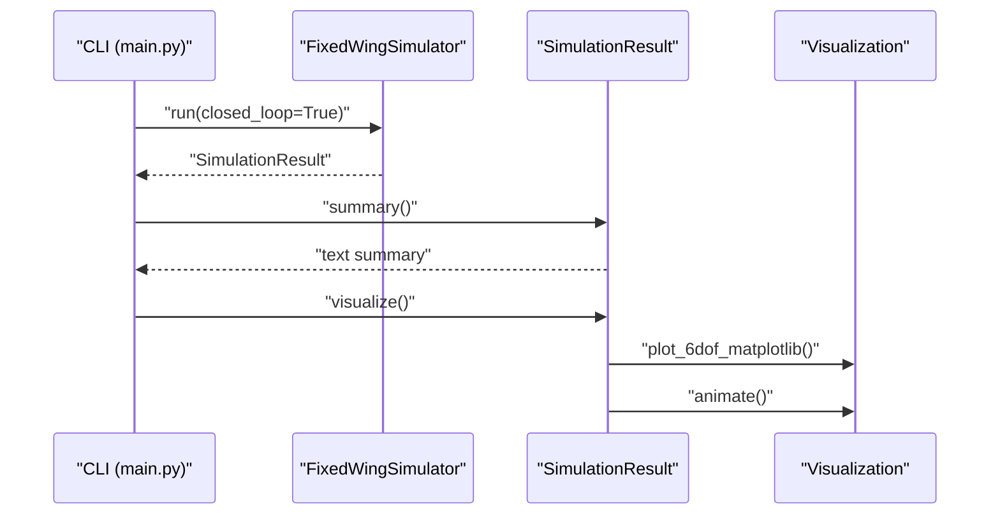

# Getting Started

<cite>
**Referenced Files in This Document**
- [README.md](file://README.md)
- [requirements.txt](file://requirements.txt)
- [setup.py](file://setup.py)
- [main.py](file://main.py)
- [src/simulation/simulator.py](file://src/simulation/simulator.py)
- [src/utils/config_loader.py](file://src/utils/config_loader.py)
- [src/models/aircraft_database.py](file://src/models/aircraft_database.py)
- [config/aircraft.yaml](file://config/aircraft.yaml)
- [config/simulation.yaml](file://config/simulation.yaml)
- [config/trajectory.yaml](file://config/trajectory.yaml)
- [config/control_params.yaml](file://config/control_params.yaml)
- [examples/example_1_linear_response.py](file://examples/example_1_linear_response.py)
- [examples/example_2_nonlinear_dynamics.py](file://examples/example_2_nonlinear_dynamics.py)
</cite>

## Table of Contents
1. [Introduction](#introduction)
2. [Project Structure](#project-structure)
3. [System Requirements](#system-requirements)
4. [Installation](#installation)
5. [Environment Setup](#environment-setup)
6. [Quick Start](#quick-start)
7. [Understanding Configuration Files](#understanding-configuration-files)
8. [Interpreting Results](#interpreting-results)
9. [Troubleshooting](#troubleshooting)
10. [Verification Checklist](#verification-checklist)
11. [Next Steps](#next-steps)

## Introduction
FixedWingSimulator is a professional fixed-wing UAV simulation and control platform. It supports both linear and nonlinear dynamics, ArduPilot-compatible control layers, trajectory planning, and visualization. This guide helps you install the project, configure it, run your first simulations, and interpret the results.

## Project Structure
At a high level, the repository is organized as:
- src/: Core Python modules for simulation, dynamics, controls, planning, environment, visualization, and utilities
- config/: YAML configuration files for aircraft, simulation, trajectory, and control parameters
- examples/: Example scripts demonstrating linear and nonlinear analyses
- tests/: Unit/integration tests
- output/: Generated figures and CSV data from examples
- main.py: Command-line entry point to run simulations

**Diagram sources**
- [main.py](file://main.py#L1-L145)
- [src/simulation/simulator.py](file://src/simulation/simulator.py#L1-L200)
- [src/utils/config_loader.py](file://src/utils/config_loader.py#L1-L82)
- [src/models/aircraft_database.py](file://src/models/aircraft_database.py#L1-L183)
- [config/aircraft.yaml](file://config/aircraft.yaml#L1-L13)
- [config/simulation.yaml](file://config/simulation.yaml#L1-L30)
- [config/trajectory.yaml](file://config/trajectory.yaml#L1-L23)
- [config/control_params.yaml](file://config/control_params.yaml#L1-L45)

**Section sources**
- [main.py](file://main.py#L1-L145)
- [src/simulation/simulator.py](file://src/simulation/simulator.py#L1-L200)
- [src/utils/config_loader.py](file://src/utils/config_loader.py#L1-L82)
- [src/models/aircraft_database.py](file://src/models/aircraft_database.py#L1-L183)
- [config/aircraft.yaml](file://config/aircraft.yaml#L1-L13)
- [config/simulation.yaml](file://config/simulation.yaml#L1-L30)
- [config/trajectory.yaml](file://config/trajectory.yaml#L1-L23)
- [config/control_params.yaml](file://config/control_params.yaml#L1-L45)

## System Requirements
- Python version: 3.10 or newer
- Operating systems: Linux/macOS/Windows (tested on Ubuntu 20.04)
- Disk space: Minimal for code; additional space for generated figures and CSV outputs
- Optional: GUI support for visualization requires a working display server (not required for headless runs)

**Section sources**
- [setup.py](file://setup.py#L10-L10)
- [requirements.txt](file://requirements.txt#L1-L8)

## Installation
Follow these steps to install the project and its dependencies.

1) Install Python 3.10+ if not present.
2) Clone or download the repository to your local machine.
3) Navigate to the repository root directory.
4) Create a virtual environment (recommended):
   - python -m venv .venv
   - source .venv/bin/activate  (Linux/macOS) or .venv\Scripts\Activate.ps1 (Windows)
5) Install dependencies:
   - pip install -r requirements.txt
   - pip install -e .  (installs the package in development mode)

Notes:
- requirements.txt lists the minimal dependencies.
- setup.py defines the package metadata and install_requires; the package installs under the name fixed_wing_simulator.

**Section sources**
- [requirements.txt](file://requirements.txt#L1-L8)
- [setup.py](file://setup.py#L1-L23)

## Environment Setup
After installation, verify your environment:

- Confirm Python version meets the requirement (>= 3.10).
- Verify installed packages:
  - numpy, scipy, matplotlib, plotly, pyyaml, pandas
- Test import from the project root:
  - python -c "import fixed_wing_simulator; print('Import OK')"
- Optional: Run the CLI help to see available options:
  - python main.py --help

**Section sources**
- [setup.py](file://setup.py#L10-L18)
- [main.py](file://main.py#L32-L95)

## Quick Start
Run your first simulation using the command-line interface.

- Default simulation (TB2, AUTO mode, 30 s, minimum-snap trajectory):
  - python main.py
- Predator in FBW_B mode with wind for 60 seconds:
  - python main.py --aircraft Predator --mode FBW_B --duration 60 --wind SINE
- Linear 4-DOF analysis only:
  - python main.py --aircraft TB2 --analysis 4dof
- Disable visualization for batch runs:
  - python main.py --no-plot

What happens:
- The CLI parses arguments, constructs a FixedWingSimulator, runs either closed-loop or open-loop simulation, prints a summary, and optionally visualizes results.

**Section sources**
- [main.py](file://main.py#L6-L19)
- [main.py](file://main.py#L98-L141)
- [src/simulation/simulator.py](file://src/simulation/simulator.py#L115-L200)

## Understanding Configuration Files
The simulation reads configuration from YAML files located in the config/ directory. You can also pass CLI arguments to override runtime behavior.

Key configuration areas:
- Aircraft selection and overrides:
  - config/aircraft.yaml sets the default aircraft and allows parameter overrides.
- Simulation engine settings:
  - config/simulation.yaml controls time step, duration, integrator, initial conditions, wind, and logging.
- Trajectory planning:
  - config/trajectory.yaml defines trajectory type, average speed, yaw control mode, waypoints, and looping behavior.
- Control parameters (ArduPilot-compatible):
  - config/control_params.yaml holds gains and limits for attitude, rate, navigation, and TECS controllers.

How they are loaded:
- ConfigLoader merges defaults with your YAML files, enabling incremental customization.

**Section sources**
- [config/aircraft.yaml](file://config/aircraft.yaml#L1-L13)
- [config/simulation.yaml](file://config/simulation.yaml#L1-L30)
- [config/trajectory.yaml](file://config/trajectory.yaml#L1-L23)
- [config/control_params.yaml](file://config/control_params.yaml#L1-L45)
- [src/utils/config_loader.py](file://src/utils/config_loader.py#L10-L82)
- [src/simulation/simulator.py](file://src/simulation/simulator.py#L148-L153)

## Interpreting Results
Results are summarized and optionally visualized. The CLI prints a concise summary, and you can generate plots and animations.

- Summary fields include trim speed, duration/steps, mode, final altitude, final airspeed, and track position.
- Visualization includes 2D and 3D plots and animations when enabled.
- Example scripts demonstrate saving figures and CSV data to the output/ directory.

**Diagram sources**
- [main.py](file://main.py#L114-L141)
- [src/simulation/simulator.py](file://src/simulation/simulator.py#L59-L110)

**Section sources**
- [src/simulation/simulator.py](file://src/simulation/simulator.py#L78-L110)
- [examples/example_1_linear_response.py](file://examples/example_1_linear_response.py#L101-L105)
- [examples/example_2_nonlinear_dynamics.py](file://examples/example_2_nonlinear_dynamics.py#L149-L151)

## Troubleshooting
Common issues and fixes:

- Python version mismatch:
  - Symptom: Import errors or incompatible syntax.
  - Fix: Use Python 3.10+ and ensure your virtual environment is activated.

- Missing dependencies:
  - Symptom: ImportError for numpy/scipy/matplotlib/plotly/pyyaml/pandas.
  - Fix: Re-run pip install -r requirements.txt and reinstall the package with pip install -e .

- Module import errors when launching from project root:
  - Symptom: ModuleNotFoundError for src packages.
  - Fix: The CLI and modules insert src into sys.path; ensure you run from the repository root or adjust PYTHONPATH accordingly.

- No visualization window appears:
  - Symptom: Headless environments or missing GUI stack.
  - Fix: Use --no-plot for batch runs; or enable a display server. Visualization depends on matplotlib and optional animation libraries.

- Unknown aircraft name:
  - Symptom: ValueError indicating unknown aircraft.
  - Fix: Use --list-aircraft to see supported names, or select one from the database.

- Wind model not applied:
  - Symptom: Expected wind effects not visible.
  - Fix: Set --wind NONE|FIXED|SINE|RANDOMSINE on the CLI or configure wind_type in simulation.yaml.

- Trajectory not as expected:
  - Symptom: Waypoints or yaw behavior differ from expectations.
  - Fix: Adjust config/trajectory.yaml (type, waypoints, yaw_mode, loop) or pass --traj via CLI.

**Section sources**
- [main.py](file://main.py#L25-L26)
- [main.py](file://main.py#L101-L105)
- [src/simulation/simulator.py](file://src/simulation/simulator.py#L140-L141)
- [config/simulation.yaml](file://config/simulation.yaml#L22-L25)
- [config/trajectory.yaml](file://config/trajectory.yaml#L3-L10)

## Verification Checklist
After installation and environment setup, confirm everything works:

- [ ] Python version >= 3.10
- [ ] Virtual environment activated
- [ ] Dependencies installed (numpy, scipy, matplotlib, plotly, pyyaml, pandas)
- [ ] Package installed in editable mode
- [ ] CLI help displays without errors
- [ ] Default simulation runs and prints a summary
- [ ] Visualization windows appear (optional)
- [ ] Example scripts run and produce output files in output/

**Section sources**
- [requirements.txt](file://requirements.txt#L1-L8)
- [setup.py](file://setup.py#L19-L21)
- [main.py](file://main.py#L32-L95)
- [examples/example_1_linear_response.py](file://examples/example_1_linear_response.py#L86-L105)
- [examples/example_2_nonlinear_dynamics.py](file://examples/example_2_nonlinear_dynamics.py#L124-L151)

## Next Steps
- Explore example scripts to learn advanced workflows:
  - Linear 4-DOF analysis and closed-loop PID comparisons
  - Nonlinear 6-DOF trim and step response
- Customize configurations:
  - Modify aircraft parameters, simulation settings, trajectory waypoints, and control gains
- Extend or integrate:
  - Add new aircraft entries to the database
  - Integrate external tools for post-processing or visualization

**Section sources**
- [examples/example_1_linear_response.py](file://examples/example_1_linear_response.py#L1-L206)
- [examples/example_2_nonlinear_dynamics.py](file://examples/example_2_nonlinear_dynamics.py#L1-L215)
- [src/models/aircraft_database.py](file://src/models/aircraft_database.py#L29-L133)
- [config/aircraft.yaml](file://config/aircraft.yaml#L1-L13)
- [config/simulation.yaml](file://config/simulation.yaml#L1-L30)
- [config/trajectory.yaml](file://config/trajectory.yaml#L1-L23)
- [config/control_params.yaml](file://config/control_params.yaml#L1-L45)