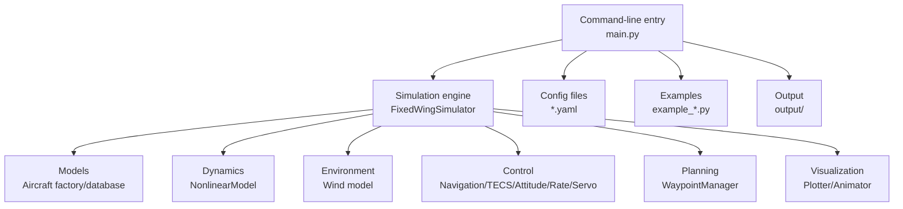
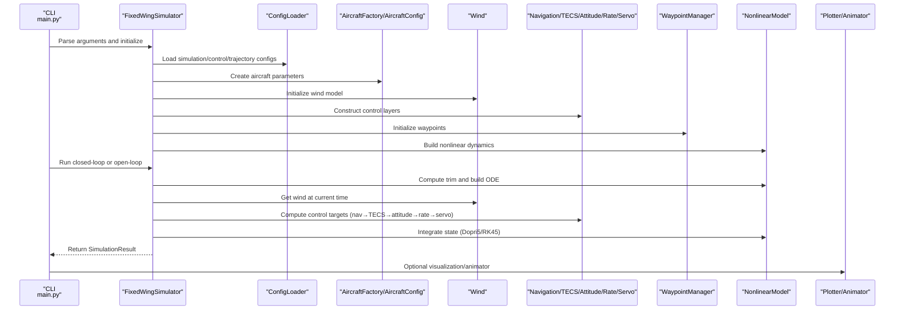
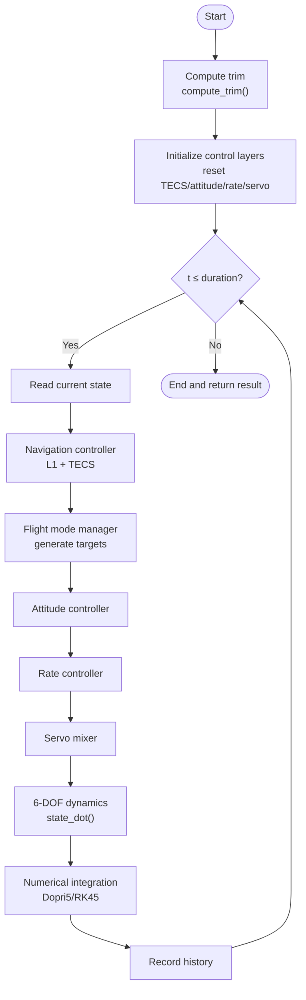
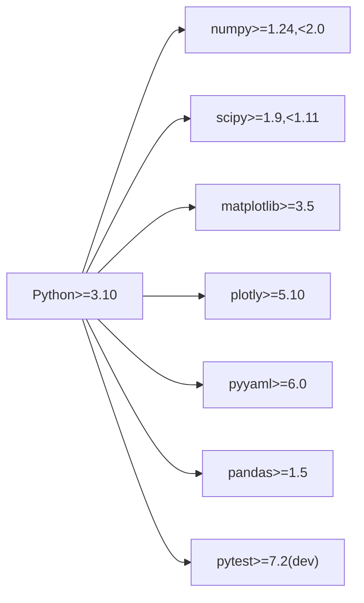

# Project Overview

<cite>
**Referenced Files in This Document**
- [README.md](file://README.md)
- [main.py](file://main.py)
- [requirements.txt](file://requirements.txt)
- [setup.py](file://setup.py)
- [config/aircraft.yaml](file://config/aircraft.yaml)
- [config/simulation.yaml](file://config/simulation.yaml)
- [config/control_params.yaml](file://config/control_params.yaml)
- [src/simulation/simulator.py](file://src/simulation/simulator.py)
- [src/models/aircraft_database.py](file://src/models/aircraft_database.py)
- [src/dynamics/nonlinear_model.py](file://src/dynamics/nonlinear_model.py)
- [src/control/ardupilot_compat.py](file://src/control/ardupilot_compat.py)
- [src/control/navigation_controller.py](file://src/control/navigation_controller.py)
- [src/environment/wind_model.py](file://src/environment/wind_model.py)
- [src/planning/waypoint_manager.py](file://src/planning/waypoint_manager.py)
- [examples/example_1_linear_response.py](file://examples/example_1_linear_response.py)
- [examples/example_2_nonlinear_dynamics.py](file://examples/example_2_nonlinear_dynamics.py)
</cite>

## Table of Contents
1. [Introduction](#introduction)
2. [Project Structure](#project-structure)
3. [Core Components](#core-components)
4. [Architecture Overview](#architecture-overview)
5. [Detailed Component Analysis](#detailed-component-analysis)
6. [Dependency Analysis](#dependency-analysis)
7. [Performance Considerations](#performance-considerations)
8. [Troubleshooting Guide](#troubleshooting-guide)
9. [Conclusion](#conclusion)
10. [Appendices](#appendices)

## Introduction
FixedWingSimulator is a professional-grade fixed-wing unmanned aerial vehicle (UAV) simulation and control platform designed for research, education, and engineering validation. It provides high-fidelity 6-degree-of-freedom (6-DOF) nonlinear dynamics, ArduPilot-compatible control systems, and trajectory planning capabilities. The platform targets aerospace engineers, researchers, and educators who require a configurable, extensible, and reproducible simulation environment for flight mechanics analysis, control algorithm development, and system integration testing.

Key capabilities:
- 6-DOF nonlinear flight dynamics with configurable numerical integration
- ArduPilot-compatible control chain (navigation, TECS, attitude, rate, servo mixing)
- Multi-aircraft parameter database with derived fields for consistent physics
- Wind modeling (static, sine, random sine)
- Trajectory planning (minimum snap/jerk) and waypoint management
- Visualization and batch-run support for automated analysis

## Project Structure
The project is organized into modular layers:
- Command-line entry point orchestrating the simulation lifecycle
- Simulation engine integrating models, controls, environment, planning, and visualization
- Dynamics subsystems (linear and nonlinear)
- Control subsystems mirroring ArduPilot’s layered control architecture
- Environment modeling (wind/atmosphere)
- Planning subsystem (waypoints and trajectories)
- Configuration and examples for quick start and reproducibility
- Output artifacts (CSV data and plots)

**Diagram sources**
- [main.py](file://main.py#L1-L145)
- [src/simulation/simulator.py](file://src/simulation/simulator.py#L1-L200)
- [src/models/aircraft_database.py](file://src/models/aircraft_database.py#L1-L183)
- [src/dynamics/nonlinear_model.py](file://src/dynamics/nonlinear_model.py#L1-L200)
- [src/environment/wind_model.py](file://src/environment/wind_model.py#L1-L113)
- [src/planning/waypoint_manager.py](file://src/planning/waypoint_manager.py#L1-L208)

**Section sources**
- [main.py](file://main.py#L1-L145)
- [config/aircraft.yaml](file://config/aircraft.yaml#L1-L13)
- [config/simulation.yaml](file://config/simulation.yaml#L1-L30)
- [config/control_params.yaml](file://config/control_params.yaml#L1-L45)

## Core Components
- Simulation engine: Orchestrates configuration loading, model instantiation, control loops, environment updates, and result packaging.
- Dynamics: Implements 6-DOF nonlinear equations of motion and optional 4-DOF linearized analysis.
- Control chain: ArduPilot-compatible navigation (L1), TECS (total energy control system), attitude/roll-pitch/yaw controllers, rate controllers, and servo mixer.
- Environment: Wind generator supporting static, sine, and random sine disturbances.
- Planning: Waypoint manager and trajectory generators (minimum snap/jerk).
- Visualization: Plotting and animation outputs for 2D/3D views.
- Configuration: Centralized YAML-based configuration for aircraft, simulation, and control parameters.

**Section sources**
- [src/simulation/simulator.py](file://src/simulation/simulator.py#L1-L200)
- [src/dynamics/nonlinear_model.py](file://src/dynamics/nonlinear_model.py#L1-L200)
- [src/control/ardupilot_compat.py](file://src/control/ardupilot_compat.py#L1-L130)
- [src/control/navigation_controller.py](file://src/control/navigation_controller.py#L1-L293)
- [src/environment/wind_model.py](file://src/environment/wind_model.py#L1-L113)
- [src/planning/waypoint_manager.py](file://src/planning/waypoint_manager.py#L1-L208)

## Architecture Overview
The simulation lifecycle integrates configuration, models, controls, environment, and planning into a cohesive pipeline. The sequence below maps the runtime flow from the CLI to the simulation engine and control layers.

**Diagram sources**
- [main.py](file://main.py#L98-L145)
- [src/simulation/simulator.py](file://src/simulation/simulator.py#L115-L200)
- [src/environment/wind_model.py](file://src/environment/wind_model.py#L18-L113)
- [src/control/navigation_controller.py](file://src/control/navigation_controller.py#L45-L293)
- [src/dynamics/nonlinear_model.py](file://src/dynamics/nonlinear_model.py#L104-L200)

## Detailed Component Analysis

### Simulation Engine and Execution Flow
- Modes:
  - Closed-loop: Full control chain computes targets, generates servo outputs, and advances 6-DOF dynamics.
  - Open-loop linear analysis: Modal analysis and impulse responses for 4-DOF linearized model.
- Automatic trim and cruise throttle update improve steady-state consistency.
- Results encapsulated in a result container with summary statistics and plotting helpers.

**Diagram sources**
- [src/simulation/simulator.py](file://src/simulation/simulator.py#L239-L567)
- [src/dynamics/nonlinear_model.py](file://src/dynamics/nonlinear_model.py#L132-L255)

**Section sources**
- [src/simulation/simulator.py](file://src/simulation/simulator.py#L115-L642)

### Multi-Aircraft Support and Parameter Database
- Built-in database includes seven representative fixed-wing UAVs with geometry, inertia, aerodynamic coefficients, and Mach number.
- Derived fields (e.g., calibrated airspeed, air density, dynamic pressure) injected for consistent physics across modules.
- Aircraft selection via CLI and YAML configuration.

**Section sources**
- [src/models/aircraft_database.py](file://src/models/aircraft_database.py#L29-L183)
- [config/aircraft.yaml](file://config/aircraft.yaml#L1-L13)

### 6-DOF Nonlinear Dynamics
- State vector includes body rates, Euler angles, and NED positions.
- Governing equations incorporate aerodynamic forces/moments, thrust, gravity, and kinematic relations.
- Numerical integration uses Dorminger–Prince (dopri5) for real-time loops; RK45 for batch analysis.

**Section sources**
- [src/dynamics/nonlinear_model.py](file://src/dynamics/nonlinear_model.py#L104-L386)

### ArduPilot-Compatible Control Chain
- Parameter container mirrors ArduPilot’s parameter naming and includes validation.
- Control hierarchy: navigation (L1 + TECS), attitude, rate, and servo mixing.
- Flight modes supported include MANUAL, STABILIZE, FBW_A, FBW_B, AUTO, LOITER, RTH.

**Section sources**
- [src/control/ardupilot_compat.py](file://src/control/ardupilot_compat.py#L17-L130)
- [src/control/navigation_controller.py](file://src/control/navigation_controller.py#L45-L293)

### Environment Modeling and Wind Field
- Wind types: NONE, FIXED, SINE, RANDOMSINE.
- Wind convention follows meteorological “from” direction; wind vectors expressed in NED frame.
- Configurable mean wind speed and direction; SINE/RANDOMSINE includes harmonic components.

**Section sources**
- [src/environment/wind_model.py](file://src/environment/wind_model.py#L18-L113)
- [config/simulation.yaml](file://config/simulation.yaml#L22-L25)

### Trajectory Planning and Waypoint Management
- WaypointManager handles NED coordinates and persistence.
- Trajectory types include minimum snap/jerk and hover; supports segment queries and remaining time estimation.
- Two operational modes: segment-based navigation around waypoints and trajectory tracking.

**Section sources**
- [src/planning/waypoint_manager.py](file://src/planning/waypoint_manager.py#L20-L208)
- [config/trajectory.yaml](file://config/trajectory.yaml#L1-L200)

### Example Scenarios and Practical Use Cases
- Linear response analysis: open-loop modal analysis and closed-loop PID comparisons.
- Nonlinear dynamics: open-loop aileron pulses and closed-loop stabilization.
- Additional examples demonstrate circuit flight, different aircraft comparisons, ArduPilot parameter tuning, and wind resistance effects.

**Section sources**
- [examples/example_1_linear_response.py](file://examples/example_1_linear_response.py#L1-L206)
- [examples/example_2_nonlinear_dynamics.py](file://examples/example_2_nonlinear_dynamics.py#L1-L215)

## Dependency Analysis
- Python version requirement: Python >= 3.10
- Core dependencies: NumPy, SciPy, Matplotlib, Plotly, PyYAML, Pandas
- Optional development dependency: pytest

**Diagram sources**
- [setup.py](file://setup.py#L11-L21)
- [requirements.txt](file://requirements.txt#L1-L8)

**Section sources**
- [setup.py](file://setup.py#L1-L23)
- [requirements.txt](file://requirements.txt#L1-L8)

## Performance Considerations
- Numerical integration: Real-time loops use adaptive-step dopri5; batch runs can switch to RK45; adjust absolute/relative tolerances as needed.
- Control integrators: Rate/attitude controllers include integral action; conservative tuning reduces limit cycles.
- Wind computations: SINE/RANDOMSINE wind introduces harmonic components; tune frequency/phase/amplitude for desired disturbance characteristics.
- Visualization: Use Agg backend for headless batch rendering; interactive windows only when necessary.

[No sources needed since this section provides general guidance]

## Troubleshooting Guide
- Aircraft name errors: Verify the name exists in the database or check the aircraft configuration.
- Wind type invalid: Ensure wind_type is one of NONE, FIXED, SINE, RANDOMSINE.
- Trajectory construction failures: Provide at least two waypoints; ensure closure for looped trajectories.
- Control parameter bounds: ArduPilot parameter container validates ranges; address warnings by adjusting values.
- Numerical integration issues: Validate inputs (density, aerodynamics, wind); reduce time step or tighten tolerances.

**Section sources**
- [src/simulation/simulator.py](file://src/simulation/simulator.py#L140-L141)
- [src/environment/wind_model.py](file://src/environment/wind_model.py#L39-L41)
- [src/planning/waypoint_manager.py](file://src/planning/waypoint_manager.py#L139-L140)
- [src/control/ardupilot_compat.py](file://src/control/ardupilot_compat.py#L104-L129)

## Conclusion
FixedWingSimulator offers a modular, configurable, and extensible framework for fixed-wing UAV simulation. Its combination of 6-DOF nonlinear dynamics, ArduPilot-compatible control chain, multi-aircraft parameter database, wind modeling, trajectory planning, and visualization enables rapid prototyping, control validation, and educational demonstrations. The project balances accessibility for newcomers with sufficient depth for advanced users.

[No sources needed since this section summarizes without analyzing specific files]

## Appendices

### Quick Start and Common Commands
- Default run: TB2 in AUTO mode with a minimum-snap trajectory for 30 seconds.
- Customize aircraft, mode, duration, wind, and trajectory via CLI arguments.
- Batch runs: disable visualization for parameter sweeps.
- List available aircraft: use the dedicated CLI flag.

**Section sources**
- [main.py](file://main.py#L6-L18)
- [main.py](file://main.py#L98-L145)

### Installation Prerequisites and System Requirements
- Python: >= 3.10
- Dependencies: numpy, scipy, matplotlib, plotly, pyyaml, pandas
- Optional: pytest for development/testing

**Section sources**
- [requirements.txt](file://requirements.txt#L1-L8)
- [setup.py](file://setup.py#L10-L18)

### Configuration Overview
- Aircraft configuration: select aircraft and optionally override parameters.
- Simulation configuration: time step, duration, integrator, initial conditions, wind, logging.
- Control parameters: ArduPilot-compatible parameters and TECS settings.

**Section sources**
- [config/aircraft.yaml](file://config/aircraft.yaml#L1-L13)
- [config/simulation.yaml](file://config/simulation.yaml#L1-L30)
- [config/control_params.yaml](file://config/control_params.yaml#L1-L45)