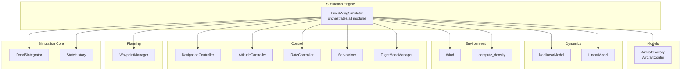
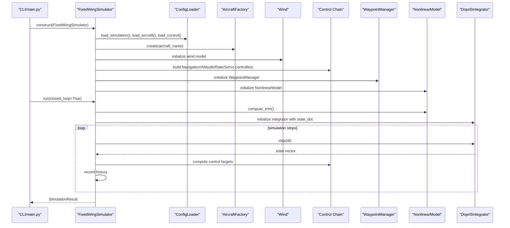
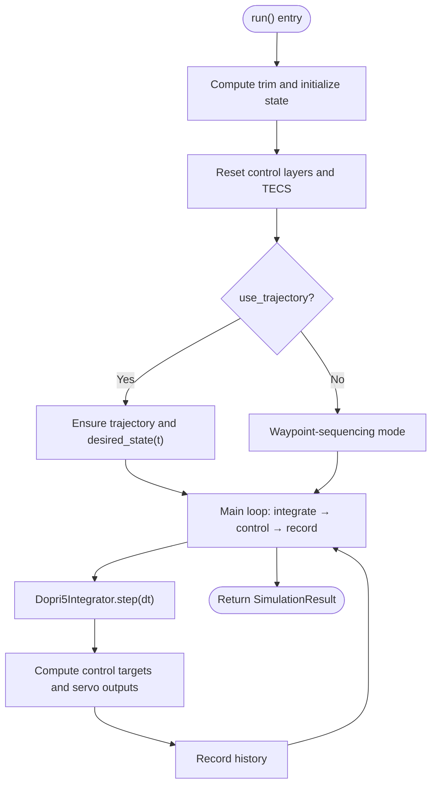
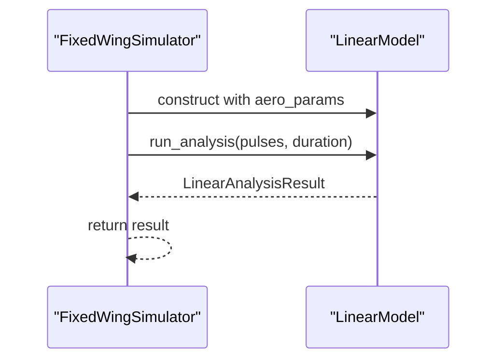
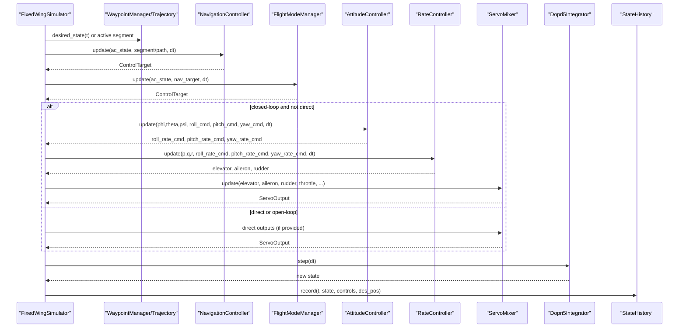
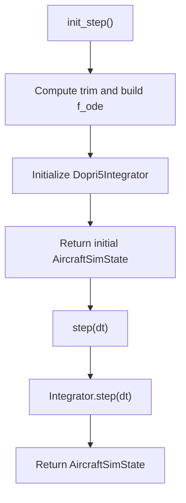
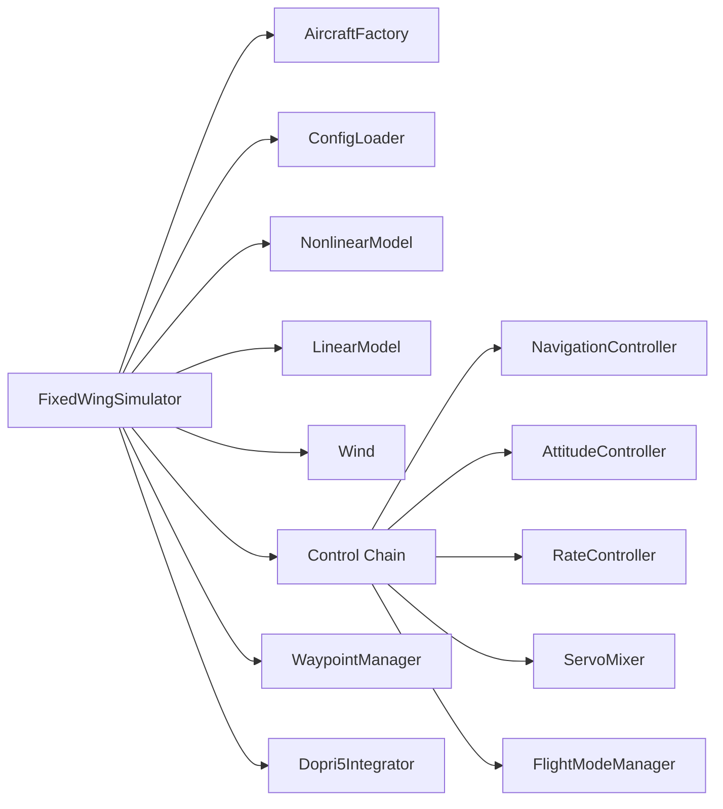

# FixedWingSimulator Main Class

<cite>
**Referenced Files in This Document**
- [simulator.py](file://src/simulation/simulator.py)
- [flight_mode_manager.py](file://src/control/flight_mode_manager.py)
- [waypoint_manager.py](file://src/planning/waypoint_manager.py)
- [aircraft_factory.py](file://src/models/aircraft_factory.py)
- [config_loader.py](file://src/utils/config_loader.py)
- [simulation.yaml](file://config/simulation.yaml)
- [aircraft.yaml](file://config/aircraft.yaml)
- [control_params.yaml](file://config/control_params.yaml)
- [trajectory.yaml](file://config/trajectory.yaml)
- [main.py](file://main.py)
</cite>

## Table of Contents
1. [Introduction](#introduction)
2. [Project Structure](#project-structure)
3. [Core Components](#core-components)
4. [Architecture Overview](#architecture-overview)
5. [Detailed Component Analysis](#detailed-component-analysis)
6. [Dependency Analysis](#dependency-analysis)
7. [Performance Considerations](#performance-considerations)
8. [Troubleshooting Guide](#troubleshooting-guide)
9. [Conclusion](#conclusion)
10. [Appendices](#appendices)

## Introduction
This document provides comprehensive documentation for the FixedWingSimulator main class, focusing on its architecture, initialization parameters, configuration management, and operational modes. It explains how the simulator orchestrates aircraft models, environment, control systems, planning, and numerical integration to deliver both closed-loop real-time simulations and open-loop linear analysis. It also documents the run() method’s control orchestration, trajectory tracking, and waypoint sequencing, and covers the step-by-step simulation API for external integration. Practical examples, performance considerations, parameter validation, and troubleshooting guidance are included to support both learning and production usage.

## Project Structure
The FixedWingSimulator resides in the simulation module and coordinates multiple subsystems:
- Models: aircraft selection and parameters via AircraftFactory and AircraftConfig
- Dynamics: nonlinear 6-DOF model and linear 4-DOF model for analysis
- Environment: wind and atmospheric density models
- Control: five-layer ArduPilot-compatible control chain (navigation, attitude, rate, servo mixer)
- Planning: waypoint management and polynomial trajectory builders
- Simulation: numerical integrator and state history recording
- Utilities: configuration loader and math utilities

**Diagram sources**
- [simulator.py](file://src/simulation/simulator.py#L115-L642)
- [aircraft_factory.py](file://src/models/aircraft_factory.py#L39-L75)
- [flight_mode_manager.py](file://src/control/flight_mode_manager.py#L115-L298)
- [waypoint_manager.py](file://src/planning/waypoint_manager.py#L20-L208)

**Section sources**
- [simulator.py](file://src/simulation/simulator.py#L1-L642)

## Core Components
- FixedWingSimulator: central orchestrator managing configuration, aircraft, environment, control, planning, and integration.
- SimulationResult: result container wrapping StateHistory and offering summary and visualization helpers.
- AircraftFactory/AircraftConfig: aircraft parameter sourcing and merging.
- WaypointManager: waypoint storage, trajectory construction, and active segment access.
- FlightModeManager: ArduPilot-compatible flight modes and control target generation.
- Control chain: NavigationController, AttitudeController, RateController, ServoMixer.
- Integrator: Dopri5Integrator for real-time ODE integration.
- ConfigLoader: merges YAML configurations for aircraft, simulation, control, and trajectory.

Key initialization parameters:
- aircraft_name: selects aircraft from the database
- config_dir: path to config directory
- dt: simulation time step (seconds)
- duration: total simulation duration (seconds)
- initial_mode: starting flight mode (string or enum)
- wind_type: wind model selector
- traj_type: trajectory builder type

Configuration management:
- Aircraft selection via aircraft.yaml and AircraftFactory
- Simulation parameters via simulation.yaml (time step, duration, integrator, wind, logging)
- Control parameters via control_params.yaml (ArduPilot-compatible)
- Trajectory parameters via trajectory.yaml and WaypointManager

**Section sources**
- [simulator.py](file://src/simulation/simulator.py#L115-L237)
- [aircraft_factory.py](file://src/models/aircraft_factory.py#L39-L75)
- [config_loader.py](file://src/utils/config_loader.py#L59-L82)
- [simulation.yaml](file://config/simulation.yaml#L1-L30)
- [aircraft.yaml](file://config/aircraft.yaml#L1-L13)
- [control_params.yaml](file://config/control_params.yaml#L1-L45)
- [trajectory.yaml](file://config/trajectory.yaml#L1-L23)

## Architecture Overview
The FixedWingSimulator composes subsystems and exposes two primary modes:
- Closed-loop real-time simulation: integrates the nonlinear 6-DOF dynamics with the full ArduPilot control chain, computing control targets per step and stepping the integrator.
- Open-loop linear analysis: runs a 4-DOF linear model with predefined or custom excitation pulses.

**Diagram sources**
- [main.py](file://main.py#L98-L145)
- [simulator.py](file://src/simulation/simulator.py#L130-L567)
- [config_loader.py](file://src/utils/config_loader.py#L62-L82)
- [aircraft_factory.py](file://src/models/aircraft_factory.py#L42-L75)

## Detailed Component Analysis

### FixedWingSimulator Initialization and Configuration
- Aircraft selection and parameters:
  - Uses AircraftFactory.create(aircraft_name) to fetch merged parameters.
  - Validates aircraft_name against the database.
- Configuration loading:
  - Loads simulation.yaml defaults and merges user-provided overrides.
  - Loads control_params.yaml for ArduPilot-compatible parameters and validates them.
  - Initializes Wind with wind_type, wind_speed, and wind_direction_deg from simulation.yaml or constructor override.
- Control system setup:
  - FlightModeManager initialized with initial_mode, cruise_speed, and cruise_alt.
  - NavigationController configured with L1 parameters and TECS parameters loaded from control_params.yaml (with sensible defaults).
  - AttitudeController, RateController, and ServoMixer initialized with dt.
- Planning:
  - WaypointManager initialized with traj_type and average_speed from control parameters.
  - Trajectory is not auto-loaded; users must add waypoints or load from trajectory.yaml prior to run().

Initialization validation:
- Unknown aircraft raises ValueError.
- Missing control_params.yaml is handled gracefully by constructing default ArdupilotParams and validating.

**Section sources**
- [simulator.py](file://src/simulation/simulator.py#L130-L237)
- [aircraft_factory.py](file://src/models/aircraft_factory.py#L42-L75)
- [config_loader.py](file://src/utils/config_loader.py#L62-L82)
- [simulation.yaml](file://config/simulation.yaml#L22-L26)
- [control_params.yaml](file://config/control_params.yaml#L1-L45)

### Simulation Modes

#### Closed-loop Real-Time Simulation
- Purpose: full ArduPilot-compatible control system integrated with 6-DOF nonlinear dynamics.
- Key behaviors:
  - Computes trim and initializes state vector at trim conditions.
  - Resets control-layer integrators and TECS with initial state.
  - Builds a dynamic ODE function f_ode that depends on the current control inputs.
  - Supports two navigation modes:
    - Trajectory mode: builds a polynomial trajectory from waypoints and tracks desired states.
    - Circuit mode: waypoint-sequencing without polynomial trajectory; switches waypoints based on horizontal distance and cooldown.
  - Control orchestration:
    - FlightModeManager produces ControlTarget from navigation suggestions.
    - AttitudeController and RateController compute actuator commands.
    - ServoMixer converts rate commands to normalized servo outputs and adds trim biases.
  - Integration:
    - Uses Dopri5Integrator to advance the state vector.
    - Records state history with control surface deflections and desired positions.

**Diagram sources**
- [simulator.py](file://src/simulation/simulator.py#L239-L567)

**Section sources**
- [simulator.py](file://src/simulation/simulator.py#L239-L567)

#### Open-loop Linear Analysis Mode
- Purpose: backward-compatible 4-DOF linear analysis with configurable excitation pulses.
- Behavior:
  - Constructs LinearModel with aircraft parameters.
  - Executes run_analysis() with default or provided pulses and duration.
  - Returns LinearAnalysisResult for post-processing and plotting.

**Diagram sources**
- [simulator.py](file://src/simulation/simulator.py#L571-L597)

**Section sources**
- [simulator.py](file://src/simulation/simulator.py#L571-L597)

### run() Method: Operation, Trajectory Tracking, and Waypoint Sequencing
- Pre-run:
  - Computes trim and initializes state vector at trim conditions.
  - Resets control-layer integrators and TECS with initial state.
  - Auto-adjusts TECS cruise throttle to match trim drag for realistic steady-flight.
- Trajectory tracking:
  - If trajectory is available, desired_state(t) provides position, velocity, and yaw targets.
  - Desired altitude is clamped to active segment bounds to avoid unrealistic dives.
  - NavigationController computes lateral/vertical commands; TECS manages energy and throttle.
- Waypoint sequencing (circuit mode):
  - Maintains current target waypoint index and previous waypoint for proper L1 tracking.
  - Switches to next waypoint when within wp_switch_dist or when passing the waypoint along the leg.
  - Enforces a minimum cooldown to prevent oscillatory switching.
- Control orchestration:
  - FlightModeManager selects appropriate ControlTarget based on mode.
  - AttitudeController and RateController convert targets to actuator commands.
  - ServoMixer normalizes and trims outputs; converts to radians for dynamics.
- Integration and recording:
  - Integrator advances the state vector.
  - History records time, state, control surfaces, and desired positions.

**Diagram sources**
- [simulator.py](file://src/simulation/simulator.py#L410-L567)
- [flight_mode_manager.py](file://src/control/flight_mode_manager.py#L173-L298)
- [waypoint_manager.py](file://src/planning/waypoint_manager.py#L178-L208)

**Section sources**
- [simulator.py](file://src/simulation/simulator.py#L239-L567)
- [flight_mode_manager.py](file://src/control/flight_mode_manager.py#L115-L298)
- [waypoint_manager.py](file://src/planning/waypoint_manager.py#L178-L208)

### Step-by-Step Simulation API for External Integration
- init_step():
  - Computes trim and initializes the internal ODE function with current control state.
  - Returns initial AircraftSimState for external monitoring.
- step(dt: Optional[float] = None):
  - Advances the simulation by one step using the previously constructed integrator.
  - Returns the updated AircraftSimState.
- Integration error handling:
  - Catches RuntimeError during integration and stops the loop with a diagnostic message.

**Diagram sources**
- [simulator.py](file://src/simulation/simulator.py#L602-L642)

**Section sources**
- [simulator.py](file://src/simulation/simulator.py#L602-L642)

### Practical Examples of Simulation Setup, Execution, and Interpretation
- Command-line usage:
  - Default closed-loop AUTO mode with TB2, 30 s, minimum-snap trajectory.
  - Predator in FBW_B mode with wind for 60 s.
  - 4-DOF linear analysis for TB2.
  - Listing available aircraft.
- Example scenarios:
  - Linear response analysis: excitation pulses and response visualization.
  - Nonlinear dynamics: closed-loop trajectory tracking with wind.
  - Trajectory tracking: mission waypoints and desired-state tracking.
  - Circuit flight: waypoint sequencing without polynomial trajectory.
  - Different aircraft: compare performance across aircraft variants.
  - ArduPilot parameters: export aircraft + control parameters to .param format.
  - Wind resistance: analyze effects of wind models on trajectory tracking.

Execution flow:
- Parse arguments and construct FixedWingSimulator with selected aircraft, mode, duration, dt, wind, and trajectory type.
- Choose run() for closed-loop simulation or run_linear_analysis() for open-loop analysis.
- Print summary and visualize results (optional).

**Section sources**
- [main.py](file://main.py#L32-L145)
- [simulator.py](file://src/simulation/simulator.py#L571-L597)

## Dependency Analysis
The FixedWingSimulator depends on tightly coupled subsystems. The control chain is ArduPilot-compatible and integrates with the planning and dynamics modules. Configuration is centralized via ConfigLoader and YAML files.

**Diagram sources**
- [simulator.py](file://src/simulation/simulator.py#L33-L51)
- [flight_mode_manager.py](file://src/control/flight_mode_manager.py#L115-L138)
- [waypoint_manager.py](file://src/planning/waypoint_manager.py#L20-L46)

**Section sources**
- [simulator.py](file://src/simulation/simulator.py#L33-L51)

## Performance Considerations
- Time step and integrator:
  - dt controls accuracy and computational cost; smaller dt increases fidelity but costs more CPU.
  - dopri5 is suitable for real-time closed-loop; rk45 is recommended for batch open-loop analysis.
- Control loop sampling:
  - Keep dt aligned with control tuning (PID gains) for stability and responsiveness.
- Trajectory computation:
  - Minimum snap/jerk trajectories require solving boundary-value problems; pre-build and reuse when possible.
- Wind modeling:
  - Sine and random sine wind models introduce periodicity and noise; tune wind parameters to match mission conditions.
- Visualization overhead:
  - Disable visualization for batch runs to reduce I/O and rendering costs.

[No sources needed since this section provides general guidance]

## Troubleshooting Guide
Common initialization issues and resolutions:
- Unknown aircraft name:
  - Ensure aircraft_name exists in the database; otherwise, a ValueError is raised.
- Missing control parameters:
  - If control_params.yaml is absent, defaults are used; validate after creation.
- No waypoints defined:
  - Trajectory mode requires at least two waypoints; otherwise, a ValueError is raised.
  - Circuit mode can fly straight if no waypoints are provided; configure waypoints or use trajectory mode.
- Integration errors:
  - Runtime errors during integration indicate numerical instability or invalid control inputs; reduce dt or adjust control gains.
- Cruise throttle mismatch:
  - Simulator auto-adjusts TECS cruise throttle to match trim; verify aircraft parameters and environment density.

Validation and diagnostics:
- Parameter validation occurs during ArdupilotParams construction and validation.
- WaypointManager enforces minimum waypoint count for trajectory building.
- FixedWingSimulator prints informative messages during mode transitions and waypoint switches.

**Section sources**
- [simulator.py](file://src/simulation/simulator.py#L140-L141)
- [simulator.py](file://src/simulation/simulator.py#L558-L562)
- [waypoint_manager.py](file://src/planning/waypoint_manager.py#L139-L140)

## Conclusion
The FixedWingSimulator provides a robust, modular framework for fixed-wing UAV simulation. Its dual-mode operation supports both closed-loop real-time control and open-loop linear analysis. The class orchestrates aircraft parameters, environment models, a full ArduPilot-compatible control stack, and trajectory planning, delivering accurate 6-DOF dynamics and convenient APIs for both scripted runs and external integration. Proper configuration, parameter validation, and understanding of the control modes enable reliable simulations and insightful analyses.

[No sources needed since this section summarizes without analyzing specific files]

## Appendices

### Configuration Reference
- simulation.yaml: time step, duration, integrator, initial conditions, wind settings, logging.
- aircraft.yaml: aircraft selection and optional parameter overrides.
- control_params.yaml: ArduPilot-compatible control parameters and TECS tuning.
- trajectory.yaml: trajectory type, average speed, yaw mode, waypoints, and loop setting.

**Section sources**
- [simulation.yaml](file://config/simulation.yaml#L1-L30)
- [aircraft.yaml](file://config/aircraft.yaml#L1-L13)
- [control_params.yaml](file://config/control_params.yaml#L1-L45)
- [trajectory.yaml](file://config/trajectory.yaml#L1-L23)