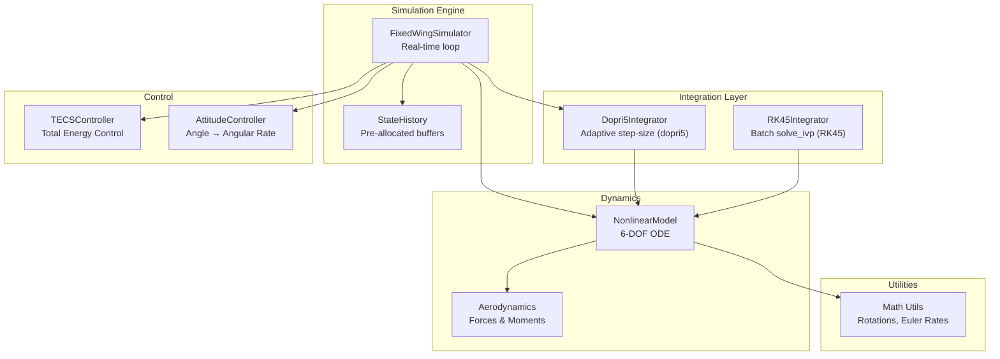
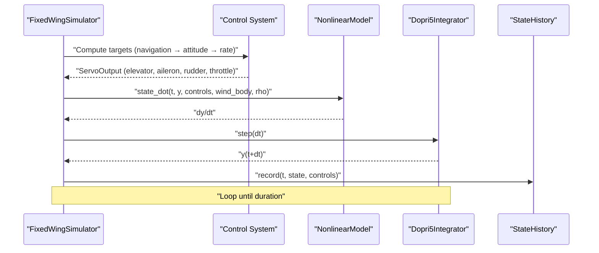
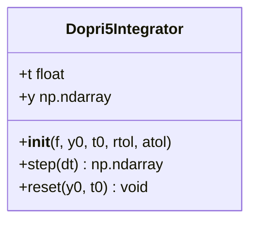
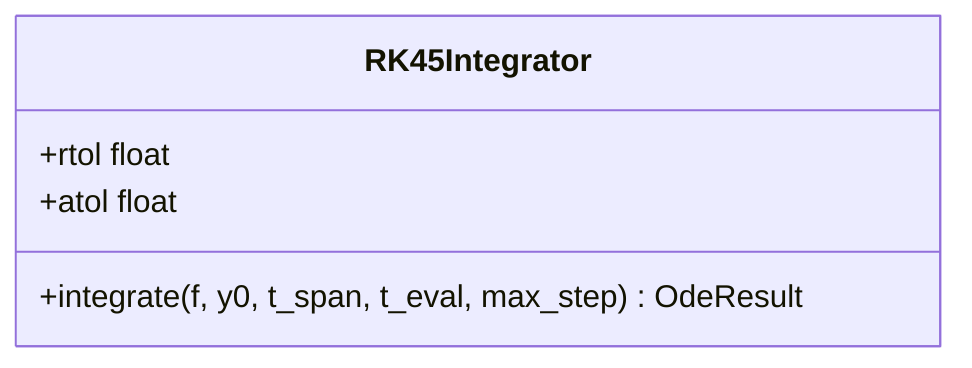
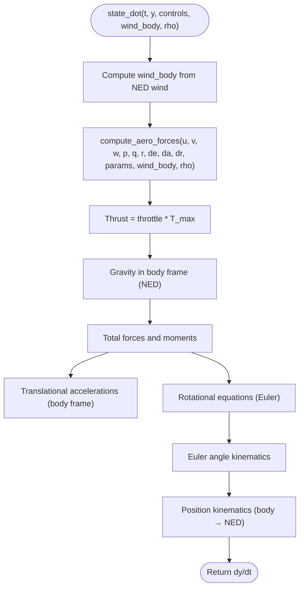
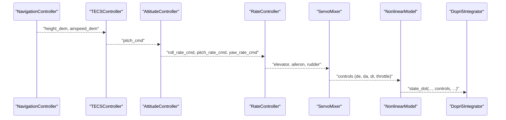
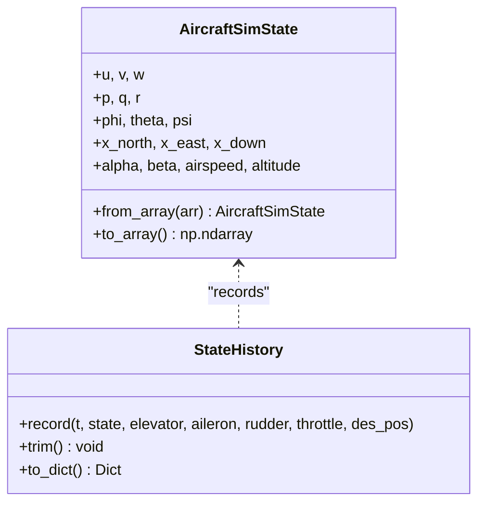
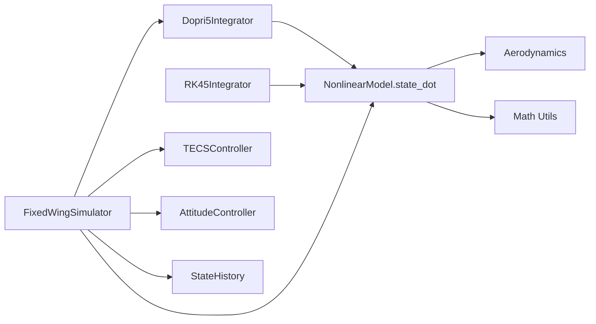

# Numerical Integration

<cite>
**Referenced Files in This Document**
- [integrator.py](file://src/simulation/integrator.py)
- [simulator.py](file://src/simulation/simulator.py)
- [state_manager.py](file://src/simulation/state_manager.py)
- [nonlinear_model.py](file://src/dynamics/nonlinear_model.py)
- [linear_model.py](file://src/dynamics/linear_model.py)
- [aerodynamics.py](file://src/dynamics/aerodynamics.py)
- [tecs_controller.py](file://src/control/tecs_controller.py)
- [attitude_controller.py](file://src/control/attitude_controller.py)
- [math_utils.py](file://src/utils/math_utils.py)
- [simulation.yaml](file://config/simulation.yaml)
- [control_params.yaml](file://config/control_params.yaml)
- [test_integration.py](file://tests/test_integration.py)
</cite>

## Table of Contents
1. [Introduction](#introduction)
2. [Project Structure](#project-structure)
3. [Core Components](#core-components)
4. [Architecture Overview](#architecture-overview)
5. [Detailed Component Analysis](#detailed-component-analysis)
6. [Dependency Analysis](#dependency-analysis)
7. [Performance Considerations](#performance-considerations)
8. [Troubleshooting Guide](#troubleshooting-guide)
9. [Conclusion](#conclusion)
10. [Appendices](#appendices)

## Introduction
This document explains the numerical integration system powering the fixed-wing simulation engine. It focuses on the Dormand-Prince 5th-order Runge-Kutta integrator (DOPRI5) used in real-time closed-loop simulation, the adaptive step-size control mechanism, and the accuracy tolerances. It also documents the integration interface, solver selection criteria, and stability considerations for different simulation scenarios. The guide covers how the control system dynamics integrate with the aircraft’s nonlinear equations of motion, provides examples of integration parameter tuning, convergence analysis, and performance optimization, and addresses common integration issues such as stiffness handling, step-size adaptation, and numerical stability.

## Project Structure
The integration system is centered around a lightweight wrapper for the DOPRI5 integrator and a batch RK45 integrator for offline analysis. The simulation orchestrator composes the nonlinear dynamics ODE with the control system and integrates the resulting ODE in real time.

**Diagram sources**
- [integrator.py](file://src/simulation/integrator.py#L17-L108)
- [simulator.py](file://src/simulation/simulator.py#L115-L642)
- [nonlinear_model.py](file://src/dynamics/nonlinear_model.py#L104-L386)
- [aerodynamics.py](file://src/dynamics/aerodynamics.py#L35-L148)
- [tecs_controller.py](file://src/control/tecs_controller.py#L50-L647)
- [attitude_controller.py](file://src/control/attitude_controller.py#L33-L134)
- [math_utils.py](file://src/utils/math_utils.py#L43-L124)

**Section sources**
- [integrator.py](file://src/simulation/integrator.py#L1-L108)
- [simulator.py](file://src/simulation/simulator.py#L1-L642)

## Core Components
- DOPRI5 Integrator: A thin wrapper around scipy.integrate.ode using the dopri5 solver. It exposes a single-step API while internally adapting step size to satisfy relative and absolute tolerances.
- RK45 Integrator: A batch solver using scipy.integrate.solve_ivp with RK45, suitable for offline analysis where the entire solution history is required.
- Simulation Orchestrator: Builds the closed-loop ODE by combining the nonlinear dynamics with the control system and advances the state in discrete time steps.
- State History: Efficient pre-allocated buffers to record simulation data for post-processing and visualization.

**Section sources**
- [integrator.py](file://src/simulation/integrator.py#L17-L108)
- [simulator.py](file://src/simulation/simulator.py#L239-L567)
- [state_manager.py](file://src/simulation/state_manager.py#L95-L193)

## Architecture Overview
The real-time simulation loop composes the nonlinear ODE with the control system and integrates it using DOPRI5. The control system computes control surface deflections and throttle commands based on desired targets and measured states, which are injected into the ODE at each step.

**Diagram sources**
- [simulator.py](file://src/simulation/simulator.py#L329-L567)
- [nonlinear_model.py](file://src/dynamics/nonlinear_model.py#L160-L256)
- [integrator.py](file://src/simulation/integrator.py#L50-L71)

## Detailed Component Analysis

### DOPRI5 Integrator
- Purpose: Real-time single-step integration with adaptive step size controlled by relative and absolute tolerances.
- Accuracy tolerances: Defaults to rtol=1e-6 and atol=1e-6; configurable at construction.
- Step behavior: Advances by a fixed dt and internally adapts step size to meet tolerances; raises an error on failure.
- Reset capability: Reinitialize the integrator with a new initial state and time.

**Diagram sources**
- [integrator.py](file://src/simulation/integrator.py#L17-L71)

**Section sources**
- [integrator.py](file://src/simulation/integrator.py#L17-L71)

### RK45 Integrator
- Purpose: Batch integration for offline analysis using scipy.integrate.solve_ivp with RK45.
- Accuracy tolerances: Defaults to rtol=1e-6 and atol=1e-6; configurable at construction.
- Additional options: max_step to bound step size for batch runs.

**Diagram sources**
- [integrator.py](file://src/simulation/integrator.py#L73-L108)

**Section sources**
- [integrator.py](file://src/simulation/integrator.py#L73-L108)

### Nonlinear Dynamics ODE
- State vector: [u, v, w, p, q, r, phi, theta, psi, x_N, x_E, x_D] (12-D NED).
- Forces and moments: Computed from aerodynamic coefficients and control inputs; gravity and thrust included.
- Wind handling: Optional wind vector transformed into body frame using Euler rotation matrices.
- Density: Air density computed from altitude using an atmospheric model.

**Diagram sources**
- [nonlinear_model.py](file://src/dynamics/nonlinear_model.py#L160-L256)
- [aerodynamics.py](file://src/dynamics/aerodynamics.py#L35-L148)
- [math_utils.py](file://src/utils/math_utils.py#L43-L101)

**Section sources**
- [nonlinear_model.py](file://src/dynamics/nonlinear_model.py#L104-L386)
- [aerodynamics.py](file://src/dynamics/aerodynamics.py#L35-L148)
- [math_utils.py](file://src/utils/math_utils.py#L43-L101)

### Control System Integration
- TECS: Computes throttle and pitch commands based on height and airspeed demands, with underspeed and bad descent detection.
- Attitude Controller: Converts desired Euler angles into desired angular rate commands.
- Rate Controller: Converts desired angular rates into control surface deflections (not shown here).
- Servo Mixer: Converts control outputs into normalized actuator deflections and throttle.

**Diagram sources**
- [tecs_controller.py](file://src/control/tecs_controller.py#L247-L315)
- [attitude_controller.py](file://src/control/attitude_controller.py#L81-L122)
- [simulator.py](file://src/simulation/simulator.py#L499-L540)
- [nonlinear_model.py](file://src/dynamics/nonlinear_model.py#L160-L256)

**Section sources**
- [tecs_controller.py](file://src/control/tecs_controller.py#L50-L647)
- [attitude_controller.py](file://src/control/attitude_controller.py#L33-L134)
- [simulator.py](file://src/simulation/simulator.py#L499-L540)

### State Management
- AircraftSimState: Holds the 12-D state vector plus derived quantities (alpha, beta, airspeed, altitude).
- StateHistory: Pre-allocated NumPy arrays for efficient recording of time series data.

**Diagram sources**
- [state_manager.py](file://src/simulation/state_manager.py#L16-L193)

**Section sources**
- [state_manager.py](file://src/simulation/state_manager.py#L16-L193)

## Dependency Analysis
- Integrator selection:
  - DOPRI5: Used in the real-time run loop for closed-loop simulation.
  - RK45: Used for offline linear/nonlinear analysis via the batch simulate method.
- Coupling:
  - The simulation orchestrator builds a closure around the nonlinear ODE that captures current control inputs and environmental conditions (wind, density).
  - The control system updates at each step and feeds the ODE with the latest control surface deflections and throttle.

**Diagram sources**
- [integrator.py](file://src/simulation/integrator.py#L17-L108)
- [simulator.py](file://src/simulation/simulator.py#L329-L567)
- [nonlinear_model.py](file://src/dynamics/nonlinear_model.py#L160-L256)
- [aerodynamics.py](file://src/dynamics/aerodynamics.py#L35-L148)
- [math_utils.py](file://src/utils/math_utils.py#L43-L101)

**Section sources**
- [integrator.py](file://src/simulation/integrator.py#L17-L108)
- [simulator.py](file://src/simulation/simulator.py#L329-L567)
- [nonlinear_model.py](file://src/dynamics/nonlinear_model.py#L160-L256)

## Performance Considerations
- Adaptive step size: DOPRI5 adjusts step size to meet rtol/atol, reducing unnecessary small steps in smooth regions and allowing smaller steps near stiffness or discontinuities.
- Tolerances: Tighter tolerances improve accuracy but may reduce performance. Typical defaults are rtol=1e-6, atol=1e-6.
- Max step: For batch runs, max_step can bound step size to reduce computational overhead.
- Wind and density: Computing density from altitude adds minimal cost; wind transformations are constant-time matrix-vector multiplications.
- Control updates: The control system runs at the simulation step rate; keep control loops simple to avoid introducing delays.

[No sources needed since this section provides general guidance]

## Troubleshooting Guide
Common integration issues and remedies:
- Integration failure:
  - Symptom: RuntimeError indicating integration failure at a given time.
  - Cause: Large control inputs, extreme wind, or numerical stiffness.
  - Remedy: Reduce control authority, lower step size, tighten tolerances, or add damping in the control system.
- Numerical instability:
  - Symptom: Diverging states (airspeed, altitude, angles).
  - Cause: Excessive control inputs, unrealistic wind, or unstable trim.
  - Remedy: Verify trim computation, reduce gains, and ensure realistic operating envelopes.
- Stiffness handling:
  - Symptom: Many small steps or slow progress.
  - Cause: Rapidly changing dynamics (e.g., high-frequency control activity).
  - Remedy: Increase max_step for batch analysis, reduce control bandwidth, or adjust solver tolerances.
- Convergence analysis:
  - Use the batch RK45 integrator to compare solutions with different tolerances and step sizes.
  - Validate against known linear modes using the linear model analysis.

**Section sources**
- [integrator.py](file://src/simulation/integrator.py#L54-L56)
- [simulator.py](file://src/simulation/simulator.py#L558-L562)
- [test_integration.py](file://tests/test_integration.py#L41-L58)

## Conclusion
The numerical integration system combines a robust DOPRI5 integrator for real-time closed-loop simulation with a batch RK45 solver for offline analysis. The integration interface cleanly couples the nonlinear dynamics with the control system, enabling accurate and stable simulations across diverse scenarios. Proper tuning of tolerances, careful control design, and awareness of stiffness and stability considerations are essential for reliable performance.

[No sources needed since this section summarizes without analyzing specific files]

## Appendices

### Integration Parameter Tuning Examples
- Real-time closed-loop:
  - Use DOPRI5 with rtol=1e-6, atol=1e-6.
  - Adjust dt to balance fidelity and performance; typical 10–20 ms for fixed-wing.
- Offline analysis:
  - Use RK45 with rtol=1e-6, atol=1e-6, max_step bounded (e.g., 0.1 s) for coarse exploration.
  - Refine tolerances for convergence analysis.
- Control system tuning:
  - TECS parameters influence energy error and thus integrator load; tune TECS damping and integral gains to reduce oscillatory control effort.
  - Attitude controller gains should avoid excessive angular rate commands.

**Section sources**
- [simulation.yaml](file://config/simulation.yaml#L4-L12)
- [control_params.yaml](file://config/control_params.yaml#L30-L44)
- [tecs_controller.py](file://src/control/tecs_controller.py#L80-L127)
- [attitude_controller.py](file://src/control/attitude_controller.py#L50-L77)

### Solver Selection Criteria
- Real-time closed-loop simulation: Choose DOPRI5 for its adaptive step size and single-step API.
- Offline analysis and convergence studies: Choose RK45 for batch evaluation and reproducibility.
- Linear analysis: Use the dedicated linear model pipeline for eigenvalue and modal analysis.

**Section sources**
- [integrator.py](file://src/simulation/integrator.py#L17-L108)
- [nonlinear_model.py](file://src/dynamics/nonlinear_model.py#L287-L386)
- [linear_model.py](file://src/dynamics/linear_model.py#L107-L319)

### Stability Considerations
- Trim and initial conditions: Ensure a feasible trim is computed and used for initial conditions.
- Control saturation: Monitor control surface deflections and throttle limits; excessive saturation can destabilize dynamics.
- Wind effects: Strong crosswinds or gusts can excite lateral-directional modes; consider adding damping or limiting control authority.
- Step size adaptation: Allow DOPRI5 to adapt; avoid forcing overly large steps that could violate stability margins.

**Section sources**
- [simulator.py](file://src/simulation/simulator.py#L270-L300)
- [tecs_controller.py](file://src/control/tecs_controller.py#L635-L647)
- [test_integration.py](file://tests/test_integration.py#L41-L58)