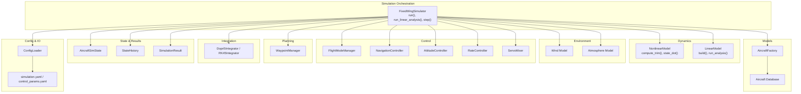
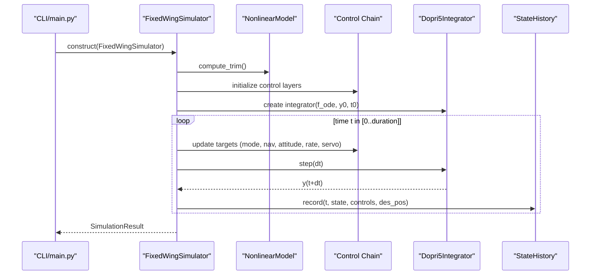
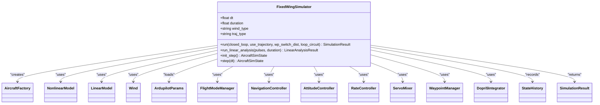
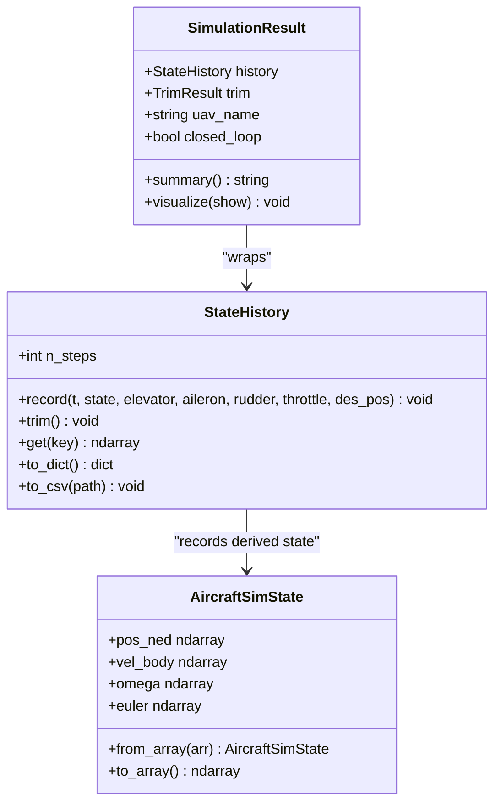
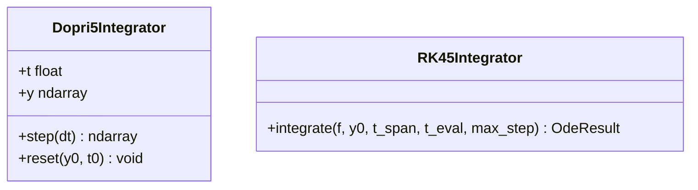
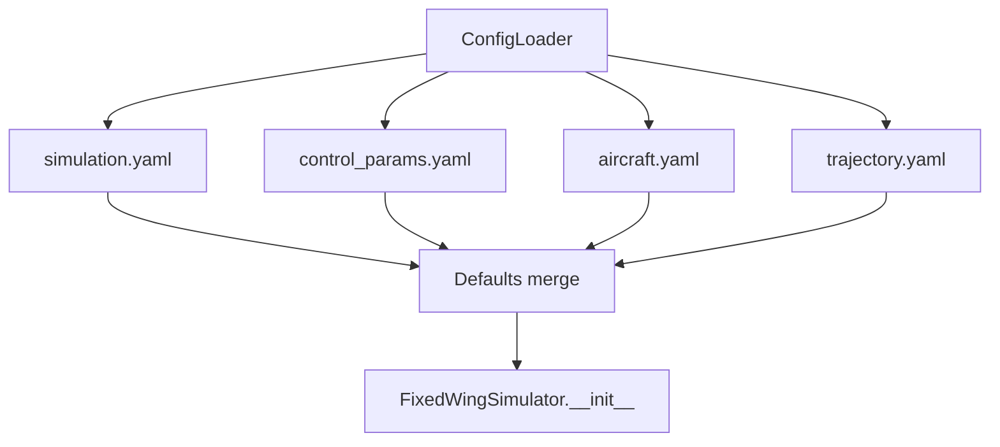
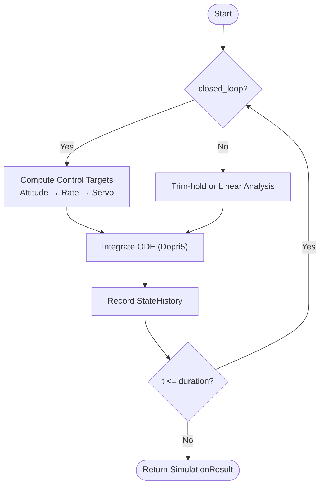
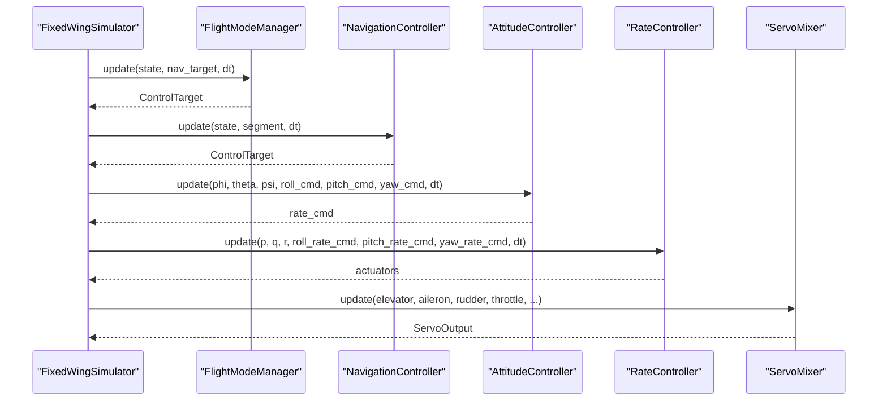
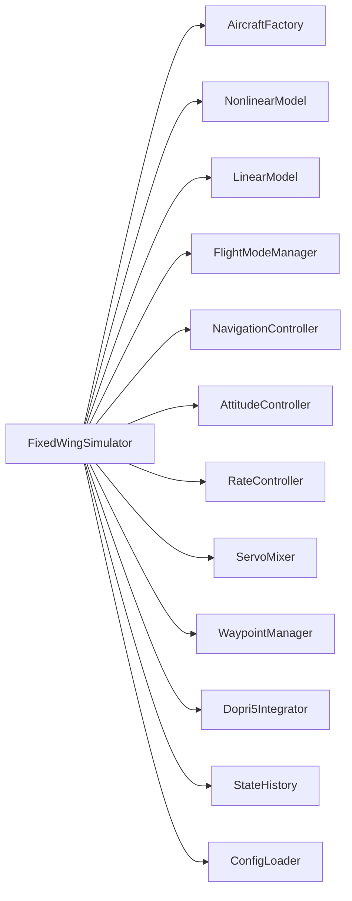

# Simulation Engine

<cite>
**Referenced Files in This Document**
- [simulator.py](file://src/simulation/simulator.py)
- [state_manager.py](file://src/simulation/state_manager.py)
- [integrator.py](file://src/simulation/integrator.py)
- [config_loader.py](file://src/utils/config_loader.py)
- [simulation.yaml](file://config/simulation.yaml)
- [control_params.yaml](file://config/control_params.yaml)
- [aircraft_factory.py](file://src/models/aircraft_factory.py)
- [nonlinear_model.py](file://src/dynamics/nonlinear_model.py)
- [linear_model.py](file://src/dynamics/linear_model.py)
- [flight_mode_manager.py](file://src/control/flight_mode_manager.py)
- [main.py](file://main.py)
- [example_1_linear_response.py](file://examples/example_1_linear_response.py)
- [example_2_nonlinear_dynamics.py](file://examples/example_2_nonlinear_dynamics.py)
</cite>

## Table of Contents
1. [Introduction](#introduction)
2. [Project Structure](#project-structure)
3. [Core Components](#core-components)
4. [Architecture Overview](#architecture-overview)
5. [Detailed Component Analysis](#detailed-component-analysis)
6. [Dependency Analysis](#dependency-analysis)
7. [Performance Considerations](#performance-considerations)
8. [Troubleshooting Guide](#troubleshooting-guide)
9. [Conclusion](#conclusion)
10. [Appendices](#appendices)

## Introduction
This document describes the FixedWingSimulator simulation engine, focusing on the FixedWingSimulator main class architecture, simulation orchestration, run modes (closed-loop and open-loop), numerical integration, time stepping, solver selection, state management, result containers, data persistence, configuration management, parameter validation, and control interfaces. It also provides practical examples, performance considerations, and troubleshooting guidance.

## Project Structure
The simulation engine is organized around a modular architecture:
- Simulation orchestration: FixedWingSimulator orchestrates aircraft models, dynamics, environment, control, planning, and state/history recording.
- Dynamics: Nonlinear 6-DOF model and linear 4-DOF model for open-loop analysis.
- Control: ArduPilot-compatible control chain (navigation, attitude, rate, servo mixer).
- Planning: Waypoint manager and trajectory builders.
- Utilities: Config loader, math utilities, visualization helpers.
- Examples: Practical scripts demonstrating linear and nonlinear simulations.

**Diagram sources**
- [simulator.py](file://src/simulation/simulator.py#L115-L642)
- [state_manager.py](file://src/simulation/state_manager.py#L16-L193)
- [integrator.py](file://src/simulation/integrator.py#L17-L108)
- [config_loader.py](file://src/utils/config_loader.py#L59-L82)
- [simulation.yaml](file://config/simulation.yaml#L1-L30)
- [control_params.yaml](file://config/control_params.yaml#L1-L45)
- [aircraft_factory.py](file://src/models/aircraft_factory.py#L39-L136)
- [nonlinear_model.py](file://src/dynamics/nonlinear_model.py#L104-L200)
- [linear_model.py](file://src/dynamics/linear_model.py#L107-L200)
- [flight_mode_manager.py](file://src/control/flight_mode_manager.py#L115-L200)

**Section sources**
- [simulator.py](file://src/simulation/simulator.py#L1-L642)
- [state_manager.py](file://src/simulation/state_manager.py#L1-L193)
- [integrator.py](file://src/simulation/integrator.py#L1-L108)
- [config_loader.py](file://src/utils/config_loader.py#L1-L82)
- [simulation.yaml](file://config/simulation.yaml#L1-L30)
- [control_params.yaml](file://config/control_params.yaml#L1-L45)
- [aircraft_factory.py](file://src/models/aircraft_factory.py#L1-L136)
- [nonlinear_model.py](file://src/dynamics/nonlinear_model.py#L1-L200)
- [linear_model.py](file://src/dynamics/linear_model.py#L1-L200)
- [flight_mode_manager.py](file://src/control/flight_mode_manager.py#L1-L200)

## Core Components
- FixedWingSimulator: Main engine that composes aircraft, environment, control, planning, and dynamics; exposes run(), run_linear_analysis(), and step()/init_step() APIs.
- Dynamics: NonlinearModel (6-DOF) and LinearModel (4-DOF) for trim computation and ODE evaluation.
- Control: FlightModeManager, NavigationController, AttitudeController, RateController, ServoMixer form the ArduPilot-compatible control chain.
- Planning: WaypointManager builds trajectories and manages waypoints.
- Integration: Dopri5Integrator (adaptive step-size, single-step API) and RK45Integrator (batch solve_ivp) for real-time and offline analysis respectively.
- State Management: AircraftSimState and StateHistory manage state vectors, derived quantities, and efficient history recording with CSV export.
- Configuration: ConfigLoader merges YAML defaults with user-provided files; simulation.yaml and control_params.yaml define runtime parameters.

**Section sources**
- [simulator.py](file://src/simulation/simulator.py#L115-L642)
- [nonlinear_model.py](file://src/dynamics/nonlinear_model.py#L104-L200)
- [linear_model.py](file://src/dynamics/linear_model.py#L107-L200)
- [flight_mode_manager.py](file://src/control/flight_mode_manager.py#L115-L200)
- [integrator.py](file://src/simulation/integrator.py#L17-L108)
- [state_manager.py](file://src/simulation/state_manager.py#L16-L193)
- [config_loader.py](file://src/utils/config_loader.py#L59-L82)

## Architecture Overview
The FixedWingSimulator orchestrates a closed-loop control system with a nonlinear 6-DOF dynamics model. It computes trim, initializes state, builds a dynamic ODE closure around the control system, integrates with Dopri5, and records state history. It supports open-loop linear analysis via LinearModel and step-by-step integration for external UI integration.

**Diagram sources**
- [main.py](file://main.py#L98-L145)
- [simulator.py](file://src/simulation/simulator.py#L239-L567)
- [nonlinear_model.py](file://src/dynamics/nonlinear_model.py#L132-L154)
- [integrator.py](file://src/simulation/integrator.py#L50-L71)
- [state_manager.py](file://src/simulation/state_manager.py#L124-L174)

## Detailed Component Analysis

### FixedWingSimulator Main Class
- Responsibilities:
  - Compose aircraft, environment, control, planning, and dynamics.
  - Provide run() for closed-loop simulation and run_linear_analysis() for open-loop linear analysis.
  - Expose step()/init_step() for external UI integration.
- Key behaviors:
  - Trim computation and auto-update of TECS cruise throttle to match trim.
  - Dynamic ODE closure around control outputs.
  - Waypoint sequencing and trajectory tracking modes.
  - History recording and result packaging.

**Diagram sources**
- [simulator.py](file://src/simulation/simulator.py#L115-L642)

**Section sources**
- [simulator.py](file://src/simulation/simulator.py#L115-L642)

### SimulationResult and StateHistory
- SimulationResult wraps StateHistory and provides summary and visualization helpers.
- StateHistory pre-allocates arrays for efficient recording, trims unused tail, and exports to CSV.

**Diagram sources**
- [simulator.py](file://src/simulation/simulator.py#L59-L110)
- [state_manager.py](file://src/simulation/state_manager.py#L95-L193)

**Section sources**
- [simulator.py](file://src/simulation/simulator.py#L59-L110)
- [state_manager.py](file://src/simulation/state_manager.py#L95-L193)

### Numerical Integrators and Time Stepping
- Dopri5Integrator: Adaptive step-size Dormand-Prince 4(5) wrapper with single-step step(dt) API suitable for real-time loops.
- RK45Integrator: Batch solve_ivp with RK45 for offline analysis requiring full histories.

**Diagram sources**
- [integrator.py](file://src/simulation/integrator.py#L17-L108)

**Section sources**
- [integrator.py](file://src/simulation/integrator.py#L17-L108)

### Configuration Management and Parameter Validation
- ConfigLoader loads and merges YAML files with defaults for aircraft, simulation, control, and trajectory.
- simulation.yaml defines dt, duration, integrator choice, tolerances, initial conditions, wind, and logging.
- control_params.yaml defines ArduPilot-compatible control parameters and TECS tuning.

**Diagram sources**
- [config_loader.py](file://src/utils/config_loader.py#L59-L82)
- [simulation.yaml](file://config/simulation.yaml#L1-L30)
- [control_params.yaml](file://config/control_params.yaml#L1-L45)

**Section sources**
- [config_loader.py](file://src/utils/config_loader.py#L59-L82)
- [simulation.yaml](file://config/simulation.yaml#L1-L30)
- [control_params.yaml](file://config/control_params.yaml#L1-L45)

### Run Modes: Closed-loop vs Open-loop
- Closed-loop (run(closed_loop=True)): Full ArduPilot control chain computes control targets from navigation and flight modes, then attitude/rate control and servo mixing produce surface deflections and throttle.
- Open-loop (run(closed_loop=False) or run_linear_analysis()): Dynamics evolve under trim-hold or linearized model without feedback control.
- Step-by-step (init_step()/step()): For external UI integration, initializes integrator and advances by dt.

**Diagram sources**
- [simulator.py](file://src/simulation/simulator.py#L239-L567)

**Section sources**
- [simulator.py](file://src/simulation/simulator.py#L239-L567)

### Control Layers and Flight Modes
- FlightModeManager selects and transitions between modes (MANUAL, STABILIZE, FBW_A, FBW_B, AUTO, LOITER, RTH).
- NavigationController computes desired states from waypoints/segments.
- AttitudeController and RateController convert desired angles/rates to actuator commands.
- ServoMixer maps control outputs to normalized servo positions.

**Diagram sources**
- [flight_mode_manager.py](file://src/control/flight_mode_manager.py#L115-L200)
- [simulator.py](file://src/simulation/simulator.py#L499-L541)

**Section sources**
- [flight_mode_manager.py](file://src/control/flight_mode_manager.py#L115-L200)
- [simulator.py](file://src/simulation/simulator.py#L499-L541)

### Practical Examples
- Linear response example: Demonstrates open-loop 4-DOF linear analysis and closed-loop FBW_B step response, saving CSV and figures.
- Nonlinear dynamics example: Demonstrates open-loop 6-DOF simulation and closed-loop STABILIZE mode, saving CSV and figures.

**Section sources**
- [example_1_linear_response.py](file://examples/example_1_linear_response.py#L1-L206)
- [example_2_nonlinear_dynamics.py](file://examples/example_2_nonlinear_dynamics.py#L1-L215)

## Dependency Analysis
The FixedWingSimulator depends on:
- AircraftFactory and aircraft database for parameter sourcing.
- NonlinearModel for trim and ODE evaluation.
- Control chain modules for closed-loop behavior.
- WaypointManager for trajectory building.
- Integrator for numerical propagation.
- StateHistory for efficient recording and CSV export.
- ConfigLoader for YAML-based configuration.

**Diagram sources**
- [simulator.py](file://src/simulation/simulator.py#L33-L51)
- [aircraft_factory.py](file://src/models/aircraft_factory.py#L39-L75)
- [nonlinear_model.py](file://src/dynamics/nonlinear_model.py#L104-L127)
- [linear_model.py](file://src/dynamics/linear_model.py#L107-L124)
- [flight_mode_manager.py](file://src/control/flight_mode_manager.py#L115-L138)
- [integrator.py](file://src/simulation/integrator.py#L17-L71)
- [state_manager.py](file://src/simulation/state_manager.py#L95-L123)
- [config_loader.py](file://src/utils/config_loader.py#L59-L82)

**Section sources**
- [simulator.py](file://src/simulation/simulator.py#L33-L51)
- [aircraft_factory.py](file://src/models/aircraft_factory.py#L39-L75)
- [nonlinear_model.py](file://src/dynamics/nonlinear_model.py#L104-L127)
- [linear_model.py](file://src/dynamics/linear_model.py#L107-L124)
- [flight_mode_manager.py](file://src/control/flight_mode_manager.py#L115-L138)
- [integrator.py](file://src/simulation/integrator.py#L17-L71)
- [state_manager.py](file://src/simulation/state_manager.py#L95-L123)
- [config_loader.py](file://src/utils/config_loader.py#L59-L82)

## Performance Considerations
- Integrator choice:
  - Dopri5Integrator is adaptive and suitable for real-time closed-loop loops; tune rtol/atol for accuracy/performance balance.
  - RK45Integrator is suited for offline analysis where full histories are required.
- Time stepping:
  - dt affects accuracy and computational cost; smaller dt improves accuracy but increases CPU time.
- State recording:
  - StateHistory pre-allocates arrays and trims unused tail to reduce memory overhead.
- Control updates:
  - Avoid excessive control layer computations by batching updates and minimizing redundant conversions.
- Wind and atmosphere:
  - Evaluate density and wind only when needed; cache where feasible.

[No sources needed since this section provides general guidance]

## Troubleshooting Guide
- Integration errors:
  - Dopri5Integrator raises RuntimeError on failure; check control saturation, trim mismatch, or extreme inputs.
- Parameter validation:
  - ConfigLoader merges defaults; ensure required keys exist in YAML files.
- Control saturation:
  - TECS and PID gains may require tuning; adjust control_params.yaml accordingly.
- Trajectory issues:
  - Ensure waypoints are added before run(); for single-wp mode, the simulator synthesizes a trivial segment.

**Section sources**
- [integrator.py](file://src/simulation/integrator.py#L54-L56)
- [config_loader.py](file://src/utils/config_loader.py#L59-L82)
- [simulator.py](file://src/simulation/simulator.py#L499-L541)

## Conclusion
The FixedWingSimulator provides a robust, modular framework for fixed-wing UAV simulation. It supports both closed-loop control with ArduPilot-compatible layers and open-loop linear/nonlinear analyses. Its architecture emphasizes clear separation of concerns, efficient state management, flexible configuration, and practical examples for quick adoption.

[No sources needed since this section summarizes without analyzing specific files]

## Appendices

### Example Workflows
- Command-line usage:
  - Run closed-loop AUTO mode with TB2 and default settings.
  - Run 4-DOF linear analysis or 6-DOF open-loop simulation.
- Python API usage:
  - Instantiate FixedWingSimulator with desired parameters.
  - Add waypoints via WaypointManager.
  - Call run() or run_linear_analysis() and inspect SimulationResult.

**Section sources**
- [main.py](file://main.py#L98-L145)
- [simulator.py](file://src/simulation/simulator.py#L239-L567)
- [example_1_linear_response.py](file://examples/example_1_linear_response.py#L132-L144)
- [example_2_nonlinear_dynamics.py](file://examples/example_2_nonlinear_dynamics.py#L130-L139)