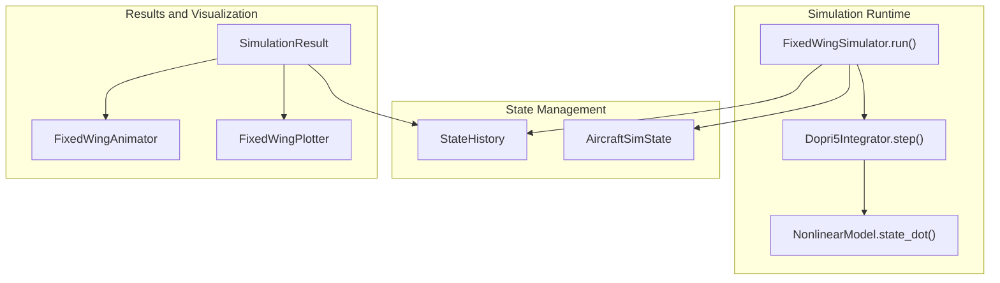
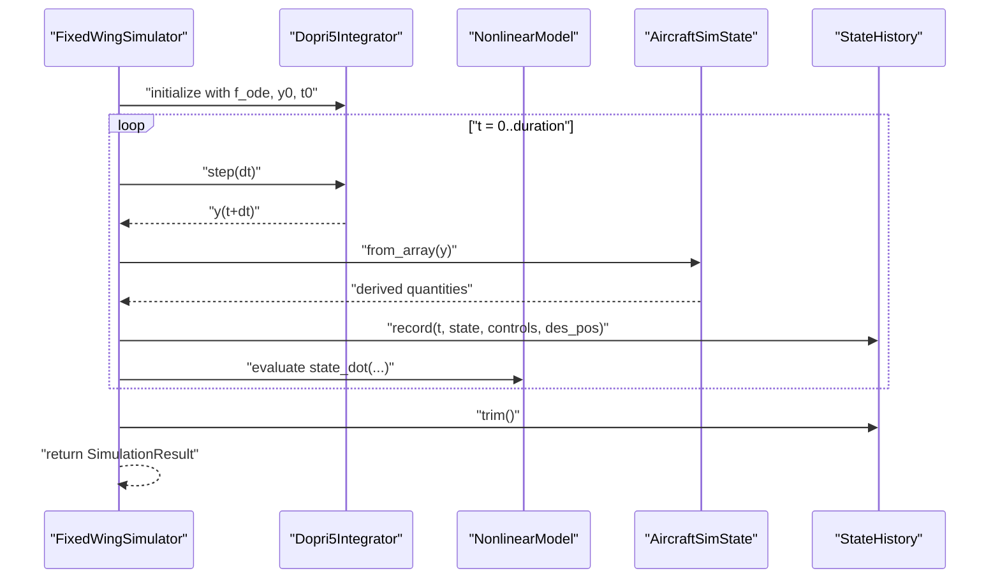
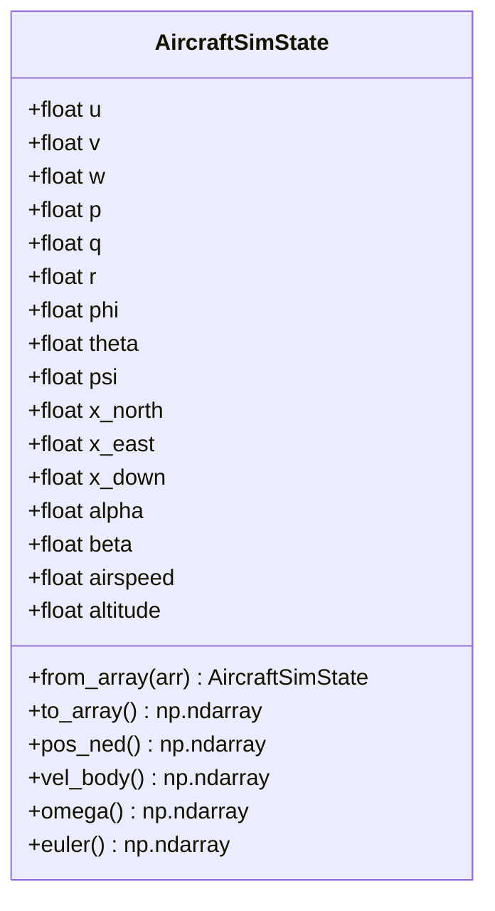
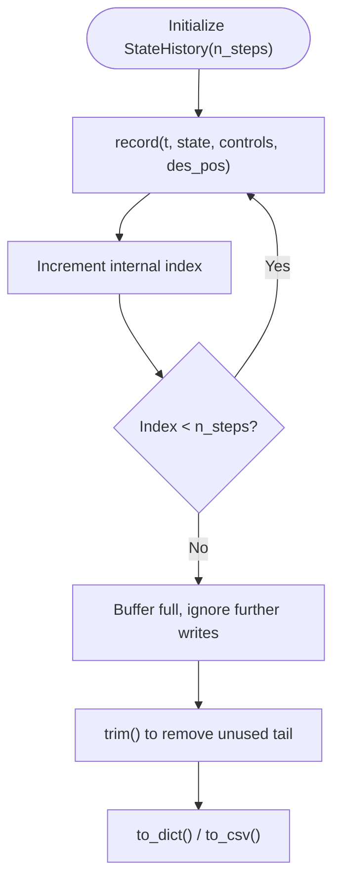
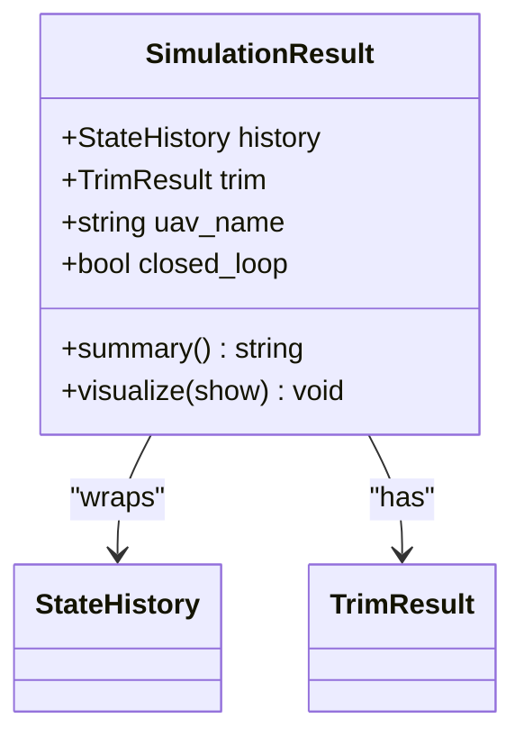
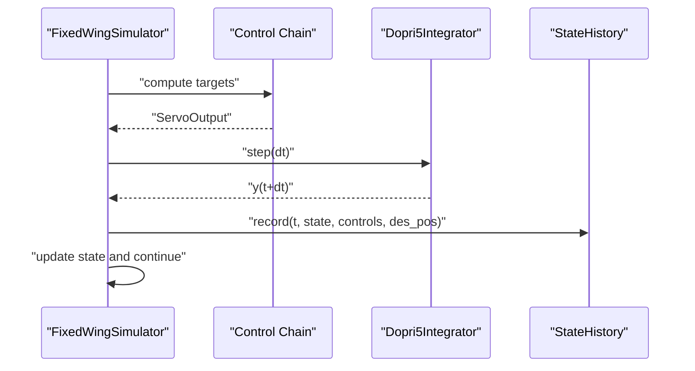
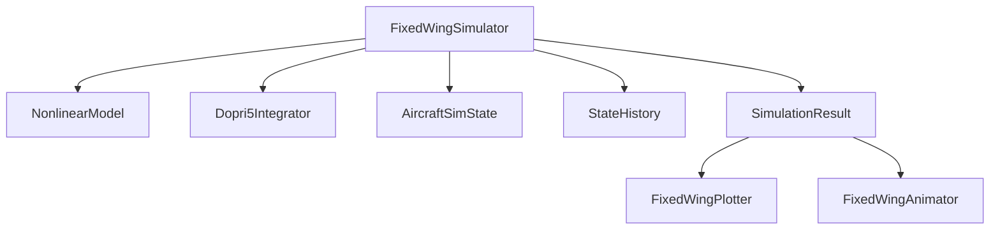

# State Management

<cite>
**Referenced Files in This Document**
- [state_manager.py](file://src/simulation/state_manager.py)
- [simulator.py](file://src/simulation/simulator.py)
- [integrator.py](file://src/simulation/integrator.py)
- [plotter.py](file://src/visualization/plotter.py)
- [animator.py](file://src/visualization/animator.py)
- [nonlinear_model.py](file://src/dynamics/nonlinear_model.py)
- [math_utils.py](file://src/utils/math_utils.py)
- [SimulationResult结果容器.md](file://doc/zh/content/仿真引擎/SimulationResult结果容器.md)
- [状态管理器.md](file://doc/zh/content/仿真引擎/状态管理器.md)
- [性能优化与最佳实践.md](file://doc/zh/content/开发指南/性能优化与最佳实践.md)
</cite>

## Table of Contents
1. [Introduction](#introduction)
2. [Project Structure](#project-structure)
3. [Core Components](#core-components)
4. [Architecture Overview](#architecture-overview)
5. [Detailed Component Analysis](#detailed-component-analysis)
6. [Dependency Analysis](#dependency-analysis)
7. [Performance Considerations](#performance-considerations)
8. [Troubleshooting Guide](#troubleshooting-guide)
9. [Conclusion](#conclusion)
10. [Appendices](#appendices)

## Introduction
This document describes the state management system used by the FixedWingSimulator, focusing on:
- State history recording and efficient storage
- Data persistence and export
- Result container functionality and visualization integration
- Memory management, performance optimization, and error recovery
- Practical examples for querying, analysis, and exporting results

The system centers around two primary building blocks:
- AircraftSimState: a compact 12-D state representation plus derived quantities
- StateHistory: a pre-allocated, column-oriented history buffer optimized for fast recording and minimal memory overhead

These are orchestrated by the FixedWingSimulator during simulation runs and encapsulated in SimulationResult for post-run analysis and visualization.

## Project Structure
The state management and result handling span several modules:
- Simulation orchestration and result packaging
- State containers and history buffer
- Numerical integration
- Visualization and animation
- Mathematical utilities for coordinate transforms and angle wrapping

**Diagram sources**
- [simulator.py](file://src/simulation/simulator.py#L239-L567)
- [integrator.py](file://src/simulation/integrator.py#L50-L71)
- [nonlinear_model.py](file://src/dynamics/nonlinear_model.py#L160-L200)
- [state_manager.py](file://src/simulation/state_manager.py#L16-L93)
- [state_manager.py](file://src/simulation/state_manager.py#L95-L193)
- [simulator.py](file://src/simulation/simulator.py#L59-L109)
- [plotter.py](file://src/visualization/plotter.py#L68-L111)
- [animator.py](file://src/visualization/animator.py#L25-L149)

**Section sources**
- [simulator.py](file://src/simulation/simulator.py#L1-L642)
- [state_manager.py](file://src/simulation/state_manager.py#L1-L193)
- [integrator.py](file://src/simulation/integrator.py#L1-L108)
- [plotter.py](file://src/visualization/plotter.py#L1-L244)
- [animator.py](file://src/visualization/animator.py#L1-L150)
- [nonlinear_model.py](file://src/dynamics/nonlinear_model.py#L1-L386)

## Core Components
- AircraftSimState: holds the 12-D state vector [u, v, w, p, q, r, φ, θ, ψ, x_N, x_E, x_D] and derived quantities (α, β, V, h). It provides conversion to/from array and convenient property accessors for position, velocity, angular rates, and Euler angles.
- StateHistory: pre-allocates NumPy arrays for each recorded variable, writes at fixed stride, trims unused tail at the end, and exposes dictionary-like access and CSV export.
- SimulationResult: wraps a StateHistory instance, adds summary statistics, and integrates visualization via FixedWingPlotter and FixedWingAnimator.

Key responsibilities:
- Efficient recording during simulation loops
- Minimal memory footprint and fast access patterns
- Post-run analysis and visualization

**Section sources**
- [state_manager.py](file://src/simulation/state_manager.py#L16-L93)
- [state_manager.py](file://src/simulation/state_manager.py#L95-L193)
- [simulator.py](file://src/simulation/simulator.py#L59-L109)

## Architecture Overview
The runtime architecture ties together integration, control, and state recording. The simulator constructs the ODE function, advances the integrator, converts state vectors to AircraftSimState, records to StateHistory, and finally produces a SimulationResult.

**Diagram sources**
- [simulator.py](file://src/simulation/simulator.py#L329-L567)
- [integrator.py](file://src/simulation/integrator.py#L50-L71)
- [nonlinear_model.py](file://src/dynamics/nonlinear_model.py#L160-L200)
- [state_manager.py](file://src/simulation/state_manager.py#L52-L93)
- [state_manager.py](file://src/simulation/state_manager.py#L124-L174)

## Detailed Component Analysis

### AircraftSimState: Data Structure and Transformation Utilities
- Layout: body-frame velocities (u, v, w), body-frame angular rates (p, q, r), Euler angles (φ, θ, ψ), NED positions (x_N, x_E, x_D).
- Derived quantities computed externally: airspeed V, angle of attack α, sideslip β, altitude h = −x_D.
- Conversion utilities:
  - from_array(arr): reconstructs state and computes derived quantities
  - to_array(): exports the 12-D vector
  - pos_ned, vel_body, omega, euler: property accessors for control and plotting layers

**Diagram sources**
- [state_manager.py](file://src/simulation/state_manager.py#L16-L93)

**Section sources**
- [state_manager.py](file://src/simulation/state_manager.py#L16-L93)
- [math_utils.py](file://src/utils/math_utils.py#L107-L118)

### StateHistory: Efficient Recording and Persistence
- Pre-allocated dictionary of NumPy arrays keyed by variable names (time, 12-state, derived, control inputs, desired positions).
- record(t, state, elevator, aileron, rudder, throttle, des_pos): writes at current index and increments.
- trim(): truncates arrays to recorded length to free unused capacity.
- get(key): returns the slice up to current index.
- to_dict(): returns a copy of slices up to current index.
- to_csv(path): exports a header plus row-wise values for all recorded keys.

**Diagram sources**
- [state_manager.py](file://src/simulation/state_manager.py#L117-L193)

**Section sources**
- [state_manager.py](file://src/simulation/state_manager.py#L95-L193)

### SimulationResult: Summary Statistics, Export, and Visualization
- Wraps a StateHistory instance and stores trim metadata and configuration flags.
- summary(): prints a concise report including trim speed, duration, mode, final altitude and speed, and track endpoint.
- visualize(show): attempts to import visualization modules and renders 6-DOF plots and 3D animations using FixedWingPlotter and FixedWingAnimator.

**Diagram sources**
- [simulator.py](file://src/simulation/simulator.py#L59-L109)

**Section sources**
- [simulator.py](file://src/simulation/simulator.py#L59-L109)
- [plotter.py](file://src/visualization/plotter.py#L68-L111)
- [animator.py](file://src/visualization/animator.py#L25-L149)

### Integration and Control Orchestration
- The simulator builds a dynamic ODE closure that depends on the current wind and environment density, evaluates NonlinearModel.state_dot(), and updates control targets through the ArduPilot-compatible control chain.
- StateHistory.record() is invoked inside the main loop with the current time, state, and control surface deflections.

**Diagram sources**
- [simulator.py](file://src/simulation/simulator.py#L410-L567)
- [integrator.py](file://src/simulation/integrator.py#L50-L71)
- [nonlinear_model.py](file://src/dynamics/nonlinear_model.py#L160-L200)

**Section sources**
- [simulator.py](file://src/simulation/simulator.py#L239-L567)
- [integrator.py](file://src/simulation/integrator.py#L17-L71)
- [nonlinear_model.py](file://src/dynamics/nonlinear_model.py#L160-L200)

## Dependency Analysis
- FixedWingSimulator depends on:
  - NonlinearModel for the 12-D ODE
  - Dopri5Integrator for single-step integration
  - AircraftSimState for state conversion
  - StateHistory for efficient recording
  - SimulationResult for encapsulating results
- Visualization depends on:
  - FixedWingPlotter for static and interactive charts
  - FixedWingAnimator for 3D trajectory animation

**Diagram sources**
- [simulator.py](file://src/simulation/simulator.py#L33-L52)
- [state_manager.py](file://src/simulation/state_manager.py#L16-L93)
- [state_manager.py](file://src/simulation/state_manager.py#L95-L193)
- [simulator.py](file://src/simulation/simulator.py#L59-L109)
- [plotter.py](file://src/visualization/plotter.py#L19-L111)
- [animator.py](file://src/visualization/animator.py#L14-L149)

**Section sources**
- [simulator.py](file://src/simulation/simulator.py#L33-L52)
- [state_manager.py](file://src/simulation/state_manager.py#L16-L93)
- [state_manager.py](file://src/simulation/state_manager.py#L95-L193)
- [simulator.py](file://src/simulation/simulator.py#L59-L109)
- [plotter.py](file://src/visualization/plotter.py#L19-L111)
- [animator.py](file://src/visualization/animator.py#L14-L149)

## Performance Considerations
- Pre-allocation and trimming:
  - StateHistory pre-allocates NumPy arrays sized for the expected number of steps and trims at the end to avoid wasted memory.
- Vectorization:
  - All computations use NumPy arrays and vectorized operations to minimize Python overhead.
- Lazy imports and incremental rendering:
  - Visualization components are imported on demand to reduce startup cost; animations render only visible segments.
- Integration choice:
  - Dopri5Integrator offers adaptive step sizes with a single-step interface suitable for real-time simulation; RK45Integrator is available for offline analysis requiring full histories.

Practical tips:
- Estimate n_steps conservatively to avoid reallocation.
- Use history.trim() after simulation to release unused memory.
- Export CSV in batches for very long runs to manage disk I/O.

**Section sources**
- [state_manager.py](file://src/simulation/state_manager.py#L117-L174)
- [state_manager.py](file://src/simulation/state_manager.py#L182-L193)
- [integrator.py](file://src/simulation/integrator.py#L17-L71)
- [性能优化与最佳实践.md](file://doc/zh/content/开发指南/性能优化与最佳实践.md#L251-L272)

## Troubleshooting Guide
Common issues and resolutions:
- Integration failure:
  - Symptom: RuntimeError raised by the integrator.
  - Cause: Numerical instability or invalid state encountered.
  - Action: Reduce step size, check control saturation, validate trim initialization.
- Visualization unavailable:
  - Symptom: ImportError when calling visualize().
  - Cause: Missing optional dependencies (matplotlib, plotly, pillow).
  - Action: Install required packages or rely on CSV export.
- Memory errors on long runs:
  - Symptom: Out-of-memory during recording or visualization.
  - Action: Call history.trim() to shrink arrays; consider exporting CSV; process data in chunks.
- Data access exceptions:
  - Symptom: KeyError when accessing keys like desired positions.
  - Action: Verify the simulation mode; desired positions are only present when trajectory tracking is enabled.

**Section sources**
- [integrator.py](file://src/simulation/integrator.py#L54-L56)
- [simulator.py](file://src/simulation/simulator.py#L92-L109)
- [state_manager.py](file://src/simulation/state_manager.py#L170-L180)
- [SimulationResult结果容器.md](file://doc/zh/content/仿真引擎/SimulationResult结果容器.md#L396-L442)

## Conclusion
The state management system provides a robust, efficient foundation for fixed-wing flight simulation:
- AircraftSimState cleanly separates raw dynamics from derived quantities.
- StateHistory delivers high-performance, low-overhead recording with simple persistence and trimming.
- SimulationResult unifies post-run analysis, export, and visualization.

Together, these components enable reliable, scalable simulations suitable for research, engineering, and education.

## Appendices

### Example Workflows

- State querying and analysis:
  - Access final state: retrieve the last element from history.get("airspeed") and history.get("altitude").
  - Compute statistics: use NumPy operations on arrays returned by history.get() or history.to_dict().
  - Export subset: write CSV for a time window by slicing arrays before calling to_csv().

- Data export formats:
  - CSV: history.to_csv(path) writes a header and rows for all recorded keys.
  - In-memory arrays: history.get(key) for individual variables; history.to_dict() for the full dataset.

- Visualization integration:
  - Static plots: FixedWingPlotter.plot_6dof(history_dict, uav_name) and plot_3d_trajectory().
  - Animation: FixedWingAnimator.animate(history_dict, uav_name, num_frames, save_path).

**Section sources**
- [state_manager.py](file://src/simulation/state_manager.py#L176-L193)
- [plotter.py](file://src/visualization/plotter.py#L68-L154)
- [animator.py](file://src/visualization/animator.py#L25-L149)
- [SimulationResult结果容器.md](file://doc/zh/content/仿真引擎/SimulationResult结果容器.md#L288-L321)