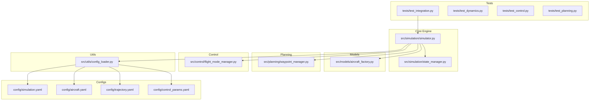
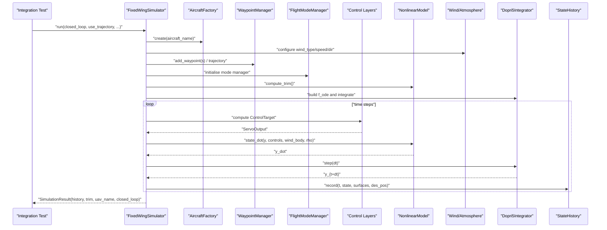
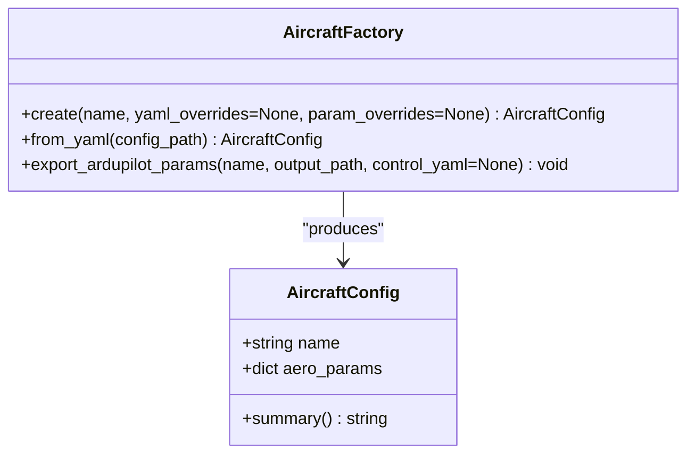
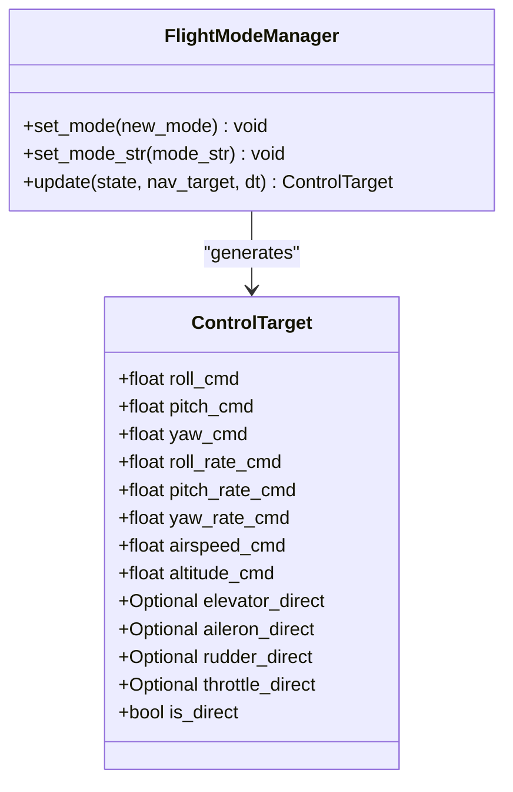
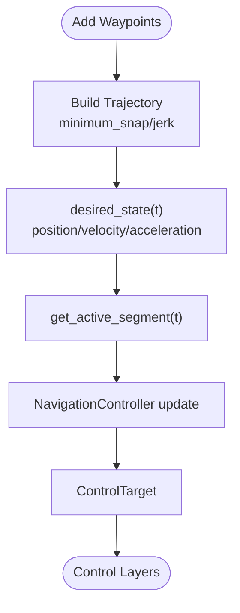
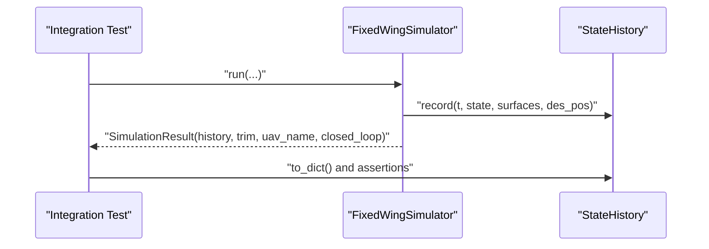
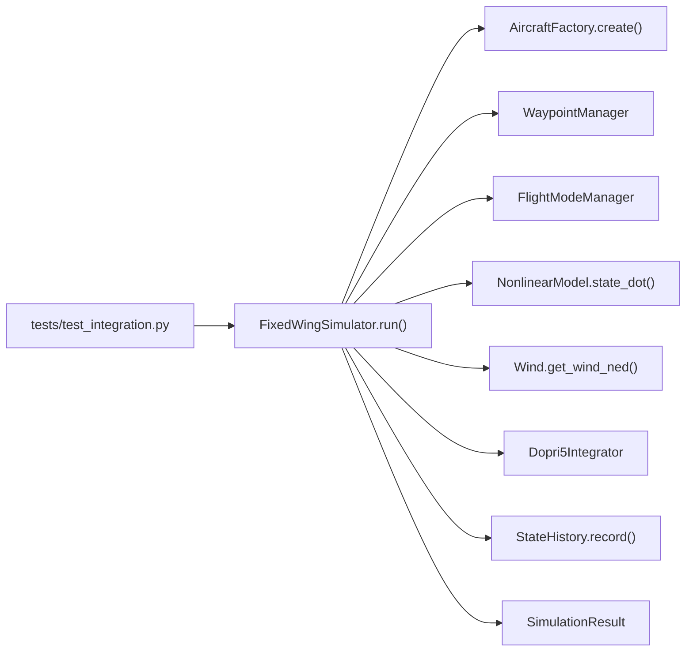

# Integration Testing

<cite>
**Referenced Files in This Document**
- [tests/test_integration.py](file://tests/test_integration.py)
- [src/simulation/simulator.py](file://src/simulation/simulator.py)
- [src/simulation/state_manager.py](file://src/simulation/state_manager.py)
- [src/models/aircraft_factory.py](file://src/models/aircraft_factory.py)
- [src/planning/waypoint_manager.py](file://src/planning/waypoint_manager.py)
- [src/control/flight_mode_manager.py](file://src/control/flight_mode_manager.py)
- [src/utils/config_loader.py](file://src/utils/config_loader.py)
- [config/simulation.yaml](file://config/simulation.yaml)
- [config/aircraft.yaml](file://config/aircraft.yaml)
- [config/control_params.yaml](file://config/control_params.yaml)
- [config/trajectory.yaml](file://config/trajectory.yaml)
- [tests/test_dynamics.py](file://tests/test_dynamics.py)
- [tests/test_control.py](file://tests/test_control.py)
- [tests/test_planning.py](file://tests/test_planning.py)
</cite>

## Table of Contents
1. [Introduction](#introduction)
2. [Project Structure](#project-structure)
3. [Core Components](#core-components)
4. [Architecture Overview](#architecture-overview)
5. [Detailed Component Analysis](#detailed-component-analysis)
6. [Dependency Analysis](#dependency-analysis)
7. [Performance Considerations](#performance-considerations)
8. [Troubleshooting Guide](#troubleshooting-guide)
9. [Conclusion](#conclusion)
10. [Appendices](#appendices)

## Introduction
This document describes integration testing procedures for validating end-to-end simulation workflows in the fixed-wing UAV simulator. It explains how to construct comprehensive integration tests that validate:
- Complete simulation pipelines across modules
- Cross-module coordination (aircraft factory, control system, environment modeling, planning, and dynamics)
- System-level functionality (stability, history correctness, step-API consistency)
- Realistic scenario generation (aircraft selection, wind conditions, trajectory types)
- Result validation against expected outcomes and performance benchmarking
- Orchestration of simulation runs, state management, and result container validation
- Debugging complex integration failures and establishing regression testing procedures

The integration tests in this repository exercise the FixedWingSimulator end-to-end, ensuring numerical stability, correct state history composition, and compatibility across aircraft and control modes.

## Project Structure
The integration testing suite resides under tests/, with the primary integration test file orchestrating full simulation runs. The simulator integrates modules from models/, dynamics/, environment/, control/, planning/, simulation/, utils/, and visualization/.

**Diagram sources**
- [tests/test_integration.py](file://tests/test_integration.py#L1-L391)
- [src/simulation/simulator.py](file://src/simulation/simulator.py#L1-L642)
- [src/simulation/state_manager.py](file://src/simulation/state_manager.py#L1-L193)
- [src/models/aircraft_factory.py](file://src/models/aircraft_factory.py#L1-L136)
- [src/planning/waypoint_manager.py](file://src/planning/waypoint_manager.py#L1-L208)
- [src/control/flight_mode_manager.py](file://src/control/flight_mode_manager.py#L1-L298)
- [src/utils/config_loader.py](file://src/utils/config_loader.py#L1-L82)
- [config/simulation.yaml](file://config/simulation.yaml#L1-L30)
- [config/aircraft.yaml](file://config/aircraft.yaml#L1-L13)
- [config/trajectory.yaml](file://config/trajectory.yaml#L1-L23)
- [config/control_params.yaml](file://config/control_params.yaml#L1-L45)

**Section sources**
- [tests/test_integration.py](file://tests/test_integration.py#L1-L391)
- [src/simulation/simulator.py](file://src/simulation/simulator.py#L1-L642)

## Core Components
This section outlines the core components exercised by integration tests and their roles in end-to-end validation.

- FixedWingSimulator: Orchestrates aircraft configuration, environment, control layers, planning, dynamics, and state history recording. It supports run() for closed-loop/open-loop simulations and run_linear_analysis() for backward-compatible linear analysis.
- SimulationResult: Wraps StateHistory and provides summary and visualization helpers.
- AircraftFactory: Loads and merges aircraft parameters from the database and optional YAML overrides.
- WaypointManager: Manages NED waypoints, builds trajectories (minimum snap/jerk), and exposes desired states and active segments.
- FlightModeManager: Implements ArduPilot-compatible flight modes and generates ControlTarget commands.
- StateHistory and AircraftSimState: Provide structured state containers and efficient history recording.
- ConfigLoader: Centralized YAML loading and merging for simulation, aircraft, trajectory, and control parameters.

Key integration test validations include:
- Open-loop and closed-loop stability checks
- History correctness (length, monotonic time, presence of required keys)
- Trajectory tracking stability and movement validation
- Step-by-step API consistency with run()
- Linear analysis compatibility across aircraft
- Result container integrity and summaries

**Section sources**
- [src/simulation/simulator.py](file://src/simulation/simulator.py#L59-L110)
- [src/simulation/state_manager.py](file://src/simulation/state_manager.py#L16-L93)
- [src/models/aircraft_factory.py](file://src/models/aircraft_factory.py#L15-L37)
- [src/planning/waypoint_manager.py](file://src/planning/waypoint_manager.py#L20-L50)
- [src/control/flight_mode_manager.py](file://src/control/flight_mode_manager.py#L28-L114)
- [src/utils/config_loader.py](file://src/utils/config_loader.py#L59-L82)

## Architecture Overview
The integration tests validate the end-to-end pipeline by invoking FixedWingSimulator.run() and related APIs, asserting numerical stability and correctness of the resulting SimulationResult.history.

**Diagram sources**
- [src/simulation/simulator.py](file://src/simulation/simulator.py#L239-L567)
- [src/models/aircraft_factory.py](file://src/models/aircraft_factory.py#L42-L74)
- [src/planning/waypoint_manager.py](file://src/planning/waypoint_manager.py#L127-L167)
- [src/control/flight_mode_manager.py](file://src/control/flight_mode_manager.py#L115-L178)
- [src/simulation/state_manager.py](file://src/simulation/state_manager.py#L95-L180)

## Detailed Component Analysis

### Integration Test Scenarios and Validation
The integration test suite covers six major scenarios:

1) Open-loop trim-hold stability
- Validates that open-loop simulations (no control) remain bounded for selected aircraft and durations.
- Uses FixedWingSimulator with closed_loop=False and asserts no divergence in altitude, airspeed, and pitch.

2) Closed-loop STABILIZE mode stability
- Ensures closed-loop stabilization remains stable under various wind conditions.
- Includes checks for history array length and monotonic time vector.

3) Closed-loop AUTO mode with trajectory
- Exercises trajectory tracking with minimum snap/jerk and validates forward motion along planned waypoints.
- Asserts divergence-free histories and meaningful position deltas.

4) Backward-compatible linear analysis
- Verifies run_linear_analysis() returns LinearAnalysisResult and that all aircraft complete analysis deterministically.

5) Step-by-step API validation
- Confirms init_step() and repeated step() calls return valid AircraftSimState and remain numerically finite.
- Ensures consistency between run() and step() final states within acceptable tolerance.

6) StateHistory and AircraftSimState correctness
- Validates round-trip conversions between arrays and derived quantities.
- Confirms required keys exist in history dictionaries.

**Section sources**
- [tests/test_integration.py](file://tests/test_integration.py#L66-L391)

### Aircraft Factory Integration
- AircraftFactory.create() merges database parameters with optional YAML and dict overrides.
- Integration tests rely on this to select different aircraft (e.g., TB2, Anka) and validate cross-aircraft stability and linear analysis.

**Diagram sources**
- [src/models/aircraft_factory.py](file://src/models/aircraft_factory.py#L39-L93)

**Section sources**
- [src/models/aircraft_factory.py](file://src/models/aircraft_factory.py#L39-L93)
- [tests/test_integration.py](file://tests/test_integration.py#L97-L105)

### Control System Coordination
- FlightModeManager selects and transitions between modes (STABILIZE, AUTO, etc.) and produces ControlTarget commands.
- Integration tests validate that closed-loop control maintains stability and that manual and direct-control paths are handled.

**Diagram sources**
- [src/control/flight_mode_manager.py](file://src/control/flight_mode_manager.py#L115-L178)
- [src/control/flight_mode_manager.py](file://src/control/flight_mode_manager.py#L82-L113)

**Section sources**
- [src/control/flight_mode_manager.py](file://src/control/flight_mode_manager.py#L115-L178)
- [tests/test_integration.py](file://tests/test_integration.py#L114-L134)

### Environment Modeling Validation
- Wind and atmosphere are configured via ConfigLoader and applied in the ODE evaluation.
- Integration tests exercise wind types (NONE, FIXED) to validate robustness under disturbances.

**Section sources**
- [src/simulation/simulator.py](file://src/simulation/simulator.py#L159-L163)
- [src/utils/config_loader.py](file://src/utils/config_loader.py#L59-L82)
- [config/simulation.yaml](file://config/simulation.yaml#L22-L25)

### Trajectory Planning Workflows
- WaypointManager manages NED waypoints, builds trajectories (minimum snap/jerk), and exposes desired states and active segments.
- Integration tests add waypoints programmatically and validate trajectory tracking stability and forward motion.

**Diagram sources**
- [src/planning/waypoint_manager.py](file://src/planning/waypoint_manager.py#L127-L167)
- [src/planning/waypoint_manager.py](file://src/planning/waypoint_manager.py#L178-L201)

**Section sources**
- [src/planning/waypoint_manager.py](file://src/planning/waypoint_manager.py#L20-L50)
- [src/planning/waypoint_manager.py](file://src/planning/waypoint_manager.py#L127-L167)
- [tests/test_integration.py](file://tests/test_integration.py#L166-L217)

### Simulation Orchestration and Result Container Validation
- FixedWingSimulator.run() orchestrates trim computation, control initialization, trajectory setup, and integration loop.
- SimulationResult.history is validated for completeness and correctness, including required keys and array shapes.

**Diagram sources**
- [src/simulation/simulator.py](file://src/simulation/simulator.py#L239-L567)
- [src/simulation/state_manager.py](file://src/simulation/state_manager.py#L179-L180)
- [tests/test_integration.py](file://tests/test_integration.py#L377-L391)

**Section sources**
- [src/simulation/simulator.py](file://src/simulation/simulator.py#L239-L567)
- [src/simulation/state_manager.py](file://src/simulation/state_manager.py#L95-L180)
- [tests/test_integration.py](file://tests/test_integration.py#L377-L391)

## Dependency Analysis
Integration tests depend on the simulator’s public API and validate cross-module interactions. The following diagram highlights key dependencies exercised by integration tests.

**Diagram sources**
- [tests/test_integration.py](file://tests/test_integration.py#L66-L391)
- [src/simulation/simulator.py](file://src/simulation/simulator.py#L239-L567)
- [src/models/aircraft_factory.py](file://src/models/aircraft_factory.py#L42-L74)
- [src/planning/waypoint_manager.py](file://src/planning/waypoint_manager.py#L127-L167)
- [src/control/flight_mode_manager.py](file://src/control/flight_mode_manager.py#L115-L178)
- [src/simulation/state_manager.py](file://src/simulation/state_manager.py#L124-L168)

**Section sources**
- [tests/test_integration.py](file://tests/test_integration.py#L66-L391)
- [src/simulation/simulator.py](file://src/simulation/simulator.py#L239-L567)

## Performance Considerations
- Integration tests intentionally use modest durations and step sizes to ensure quick feedback while maintaining stability checks.
- For performance benchmarking, measure wall-clock time per run and compare across aircraft and trajectory types. Use consistent dt and integrator settings to isolate performance changes.
- Validate that the number of recorded history samples matches expected step counts within rounding tolerances.

[No sources needed since this section provides general guidance]

## Troubleshooting Guide
Common integration failure symptoms and remedies:
- Numerical divergence in altitude/airspeed/pitch:
  - Verify wind configuration and trim computation; ensure closed-loop control is enabled when expecting stabilization.
  - Check that integration tolerances and step size are appropriate for the chosen aircraft and environment.
- Non-monotonic time vector or missing history keys:
  - Confirm StateHistory.record() is invoked each step and that to_dict() keys include required state variables.
- Trajectory tracking instability:
  - Inspect WaypointManager waypoint altitude alignment with initial altitude and trajectory type selection.
  - Validate NavigationController and FlightModeManager updates for AUTO mode.
- Step-API inconsistencies:
  - Ensure init_step() is called before step(); verify that repeated step() calls remain finite and converge toward run() results within tolerance.

**Section sources**
- [tests/test_integration.py](file://tests/test_integration.py#L41-L58)
- [src/simulation/state_manager.py](file://src/simulation/state_manager.py#L179-L180)
- [src/simulation/simulator.py](file://src/simulation/simulator.py#L602-L641)

## Conclusion
The integration testing framework comprehensively validates the end-to-end simulation pipeline, ensuring stability, correctness, and compatibility across aircraft, control modes, and trajectory types. By leveraging FixedWingSimulator’s run() and step() APIs, and by validating SimulationResult.history and derived quantities, the suite provides strong regression coverage for system-level functionality.

[No sources needed since this section summarizes without analyzing specific files]

## Appendices

### Test Data Generation and Scenario Design
- Aircraft selection: Use TB2 and Anka to validate cross-aircraft stability and linear analysis.
- Wind conditions: Exercise NONE and FIXED wind types to assess disturbance rejection.
- Trajectory types: Compare minimum snap and minimum jerk trajectories for stability and motion characteristics.
- Step-by-step API: Validate init_step() and repeated step() calls for UI integration compatibility.

**Section sources**
- [tests/test_integration.py](file://tests/test_integration.py#L72-L105)
- [tests/test_integration.py](file://tests/test_integration.py#L166-L217)
- [tests/test_integration.py](file://tests/test_integration.py#L269-L342)

### Configuration Reference for Integration Tests
- simulation.yaml: Controls dt, duration, integrator, tolerances, initial conditions, and wind settings.
- aircraft.yaml: Selects aircraft and allows parameter overrides.
- trajectory.yaml: Defines trajectory type, average speed, yaw mode, waypoints, and loop behavior.
- control_params.yaml: ArduPilot-compatible control parameters for TECS and rate controllers.

**Section sources**
- [config/simulation.yaml](file://config/simulation.yaml#L1-L30)
- [config/aircraft.yaml](file://config/aircraft.yaml#L1-L13)
- [config/trajectory.yaml](file://config/trajectory.yaml#L1-L23)
- [config/control_params.yaml](file://config/control_params.yaml#L1-L45)