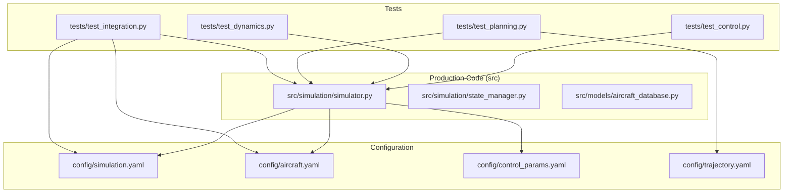
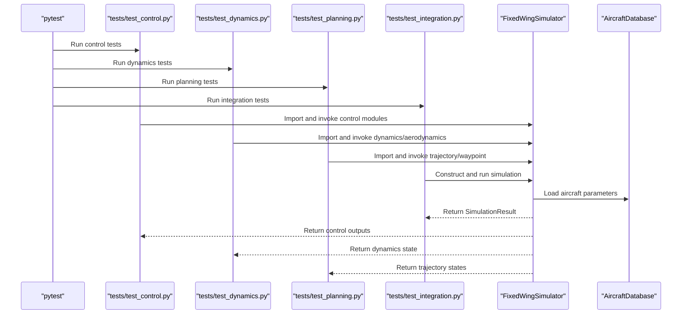
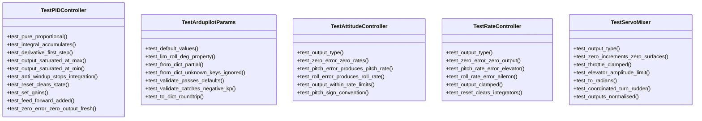
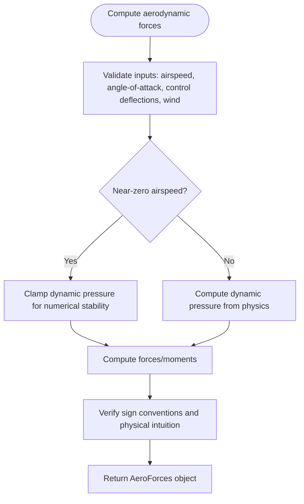
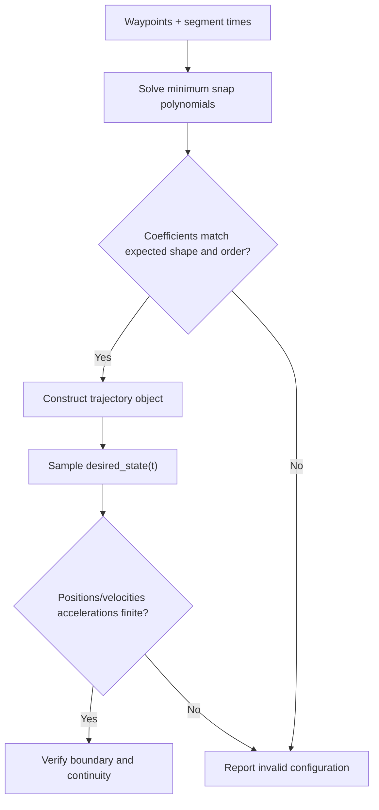
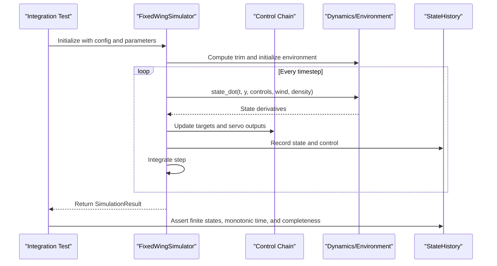
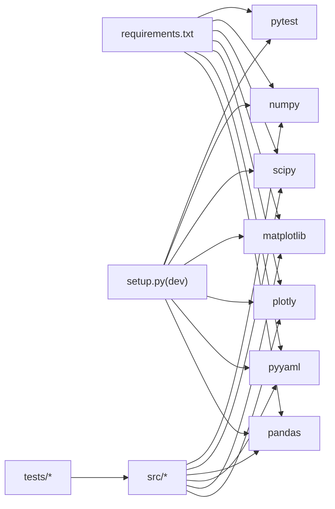
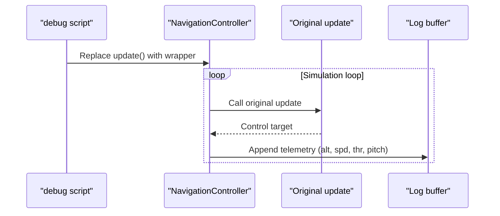

# Testing Methodologies and Best Practices

<cite>
**Referenced Files in This Document**
- [tests/test_control.py](file://tests/test_control.py)
- [tests/test_dynamics.py](file://tests/test_dynamics.py)
- [tests/test_integration.py](file://tests/test_integration.py)
- [tests/test_planning.py](file://tests/test_planning.py)
- [src/simulation/simulator.py](file://src/simulation/simulator.py)
- [src/simulation/state_manager.py](file://src/simulation/state_manager.py)
- [src/models/aircraft_database.py](file://src/models/aircraft_database.py)
- [config/simulation.yaml](file://config/simulation.yaml)
- [config/aircraft.yaml](file://config/aircraft.yaml)
- [config/control_params.yaml](file://config/control_params.yaml)
- [config/trajectory.yaml](file://config/trajectory.yaml)
- [setup.py](file://setup.py)
- [requirements.txt](file://requirements.txt)
- [main.py](file://main.py)
- [debug_long.py](file://debug_long.py)
- [debug_segment.py](file://debug_segment.py)
- [doc/zh/content/测试指南/测试指南.md](file://doc/zh/content/测试指南/测试指南.md)
- [doc/zh/content/测试指南/单元测试.md](file://doc/zh/content/测试指南/单元测试.md)
- [doc/zh/content/测试指南/集成测试.md](file://doc/zh/content/测试指南/集成测试.md)
- [doc/zh/content/测试指南/测试执行与维护.md](file://doc/zh/content/测试指南/测试执行与维护.md)
</cite>

## Table of Contents
1. [Introduction](#introduction)
2. [Project Structure](#project-structure)
3. [Core Components](#core-components)
4. [Architecture Overview](#architecture-overview)
5. [Detailed Component Analysis](#detailed-component-analysis)
6. [Dependency Analysis](#dependency-analysis)
7. [Performance Considerations](#performance-considerations)
8. [Troubleshooting Guide](#troubleshooting-guide)
9. [Conclusion](#conclusion)
10. [Appendices](#appendices)

## Introduction
This document consolidates testing methodologies, quality assurance processes, and best practices for the FixedWingSimulator aerospace simulation platform. It explains how to develop testing strategies, design robust test cases, and validate simulation correctness across control, dynamics, planning, and integrated workflows. It also covers continuous integration setup, automated testing workflows, quality metrics collection, debugging techniques for complex simulation issues, performance profiling, and validation against analytical solutions. Guidance is provided for test data management, result interpretation, regression testing, code coverage analysis, test maintenance, and extending test suites with new testing frameworks.

## Project Structure
The repository follows a layered architecture:
- tests/: Unit and integration test suites organized by functional domain
- src/: Production code for simulation, control, dynamics, planning, models, and utilities
- config/: YAML-based configuration for simulations, aircraft parameters, control parameters, and trajectories
- examples/: Example scripts demonstrating usage and validation scenarios
- doc/zh/: Comprehensive Chinese documentation including testing guides

**Diagram sources**
- [tests/test_control.py](file://tests/test_control.py#L1-L371)
- [tests/test_dynamics.py](file://tests/test_dynamics.py#L1-L336)
- [tests/test_planning.py](file://tests/test_planning.py#L1-L328)
- [tests/test_integration.py](file://tests/test_integration.py#L1-L391)
- [src/simulation/simulator.py](file://src/simulation/simulator.py#L1-L200)
- [src/simulation/state_manager.py](file://src/simulation/state_manager.py#L1-L193)
- [src/models/aircraft_database.py](file://src/models/aircraft_database.py#L1-L183)
- [config/simulation.yaml](file://config/simulation.yaml#L1-L30)
- [config/aircraft.yaml](file://config/aircraft.yaml#L1-L13)
- [config/control_params.yaml](file://config/control_params.yaml#L1-L45)
- [config/trajectory.yaml](file://config/trajectory.yaml#L1-L23)

**Section sources**
- [tests/test_control.py](file://tests/test_control.py#L1-L371)
- [tests/test_dynamics.py](file://tests/test_dynamics.py#L1-L336)
- [tests/test_planning.py](file://tests/test_planning.py#L1-L328)
- [tests/test_integration.py](file://tests/test_integration.py#L1-L391)
- [src/simulation/simulator.py](file://src/simulation/simulator.py#L1-L200)
- [src/simulation/state_manager.py](file://src/simulation/state_manager.py#L1-L193)
- [src/models/aircraft_database.py](file://src/models/aircraft_database.py#L1-L183)
- [config/simulation.yaml](file://config/simulation.yaml#L1-L30)
- [config/aircraft.yaml](file://config/aircraft.yaml#L1-L13)
- [config/control_params.yaml](file://config/control_params.yaml#L1-L45)
- [config/trajectory.yaml](file://config/trajectory.yaml#L1-L23)

## Core Components
- Control tests: Validate PID behavior, ArduPilot parameter handling, attitude/rate control loops, and servo mixing with strict numerical checks and boundary conditions.
- Dynamics tests: Verify coordinate transformations, aerodynamic calculations, linear/nonlinear models, and numerical stability across multiple aircraft.
- Planning tests: Ensure minimum snap/jerk trajectory construction, continuity, waypoint management, and YAML serialization round-trips.
- Integration tests: Execute end-to-end simulation runs, validate numerical stability, history arrays, step-by-step API consistency, and linear analysis compatibility.

**Section sources**
- [tests/test_control.py](file://tests/test_control.py#L58-L371)
- [tests/test_dynamics.py](file://tests/test_dynamics.py#L64-L336)
- [tests/test_planning.py](file://tests/test_planning.py#L48-L328)
- [tests/test_integration.py](file://tests/test_integration.py#L66-L391)

## Architecture Overview
The testing architecture leverages pytest to orchestrate modular tests that validate individual subsystems and cross-module integration. Configuration-driven tests ensure consistent behavior across aircraft, wind conditions, and trajectory types.

**Diagram sources**
- [tests/test_control.py](file://tests/test_control.py#L27-L31)
- [tests/test_dynamics.py](file://tests/test_dynamics.py#L29-L45)
- [tests/test_planning.py](file://tests/test_planning.py#L27-L30)
- [tests/test_integration.py](file://tests/test_integration.py#L32-L34)
- [src/simulation/simulator.py](file://src/simulation/simulator.py#L130-L200)
- [src/models/aircraft_database.py](file://src/models/aircraft_database.py#L143-L166)

## Detailed Component Analysis

### Control Testing Strategy
- Focus areas: PID proportional/integral/derivative behavior, anti-windup, reset semantics, gain updates, feed-forward addition, and zero-error output.
- ArduPilot parameter validation: defaults, property conversions, partial dictionary loading, unknown key handling, and round-trip serialization.
- Attitude/Rate controllers: output types, zero-error behavior, rate limits, sign conventions, and integrator reset effects.
- Servo mixing: output types, zero-increment behavior, throttle clamping, elevator amplitude limits, angle conversion, coordinated turn compensation, and normalized output constraints.

**Diagram sources**
- [tests/test_control.py](file://tests/test_control.py#L61-L371)

**Section sources**
- [tests/test_control.py](file://tests/test_control.py#L58-L371)

### Dynamics Testing Strategy
- Coordinate transforms: DCM orthogonality, determinant sign, body↔NED round-trip, wind mapping, Euler rates, angle wrapping.
- Aerodynamics: output type and finiteness, lift/drag sign consistency, small-speed numerical stabilization, lateral symmetry with aileron deflection, elevator-induced pitching moment, and wind effect on dynamic pressure.
- Linear/nonlinear models: state matrix shapes and finiteness, mode count and stability, pulse excitation response, trim convergence across aircraft, state-dot dimensionality, and short-time simulation stability.

**Diagram sources**
- [tests/test_dynamics.py](file://tests/test_dynamics.py#L127-L195)

**Section sources**
- [tests/test_dynamics.py](file://tests/test_dynamics.py#L64-L336)

### Planning and Trajectory Testing Strategy
- Minimum snap/jerk trajectory construction: coefficient shapes, boundary satisfaction, velocity continuity at segment junctions, finite coefficients, and long-segment stability.
- Waypoint management: altitude unit conversion, clearing and adding waypoints, building trajectories by type, YAML round-trip serialization, and active segment queries.

**Diagram sources**
- [tests/test_planning.py](file://tests/test_planning.py#L51-L116)

**Section sources**
- [tests/test_planning.py](file://tests/test_planning.py#L48-L328)

### Integration Testing Strategy
- End-to-end scenarios: open-loop trim-hold, closed-loop stabilize/auto modes, trajectory tracking, linear analysis compatibility, step-by-step API consistency, and state/history serialization.
- Numerical stability assertions: bounded altitude/speed/pitch, finite histories, monotonic time vectors, and array length consistency.
- Cross-module data flow: wind/body conversions, control targets, state recording, and integrator stepping.

**Diagram sources**
- [tests/test_integration.py](file://tests/test_integration.py#L221-L232)
- [src/simulation/simulator.py](file://src/simulation/simulator.py#L239-L567)
- [src/simulation/state_manager.py](file://src/simulation/state_manager.py#L95-L193)

**Section sources**
- [tests/test_integration.py](file://tests/test_integration.py#L66-L391)
- [src/simulation/simulator.py](file://src/simulation/simulator.py#L115-L642)
- [src/simulation/state_manager.py](file://src/simulation/state_manager.py#L16-L193)

## Dependency Analysis
- Runtime and test dependencies are declared in setup.py and requirements.txt, ensuring reproducible environments.
- Tests import src modules by inserting src into sys.path, maintaining portability from project root.
- Configuration files drive simulation behavior and are consumed by integration tests and the main entry point.

**Diagram sources**
- [requirements.txt](file://requirements.txt#L1-L8)
- [setup.py](file://setup.py#L11-L21)

**Section sources**
- [requirements.txt](file://requirements.txt#L1-L8)
- [setup.py](file://setup.py#L1-L23)
- [tests/test_control.py](file://tests/test_control.py#L22-L25)

## Performance Considerations
- Keep unit tests computationally lightweight; avoid expensive numerical integration in unit tests.
- Use short durations and reasonable dt in integration tests to maintain stability and responsiveness.
- Parallelize test execution using pytest-xdist in CI to reduce total runtime.
- Prefer deterministic configurations and fixed random seeds where randomness is involved.
- Minimize IO overhead in tests; defer heavy visualization to post-run analysis.

[No sources needed since this section provides general guidance]

## Troubleshooting Guide
Common issues and resolutions:
- Import failures: Ensure sys.path injection of src precedes imports in test files.
- Numerical divergence: Reduce dt, adjust wind conditions, verify control limits, and confirm trim convergence.
- Configuration mismatches: Validate config paths and keys; ensure aircraft names exist in the database.
- Coverage artifacts: Clean .pytest_cache, .coverage, htmlcov to avoid contamination.

**Section sources**
- [tests/test_integration.py](file://tests/test_integration.py#L41-L58)
- [doc/zh/content/测试指南/测试执行与维护.md](file://doc/zh/content/测试指南/测试执行与维护.md#L310-L319)

## Conclusion
The FixedWingSimulator employs a comprehensive testing strategy spanning unit, integration, and configuration-driven validation. By leveraging pytest, structured fixtures, and explicit assertions on numerical stability and cross-module data flow, the suite ensures reliable simulation behavior across aircraft, modes, and environmental conditions. Adopting the recommended practices—continuous integration, coverage analysis, regression baselines, and maintainable test design—will sustain quality as the platform evolves.

[No sources needed since this section summarizes without analyzing specific files]

## Appendices

### Continuous Integration Setup and Automated Workflows
- Trigger conditions: push to main branch, pull requests, manual triggers.
- Recommended steps:
  - Install Python and dependencies
  - Run pytest with parallelization (-n auto)
  - Generate coverage reports (HTML and terminal summaries)
  - Upload artifacts and logs
  - Enforce coverage thresholds and gate PRs accordingly
- Matrix testing: test multiple Python and NumPy versions to detect regressions across environments.

**Section sources**
- [doc/zh/content/测试指南/测试执行与维护.md](file://doc/zh/content/测试指南/测试执行与维护.md#L348-L358)

### Quality Metrics Collection
- Coverage thresholds (recommended):
  - Line coverage ≥80%
  - Branch coverage ≥60%
  - Critical modules (control/dynamics) ≥85%/≥70%
- Reports: Terminal missing lines and HTML coverage for review and auditing.

**Section sources**
- [doc/zh/content/测试指南/测试执行与维护.md](file://doc/zh/content/测试指南/测试执行与维护.md#L368-L375)

### Debugging Techniques for Complex Simulation Issues
- Monkey-patching and logging: instrument control loops to capture throttle, pitch, altitude, and speed traces for long runs.
- Segment diagnostics: inspect desired position clamping and waypoint altitude handling.
- Example scripts demonstrate targeted debugging of TECS convergence and segment end values.

**Diagram sources**
- [debug_long.py](file://debug_long.py#L12-L25)

**Section sources**
- [debug_long.py](file://debug_long.py#L1-L55)
- [debug_segment.py](file://debug_segment.py#L1-L55)

### Validation Against Analytical Solutions
- Linear model validation: verify short-period mode stability and modal counts for representative aircraft.
- Trim verification: confirm trim convergence and reasonableness of angle-of-attack and throttle across aircraft.
- Pulse response: use elevator impulses to excite pitch dynamics and validate non-zero responses.

**Section sources**
- [tests/test_dynamics.py](file://tests/test_dynamics.py#L216-L255)
- [tests/test_dynamics.py](file://tests/test_dynamics.py#L263-L336)

### Test Data Management and Regression Testing
- Configuration-driven tests: rely on YAML files for aircraft, control, simulation, and trajectory parameters.
- Regression baselines: retain key scenarios (trim, modal analysis, trajectory tracking) to detect behavioral drift.
- Parameter sweeps: periodically test sensitivity to dt, wind, and initial conditions.

**Section sources**
- [config/simulation.yaml](file://config/simulation.yaml#L1-L30)
- [config/aircraft.yaml](file://config/aircraft.yaml#L1-L13)
- [config/control_params.yaml](file://config/control_params.yaml#L1-L45)
- [config/trajectory.yaml](file://config/trajectory.yaml#L1-L23)

### Extending Test Suites and New Testing Frameworks
- Add new test modules following the established pattern: domain-specific classes and methods, fixtures for shared resources, and clear assertions.
- Introduce mock/stub patterns for external dependencies in integration tests to isolate subsystems.
- Adopt pytest plugins (e.g., xdist for parallelism, cov for coverage) and integrate with CI for automated gating.

**Section sources**
- [doc/zh/content/测试指南/测试指南.md](file://doc/zh/content/测试指南/测试指南.md#L366-L372)
- [doc/zh/content/测试指南/集成测试.md](file://doc/zh/content/测试指南/集成测试.md#L209-L214)