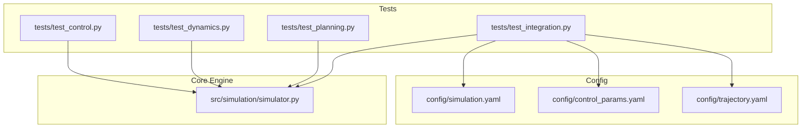
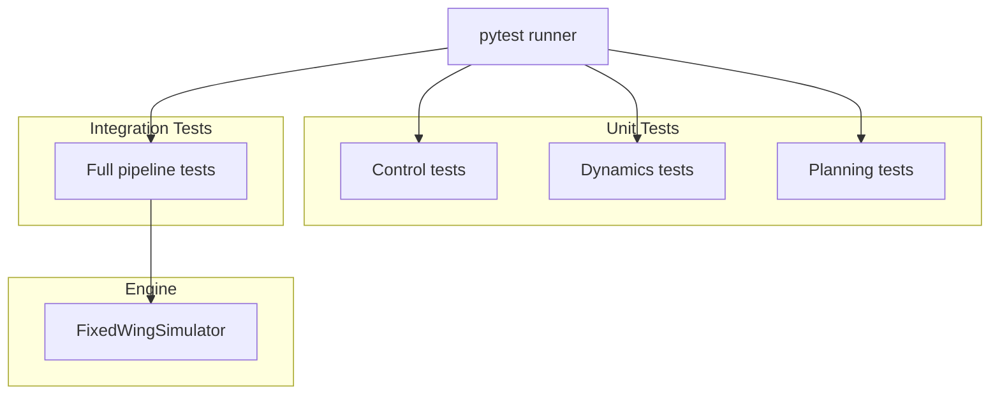
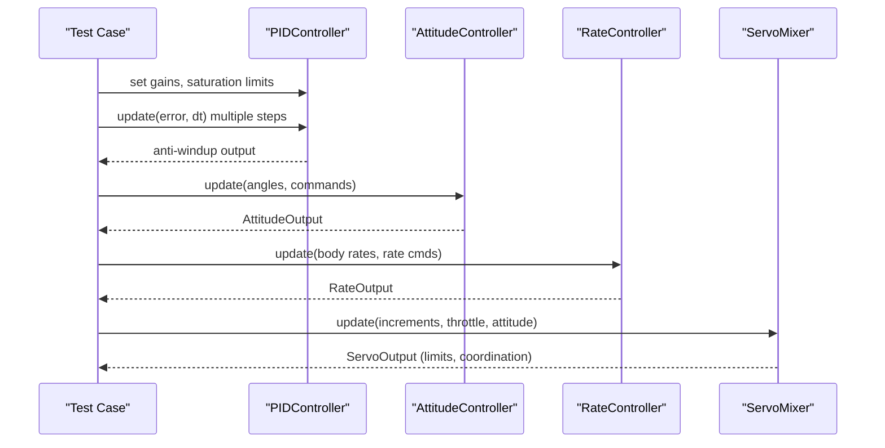
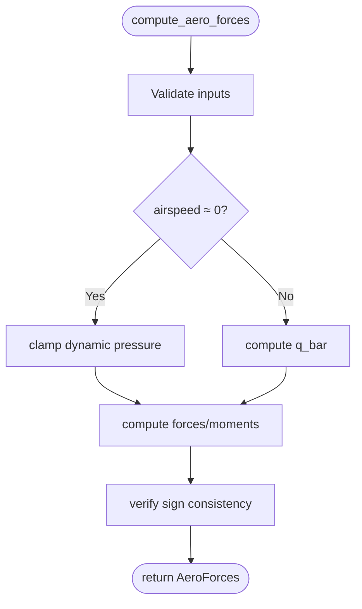
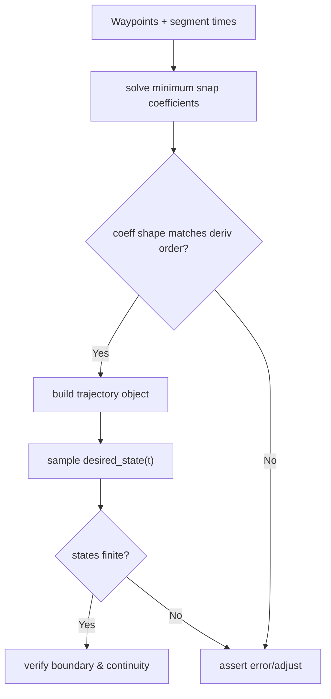
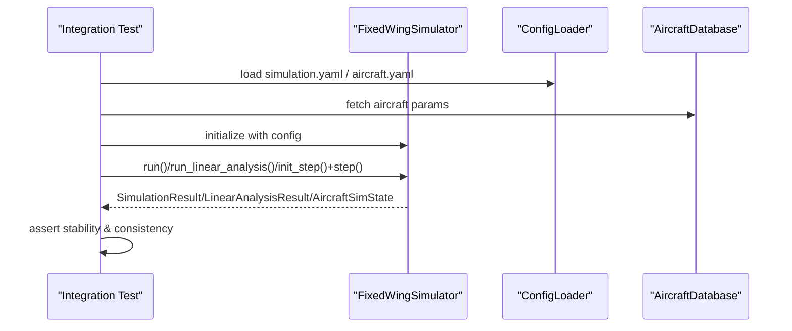
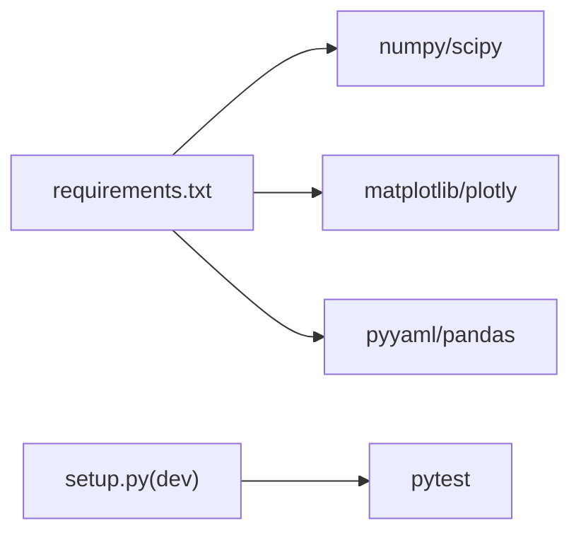

# Testing and Quality Assurance

<cite>
**Referenced Files in This Document**
- [tests/test_control.py](file://tests/test_control.py)
- [tests/test_dynamics.py](file://tests/test_dynamics.py)
- [tests/test_planning.py](file://tests/test_planning.py)
- [tests/test_integration.py](file://tests/test_integration.py)
- [src/simulation/simulator.py](file://src/simulation/simulator.py)
- [src/utils/math_utils.py](file://src/utils/math_utils.py)
- [config/simulation.yaml](file://config/simulation.yaml)
- [config/control_params.yaml](file://config/control_params.yaml)
- [config/trajectory.yaml](file://config/trajectory.yaml)
- [requirements.txt](file://requirements.txt)
- [setup.py](file://setup.py)
- [doc/zh/content/测试指南/测试指南.md](file://doc/zh/content/测试指南/测试指南.md)
- [doc/zh/content/测试指南/单元测试.md](file://doc/zh/content/测试指南/单元测试.md)
- [doc/zh/content/测试指南/集成测试.md](file://doc/zh/content/测试指南/集成测试.md)
</cite>

## Table of Contents
1. [Introduction](#introduction)
2. [Project Structure](#project-structure)
3. [Core Components](#core-components)
4. [Architecture Overview](#architecture-overview)
5. [Detailed Component Analysis](#detailed-component-analysis)
6. [Dependency Analysis](#dependency-analysis)
7. [Performance Considerations](#performance-considerations)
8. [Troubleshooting Guide](#troubleshooting-guide)
9. [Conclusion](#conclusion)
10. [Appendices](#appendices)

## Introduction
This document provides comprehensive guidance for testing and quality assurance of the fixed-wing simulation platform. It covers unit testing strategies for individual components, integration testing for end-to-end simulation validation, and performance benchmarking methods. It documents test suite organization, edge case validation, and regression testing procedures. It also explains testing best practices, mock object usage, and test data generation, along with guidance for writing new tests, continuous integration setup, and quality metrics. Debugging techniques, performance profiling, and validation against analytical solutions are addressed.

## Project Structure
The repository organizes tests by functional domain:
- tests/test_control.py: Unit tests for control components (PID, ArduPilot compatibility, attitude/rate controllers, servo mixer).
- tests/test_dynamics.py: Unit tests for dynamics (coordinate transforms, aerodynamics, linear/nonlinear models).
- tests/test_planning.py: Unit tests for trajectory planning (minimum snap/jerk, waypoint manager).
- tests/test_integration.py: Integration tests for the full simulation pipeline (open-loop/ closed-loop, linear analysis, step-by-step API).

Configuration-driven integration tests rely on YAML files for simulation parameters, control parameters, and trajectory definitions.

**Diagram sources**
- [tests/test_control.py](file://tests/test_control.py#L1-L371)
- [tests/test_dynamics.py](file://tests/test_dynamics.py#L1-L336)
- [tests/test_planning.py](file://tests/test_planning.py#L1-L328)
- [tests/test_integration.py](file://tests/test_integration.py#L1-L391)
- [config/simulation.yaml](file://config/simulation.yaml#L1-L30)
- [config/control_params.yaml](file://config/control_params.yaml#L1-L45)
- [config/trajectory.yaml](file://config/trajectory.yaml#L1-L23)
- [src/simulation/simulator.py](file://src/simulation/simulator.py#L1-L642)

**Section sources**
- [tests/test_control.py](file://tests/test_control.py#L1-L371)
- [tests/test_dynamics.py](file://tests/test_dynamics.py#L1-L336)
- [tests/test_planning.py](file://tests/test_planning.py#L1-L328)
- [tests/test_integration.py](file://tests/test_integration.py#L1-L391)
- [config/simulation.yaml](file://config/simulation.yaml#L1-L30)
- [config/control_params.yaml](file://config/control_params.yaml#L1-L45)
- [config/trajectory.yaml](file://config/trajectory.yaml#L1-L23)
- [src/simulation/simulator.py](file://src/simulation/simulator.py#L1-L642)

## Core Components
- Control tests: Validate PID behavior, ArduPilot parameter handling, attitude/ rate control outputs, and servo mixing with saturation and coordination.
- Dynamics tests: Verify coordinate transformations, aerodynamic force computations, linear/nonlinear model stability, and trim convergence.
- Planning tests: Ensure polynomial trajectory coefficients satisfy boundary conditions, continuity, and finite behavior; validate waypoint management and YAML round-trips.
- Integration tests: Execute full simulation loops (open-loop/ closed-loop), validate numerical stability, and confirm API consistency (run vs step-by-step).

**Section sources**
- [tests/test_control.py](file://tests/test_control.py#L57-L371)
- [tests/test_dynamics.py](file://tests/test_dynamics.py#L63-L336)
- [tests/test_planning.py](file://tests/test_planning.py#L47-L328)
- [tests/test_integration.py](file://tests/test_integration.py#L66-L391)

## Architecture Overview
The testing architecture follows a layered approach:
- Unit tests focus on isolated modules and mathematical correctness.
- Integration tests orchestrate the FixedWingSimulator with configuration-driven inputs to validate end-to-end behavior and numerical stability.

**Diagram sources**
- [tests/test_integration.py](file://tests/test_integration.py#L1-L391)
- [src/simulation/simulator.py](file://src/simulation/simulator.py#L1-L642)

**Section sources**
- [tests/test_integration.py](file://tests/test_integration.py#L1-L391)
- [src/simulation/simulator.py](file://src/simulation/simulator.py#L1-L642)

## Detailed Component Analysis

### Control Testing
Focus areas:
- PID behavior: pure-proportional, integral accumulation, derivative first-step behavior, output saturation, anti-windup, reset, gain updates, feedforward addition, zero-error output.
- ArduPilot parameters: defaults, property conversions, partial dictionary loading, unknown key handling, validation, serialization roundtrip.
- Attitude controller: output type, zero-error zero-rate outputs, sign conventions, rate limits.
- Rate controller: output type, zero-error zero increments, saturation, integrator reset behavior.
- Servo mixer: output type, zero increments zero surfaces, throttle clamping, elevator amplitude limits, radians conversion, coordinated turn compensation, normalized outputs.

**Diagram sources**
- [tests/test_control.py](file://tests/test_control.py#L61-L371)

**Section sources**
- [tests/test_control.py](file://tests/test_control.py#L57-L371)

### Dynamics Testing
Focus areas:
- Coordinate transforms: DCM orthogonality, determinant +1, body↔NED round-trip, zero-angle identity, wind mapping, Euler rates relationship, angle wrapping.
- Aerodynamics: output type and finiteness, lift/drag sign consistency, small-speed numerical stabilization, lateral symmetry with aileron, elevator pitching moment, wind effect on dynamic pressure.
- Linear model: state matrix shape and finiteness, mode count and stability, pulse-excitation response.
- Nonlinear model: trim convergence and bounds, state-dot dimension, trim vicinity derivatives near zero, short simulations with altitude bounds, multi-aircraft trim validation.

**Diagram sources**
- [tests/test_dynamics.py](file://tests/test_dynamics.py#L127-L195)

**Section sources**
- [tests/test_dynamics.py](file://tests/test_dynamics.py#L63-L336)
- [src/utils/math_utils.py](file://src/utils/math_utils.py#L13-L124)

### Planning Testing
Focus areas:
- Minimum snap coefficients: output shapes for different waypoint counts and derivative orders, boundary satisfaction, velocity continuity at junctions, finite coefficients, stability for long segments.
- Minimum snap trajectory: desired state type, position at start/end/waypoints, 3D velocity/acceleration, finite states throughout, boundary clamping, yaw-follow mode availability, long-segment validity.
- Minimum jerk trajectory: position continuity at waypoints, velocity continuity at junctions, qualitative lower total jerk compared to minimum snap.
- Waypoint manager: altitude conversion (above-ground to NED down), clear/add/remove, NED array input, build trajectory by type, require ≥2 waypoints, YAML roundtrip, active segment queries.

**Diagram sources**
- [tests/test_planning.py](file://tests/test_planning.py#L51-L246)

**Section sources**
- [tests/test_planning.py](file://tests/test_planning.py#L47-L328)

### Integration Testing
Scenarios and validations:
- Open-loop trim-hold: TB2/Anka for 5 seconds; assert no divergence (finite altitude/airspeed/pitch).
- Closed-loop STABILIZE: 5 seconds stability; history array length and monotonic time vector checks.
- Closed-loop AUTO with trajectory: 10 seconds stability; forward motion in AUTO mode; minimum jerk trajectory stability.
- Linear analysis: result type, number of modes, summary string validity, all aircraft compatibility.
- Step-by-step API: init_step()/step() return valid states; finite values; approximate consistency with run().
- State containers: array roundtrip for AircraftSimState; derived quantities correctness; StateHistory dictionary completeness.

**Diagram sources**
- [tests/test_integration.py](file://tests/test_integration.py#L70-L391)
- [src/simulation/simulator.py](file://src/simulation/simulator.py#L115-L642)

**Section sources**
- [tests/test_integration.py](file://tests/test_integration.py#L66-L391)
- [src/simulation/simulator.py](file://src/simulation/simulator.py#L1-L642)

## Dependency Analysis
- Runtime dependencies: numpy, scipy, matplotlib, plotly, pyyaml, pandas.
- Development dependencies: pytest (via extras_require).
- Configuration dependencies: simulation.yaml, control_params.yaml, trajectory.yaml drive integration tests.

**Diagram sources**
- [requirements.txt](file://requirements.txt#L1-L8)
- [setup.py](file://setup.py#L19-L21)

**Section sources**
- [requirements.txt](file://requirements.txt#L1-L8)
- [setup.py](file://setup.py#L1-L23)

## Performance Considerations
- Prefer short-duration simulations in integration tests to maintain fast feedback cycles.
- Use appropriate dt and integrator tolerances to balance accuracy and speed.
- Avoid expensive repeated allocations inside tight loops; reuse precomputed matrices and arrays where possible.
- Validate numerical stability thresholds (e.g., altitude bounds, airspeed limits) to catch regressions early.

[No sources needed since this section provides general guidance]

## Troubleshooting Guide
Common issues and resolutions:
- Test failures due to missing development dependencies: install with pip install -e ".[dev]".
- Integration test divergence: reduce duration or increase dt; verify wind and trim settings; inspect control saturation and limits.
- Aircraft parameter errors: confirm aircraft_name exists in the database; use the provided list of supported aircraft.
- Coverage and artifacts: .gitignore excludes pytest cache, coverage reports, logs, and CSV outputs; remove stale artifacts if needed.

**Section sources**
- [doc/zh/content/测试指南/测试指南.md](file://doc/zh/content/测试指南/测试指南.md#L275-L297)
- [doc/zh/content/测试指南/单元测试.md](file://doc/zh/content/测试指南/单元测试.md#L317-L340)
- [doc/zh/content/测试指南/集成测试.md](file://doc/zh/content/测试指南/集成测试.md#L294-L315)

## Conclusion
The testing framework provides robust unit and integration coverage across control, dynamics, planning, and the full simulation pipeline. By leveraging configuration-driven tests, strict numerical stability checks, and consistent fixtures, the suite ensures correctness and reliability across multiple aircraft and flight modes. Adopting the documented best practices and adding new tests following established patterns will sustain high-quality standards as the project evolves.

[No sources needed since this section summarizes without analyzing specific files]

## Appendices

### Writing New Tests
- Choose the right location: control, dynamics, planning, or integration tests based on module scope.
- Use fixtures to prepare shared data (e.g., aircraft parameters, controller instances).
- Design focused test cases: normal behavior, boundary conditions, and error/exception paths.
- Keep assertions explicit and meaningful; validate types, shapes, finiteness, and physical consistency.
- Add integration tests to validate cross-module behavior and API consistency.

**Section sources**
- [doc/zh/content/测试指南/单元测试.md](file://doc/zh/content/测试指南/单元测试.md#L364-L383)
- [doc/zh/content/测试指南/集成测试.md](file://doc/zh/content/测试指南/集成测试.md#L209-L226)

### Continuous Integration Setup
- Environment: match Python version and dependency ranges defined in setup.py and requirements.txt.
- Steps:
  - Install dependencies: pip install -r requirements.txt
  - Install project in editable mode with dev extras: pip install -e ".[dev]"
  - Run tests: pytest tests/ --tb=short
  - Optional coverage: pytest --cov=src --cov-report=xml
- Ignore artifacts: .pytest_cache, .coverage, htmlcov, logs, *.csv

**Section sources**
- [doc/zh/content/测试指南/测试指南.md](file://doc/zh/content/测试指南/测试指南.md#L349-L365)
- [requirements.txt](file://requirements.txt#L1-L8)
- [setup.py](file://setup.py#L19-L21)

### Quality Metrics and Best Practices
- Coverage targets: aim for ≥80% coverage on core algorithms and critical paths; ensure boundary and exception branches are covered.
- Maintain readability: concise test names, clear assertions, and minimal duplication.
- Stability: avoid flakiness by fixing seeds for random inputs and using deterministic configurations.
- Regression hygiene: add tests for bug fixes; keep integration tests short but representative.

**Section sources**
- [doc/zh/content/测试指南/测试指南.md](file://doc/zh/content/测试指南/测试指南.md#L316-L322)
- [doc/zh/content/测试指南/单元测试.md](file://doc/zh/content/测试指南/单元测试.md#L364-L383)

### Mock Objects and Test Stubs
- Use mocks/stubs to isolate external dependencies (e.g., wind/atmosphere) and simplify complex subsystems.
- Ensure stubs match the interface signature and return types of the real components.
- For stochastic inputs (e.g., wind), fix seeds or replace with deterministic alternatives.

**Section sources**
- [doc/zh/content/测试指南/集成测试.md](file://doc/zh/content/测试指南/集成测试.md#L209-L214)

### Validation Against Analytical Solutions
- Linear models: verify eigenvalue stability and expected modal behavior (e.g., short-period stability).
- Trim checks: confirm trim convergence and reasonableness of alpha/de_trim/U0 ranges.
- Pulse responses: validate that elevator pulses excite pitch dynamics as expected.

**Section sources**
- [tests/test_dynamics.py](file://tests/test_dynamics.py#L216-L255)
- [tests/test_dynamics.py](file://tests/test_dynamics.py#L263-L336)

### Configuration Inputs for Tests
- simulation.yaml: dt, duration, integrator, initial conditions, initial mode, wind settings, logging.
- control_params.yaml: flight mode parameters, PID gains, limits, TECS parameters.
- trajectory.yaml: trajectory type, average speed, yaw mode, waypoints, loop flag.

**Section sources**
- [config/simulation.yaml](file://config/simulation.yaml#L1-L30)
- [config/control_params.yaml](file://config/control_params.yaml#L1-L45)
- [config/trajectory.yaml](file://config/trajectory.yaml#L1-L23)