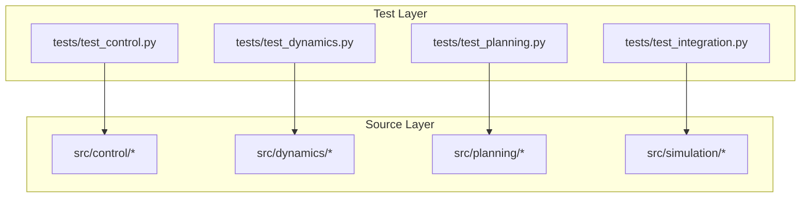
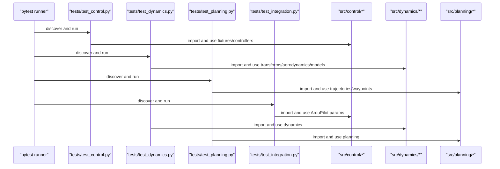
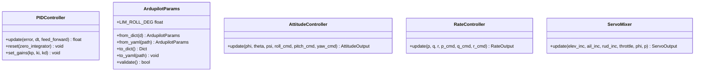
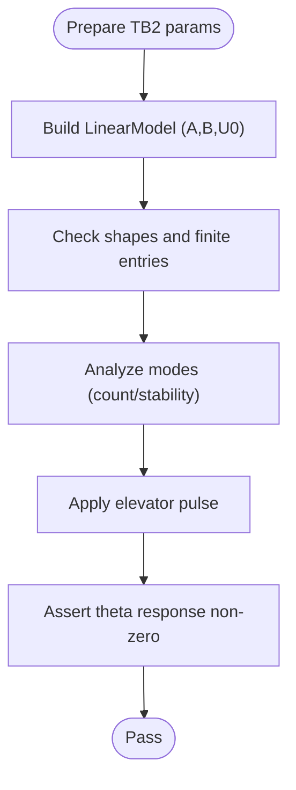
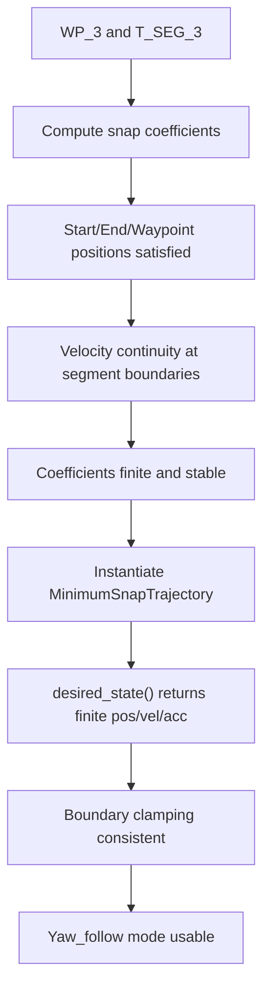
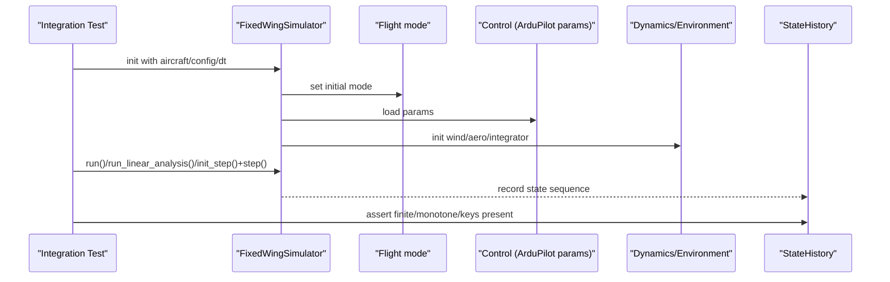
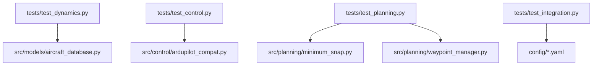

# Unit Testing

<cite>
**Referenced Files in This Document**
- [tests/test_control.py](file://tests/test_control.py)
- [tests/test_dynamics.py](file://tests/test_dynamics.py)
- [tests/test_planning.py](file://tests/test_planning.py)
- [tests/test_integration.py](file://tests/test_integration.py)
- [src/control/pid_controller.py](file://src/control/pid_controller.py)
- [src/control/ardupilot_compat.py](file://src/control/ardupilot_compat.py)
- [src/dynamics/aerodynamics.py](file://src/dynamics/aerodynamics.py)
- [src/dynamics/coordinate_transform.py](file://src/dynamics/coordinate_transform.py)
- [src/utils/math_utils.py](file://src/utils/math_utils.py)
- [src/models/aircraft_database.py](file://src/models/aircraft_database.py)
- [src/planning/minimum_snap.py](file://src/planning/minimum_snap.py)
- [src/planning/waypoint_manager.py](file://src/planning/waypoint_manager.py)
- [doc/zh/content/测试指南/单元测试.md](file://doc/zh/content/测试指南/单元测试.md)
- [doc/zh/content/测试指南/测试执行与维护.md](file://doc/zh/content/测试指南/测试执行与维护.md)
</cite>

## Table of Contents
1. [Introduction](#introduction)
2. [Project Structure](#project-structure)
3. [Core Components](#core-components)
4. [Architecture Overview](#architecture-overview)
5. [Detailed Component Analysis](#detailed-component-analysis)
6. [Dependency Analysis](#dependency-analysis)
7. [Performance Considerations](#performance-considerations)
8. [Troubleshooting Guide](#troubleshooting-guide)
9. [Conclusion](#conclusion)
10. [Appendices](#appendices)

## Introduction
This document provides a comprehensive guide to the unit testing procedures and methodologies implemented in the FixedWingSimulator project. It explains the pytest-based testing framework, fixture usage for aircraft parameter management, and test organization by functional modules. It documents testing strategies for coordinate transformations, aerodynamic calculations, linear and nonlinear dynamics models, control systems, and trajectory planning components. It also covers test fixtures for aircraft parameter loading, assertion patterns, writing new unit tests, test data validation, edge case coverage, continuous integration setup, debugging techniques for failing tests, and performance considerations for test execution.

## Project Structure
The testing suite is organized by functional domains:
- tests/test_control.py: Validates control-related components (PID, ArduPilot compatibility, attitude/rate controllers, servo mixer).
- tests/test_dynamics.py: Validates coordinate transforms, aerodynamics, linear/nonlinear dynamics.
- tests/test_planning.py: Validates trajectory generation (minimum snap/jerk) and waypoint management.
- tests/test_integration.py: Validates end-to-end simulation behavior, linear analysis, and step-API consistency.

Each test module imports the corresponding src modules by inserting src/ into sys.path at the top of the file, ensuring deterministic imports regardless of working directory.

**Diagram sources**
- [tests/test_control.py](file://tests/test_control.py#L22-L25)
- [tests/test_dynamics.py](file://tests/test_dynamics.py#L21-L24)
- [tests/test_planning.py](file://tests/test_planning.py#L22-L25)
- [tests/test_integration.py](file://tests/test_integration.py#L27-L30)

**Section sources**
- [tests/test_control.py](file://tests/test_control.py#L1-L371)
- [tests/test_dynamics.py](file://tests/test_dynamics.py#L1-L336)
- [tests/test_planning.py](file://tests/test_planning.py#L1-L328)
- [tests/test_integration.py](file://tests/test_integration.py#L1-L391)

## Core Components
- Control tests: PID behavior, ArduPilot parameter validation, attitude/ rate control outputs, servo mixer limits and conversions.
- Dynamics tests: Rotation matrix orthogonality, round-trip transforms, wind/airspeed handling, dynamic pressure, aerodynamic force/moments sign conventions, linear/nonlinear model stability and trim.
- Planning tests: Polynomial coefficient shapes, boundary conditions, continuity, trajectory state finiteness, waypoint manager YAML round-trip and segment queries.
- Integration tests: Open-loop/ closed-loop stability, AUTO mode trajectory tracking, linear analysis compatibility, step-API consistency, and state/history serialization.

**Section sources**
- [tests/test_control.py](file://tests/test_control.py#L58-L371)
- [tests/test_dynamics.py](file://tests/test_dynamics.py#L64-L336)
- [tests/test_planning.py](file://tests/test_planning.py#L48-L328)
- [tests/test_integration.py](file://tests/test_integration.py#L66-L391)

## Architecture Overview
The testing architecture separates concerns by module and enforces deterministic imports via sys.path manipulation. Tests rely on fixtures to prepare shared data (e.g., aircraft parameters) and to instantiate controller/model instances with consistent time steps and limits.

**Diagram sources**
- [tests/test_control.py](file://tests/test_control.py#L22-L31)
- [tests/test_dynamics.py](file://tests/test_dynamics.py#L21-L45)
- [tests/test_planning.py](file://tests/test_planning.py#L22-L30)
- [tests/test_integration.py](file://tests/test_integration.py#L27-L34)

## Detailed Component Analysis

### Control Module Tests
Focus areas:
- PIDController: Pure-proportional output, integral accumulation, derivative first-step behavior, output saturation, anti-windup, reset clears state, gain updates, feed-forward addition, zero-error output.
- ArdupilotParams: Defaults, LIM_ROLL_DEG property, partial dict loading, unknown keys ignored, validation, to/from dict round-trip.
- AttitudeController: Output type, zero-error rates, error-induced rates, rate limits, sign convention.
- RateController: Output type, zero-error output, elevator/aileron increments, saturation, reset clears integrators.
- ServoMixer: Output type, zero increments, throttle clamping, elevator amplitude limit, to_radians conversion, coordinated turn rudder, normalized outputs.

**Diagram sources**
- [src/control/pid_controller.py](file://src/control/pid_controller.py#L17-L117)
- [src/control/ardupilot_compat.py](file://src/control/ardupilot_compat.py#L17-L130)
- [tests/test_control.py](file://tests/test_control.py#L37-L54)

**Section sources**
- [tests/test_control.py](file://tests/test_control.py#L34-L371)
- [src/control/pid_controller.py](file://src/control/pid_controller.py#L17-L117)
- [src/control/ardupilot_compat.py](file://src/control/ardupilot_compat.py#L17-L130)

### Dynamics Module Tests
Focus areas:
- Coordinate transforms: DCM identity at zero angles, orthogonality, determinant = +1, body↔NED round-trip, wind_to_body_frame at zero Euler angles, airspeed_vector without wind, Euler rates at zero roll/pitch, angle wrapping.
- Aerodynamics: Output type and finiteness, positive lift at positive AoA, drag coefficient positivity, zero-velocity stabilization, lateral symmetry with aileron, elevator pitching moment sign, wind effect increasing dynamic pressure, dynamic pressure formula.
- Linear/nonlinear models: Matrix shapes and finiteness, mode analysis count/stability, simulate shape and zero-input response, elevator pulse excitation, trim convergence and reasonableness, state-dot dimension and near-equilibrium behavior, short simulations and altitude bounds, all-aircraft trim validation.

**Diagram sources**
- [tests/test_dynamics.py](file://tests/test_dynamics.py#L56-L60)
- [tests/test_dynamics.py](file://tests/test_dynamics.py#L201-L255)

**Section sources**
- [tests/test_dynamics.py](file://tests/test_dynamics.py#L64-L336)
- [src/dynamics/coordinate_transform.py](file://src/dynamics/coordinate_transform.py#L29-L70)
- [src/dynamics/aerodynamics.py](file://src/dynamics/aerodynamics.py#L35-L148)
- [src/utils/math_utils.py](file://src/utils/math_utils.py#L13-L124)
- [src/models/aircraft_database.py](file://src/models/aircraft_database.py#L143-L166)

### Planning Module Tests
Focus areas:
- Minimum snap coefficients: Output shapes for 2/3 waypoints and deriv_order=3/4, start/end/intermediate waypoint satisfaction, velocity continuity at junctions, finite coefficients, stability with long segments.
- Minimum snap trajectory: Desired state type and dimensionality, position at start/end/waypoints, velocity/acceleration 3D, state finiteness, boundary clamping, yaw_follow mode availability, long-segment validity.
- Minimum jerk trajectory: Position continuity, velocity continuity, finite states, qualitative jerk comparison vs snap.
- Waypoint manager: Altitude conversion (pos-up to NED down), clear/add/batch-add, build trajectory selection, require ≥2 waypoints, YAML round-trip, active segment query.

**Diagram sources**
- [tests/test_planning.py](file://tests/test_planning.py#L37-L44)
- [tests/test_planning.py](file://tests/test_planning.py#L51-L116)
- [tests/test_planning.py](file://tests/test_planning.py#L122-L186)
- [tests/test_planning.py](file://tests/test_planning.py#L189-L246)
- [tests/test_planning.py](file://tests/test_planning.py#L252-L328)

**Section sources**
- [tests/test_planning.py](file://tests/test_planning.py#L48-L328)
- [src/planning/minimum_snap.py](file://src/planning/minimum_snap.py#L47-L143)
- [src/planning/waypoint_manager.py](file://src/planning/waypoint_manager.py#L20-L208)

### Integration Tests
Focus areas:
- Open-loop trim-hold: TB2 and Anka for 5 s; assert not diverged (finite altitude/speed/theta).
- Closed-loop STABILIZE: 5 s stability, history length/time monotonicity.
- Closed-loop AUTO with trajectory: 10 s stability, movement north, minimum-jerk trajectory stability.
- Linear analysis: returns LinearAnalysisResult, number of modes, summary string, all-aircraft compatibility.
- Step API: init_step returns valid state, repeated step() yields finite states, approximate consistency with run().
- State/history: array ↔ array round-trip, derived quantities correctness, history dictionary keys completeness.

**Diagram sources**
- [tests/test_integration.py](file://tests/test_integration.py#L70-L106)
- [tests/test_integration.py](file://tests/test_integration.py#L112-L158)
- [tests/test_integration.py](file://tests/test_integration.py#L164-L218)
- [tests/test_integration.py](file://tests/test_integration.py#L224-L261)
- [tests/test_integration.py](file://tests/test_integration.py#L267-L343)
- [tests/test_integration.py](file://tests/test_integration.py#L349-L391)

**Section sources**
- [tests/test_integration.py](file://tests/test_integration.py#L41-L391)

## Dependency Analysis
- Import strategy: Each test file inserts src/ into sys.path to import modules from src/* deterministically.
- Parameter fixtures:
  - Dynamics: tb2_params loads aircraft parameters; tb2_linear builds a LinearModel and returns (model, params).
  - Control: default_ap, attitude_ctrl, rate_ctrl, mixer fixtures supply preconfigured instances.
  - Planning: shared WP_3 and T_SEG_3 arrays for trajectory tests; WaypointManager YAML round-trip fixture uses temporary files.
  - Integration: CONFIG_DIR points to config/ for loading YAML configs.

**Diagram sources**
- [tests/test_dynamics.py](file://tests/test_dynamics.py#L51-L60)
- [tests/test_control.py](file://tests/test_control.py#L37-L54)
- [tests/test_planning.py](file://tests/test_planning.py#L27-L30)
- [tests/test_integration.py](file://tests/test_integration.py#L63-L63)

**Section sources**
- [tests/test_dynamics.py](file://tests/test_dynamics.py#L51-L60)
- [tests/test_control.py](file://tests/test_control.py#L37-L54)
- [tests/test_planning.py](file://tests/test_planning.py#L27-L30)
- [tests/test_integration.py](file://tests/test_integration.py#L63-L63)

## Performance Considerations
- Keep unit tests fast: avoid long simulations; use short durations and reasonable dt.
- Prefer assertions that validate shapes, finiteness, and boundary conditions over heavy numerical integration.
- Use fixtures to cache expensive computations (e.g., LinearModel.build()) and reuse across tests.
- In CI, enable parallel execution (pytest-xdist) to reduce total wall-clock time.
- Manage tolerance carefully: use appropriate absolute/relative tolerances to balance precision and performance.
- Minimize IO in tests; defer plotting/logging to debug runs, not CI.

[No sources needed since this section provides general guidance]

## Troubleshooting Guide
Common issues and remedies:
- Numerical divergence: Verify altitude/speed/theta remain finite; inspect wind, trim, control limits, and integrator settings.
- Trim failure: Confirm aerodynamic parameters, initial conditions, and control inputs are reasonable; check AoA and speed ranges.
- Control output anomalies: Inspect saturation, anti-windup, and gain settings; ensure zero-error outputs behave as expected.
- Trajectory discontinuities: Validate segment times, polynomial order, and boundary conditions; ensure coefficients are finite.

**Section sources**
- [tests/test_integration.py](file://tests/test_integration.py#L41-L58)
- [tests/test_dynamics.py](file://tests/test_dynamics.py#L263-L336)
- [tests/test_control.py](file://tests/test_control.py#L285-L305)
- [tests/test_planning.py](file://tests/test_planning.py#L96-L116)

## Conclusion
The testing framework comprehensively validates the control, dynamics, planning, and integrated simulation pipelines. It leverages fixtures for aircraft parameter loading and controller/model instantiation, and employs robust assertion patterns to ensure numerical correctness and stability. By following the documented patterns and guidelines, contributors can reliably add new tests, maintain coverage, and integrate with CI for automated quality assurance.

[No sources needed since this section summarizes without analyzing specific files]

## Appendices

### Writing New Unit Tests
- Identify module and interface under test; define inputs, outputs, and expected behaviors.
- Prepare fixtures for shared data (parameters, geometry, time series).
- Design test cases: nominal path, boundary conditions, extreme parameters, and error conditions.
- Use precise assertions: type checks, shapes, finiteness, limits, continuity, and round-trips.
- Integrate with existing patterns: reuse sys.path injection and pytest fixtures.

**Section sources**
- [doc/zh/content/测试指南/单元测试.md](file://doc/zh/content/测试指南/单元测试.md#L364-L383)

### Continuous Integration Setup
- Trigger: push to main branch, pull requests, manual triggers.
- Steps:
  - Install Python and dependencies (pip install -e ".[dev]")
  - Run pytest with parallelization (-n auto)
  - Generate coverage reports (--cov=src)
  - Upload artifacts (HTML report, logs)
- Thresholds: target ≥80% line coverage, ≥60% branch coverage; raise thresholds for control/dynamics.

**Section sources**
- [doc/zh/content/测试指南/测试执行与维护.md](file://doc/zh/content/测试指南/测试执行与维护.md#L348-L378)

### Debugging Techniques
- Use verbose output (-v), short traceback (--tb=short), and focused runs (pytest tests/<module>.py).
- For integration failures, isolate by running individual scenario classes.
- Temporarily enable logging/plotting locally; avoid in CI.
- Compare final states between run() and step() APIs to detect timing discrepancies.

**Section sources**
- [doc/zh/content/测试指南/测试执行与维护.md](file://doc/zh/content/测试指南/测试执行与维护.md#L327-L333)
- [tests/test_integration.py](file://tests/test_integration.py#L310-L343)