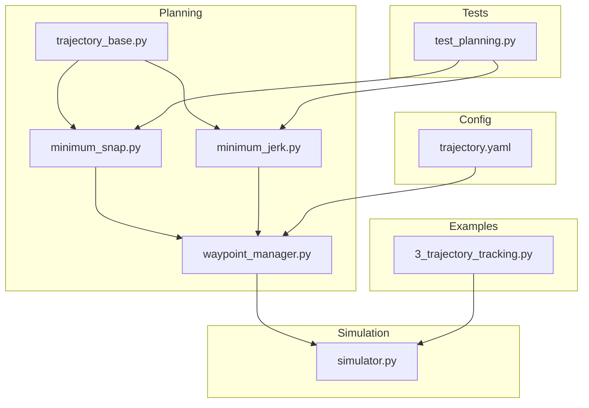
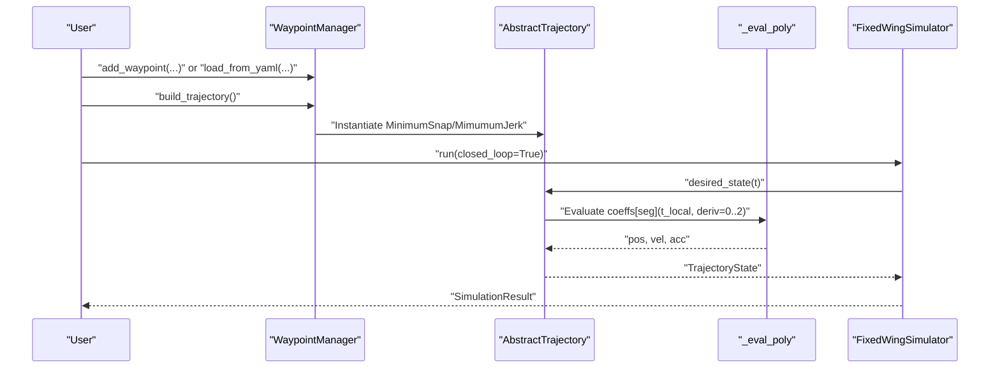
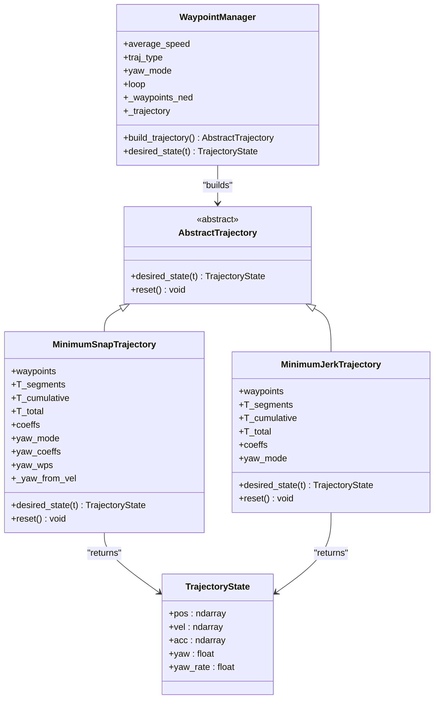
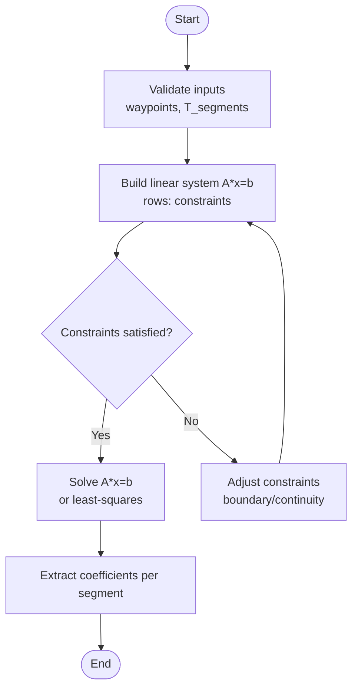

# Trajectory Algorithms

<cite>
**Referenced Files in This Document**
- [minimum_snap.py](file://src/planning/minimum_snap.py)
- [minimum_jerk.py](file://src/planning/minimum_jerk.py)
- [trajectory_base.py](file://src/planning/trajectory_base.py)
- [waypoint_manager.py](file://src/planning/waypoint_manager.py)
- [trajectory.yaml](file://config/trajectory.yaml)
- [test_planning.py](file://tests/test_planning.py)
- [3_trajectory_tracking.py](file://examples/3_trajectory_tracking.py)
- [simulator.py](file://src/simulation/simulator.py)
</cite>

## Table of Contents
1. [Introduction](#introduction)
2. [Project Structure](#project-structure)
3. [Core Components](#core-components)
4. [Architecture Overview](#architecture-overview)
5. [Detailed Component Analysis](#detailed-component-analysis)
6. [Dependency Analysis](#dependency-analysis)
7. [Performance Considerations](#performance-considerations)
8. [Troubleshooting Guide](#troubleshooting-guide)
9. [Conclusion](#conclusion)
10. [Appendices](#appendices)

## Introduction
This document explains the trajectory generation algorithms implemented for fixed-wing flight simulation. It focuses on two polynomial-based approaches:
- Minimum snap trajectory: smoothness optimized by minimizing the fourth derivative of position.
- Minimum jerk trajectory: smoother velocity profile achieved by minimizing the third derivative of position.

Both algorithms construct piecewise polynomials per segment, enforce boundary conditions at waypoints and segment ends, and support continuity across segment junctions. The documentation covers mathematical foundations, boundary conditions, optimization criteria, parameterization, segment-wise construction, continuity requirements, algorithm selection, computational complexity, performance characteristics, numerical stability, edge-case handling, and integration with the control system.

## Project Structure
The trajectory system resides under the planning module and integrates with the simulation and control layers:
- Planning: polynomial trajectory builders and base interfaces
- Simulation: trajectory integration into closed-loop flight control
- Tests and examples: verification and usage demonstrations

**Diagram sources**
- [trajectory_base.py](file://src/planning/trajectory_base.py#L1-L47)
- [minimum_snap.py](file://src/planning/minimum_snap.py#L1-L253)
- [minimum_jerk.py](file://src/planning/minimum_jerk.py#L1-L71)
- [waypoint_manager.py](file://src/planning/waypoint_manager.py#L1-L208)
- [simulator.py](file://src/simulation/simulator.py#L120-L319)
- [trajectory.yaml](file://config/trajectory.yaml#L1-L23)
- [test_planning.py](file://tests/test_planning.py#L1-L200)
- [3_trajectory_tracking.py](file://examples/3_trajectory_tracking.py#L1-L194)

**Section sources**
- [trajectory_base.py](file://src/planning/trajectory_base.py#L1-L47)
- [minimum_snap.py](file://src/planning/minimum_snap.py#L1-L253)
- [minimum_jerk.py](file://src/planning/minimum_jerk.py#L1-L71)
- [waypoint_manager.py](file://src/planning/waypoint_manager.py#L1-L208)
- [simulator.py](file://src/simulation/simulator.py#L120-L319)
- [trajectory.yaml](file://config/trajectory.yaml#L1-L23)
- [test_planning.py](file://tests/test_planning.py#L1-L200)
- [3_trajectory_tracking.py](file://examples/3_trajectory_tracking.py#L1-L194)

## Core Components
- AbstractTrajectory and TrajectoryState define the common interface and state representation used by all trajectory types.
- MinimumSnapTrajectory constructs smooth piecewise polynomials (degree 7 for deriv_order=4) per segment, enforcing boundary conditions and continuity.
- MinimumJerkTrajectory reuses the same coefficient solver with deriv_order=3 to produce 5th-order polynomials per segment.
- WaypointManager manages waypoints, computes segment times, and builds trajectory instances.
- Tests validate correctness, continuity, and numerical stability.

Key implementation references:
- Trajectory interface and state: [trajectory_base.py](file://src/planning/trajectory_base.py#L16-L47)
- Minimum snap solver and evaluator: [minimum_snap.py](file://src/planning/minimum_snap.py#L47-L164)
- Minimum jerk wrapper: [minimum_jerk.py](file://src/planning/minimum_jerk.py#L17-L71)
- Waypoint management and trajectory factory: [waypoint_manager.py](file://src/planning/waypoint_manager.py#L20-L208)
- Example usage and integration: [3_trajectory_tracking.py](file://examples/3_trajectory_tracking.py#L70-L98), [simulator.py](file://src/simulation/simulator.py#L218-L230)

**Section sources**
- [trajectory_base.py](file://src/planning/trajectory_base.py#L16-L47)
- [minimum_snap.py](file://src/planning/minimum_snap.py#L47-L164)
- [minimum_jerk.py](file://src/planning/minimum_jerk.py#L17-L71)
- [waypoint_manager.py](file://src/planning/waypoint_manager.py#L20-L208)
- [3_trajectory_tracking.py](file://examples/3_trajectory_tracking.py#L70-L98)
- [simulator.py](file://src/simulation/simulator.py#L218-L230)

## Architecture Overview
The trajectory pipeline:
- WaypointManager loads or builds a list of NED waypoints and selects a trajectory type.
- For minimum snap/jerk, the coefficient solver constructs per-segment polynomials.
- At runtime, desired_state(t) evaluates the appropriate segment’s polynomial and derivatives.
- The simulation integrates the trajectory with the control system for closed-loop tracking.

**Diagram sources**
- [waypoint_manager.py](file://src/planning/waypoint_manager.py#L127-L160)
- [minimum_snap.py](file://src/planning/minimum_snap.py#L227-L249)
- [minimum_jerk.py](file://src/planning/minimum_jerk.py#L50-L67)
- [simulator.py](file://src/simulation/simulator.py#L239-L344)

## Detailed Component Analysis

### Mathematical Foundations and Optimization Criteria
- Minimum snap trajectory minimizes the integral of the squared fourth derivative of position across each segment, promoting smooth acceleration and minimal snap.
- Minimum jerk trajectory minimizes the integral of the squared third derivative, yielding smoother velocity profiles and reduced jerk.
- Both use piecewise polynomials per segment; the degree depends on the chosen deriv_order:
  - Minimum snap: degree 2*deriv_order - 1 = 7 for deriv_order=4.
  - Minimum jerk: degree 2*deriv_order - 1 = 5 for deriv_order=3.

Boundary conditions and continuity:
- Start and end positions for each segment are enforced.
- Derivatives 1..(deriv_order-1) are constrained to zero at the first and last segment ends.
- Intermediate waypoints enforce continuity of derivatives 1..(2*deriv_order - 1) across segment boundaries.
- Optional stop-at-waypoints mode enforces zero velocity at intermediate waypoints by overriding continuity constraints.

Matrix formulation:
- The solver constructs a linear system A*x = b, where rows encode constraints (positions, derivatives, continuity).
- Coefficients are solved via direct linear algebra with fallback to least-squares when the system is singular.

Evaluation:
- Polynomial evaluation uses derivative-specific coefficient vectors to compute position, velocity, and acceleration.

References:
- Solver and constraints: [minimum_snap.py](file://src/planning/minimum_snap.py#L47-L142)
- Evaluation routine: [minimum_snap.py](file://src/planning/minimum_snap.py#L145-L164)
- Jerk specialization: [minimum_jerk.py](file://src/planning/minimum_jerk.py#L44-L48)

**Section sources**
- [minimum_snap.py](file://src/planning/minimum_snap.py#L47-L142)
- [minimum_snap.py](file://src/planning/minimum_snap.py#L145-L164)
- [minimum_jerk.py](file://src/planning/minimum_jerk.py#L44-L48)

### Minimum Snap Trajectory
- Constructor:
  - Validates waypoints shape and minimum count.
  - Computes segment durations from distances and average speed if not provided.
  - Builds cumulative time array and total duration.
  - Calls the coefficient solver with deriv_order=4.
  - Supports yaw modes: zero, yaw_follow, fixed.
- Runtime:
  - desired_state clamps time to [0, T_total], determines segment, evaluates polynomial derivatives, and computes yaw based on velocity.

Key references:
- Constructor and initialization: [minimum_snap.py](file://src/planning/minimum_snap.py#L181-L212)
- desired_state evaluation: [minimum_snap.py](file://src/planning/minimum_snap.py#L227-L249)

**Section sources**
- [minimum_snap.py](file://src/planning/minimum_snap.py#L181-L212)
- [minimum_snap.py](file://src/planning/minimum_snap.py#L227-L249)

### Minimum Jerk Trajectory
- Constructor:
  - Reuses the same coefficient solver with deriv_order=3 to produce 5th-order polynomials per segment.
  - Inherits the same parameterization and segment-time computation as minimum snap.
- Runtime:
  - desired_state mirrors minimum snap behavior, evaluating position, velocity, and acceleration from the segment’s polynomial coefficients.

Key references:
- Constructor and coefficient reuse: [minimum_jerk.py](file://src/planning/minimum_jerk.py#L24-L48)
- desired_state evaluation: [minimum_jerk.py](file://src/planning/minimum_jerk.py#L50-L67)

**Section sources**
- [minimum_jerk.py](file://src/planning/minimum_jerk.py#L24-L48)
- [minimum_jerk.py](file://src/planning/minimum_jerk.py#L50-L67)

### Waypoint Management and Parameterization
- WaypointManager:
  - Stores waypoints in NED coordinates (altitudes converted from positive-up to negative-down).
  - Builds trajectory instances based on traj_type and yaw_mode.
  - Computes segment times from average speed if not provided.
  - Provides helpers to load/save from YAML and to query the active segment.
- Configuration:
  - trajectory.yaml defines type, average_speed, yaw_mode, waypoints, and loop flag.

Key references:
- Waypoint storage and conversion: [waypoint_manager.py](file://src/planning/waypoint_manager.py#L54-L74)
- Trajectory builder: [waypoint_manager.py](file://src/planning/waypoint_manager.py#L127-L160)
- YAML loader: [waypoint_manager.py](file://src/planning/waypoint_manager.py#L80-L107)
- Configuration: [trajectory.yaml](file://config/trajectory.yaml#L1-L23)

**Section sources**
- [waypoint_manager.py](file://src/planning/waypoint_manager.py#L54-L74)
- [waypoint_manager.py](file://src/planning/waypoint_manager.py#L127-L160)
- [waypoint_manager.py](file://src/planning/waypoint_manager.py#L80-L107)
- [trajectory.yaml](file://config/trajectory.yaml#L1-L23)

### Integration with Control Systems
- The simulation initializes a WaypointManager with the selected traj_type and integrates desired_state outputs into the closed-loop control stack.
- The example demonstrates closed-loop AUTO mode with minimum snap trajectory tracking.

Key references:
- Simulator integration: [simulator.py](file://src/simulation/simulator.py#L218-L230)
- Example usage: [3_trajectory_tracking.py](file://examples/3_trajectory_tracking.py#L70-L98)

**Section sources**
- [simulator.py](file://src/simulation/simulator.py#L218-L230)
- [3_trajectory_tracking.py](file://examples/3_trajectory_tracking.py#L70-L98)

## Dependency Analysis

**Diagram sources**
- [trajectory_base.py](file://src/planning/trajectory_base.py#L16-L47)
- [minimum_snap.py](file://src/planning/minimum_snap.py#L167-L253)
- [minimum_jerk.py](file://src/planning/minimum_jerk.py#L17-L71)
- [waypoint_manager.py](file://src/planning/waypoint_manager.py#L20-L208)

**Section sources**
- [trajectory_base.py](file://src/planning/trajectory_base.py#L16-L47)
- [minimum_snap.py](file://src/planning/minimum_snap.py#L167-L253)
- [minimum_jerk.py](file://src/planning/minimum_jerk.py#L17-L71)
- [waypoint_manager.py](file://src/planning/waypoint_manager.py#L20-L208)

## Performance Considerations
- Computational complexity:
  - The solver constructs a dense linear system with size proportional to the number of segments and the polynomial order (M = 2*deriv_order). For N segments, the system is roughly (N*M) x (N*M).
  - Direct solve scales as O(N^3*M^3) in the worst case; least-squares fallback may be used when the system is singular.
- Memory usage:
  - Coefficients array shape is (n_segments, 2*deriv_order, n_dimensions). For minimum snap (deriv_order=4), this is (N, 8, 3); for minimum jerk (deriv_order=3), it is (N, 6, 3).
  - Additional arrays store cumulative segment times and total duration.
- Numerical stability:
  - Large segment durations can lead to ill-conditioned matrices; the solver warns and falls back to least-squares.
  - Tests confirm finite coefficients even for long segments and validate continuity and boundary satisfaction.

Practical guidance:
- Prefer minimum snap for aggressive maneuvers requiring smooth accelerations; minimum jerk for smoother velocity transitions.
- Tune average_speed to balance segment durations and smoothness; very small speeds increase segment count and computation cost.
- Use stop_at_waypoints when precise waypoint stops are required; note it overrides continuity for velocity at intermediate waypoints.

**Section sources**
- [minimum_snap.py](file://src/planning/minimum_snap.py#L131-L142)
- [test_planning.py](file://tests/test_planning.py#L109-L116)

## Troubleshooting Guide
Common issues and remedies:
- Fewer than two waypoints:
  - WaypointManager raises an error when attempting to build a trajectory with less than two waypoints.
- Non-finite coefficients:
  - The solver checks condition number and falls back to least-squares; tests assert finite coefficients.
- Large segment durations:
  - Warning printed for ill-conditioned systems; reduce segment times or adjust average_speed.
- Yaw mode behavior:
  - yaw_follow computes yaw from velocity; ensure horizontal velocity is non-zero to avoid undefined yaw.
- Waypoint altitude sign:
  - WaypointManager converts altitudes from positive-up to NED down; verify inputs accordingly.

Validation references:
- WaypointManager error handling: [waypoint_manager.py](file://src/planning/waypoint_manager.py#L139-L140)
- Solver robustness: [minimum_snap.py](file://src/planning/minimum_snap.py#L131-L138)
- Tests for finite coefficients and continuity: [test_planning.py](file://tests/test_planning.py#L104-L116), [test_planning.py](file://tests/test_planning.py#L96-L102)

**Section sources**
- [waypoint_manager.py](file://src/planning/waypoint_manager.py#L139-L140)
- [minimum_snap.py](file://src/planning/minimum_snap.py#L131-L138)
- [test_planning.py](file://tests/test_planning.py#L96-L102)
- [test_planning.py](file://tests/test_planning.py#L104-L116)

## Conclusion
The trajectory system provides robust, configurable polynomial-based path generation suitable for fixed-wing applications. Minimum snap emphasizes smooth accelerations, while minimum jerk prioritizes smooth velocity profiles. Together with continuity enforcement, boundary conditions, and yaw modeling, they enable reliable closed-loop flight simulations. The modular design allows easy switching between algorithms and integration with the broader control stack.

## Appendices

### Algorithm Selection Criteria
- Choose minimum snap when:
  - Smooth accelerations and minimal snap are desired (e.g., aggressive turns).
  - Computational budget permits higher-degree polynomials.
- Choose minimum jerk when:
  - Smoother velocity transitions are preferred (e.g., surveillance or reconnaissance).
  - Lower-degree polynomials suffice and reduce computation overhead.

### Practical Examples and Use Cases
- Square trajectory tracking:
  - Demonstrated in the example script using minimum snap with AUTO mode.
- Parameter tuning guidelines:
  - average_speed controls segment durations; adjust to balance smoothness and speed.
  - yaw_mode affects heading alignment; use yaw_follow for natural turning.
  - stop_at_waypoints enforces waypoint stops; use judiciously to avoid excessive deceleration.

References:
- Example usage: [3_trajectory_tracking.py](file://examples/3_trajectory_tracking.py#L70-L98)
- Configuration: [trajectory.yaml](file://config/trajectory.yaml#L1-L23)

### Mathematical Flow for Coefficient Solver

**Diagram sources**
- [minimum_snap.py](file://src/planning/minimum_snap.py#L75-L142)