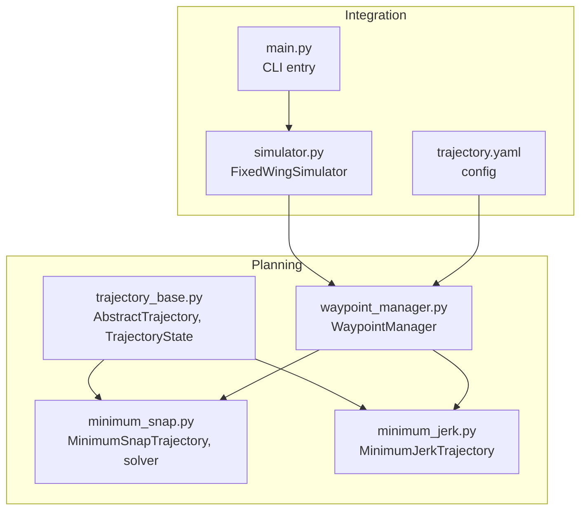
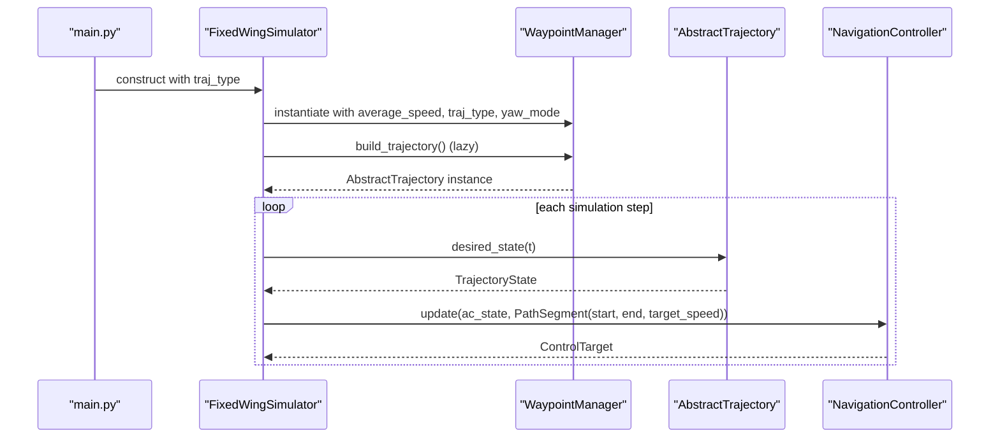
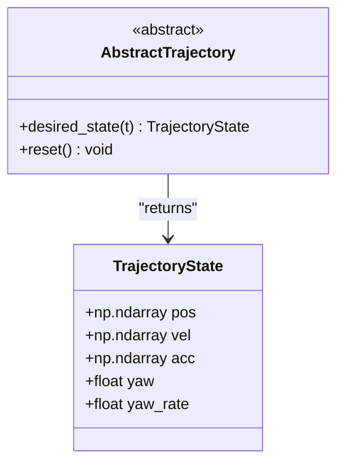
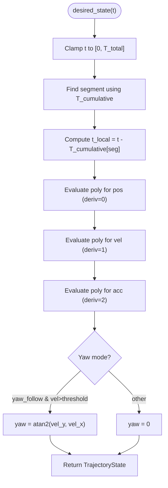
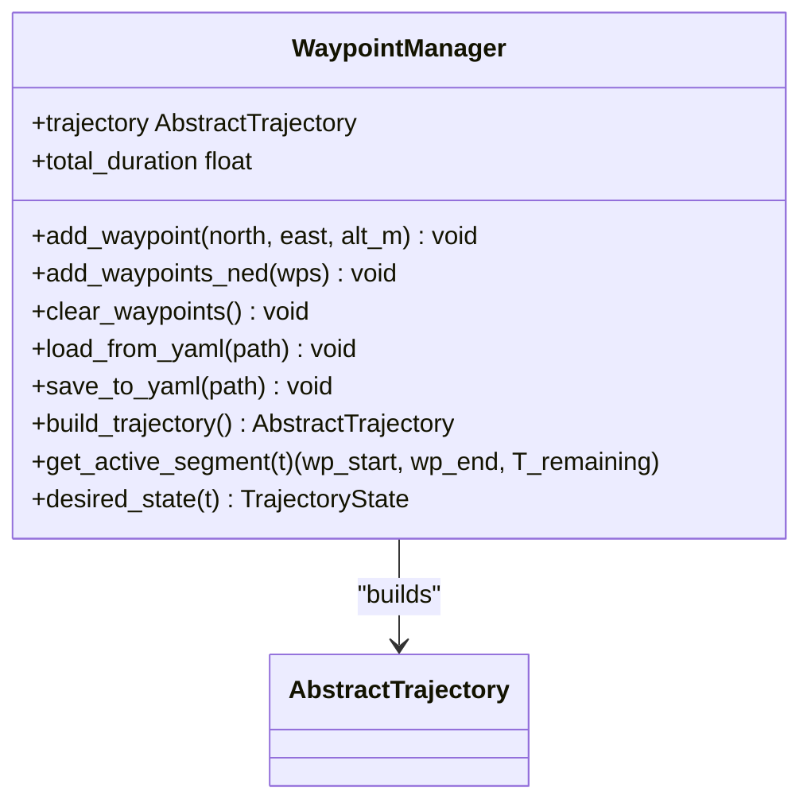
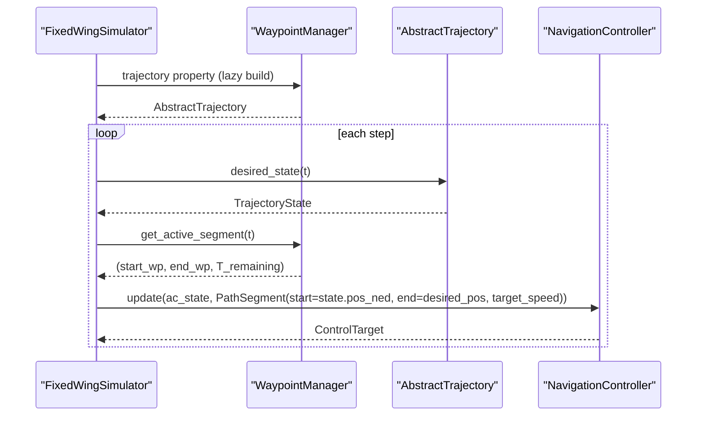
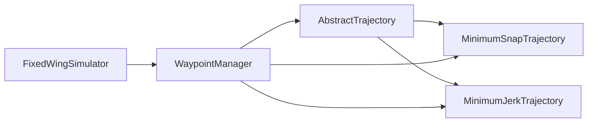

# Trajectory Base Classes and Interfaces

<cite>
**Referenced Files in This Document**
- [trajectory_base.py](file://src/planning/trajectory_base.py)
- [minimum_snap.py](file://src/planning/minimum_snap.py)
- [minimum_jerk.py](file://src/planning/minimum_jerk.py)
- [waypoint_manager.py](file://src/planning/waypoint_manager.py)
- [__init__.py](file://src/planning/__init__.py)
- [trajectory.yaml](file://config/trajectory.yaml)
- [simulator.py](file://src/simulation/simulator.py)
- [test_planning.py](file://tests/test_planning.py)
- [main.py](file://main.py)
</cite>

## Table of Contents
1. [Introduction](#introduction)
2. [Project Structure](#project-structure)
3. [Core Components](#core-components)
4. [Architecture Overview](#architecture-overview)
5. [Detailed Component Analysis](#detailed-component-analysis)
6. [Dependency Analysis](#dependency-analysis)
7. [Performance Considerations](#performance-considerations)
8. [Troubleshooting Guide](#troubleshooting-guide)
9. [Conclusion](#conclusion)
10. [Appendices](#appendices)

## Introduction
This document describes the trajectory base architecture and abstract interfaces used by the fixed-wing simulation stack. It focuses on:
- The AbstractTrajectory base class and the TrajectoryState data structure
- Interface contracts and method specifications
- Trajectory parameterization schemes, time discretization, and state interpolation
- Composition patterns, inheritance hierarchies, and extensibility mechanisms
- Practical examples for implementing custom trajectory algorithms and integrating with the broader planning system
- Validation, error handling, and debugging techniques
- Performance considerations, memory management, and computational efficiency

## Project Structure
The trajectory system resides under the planning package and integrates with the simulation engine. Key files:
- Base abstraction and state definition
- Concrete trajectory implementations (minimum snap and minimum jerk)
- Waypoint management and trajectory factory
- Integration with the simulation loop

**Diagram sources**
- [trajectory_base.py](file://src/planning/trajectory_base.py#L16-L47)
- [minimum_snap.py](file://src/planning/minimum_snap.py#L167-L253)
- [minimum_jerk.py](file://src/planning/minimum_jerk.py#L17-L71)
- [waypoint_manager.py](file://src/planning/waypoint_manager.py#L20-L208)
- [simulator.py](file://src/simulation/simulator.py#L218-L230)
- [trajectory.yaml](file://config/trajectory.yaml#L1-L23)
- [main.py](file://main.py#L69-L73)

**Section sources**
- [__init__.py](file://src/planning/__init__.py#L1-L14)
- [trajectory_base.py](file://src/planning/trajectory_base.py#L1-L47)
- [minimum_snap.py](file://src/planning/minimum_snap.py#L1-L253)
- [minimum_jerk.py](file://src/planning/minimum_jerk.py#L1-L71)
- [waypoint_manager.py](file://src/planning/waypoint_manager.py#L1-L208)
- [simulator.py](file://src/simulation/simulator.py#L218-L230)
- [trajectory.yaml](file://config/trajectory.yaml#L1-L23)
- [main.py](file://main.py#L69-L73)

## Core Components
- AbstractTrajectory: Defines the contract for all trajectory types. The primary method desired_state(t) returns a TrajectoryState at time t. A reset() hook allows subclasses to clear internal state.
- TrajectoryState: A data structure encapsulating desired state vectors and yaw-related quantities at a time instant. It includes position, velocity, acceleration, desired yaw, and desired yaw rate.

Key characteristics:
- Stateless evaluation: desired_state is deterministic and does not mutate internal state.
- NED spatial frame: Positions and velocities are in NED coordinates.
- Extensible: New trajectory types implement AbstractTrajectory and return TrajectoryState.

**Section sources**
- [trajectory_base.py](file://src/planning/trajectory_base.py#L16-L47)

## Architecture Overview
The planning subsystem composes a trajectory from waypoints and exposes a uniform interface to the simulation loop. WaypointManager constructs a trajectory object from a list of NED waypoints and caches it. The simulation loop queries desired_state(t) at each time step to drive the navigation controller.

**Diagram sources**
- [main.py](file://main.py#L69-L73)
- [simulator.py](file://src/simulation/simulator.py#L218-L230)
- [waypoint_manager.py](file://src/planning/waypoint_manager.py#L127-L167)
- [minimum_snap.py](file://src/planning/minimum_snap.py#L167-L253)
- [minimum_jerk.py](file://src/planning/minimum_jerk.py#L17-L71)

## Detailed Component Analysis

### AbstractTrajectory and TrajectoryState
- AbstractTrajectory defines:
  - desired_state(t: float) -> TrajectoryState
  - reset() -> None (optional override)
- TrajectoryState fields:
  - pos: np.ndarray shape (3,), NED meters
  - vel: np.ndarray shape (3,), m/s
  - acc: np.ndarray shape (3,), m/s^2
  - yaw: float, rad
  - yaw_rate: float, rad/s

Design rationale:
- Dataclass with default factories ensures consistent zero-initialization semantics.
- Uniform return type simplifies downstream control logic.

**Diagram sources**
- [trajectory_base.py](file://src/planning/trajectory_base.py#L16-L47)

**Section sources**
- [trajectory_base.py](file://src/planning/trajectory_base.py#L16-L47)

### MinimumSnapTrajectory
- Parameterization:
  - Piecewise polynomials per segment with degree 2*deriv_order - 1.
  - Default deriv_order=4 yields 7th-order polynomials per segment.
  - Boundary conditions: zero derivatives 1..(deriv_order-1) at start/end.
  - Continuity enforced across segment boundaries for derivatives 1..(2*deriv_order-1).
  - Optional stop_at_waypoints enforces zero velocity at intermediate waypoints.
- Time discretization:
  - T_segments can be provided or estimated from waypoint distances and average_speed.
  - Cumulative segment times enable O(1) segment lookup via searchsorted.
- State interpolation:
  - _eval_poly computes position, velocity, acceleration from segment coefficients.
  - Yaw logic: yaw_follow mode sets yaw from velocity direction; otherwise yaw is zero or derived from separate yaw trajectory.
- Extensibility:
  - Derived classes can override desired_state to add custom yaw or higher derivatives.

**Diagram sources**
- [minimum_snap.py](file://src/planning/minimum_snap.py#L167-L253)
- [minimum_snap.py](file://src/planning/minimum_snap.py#L145-L164)

**Section sources**
- [minimum_snap.py](file://src/planning/minimum_snap.py#L167-L253)
- [minimum_snap.py](file://src/planning/minimum_snap.py#L47-L142)
- [minimum_snap.py](file://src/planning/minimum_snap.py#L145-L164)

### MinimumJerkTrajectory
- Parameterization:
  - Same solver as minimum snap but with deriv_order=3, yielding 5th-order polynomials per segment.
  - Interface identical to MinimumSnapTrajectory.
- Time discretization and state interpolation:
  - Uses the same cumulative timing and polynomial evaluation utilities.

**Section sources**
- [minimum_jerk.py](file://src/planning/minimum_jerk.py#L17-L71)

### WaypointManager
- Responsibilities:
  - Stores NED waypoints (altitudes internally converted to NED down).
  - Builds trajectory instances (MinimumSnapTrajectory or MinimumJerkTrajectory) from current waypoints.
  - Provides convenience methods to load/save waypoints from YAML and to query the active segment at time t.
- Factory behavior:
  - Caches the trajectory instance and invalidates it when waypoints change.
  - Supports looping by closing the path when loop=True and the first/last waypoints differ below a tolerance.

**Diagram sources**
- [waypoint_manager.py](file://src/planning/waypoint_manager.py#L20-L208)

**Section sources**
- [waypoint_manager.py](file://src/planning/waypoint_manager.py#L20-L208)
- [trajectory.yaml](file://config/trajectory.yaml#L1-L23)

### Integration with the Simulation Loop
- FixedWingSimulator constructs a WaypointManager with the chosen traj_type and initializes the navigation controller.
- During closed-loop simulation, the loop queries desired_state(t) from the trajectory and constructs a PathSegment from the aircraft’s current position to the desired position (clamped to the active segment’s altitude bounds).
- The navigation controller produces control targets that feed into the attitude/rate/servo controllers.

**Diagram sources**
- [simulator.py](file://src/simulation/simulator.py#L478-L498)
- [waypoint_manager.py](file://src/planning/waypoint_manager.py#L162-L208)
- [minimum_snap.py](file://src/planning/minimum_snap.py#L227-L249)

**Section sources**
- [simulator.py](file://src/simulation/simulator.py#L218-L230)
- [simulator.py](file://src/simulation/simulator.py#L478-L498)
- [waypoint_manager.py](file://src/planning/waypoint_manager.py#L162-L208)

## Dependency Analysis
- AbstractTrajectory is the central contract; all concrete trajectories depend on it.
- MinimumSnapTrajectory and MinimumJerkTrajectory both depend on the shared polynomial solver and evaluation utilities.
- WaypointManager depends on AbstractTrajectory and the concrete implementations to build trajectories.
- FixedWingSimulator depends on WaypointManager and consumes TrajectoryState for control.

**Diagram sources**
- [trajectory_base.py](file://src/planning/trajectory_base.py#L26-L47)
- [minimum_snap.py](file://src/planning/minimum_snap.py#L167-L253)
- [minimum_jerk.py](file://src/planning/minimum_jerk.py#L17-L71)
- [waypoint_manager.py](file://src/planning/waypoint_manager.py#L127-L167)
- [simulator.py](file://src/simulation/simulator.py#L218-L230)

**Section sources**
- [__init__.py](file://src/planning/__init__.py#L3-L13)

## Performance Considerations
- State evaluation complexity:
  - desired_state is O(1) per query: constant-time segment lookup and polynomial evaluation.
- Memory footprint:
  - Coefficients are precomputed and stored per segment; memory scales with number of segments and dimensionality.
- Numerical stability:
  - The solver warns on ill-conditioned systems and falls back to least-squares when necessary.
- Computational efficiency:
  - Prefer caching the trajectory object via WaypointManager. Repeatedly constructing trajectories is unnecessary overhead.
  - Use reasonable segment durations to avoid extremely large polynomial coefficients that could degrade numerical conditioning.

[No sources needed since this section provides general guidance]

## Troubleshooting Guide
Common issues and remedies:
- Invalid number of waypoints:
  - WaypointManager raises a ValueError when fewer than two waypoints are defined.
- Segment time estimation:
  - If T_segments is None, segment durations are estimated from waypoint distances and average_speed; ensure average_speed reflects realistic cruise speed.
- Numerical warnings:
  - Large segment durations can lead to ill-conditioned linear systems; reduce segment lengths or adjust average_speed.
- Yaw behavior:
  - In yaw_follow mode, yaw is set only when horizontal velocity exceeds a small threshold; verify velocity magnitude and direction.
- Integration errors:
  - The simulation loop catches integration errors and stops gracefully; inspect logs and reduce step size or trim settings if needed.

Validation and testing references:
- Tests cover coefficient shapes, boundary satisfaction, continuity, finite coefficients, clamping behavior, and yaw mode correctness.

**Section sources**
- [waypoint_manager.py](file://src/planning/waypoint_manager.py#L127-L167)
- [minimum_snap.py](file://src/planning/minimum_snap.py#L132-L142)
- [test_planning.py](file://tests/test_planning.py#L51-L116)
- [test_planning.py](file://tests/test_planning.py#L122-L186)
- [test_planning.py](file://tests/test_planning.py#L192-L246)
- [test_planning.py](file://tests/test_planning.py#L252-L328)
- [simulator.py](file://src/simulation/simulator.py#L558-L562)

## Conclusion
The trajectory system provides a clean, extensible abstraction for fixed-wing trajectory generation. AbstractTrajectory unifies interface contracts, while MinimumSnapTrajectory and MinimumJerkTrajectory offer robust parameterizations suitable for different performance criteria. WaypointManager offers a practical factory and persistence layer, and the simulation loop integrates trajectory evaluation seamlessly into the control pipeline. The design emphasizes determinism, numerical robustness, and ease of extension.

[No sources needed since this section summarizes without analyzing specific files]

## Appendices

### Practical Example: Implementing a Custom Trajectory
Steps to extend the system:
1. Define a new class inheriting from AbstractTrajectory.
2. Implement desired_state(t) to return a TrajectoryState with position, velocity, acceleration, yaw, and yaw_rate.
3. Optionally override reset() to clear internal state.
4. Integrate with WaypointManager by adding support for your trajectory type in the factory method, or use it standalone.
5. Validate behavior with unit tests similar to the existing test suite.

Integration points:
- Use the same NED frame and units as existing implementations.
- Ensure desired_state is thread-safe and stateless if used in multi-threaded contexts.

**Section sources**
- [trajectory_base.py](file://src/planning/trajectory_base.py#L26-L47)
- [waypoint_manager.py](file://src/planning/waypoint_manager.py#L127-L167)

### Configuration and CLI Integration
- CLI argument traj selects the trajectory type for the simulation.
- WaypointManager supports loading from YAML for quick mission setup.

**Section sources**
- [main.py](file://main.py#L69-L73)
- [trajectory.yaml](file://config/trajectory.yaml#L1-L23)
- [waypoint_manager.py](file://src/planning/waypoint_manager.py#L80-L122)