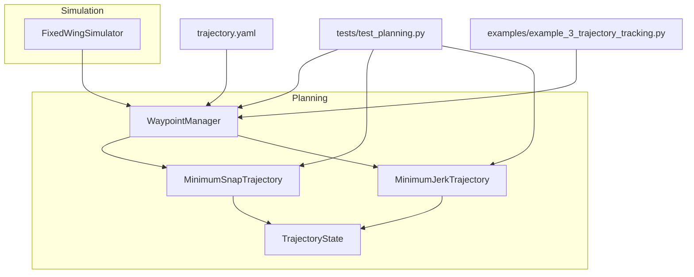
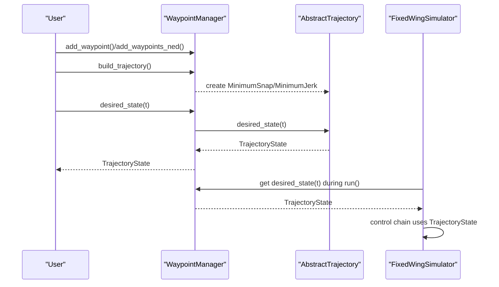
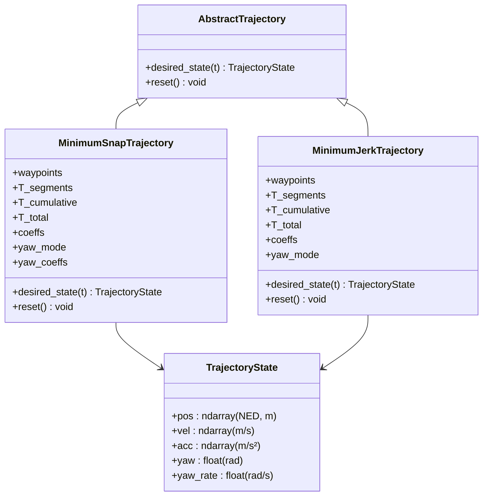
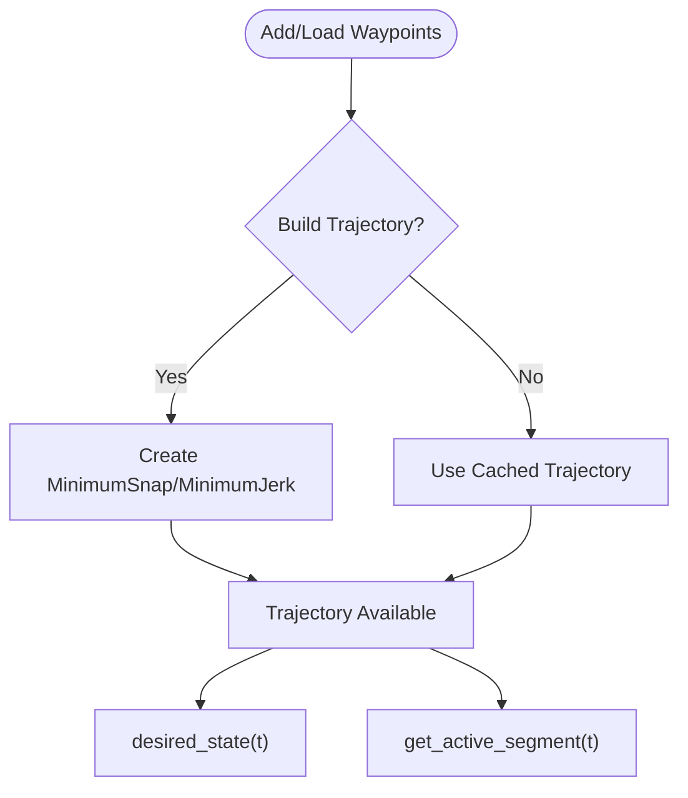
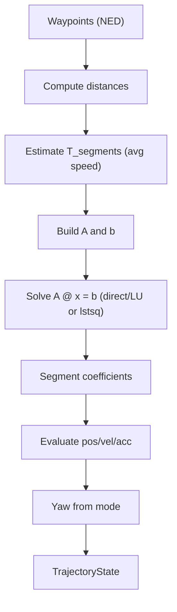
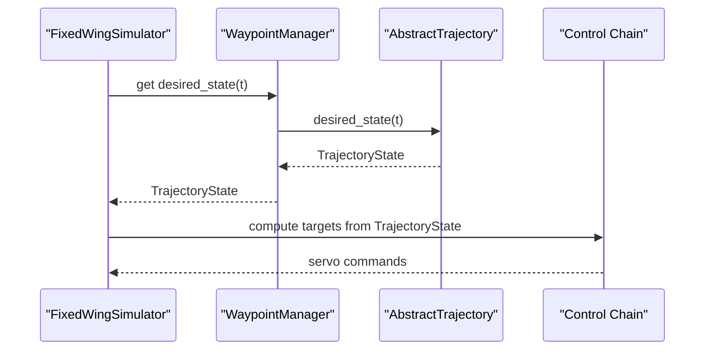
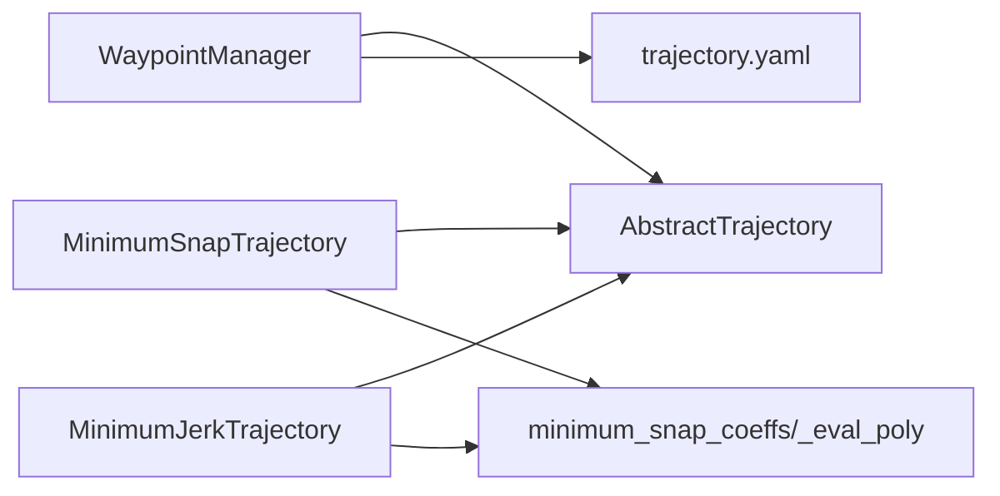

# Trajectory Planning and Waypoint Management

<cite>
**Referenced Files in This Document**
- [trajectory_base.py](file://src/planning/trajectory_base.py)
- [minimum_snap.py](file://src/planning/minimum_snap.py)
- [minimum_jerk.py](file://src/planning/minimum_jerk.py)
- [waypoint_manager.py](file://src/planning/waypoint_manager.py)
- [trajectory.yaml](file://config/trajectory.yaml)
- [test_planning.py](file://tests/test_planning.py)
- [example_3_trajectory_tracking.py](file://examples/example_3_trajectory_tracking.py)
- [simulator.py](file://src/simulation/simulator.py)
</cite>

## Table of Contents
1. [Introduction](#introduction)
2. [Project Structure](#project-structure)
3. [Core Components](#core-components)
4. [Architecture Overview](#architecture-overview)
5. [Detailed Component Analysis](#detailed-component-analysis)
6. [Dependency Analysis](#dependency-analysis)
7. [Performance Considerations](#performance-considerations)
8. [Troubleshooting Guide](#troubleshooting-guide)
9. [Conclusion](#conclusion)
10. [Appendices](#appendices)

## Introduction
This document explains the trajectory planning and waypoint management system used by the fixed-wing simulator. It covers:
- Waypoint management: storage, retrieval, mission planning, and path segment management
- Minimum snap and minimum jerk trajectory generation
- Polynomial trajectory construction and evaluation
- Abstract trajectory interfaces, state definitions, and parameterization
- Practical examples for configuration, generation, and mission setup
- Optimization, smoothness criteria, and computational efficiency
- Guidance for integrating custom trajectory algorithms with the control system

## Project Structure
The trajectory planning subsystem resides under src/planning and integrates with the simulation engine under src/simulation. Key modules:
- Abstract trajectory interface and state container
- Minimum snap and minimum jerk trajectory implementations
- Waypoint manager for mission definition and trajectory factory
- Configuration and tests for validation
- Example usage in closed-loop simulation

**Diagram sources**
- [waypoint_manager.py](file://src/planning/waypoint_manager.py#L20-L208)
- [minimum_snap.py](file://src/planning/minimum_snap.py#L167-L253)
- [minimum_jerk.py](file://src/planning/minimum_jerk.py#L17-L71)
- [trajectory_base.py](file://src/planning/trajectory_base.py#L16-L47)
- [trajectory.yaml](file://config/trajectory.yaml#L1-L23)
- [test_planning.py](file://tests/test_planning.py#L1-L328)
- [example_3_trajectory_tracking.py](file://examples/example_3_trajectory_tracking.py#L1-L194)
- [simulator.py](file://src/simulation/simulator.py#L218-L230)

**Section sources**
- [waypoint_manager.py](file://src/planning/waypoint_manager.py#L1-L208)
- [minimum_snap.py](file://src/planning/minimum_snap.py#L1-L253)
- [minimum_jerk.py](file://src/planning/minimum_jerk.py#L1-L71)
- [trajectory_base.py](file://src/planning/trajectory_base.py#L1-L47)
- [trajectory.yaml](file://config/trajectory.yaml#L1-L23)
- [test_planning.py](file://tests/test_planning.py#L1-L328)
- [example_3_trajectory_tracking.py](file://examples/example_3_trajectory_tracking.py#L1-L194)
- [simulator.py](file://src/simulation/simulator.py#L218-L230)

## Core Components
- AbstractTrajectory: Defines the uniform interface desired_state(t) for all trajectory types.
- TrajectoryState: Encapsulates desired position, velocity, acceleration, yaw, and yaw rate in NED coordinates.
- WaypointManager: Stores NED waypoints, loads/saves mission configs, builds and caches trajectories, and exposes desired_state and active segment access.
- MinimumSnapTrajectory: Piecewise polynomial trajectory with C⁴ continuity (4th derivative minimization), supporting optional stop-at-waypoints and configurable yaw modes.
- MinimumJerkTrajectory: Reuses the same solver with deriv_order=3 to produce C³ continuity (3rd derivative minimization) using 5th-order polynomials per segment.

Key parameterization:
- Waypoints: NED [north, east, down]; altitudes given as “positive-up” are internally converted to NED down.
- Segment times: Either provided explicitly or estimated from average speed and distances.
- Yaw modes: Follow velocity direction, zero, or fixed (with optional waypoint-wise yaw).
- Looping: Optional closure of the mission by repeating the first waypoint.

**Section sources**
- [trajectory_base.py](file://src/planning/trajectory_base.py#L16-L47)
- [waypoint_manager.py](file://src/planning/waypoint_manager.py#L20-L208)
- [minimum_snap.py](file://src/planning/minimum_snap.py#L167-L253)
- [minimum_jerk.py](file://src/planning/minimum_jerk.py#L17-L71)

## Architecture Overview
The system follows a factory-and-interface design:
- WaypointManager manages mission definition and constructs a trajectory object based on selected type.
- Trajectory objects implement AbstractTrajectory and expose desired_state(t) returning TrajectoryState.
- The simulator consumes desired_state(t) to drive the control chain.

**Diagram sources**
- [waypoint_manager.py](file://src/planning/waypoint_manager.py#L127-L167)
- [minimum_snap.py](file://src/planning/minimum_snap.py#L227-L252)
- [minimum_jerk.py](file://src/planning/minimum_jerk.py#L50-L67)
- [simulator.py](file://src/simulation/simulator.py#L478-L498)

**Section sources**
- [waypoint_manager.py](file://src/planning/waypoint_manager.py#L127-L208)
- [minimum_snap.py](file://src/planning/minimum_snap.py#L227-L252)
- [minimum_jerk.py](file://src/planning/minimum_jerk.py#L50-L67)
- [simulator.py](file://src/simulation/simulator.py#L478-L498)

## Detailed Component Analysis

### Abstract Trajectory Interfaces and State Definitions
- AbstractTrajectory: Enforces desired_state(t) and optional reset().
- TrajectoryState: Fields include NED position, velocity, acceleration, yaw, and yaw rate. All quantities are consistently expressed in NED.

**Diagram sources**
- [trajectory_base.py](file://src/planning/trajectory_base.py#L16-L47)
- [minimum_snap.py](file://src/planning/minimum_snap.py#L167-L253)
- [minimum_jerk.py](file://src/planning/minimum_jerk.py#L17-L71)

**Section sources**
- [trajectory_base.py](file://src/planning/trajectory_base.py#L16-L47)
- [minimum_snap.py](file://src/planning/minimum_snap.py#L167-L253)
- [minimum_jerk.py](file://src/planning/minimum_jerk.py#L17-L71)

### Waypoint Manager: Storage, Retrieval, Mission Planning, and Active Segment Access
- Storage: Maintains NED waypoints; altitudes given as positive-up are converted to NED down internally.
- Retrieval: Provides desired_state(t) delegation and total trajectory duration.
- Mission planning: Supports loading from and saving to YAML, selecting trajectory type, average speed, yaw mode, and loop flag.
- Path segment management: Computes the active segment and remaining time at any given time t.

**Diagram sources**
- [waypoint_manager.py](file://src/planning/waypoint_manager.py#L80-L167)
- [waypoint_manager.py](file://src/planning/waypoint_manager.py#L178-L207)

**Section sources**
- [waypoint_manager.py](file://src/planning/waypoint_manager.py#L20-L208)
- [trajectory.yaml](file://config/trajectory.yaml#L1-L23)

### Minimum Snap Trajectory Generation
- Polynomial construction: Uses a matrix-construction approach to solve A @ x = b for each spatial dimension and yaw, enforcing boundary conditions and continuity.
- Derivative order: M=4 yields 7th-order polynomials per segment; M=3 yields 5th-order polynomials (minimum jerk).
- Evaluation: _eval_poly computes position, velocity, and acceleration from segment-local time.
- Yaw handling: Supports yaw_follow (based on velocity), fixed (precomputed yaw trajectory), or zero.

**Diagram sources**
- [minimum_snap.py](file://src/planning/minimum_snap.py#L47-L142)
- [minimum_snap.py](file://src/planning/minimum_snap.py#L145-L164)
- [minimum_snap.py](file://src/planning/minimum_snap.py#L227-L252)

**Section sources**
- [minimum_snap.py](file://src/planning/minimum_snap.py#L47-L142)
- [minimum_snap.py](file://src/planning/minimum_snap.py#L145-L164)
- [minimum_snap.py](file://src/planning/minimum_snap.py#L227-L252)

### Minimum Jerk Trajectory Generation
- Reuses the same solver with deriv_order=3 to construct 5th-order polynomials per segment.
- Interface identical to minimum snap; useful when minimizing total jerk is preferred over snap.

**Section sources**
- [minimum_jerk.py](file://src/planning/minimum_jerk.py#L17-L71)
- [minimum_snap.py](file://src/planning/minimum_snap.py#L47-L71)

### Trajectory Evaluation Methods
- desired_state(t): Clips t to [0, T_total], locates the active segment, evaluates position, velocity, acceleration, and yaw according to mode.
- get_active_segment(t): Returns the current segment’s start/end waypoints and remaining time at time t.

**Section sources**
- [minimum_snap.py](file://src/planning/minimum_snap.py#L227-L252)
- [minimum_jerk.py](file://src/planning/minimum_jerk.py#L50-L67)
- [waypoint_manager.py](file://src/planning/waypoint_manager.py#L178-L207)

### Practical Examples

- Waypoint configuration and mission setup:
  - Using YAML: load_from_yaml reads type, average_speed, yaw_mode, loop, and waypoints; altitudes are converted to NED down.
  - Programmatic: add_waypoint and add_waypoints_ned populate the internal NED list; clear_waypoints resets the mission.
  - Example mission: a square pattern at constant altitude is demonstrated in the example script.

- Trajectory generation:
  - Build trajectory: build_trajectory selects the type and constructs the trajectory object.
  - Query desired state: desired_state(t) returns TrajectoryState for closed-loop control.

- Mission planning:
  - Looping: set loop=True to close the mission; the manager may auto-close if needed.
  - Active segment: get_active_segment(t) helps monitor progress and remaining time.

**Section sources**
- [trajectory.yaml](file://config/trajectory.yaml#L1-L23)
- [waypoint_manager.py](file://src/planning/waypoint_manager.py#L80-L122)
- [waypoint_manager.py](file://src/planning/waypoint_manager.py#L127-L167)
- [waypoint_manager.py](file://src/planning/waypoint_manager.py#L178-L207)
- [example_3_trajectory_tracking.py](file://examples/example_3_trajectory_tracking.py#L82-L98)

### Integration with Control Systems
- Simulator integration: FixedWingSimulator holds a WaypointManager instance and requests desired_state(t) during the control loop.
- Closed-loop usage: The simulator computes a navigation target from the desired state and feeds it to the attitude/rate/servo controllers.
- Single-waypoint altitude hold: The simulator synthesizes a trivial segment to enable altitude hold when only one waypoint is present.

**Diagram sources**
- [simulator.py](file://src/simulation/simulator.py#L478-L498)
- [waypoint_manager.py](file://src/planning/waypoint_manager.py#L205-L208)

**Section sources**
- [simulator.py](file://src/simulation/simulator.py#L218-L230)
- [simulator.py](file://src/simulation/simulator.py#L375-L408)
- [simulator.py](file://src/simulation/simulator.py#L478-L498)

## Dependency Analysis
- Internal dependencies:
  - WaypointManager depends on AbstractTrajectory and concrete trajectory implementations.
  - MinimumSnapTrajectory and MinimumJerkTrajectory share the coefficient solver and evaluation utilities.
- External dependencies:
  - NumPy for numerical computations.
  - YAML for configuration file parsing.

**Diagram sources**
- [waypoint_manager.py](file://src/planning/waypoint_manager.py#L15-L17)
- [minimum_snap.py](file://src/planning/minimum_snap.py#L21-L22)
- [minimum_jerk.py](file://src/planning/minimum_jerk.py#L13-L14)

**Section sources**
- [waypoint_manager.py](file://src/planning/waypoint_manager.py#L15-L17)
- [minimum_snap.py](file://src/planning/minimum_snap.py#L21-L22)
- [minimum_jerk.py](file://src/planning/minimum_jerk.py#L13-L14)

## Performance Considerations
- Computational complexity:
  - Coefficient solving scales with the number of constraints per segment; for typical missions (<50 waypoints), computation remains fast.
- Memory footprint:
  - Stores segment coefficients and cumulative time arrays; memory grows linearly with the number of segments.
- Real-time performance:
  - Trajectory queries are O(log n) due to cumulative time lookups; suitable for real-time simulation.
- Numerical stability:
  - Large segment durations can lead to ill-conditioned matrices; the solver falls back to least-squares and prints warnings.

**Section sources**
- [minimum_snap.py](file://src/planning/minimum_snap.py#L132-L138)
- [minimum_snap.py](file://src/planning/minimum_snap.py#L200-L205)
- [waypoint_manager.py](file://src/planning/waypoint_manager.py#L192-L201)

## Troubleshooting Guide
- Missing waypoints:
  - Building a trajectory requires at least two waypoints; otherwise, a ValueError is raised.
- Looping inconsistencies:
  - If loop is enabled but the first and last waypoints are not approximately equal, the manager closes the loop automatically.
- Initial altitude mismatch:
  - If the first waypoint altitude differs significantly from the initial aircraft altitude, the simulator adjusts the first waypoint to avoid an unintended descent.
- Yaw instability at low speeds:
  - Yaw is only computed when velocity magnitude exceeds a small threshold; otherwise, yaw is zero to avoid oscillations.
- Configuration errors:
  - YAML parsing errors or unknown trajectory types will raise exceptions; verify the YAML structure and supported keys.

**Section sources**
- [waypoint_manager.py](file://src/planning/waypoint_manager.py#L139-L145)
- [waypoint_manager.py](file://src/planning/waypoint_manager.py#L144-L145)
- [simulator.py](file://src/simulation/simulator.py#L386-L392)
- [minimum_jerk.py](file://src/planning/minimum_jerk.py#L63-L67)
- [test_planning.py](file://tests/test_planning.py#L289-L294)

## Conclusion
The trajectory planning system provides a robust, modular framework for fixed-wing missions:
- WaypointManager offers flexible mission definition and seamless trajectory construction.
- Minimum snap and minimum jerk trajectories deliver smooth, physically meaningful paths with configurable yaw behavior.
- The unified AbstractTrajectory interface and TrajectoryState data structure integrate cleanly with the control system.
- Practical examples and tests demonstrate correctness, stability, and ease of use.

## Appendices

### Smoothness Criteria and Optimization Targets
- Minimum snap: C⁴ continuity; 7th-order polynomials per segment; optimizes 4th derivative energy.
- Minimum jerk: C³ continuity; 5th-order polynomials per segment; optimizes 3rd derivative energy.
- Continuous position, velocity, acceleration, and higher-order derivatives at segment junctions ensure stable control and passenger comfort.

**Section sources**
- [minimum_snap.py](file://src/planning/minimum_snap.py#L47-L71)
- [minimum_jerk.py](file://src/planning/minimum_jerk.py#L17-L71)

### Practical Configuration Tips
- Choose trajectory type based on mission requirements: minimum jerk for smoother acceleration changes, minimum snap for stricter higher-derivative constraints.
- Tune average speed to balance segment durations and smoothness; avoid extremely long segments that can degrade conditioning.
- Use yaw_follow for natural turns; use fixed yaw for precise heading control at waypoints.
- Enable loop for race or patrol patterns; ensure first and last waypoints are close enough for auto-closure.

**Section sources**
- [trajectory.yaml](file://config/trajectory.yaml#L1-L23)
- [waypoint_manager.py](file://src/planning/waypoint_manager.py#L80-L122)

### Custom Trajectory Algorithm Implementation
Steps:
- Subclass AbstractTrajectory and implement desired_state(t) to return a TrajectoryState.
- Optionally implement reset() for internal state management.
- Integrate with WaypointManager by registering the new type or constructing it directly.
- Ensure numerical stability and continuity; validate with unit tests similar to existing ones.

Guidance:
- Follow the same NED convention and state structure.
- Use cumulative time indexing for efficient segment lookup.
- Consider least-squares fallback for ill-conditioned problems.

**Section sources**
- [trajectory_base.py](file://src/planning/trajectory_base.py#L26-L47)
- [waypoint_manager.py](file://src/planning/waypoint_manager.py#L127-L160)
- [test_planning.py](file://tests/test_planning.py#L1-L328)