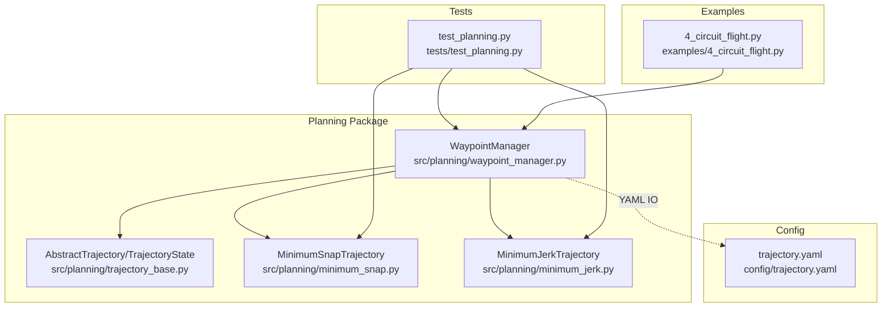
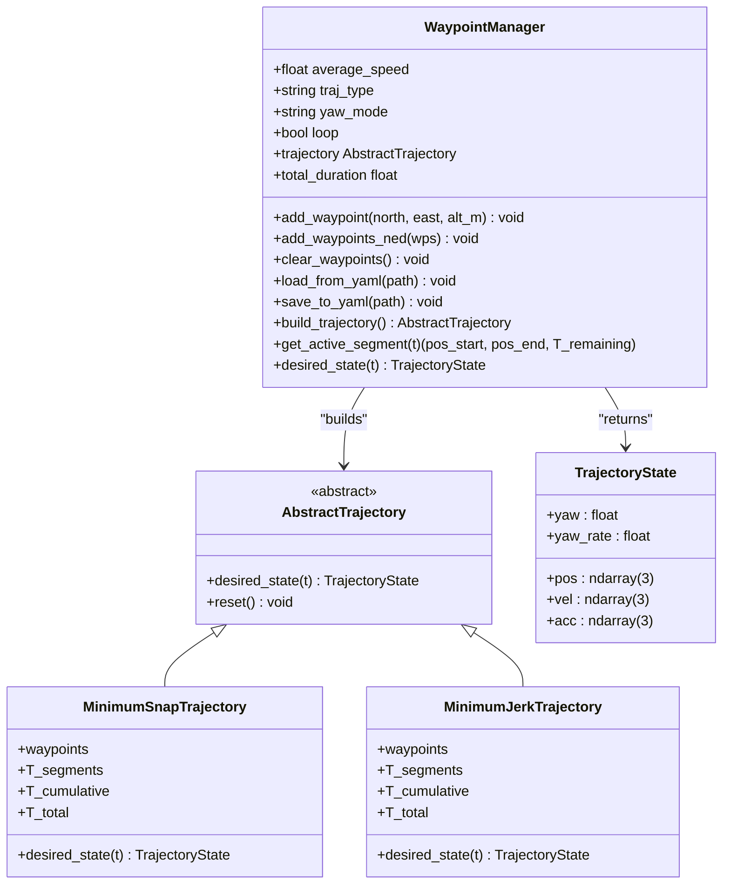
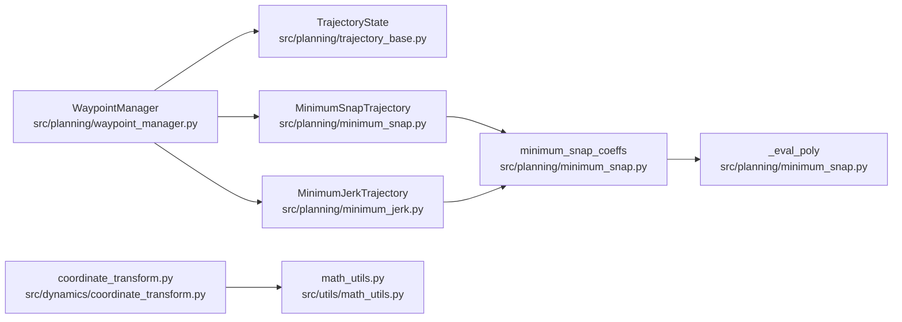

# Waypoint Management

<cite>
**Referenced Files in This Document**
- [waypoint_manager.py](file://src/planning/waypoint_manager.py)
- [trajectory_base.py](file://src/planning/trajectory_base.py)
- [minimum_snap.py](file://src/planning/minimum_snap.py)
- [minimum_jerk.py](file://src/planning/minimum_jerk.py)
- [trajectory.yaml](file://config/trajectory.yaml)
- [test_planning.py](file://tests/test_planning.py)
- [4_circuit_flight.py](file://examples/4_circuit_flight.py)
- [coordinate_transform.py](file://src/dynamics/coordinate_transform.py)
- [math_utils.py](file://src/utils/math_utils.py)
</cite>

## Table of Contents
1. [Introduction](#introduction)
2. [Project Structure](#project-structure)
3. [Core Components](#core-components)
4. [Architecture Overview](#architecture-overview)
5. [Detailed Component Analysis](#detailed-component-analysis)
6. [Dependency Analysis](#dependency-analysis)
7. [Performance Considerations](#performance-considerations)
8. [Troubleshooting Guide](#troubleshooting-guide)
9. [Conclusion](#conclusion)
10. [Appendices](#appendices)

## Introduction
This document describes the waypoint management system used for fixed-wing trajectory planning. It covers how waypoints are stored in the NED (North-East-Down) coordinate system, how altitude values given in “positive-up” format are converted to NED down format, and how waypoints are added via single insertion, bulk loading, and YAML configuration. It also documents persistence through save/load functionality, configuration management, validation, coordinate transformations, error handling, and integration with trajectory generation. Practical examples demonstrate mission planning setup and closed-loop mission execution.

## Project Structure
The waypoint management system resides in the planning package and integrates with trajectory generators and configuration files. The key files are:
- Waypoint manager and trajectory abstractions
- Minimum snap and minimum jerk trajectory implementations
- YAML configuration for waypoints and mission parameters
- Tests validating behavior and examples demonstrating usage



**Diagram sources**
- [waypoint_manager.py](file://src/planning/waypoint_manager.py#L20-L208)
- [trajectory_base.py](file://src/planning/trajectory_base.py#L16-L47)
- [minimum_snap.py](file://src/planning/minimum_snap.py#L167-L253)
- [minimum_jerk.py](file://src/planning/minimum_jerk.py#L17-L71)
- [trajectory.yaml](file://config/trajectory.yaml#L1-L23)
- [test_planning.py](file://tests/test_planning.py#L252-L328)
- [4_circuit_flight.py](file://examples/4_circuit_flight.py#L95-L106)

**Section sources**
- [waypoint_manager.py](file://src/planning/waypoint_manager.py#L1-L208)
- [trajectory_base.py](file://src/planning/trajectory_base.py#L1-L47)
- [minimum_snap.py](file://src/planning/minimum_snap.py#L1-L253)
- [minimum_jerk.py](file://src/planning/minimum_jerk.py#L1-L71)
- [trajectory.yaml](file://config/trajectory.yaml#L1-L23)
- [test_planning.py](file://tests/test_planning.py#L1-L328)
- [4_circuit_flight.py](file://examples/4_circuit_flight.py#L1-L275)

## Core Components
- WaypointManager: Stores waypoints in NED [north, east, down], converts positive-up altitude to NED down, supports adding single waypoints, bulk NED waypoints, YAML load/save, trajectory caching, and active segment queries.
- Trajectory abstractions: AbstractTrajectory defines the interface; TrajectoryState encapsulates desired position, velocity, acceleration, yaw, and yaw rate.
- MinimumSnapTrajectory and MinimumJerkTrajectory: Piecewise polynomial trajectories with continuity and configurable yaw modes; segment times derived from average speed or provided durations.

Key behaviors:
- Storage: Waypoints are kept as NED [n, e, down] internally.
- Altitude conversion: Positive-up altitude inputs are negated to store as NED down.
- Trajectory building: Validates minimum waypoint count, optionally closes loop by duplicating the first waypoint if not equal to the last, and caches the trajectory.
- Active segment access: Computes current segment and remaining time along the trajectory.

**Section sources**
- [waypoint_manager.py](file://src/planning/waypoint_manager.py#L20-L208)
- [trajectory_base.py](file://src/planning/trajectory_base.py#L16-L47)
- [minimum_snap.py](file://src/planning/minimum_snap.py#L167-L253)
- [minimum_jerk.py](file://src/planning/minimum_jerk.py#L17-L71)

## Architecture Overview
The system separates waypoint management from trajectory computation. WaypointManager orchestrates configuration, persistence, and caching, delegating trajectory construction to specialized trajectory classes.



**Diagram sources**
- [waypoint_manager.py](file://src/planning/waypoint_manager.py#L20-L208)
- [trajectory_base.py](file://src/planning/trajectory_base.py#L16-L47)
- [minimum_snap.py](file://src/planning/minimum_snap.py#L167-L253)
- [minimum_jerk.py](file://src/planning/minimum_jerk.py#L17-L71)

## Detailed Component Analysis

### Waypoint Storage and NED Coordinate System
- Waypoints are stored in NED coordinates as [north, east, down] meters.
- Altitude input in positive-up format is converted to NED down by negation during insertion.
- The manager maintains an internal list of NED waypoints and invalidates the cached trajectory upon any change.

Validation and error handling:
- Building a trajectory requires at least two waypoints; otherwise a ValueError is raised.
- Loop closure adds the first waypoint to the end only if the first and last waypoints differ by more than a tolerance.

Coordinate consistency:
- Trajectory generators operate on NED waypoints; yaw computations use NED velocity projections.

**Section sources**
- [waypoint_manager.py](file://src/planning/waypoint_manager.py#L24-L25)
- [waypoint_manager.py](file://src/planning/waypoint_manager.py#L54-L62)
- [waypoint_manager.py](file://src/planning/waypoint_manager.py#L127-L160)
- [waypoint_manager.py](file://src/planning/waypoint_manager.py#L144-L145)

### Altitude Conversion: Positive-Up to NED Down
- Single waypoint insertion accepts altitude as positive-up and stores it as NED down.
- YAML save writes altitudes back as positive-up for human readability; YAML load reads positive-up and converts to NED down.

Practical implication:
- Users specify altitudes as positive-up in configuration and code; internally they are stored as negative down.

**Section sources**
- [waypoint_manager.py](file://src/planning/waypoint_manager.py#L58-L61)
- [waypoint_manager.py](file://src/planning/waypoint_manager.py#L105-L106)
- [waypoint_manager.py](file://src/planning/waypoint_manager.py#L110-L111)
- [trajectory.yaml](file://config/trajectory.yaml#L12-L13)

### Adding Waypoints
- Single waypoint insertion: add_waypoint(north, east, alt_m) appends a new NED waypoint.
- Bulk insertion: add_waypoints_ned(wps) accepts an array of NED waypoints and appends them.
- Clearing: clear_waypoints resets the list and invalidates the cached trajectory.

Integration example:
- Example script demonstrates clearing and adding waypoints programmatically for a closed circuit.

**Section sources**
- [waypoint_manager.py](file://src/planning/waypoint_manager.py#L54-L78)
- [waypoint_manager.py](file://src/planning/waypoint_manager.py#L76-L78)
- [4_circuit_flight.py](file://examples/4_circuit_flight.py#L103-L105)

### YAML Configuration and Persistence
- Loading: load_from_yaml(path) reads a YAML file containing type, average_speed, yaw_mode, loop, and waypoints. Waypoints are interpreted as [north, east, alt] with alt as positive-up.
- Saving: save_to_yaml(path) writes the current configuration and waypoints, preserving positive-up altitude semantics for readability.
- Configuration file example: config/trajectory.yaml demonstrates the expected structure and values.

Validation:
- Tests confirm round-trip YAML load/save preserves waypoints and configuration.

**Section sources**
- [waypoint_manager.py](file://src/planning/waypoint_manager.py#L80-L121)
- [trajectory.yaml](file://config/trajectory.yaml#L1-L23)
- [test_planning.py](file://tests/test_planning.py#L295-L316)

### Trajectory Generation and Integration
- build_trajectory constructs a trajectory from current waypoints, selecting MinimumSnapTrajectory or MinimumJerkTrajectory based on traj_type.
- Segment times are computed from average_speed if not provided; cumulative segment times enable active segment lookup.
- desired_state delegates to the underlying trajectory’s desired_state method.

Yaw modes:
- yaw_follow: yaw computed from horizontal velocity direction.
- Other modes are supported by the underlying trajectory classes.

**Section sources**
- [waypoint_manager.py](file://src/planning/waypoint_manager.py#L127-L160)
- [minimum_snap.py](file://src/planning/minimum_snap.py#L181-L253)
- [minimum_jerk.py](file://src/planning/minimum_jerk.py#L24-L71)

### Active Segment Access and Mission Planning
- get_active_segment(t) returns the current segment’s start/end waypoints and remaining time along the trajectory.
- total_duration exposes the total mission time for planning and scheduling.

Usage pattern:
- Use get_active_segment to determine which waypoints define the current leg and how much time remains.

**Section sources**
- [waypoint_manager.py](file://src/planning/waypoint_manager.py#L178-L201)
- [waypoint_manager.py](file://src/planning/waypoint_manager.py#L170-L172)

### Closed Missions and Loop Closure
- When loop is enabled and the first and last waypoints are not approximately equal, the manager appends the first waypoint to close the loop before building the trajectory.
- This ensures seamless transitions for cyclic missions.

**Section sources**
- [waypoint_manager.py](file://src/planning/waypoint_manager.py#L144-L145)

### Coordinate Transformations and Consistency
- NED convention and Euler-angle transformations are handled by math utilities and coordinate transform module.
- Trajectory state outputs remain in NED, ensuring consistency across planning and simulation.

**Section sources**
- [coordinate_transform.py](file://src/dynamics/coordinate_transform.py#L1-L70)
- [math_utils.py](file://src/utils/math_utils.py#L43-L76)
- [trajectory_base.py](file://src/planning/trajectory_base.py#L17-L24)

## Dependency Analysis
WaypointManager depends on trajectory abstractions and implementations, while trajectory classes depend on shared utilities for polynomial evaluation and continuity enforcement.



**Diagram sources**
- [waypoint_manager.py](file://src/planning/waypoint_manager.py#L15-L17)
- [trajectory_base.py](file://src/planning/trajectory_base.py#L16-L47)
- [minimum_snap.py](file://src/planning/minimum_snap.py#L167-L253)
- [minimum_jerk.py](file://src/planning/minimum_jerk.py#L17-L71)
- [coordinate_transform.py](file://src/dynamics/coordinate_transform.py#L1-L70)
- [math_utils.py](file://src/utils/math_utils.py#L43-L76)

**Section sources**
- [waypoint_manager.py](file://src/planning/waypoint_manager.py#L1-L208)
- [minimum_snap.py](file://src/planning/minimum_snap.py#L1-L253)
- [minimum_jerk.py](file://src/planning/minimum_jerk.py#L1-L71)
- [trajectory_base.py](file://src/planning/trajectory_base.py#L1-L47)
- [coordinate_transform.py](file://src/dynamics/coordinate_transform.py#L1-L70)
- [math_utils.py](file://src/utils/math_utils.py#L1-L124)

## Performance Considerations
- Segment-time estimation: Average speed drives segment durations; very low speeds are guarded to avoid tiny denominators.
- Numerical stability: The minimum snap solver warns on ill-conditioned systems and falls back to least-squares when necessary.
- Caching: Trajectory objects are cached after build; clearing waypoints or changing parameters invalidates the cache to force recomputation.

Recommendations:
- Prefer reasonable average speeds to avoid extremely long segments that can lead to large polynomial coefficients.
- Use loop closure judiciously; ensure first and last waypoints are nearly coincident to avoid unnecessary duplication.

**Section sources**
- [minimum_snap.py](file://src/planning/minimum_snap.py#L133-L137)
- [minimum_snap.py](file://src/planning/minimum_snap.py#L200-L205)
- [waypoint_manager.py](file://src/planning/waypoint_manager.py#L139-L140)
- [waypoint_manager.py](file://src/planning/waypoint_manager.py#L61-L62)

## Troubleshooting Guide
Common issues and resolutions:
- Not enough waypoints: Building a trajectory with fewer than two waypoints raises a ValueError. Ensure at least two waypoints are added.
- YAML file errors: If the YAML file is missing or malformed, loading fails early. Verify file existence and structure.
- Altitude confusion: Remember that YAML waypoints specify altitude as positive-up; internally they are stored as NED down. This is handled automatically by load/save and add_waypoint.
- Loop mismatch: If loop is enabled but first and last waypoints differ beyond tolerance, the manager duplicates the first waypoint to close the loop. Confirm waypoint equality if unexpected closure occurs.
- Coordinate system mismatch: Ensure all inputs are in NED and altitudes are specified as positive-up when adding programmatically or via YAML.

Validation references:
- Tests cover altitude conversion, YAML round-trip, minimum waypoint requirement, and active segment retrieval.

**Section sources**
- [waypoint_manager.py](file://src/planning/waypoint_manager.py#L139-L140)
- [waypoint_manager.py](file://src/planning/waypoint_manager.py#L93-L94)
- [waypoint_manager.py](file://src/planning/waypoint_manager.py#L144-L145)
- [test_planning.py](file://tests/test_planning.py#L254-L327)

## Conclusion
The waypoint management system provides a robust foundation for fixed-wing mission planning in NED coordinates. It supports flexible waypoint addition, YAML-based configuration and persistence, automatic altitude conversion, and tight integration with minimum snap and minimum jerk trajectories. With built-in validation, caching, and loop closure, it enables reliable mission execution and easy maintenance across planning and simulation workflows.

## Appendices

### Practical Examples and Integration Patterns
- Programmatic mission setup: Clear and add waypoints for a closed circuit, then run a closed-loop simulation without polynomial trajectory control.
- YAML-driven missions: Define waypoints and mission parameters in a YAML file and load them into the WaypointManager for trajectory generation.

References:
- Example script demonstrates clearing and adding waypoints for a four-leg circuit and running a closed-loop simulation.
- Configuration file shows the expected YAML structure for waypoints and mission parameters.

**Section sources**
- [4_circuit_flight.py](file://examples/4_circuit_flight.py#L95-L105)
- [trajectory.yaml](file://config/trajectory.yaml#L1-L23)

### Sequence: Waypoint Addition and Trajectory Build
```mermaid
sequenceDiagram
participant User as "User Code"
participant WM as "WaypointManager"
participant MS as "MinimumSnapTrajectory"
participant MJ as "MinimumJerkTrajectory"
User->>WM : add_waypoint(n, e, alt_up)
WM->>WM : append NED [n, e, -alt_up]
User->>WM : build_trajectory()
WM->>WM : validate >=2 waypoints
WM->>WM : optionally close loop
alt WM : traj_type == "minimum_snap"?
WM->>MS : construct with waypoints, average_speed, yaw_mode
WM-->>User : AbstractTrajectory
alt WM : traj_type == "minimum_jerk"?
WM->>MJ : construct with waypoints, average_speed, yaw_mode
WM-->>User : AbstractTrajectory
```

**Diagram sources**
- [waypoint_manager.py](file://src/planning/waypoint_manager.py#L54-L62)
- [waypoint_manager.py](file://src/planning/waypoint_manager.py#L127-L160)
- [minimum_snap.py](file://src/planning/minimum_snap.py#L181-L253)
- [minimum_jerk.py](file://src/planning/minimum_jerk.py#L24-L71)