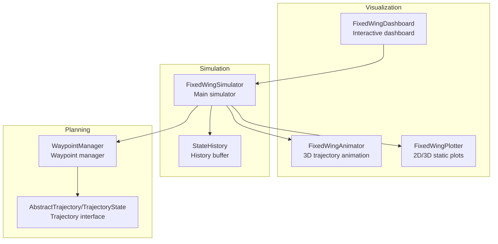
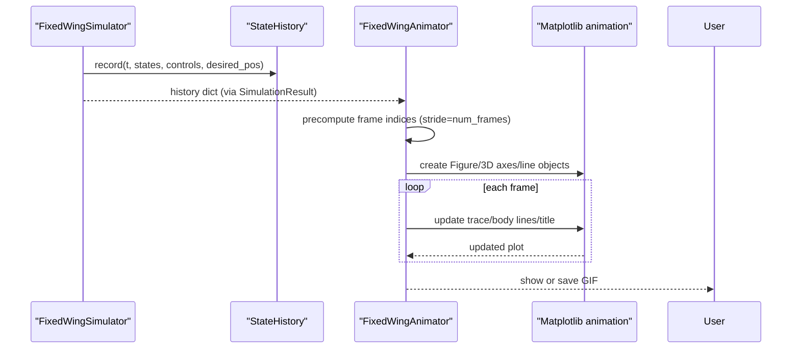
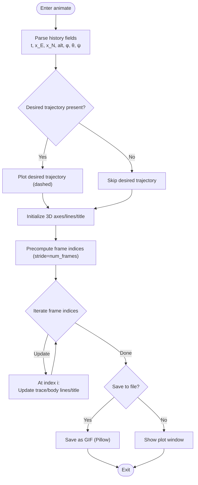
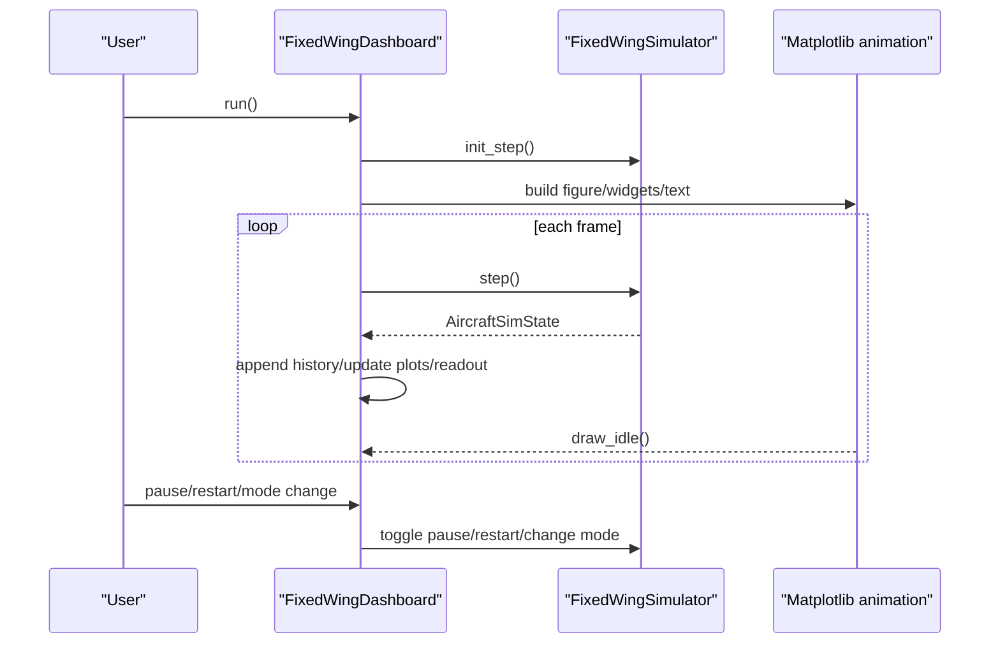
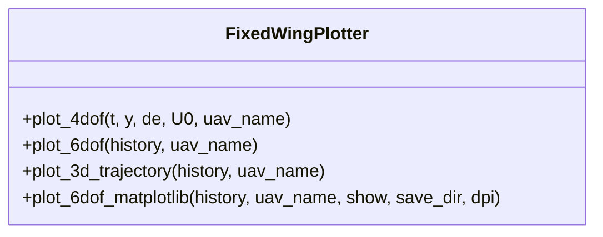
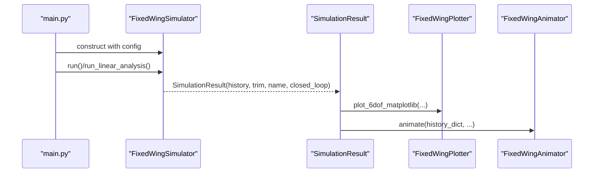
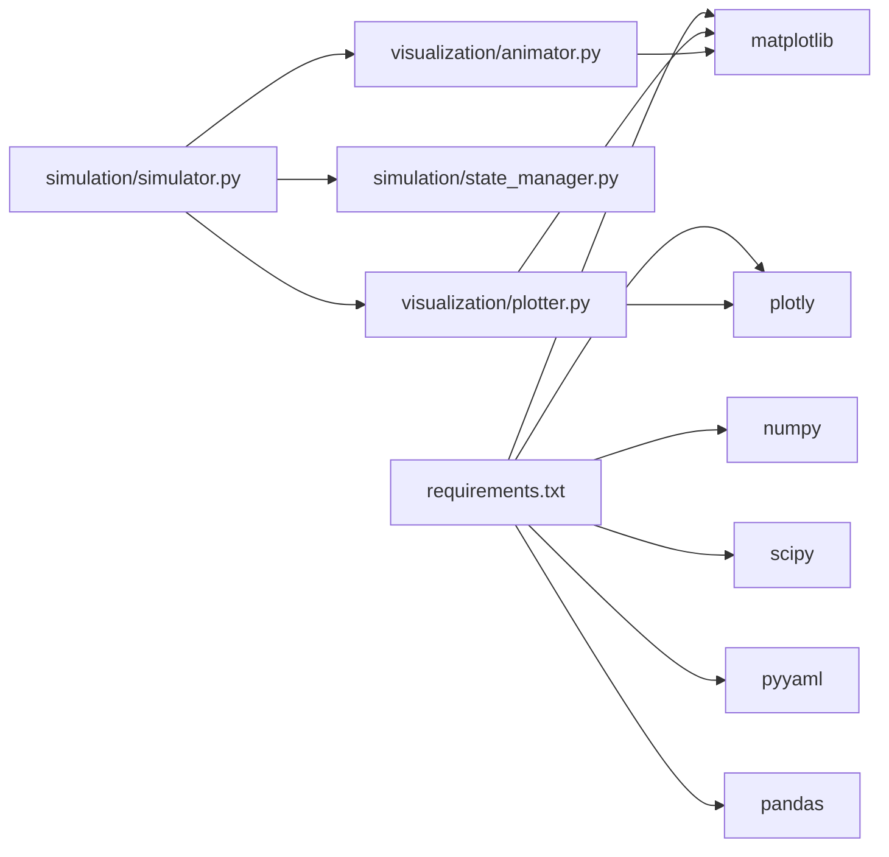

# Animation System

<cite>
**Referenced Files in This Document**
- [src/visualization/animator.py](file://src/visualization/animator.py)
- [src/visualization/dashboard.py](file://src/visualization/dashboard.py)
- [src/visualization/plotter.py](file://src/visualization/plotter.py)
- [src/simulation/simulator.py](file://src/simulation/simulator.py)
- [src/simulation/state_manager.py](file://src/simulation/state_manager.py)
- [src/planning/waypoint_manager.py](file://src/planning/waypoint_manager.py)
- [src/planning/trajectory_base.py](file://src/planning/trajectory_base.py)
- [main.py](file://main.py)
- [config/simulation.yaml](file://config/simulation.yaml)
- [config/trajectory.yaml](file://config/trajectory.yaml)
- [requirements.txt](file://requirements.txt)
</cite>

## Table of Contents
1. [Introduction](#introduction)
2. [Project Structure](#project-structure)
3. [Core Components](#core-components)
4. [Architecture Overview](#architecture-overview)
5. [Detailed Component Analysis](#detailed-component-analysis)
6. [Dependency Analysis](#dependency-analysis)
7. [Performance Considerations](#performance-considerations)
8. [Troubleshooting Guide](#troubleshooting-guide)
9. [Conclusion](#conclusion)
10. [Appendices](#appendices)

## Introduction
This document describes the animation system for flight trajectory visualization in the FixedWingSimulator. It explains how real-time and post-processed animations are generated from simulation history, how to configure animation parameters (frame rates, strides, rendering options), and how to optimize performance for long simulations. It also documents integration with simulation history data, trajectory visualization workflows, interactive playback controls, and the relationship between the animation system and other visualization components.

## Project Structure
The animation system resides in the visualization package and integrates with the simulation engine and planning modules:
- Visualization: FixedWingAnimator (3D trajectory animation), FixedWingDashboard (interactive dashboard), FixedWingPlotter (2D/3D static plots)
- Simulation: FixedWingSimulator (runs simulations and records StateHistory), StateHistory (pre-allocated history buffer)
- Planning: WaypointManager and AbstractTrajectory (provide desired trajectories for comparison)

**Diagram sources**
- [src/visualization/animator.py](file://src/visualization/animator.py#L14-L150)
- [src/visualization/dashboard.py](file://src/visualization/dashboard.py#L28-L167)
- [src/visualization/plotter.py](file://src/visualization/plotter.py#L19-L244)
- [src/simulation/simulator.py](file://src/simulation/simulator.py#L115-L642)
- [src/simulation/state_manager.py](file://src/simulation/state_manager.py#L95-L193)
- [src/planning/waypoint_manager.py](file://src/planning/waypoint_manager.py#L20-L208)
- [src/planning/trajectory_base.py](file://src/planning/trajectory_base.py#L16-L47)

**Section sources**
- [src/visualization/animator.py](file://src/visualization/animator.py#L1-L150)
- [src/visualization/dashboard.py](file://src/visualization/dashboard.py#L1-L167)
- [src/visualization/plotter.py](file://src/visualization/plotter.py#L1-L244)
- [src/simulation/simulator.py](file://src/simulation/simulator.py#L1-L642)
- [src/simulation/state_manager.py](file://src/simulation/state_manager.py#L1-L193)
- [src/planning/waypoint_manager.py](file://src/planning/waypoint_manager.py#L1-L208)
- [src/planning/trajectory_base.py](file://src/planning/trajectory_base.py#L1-L47)

## Core Components
- FixedWingAnimator: Creates a 3D animated trajectory using Matplotlib FuncAnimation. Renders actual and desired trajectories, aircraft body lines, and optional waypoints. Can display or save to GIF.
- FixedWingDashboard: Provides an interactive real-time dashboard with live plots, numeric readouts, pause/restart controls, and flight mode selection. Drives simulation step-by-step via the simulator’s step API.
- FixedWingPlotter: Produces static Matplotlib figures and Plotly interactive charts for 2D time-domain views and 3D trajectories.
- FixedWingSimulator: Runs simulations, records StateHistory, and exposes visualize() to quickly render plots and animations.
- StateHistory: Efficient pre-allocated buffer storing time series of states and controls, exported as a dictionary for visualization.
- WaypointManager and AbstractTrajectory: Supply desired positions and derivatives for closed-loop runs, enabling desired trajectory overlays in animations.

**Section sources**
- [src/visualization/animator.py](file://src/visualization/animator.py#L14-L150)
- [src/visualization/dashboard.py](file://src/visualization/dashboard.py#L28-L167)
- [src/visualization/plotter.py](file://src/visualization/plotter.py#L19-L244)
- [src/simulation/simulator.py](file://src/simulation/simulator.py#L59-L110)
- [src/simulation/state_manager.py](file://src/simulation/state_manager.py#L95-L193)
- [src/planning/waypoint_manager.py](file://src/planning/waypoint_manager.py#L20-L208)
- [src/planning/trajectory_base.py](file://src/planning/trajectory_base.py#L16-L47)

## Architecture Overview
The animation pipeline transforms simulation history into dynamic visualizations:
- Data layer: StateHistory captures time-series states and controls.
- Rendering layer: Matplotlib/Plotly renderers produce animations and static/interactive charts.
- Control layer: Simulator continuously records history; Animator samples at configurable strides.

**Diagram sources**
- [src/simulation/simulator.py](file://src/simulation/simulator.py#L542-L556)
- [src/simulation/state_manager.py](file://src/simulation/state_manager.py#L124-L174)
- [src/visualization/animator.py](file://src/visualization/animator.py#L104-L150)

## Detailed Component Analysis

### FixedWingAnimator (3D Trajectory Animation)
- Purpose: Real-time 3D animation of actual and desired trajectories with aircraft body representation.
- Inputs: history dictionary from StateHistory.to_dict(), including time, NED positions, Euler angles, airspeed, altitude, and optional desired positions.
- Key behaviors:
  - Parses history fields and detects presence of desired trajectory.
  - Initializes 3D axes and line objects for actual trace, desired trace, and aircraft body segments (fuselage, wings, horizontal tail).
  - Defines rotation matrix from body to NED coordinates and transforms body-frame geometry to NED.
  - Precomputes frame indices at stride num_frames to reduce rendering load.
  - Updates trace and body lines per frame; refreshes title with time, altitude, and airspeed.
  - Supports saving to GIF via Pillow writer and displaying the plot window.
- Outputs: Animated figure shown or saved as GIF.

**Diagram sources**
- [src/visualization/animator.py](file://src/visualization/animator.py#L25-L150)

**Section sources**
- [src/visualization/animator.py](file://src/visualization/animator.py#L14-L150)

### FixedWingDashboard (Interactive Dashboard)
- Purpose: Real-time interactive dashboard with live plots, numeric readouts, and controls for pausing/resuming and changing flight modes.
- Behavior:
  - Uses TkAgg backend for interactivity.
  - Builds figure with altitude and airspeed plots, numeric state readout, pause/restart buttons, and a flight mode radio.
  - Drives simulation via simulator.step() at intervals determined by dt; appends history and redraws plots.
  - Supports mode switching via FlightModeManager.
- Integration: Works with FixedWingSimulator’s step-by-step API.

**Diagram sources**
- [src/visualization/dashboard.py](file://src/visualization/dashboard.py#L59-L111)
- [src/simulation/simulator.py](file://src/simulation/simulator.py#L602-L642)

**Section sources**
- [src/visualization/dashboard.py](file://src/visualization/dashboard.py#L28-L167)
- [src/simulation/simulator.py](file://src/simulation/simulator.py#L602-L642)

### FixedWingPlotter (Static and Interactive Charts)
- Purpose: Produce static Matplotlib figures and Plotly interactive charts for time-domain and 3D trajectory visualization.
- Matplotlib static plots:
  - 6-DOF time-domain subplots (positions, velocities, attitudes, angular rates, control inputs).
  - 3D trajectory plot with start marker and optional desired trajectory overlay.
  - Optional saving of figures as PNG with configurable DPI.
- Plotly interactive charts:
  - 4-DOF and 6-DOF time-domain subplots suitable for web UI embedding.
  - 3D trajectory chart with labeled axes.

**Diagram sources**
- [src/visualization/plotter.py](file://src/visualization/plotter.py#L19-L244)

**Section sources**
- [src/visualization/plotter.py](file://src/visualization/plotter.py#L1-L244)

### FixedWingSimulator (Simulation and Visualization Entry)
- Purpose: Orchestrates simulation runs, records StateHistory, and provides quick visualization via visualize().
- Visualization integration:
  - run() builds the ODE/control/trajectory chain and records history.
  - visualize() delegates to FixedWingPlotter and FixedWingAnimator.
  - step-by-step API (init_step/step) enables integration with interactive dashboards.

**Diagram sources**
- [src/simulation/simulator.py](file://src/simulation/simulator.py#L92-L109)
- [main.py](file://main.py#L114-L141)

**Section sources**
- [src/simulation/simulator.py](file://src/simulation/simulator.py#L59-L110)
- [main.py](file://main.py#L98-L145)

### StateHistory (History Buffer)
- Purpose: Efficiently stores time-series states and controls in pre-allocated NumPy arrays.
- Features:
  - Records t, velocities, angular rates, Euler angles, positions, derived quantities, control surface deflections, and desired positions.
  - trim() removes unused tail entries to minimize memory footprint.
  - to_dict() exports a dictionary for visualization and analysis.

**Section sources**
- [src/simulation/state_manager.py](file://src/simulation/state_manager.py#L95-L193)

### Trajectory and Waypoints (WaypointManager and AbstractTrajectory)
- Purpose: Provide desired trajectory states for closed-loop runs so animations can compare actual vs. desired.
- WaypointManager:
  - Manages NED waypoints and constructs trajectory objects (minimum snap/jerk/etc.) based on configuration.
  - Exposes total_duration and active segment queries.
- AbstractTrajectory:
  - Supplies desired_state(t) returning position, velocity, acceleration, yaw, and yaw rate.

**Section sources**
- [src/planning/waypoint_manager.py](file://src/planning/waypoint_manager.py#L20-L208)
- [src/planning/trajectory_base.py](file://src/planning/trajectory_base.py#L16-L47)

## Dependency Analysis
- Visualization depends on NumPy, Matplotlib, and Plotly.
- Simulation depends on SciPy (integration), PyYAML (configuration), and optionally Pandas (example usage).
- Animation system primarily relies on StateHistory and Matplotlib/Plotly.

**Diagram sources**
- [requirements.txt](file://requirements.txt#L1-L8)
- [src/simulation/simulator.py](file://src/simulation/simulator.py#L33-L52)
- [src/visualization/plotter.py](file://src/visualization/plotter.py#L39-L40)
- [src/visualization/animator.py](file://src/visualization/animator.py#L44-L46)

**Section sources**
- [requirements.txt](file://requirements.txt#L1-L8)
- [src/simulation/simulator.py](file://src/simulation/simulator.py#L33-L52)

## Performance Considerations
- Frame stride and caching:
  - Precompute frame indices at stride num_frames to avoid updating every timestep.
  - Reduce per-frame work by updating only line data (set_data/set_3d_properties) rather than recreating objects.
- Backend selection:
  - Use TkAgg for interactive dashboards; use non-interactive backends (e.g., Agg) for batch rendering.
- Memory management:
  - Use StateHistory.trim() to remove unused tail entries after simulation.
  - Close figures in non-interactive mode to release memory.
- Export optimization:
  - For GIF export, choose appropriate fps and ensure Pillow writer availability.

**Section sources**
- [src/visualization/animator.py](file://src/visualization/animator.py#L104-L150)
- [src/visualization/dashboard.py](file://src/visualization/dashboard.py#L106-L111)
- [src/simulation/state_manager.py](file://src/simulation/state_manager.py#L170-L193)

## Troubleshooting Guide
- Missing Matplotlib/Plotly:
  - Ensure dependencies are installed; dashboard requires matplotlib.
- Stuttering or slow animations:
  - Increase num_frames or adjust interval to reduce per-frame workload.
- Desired trajectory not visible:
  - Verify history contains non-zero desired position fields.
- Dashboard not responding:
  - Confirm TkAgg backend and proper initialization via init_step().
- Unexpected flight behavior:
  - Review control parameters and wind configuration.

**Section sources**
- [src/visualization/dashboard.py](file://src/visualization/dashboard.py#L42-L44)
- [src/visualization/animator.py](file://src/visualization/animator.py#L56-L67)
- [src/visualization/dashboard.py](file://src/visualization/dashboard.py#L61-L61)

## Conclusion
The animation system centers on StateHistory as the single source of truth for visualization. FixedWingAnimator leverages Matplotlib to render 3D trajectories with aircraft body geometry, while FixedWingDashboard enables interactive exploration. FixedWingPlotter bridges desktop and web workflows with static and interactive charts. Together, these components provide flexible, efficient visualization for both real-time monitoring and post-run analysis.

## Appendices

### Animation Configuration Parameters and Customization
- FixedWingAnimator.animate
  - history: Dictionary from StateHistory.to_dict()
  - uav_name: Display name for titles
  - num_frames: Stride for frame sampling (every N steps)
  - show: Whether to display the plot window
  - save_path: Path to save GIF (if provided)
- FixedWingDashboard.run
  - max_steps: Maximum length of internal history buffers
  - Interactive widgets: Pause/Resume, Restart, Flight Mode radio
- FixedWingPlotter
  - Matplotlib static: save_dir and dpi for PNG export
  - Plotly: returns figures embeddable in web UIs

**Section sources**
- [src/visualization/animator.py](file://src/visualization/animator.py#L25-L43)
- [src/visualization/dashboard.py](file://src/visualization/dashboard.py#L41-L60)
- [src/visualization/plotter.py](file://src/visualization/plotter.py#L161-L180)

### Integration Examples and Workflows
- Command-line usage:
  - main.py constructs FixedWingSimulator with aircraft, mode, duration, dt, wind, and trajectory type; runs closed-loop or open-loop simulations and calls result.visualize().
- Configuration:
  - config/simulation.yaml sets dt, duration, integrator, wind, and logging.
  - config/trajectory.yaml defines trajectory type, average speed, yaw mode, waypoints, and loop flag.

**Section sources**
- [main.py](file://main.py#L98-L145)
- [config/simulation.yaml](file://config/simulation.yaml#L1-L30)
- [config/trajectory.yaml](file://config/trajectory.yaml#L1-L23)