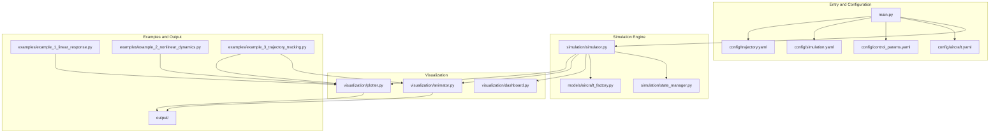
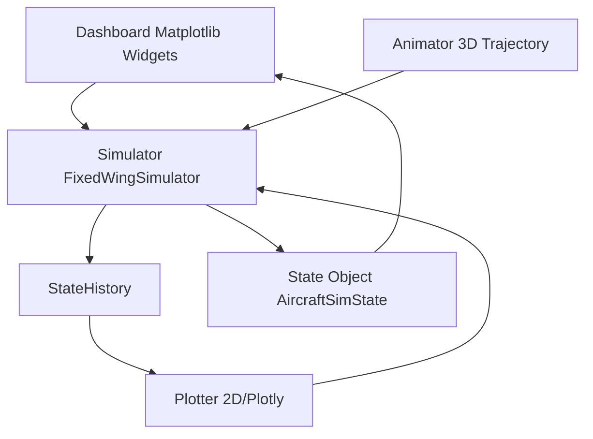
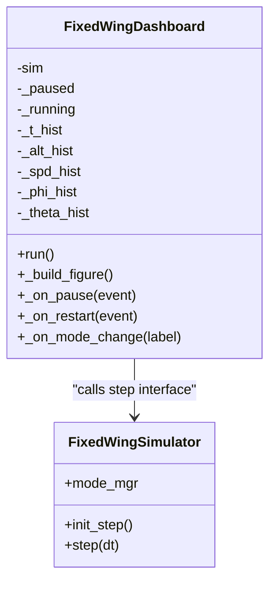
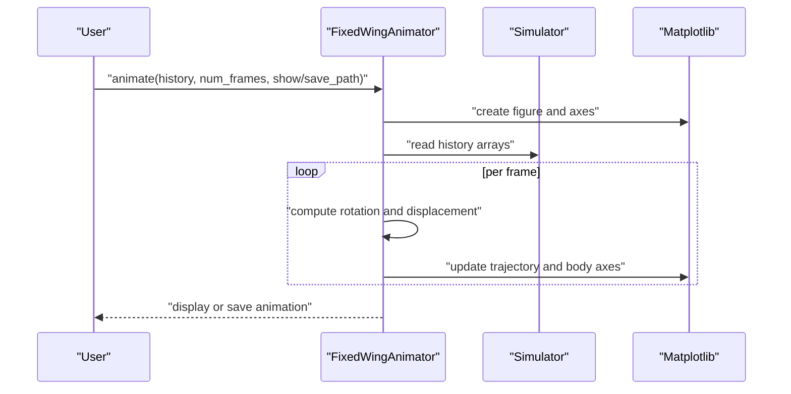
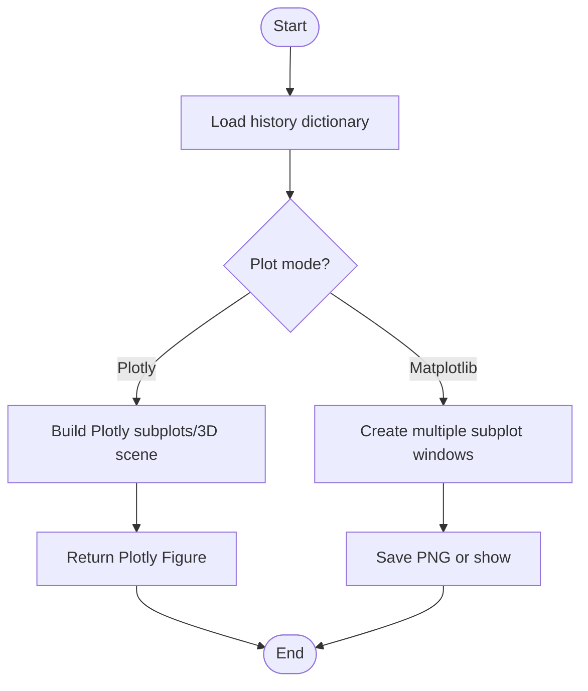
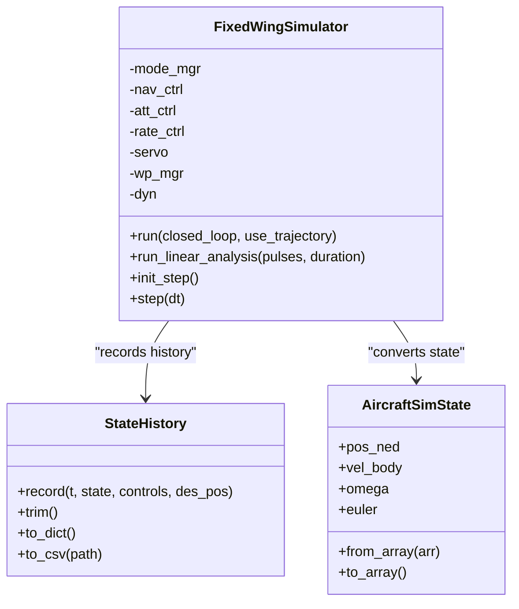
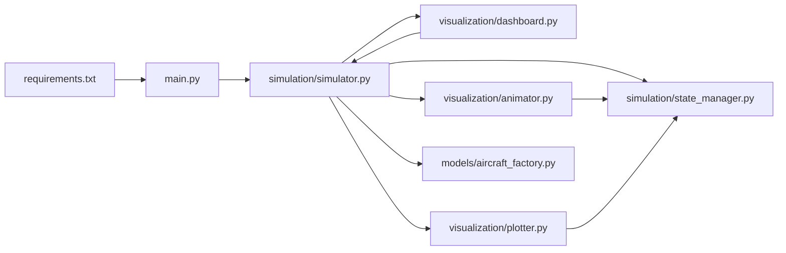

# Dashboard System

<cite>
**Referenced Files in This Document**
- [dashboard.py](file://src/visualization/dashboard.py)
- [animator.py](file://src/visualization/animator.py)
- [plotter.py](file://src/visualization/plotter.py)
- [simulator.py](file://src/simulation/simulator.py)
- [state_manager.py](file://src/simulation/state_manager.py)
- [aircraft_factory.py](file://src/models/aircraft_factory.py)
- [main.py](file://main.py)
- [requirements.txt](file://requirements.txt)
- [aircraft.yaml](file://config/aircraft.yaml)
- [control_params.yaml](file://config/control_params.yaml)
- [simulation.yaml](file://config/simulation.yaml)
- [trajectory.yaml](file://config/trajectory.yaml)
- [example_1_linear_response.py](file://examples/example_1_linear_response.py)
- [example_2_nonlinear_dynamics.py](file://examples/example_2_nonlinear_dynamics.py)
- [example_3_trajectory_tracking.py](file://examples/example_3_trajectory_tracking.py)
</cite>

## Table of Contents
1. [Introduction](#introduction)
2. [Project Structure](#project-structure)
3. [Core Components](#core-components)
4. [Architecture Overview](#architecture-overview)
5. [Detailed Component Analysis](#detailed-component-analysis)
6. [Dependency Analysis](#dependency-analysis)
7. [Performance Considerations](#performance-considerations)
8. [Troubleshooting Guide](#troubleshooting-guide)
9. [Conclusion](#conclusion)
10. [Appendices](#appendices)

## Introduction
This document describes the dashboard system component responsible for real-time monitoring and control of the fixed-wing simulation. It covers the interactive dashboard implementation, live data visualization, system status display, and interactive controls. It also explains dashboard layout configuration, widget management, real-time data updates, integration with simulation state data, and control system monitoring capabilities. Practical examples, customization options, and user interaction patterns are included, along with performance considerations for real-time updates, data streaming optimization, and responsive dashboard design. The dashboard’s role in system monitoring and debugging workflows is highlighted.

## Project Structure
The dashboard system resides in the visualization package and integrates with the simulation engine and state management. The main entry point orchestrates simulation runs and visualization.

**Diagram sources**
- [main.py](file://main.py#L98-L145)
- [simulator.py](file://src/simulation/simulator.py#L115-L128)
- [state_manager.py](file://src/simulation/state_manager.py#L95-L193)
- [aircraft_factory.py](file://src/models/aircraft_factory.py#L39-L136)
- [dashboard.py](file://src/visualization/dashboard.py#L28-L167)
- [animator.py](file://src/visualization/animator.py#L14-L150)
- [plotter.py](file://src/visualization/plotter.py#L19-L244)
- [example_1_linear_response.py](file://examples/example_1_linear_response.py#L1-L206)
- [example_2_nonlinear_dynamics.py](file://examples/example_2_nonlinear_dynamics.py#L1-L215)
- [example_3_trajectory_tracking.py](file://examples/example_3_trajectory_tracking.py#L1-L194)

**Section sources**
- [main.py](file://main.py#L1-L145)
- [requirements.txt](file://requirements.txt#L1-L8)

## Core Components
- Dashboard (interactive Matplotlib widgets)
  - Provides flight mode selector, PID parameter sliders, pause/resume/restart buttons, and live state numeric readout.
  - Drives real-time updates via the simulator’s step interface using a timer-driven animation loop.
- Animator (3D trajectory animation)
  - Uses Matplotlib’s FuncAnimation to render trajectories and aircraft body axes in real time, with optional GIF export.
- 2D Plotter (static and Plotly modes)
  - Supports 4DOF/6DOF time series plots and 3D NED trajectories; can produce static images or Plotly interactive charts for web UI.
- Simulator (FixedWingSimulator)
  - Offers run()/run_linear_analysis() batch runs and init_step()/step() step interfaces for real-time dashboard driving.
- State Management (StateHistory/AircraftSimState)
  - Pre-allocates history buffers for efficient recording; supports trimming and CSV export.
- Aircraft configuration factory (AircraftFactory)
  - Merges database defaults with user overrides to build configuration objects for simulations.
- Main entry (main.py)
  - Parses command-line arguments, assembles the simulator, and executes different run modes.

**Section sources**
- [dashboard.py](file://src/visualization/dashboard.py#L28-L167)
- [animator.py](file://src/visualization/animator.py#L14-L150)
- [plotter.py](file://src/visualization/plotter.py#L19-L244)
- [simulator.py](file://src/simulation/simulator.py#L115-L642)
- [state_manager.py](file://src/simulation/state_manager.py#L16-L193)
- [aircraft_factory.py](file://src/models/aircraft_factory.py#L39-L136)
- [main.py](file://main.py#L32-L145)

## Architecture Overview
The dashboard system follows a decoupled “simulation engine–visualization layer” design. The simulation engine computes physics and control, while the visualization layer consumes unified data interfaces (history buffers, state objects, CSV export) for display and interaction. The real-time dashboard drives the simulation via the step interface, forming an event-driven update loop.

**Diagram sources**
- [dashboard.py](file://src/visualization/dashboard.py#L59-L110)
- [animator.py](file://src/visualization/animator.py#L25-L150)
- [plotter.py](file://src/visualization/plotter.py#L19-L244)
- [simulator.py](file://src/simulation/simulator.py#L239-L642)
- [state_manager.py](file://src/simulation/state_manager.py#L95-L193)

## Detailed Component Analysis

### Dashboard Component Analysis (FixedWingDashboard)
- Design philosophy
  - Built around interactive Matplotlib widgets to provide an immediate, real-time observation interface.
  - Uses RadioButtons, Button, and Axes controls to switch flight modes, pause/resume, and restart simulations.
- Data binding and real-time updates
  - Driven by a timer-based function animation; each frame calls the simulator’s step interface to fetch the latest state and update line plots and text readouts.
  - History buffers append timestamps incrementally; line plots auto-scale to accommodate new data.
- UI layout and responsiveness
  - Uses add_axes to position regions; titles, grids, and axis labels are explicit; monospace text readout aids alignment.
  - Button and radio positions remain fixed to preserve usability across window sizes.
- Interaction logic
  - Pause/Resume toggles dynamically update button text; Restart clears histories and reinitializes the simulator.
  - Mode changes are forwarded to the simulator’s flight mode manager.

**Diagram sources**
- [dashboard.py](file://src/visualization/dashboard.py#L28-L167)
- [simulator.py](file://src/simulation/simulator.py#L602-L642)

**Section sources**
- [dashboard.py](file://src/visualization/dashboard.py#L28-L167)

### Animator Component Analysis (FixedWingAnimator)
- Design philosophy
  - Renders 3D trajectories and aircraft body axes in real time; overlays desired trajectories and waypoints for comparison.
- Data binding and rendering
  - Consumes history dictionaries containing time, positions, attitudes, and control surfaces; updates trajectory and body axes per frame.
  - Applies rotation matrices to transform body-frame geometry into NED coordinates and renders in plot coordinates.
- Performance and export
  - Non-blocking rendering with configurable frame intervals; can save animations as GIF files.

**Diagram sources**
- [animator.py](file://src/visualization/animator.py#L25-L150)

**Section sources**
- [animator.py](file://src/visualization/animator.py#L14-L150)

### Plotter Component Analysis (FixedWingPlotter)
- Design philosophy
  - Provides dual-mode plotting: Matplotlib static figures for batch outputs and Plotly figures for web UI integration.
- Data binding and layout
  - 4DOF/6DOF time series plots use subplot layouts with clear titles and axis labels; 3D NED trajectory plots support start markers and desired trajectory overlays.
- Output and reuse
  - Static figures can be saved as PNG; Plotly figures can be embedded in web applications.

**Diagram sources**
- [plotter.py](file://src/visualization/plotter.py#L19-L244)

**Section sources**
- [plotter.py](file://src/visualization/plotter.py#L19-L244)

### Simulator and State Management
- Simulator (FixedWingSimulator)
  - Offers run()/run_linear_analysis() for batch runs and init_step()/step() for real-time driving.
  - Integrates flight mode management, navigation, attitude/rate controllers, servo mixer, and trajectory managers.
- State Management (StateHistory/AircraftSimState)
  - Pre-allocates arrays for efficient recording; trims unused tails and exports to CSV.
  - State object encapsulates 12-dimensional state and derived quantities (airspeed, angle of attack, sideslip, altitude).

**Diagram sources**
- [simulator.py](file://src/simulation/simulator.py#L115-L642)
- [state_manager.py](file://src/simulation/state_manager.py#L16-L193)

**Section sources**
- [simulator.py](file://src/simulation/simulator.py#L115-L642)
- [state_manager.py](file://src/simulation/state_manager.py#L16-L193)

### Aircraft Configuration and Parameters
- Aircraft configuration factory (AircraftFactory)
  - Merges database defaults with YAML overrides to create configuration objects for simulations.
- Control parameters (control_params.yaml)
  - Contains PID gains, limits, and TECS parameters for ArduPilot-compatible control chains.
- Simulation configuration (simulation.yaml)
  - Defines dt, duration, initial conditions, wind, and logging.
- Trajectory configuration (trajectory.yaml)
  - Specifies trajectory types, average speeds, waypoints, and loop modes.

**Section sources**
- [aircraft_factory.py](file://src/models/aircraft_factory.py#L39-L136)
- [control_params.yaml](file://config/control_params.yaml#L1-L45)
- [simulation.yaml](file://config/simulation.yaml#L1-L30)
- [trajectory.yaml](file://config/trajectory.yaml#L1-L23)

## Dependency Analysis
- External dependencies
  - NumPy, SciPy, Matplotlib, Plotly, PyYAML, Pandas, pytest.
- Internal module dependencies
  - main.py depends on simulation/simulator.py and models/aircraft_database.
  - simulator.py depends on models, dynamics, environment, control, planning, simulation, and utils.
  - visualization/dashboard.py depends on simulation/simulator.py and matplotlib.
  - visualization/animator.py and visualization/plotter.py depend on matplotlib/plotly and simulation/state_manager.

**Diagram sources**
- [requirements.txt](file://requirements.txt#L1-L8)
- [main.py](file://main.py#L28-L145)
- [simulator.py](file://src/simulation/simulator.py#L33-L52)
- [dashboard.py](file://src/visualization/dashboard.py#L18-L26)
- [animator.py](file://src/visualization/animator.py#L44-L47)
- [plotter.py](file://src/visualization/plotter.py#L39-L41)

**Section sources**
- [requirements.txt](file://requirements.txt#L1-L8)
- [main.py](file://main.py#L28-L145)
- [simulator.py](file://src/simulation/simulator.py#L33-L52)

## Performance Considerations
- Real-time update strategy
  - The dashboard uses a timer-driven function animation; frame interval equals the simulation step size to prevent excessive refreshes.
  - Line plots use incremental updates and auto-scaling; views refresh only when new data arrives.
- Memory and storage
  - StateHistory pre-allocates arrays and trims unused tails post-run to reduce memory footprint.
  - CSV export enables offline analysis and secondary development.
- Rendering performance
  - Animator and plotter target real-time and batch scenarios respectively; choose backends (Agg/GTK/Tk) and rendering modes appropriately.
- Numerical stability
  - The simulator checks integrator status before each step; exceptions halt updates to avoid invalid rendering.

**Section sources**
- [dashboard.py](file://src/visualization/dashboard.py#L69-L110)
- [state_manager.py](file://src/simulation/state_manager.py#L170-L193)
- [simulator.py](file://src/simulation/simulator.py#L558-L564)

## Troubleshooting Guide
- Dashboard fails to start
  - Ensure Matplotlib is installed; ImportError is raised if missing.
  - Verify the simulator is initialized and init_step() is called before step().
- Real-time update anomalies
  - If step() throws an exception, the dashboard stops updating; inspect internal simulator logs.
  - Align timer interval with simulation step size to avoid over-refresh or sluggish updates.
- Animation saving failures
  - Confirm Pillow availability and write permissions; check disk space.
- No plot output
  - Non-interactive backends (Agg) do not pop up windows; explicitly save or enable show.
- Parameter changes not taking effect
  - Verify YAML file paths and key names; confirm precedence order for parameter overrides.

**Section sources**
- [dashboard.py](file://src/visualization/dashboard.py#L42-L44)
- [dashboard.py](file://src/visualization/dashboard.py#L73-L78)
- [animator.py](file://src/visualization/animator.py#L144-L146)
- [plotter.py](file://src/visualization/plotter.py#L186-L195)
- [aircraft_factory.py](file://src/models/aircraft_factory.py#L63-L74)

## Conclusion
The dashboard system achieves high cohesion and low coupling through a clear separation between the simulation engine and the visualization layer. Its interactive dashboard, 3D animation, and multi-dimensional plotting form a comprehensive observation and analysis toolkit. Combined with pre-allocated history buffers and CSV export capabilities, the system supports both real-time monitoring and offline analysis. Future enhancements can include a web UI, remote control interfaces, and standardized data import/export protocols to further improve extensibility and integration.

## Appendices

### Real-time Data Visualization and Interactive Control Panel
- Real-time data visualization
  - The dashboard displays altitude and airspeed time series and live state readouts; updates continuously as the simulation advances.
- Interactive control panel
  - Flight mode selector, pause/resume/restart buttons, and numeric readout areas are clearly laid out for easy operation.

**Section sources**
- [dashboard.py](file://src/visualization/dashboard.py#L114-L167)

### Multi-dimensional Information Aggregation
- 6DOF time series: velocity, angular rates, attitude, control inputs.
- 3D NED trajectory: actual vs desired trajectory overlay.
- 4DOF linear analysis: longitudinal states and elevator input response.

**Section sources**
- [plotter.py](file://src/visualization/plotter.py#L23-L111)
- [plotter.py](file://src/visualization/plotter.py#L114-L154)

### Data Binding Mechanism and Real-time Update Strategy
- Data binding
  - Dashboard reads state objects and history buffers from the simulator; animator and plotter consume history dictionaries.
- Real-time update
  - Dashboard uses a timer-driven function animation; simulator exposes init_step()/step() interfaces; animator and plotter refresh per frame or on demand.

**Section sources**
- [dashboard.py](file://src/visualization/dashboard.py#L69-L110)
- [simulator.py](file://src/simulation/simulator.py#L602-L642)
- [animator.py](file://src/visualization/animator.py#L107-L142)
- [plotter.py](file://src/visualization/plotter.py#L161-L244)

### UI Component Layout and Responsive Adaptation
- Layout design
  - Uses add_axes to precisely position regions; consistent titles, grids, and axis labels.
- Responsive adaptation
  - Fixed control sizes and spacing ensure usability across resolutions; monospace fonts improve readability.

**Section sources**
- [dashboard.py](file://src/visualization/dashboard.py#L114-L167)

### Dashboard Customization Guide
- Theme settings
  - Adjust Matplotlib/Plotly rcParams or theme style files to change colors and fonts.
- Layout adjustments
  - Modify add_axes positions and sizes; add or remove subplot regions.
- Feature extensions
  - Add new widgets (sliders, dropdowns) bound to simulator parameters; extend the plotter to support new data channels.
- Data import/export
  - Export full histories via StateHistory.to_csv; embed Plotly figures in web UIs.
- Remote control interface
  - Switch simulation modes and parameters via command-line or configuration files; extend to REST APIs at the application layer.

**Section sources**
- [state_manager.py](file://src/simulation/state_manager.py#L179-L193)
- [plotter.py](file://src/visualization/plotter.py#L19-L244)
- [main.py](file://main.py#L32-L95)

### Example References
- Linear analysis and comparison: demonstrates open-loop and closed-loop responses with CSV and image outputs.
- Nonlinear dynamics: shows open-loop and closed-loop roll responses.
- Trajectory tracking: AUTO mode 3D trajectory and 6DOF time series.

**Section sources**
- [example_1_linear_response.py](file://examples/example_1_linear_response.py#L83-L206)
- [example_2_nonlinear_dynamics.py](file://examples/example_2_nonlinear_dynamics.py#L77-L215)
- [example_3_trajectory_tracking.py](file://examples/example_3_trajectory_tracking.py#L67-L194)