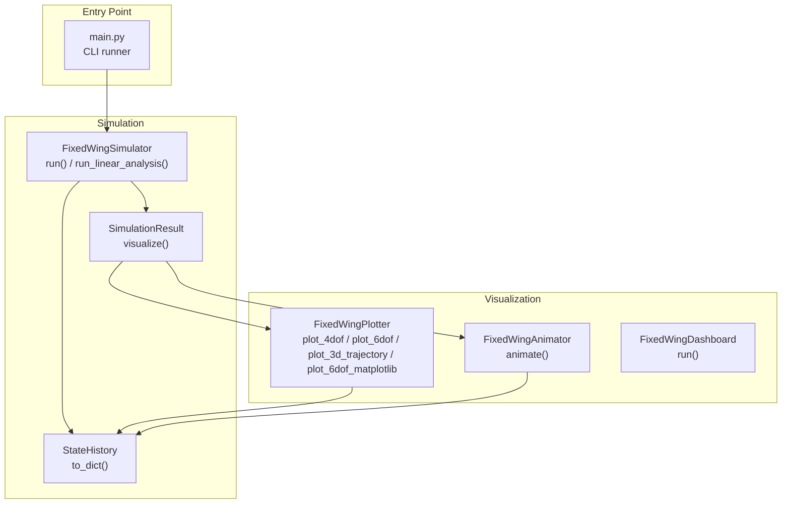
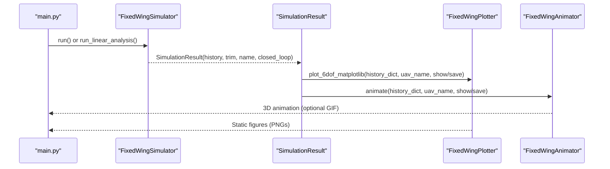
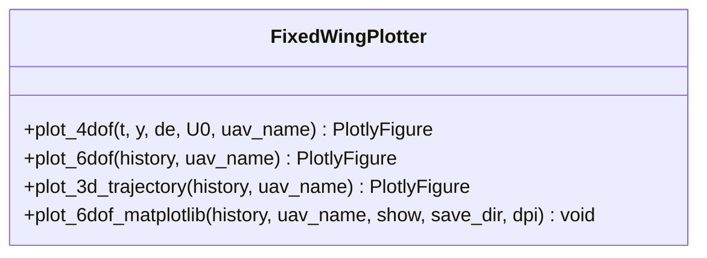
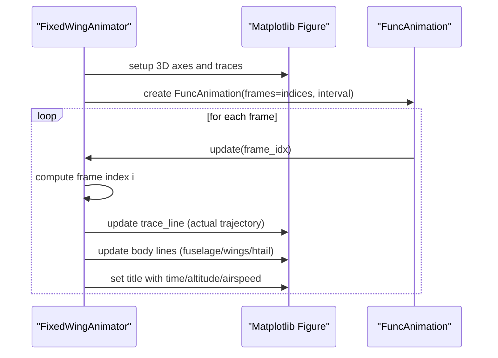
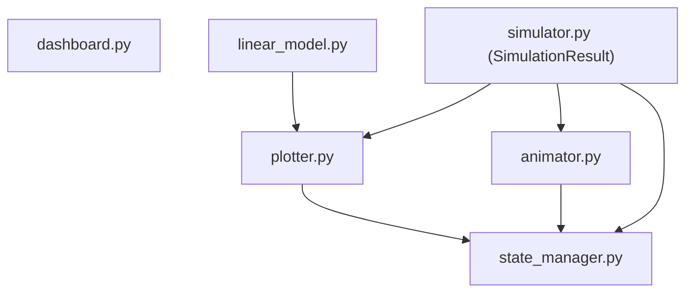

# Plotting System

<cite>
**Referenced Files in This Document**
- [plotter.py](file://src/visualization/plotter.py)
- [__init__.py](file://src/visualization/__init__.py)
- [animator.py](file://src/visualization/animator.py)
- [dashboard.py](file://src/visualization/dashboard.py)
- [state_manager.py](file://src/simulation/state_manager.py)
- [simulator.py](file://src/simulation/simulator.py)
- [main.py](file://main.py)
- [simulation.yaml](file://config/simulation.yaml)
- [aircraft.yaml](file://config/aircraft.yaml)
- [linear_model.py](file://src/dynamics/linear_model.py)
</cite>

## Table of Contents
1. [Introduction](#introduction)
2. [Project Structure](#project-structure)
3. [Core Components](#core-components)
4. [Architecture Overview](#architecture-overview)
5. [Detailed Component Analysis](#detailed-component-analysis)
6. [Dependency Analysis](#dependency-analysis)
7. [Performance Considerations](#performance-considerations)
8. [Troubleshooting Guide](#troubleshooting-guide)
9. [Conclusion](#conclusion)
10. [Appendices](#appendices)

## Introduction
This document describes the plotting system used by the fixed-wing simulation framework. It focuses on the FixedWingPlotter class and its dual-mode plotting capabilities:
- Plotly-based interactive plots for web dashboards and notebooks
- Matplotlib-based static figures for standalone scripts and batch processing

It documents the primary plotting methods:
- plot_4dof: linear model time-domain responses
- plot_6dof: comprehensive 6-DOF simulation results
- plot_3d_trajectory: 3D NED trajectory visualization
- plot_6dof_matplotlib: static Matplotlib figures across three figure windows

Additionally, it explains configuration options, styling parameters, figure customization, export functionality, and integration with simulation results. Practical examples and performance considerations for large datasets and memory management are included.

## Project Structure
The plotting system resides in the visualization package and integrates with the simulation engine via the SimulationResult container. The main entry point supports running simulations and invoking plotting routines.

**Diagram sources**
- [plotter.py](file://src/visualization/plotter.py#L19-L244)
- [animator.py](file://src/visualization/animator.py#L14-L150)
- [dashboard.py](file://src/visualization/dashboard.py#L28-L167)
- [state_manager.py](file://src/simulation/state_manager.py#L95-L193)
- [simulator.py](file://src/simulation/simulator.py#L59-L110)
- [main.py](file://main.py#L98-L145)

**Section sources**
- [plotter.py](file://src/visualization/plotter.py#L1-L244)
- [__init__.py](file://src/visualization/__init__.py#L1-L8)
- [state_manager.py](file://src/simulation/state_manager.py#L95-L193)
- [simulator.py](file://src/simulation/simulator.py#L59-L110)
- [main.py](file://main.py#L98-L145)

## Core Components
- FixedWingPlotter: Provides four plotting methods for Plotly and Matplotlib outputs. Methods:
  - plot_4dof: 3x2 subplot of longitudinal states and elevator input
  - plot_6dof: stacked subplots for all 6-DOF states and controls
  - plot_3d_trajectory: 3D NED trajectory with optional desired trajectory
  - plot_6dof_matplotlib: three Matplotlib figure windows (position/velocity, attitude/angular rates, control inputs)
- FixedWingAnimator: 3D trajectory animation using Matplotlib FuncAnimation
- FixedWingDashboard: Interactive real-time dashboard with widgets
- SimulationResult: Wraps StateHistory and provides convenience methods for plotting and animation
- StateHistory: Efficient pre-allocated history buffer exporting to dict for plotting

Key integration points:
- SimulationResult.visualize() invokes FixedWingPlotter.plot_6dof_matplotlib and FixedWingAnimator.animate
- FixedWingSimulator.run() produces StateHistory used by plotting functions
- FixedWingSimulator.run_linear_analysis() produces LinearAnalysisResult used by plot_4dof

**Section sources**
- [plotter.py](file://src/visualization/plotter.py#L19-L244)
- [animator.py](file://src/visualization/animator.py#L14-L150)
- [dashboard.py](file://src/visualization/dashboard.py#L28-L167)
- [state_manager.py](file://src/simulation/state_manager.py#L95-L193)
- [simulator.py](file://src/simulation/simulator.py#L59-L110)
- [linear_model.py](file://src/dynamics/linear_model.py#L57-L105)

## Architecture Overview
The plotting system is designed for dual-mode compatibility:
- Web/UI mode: Plotly figures suitable for interactive dashboards and notebooks
- Batch/standalone mode: Matplotlib figures suitable for saving PNGs and non-interactive environments

**Diagram sources**
- [main.py](file://main.py#L124-L140)
- [simulator.py](file://src/simulation/simulator.py#L239-L567)
- [simulator.py](file://src/simulation/simulator.py#L59-L110)
- [plotter.py](file://src/visualization/plotter.py#L161-L244)
- [animator.py](file://src/visualization/animator.py#L25-L150)

## Detailed Component Analysis

### FixedWingPlotter: Dual-Mode Plotting
FixedWingPlotter offers both Plotly and Matplotlib plotting APIs. It expects simulation history as a dictionary keyed by state/control names.

- plot_4dof
  - Purpose: Longitudinal 4-DOF time-domain response with elevator input
  - Input: time array, state array (4 DOF), elevator input array, trim speed U0, UAV name
  - Output: Plotly figure with 3x2 subplots (forward speed perturbation, angle of attack, pitch rate, pitch angle, elevator)
  - Notes: Uses degrees for angles; scales u_p by U0 for physical units
- plot_6dof
  - Purpose: Full 6-DOF state history
  - Input: history dictionary (time + all states and controls)
  - Output: Plotly figure with stacked subplots for each variable
  - Notes: Automatically computes subplot titles and heights based on number of plotted series
- plot_3d_trajectory
  - Purpose: 3D NED trajectory visualization
  - Input: history dictionary with NED positions and optional desired trajectory
  - Output: Plotly 3D figure with actual and desired trajectories
  - Notes: Start marker, optional desired trajectory dashed line
- plot_6dof_matplotlib
  - Purpose: Static Matplotlib figures for batch processing
  - Input: history dictionary, uav_name, show flag, save_dir, dpi
  - Output: Three figure windows (position/velocity, attitude/angular rates, control inputs)
  - Notes: Saves PNGs if save_dir is provided; closes figures when show=False to free memory

Configuration and styling:
- Plotly figures: configured with subplot titles, grid spacing, figure height, axis labels
- Matplotlib figures: tight layouts, grids, titles, and optional saving with configurable DPI

Export functionality:
- Matplotlib saves PNGs to a specified directory with filenames based on UAV name and subplot group
- Plotly figures are returned for external rendering or saving

Integration with simulation results:
- SimulationResult.visualize() calls plot_6dof_matplotlib and animate
- FixedWingSimulator.run() produces StateHistory consumed by these methods

**Section sources**
- [plotter.py](file://src/visualization/plotter.py#L22-L65)
- [plotter.py](file://src/visualization/plotter.py#L68-L111)
- [plotter.py](file://src/visualization/plotter.py#L114-L154)
- [plotter.py](file://src/visualization/plotter.py#L161-L244)
- [simulator.py](file://src/simulation/simulator.py#L92-L109)
- [state_manager.py](file://src/simulation/state_manager.py#L179-L180)

#### Class Diagram: FixedWingPlotter

**Diagram sources**
- [plotter.py](file://src/visualization/plotter.py#L19-L244)

### FixedWingAnimator: 3D Trajectory Animation
FixedWingAnimator creates a 3D animation using Matplotlib FuncAnimation. It renders:
- Actual trajectory trace (blue)
- Optional desired trajectory (red dashed)
- Aircraft body lines (fuselage, wings, horizontal tail) with orientation based on Euler angles
- Waypoints if present

Key parameters:
- history: StateHistory.to_dict() output
- uav_name: display label
- num_frames: animation stride (update every N steps)
- show: display interactive window
- save_path: optional GIF path

Performance considerations:
- Uses precomputed frame indices to reduce update overhead
- Auto-scales axes once based on trajectory extents

**Section sources**
- [animator.py](file://src/visualization/animator.py#L25-L150)

#### Sequence Diagram: Animator Update Loop

**Diagram sources**
- [animator.py](file://src/visualization/animator.py#L107-L135)

### FixedWingDashboard: Interactive Real-Time Dashboard
FixedWingDashboard provides an interactive real-time dashboard with:
- Altitude and airspeed plots
- Live state numerical readout
- Pause/Resume and Restart buttons
- Flight mode selector (RadioButtons)

Integration:
- Uses Matplotlib widgets and FuncAnimation
- Integrates with FixedWingSimulator.step() for incremental updates
- Supports TkAgg backend for interactivity

**Section sources**
- [dashboard.py](file://src/visualization/dashboard.py#L28-L167)

### StateHistory and SimulationResult: Data Flow for Plots
StateHistory stores simulation data efficiently in pre-allocated NumPy arrays and exposes:
- to_dict(): returns a dictionary of arrays suitable for plotting
- trim(): trims unused tail to minimize memory footprint
- to_csv(): exports history to CSV

SimulationResult wraps StateHistory and provides:
- summary(): prints a concise summary
- visualize(): quick 2D + 3D visualization using plotter and animator

**Section sources**
- [state_manager.py](file://src/simulation/state_manager.py#L95-L193)
- [simulator.py](file://src/simulation/simulator.py#L59-L110)

### Linear Model Plotting: plot_4dof vs LinearAnalysisResult.plot
The 4-DOF linear model produces a LinearAnalysisResult with:
- t: time array
- y: (4, N) state history [u_p, alpha, q, theta]
- de: elevator input history
- U0: trim speed
- modes: eigenvalue analysis results

LinearAnalysisResult.plot() provides a standalone Matplotlib plot for linear analysis. FixedWingPlotter.plot_4dof() is compatible with the same data shape and returns a Plotly figure.

**Section sources**
- [linear_model.py](file://src/dynamics/linear_model.py#L57-L105)
- [linear_model.py](file://src/dynamics/linear_model.py#L312-L319)
- [plotter.py](file://src/visualization/plotter.py#L22-L65)

## Dependency Analysis
The plotting system depends on:
- NumPy for numerical arrays
- Matplotlib for static figures and animations
- Plotly for interactive figures
- StateHistory for structured simulation data

**Diagram sources**
- [plotter.py](file://src/visualization/plotter.py#L11-L12)
- [animator.py](file://src/visualization/animator.py#L10-L11)
- [dashboard.py](file://src/visualization/dashboard.py#L18-L22)
- [state_manager.py](file://src/simulation/state_manager.py#L11-L13)
- [simulator.py](file://src/simulation/simulator.py#L49-L51)
- [linear_model.py](file://src/dynamics/linear_model.py#L18-L20)

**Section sources**
- [plotter.py](file://src/visualization/plotter.py#L11-L12)
- [animator.py](file://src/visualization/animator.py#L10-L11)
- [dashboard.py](file://src/visualization/dashboard.py#L18-L22)
- [state_manager.py](file://src/simulation/state_manager.py#L11-L13)
- [simulator.py](file://src/simulation/simulator.py#L49-L51)
- [linear_model.py](file://src/dynamics/linear_model.py#L18-L20)

## Performance Considerations
- Memory management
  - StateHistory uses pre-allocated arrays and trim() to remove unused tail, minimizing memory footprint
  - plot_6dof_matplotlib closes figures when show=False to release memory in non-interactive runs
- Large dataset handling
  - Matplotlib static plots are efficient for batch processing; consider reducing DPI or limiting saved figures for very long simulations
  - Plotly figures can handle larger datasets but may require interactive backends; consider exporting static images for batch workflows
- Animation performance
  - FixedWingAnimator uses a stride (num_frames) to limit update frequency and reduce computational load
  - Auto-scaling axes is performed once to avoid repeated expensive operations
- Export and I/O
  - Saving PNGs to disk can be slow for many figures; batch process and use appropriate DPI
  - CSV export via StateHistory.to_csv() is available for post-processing outside the plotting system

[No sources needed since this section provides general guidance]

## Troubleshooting Guide
- Missing Matplotlib
  - FixedWingDashboard requires Matplotlib; ImportError is raised if unavailable
- Save failures
  - plot_6dof_matplotlib prints warnings if saving PNGs fails; check permissions and path availability
- Empty desired trajectory
  - plot_3d_trajectory skips desired trajectory if all-zero; ensure desired positions are recorded in history
- Backend issues
  - For non-interactive environments, set show=False and use a non-GUI backend to avoid display errors

**Section sources**
- [dashboard.py](file://src/visualization/dashboard.py#L42-L43)
- [plotter.py](file://src/visualization/plotter.py#L191-L194)
- [plotter.py](file://src/visualization/plotter.py#L135-L142)

## Conclusion
The FixedWingPlotter provides a unified interface for both interactive Plotly and static Matplotlib plotting. It integrates seamlessly with the simulation pipeline via SimulationResult and StateHistory, supporting both real-time dashboards and batch post-processing. The system’s design emphasizes performance, memory efficiency, and flexibility across different deployment scenarios.

[No sources needed since this section summarizes without analyzing specific files]

## Appendices

### Practical Examples and Workflows
- Quick 2D + 3D visualization
  - Use SimulationResult.visualize() to generate Matplotlib figures and animate the trajectory
- Plotly figures for dashboards
  - Use FixedWingPlotter.plot_6dof(history_dict, uav_name) for interactive multi-panel plots
  - Use FixedWingPlotter.plot_3d_trajectory(history_dict, uav_name) for 3D trajectory views
- Matplotlib static figures for reports
  - Use FixedWingPlotter.plot_6dof_matplotlib(history_dict, uav_name, show=False, save_dir="figures", dpi=300) to save high-resolution PNGs
- Linear model analysis
  - Use LinearAnalysisResult.plot() for standalone Matplotlib plots
  - Use FixedWingPlotter.plot_4dof(t, y, de, U0, uav_name) for Plotly 4-DOF responses

**Section sources**
- [simulator.py](file://src/simulation/simulator.py#L92-L109)
- [plotter.py](file://src/visualization/plotter.py#L68-L111)
- [plotter.py](file://src/visualization/plotter.py#L114-L154)
- [plotter.py](file://src/visualization/plotter.py#L161-L244)
- [linear_model.py](file://src/dynamics/linear_model.py#L82-L104)

### Configuration Options and Defaults
- Simulation configuration
  - dt, duration, integrator tolerances, initial conditions, wind settings, logging
- Aircraft configuration
  - aircraft_name selection and optional parameter overrides
- CLI integration
  - main.py supports running 4-DOF analysis, 6-DOF open-loop, closed-loop simulation, and disabling plots

**Section sources**
- [simulation.yaml](file://config/simulation.yaml#L1-L30)
- [aircraft.yaml](file://config/aircraft.yaml#L1-L13)
- [main.py](file://main.py#L32-L95)