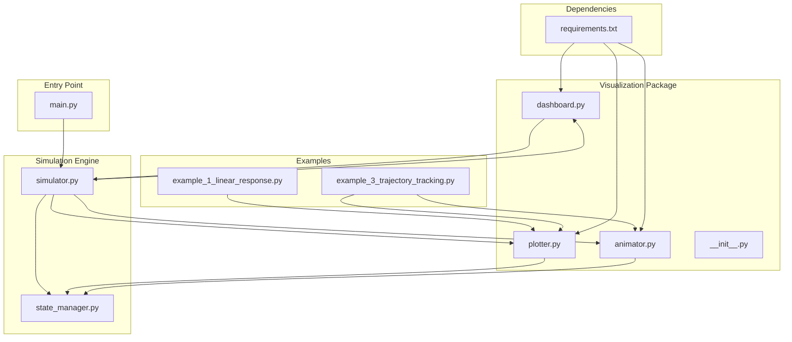
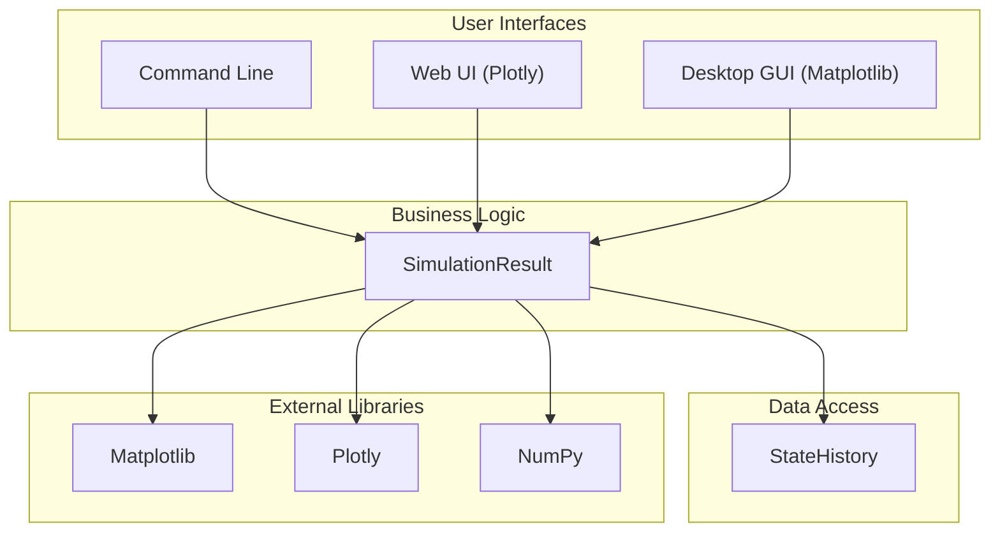
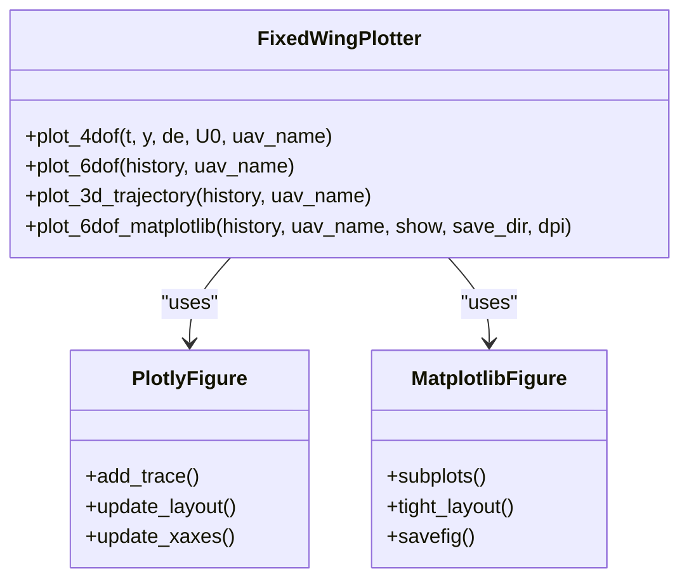
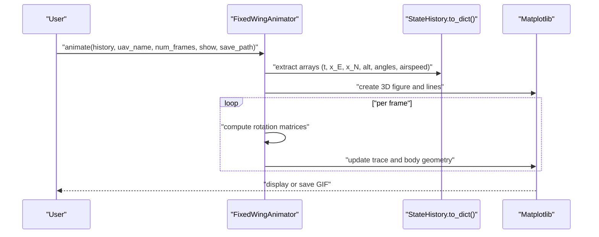
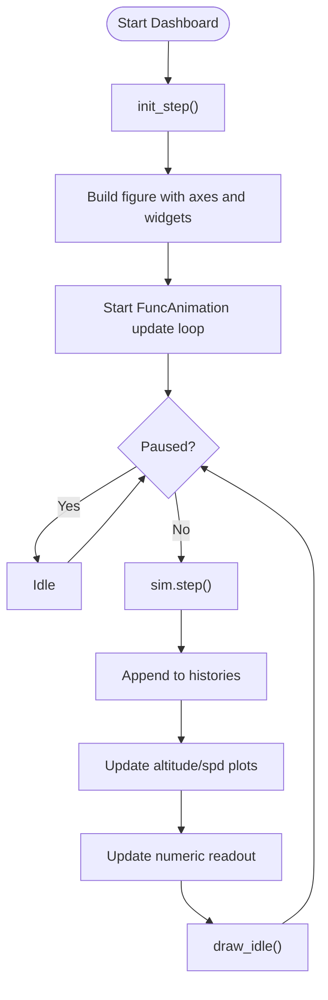
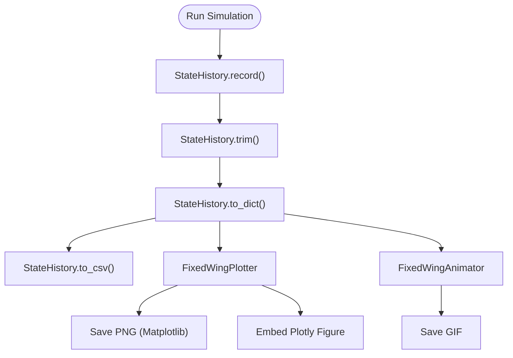
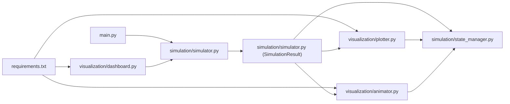
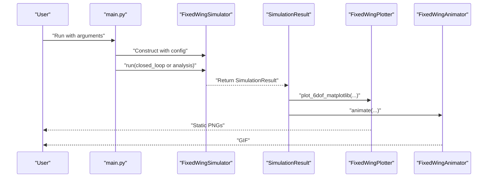

# Visualization and Data Output

<cite>
**Referenced Files in This Document**
- [src/visualization/__init__.py](file://src/visualization/__init__.py)
- [src/visualization/plotter.py](file://src/visualization/plotter.py)
- [src/visualization/animator.py](file://src/visualization/animator.py)
- [src/visualization/dashboard.py](file://src/visualization/dashboard.py)
- [src/simulation/state_manager.py](file://src/simulation/state_manager.py)
- [src/simulation/simulator.py](file://src/simulation/simulator.py)
- [main.py](file://main.py)
- [examples/example_1_linear_response.py](file://examples/example_1_linear_response.py)
- [examples/example_3_trajectory_tracking.py](file://examples/example_3_trajectory_tracking.py)
- [requirements.txt](file://requirements.txt)
</cite>

## Table of Contents
1. [Introduction](#introduction)
2. [Project Structure](#project-structure)
3. [Core Components](#core-components)
4. [Architecture Overview](#architecture-overview)
5. [Detailed Component Analysis](#detailed-component-analysis)
6. [Dependency Analysis](#dependency-analysis)
7. [Performance Considerations](#performance-considerations)
8. [Troubleshooting Guide](#troubleshooting-guide)
9. [Conclusion](#conclusion)
10. [Appendices](#appendices)

## Introduction
This document describes the visualization and data output system for the FixedWingSimulator. It covers static plotting capabilities, interactive visualizations using Matplotlib widgets and Plotly, and real-time dashboard systems. It also documents animation playback for flight trajectory visualization, supported data export formats, and result presentation methods. Configuration options for plots, animations, and dashboards are explained, including customization parameters and styling options. Practical examples demonstrate visualization setup, result analysis workflows, and output generation. Finally, performance considerations for large datasets, interactive features, and real-time visualization are addressed.

## Project Structure
The visualization system resides under the visualization package and integrates with the simulation engine and state history. The main components are:
- FixedWingPlotter: Static and interactive 2D/3D plots (Matplotlib and Plotly backends)
- FixedWingAnimator: 3D trajectory animation with optional GIF export
- FixedWingDashboard: Real-time interactive dashboard with live plots and controls

**Diagram sources**
- [src/visualization/__init__.py](file://src/visualization/__init__.py#L1-L8)
- [src/visualization/plotter.py](file://src/visualization/plotter.py#L1-L244)
- [src/visualization/animator.py](file://src/visualization/animator.py#L1-L150)
- [src/visualization/dashboard.py](file://src/visualization/dashboard.py#L1-L167)
- [src/simulation/simulator.py](file://src/simulation/simulator.py#L59-L128)
- [src/simulation/state_manager.py](file://src/simulation/state_manager.py#L95-L193)
- [main.py](file://main.py#L98-L145)
- [examples/example_1_linear_response.py](file://examples/example_1_linear_response.py#L1-L206)
- [examples/example_3_trajectory_tracking.py](file://examples/example_3_trajectory_tracking.py#L1-L194)
- [requirements.txt](file://requirements.txt#L1-L8)

**Section sources**
- [src/visualization/__init__.py](file://src/visualization/__init__.py#L1-L8)
- [src/visualization/plotter.py](file://src/visualization/plotter.py#L1-L244)
- [src/visualization/animator.py](file://src/visualization/animator.py#L1-L150)
- [src/visualization/dashboard.py](file://src/visualization/dashboard.py#L1-L167)
- [src/simulation/state_manager.py](file://src/simulation/state_manager.py#L95-L193)
- [src/simulation/simulator.py](file://src/simulation/simulator.py#L59-L128)
- [main.py](file://main.py#L98-L145)
- [examples/example_1_linear_response.py](file://examples/example_1_linear_response.py#L1-L206)
- [examples/example_3_trajectory_tracking.py](file://examples/example_3_trajectory_tracking.py#L1-L194)
- [requirements.txt](file://requirements.txt#L1-L8)

## Core Components
- FixedWingPlotter: Provides 2D and 3D plots for time-domain responses and trajectories. Supports:
  - Plotly-based interactive figures for web UI embedding
  - Matplotlib-based static figures for batch and desktop use
  - 4-DOF and 6-DOF time-domain plots
  - 3D NED trajectory plots with start/end markers and optional desired trajectory overlay
- FixedWingAnimator: Creates 3D animated trajectories with:
  - Dynamic trace growth over time
  - Aircraft body geometry (fuselage, wings, horizontal tail) transformed via rotation matrices
  - Optional GIF export and configurable update stride
- FixedWingDashboard: Real-time interactive monitoring with:
  - Altitude and airspeed live plots
  - Numeric state readout
  - Pause/resume/restart controls
  - Flight mode selector
  - Integration with FixedWingSimulator’s step interface

**Section sources**
- [src/visualization/plotter.py](file://src/visualization/plotter.py#L19-L244)
- [src/visualization/animator.py](file://src/visualization/animator.py#L14-L150)
- [src/visualization/dashboard.py](file://src/visualization/dashboard.py#L28-L167)

## Architecture Overview
The visualization system is layered:
- User interfaces: CLI, web UI (via Plotly), and desktop GUI (via Matplotlib)
- Business logic: SimulationResult orchestrates visualization calls
- Data access: StateHistory provides standardized time-series dictionaries
- External libraries: Matplotlib, Plotly, NumPy

**Diagram sources**
- [src/simulation/simulator.py](file://src/simulation/simulator.py#L59-L128)
- [src/visualization/plotter.py](file://src/visualization/plotter.py#L19-L244)
- [src/visualization/animator.py](file://src/visualization/animator.py#L14-L150)
- [src/visualization/dashboard.py](file://src/visualization/dashboard.py#L28-L167)

## Detailed Component Analysis

### FixedWingPlotter
- Plotly backend:
  - Creates subplots for 4-DOF and 6-DOF time-domain responses
  - Builds 3D trajectory scenes with lines and markers
  - Returns Plotly Figure objects suitable for web UI embedding
- Matplotlib backend:
  - Generates static figures for position/velocity, attitude/angular rates, and control inputs
  - Supports saving PNGs with configurable DPI and directory
  - Operates in non-interactive mode when needed

**Diagram sources**
- [src/visualization/plotter.py](file://src/visualization/plotter.py#L19-L244)

**Section sources**
- [src/visualization/plotter.py](file://src/visualization/plotter.py#L19-L244)

### FixedWingAnimator
- Reads StateHistory dictionary and constructs 3D trajectory animation
- Computes frame indices to reduce rendering cost
- Updates trace and aircraft body geometry per frame using rotation matrices
- Can save animation as GIF and optionally show the window

**Diagram sources**
- [src/visualization/animator.py](file://src/visualization/animator.py#L25-L150)

**Section sources**
- [src/visualization/animator.py](file://src/visualization/animator.py#L14-L150)

### FixedWingDashboard
- Integrates with FixedWingSimulator via step interface
- Uses Matplotlib widgets for interactive controls
- Maintains live histories and updates plots and numeric readout
- Supports pause/resume/restart and flight mode selection

**Diagram sources**
- [src/visualization/dashboard.py](file://src/visualization/dashboard.py#L59-L111)

**Section sources**
- [src/visualization/dashboard.py](file://src/visualization/dashboard.py#L28-L167)

### Data Export and Result Presentation
- CSV export: StateHistory.to_csv writes all recorded channels to CSV
- Static figures: Matplotlib backend saves PNGs for offline analysis
- Interactive figures: Plotly backend produces embeddable figures for web UI
- Quick visualization: SimulationResult.visualize invokes both Matplotlib and Animator

**Diagram sources**
- [src/simulation/state_manager.py](file://src/simulation/state_manager.py#L179-L193)
- [src/simulation/simulator.py](file://src/simulation/simulator.py#L92-L109)
- [src/visualization/plotter.py](file://src/visualization/plotter.py#L161-L244)
- [src/visualization/animator.py](file://src/visualization/animator.py#L144-L150)

**Section sources**
- [src/simulation/state_manager.py](file://src/simulation/state_manager.py#L179-L193)
- [src/simulation/simulator.py](file://src/simulation/simulator.py#L92-L109)
- [src/visualization/plotter.py](file://src/visualization/plotter.py#L161-L244)
- [src/visualization/animator.py](file://src/visualization/animator.py#L144-L150)

## Dependency Analysis
- External dependencies: NumPy, SciPy, Matplotlib, Plotly, PyYAML, Pandas
- Internal dependencies: StateHistory provides standardized data; SimulationResult orchestrates visualization; visualization components depend on Matplotlib/Plotly and NumPy

**Diagram sources**
- [requirements.txt](file://requirements.txt#L1-L8)
- [main.py](file://main.py#L98-L145)
- [src/simulation/simulator.py](file://src/simulation/simulator.py#L59-L128)
- [src/simulation/state_manager.py](file://src/simulation/state_manager.py#L95-L193)
- [src/visualization/plotter.py](file://src/visualization/plotter.py#L19-L244)
- [src/visualization/animator.py](file://src/visualization/animator.py#L14-L150)
- [src/visualization/dashboard.py](file://src/visualization/dashboard.py#L28-L167)

**Section sources**
- [requirements.txt](file://requirements.txt#L1-L8)
- [main.py](file://main.py#L98-L145)
- [src/simulation/simulator.py](file://src/simulation/simulator.py#L59-L128)
- [src/simulation/state_manager.py](file://src/simulation/state_manager.py#L95-L193)
- [src/visualization/plotter.py](file://src/visualization/plotter.py#L19-L244)
- [src/visualization/animator.py](file://src/visualization/animator.py#L14-L150)
- [src/visualization/dashboard.py](file://src/visualization/dashboard.py#L28-L167)

## Performance Considerations
- Memory management:
  - StateHistory pre-allocates arrays and trims unused tail after simulation
- Rendering optimization:
  - FixedWingAnimator precomputes frame indices and updates only changing data
  - FixedWingDashboard uses incremental updates and autoscaling
- Backend selection:
  - Use Agg backend for non-interactive batch rendering
  - Use TkAgg for interactive dashboards
- Large dataset handling:
  - Prefer CSV export and static plots for heavy post-processing
  - Consider data downsampling or trimming before visualization

**Section sources**
- [src/simulation/state_manager.py](file://src/simulation/state_manager.py#L170-L193)
- [src/visualization/animator.py](file://src/visualization/animator.py#L104-L150)
- [src/visualization/dashboard.py](file://src/visualization/dashboard.py#L69-L110)

## Troubleshooting Guide
- Missing dependencies:
  - Ensure Matplotlib, Plotly, NumPy, and SciPy are installed
- No GUI window:
  - Use non-interactive backend (Agg) for batch scripts
  - For dashboards, ensure TkAgg backend is available
- Animation not saving:
  - Verify Pillow availability and write permissions
- Dashboard not updating:
  - Confirm init_step() was called before step()
  - Check that step() does not raise exceptions
- Expected trajectory not shown:
  - Ensure history contains non-zero desired trajectory fields

**Section sources**
- [src/visualization/dashboard.py](file://src/visualization/dashboard.py#L42-L44)
- [src/visualization/animator.py](file://src/visualization/animator.py#L144-L146)
- [src/visualization/dashboard.py](file://src/visualization/dashboard.py#L69-L110)

## Conclusion
The visualization system provides a cohesive toolkit for analyzing fixed-wing flight simulations. It supports static and interactive plots, 3D trajectory animations, and real-time dashboards. Through standardized StateHistory dictionaries and flexible backends, it enables both desktop and web-based workflows. With careful configuration and performance tuning, it scales to large datasets while maintaining responsiveness.

## Appendices

### Configuration Options and Customization
- FixedWingAnimator.animate
  - history: StateHistory.to_dict() output
  - uav_name: display label
  - num_frames: update stride for reduced rendering cost
  - show: whether to display the window
  - save_path: optional GIF path for export
- FixedWingDashboard.run
  - max_steps: maximum history length
  - Interactive widgets: pause/restart buttons, flight mode radio buttons
- FixedWingPlotter (Matplotlib)
  - show: display window or suppress
  - save_dir: directory to save PNGs
  - dpi: resolution for saved images

**Section sources**
- [src/visualization/animator.py](file://src/visualization/animator.py#L25-L43)
- [src/visualization/dashboard.py](file://src/visualization/dashboard.py#L41-L60)
- [src/visualization/plotter.py](file://src/visualization/plotter.py#L161-L180)

### Practical Examples and Workflows
- Example 1: Linear response comparison
  - Demonstrates open-loop vs closed-loop pitch responses and saves CSV and PNG
- Example 3: Trajectory tracking
  - AUTO mode with minimum-snap trajectory; saves CSV and multiple PNGs plus 3D trajectory
- Command-line entry point
  - Runs simulations with configurable aircraft, mode, duration, wind, and trajectory types
  - Optionally disables visualization for batch runs

**Diagram sources**
- [main.py](file://main.py#L98-L145)
- [src/simulation/simulator.py](file://src/simulation/simulator.py#L92-L109)
- [src/visualization/plotter.py](file://src/visualization/plotter.py#L161-L244)
- [src/visualization/animator.py](file://src/visualization/animator.py#L137-L150)

**Section sources**
- [examples/example_1_linear_response.py](file://examples/example_1_linear_response.py#L1-L206)
- [examples/example_3_trajectory_tracking.py](file://examples/example_3_trajectory_tracking.py#L1-L194)
- [main.py](file://main.py#L98-L145)

### Data Formats and Export
- StateHistory dictionary keys include time, velocities, angular rates, Euler angles, positions, angles-of-attack, airspeed, altitude, control surfaces, and optional desired positions
- CSV export includes all channels for downstream analysis
- Static PNG export for desktop presentations

**Section sources**
- [src/simulation/state_manager.py](file://src/simulation/state_manager.py#L104-L115)
- [src/simulation/state_manager.py](file://src/simulation/state_manager.py#L182-L193)