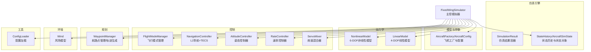
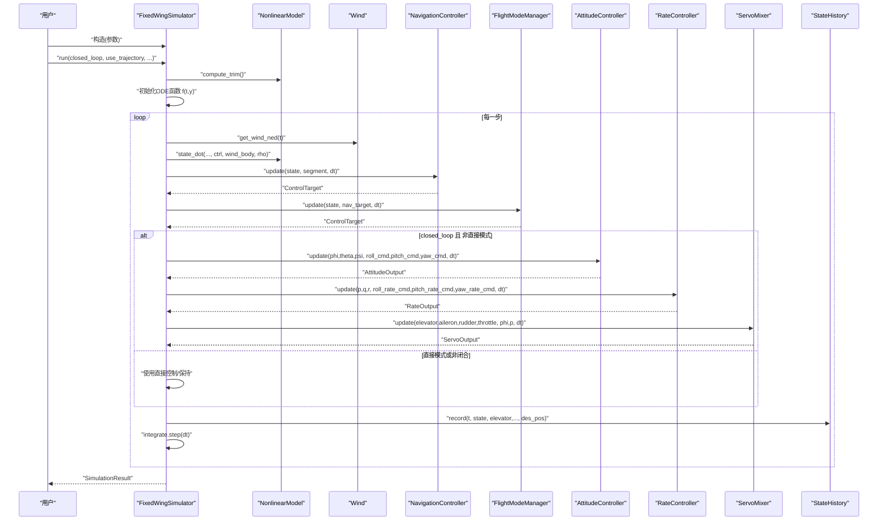
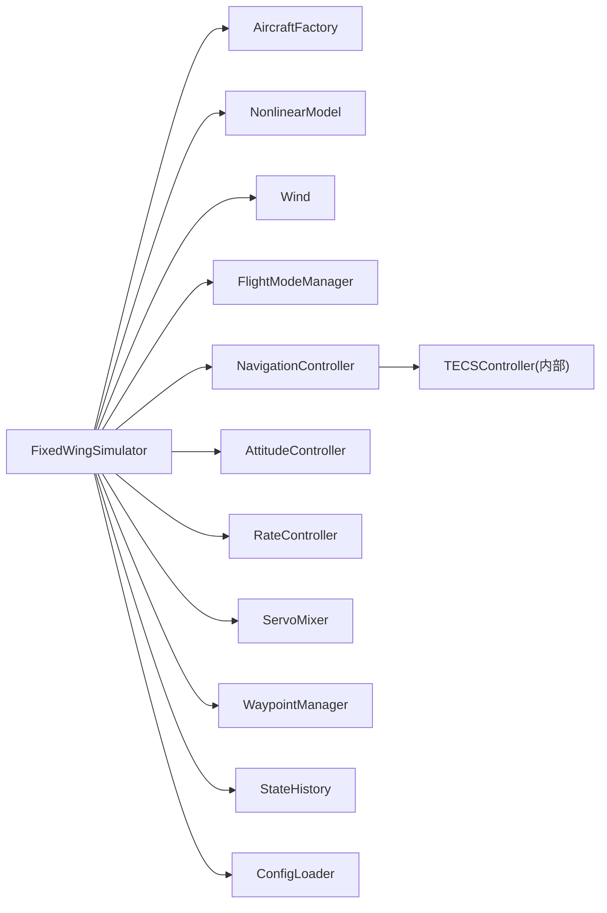

# API参考

<cite>
**本文引用的文件**
- [src/simulation/simulator.py](file://src/simulation/simulator.py)
- [src/models/aircraft_factory.py](file://src/models/aircraft_factory.py)
- [src/dynamics/nonlinear_model.py](file://src/dynamics/nonlinear_model.py)
- [src/dynamics/linear_model.py](file://src/dynamics/linear_model.py)
- [src/control/navigation_controller.py](file://src/control/navigation_controller.py)
- [src/control/attitude_controller.py](file://src/control/attitude_controller.py)
- [src/control/flight_mode_manager.py](file://src/control/flight_mode_manager.py)
- [src/planning/waypoint_manager.py](file://src/planning/waypoint_manager.py)
- [src/environment/wind_model.py](file://src/environment/wind_model.py)
- [src/simulation/state_manager.py](file://src/simulation/state_manager.py)
- [src/utils/config_loader.py](file://src/utils/config_loader.py)
- [examples/example_1_linear_response.py](file://examples/example_1_linear_response.py)
</cite>

## 目录
1. [简介](#简介)
2. [项目结构](#项目结构)
3. [核心组件](#核心组件)
4. [架构总览](#架构总览)
5. [详细组件分析](#详细组件分析)
6. [依赖关系分析](#依赖关系分析)
7. [性能考虑](#性能考虑)
8. [故障排查指南](#故障排查指南)
9. [结论](#结论)
10. [附录](#附录)

## 简介
本文件为 FixedWingSimulator 的完整 API 参考，覆盖主控模拟器、飞行器模型、动力学、控制链路、路径规划、环境建模与状态管理等模块。文档逐项说明公共类、方法与函数的接口规范（参数类型、返回值、异常处理）、用途与使用场景、调用约定、依赖关系与调用顺序，并提供示例脚本路径与常见错误用法对比，帮助开发者快速集成与扩展。

## 项目结构
项目采用按功能域划分的层次化组织：models（飞机参数）、dynamics（非线性/线性动力学）、control（导航与姿态/速率/舵面混合器/TECS）、planning（航路点与轨迹）、environment（风场/大气）、simulation（积分器/状态管理/主控）、utils（配置加载/数学工具）、visualization（绘图/动画）以及 examples（示例）。

图表来源
- [src/simulation/simulator.py](file://src/simulation/simulator.py#L115-L642)
- [src/models/aircraft_factory.py](file://src/models/aircraft_factory.py#L15-L136)
- [src/dynamics/nonlinear_model.py](file://src/dynamics/nonlinear_model.py#L104-L386)
- [src/dynamics/linear_model.py](file://src/dynamics/linear_model.py#L107-L319)
- [src/control/flight_mode_manager.py](file://src/control/flight_mode_manager.py#L115-L298)
- [src/control/navigation_controller.py](file://src/control/navigation_controller.py#L45-L293)
- [src/control/attitude_controller.py](file://src/control/attitude_controller.py#L33-L134)
- [src/planning/waypoint_manager.py](file://src/planning/waypoint_manager.py#L20-L208)
- [src/environment/wind_model.py](file://src/environment/wind_model.py#L18-L113)
- [src/simulation/state_manager.py](file://src/simulation/state_manager.py#L16-L193)
- [src/utils/config_loader.py](file://src/utils/config_loader.py#L59-L82)

章节来源
- [src/simulation/simulator.py](file://src/simulation/simulator.py#L1-L642)
- [src/models/aircraft_factory.py](file://src/models/aircraft_factory.py#L1-L136)
- [src/dynamics/nonlinear_model.py](file://src/dynamics/nonlinear_model.py#L1-L386)
- [src/dynamics/linear_model.py](file://src/dynamics/linear_model.py#L1-L319)
- [src/control/flight_mode_manager.py](file://src/control/flight_mode_manager.py#L1-L298)
- [src/control/navigation_controller.py](file://src/control/navigation_controller.py#L1-L293)
- [src/control/attitude_controller.py](file://src/control/attitude_controller.py#L1-L134)
- [src/planning/waypoint_manager.py](file://src/planning/waypoint_manager.py#L1-L208)
- [src/environment/wind_model.py](file://src/environment/wind_model.py#L1-L113)
- [src/simulation/state_manager.py](file://src/simulation/state_manager.py#L1-L193)
- [src/utils/config_loader.py](file://src/utils/config_loader.py#L1-L82)

## 核心组件
- 主控模拟器：FixedWingSimulator 提供 run()/run_linear_analysis()/init_step()/step() 等公开 API，负责装配各子系统、构建闭环控制链路、推进仿真并产出 SimulationResult。
- 飞机参数：AircraftFactory/AircraftConfig 负责从数据库合并参数、支持 YAML/字典覆盖导出 ArduPilot 参数。
- 动力学：NonlinearModel 提供 6-DOF 非线性方程与开环脉冲响应 simulate；LinearModel 提供 4-DOF 线性状态空间与模态分析。
- 控制链路：FlightModeManager 选择模式并输出 ControlTarget；NavigationController 使用 L1+TECS；AttitudeController/RateController/ServoMixer 组成内环。
- 规划：WaypointManager 管理航路点并生成最小 snap/jerk 轨迹。
- 环境：Wind 提供多种风场模型。
- 状态管理：StateHistory/AircraftSimState 记录与导出仿真历史。
- 配置：ConfigLoader 提供多配置文件的加载与合并。

章节来源
- [src/simulation/simulator.py](file://src/simulation/simulator.py#L115-L642)
- [src/models/aircraft_factory.py](file://src/models/aircraft_factory.py#L15-L136)
- [src/dynamics/nonlinear_model.py](file://src/dynamics/nonlinear_model.py#L104-L386)
- [src/dynamics/linear_model.py](file://src/dynamics/linear_model.py#L107-L319)
- [src/control/flight_mode_manager.py](file://src/control/flight_mode_manager.py#L115-L298)
- [src/control/navigation_controller.py](file://src/control/navigation_controller.py#L45-L293)
- [src/control/attitude_controller.py](file://src/control/attitude_controller.py#L33-L134)
- [src/planning/waypoint_manager.py](file://src/planning/waypoint_manager.py#L20-L208)
- [src/environment/wind_model.py](file://src/environment/wind_model.py#L18-L113)
- [src/simulation/state_manager.py](file://src/simulation/state_manager.py#L16-L193)
- [src/utils/config_loader.py](file://src/utils/config_loader.py#L59-L82)

## 架构总览
下图展示主控模拟器在一次 run() 过程中的关键调用序列与数据流。

图表来源
- [src/simulation/simulator.py](file://src/simulation/simulator.py#L239-L567)
- [src/dynamics/nonlinear_model.py](file://src/dynamics/nonlinear_model.py#L160-L255)
- [src/environment/wind_model.py](file://src/environment/wind_model.py#L76-L108)
- [src/control/navigation_controller.py](file://src/control/navigation_controller.py#L134-L202)
- [src/control/flight_mode_manager.py](file://src/control/flight_mode_manager.py#L173-L211)
- [src/control/attitude_controller.py](file://src/control/attitude_controller.py#L81-L122)
- [src/simulation/state_manager.py](file://src/simulation/state_manager.py#L124-L168)

## 详细组件分析

### FixedWingSimulator（主控模拟器）
- 类型：类
- 作用：装配并驱动整个仿真流程，包含 ArduPilot 兼容的五层控制链路（导航→模式→姿态→速率→舵面），支持闭环与开环运行，支持线性分析与逐步推进。
- 关键字段
  - dt：仿真步长（秒）
  - duration：总仿真时长（秒）
  - wind_type/traj_type：风场类型与轨迹类型
  - aircraft_cfg/params：飞机配置与气动参数
  - dyn：NonlinearModel 实例
  - wind：Wind 实例
  - nav_ctrl/att_ctrl/rate_ctrl/servo：控制链路实例
  - wp_mgr：WaypointManager 实例
  - _cfg：ConfigLoader 实例
  - _trim：上次计算的静力平衡结果
- 关键方法
  - __init__(aircraft_name, config_dir, dt, duration, initial_mode, wind_type, traj_type)
    - 参数类型：aircraft_name(str)、config_dir(str|None)、dt(float)、duration(float)、initial_mode(str|enum)、wind_type(str)、traj_type(str)
    - 返回：无
    - 异常：当 aircraft_name 不在可用列表时抛出 ValueError
    - 说明：加载配置、创建飞机参数、初始化风场、ArduPilot 参数、控制层、轨迹管理器、动力学模型
  - run(closed_loop=True, use_trajectory=True, wp_switch_dist=60.0, loop_circuit=False) -> SimulationResult
    - 参数类型：closed_loop(bool)、use_trajectory(bool)、wp_switch_dist(float)、loop_circuit(bool)
    - 返回：SimulationResult（包含历史、修剪结果、机型名、是否闭环）
    - 异常：数值积分过程中可能抛出 RuntimeError 并中断
    - 说明：执行完整仿真循环，构建 ODE 函数，推进控制链路，记录状态，最后裁剪未使用缓冲区
  - run_linear_analysis(pulses=None, duration=None) -> LinearAnalysisResult
    - 参数类型：pulses(list|None)、duration(float|None)
    - 返回：LinearAnalysisResult（线性分析结果）
    - 说明：基于 LinearModel 执行 4-DOF 开环脉冲响应与模态分析
  - init_step() -> AircraftSimState
    - 说明：初始化步进式仿真，返回初始状态
  - step(dt=None) -> AircraftSimState
    - 参数类型：dt(float|None)
    - 返回：当前状态
    - 异常：若未先调用 init_step 则抛出 RuntimeError
- 使用场景
  - 完整闭环飞行仿真：设置 closed_loop=True，准备 WaypointManager 航路点后调用 run()
  - 线性分析：调用 run_linear_analysis() 获取短周期/滑翔模态
  - 逐步集成：在外部 UI 或测试框架中调用 init_step()/step() 实现交互式推进
- 调用约定
  - 必须先设置初始模式与航路点（如需要轨迹跟踪），再调用 run()
  - 步进式模式需先 init_step() 再循环 step()
- 错误处理
  - 未知飞机名：ValueError
  - 数值积分失败：捕获 RuntimeError 并打印错误信息
  - 步进式未初始化：RuntimeError
- 示例脚本
  - 线性响应与闭环对比：参见 [examples/example_1_linear_response.py](file://examples/example_1_linear_response.py#L126-L164)

章节来源
- [src/simulation/simulator.py](file://src/simulation/simulator.py#L115-L642)
- [examples/example_1_linear_response.py](file://examples/example_1_linear_response.py#L126-L164)

### SimulationResult（仿真结果容器）
- 类型：类
- 字段：history(StateHistory)、trim(TrimResult)、uav_name(str)、closed_loop(bool)
- 方法
  - summary() -> str：生成摘要字符串
  - visualize(show=True) -> None：尝试导入可视化模块并绘制 2D/3D 图
- 使用场景：封装一次完整仿真结果，便于汇总与可视化

章节来源
- [src/simulation/simulator.py](file://src/simulation/simulator.py#L59-L110)

### AircraftFactory / AircraftConfig（飞机参数工厂）
- AircraftConfig
  - 字段：name(str)、aero_params(dict)
  - 方法：summary() -> str
- AircraftFactory
  - create(name, yaml_overrides=None, param_overrides=None) -> AircraftConfig
  - from_yaml(config_path) -> AircraftConfig
  - export_ardupilot_params(name, output_path, control_yaml=None) -> None
- 使用场景：从数据库与 YAML/字典合并参数，导出 ArduPilot 参数文件

章节来源
- [src/models/aircraft_factory.py](file://src/models/aircraft_factory.py#L15-L136)

### NonlinearModel（6-DOF 非线性模型）
- 类型：类
- 字段：params(dict)、_p(dict)
- 数据结构
  - Controls：elevator(浮标偏转, rad)、aileron(副翼, rad)、rudder(方向舵, rad)、throttle(归一化油门, 0–1)
  - TrimResult：alpha_trim(弧度)、de_trim(弧度)、U0(米/秒)
  - NonlinearSimResult：t、y、controls、derived、trim、uav_name
- 方法
  - compute_trim() -> TrimResult：求解平飞静力平衡
  - state_dot(t, state, controls, wind_body=None, rho=1.225) -> np.ndarray：计算状态导数
  - make_ode_func(get_controls, get_wind=None, get_rho=None) -> callable：返回 dopri5 可用的 f(t,y)
  - simulate(pulses, duration=10.0, n_points=500, wind_func=None) -> NonlinearSimResult：开环脉冲响应
- 使用场景：提供精确的 6-DOF 非线性动力学，用于闭环仿真与开环响应分析

章节来源
- [src/dynamics/nonlinear_model.py](file://src/dynamics/nonlinear_model.py#L37-L386)

### LinearModel（4-DOF 线性模型）
- 类型：类
- 数据结构
  - ModeResult：name、eigenvalue、wn、zeta、stable
  - LinearAnalysisResult：t、y、de、U0、modes、A、B、uav_name
- 方法
  - build() -> (A,B,U0)：构建纵向线性状态空间
  - analyze_modes(A=None) -> List[ModeResult]：特征值分解识别短周期/滑翔/次阻尼模态
  - simulate(pulses, duration=10.0, n_points=500, A=None,B=None) -> (t,y,de)
  - run_analysis(pulses, duration=10.0, uav_name="UAV") -> LinearAnalysisResult
- 使用场景：线性化分析与模态识别，快速评估稳定性与阻尼特性

章节来源
- [src/dynamics/linear_model.py](file://src/dynamics/linear_model.py#L30-L319)

### NavigationController（导航与 TECS）
- 类型：类
- 数据结构
  - PathSegment：start(end,target_speed)，提供 direction/length 属性
- 方法
  - __init__(l1_period,l1_damping,max_roll,cruise_speed,cruise_alt,...)：构造 TECS 参数
  - reset(state=None)：重置 TECS 积分器
  - update(state, segment, dt) -> ControlTarget：L1 导航 + TECS 高度/空速控制
  - _l1_roll(state, segment) -> float：L1 航迹引导滚转角
- 使用场景：在 AUTO/LOITER/RTH 等模式下提供横向与纵向的目标命令

章节来源
- [src/control/navigation_controller.py](file://src/control/navigation_controller.py#L25-L293)

### FlightModeManager（飞行模式管理）
- 类型：类
- 枚举 FlightMode：MANUAL、STABILIZE、FBW_A、FBW_B、AUTO、LOITER、RTH
- 数据结构
  - AircraftState：位置/速度/姿态/角速率/空速/海拔
  - ControlTarget：期望角度/速率/空速/海拔/油门，以及直接控制覆盖
- 方法
  - set_mode(new_mode)/set_mode_str(mode_str)：模式切换
  - update(state, nav_target=None, dt=0.1) -> ControlTarget：根据当前模式生成目标
  - 各模式实现：_manual/_stabilize/_fbw_a/_fbw_b/_auto
- 使用场景：统一管理 ArduPilot 兼容的飞行模式，生成控制目标

章节来源
- [src/control/flight_mode_manager.py](file://src/control/flight_mode_manager.py#L28-L298)

### AttitudeController（姿态控制器）
- 类型：类
- 数据结构：AttitudeOutput（roll_rate_cmd、pitch_rate_cmd、yaw_rate_cmd）
- 方法
  - __init__(ap_params, dt=0.01)
  - update(phi, theta, psi, roll_cmd, pitch_cmd, yaw_cmd, dt=None) -> AttitudeOutput
  - reload_gains(ap_params)/reset()
- 使用场景：将期望 Euler 角转换为期望角速度命令

章节来源
- [src/control/attitude_controller.py](file://src/control/attitude_controller.py#L25-L134)

### RateController（速率控制器）
- 类型：类
- 作用：将期望角速度命令转换为舵面增量（通过 PID 或等效逻辑）
- 方法：update(p,q,r, roll_rate_cmd,pitch_rate_cmd,yaw_rate_cmd, dt) -> RateOutput
- 使用场景：内环速率控制，与外环姿态控制配合

章节来源
- [src/control/attitude_controller.py](file://src/control/attitude_controller.py#L25-L134)

### ServoMixer（舵面混合器）
- 类型：类
- 作用：将速率/姿态输出与油门混合为实际舵面输出（含偏置与限幅）
- 方法：update(elevator,aileron,rudder,throttle, phi,p, dt) -> ServoOutput
- 使用场景：将控制目标映射到物理舵面与油门

章节来源
- [src/control/attitude_controller.py](file://src/control/attitude_controller.py#L25-L134)

### WaypointManager（航路点与轨迹）
- 类型：类
- 方法
  - add_waypoint(north,east,alt_m)/add_waypoints_ned()/clear_waypoints()
  - load_from_yaml(path)/save_to_yaml(path)
  - build_trajectory() -> AbstractTrajectory
  - trajectory 属性：缓存轨迹对象
  - get_active_segment(t) -> (wp_start, wp_end, T_remaining)
  - desired_state(t) -> TrajectoryState
- 使用场景：管理航路点、生成最小 snap/jerk 轨迹、查询当前段与目标状态

章节来源
- [src/planning/waypoint_manager.py](file://src/planning/waypoint_manager.py#L20-L208)

### Wind（风场模型）
- 类型：类
- 支持类型：NONE、FIXED、SINE、RANDOMSINE
- 方法：get_wind_ned(t) -> np.ndarray
- 使用场景：提供 NED 坐标系下的风矢量，影响气动力与相对速度

章节来源
- [src/environment/wind_model.py](file://src/environment/wind_model.py#L18-L113)

### StateHistory / AircraftSimState（状态管理）
- 类型：类
- AircraftSimState：12 维状态 + 派生变量（空速、攻角、侧滑角、海拔）
- StateHistory：预分配数组高效记录仿真历史，支持 trim()/to_dict()/to_csv()
- 使用场景：记录每一步的状态、控制量与目标位置，便于导出与分析

章节来源
- [src/simulation/state_manager.py](file://src/simulation/state_manager.py#L16-L193)

### ConfigLoader（配置加载）
- 类型：类
- 方法：load_aircraft()/load_control()/load_simulation()/load_trajectory()
- 使用场景：加载并合并 YAML 配置，提供默认值与深度合并

章节来源
- [src/utils/config_loader.py](file://src/utils/config_loader.py#L59-L82)

## 依赖关系分析
- 固定装配关系
  - FixedWingSimulator 依赖：AircraftFactory、NonlinearModel、Wind、ArduPilot 参数、FlightModeManager、NavigationController、AttitudeController、RateController、ServoMixer、WaypointManager、StateHistory、ConfigLoader
  - NavigationController 内部持有 TECSController（来自 control.tecs_controller）
- 运行期耦合
  - run() 中动态构建 ODE 函数，引用控制层输出作为控制输入
  - WaypointManager 与 TrajectoryBase/MinimumSnap/MinimumJerk 协作生成轨迹
- 外部依赖
  - NumPy、SciPy（integrate.solve_ivp）、Matplotlib（绘图）、YAML（配置）

图表来源
- [src/simulation/simulator.py](file://src/simulation/simulator.py#L33-L51)
- [src/control/navigation_controller.py](file://src/control/navigation_controller.py#L94-L115)

章节来源
- [src/simulation/simulator.py](file://src/simulation/simulator.py#L33-L51)
- [src/control/navigation_controller.py](file://src/control/navigation_controller.py#L94-L115)

## 性能考虑
- 时间步长与积分器
  - dt 越小精度越高但计算成本上升；建议在保证稳定性的前提下适度增大以提升效率
  - run() 使用 dopri5（RK5）积分器，对刚性问题较稳健；若出现不稳定可减小 dt 或改用更高阶方法
- 控制链路采样
  - 控制层 dt 与仿真 dt 解耦，可在控制层内部独立设定；注意与积分器步长匹配
- 线性分析
  - LinearModel 在高频脉冲输入下可能产生高振荡，建议限制幅度与频率
- 状态记录
  - StateHistory 预分配避免频繁内存分配；结束后 trim() 裁剪尾部，减少内存占用
- 风场与密度
  - 风场类型影响气动与轨迹；随机风场会引入额外噪声，注意统计平均与鲁棒性

## 故障排查指南
- 无法找到飞机配置
  - 现象：构造 FixedWingSimulator 抛出 ValueError
  - 排查：确认 aircraft_name 是否在可用列表；检查 config 目录与 aircraft.yaml
  - 参考：[src/simulation/simulator.py](file://src/simulation/simulator.py#L140-L141)
- 数值积分错误
  - 现象：run() 中捕获 RuntimeError 并中断
  - 排查：检查控制输入饱和、风场突变、初始条件是否合理；适当减小 dt
  - 参考：[src/simulation/simulator.py](file://src/simulation/simulator.py#L558-L562)
- 步进式未初始化
  - 现象：调用 step() 抛出 RuntimeError
  - 排查：确保先调用 init_step()
  - 参考：[src/simulation/simulator.py](file://src/simulation/simulator.py#L636-L637)
- 轨迹构建失败
  - 现象：build_trajectory() 抛出 ValueError（少于两个航路点）
  - 排查：至少添加两个航路点；或使用单航路点的“高度保持”合成逻辑
  - 参考：[src/planning/waypoint_manager.py](file://src/planning/waypoint_manager.py#L139-L140)
- 风场类型非法
  - 现象：Wind 构造抛出 ValueError
  - 排查：wind_type 必须为 NONE/FIXED/SINE/RANDOMSINE
  - 参考：[src/environment/wind_model.py](file://src/environment/wind_model.py#L40-L41)

章节来源
- [src/simulation/simulator.py](file://src/simulation/simulator.py#L140-L141)
- [src/simulation/simulator.py](file://src/simulation/simulator.py#L558-L562)
- [src/simulation/simulator.py](file://src/simulation/simulator.py#L636-L637)
- [src/planning/waypoint_manager.py](file://src/planning/waypoint_manager.py#L139-L140)
- [src/environment/wind_model.py](file://src/environment/wind_model.py#L40-L41)

## 结论
FixedWingSimulator 提供了从参数建模、非线性动力学到闭环控制与轨迹规划的完整管线，支持 ArduPilot 兼容的控制链路与多种风场场景。通过 SimulationResult/StateHistory 的结构化输出，便于后续数据分析与可视化。建议在工程实践中结合线性分析与闭环仿真验证控制参数，并根据任务需求选择合适的轨迹与风场类型。

## 附录

### API 设计原则与扩展点
- 分层解耦：控制链路、动力学、环境与规划相互独立，便于替换与扩展
- 参数化：ArduPilot 参数与 YAML 配置统一管理，支持热更新与导出
- 可视化与数据导出：内置绘图与 CSV 导出，便于离线分析
- 扩展点：新增控制律（如自定义 TECS 参数）、轨迹类型（如 Minimum Jerk）、风场模型（如风切变）

### 版本兼容性与迁移指南
- run_linear_analysis() 与项目一 FlightSimState.run_simulation() 兼容，保持相同输入/输出结构
- 风场类型与参数命名沿用 ArduPilot 约定，便于参数迁移
- 建议在升级时：
  - 对照 control_params.yaml 与 aircraft.yaml 的键名变更
  - 使用 AircraftFactory.export_ardupilot_params() 导出新参数文件并与固件版本对齐

### 常见错误用法与正确用法对比
- 错误：直接调用 run() 前未添加航路点
  - 现象：轨迹构建失败或仅进行简单航路点序列
  - 正确：先调用 WaypointManager.add_waypoint()/load_from_yaml()
  - 参考：[src/simulation/simulator.py](file://src/simulation/simulator.py#L376-L408)
- 错误：在 step() 前未调用 init_step()
  - 现象：抛出 RuntimeError
  - 正确：先 init_step() 再循环 step()
  - 参考：[src/simulation/simulator.py](file://src/simulation/simulator.py#L602-L629)
- 错误：使用不支持的 wind_type
  - 现象：Wind 构造抛错
  - 正确：限定为 NONE/FIXED/SINE/RANDOMSINE
  - 参考：[src/environment/wind_model.py](file://src/environment/wind_model.py#L39-L41)