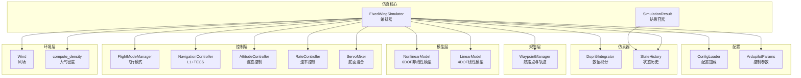
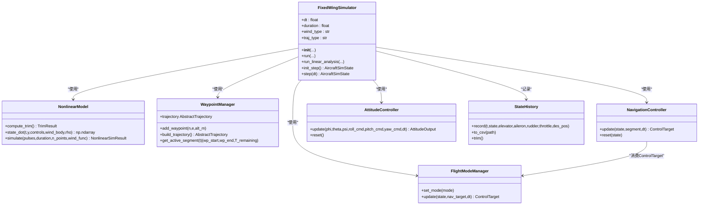
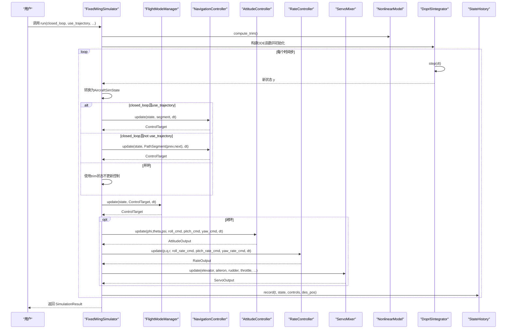
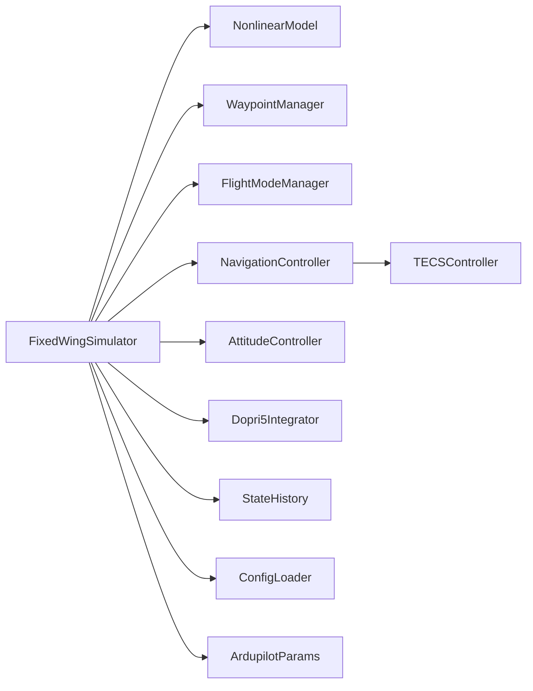

# FixedWingSimulator主类

<cite>
**本文档引用的文件**
- [src/simulation/simulator.py](file://src/simulation/simulator.py)
- [src/utils/config_loader.py](file://src/utils/config_loader.py)
- [src/models/aircraft_factory.py](file://src/models/aircraft_factory.py)
- [src/dynamics/nonlinear_model.py](file://src/dynamics/nonlinear_model.py)
- [src/simulation/state_manager.py](file://src/simulation/state_manager.py)
- [src/simulation/integrator.py](file://src/simulation/integrator.py)
- [src/planning/waypoint_manager.py](file://src/planning/waypoint_manager.py)
- [src/control/flight_mode_manager.py](file://src/control/flight_mode_manager.py)
- [src/control/navigation_controller.py](file://src/control/navigation_controller.py)
- [src/control/attitude_controller.py](file://src/control/attitude_controller.py)
- [config/simulation.yaml](file://config/simulation.yaml)
- [config/control_params.yaml](file://config/control_params.yaml)
- [examples/example_1_linear_response.py](file://examples/example_1_linear_response.py)
- [examples/example_2_nonlinear_dynamics.py](file://examples/example_2_nonlinear_dynamics.py)
</cite>

## 目录
1. [简介](#简介)
2. [项目结构](#项目结构)
3. [核心组件](#核心组件)
4. [架构总览](#架构总览)
5. [详细组件分析](#详细组件分析)
6. [依赖关系分析](#依赖关系分析)
7. [性能考虑](#性能考虑)
8. [故障排查指南](#故障排查指南)
9. [结论](#结论)
10. [附录：使用示例与最佳实践](#附录使用示例与最佳实践)

## 简介
本文件为FixedWingSimulator主类的深度技术文档，面向需要理解并使用该仿真器进行固定翼无人机仿真与控制研究的工程师与研究人员。文档覆盖以下主题：
- 类的设计架构与职责边界
- 构造函数参数与初始化流程
- 仿真引擎核心方法run()与run_linear_analysis()的工作原理
- 仿真模式切换机制（闭环vs开环）、轨迹跟踪模式与航路点管理
- 配置加载、参数验证与错误处理机制
- 使用示例与最佳实践

## 项目结构
FixedWingSimulator位于src/simulation/simulator.py，是整个仿真的编排中心，协调模型、环境、控制、规划与仿真器等子系统。其主要依赖如下：
- 飞行动力学：非线性6自由度模型与线性4自由度模型
- 环境模型：风场与大气密度
- 控制链路：飞行模式管理、导航控制器（L1+TECS）、姿态/速率控制器、舵面混合器
- 规划模块：航路点管理与轨迹生成
- 仿真器：数值积分器与状态历史记录
- 配置系统：统一加载aircraft、control、simulation、trajectory配置

**图表来源**
- [src/simulation/simulator.py](file://src/simulation/simulator.py#L115-L642)
- [src/dynamics/nonlinear_model.py](file://src/dynamics/nonlinear_model.py#L104-L386)
- [src/simulation/integrator.py](file://src/simulation/integrator.py#L17-L108)
- [src/simulation/state_manager.py](file://src/simulation/state_manager.py#L16-L193)
- [src/planning/waypoint_manager.py](file://src/planning/waypoint_manager.py#L20-L208)
- [src/control/flight_mode_manager.py](file://src/control/flight_mode_manager.py#L115-L298)
- [src/control/navigation_controller.py](file://src/control/navigation_controller.py#L45-L200)
- [src/control/attitude_controller.py](file://src/control/attitude_controller.py#L33-L134)
- [src/utils/config_loader.py](file://src/utils/config_loader.py#L59-L82)

**章节来源**
- [src/simulation/simulator.py](file://src/simulation/simulator.py#L1-L642)

## 核心组件
- FixedWingSimulator：主仿真编排器，负责初始化各子系统、构建控制回路、执行仿真循环、记录历史并产出SimulationResult。
- NonlinearModel：6自由度非线性动力学，提供计算配平与状态导数。
- WaypointManager：航路点管理与轨迹生成（最小Snap/最小Jerk）。
- FlightModeManager：飞行模式管理（MANUAL/STABILIZE/FBW_A/FBW_B/AUTO/LOITER/RTH）。
- NavigationController：L1横向导航与TECS纵向控制。
- AttitudeController/RateController：姿态与速率控制回路。
- ServoMixer：将控制输出混合为舵面偏角。
- ConfigLoader：统一加载aircraft、control、simulation、trajectory配置。
- Dopri5Integrator：实时步进积分器。
- StateHistory：高效的历史数据缓冲与CSV导出。

**章节来源**
- [src/simulation/simulator.py](file://src/simulation/simulator.py#L115-L642)
- [src/dynamics/nonlinear_model.py](file://src/dynamics/nonlinear_model.py#L104-L386)
- [src/planning/waypoint_manager.py](file://src/planning/waypoint_manager.py#L20-L208)
- [src/control/flight_mode_manager.py](file://src/control/flight_mode_manager.py#L115-L298)
- [src/control/navigation_controller.py](file://src/control/navigation_controller.py#L45-L200)
- [src/control/attitude_controller.py](file://src/control/attitude_controller.py#L33-L134)
- [src/simulation/integrator.py](file://src/simulation/integrator.py#L17-L108)
- [src/simulation/state_manager.py](file://src/simulation/state_manager.py#L16-L193)
- [src/utils/config_loader.py](file://src/utils/config_loader.py#L59-L82)

## 架构总览
FixedWingSimulator采用“编排器+子系统”的分层架构：
- 编排层：FixedWingSimulator负责装配与调度
- 动力学层：NonlinearModel/LinearModel提供ODE
- 环境层：Wind、compute_density
- 控制层：FlightModeManager → NavigationController → AttitudeController → RateController → ServoMixer
- 规划层：WaypointManager → 轨迹生成
- 仿真层：Dopri5Integrator → StateHistory
- 配置层：ConfigLoader → ArdupilotParams

**图表来源**
- [src/simulation/simulator.py](file://src/simulation/simulator.py#L115-L642)
- [src/dynamics/nonlinear_model.py](file://src/dynamics/nonlinear_model.py#L104-L386)
- [src/planning/waypoint_manager.py](file://src/planning/waypoint_manager.py#L20-L208)
- [src/control/flight_mode_manager.py](file://src/control/flight_mode_manager.py#L115-L298)
- [src/control/navigation_controller.py](file://src/control/navigation_controller.py#L45-L200)
- [src/control/attitude_controller.py](file://src/control/attitude_controller.py#L33-L134)
- [src/simulation/state_manager.py](file://src/simulation/state_manager.py#L95-L193)

## 详细组件分析

### FixedWingSimulator主类
- 设计理念
  - 单一职责：作为仿真编排器，集中初始化、装配与运行控制链路。
  - 可插拔：通过ConfigLoader与AircraftFactory解耦配置与参数来源。
  - 双模态：支持闭环实时仿真与线性开环分析，满足教学与研究需求。
- 关键字段
  - dt、duration、wind_type、traj_type：仿真基础参数
  - _cfg：ConfigLoader实例，加载aircraft/control/simulation/trajectory配置
  - aircraft_cfg、params：来自AircraftFactory的合并参数
  - dyn：NonlinearModel实例
  - mode_mgr、nav_ctrl、att_ctrl、rate_ctrl、servo：控制链路
  - wp_mgr：WaypointManager实例
  - _trim：配平结果缓存
- 初始化流程要点
  - 参数校验：校验aircraft_name是否在数据库中
  - 配置加载：默认config目录，若未指定则自动定位到项目config目录
  - 风场初始化：根据wind_type、wind_speed、wind_direction_deg构建Wind对象
  - 控制参数：优先加载control_params.yaml，否则使用默认ArduPilot参数，并进行validate()
  - 控制层装配：FlightModeManager、NavigationController（含TECS）、AttitudeController、RateController、ServoMixer
  - 航路点管理：WaypointManager，traj_type由构造参数决定
  - 动力学：NonlinearModel实例化
- run()方法详解
  - 计算配平并缓存，按配平条件初始化初始状态
  - 重置控制层积分器与TECS状态
  - 构建动态ODE函数，封装风场与密度随高度变化
  - 航路点/轨迹准备：
    - use_trajectory=False：启用“环形航路点序列”模式，逐点飞向下一个航路点，支持循环与切换距离阈值
    - use_trajectory=True：构建最小Snap/最小Jerk轨迹，单航路点时合成一条直段用于高度保持
  - 主仿真循环：
    - 读取当前状态，转换为AircraftState与AircraftSimState
    - 根据模式与轨迹/航路点生成ControlTarget
    - 通过FlightModeManager更新得到最终控制目标
    - 闭环控制链：AttitudeController → RateController → ServoMixer → 动力学ODE
    - 开环模式：仅保持trim状态，不参与控制回路
    - 记录StateHistory，包含状态、控制输出与期望位置
    - 步进积分器，捕获积分失败并终止
  - 结束：裁剪StateHistory并返回SimulationResult
- run_linear_analysis()方法详解
  - 用于4自由度线性开环分析，默认施加2度升降舵脉冲，返回LinearAnalysisResult
  - 与项目早期版本兼容，便于对比线性与非线性响应
- init_step()/step()方法（逐步仿真接口）
  - 适用于外部UI或交互式场景，先init_step()初始化，再多次step()推进

**图表来源**
- [src/simulation/simulator.py](file://src/simulation/simulator.py#L239-L567)
- [src/control/flight_mode_manager.py](file://src/control/flight_mode_manager.py#L173-L211)
- [src/control/navigation_controller.py](file://src/control/navigation_controller.py#L134-L200)
- [src/control/attitude_controller.py](file://src/control/attitude_controller.py#L81-L122)
- [src/simulation/integrator.py](file://src/simulation/integrator.py#L50-L71)
- [src/simulation/state_manager.py](file://src/simulation/state_manager.py#L124-L168)

**章节来源**
- [src/simulation/simulator.py](file://src/simulation/simulator.py#L115-L642)

### 飞行模式管理（闭环vs开环）
- 闭环模式：通过FlightModeManager选择AUTO/STABILIZE/FBW_A/FBW_B/LOITER/RTH/MANUAL等模式，结合NavigationController与控制回路生成ControlTarget。
- 开环模式：closed_loop=False时，仅保持初始trim状态，不参与任何控制回路，仅进行非线性动力学积分。
- 模式切换：set_mode/set_mode_str，打印模式变更日志，便于调试与验证。

**章节来源**
- [src/control/flight_mode_manager.py](file://src/control/flight_mode_manager.py#L115-L298)
- [src/simulation/simulator.py](file://src/simulation/simulator.py#L499-L528)

### 轨迹跟踪模式与航路点管理
- WaypointManager支持：
  - 添加单个/批量航路点（NED坐标，海拔正向上）
  - 从YAML加载/保存航路点
  - 构建最小Snap/最小Jerk轨迹
  - 获取活动航段与剩余时间
- run()中的两种轨迹模式：
  - use_trajectory=True：构建轨迹并跟踪desired_state(t)，同时对目标高度进行段内夹钳，避免越界
  - use_trajectory=False：启用“环形航路点序列”模式，按水平距离阈值切换航路点，支持循环飞行
- 单航路点处理：合成一段直飞航段用于高度保持

**章节来源**
- [src/planning/waypoint_manager.py](file://src/planning/waypoint_manager.py#L20-L208)
- [src/simulation/simulator.py](file://src/simulation/simulator.py#L376-L508)

### 配置加载、参数验证与错误处理
- 配置加载：
  - ConfigLoader统一加载aircraft、control、simulation、trajectory配置，支持默认值与深合并
  - 默认config目录：若未显式传入config_dir，则自动定位到项目config目录
- 参数验证：
  - aircraft_name必须存在于数据库，否则抛出ValueError
  - ArdupilotParams.validate()确保控制参数有效
- 错误处理：
  - run()中捕获积分器失败并终止仿真
  - WaypointManager在轨迹构建时检查航路点数量
  - ConfigLoader对缺失文件返回空字典，避免中断

**章节来源**
- [src/utils/config_loader.py](file://src/utils/config_loader.py#L59-L82)
- [src/models/aircraft_factory.py](file://src/models/aircraft_factory.py#L39-L75)
- [src/simulation/simulator.py](file://src/simulation/simulator.py#L140-L141)
- [src/planning/waypoint_manager.py](file://src/planning/waypoint_manager.py#L139-L140)

## 依赖关系分析
- 固定翼仿真器内部依赖关系清晰，遵循“编排器-子系统”模式，耦合集中在控制链路与动力学接口
- 外部依赖：
  - NumPy：数值计算
  - SciPy：ode/solve_ivp
  - PyYAML：配置解析
  - Matplotlib（可视化模块）：绘图与动画（在SimulationResult中按需导入）

**图表来源**
- [src/simulation/simulator.py](file://src/simulation/simulator.py#L33-L52)
- [src/control/navigation_controller.py](file://src/control/navigation_controller.py#L94-L115)

**章节来源**
- [src/simulation/simulator.py](file://src/simulation/simulator.py#L33-L52)

## 性能考虑
- 数值积分：Dopri5自适应步长，适合实时仿真；RK45适合离线分析
- 状态记录：StateHistory预分配数组，避免频繁内存分配
- 风场与密度：按高度动态计算密度，提高真实感但增加计算成本
- 控制回路：PID参数与限幅影响稳定性与响应速度，建议基于实际飞机参数调整
- 轨迹生成：最小Snap/最小Jerk在多航路点时计算复杂度较高，建议合理设置平均速度与航路点密度

[本节为通用指导，无需特定文件引用]

## 故障排查指南
- 飞机参数错误
  - 症状：构造时报Unknown aircraft
  - 处理：确认aircraft_name在数据库中，或使用AircraftFactory.create正确合并参数
- 控制参数无效
  - 症状：ArdupilotParams.validate()失败
  - 处理：检查control_params.yaml格式与数值范围
- 航路点不足
  - 症状：轨迹构建抛出ValueError
  - 处理：至少提供两个航路点，或在单航路点时允许系统合成直段
- 积分失败
  - 症状：run()中打印Integration error并终止
  - 处理：检查控制输入饱和、风场突变、初始条件是否合理
- 配置文件缺失
  - 症状：ConfigLoader返回空配置
  - 处理：确认config目录存在且文件名正确

**章节来源**
- [src/simulation/simulator.py](file://src/simulation/simulator.py#L140-L141)
- [src/planning/waypoint_manager.py](file://src/planning/waypoint_manager.py#L139-L140)
- [src/utils/config_loader.py](file://src/utils/config_loader.py#L40-L45)

## 结论
FixedWingSimulator以清晰的分层架构实现了固定翼无人机的闭环/开环仿真，具备完善的控制链路、灵活的轨迹管理与稳健的配置系统。通过run()与run_linear_analysis()，用户既能进行高保真的非线性仿真，也能开展线性系统的模态分析。建议在工程实践中结合示例脚本与最佳实践，逐步优化控制参数与任务规划，以获得稳定可靠的仿真结果。

[本节为总结，无需特定文件引用]

## 附录：使用示例与最佳实践
- 示例脚本
  - 线性开环与闭环对比：参考example_1_linear_response.py，演示run_linear_analysis与run()在FBW_B模式下的对比
  - 非线性6自由度仿真：参考example_2_nonlinear_dynamics.py，展示compute_trim与simulate的配合
- 最佳实践
  - 配置优先级：先加载control_params.yaml，再通过AircraftFactory的param_overrides进行最终修正
  - 航路点设计：多航路点时优先使用最小Snap轨迹；单航路点时利用系统合成直段
  - 模式选择：调试姿态/速率控制用STABILIZE；路径跟踪用AUTO；需要手动干预用MANUAL
  - 参数验证：每次修改control_params.yaml后调用validate()，确保参数合法
  - 数据导出：使用StateHistory.to_csv保存仿真数据，SimulationResult.visualize生成可视化图表

**章节来源**
- [examples/example_1_linear_response.py](file://examples/example_1_linear_response.py#L132-L144)
- [examples/example_2_nonlinear_dynamics.py](file://examples/example_2_nonlinear_dynamics.py#L130-L139)
- [src/simulation/simulator.py](file://src/simulation/simulator.py#L92-L109)