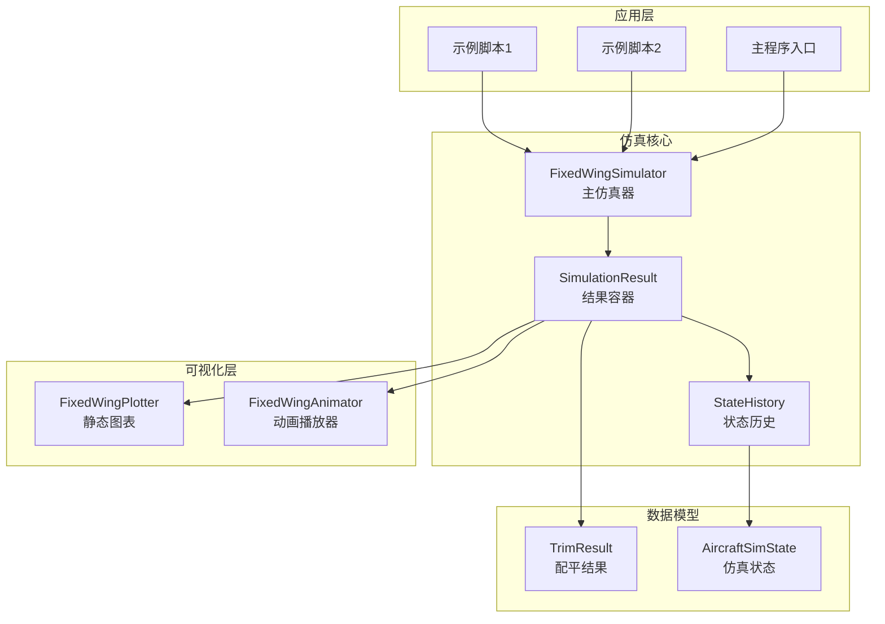
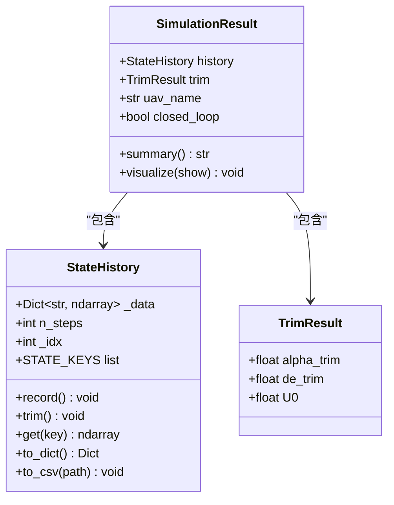
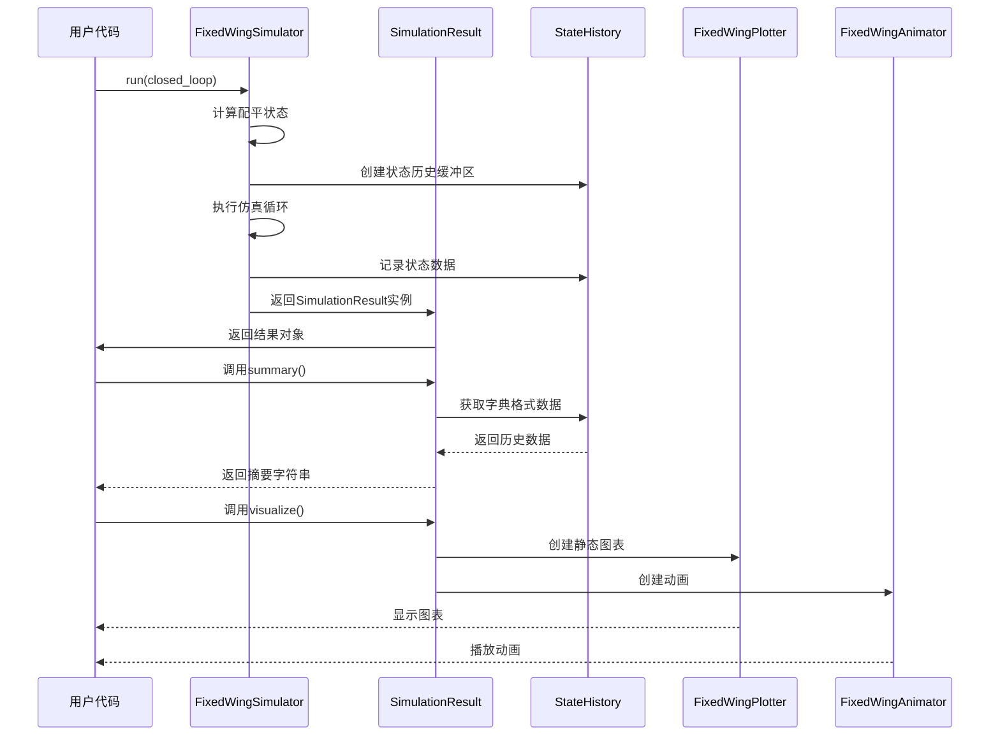
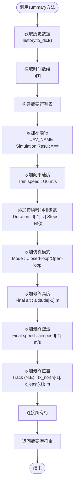
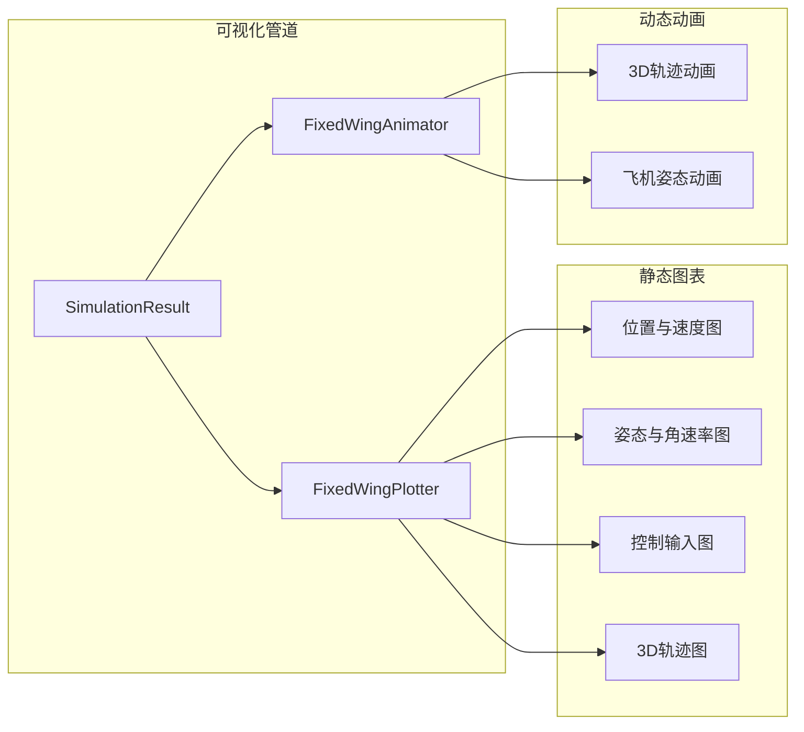
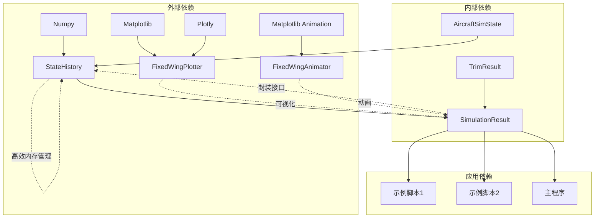

# SimulationResult结果容器

<cite>
**本文档引用的文件**
- [src/simulation/simulator.py](file://src/simulation/simulator.py)
- [src/simulation/state_manager.py](file://src/simulation/state_manager.py)
- [src/visualization/plotter.py](file://src/visualization/plotter.py)
- [src/visualization/animator.py](file://src/visualization/animator.py)
- [src/dynamics/nonlinear_model.py](file://src/dynamics/nonlinear_model.py)
- [examples/example_1_linear_response.py](file://examples/example_1_linear_response.py)
- [examples/example_2_nonlinear_dynamics.py](file://examples/example_2_nonlinear_dynamics.py)
- [main.py](file://main.py)
</cite>

## 目录
1. [简介](#简介)
2. [项目结构](#项目结构)
3. [核心组件](#核心组件)
4. [架构概览](#架构概览)
5. [详细组件分析](#详细组件分析)
6. [依赖关系分析](#依赖关系分析)
7. [性能考虑](#性能考虑)
8. [故障排除指南](#故障排除指南)
9. [结论](#结论)

## 简介

SimulationResult是FixedWingSimulator项目中的核心结果容器类，专门用于封装和管理完整的飞行器仿真运行结果。该类不仅存储仿真历史数据，还提供了便捷的方法来进行结果摘要统计和可视化展示。

SimulationResult的设计目的是为用户提供一个统一的结果管理接口，使得用户可以轻松地访问仿真数据、生成统计摘要报告，并进行结果可视化分析。该类通过包装StateHistory对象，提供了对完整仿真历史的访问能力，包括状态变量、控制输入、轨迹信息等。

## 项目结构

FixedWingSimulator项目采用模块化架构设计，各个组件职责明确：



**图表来源**
- [src/simulation/simulator.py](file://src/simulation/simulator.py#L59-L109)
- [src/simulation/state_manager.py](file://src/simulation/state_manager.py#L95-L193)
- [src/visualization/plotter.py](file://src/visualization/plotter.py#L19-L111)
- [src/visualization/animator.py](file://src/visualization/animator.py#L14-L32)

**章节来源**
- [src/simulation/simulator.py](file://src/simulation/simulator.py#L1-L642)
- [src/simulation/state_manager.py](file://src/simulation/state_manager.py#L1-L193)

## 核心组件

### SimulationResult类设计

SimulationResult类是一个轻量级的数据容器，主要包含以下核心属性：

| 属性名 | 类型 | 描述 |
|--------|------|------|
| history | StateHistory | 包含完整仿真历史数据的对象 |
| trim | TrimResult | 飞行器配平参数结果 |
| uav_name | str | 飞行器名称标识符 |
| closed_loop | bool | 是否为闭环仿真模式 |

### 数据结构特点

SimulationResult通过StateHistory对象提供高效的历史数据访问机制：



**图表来源**
- [src/simulation/simulator.py](file://src/simulation/simulator.py#L59-L76)
- [src/simulation/state_manager.py](file://src/simulation/state_manager.py#L95-L180)
- [src/dynamics/nonlinear_model.py](file://src/dynamics/nonlinear_model.py#L46-L50)

**章节来源**
- [src/simulation/simulator.py](file://src/simulation/simulator.py#L59-L109)
- [src/simulation/state_manager.py](file://src/simulation/state_manager.py#L95-L193)
- [src/dynamics/nonlinear_model.py](file://src/dynamics/nonlinear_model.py#L46-L50)

## 架构概览

SimulationResult在整个仿真系统中扮演着关键的数据枢纽角色：



**图表来源**
- [src/simulation/simulator.py](file://src/simulation/simulator.py#L239-L567)
- [src/simulation/simulator.py](file://src/simulation/simulator.py#L92-L109)

## 详细组件分析

### summary()方法统计逻辑

summary()方法实现了智能的结果摘要生成功能，提供关键的飞行器性能指标：

#### 统计信息生成流程



**图表来源**
- [src/simulation/simulator.py](file://src/simulation/simulator.py#L78-L90)

#### 关键统计指标说明

| 指标类型 | 字段名 | 含义 | 单位 |
|----------|--------|------|------|
| 基础信息 | uav_name | 飞行器名称 | 文本 |
| 配平参数 | trim.U0 | 配平空速 | m/s |
| 时间信息 | t[-1] | 总持续时间 | s |
| 步数信息 | len(t) | 采样点数量 | 无单位 |
| 模式信息 | closed_loop | 仿真模式 | 布尔值 |
| 位置信息 | altitude[-1] | 最终高度 | m |
| 速度信息 | airspeed[-1] | 最终空速 | m/s |
| 坐标信息 | (x_north[-1], x_east[-1]) | 最终位置坐标 | m |

**章节来源**
- [src/simulation/simulator.py](file://src/simulation/simulator.py#L78-L90)

### visualize()方法可视化功能

visualize()方法提供了完整的多维度结果可视化解决方案：

#### 可视化组件架构



**图表来源**
- [src/simulation/simulator.py](file://src/simulation/simulator.py#L92-L109)
- [src/visualization/plotter.py](file://src/visualization/plotter.py#L161-L244)
- [src/visualization/animator.py](file://src/visualization/animator.py#L25-L150)

#### 可视化功能特性

| 功能类型 | 实现方式 | 输出格式 | 主要用途 |
|----------|----------|----------|----------|
| 静态图表 | Matplotlib | PNG图像 | 报告生成、论文发表 |
| 交互式图表 | Plotly | HTML图表 | 在线演示、Web集成 |
| 3D轨迹图 | Plotly 3D | 交互式3D图 | 轨迹分析、路径验证 |
| 实时动画 | Matplotlib FuncAnimation | GIF动画 | 教学演示、实时监控 |
| 3D实体动画 | 自定义几何 | 实时渲染 | 高质量演示、研究展示 |

**章节来源**
- [src/simulation/simulator.py](file://src/simulation/simulator.py#L92-L109)
- [src/visualization/plotter.py](file://src/visualization/plotter.py#L161-L244)
- [src/visualization/animator.py](file://src/visualization/animator.py#L25-L150)

### 数据访问模式

SimulationResult提供了多种数据访问接口，满足不同使用场景的需求：

#### 字典访问模式

通过history.to_dict()方法，用户可以获得包含所有仿真数据的字典结构：

```python
# 示例：获取特定变量数据
history_dict = result.history.to_dict()
time_array = history_dict["t"]
airspeed_array = history_dict["airspeed"]
altitude_array = history_dict["altitude"]
```

#### 数组访问模式

对于单个变量的直接访问：

```python
# 示例：获取最终时刻的状态
final_time = result.history.get("t")[-1]
final_airspeed = result.history.get("airspeed")[-1]
```

#### 导出功能

支持多种数据导出格式：

| 导出格式 | 方法 | 文件扩展名 | 使用场景 |
|----------|------|------------|----------|
| CSV文件 | history.to_csv() | .csv | 数据分析、Excel导入 |
| NumPy数组 | history.get() | 内存数据 | Python脚本处理 |
| JSON格式 | 自定义转换 | .json | Web应用集成 |

**章节来源**
- [src/simulation/state_manager.py](file://src/simulation/state_manager.py#L176-L193)

### 后处理方法

SimulationResult支持丰富的后处理功能，便于用户进行深入的数据分析：

#### 数据预处理

- **数据裁剪**：通过history.trim()方法移除未使用的缓冲区空间
- **数据过滤**：基于时间窗口或状态阈值进行数据筛选
- **插值处理**：对非均匀采样的数据进行时间重采样

#### 统计分析

- **基本统计**：均值、方差、最大值、最小值计算
- **频域分析**：FFT变换、功率谱密度分析
- **轨迹分析**：航程计算、转弯半径、爬升率分析

#### 结果验证

- **收敛性检查**：验证仿真结果的数值稳定性
- **物理一致性**：检查状态变量的物理合理性
- **边界条件**：验证控制输入和约束条件

**章节来源**
- [src/simulation/state_manager.py](file://src/simulation/state_manager.py#L170-L180)

## 依赖关系分析

### 组件耦合度分析



**图表来源**
- [src/simulation/state_manager.py](file://src/simulation/state_manager.py#L11-L13)
- [src/visualization/plotter.py](file://src/visualization/plotter.py#L11-L12)
- [src/visualization/animator.py](file://src/visualization/animator.py#L10-L11)

### 外部库依赖

| 库名称 | 版本要求 | 用途 | 必需性 |
|--------|----------|------|--------|
| numpy | >=1.19.0 | 数值计算、数组操作 | 必需 |
| matplotlib | >=3.3.0 | 静态图表绘制 | 可选 |
| plotly | >=4.14.0 | 交互式图表 | 可选 |
| pillow | >=7.0.0 | GIF动画保存 | 可选 |

**章节来源**
- [src/simulation/state_manager.py](file://src/simulation/state_manager.py#L11-L13)
- [src/visualization/plotter.py](file://src/visualization/plotter.py#L11-L12)
- [src/visualization/animator.py](file://src/visualization/animator.py#L10-L11)

## 性能考虑

### 内存优化策略

SimulationResult采用了多项内存优化技术：

1. **预分配缓冲区**：StateHistory在初始化时预分配固定大小的NumPy数组
2. **动态裁剪**：通过history.trim()方法移除未使用的尾部空间
3. **字典共享**：to_dict()方法返回数据副本而非引用，避免意外修改

### 计算效率优化

- **向量化操作**：所有数学运算都使用NumPy向量化，避免Python循环
- **延迟加载**：可视化组件按需导入，减少启动时间
- **增量更新**：动画组件只更新变化的部分，提高渲染效率

### 并发处理

虽然SimulationResult本身不支持并发，但其设计允许在多线程环境中安全使用：
- 所有公共方法都是纯函数或只读操作
- 数据访问通过只读接口进行
- 可视化组件具有独立的生命周期

## 故障排除指南

### 常见问题及解决方案

#### 可视化功能不可用

**问题描述**：调用visualize()方法时出现导入错误

**可能原因**：
- 缺少matplotlib或plotly库
- 环境配置问题

**解决方案**：
```python
# 检查依赖安装
pip install matplotlib plotly pillow

# 或者仅安装必要依赖
pip install matplotlib
```

#### 内存不足错误

**问题描述**：长时间仿真导致内存溢出

**解决方案**：
```python
# 使用history.trim()裁剪内存
result.history.trim()

# 或者分批处理大数据集
subset = {k: v[::10] for k, v in result.history.to_dict().items()}
```

#### 数据访问异常

**问题描述**：访问特定变量时出现KeyError

**解决方案**：
```python
# 检查变量是否存在
history_dict = result.history.to_dict()
if "desired_position" in history_dict:
    desired_pos = history_dict["desired_position"]
else:
    print("Desired position not available in this simulation mode")
```

**章节来源**
- [src/simulation/simulator.py](file://src/simulation/simulator.py#L92-L109)

## 结论

SimulationResult作为FixedWingSimulator项目的核心结果容器，展现了优秀的软件工程实践：

### 设计优势

1. **简洁性**：通过最少的接口提供最大的功能覆盖
2. **扩展性**：良好的抽象层便于功能扩展和维护
3. **易用性**：直观的API设计降低用户学习成本
4. **性能**：高效的内存管理和计算优化

### 应用价值

- **学术研究**：为飞行器控制系统研究提供标准化的数据接口
- **工程应用**：支持飞行器设计和测试的自动化流程
- **教学演示**：提供直观的可视化工具辅助教学
- **数据分析**：支持复杂的数据挖掘和统计分析任务

### 发展方向

未来可以考虑的功能增强：
- 支持更多可视化格式（如SVG、PDF）
- 添加机器学习友好的数据格式
- 实现云端数据存储和分享功能
- 提供更丰富的统计分析工具

SimulationResult的设计充分体现了现代科学计算软件的最佳实践，为固定翼飞行器仿真领域提供了一个可靠、高效、易用的结果管理解决方案。