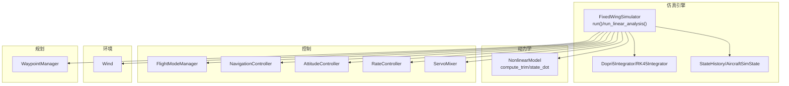
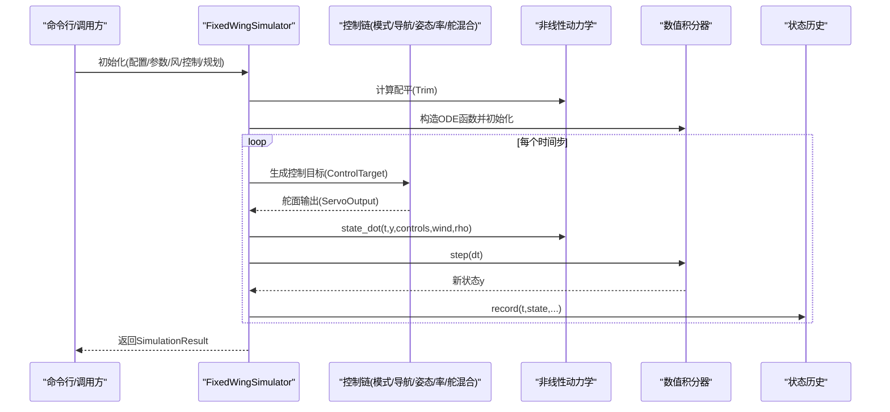
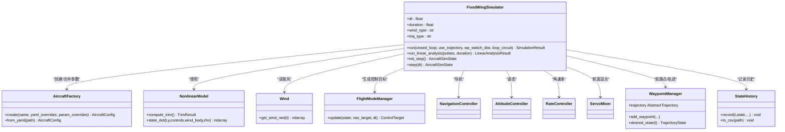
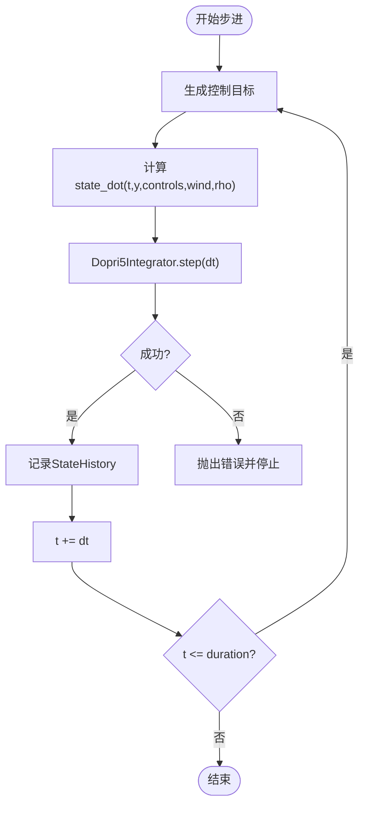
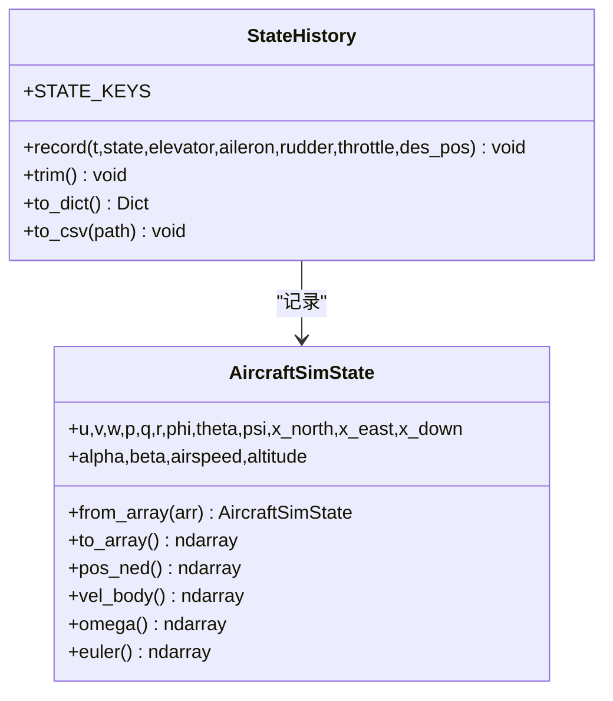
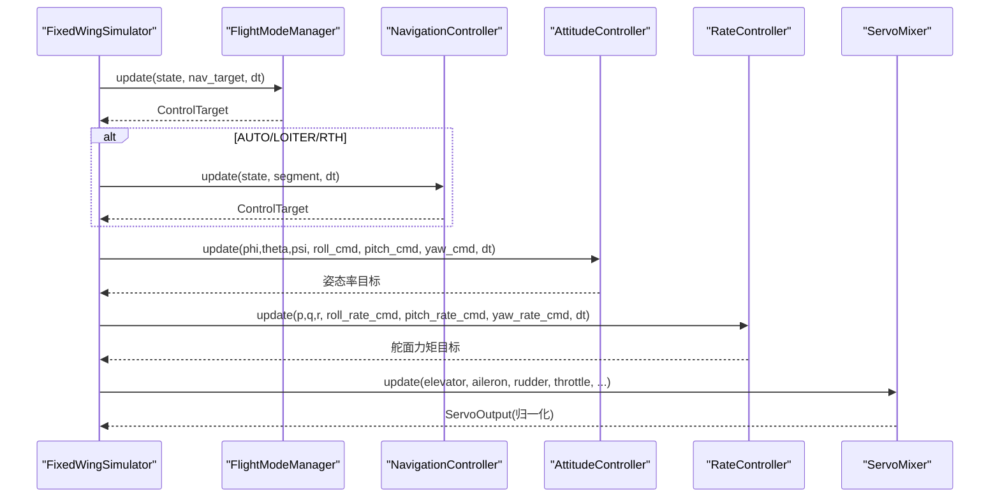
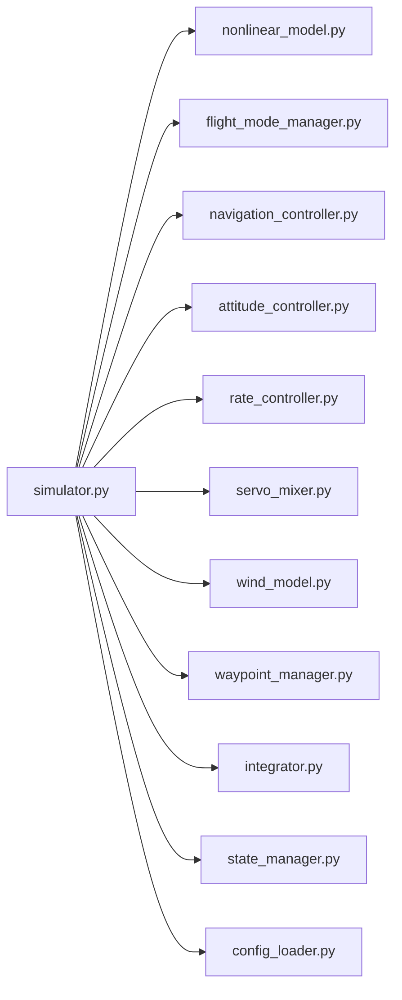

# 仿真引擎

<cite>
**本文引用的文件**   
- [src/simulation/simulator.py](file://src/simulation/simulator.py)
- [src/simulation/state_manager.py](file://src/simulation/state_manager.py)
- [src/simulation/integrator.py](file://src/simulation/integrator.py)
- [src/dynamics/nonlinear_model.py](file://src/dynamics/nonlinear_model.py)
- [src/control/flight_mode_manager.py](file://src/control/flight_mode_manager.py)
- [src/environment/wind_model.py](file://src/environment/wind_model.py)
- [src/planning/waypoint_manager.py](file://src/planning/waypoint_manager.py)
- [src/utils/config_loader.py](file://src/utils/config_loader.py)
- [config/simulation.yaml](file://config/simulation.yaml)
- [config/aircraft.yaml](file://config/aircraft.yaml)
- [examples/example_1_linear_response.py](file://examples/example_1_linear_response.py)
- [main.py](file://main.py)
</cite>

## 目录
1. [引言](#引言)
2. [项目结构](#项目结构)
3. [核心组件](#核心组件)
4. [架构总览](#架构总览)
5. [详细组件分析](#详细组件分析)
6. [依赖关系分析](#依赖关系分析)
7. [性能考虑](#性能考虑)
8. [故障排查指南](#故障排查指南)
9. [结论](#结论)
10. [附录](#附录)

## 引言
本技术文档围绕 FixedWingSimulator 仿真引擎展开，系统阐述其主类 FixedWingSimulator 的设计与实现，覆盖仿真生命周期、时间步进机制、数值积分方法、状态管理器、参数配置、性能优化与调试技巧，并给出扩展接口与自定义方法建议。文档同时结合示例脚本与配置文件，帮助读者快速理解并高效使用该仿真平台。

## 项目结构
项目采用模块化分层组织：仿真引擎位于 simulation 子包；动力学模型在 dynamics；控制链路在 control；环境建模在 environment；路径规划在 planning；工具与配置在 utils 与 config；examples 提供典型用法；main.py 提供命令行入口。

图表来源
- [src/simulation/simulator.py](file://src/simulation/simulator.py#L115-L642)
- [src/simulation/integrator.py](file://src/simulation/integrator.py#L17-L108)
- [src/simulation/state_manager.py](file://src/simulation/state_manager.py#L16-L193)
- [src/dynamics/nonlinear_model.py](file://src/dynamics/nonlinear_model.py#L104-L386)
- [src/control/flight_mode_manager.py](file://src/control/flight_mode_manager.py#L115-L298)
- [src/environment/wind_model.py](file://src/environment/wind_model.py#L18-L113)
- [src/planning/waypoint_manager.py](file://src/planning/waypoint_manager.py#L20-L208)

章节来源
- [src/simulation/simulator.py](file://src/simulation/simulator.py#L1-L642)
- [config/simulation.yaml](file://config/simulation.yaml#L1-L30)
- [config/aircraft.yaml](file://config/aircraft.yaml#L1-L13)

## 核心组件
- FixedWingSimulator 主引擎：负责装配各子系统（飞机参数、环境、控制、规划、动力学），构建 ODE 并驱动实时步进循环，记录历史并产出结果。
- 状态管理器：AircraftSimState 表示 12 维状态（速度、角速率、欧拉角、位置）及导出量；StateHistory 预分配数组高效记录时序数据。
- 数值积分器：Dopri5Integrator 支持自适应步长的单步推进，适合实时闭环；RK45Integrator 用于离线批量分析。
- 动力学模型：NonlinearModel 提供 6-DOF 非线性方程、配平计算与 ODE 包装。
- 控制体系：FlightModeManager 管理飞行模式与目标生成；Navigation/Attitude/Rate/Servo 控制链层层递进。
- 环境与规划：Wind 提供多种风场模型；WaypointManager 管理航路点并生成轨迹对象。

章节来源
- [src/simulation/simulator.py](file://src/simulation/simulator.py#L115-L642)
- [src/simulation/state_manager.py](file://src/simulation/state_manager.py#L16-L193)
- [src/simulation/integrator.py](file://src/simulation/integrator.py#L17-L108)
- [src/dynamics/nonlinear_model.py](file://src/dynamics/nonlinear_model.py#L104-L386)
- [src/control/flight_mode_manager.py](file://src/control/flight_mode_manager.py#L115-L298)
- [src/environment/wind_model.py](file://src/environment/wind_model.py#L18-L113)
- [src/planning/waypoint_manager.py](file://src/planning/waypoint_manager.py#L20-L208)

## 架构总览
FixedWingSimulator 将“配置加载—飞机参数—环境—控制—规划—动力学—积分—状态记录”串联为完整的仿真流水线。运行时根据 closed_loop 选择闭环控制链或仅执行开环动力学；轨迹模式支持多项式轨迹与简单航路点序列两种方式。

图表来源
- [src/simulation/simulator.py](file://src/simulation/simulator.py#L239-L567)
- [src/dynamics/nonlinear_model.py](file://src/dynamics/nonlinear_model.py#L160-L281)
- [src/simulation/integrator.py](file://src/simulation/integrator.py#L50-L71)
- [src/simulation/state_manager.py](file://src/simulation/state_manager.py#L124-L174)

## 详细组件分析

### FixedWingSimulator 主类
- 职责与装配
  - 加载配置与默认值，解析风场类型与速度方向。
  - 创建飞机参数（来自工厂与数据库），构造控制参数（ArduPilot 兼容）。
  - 初始化飞行模式管理器、导航控制器（含 TECS）、姿态/角速率/舵混合控制器。
  - 初始化航路点管理器与轨迹类型。
  - 构建非线性动力学模型并计算初始配平。
- 生命周期与运行模式
  - run(closed_loop, use_trajectory, wp_switch_dist, loop_circuit)：完整闭环仿真主循环。
  - run_linear_analysis(pulses, duration)：4-DOF 线性开环分析（向后兼容）。
  - init_step()/step(dt)：逐步仿真接口（用于 UI 或外部调度）。
- 时间步进与误差处理
  - 使用固定 dt 推进；内部通过 Dopri5Integrator 单步集成；捕获 RuntimeError 并终止。
- 状态记录与结果封装
  - 使用 StateHistory 记录状态、控制量与期望位置；返回 SimulationResult 汇总摘要与可视化接口。

图表来源
- [src/simulation/simulator.py](file://src/simulation/simulator.py#L130-L233)
- [src/models/aircraft_factory.py](file://src/models/aircraft_factory.py#L39-L93)
- [src/dynamics/nonlinear_model.py](file://src/dynamics/nonlinear_model.py#L104-L154)
- [src/environment/wind_model.py](file://src/environment/wind_model.py#L18-L113)
- [src/control/flight_mode_manager.py](file://src/control/flight_mode_manager.py#L115-L298)
- [src/planning/waypoint_manager.py](file://src/planning/waypoint_manager.py#L20-L167)
- [src/simulation/state_manager.py](file://src/simulation/state_manager.py#L95-L193)

章节来源
- [src/simulation/simulator.py](file://src/simulation/simulator.py#L115-L642)

### 时间步进机制与数值积分
- 步进策略
  - 固定 dt 的显式推进；每次迭代调用 Dopri5Integrator.step(dt) 获取新状态。
- 积分器选择
  - 实时闭环：Dopri5Integrator（自适应步长但暴露单步 API）。
  - 批处理/离线分析：RK45Integrator（solve_ivp，RK45 方法）。
- 容差设置
  - 默认 rtol/atol=1e-6；可通过配置文件调整。
- 错误处理
  - 集成失败抛出 RuntimeError，主循环捕获并终止，避免状态漂移。

图表来源
- [src/simulation/simulator.py](file://src/simulation/simulator.py#L558-L564)
- [src/simulation/integrator.py](file://src/simulation/integrator.py#L50-L71)
- [src/dynamics/nonlinear_model.py](file://src/dynamics/nonlinear_model.py#L160-L255)

章节来源
- [src/simulation/integrator.py](file://src/simulation/integrator.py#L17-L108)
- [config/simulation.yaml](file://config/simulation.yaml#L7-L12)

### 状态管理器与数据结构
- AircraftSimState
  - 12 维状态布局与导出量（空速、侧滑角、攻角、海拔）。
  - 提供 from_array/to_array 与常用属性视图（位置/速度/欧拉/角速率）。
- StateHistory
  - 预分配字典存储所有可观测量与控制量，支持 trim 截断与 CSV 导出。
  - record 在索引未越界时写入，避免动态扩容带来的性能损耗。

图表来源
- [src/simulation/state_manager.py](file://src/simulation/state_manager.py#L16-L193)

章节来源
- [src/simulation/state_manager.py](file://src/simulation/state_manager.py#L16-L193)

### 飞行模式管理与控制链
- FlightModeManager
  - 支持 MANUAL/STABILIZE/FBW_A/FBW_B/AUTO/LOITER/RTH。
  - update 根据当前模式生成 ControlTarget；支持 LOITER 中心捕获与 RTH 目标生成。
- 控制链
  - 导航控制器（含 TECS）基于路径段生成目标；姿态/角速率控制器将目标映射到舵面增量；ServoMixer 转换为物理舵面输出并叠加配平偏置。

图表来源
- [src/control/flight_mode_manager.py](file://src/control/flight_mode_manager.py#L173-L297)
- [src/simulation/simulator.py](file://src/simulation/simulator.py#L499-L534)

章节来源
- [src/control/flight_mode_manager.py](file://src/control/flight_mode_manager.py#L115-L298)
- [src/simulation/simulator.py](file://src/simulation/simulator.py#L427-L534)

### 环境与风场建模
- Wind 类型
  - NONE/FIXED/SINE/RANDOMSINE；SINE/RANDOMSINE 内部以多正弦叠加模拟湍流样特征。
- NED 约定
  - 风从方向度数所指来向，转换为 NED 分量；随机/正弦成分按轴分解叠加。

章节来源
- [src/environment/wind_model.py](file://src/environment/wind_model.py#L18-L113)
- [src/simulation/simulator.py](file://src/simulation/simulator.py#L331-L337)

### 规划与轨迹管理
- WaypointManager
  - 管理 NED 航路点列表；支持最小急动率/最小加速度等轨迹类型；缓存轨迹对象；提供活动段查询与期望状态。
- 运行模式
  - use_trajectory=True：使用多项式轨迹进行跟踪，自动修正首航路点高度以匹配初始海拔。
  - use_trajectory=False：航路点序列直飞模式，支持回环与切换距离阈值。

章节来源
- [src/planning/waypoint_manager.py](file://src/planning/waypoint_manager.py#L20-L208)
- [src/simulation/simulator.py](file://src/simulation/simulator.py#L376-L408)
- [src/simulation/simulator.py](file://src/simulation/simulator.py#L431-L464)

### 参数配置与加载
- ConfigLoader
  - 合并 aircraft.yaml/simulation.yaml/trajectory.yaml 与默认值；提供分组访问接口。
- 关键配置项
  - dt、duration、integrator、rtol/atol、initial_mode、wind_type/wind_speed/wind_direction、日志开关与目录。

章节来源
- [src/utils/config_loader.py](file://src/utils/config_loader.py#L59-L82)
- [config/simulation.yaml](file://config/simulation.yaml#L1-L30)
- [config/aircraft.yaml](file://config/aircraft.yaml#L1-L13)

## 依赖关系分析
- 模块耦合
  - FixedWingSimulator 对各子系统强依赖，但通过清晰接口解耦（如 make_ode_func、Wind.get_wind_ned）。
  - 控制链与导航控制器之间存在数据传递（ControlTarget）。
- 外部依赖
  - scipy.integrate（ode/solve_ivp）、numpy、yaml。
- 循环依赖
  - 无直接循环导入；控制链与仿真器通过回调/传参交互。

图表来源
- [src/simulation/simulator.py](file://src/simulation/simulator.py#L33-L51)
- [src/simulation/integrator.py](file://src/simulation/integrator.py#L14-L14)
- [src/simulation/state_manager.py](file://src/simulation/state_manager.py#L11-L13)
- [src/utils/config_loader.py](file://src/utils/config_loader.py#L5-L7)

章节来源
- [src/simulation/simulator.py](file://src/simulation/simulator.py#L33-L51)

## 性能考虑
- 时间步长与积分器
  - 优先使用 Dopri5Integrator 的单步推进以降低内存峰值；若需离线分析可切换 RK45Integrator。
  - 适当提高 dt 可加速仿真，但会牺牲精度与稳定性；建议先以 0.01 s 调试，再按需求放宽。
- 容差设置
  - rtol/atol 默认 1e-6 已较严格；对大批量运行可适度放宽至 1e-4~1e-5。
- 数据记录
  - StateHistory 预分配避免动态扩容；在长时间仿真中可考虑分段记录或降低采样频率。
- 风场与密度
  - 风场为常量或低频信号时，可减少每步计算；密度随海拔变化在高仿真精度下不可避免。
- 控制链积分器
  - PID/TECS 等控制器内部积分器应与 dt 匹配，避免积分环节过冲或收敛慢。

[本节为通用指导，不直接分析具体文件]

## 故障排查指南
- 集成失败
  - 症状：出现 RuntimeError 并终止。
  - 排查：检查 dt 是否过大、风场/密度是否异常、控制输入是否饱和。
- 配平不一致
  - 症状：TECS 起始巡航油门与配平不一致导致瞬态偏差。
  - 处理：引擎会自动更新 thr_cruise 以匹配配平，确认参数与风场设置。
- 航路点问题
  - 症状：轨迹起始高度与初始海拔不一致导致下降段。
  - 处理：引擎会自动修正首航路点高度；也可手动加载 trajectory.yaml。
- 可视化缺失
  - 症状：无法显示图表或动画。
  - 处理：确保 matplotlib、seaborn 等依赖已安装；或禁用可视化。

章节来源
- [src/simulation/simulator.py](file://src/simulation/simulator.py#L558-L564)
- [src/simulation/simulator.py](file://src/simulation/simulator.py#L295-L299)
- [src/simulation/simulator.py](file://src/simulation/simulator.py#L386-L408)
- [src/simulation/simulator.py](file://src/simulation/simulator.py#L92-L108)

## 结论
FixedWingSimulator 以模块化架构实现了从配置到闭环控制的全链路仿真。其核心优势在于：
- 清晰的控制分层与 ArduPilot 兼容参数；
- 高效的状态记录与可视化能力；
- 可插拔的轨迹与风场模型；
- 易于扩展的接口（自定义控制律、轨迹、风场）。

建议在工程实践中：
- 先用默认配置验证流程，再逐步调整参数；
- 使用 run_linear_analysis 辅助控制器设计；
- 对大规模批处理任务切换 RK45Integrator；
- 通过 ConfigLoader 与 YAML 文件集中管理配置。

[本节为总结性内容，不直接分析具体文件]

## 附录

### 使用模式与示例
- 命令行运行
  - 支持指定机型、模式、时长、风场、轨迹类型与分析模式；可禁用可视化。
- 示例脚本
  - example_1_linear_response.py 展示线性开环与闭环对比，保存 CSV 与图像。

章节来源
- [main.py](file://main.py#L32-L95)
- [examples/example_1_linear_response.py](file://examples/example_1_linear_response.py#L132-L144)

### 扩展接口与自定义方法
- 自定义风场
  - 继承 Wind 或替换 get_wind_ned 回调，适配复杂风场（如地形/尾涡）。
- 自定义控制律
  - 替换 AttitudeController/RateController/ServoMixer，或在 FlightModeManager 中扩展模式。
- 自定义轨迹
  - 实现 AbstractTrajectory 子类，注册到 WaypointManager；或直接注入 desired_state(t)。
- 自定义参数
  - 使用 AircraftFactory.from_yaml 或 create(name, yaml_overrides, param_overrides) 合并参数。

章节来源
- [src/environment/wind_model.py](file://src/environment/wind_model.py#L76-L108)
- [src/control/flight_mode_manager.py](file://src/control/flight_mode_manager.py#L115-L167)
- [src/planning/waypoint_manager.py](file://src/planning/waypoint_manager.py#L127-L160)
- [src/models/aircraft_factory.py](file://src/models/aircraft_factory.py#L77-L92)