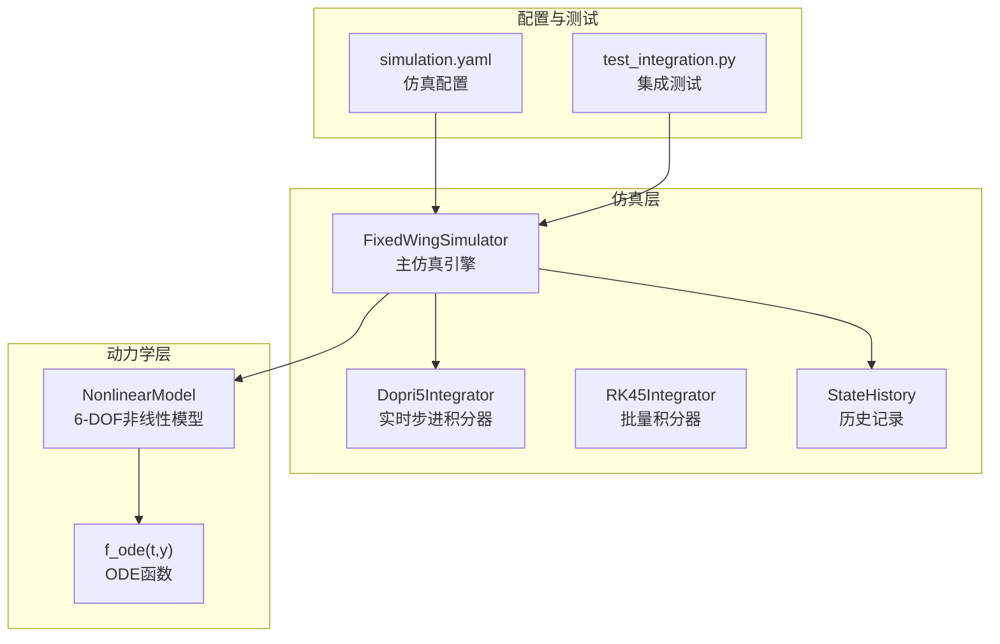
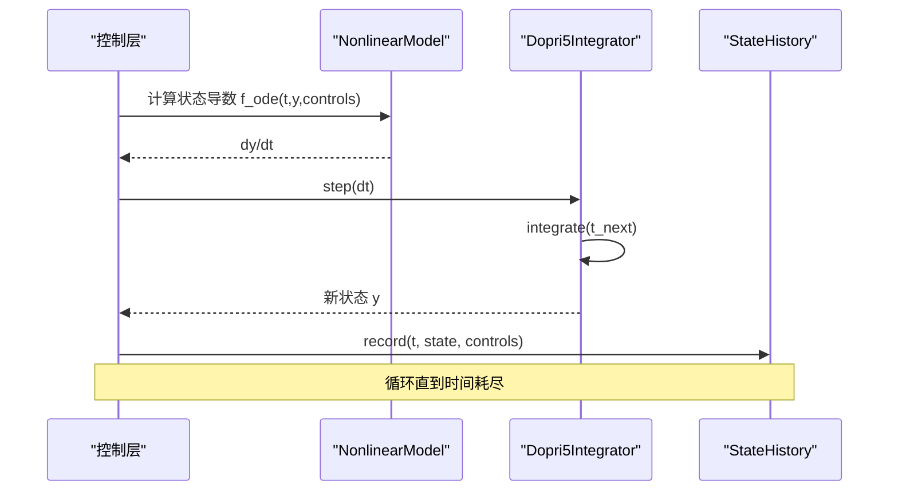
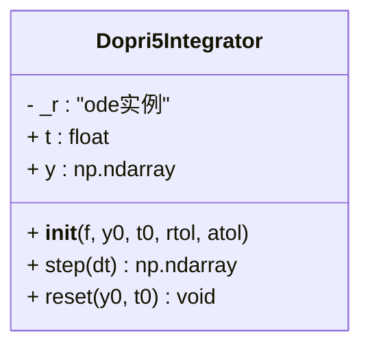
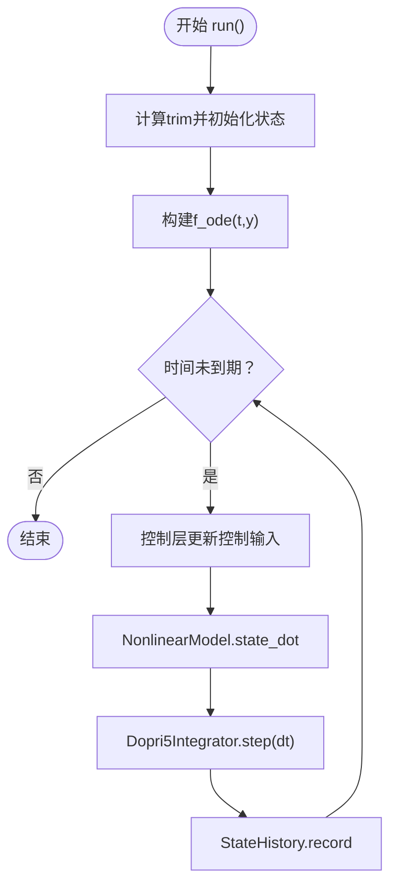
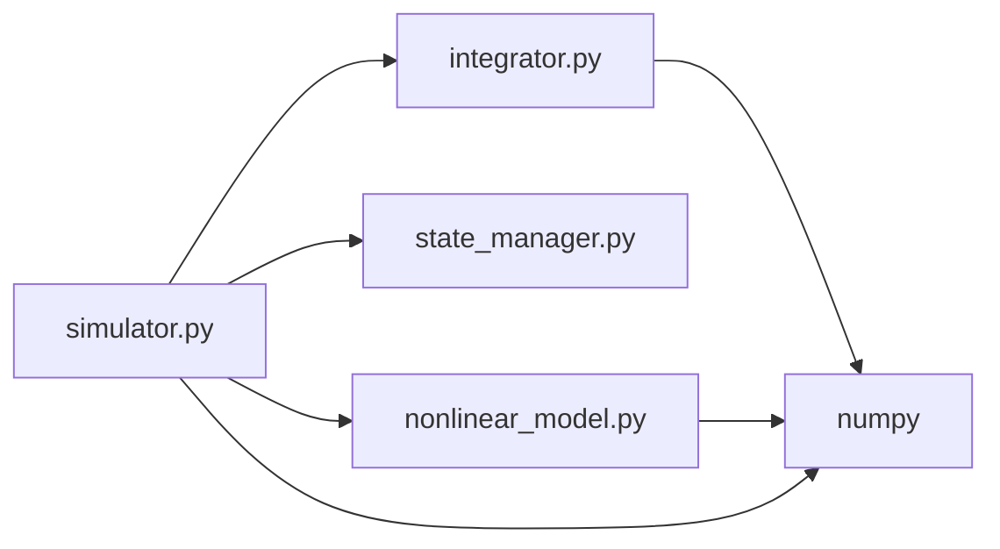

# 数值积分器

<cite>
**本文引用的文件**
- [integrator.py](file://src/simulation/integrator.py)
- [simulator.py](file://src/simulation/simulator.py)
- [state_manager.py](file://src/simulation/state_manager.py)
- [nonlinear_model.py](file://src/dynamics/nonlinear_model.py)
- [test_integration.py](file://tests/test_integration.py)
- [simulation.yaml](file://config/simulation.yaml)
- [__init__.py](file://src/simulation/__init__.py)
</cite>

## 目录
1. [简介](#简介)
2. [项目结构](#项目结构)
3. [核心组件](#核心组件)
4. [架构总览](#架构总览)
5. [详细组件分析](#详细组件分析)
6. [依赖关系分析](#依赖关系分析)
7. [性能考量](#性能考量)
8. [故障排查指南](#故障排查指南)
9. [结论](#结论)
10. [附录](#附录)

## 简介
本技术文档聚焦于数值积分器系统，特别是Dopri5Integrator的实现与应用。该系统基于scipy.integrate.ode的dopri5求解器，提供实时步进式积分能力，用于固定翼无人机仿真中的非线性六自由度（6-DOF）动力学求解。文档将从架构设计、数据流、处理逻辑、接口契约、错误处理与性能优化等维度进行深入解析，并给出不同应用场景下的参数选择建议与调试技巧。

## 项目结构
数值积分器位于simulation包中，与状态管理、仿真引擎、动力学模型紧密协作：
- integrator.py：封装Dopri5Integrator与RK45Integrator两类积分器
- simulator.py：主仿真引擎，负责构建ODE函数、驱动积分器、控制回路与轨迹规划
- state_manager.py：状态容器与历史记录，支撑仿真结果输出
- nonlinear_model.py：6-DOF非线性动力学模型，提供state_dot导数计算
- test_integration.py：集成测试，验证数值稳定性与API一致性
- simulation.yaml：仿真配置，包含积分器类型与容差设置
- __init__.py：模块导出入口

图表来源
- [simulator.py](file://src/simulation/simulator.py#L329-L339)
- [integrator.py](file://src/simulation/integrator.py#L17-L71)
- [nonlinear_model.py](file://src/dynamics/nonlinear_model.py#L160-L200)
- [state_manager.py](file://src/simulation/state_manager.py#L95-L175)
- [simulation.yaml](file://config/simulation.yaml#L1-L30)

章节来源
- [integrator.py](file://src/simulation/integrator.py#L1-L108)
- [simulator.py](file://src/simulation/simulator.py#L1-L642)
- [state_manager.py](file://src/simulation/state_manager.py#L1-L193)
- [nonlinear_model.py](file://src/dynamics/nonlinear_model.py#L1-L200)
- [test_integration.py](file://tests/test_integration.py#L1-L391)
- [simulation.yaml](file://config/simulation.yaml#L1-L30)

## 核心组件
- Dopri5Integrator：基于scipy.integrate.ode的dopri5，支持自适应步长但暴露单步推进接口，适合实时仿真循环
- RK45Integrator：基于scipy.integrate.solve_ivp的RK45，适合离线批量分析
- FixedWingSimulator：主控制器，构建ODE函数并驱动积分器；在run与init_step/step流程中调用Dopri5Integrator
- StateHistory：高效预分配数组的历史缓冲区，记录仿真过程中的状态与控制量
- NonlinearModel：提供6-DOF状态导数计算，作为ODE右侧函数

章节来源
- [integrator.py](file://src/simulation/integrator.py#L17-L71)
- [simulator.py](file://src/simulation/simulator.py#L239-L642)
- [state_manager.py](file://src/simulation/state_manager.py#L95-L175)
- [nonlinear_model.py](file://src/dynamics/nonlinear_model.py#L104-L200)

## 架构总览
Dopri5Integrator在FixedWingSimulator中以“单步推进”的方式被调用，形成如下闭环：
- 控制层根据当前状态与目标生成控制输入
- 动力学层计算状态导数
- 积分器推进一步，得到新状态
- 状态管理器记录历史数据

图表来源
- [simulator.py](file://src/simulation/simulator.py#L411-L567)
- [integrator.py](file://src/simulation/integrator.py#L50-L56)
- [state_manager.py](file://src/simulation/state_manager.py#L124-L168)

## 详细组件分析

### Dopri5Integrator 实现与数值方法
- 设计要点
  - 包装scipy.integrate.ode的dopri5求解器，具备自适应步长能力，同时提供单步推进接口
  - 支持相对/绝对容差rtol/atol，以及最大步内步数nsteps与静默verbosity
  - 提供当前时间t、当前状态y的只读属性，以及重置reset功能
- 接口契约
  - 构造函数接收f、y0、t0及容差参数
  - step(dt)返回新状态副本；失败时抛出运行时异常
  - reset(y0, t0)重新初始化内部状态
- 数值方法
  - dopri5是经典的Runge-Kutta 4(5)变体（Dormand-Prince），在保证精度的同时减少函数评估次数
  - 自适应步长通过误差估计与目标容差动态调整步长，提高效率与稳定性

图表来源
- [integrator.py](file://src/simulation/integrator.py#L17-L71)

章节来源
- [integrator.py](file://src/simulation/integrator.py#L17-L71)

### FixedWingSimulator 中的积分器集成
- ODE函数构建
  - 在run与init_step中分别定义f_ode(t, y)，将风场、密度与控制输入注入到NonlinearModel.state_dot
  - 风场通过旋转矩阵从NED转换到机体坐标
- 积分器使用
  - run循环中每步调用integrator.step(self.dt)，并在异常时中断仿真
  - init_step先计算trim并构造初始ODE，随后在step(dt)中推进一步
- 状态转换
  - 积分器返回的12维向量经AircraftSimState.from_array转换为可读状态对象

图表来源
- [simulator.py](file://src/simulation/simulator.py#L239-L567)

章节来源
- [simulator.py](file://src/simulation/simulator.py#L239-L642)

### RK45Integrator 批量分析用途
- 适用场景
  - 离线线性/非线性分析，需要完整时间历程
- 关键参数
  - rtol/atol：全局容差
  - max_step：最大步长限制
  - t_eval：可选的时间点序列
- 返回值
  - scipy OdeResult，包含t与y

章节来源
- [integrator.py](file://src/simulation/integrator.py#L73-L108)

### 状态管理与历史记录
- AircraftSimState
  - 12维基础状态（u,v,w,p,q,r,phi,theta,psi,x_N,x_E,x_D）
  - 派生量：alpha、beta、airspeed、altitude
  - 提供from_array与to_array便于与积分器交互
- StateHistory
  - 预分配字典数组，记录时间序列与派生量
  - 支持trim裁剪尾部空位，to_dict导出

章节来源
- [state_manager.py](file://src/simulation/state_manager.py#L16-L193)

### 非线性动力学模型
- NonlinearModel
  - 提供compute_trim与state_dot
  - state_dot接受风场与密度，返回12维导数
- Controls
  - 定义elevator、aileron、rudder、throttle

章节来源
- [nonlinear_model.py](file://src/dynamics/nonlinear_model.py#L104-L200)

## 依赖关系分析
- 模块耦合
  - simulator.py直接依赖integrator.py（Dopri5Integrator）、state_manager.py（AircraftSimState/StateHistory）、dynamics.nonlinear_model（NonlinearModel）
  - integrator.py仅依赖scipy.integrate与numpy
- 外部依赖
  - scipy.integrate.ode与solve_ivp
  - numpy
- 可能的循环依赖
  - 无直接循环；各模块职责清晰

图表来源
- [simulator.py](file://src/simulation/simulator.py#L48-L50)
- [integrator.py](file://src/simulation/integrator.py#L12-L14)
- [nonlinear_model.py](file://src/dynamics/nonlinear_model.py#L22-L28)

章节来源
- [simulator.py](file://src/simulation/simulator.py#L1-L642)
- [integrator.py](file://src/simulation/integrator.py#L1-L108)
- [nonlinear_model.py](file://src/dynamics/nonlinear_model.py#L1-L200)

## 性能考量
- 容差设置
  - rtol/atol过严会增加步数与函数评估次数；过松可能影响精度与稳定性
  - 建议在仿真配置中统一设置，并结合测试验证
- 步长与自适应
  - dopri5的自适应步长在刚性或快速变化问题上可能频繁调整步长
  - 若出现频繁失败或步长过小，可适当放宽容差或检查ODE的病态性
- 批量 vs 实时
  - 对离线分析使用RK45Integrator可一次性获得完整轨迹
  - 实时仿真循环中使用Dopri5Integrator的单步推进更贴合控制更新节奏
- 预分配内存
  - StateHistory预分配避免运行时扩容开销，提升记录效率

章节来源
- [simulation.yaml](file://config/simulation.yaml#L10-L12)
- [state_manager.py](file://src/simulation/state_manager.py#L117-L175)

## 故障排查指南
- 常见错误与定位
  - “Dopri5 integration failed”：通常由ODE病态、控制输入过大或环境扰动导致
  - 建议：降低dt、收紧控制幅值、检查风场与密度计算
- 数值稳定性测试
  - 集成测试覆盖开环/闭环、轨迹跟踪、线性分析与step API一致性
  - 使用_check_not_diverged断言关键状态变量有限且不发散
- 调试技巧
  - 在run循环中捕获RuntimeError并打印当前时间，有助于定位问题时刻
  - 对比run与多次step的结果，确保API一致性
  - 检查StateHistory记录的airspeed、altitude、姿态角是否合理

章节来源
- [integrator.py](file://src/simulation/integrator.py#L54-L56)
- [simulator.py](file://src/simulation/simulator.py#L558-L562)
- [test_integration.py](file://tests/test_integration.py#L41-L58)
- [test_integration.py](file://tests/test_integration.py#L310-L343)

## 结论
Dopri5Integrator通过dopri5在保持高精度的同时提供高效的单步推进能力，非常适合固定翼无人机仿真的实时控制回路。其与FixedWingSimulator、NonlinearModel、StateHistory的协同设计，形成了清晰的职责边界与稳定的数值闭环。通过合理的容差设置、步长策略与状态记录机制，系统能够在多种飞行模式下保持数值稳定与性能平衡。

## 附录

### 参数与配置参考
- 积分器类型与容差
  - integrator: dopri5 或 rk45
  - rtol: 相对容差
  - atol: 绝对容差
- 时间步长与持续时间
  - dt: 仿真步长（秒）
  - duration: 总仿真时长（秒）

章节来源
- [simulation.yaml](file://config/simulation.yaml#L7-L12)
- [simulation.yaml](file://config/simulation.yaml#L3-L5)

### 使用模式与最佳实践
- 实时仿真循环
  - 使用Dopri5Integrator.step(dt)推进一步
  - 每步更新控制输入后推进，记录StateHistory
- 离线分析
  - 使用RK45Integrator.integrate一次性求解完整轨迹
- 参数选择指南
  - 初学者：rtol=1e-6, atol=1e-6, dt=0.01~0.02
  - 高精度需求：rtol=1e-8, atol=1e-8，配合更小dt
  - 不稳定或发散：先放宽容差，检查控制输入与风场，再逐步收紧

章节来源
- [integrator.py](file://src/simulation/integrator.py#L33-L47)
- [integrator.py](file://src/simulation/integrator.py#L81-L107)
- [simulator.py](file://src/simulation/simulator.py#L239-L567)