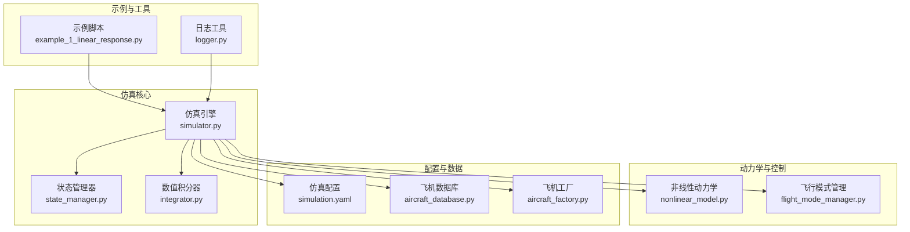
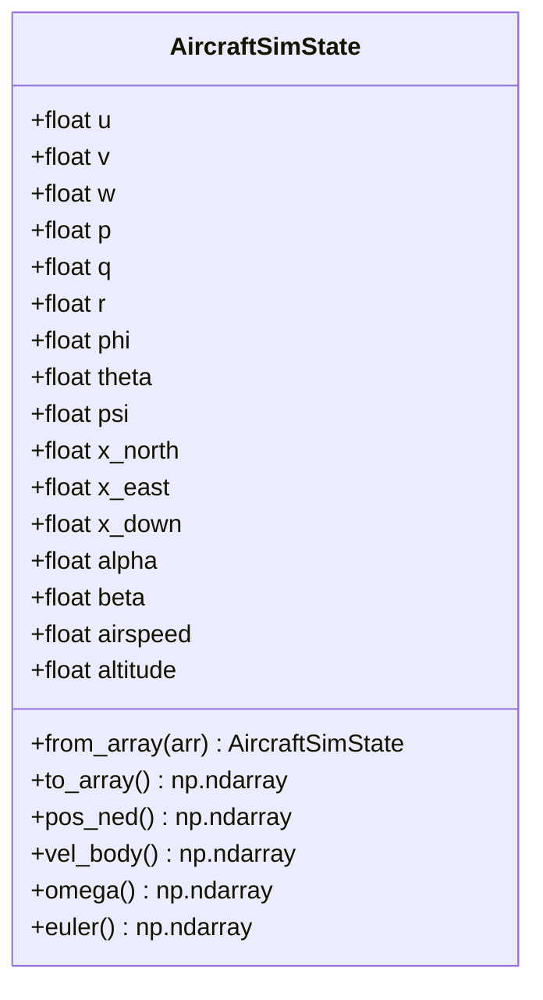
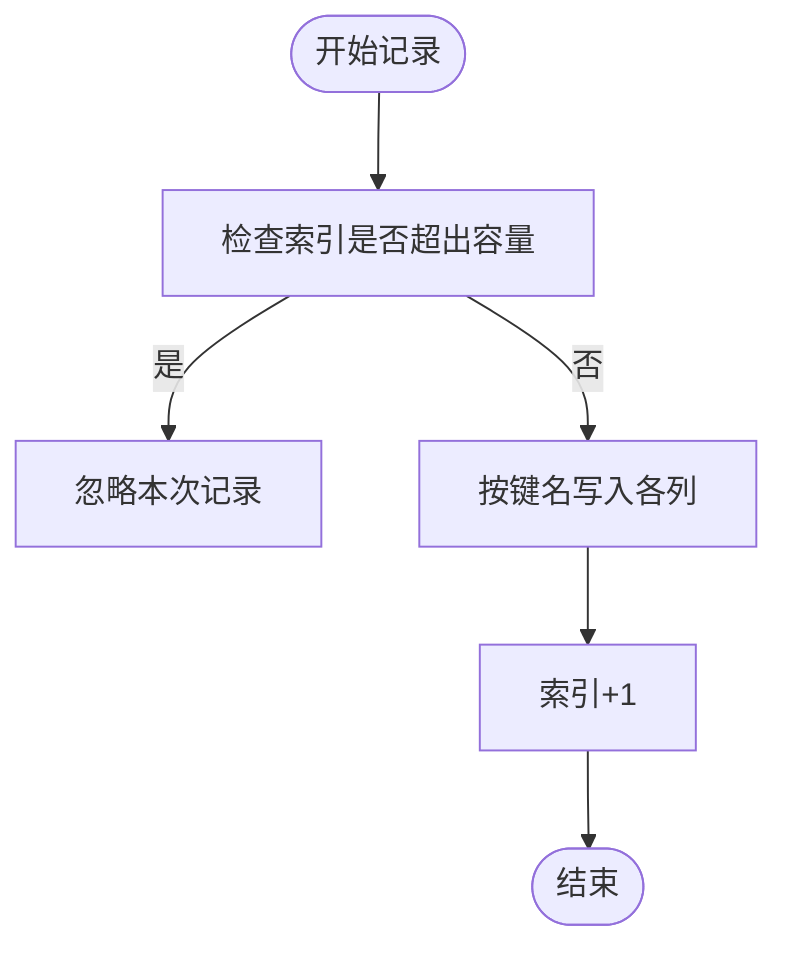
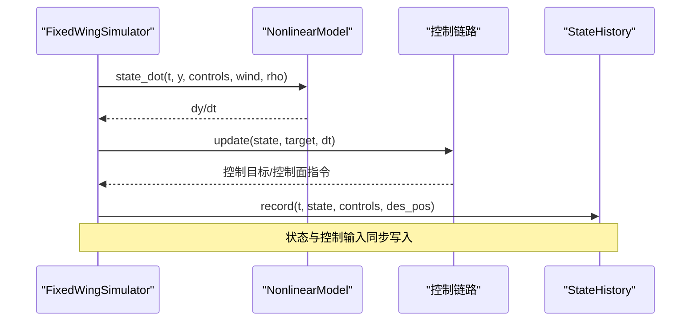
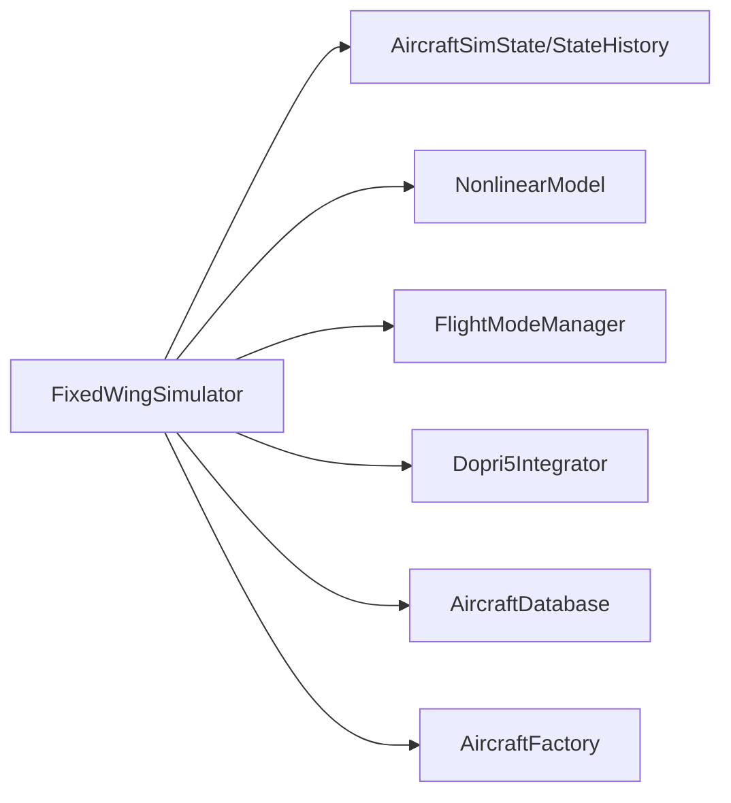

# 状态管理器

<cite>
**本文引用的文件列表**
- [state_manager.py](file://src/simulation/state_manager.py)
- [simulator.py](file://src/simulation/simulator.py)
- [nonlinear_model.py](file://src/dynamics/nonlinear_model.py)
- [flight_mode_manager.py](file://src/control/flight_mode_manager.py)
- [aircraft_factory.py](file://src/models/aircraft_factory.py)
- [aircraft_database.py](file://src/models/aircraft_database.py)
- [simulation.yaml](file://config/simulation.yaml)
- [example_1_linear_response.py](file://examples/example_1_linear_response.py)
- [integrator.py](file://src/simulation/integrator.py)
- [logger.py](file://src/utils/logger.py)
</cite>

## 目录
1. [简介](#简介)
2. [项目结构](#项目结构)
3. [核心组件](#核心组件)
4. [架构总览](#架构总览)
5. [详细组件分析](#详细组件分析)
6. [依赖关系分析](#依赖关系分析)
7. [性能考量](#性能考量)
8. [故障排除指南](#故障排除指南)
9. [结论](#结论)
10. [附录](#附录)

## 简介
本技术文档聚焦于状态管理器系统，深入解析 AircraftSimState 和 StateHistory 的数据结构设计与管理机制，涵盖：
- 状态数据的存储格式与派生量计算
- 历史记录管理与内存优化策略
- 状态转换、数据同步与并发安全考虑
- 状态查询、数据导出与性能监控
- 最佳实践与故障排除建议

该系统围绕固定翼无人机仿真引擎构建，通过预分配数组的历史缓冲区实现高效记录，并在仿真主循环中与控制链路、轨迹规划、环境建模等模块协同工作。

## 项目结构
状态管理器位于仿真子系统中，与动力学模型、控制层、规划模块紧密耦合。关键文件与职责如下：
- 状态容器与历史缓冲：state_manager.py
- 主仿真引擎：simulator.py
- 非线性动力学模型：nonlinear_model.py
- 飞行模式管理：flight_mode_manager.py
- 飞机参数工厂与数据库：aircraft_factory.py、aircraft_database.py
- 配置与示例：simulation.yaml、example_1_linear_response.py
- 数值积分器：integrator.py
- 日志工具：logger.py



图表来源
- [state_manager.py](file://src/simulation/state_manager.py#L1-L193)
- [simulator.py](file://src/simulation/simulator.py#L1-L642)
- [nonlinear_model.py](file://src/dynamics/nonlinear_model.py#L1-L386)
- [flight_mode_manager.py](file://src/control/flight_mode_manager.py#L1-L298)
- [aircraft_factory.py](file://src/models/aircraft_factory.py#L1-L136)
- [aircraft_database.py](file://src/models/aircraft_database.py#L1-L183)
- [simulation.yaml](file://config/simulation.yaml#L1-L30)
- [example_1_linear_response.py](file://examples/example_1_linear_response.py#L1-L206)
- [integrator.py](file://src/simulation/integrator.py#L1-L108)
- [logger.py](file://src/utils/logger.py#L1-L44)

章节来源
- [state_manager.py](file://src/simulation/state_manager.py#L1-L193)
- [simulator.py](file://src/simulation/simulator.py#L1-L642)

## 核心组件
- AircraftSimState：12维全状态（体坐标速度、角速度、欧拉角、NED位置）及派生量（攻角、侧滑角、空速、海拔），支持从数组构造与导出。
- StateHistory：预分配NumPy数组的历史缓冲区，按键名组织列式数据，支持记录、裁剪、查询与CSV导出。

章节来源
- [state_manager.py](file://src/simulation/state_manager.py#L16-L93)
- [state_manager.py](file://src/simulation/state_manager.py#L95-L193)

## 架构总览
状态管理器在仿真主循环中被调用，负责：
- 将积分器输出的状态封装为 AircraftSimState
- 计算派生量（空速、攻角、侧滑角、海拔）
- 将当前时刻状态与控制面指令、期望位置写入 StateHistory
- 在仿真结束时裁剪尾部未使用的缓冲区，释放内存

```mermaid
sequenceDiagram
participant Loop as "仿真主循环<br/>simulator.py"
participant Int as "积分器<br/>integrator.py"
participant State as "状态容器<br/>AircraftSimState"
participant Hist as "历史缓冲<br/>StateHistory"
Loop->>Int : step(dt)
Int-->>Loop : y(t+dt)
Loop->>State : from_array(y)
State-->>Loop : 派生量(空速/攻角/侧滑/海拔)
Loop->>Hist : record(t, state, controls, des_pos)
Note over Hist : 预分配数组，索引自增
Loop->>Loop : 控制链路更新
Loop->>Int : 继续下一步
Loop->>Hist : trim() 结束时裁剪未使用部分
```

图表来源
- [simulator.py](file://src/simulation/simulator.py#L410-L567)
- [integrator.py](file://src/simulation/integrator.py#L50-L71)
- [state_manager.py](file://src/simulation/state_manager.py#L52-L93)
- [state_manager.py](file://src/simulation/state_manager.py#L124-L174)

## 详细组件分析

### AircraftSimState 数据结构与派生量
- 字段布局严格对应非线性动力学ODE的12维状态：体坐标速度(u,v,w)、角速度(p,q,r)、欧拉角(phi,theta,psi)、NED位置(x_N,x_E,x_D)。
- 派生量在外部计算，不参与积分：
  - 攻角 alpha = atan2(w, u)
  - 侧滑角 beta = arcsin(clamp(v / airspeed, -1, 1))
  - 空速 airspeed = max(sqrt(u^2+v^2+w^2), 1e-3)
  - 海拔 altitude = -x_D（NED向下为正）
- 提供便捷属性：pos_ned、vel_body、omega、euler，便于控制层直接使用。



图表来源
- [state_manager.py](file://src/simulation/state_manager.py#L16-L93)
- [nonlinear_model.py](file://src/dynamics/nonlinear_model.py#L4-L20)

章节来源
- [state_manager.py](file://src/simulation/state_manager.py#L16-L93)
- [nonlinear_model.py](file://src/dynamics/nonlinear_model.py#L160-L182)

### StateHistory 历史缓冲与内存优化
- 预分配策略：初始化时按 n_steps 创建所有键的零矩阵，避免运行时动态扩容带来的碎片化与拷贝成本。
- 键集合覆盖：时间、12维状态、派生量、控制面指令、期望位置（des_*）。
- 记录流程：索引自增，超过容量则忽略；记录时填充各列。
- 裁剪策略：trim() 将数组切片至已使用长度，重置 n_steps，释放尾部未使用内存。
- 查询与导出：
  - get(key) 返回当前索引前的切片
  - to_dict() 返回浅拷贝字典，便于序列化或绘图
  - to_csv(path) 写入CSV，包含表头与逐行数据



图表来源
- [state_manager.py](file://src/simulation/state_manager.py#L124-L168)

章节来源
- [state_manager.py](file://src/simulation/state_manager.py#L95-L193)

### 状态转换与数据同步
- 仿真主循环中，每步将积分器状态 y(t) 转换为 AircraftSimState，并计算派生量。
- 控制链路根据当前状态生成控制目标，经率控制器与舵面混合得到控制面偏角与油门。
- 将 t、state、控制面、期望位置写入 StateHistory，确保状态与控制输入的时序一致性。
- 仿真结束时调用 trim()，保证历史数据长度与实际步数一致，避免冗余内存占用。



图表来源
- [simulator.py](file://src/simulation/simulator.py#L410-L567)
- [nonlinear_model.py](file://src/dynamics/nonlinear_model.py#L160-L182)
- [flight_mode_manager.py](file://src/control/flight_mode_manager.py#L173-L191)

章节来源
- [simulator.py](file://src/simulation/simulator.py#L410-L567)
- [flight_mode_manager.py](file://src/control/flight_mode_manager.py#L115-L191)

### 并发安全与线程考虑
- 当前实现为单线程仿真主循环，状态写入与读取均在同一执行路径内完成，不存在共享可变状态的竞态条件。
- 若扩展到多线程（如实时采集与可视化并行），建议：
  - 使用不可变视图或复制（to_dict().copy()）进行读取
  - 对共享缓冲区采用队列或锁保护
  - 在裁剪阶段避免与其他线程同时访问

章节来源
- [state_manager.py](file://src/simulation/state_manager.py#L179-L180)

### 状态查询、数据导出与性能监控
- 状态查询：
  - get(key) 获取某一列的当前片段
  - to_dict() 获取完整字典副本，适合后续分析与绘图
- 数据导出：
  - to_csv(path) 导出为CSV，包含表头与逐行数据
  - 示例脚本展示如何保存CSV与图像
- 性能监控：
  - 仿真配置中包含 dt、duration、积分器类型、容差等参数
  - 可结合日志工具记录关键事件与错误

章节来源
- [state_manager.py](file://src/simulation/state_manager.py#L176-L193)
- [example_1_linear_response.py](file://examples/example_1_linear_response.py#L157-L163)
- [simulation.yaml](file://config/simulation.yaml#L1-L30)
- [logger.py](file://src/utils/logger.py#L10-L44)

## 依赖关系分析
- 固定翼仿真器依赖状态管理器进行状态封装与历史记录。
- 动力学模型提供状态导数，驱动数值积分器推进。
- 控制层基于当前状态生成控制目标，影响下一时刻的控制输入。
- 飞机参数来自数据库与工厂，决定气动特性与初始条件。



图表来源
- [simulator.py](file://src/simulation/simulator.py#L33-L52)
- [state_manager.py](file://src/simulation/state_manager.py#L1-L14)
- [nonlinear_model.py](file://src/dynamics/nonlinear_model.py#L22-L29)
- [flight_mode_manager.py](file://src/control/flight_mode_manager.py#L19-L26)
- [aircraft_database.py](file://src/models/aircraft_database.py#L12-L21)
- [aircraft_factory.py](file://src/models/aircraft_factory.py#L9-L12)

章节来源
- [simulator.py](file://src/simulation/simulator.py#L33-L52)

## 性能考量
- 预分配数组：减少内存重分配与拷贝，提升写入效率。
- 列式存储：便于按列查询与导出，降低跨列遍历成本。
- 裁剪策略：在仿真结束后释放尾部未使用内存，避免长期运行导致的内存膨胀。
- 数值积分器：Dopri5支持自适应步长，兼顾精度与实时性；批处理分析可用RK45。
- 配置参数：合理设置 dt、容差与积分器类型，平衡精度与性能。

章节来源
- [state_manager.py](file://src/simulation/state_manager.py#L117-L174)
- [integrator.py](file://src/simulation/integrator.py#L17-L71)
- [simulation.yaml](file://config/simulation.yaml#L3-L12)

## 故障排除指南
- 记录失败或数据缺失
  - 检查 StateHistory 初始化的 n_steps 是否足够大
  - 确认 record 调用频率与 dt 设置一致
  - 使用 trim() 确保最终长度与步数一致
- 空速/攻角/侧滑异常
  - 确认 from_array 输入为12维数组且顺序正确
  - 检查派生量计算中的数值稳定性（空速下界）
- 导出问题
  - 确认 to_csv 路径存在或允许自动创建目录
  - 检查键集合与期望列一致
- 积分错误
  - 捕获 RuntimeError 并检查风场、密度与气动参数
  - 调整容差或更换积分器类型

章节来源
- [state_manager.py](file://src/simulation/state_manager.py#L124-L193)
- [simulator.py](file://src/simulation/simulator.py#L558-L562)
- [integrator.py](file://src/simulation/integrator.py#L54-L56)

## 结论
状态管理器通过 AircraftSimState 与 StateHistory 实现了高效率、低开销的状态封装与历史记录。其预分配数组与裁剪策略在保证数据完整性的同时显著降低了内存与CPU开销。在仿真主循环中，状态与控制输入的同步写入确保了数据一致性，并为后续分析与可视化提供了便利。建议在扩展到多线程场景时引入适当的并发保护与不可变视图策略，以维持系统的可靠性与性能。

## 附录
- 飞机参数来源与合并逻辑参见飞机工厂与数据库模块。
- 示例脚本展示了如何运行仿真并将结果导出为CSV与图像。

章节来源
- [aircraft_factory.py](file://src/models/aircraft_factory.py#L42-L74)
- [aircraft_database.py](file://src/models/aircraft_database.py#L143-L166)
- [example_1_linear_response.py](file://examples/example_1_linear_response.py#L132-L163)