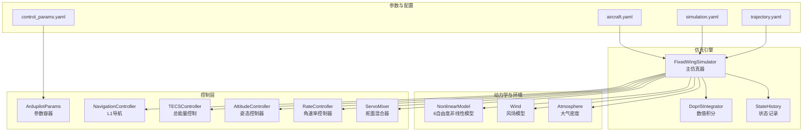
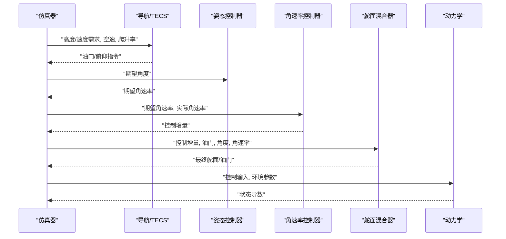
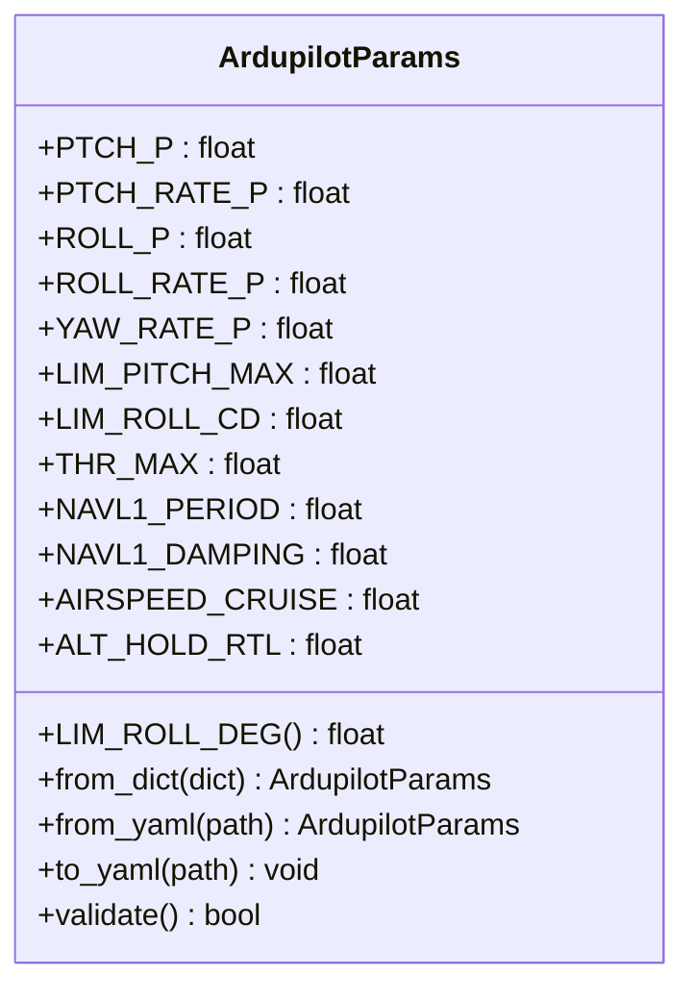
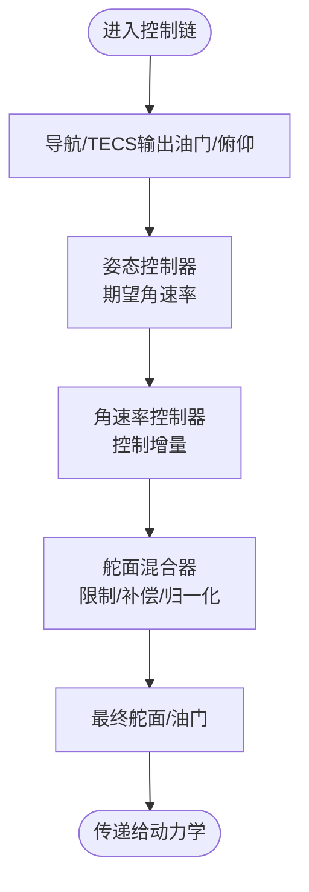
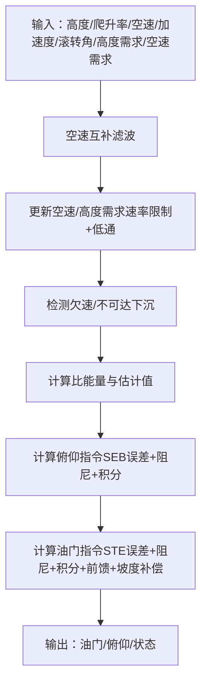
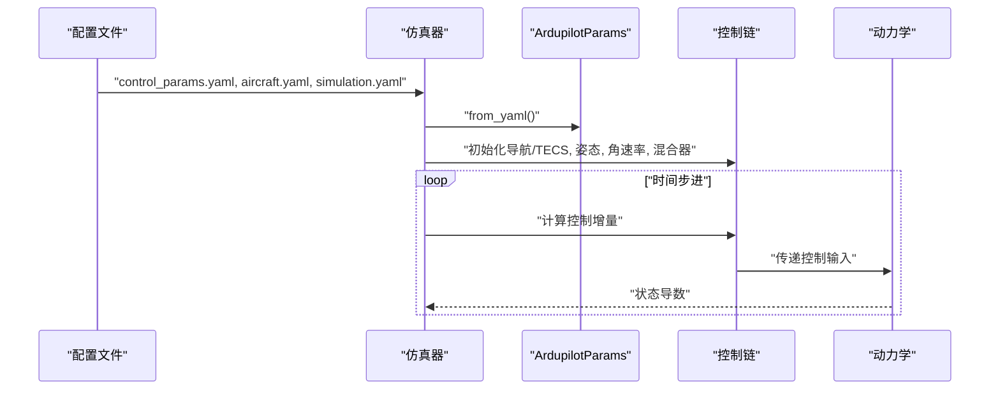
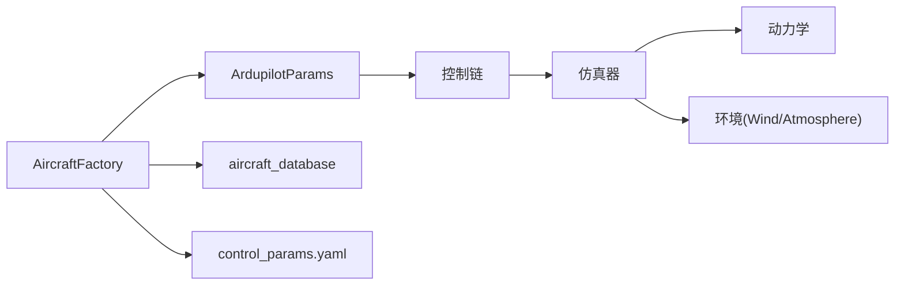

# ArduPilot参数配置

<cite>
**本文档引用的文件**
- [examples/example_6_ardupilot_parameters.py](file://examples/example_6_ardupilot_parameters.py)
- [src/control/ardupilot_compat.py](file://src/control/ardupilot_compat.py)
- [src/models/aircraft_factory.py](file://src/models/aircraft_factory.py)
- [src/simulation/simulator.py](file://src/simulation/simulator.py)
- [src/control/pid_controller.py](file://src/control/pid_controller.py)
- [src/control/attitude_controller.py](file://src/control/attitude_controller.py)
- [src/control/rate_controller.py](file://src/control/rate_controller.py)
- [src/control/servo_mixer.py](file://src/control/servo_mixer.py)
- [src/control/tecs_controller.py](file://src/control/tecs_controller.py)
- [src/models/aircraft_database.py](file://src/models/aircraft_database.py)
- [config/control_params.yaml](file://config/control_params.yaml)
- [config/aircraft.yaml](file://config/aircraft.yaml)
- [config/simulation.yaml](file://config/simulation.yaml)
- [config/trajectory.yaml](file://config/trajectory.yaml)
</cite>

## 目录
1. [简介](#简介)
2. [项目结构](#项目结构)
3. [核心组件](#核心组件)
4. [架构概览](#架构概览)
5. [详细组件分析](#详细组件分析)
6. [依赖关系分析](#依赖关系分析)
7. [性能考虑](#性能考虑)
8. [故障排查指南](#故障排查指南)
9. [结论](#结论)
10. [附录](#附录)

## 简介
本文件面向ArduPilot参数配置与仿真实现，聚焦以下目标：
- 解释ArduPilot兼容性的意义与实现方式
- 详述参数映射与转换规则（PID参数、传感器配置、执行器设置）
- 说明如何将仿真结果与ArduPilot硬件平台对接
- 提供参数校准与调试方法（静平衡、动平衡、控制系统标定）
- 给出在ArduPilot中实现与仿真相同控制逻辑的路径
- 总结硬件集成注意事项与安全措施
- 提供参数配置最佳实践与常见问题解决方案

## 项目结构
项目采用模块化设计，围绕“飞行动力学 + 控制层 + 参数管理 + 导航规划 + 仿真引擎”组织：
- 控制层：ArduPilot风格的五层控制链（导航/TECS → 姿态 → 角速率 → 执行器混合 → 舵面输出）
- 参数层：ArduPilot参数容器与导出工具
- 飞行动力学：非线性6自由度模型与线性化分析
- 环境建模：风场与大气密度
- 仿真引擎：整合各模块，支持闭环/开环运行

**图表来源**
- [src/simulation/simulator.py](file://src/simulation/simulator.py#L115-L234)
- [src/models/aircraft_factory.py](file://src/models/aircraft_factory.py#L94-L136)
- [src/control/ardupilot_compat.py](file://src/control/ardupilot_compat.py#L17-L130)

**章节来源**
- [src/simulation/simulator.py](file://src/simulation/simulator.py#L1-L110)
- [src/models/aircraft_factory.py](file://src/models/aircraft_factory.py#L1-L93)
- [config/control_params.yaml](file://config/control_params.yaml#L1-L45)
- [config/aircraft.yaml](file://config/aircraft.yaml#L1-L13)
- [config/simulation.yaml](file://config/simulation.yaml#L1-L30)
- [config/trajectory.yaml](file://config/trajectory.yaml#L1-L23)

## 核心组件
- ArdupilotParams：ArduPilot参数容器，字段名严格匹配ArduPilot命名规范，支持从YAML加载、导出与基本范围校验
- 固定翼仿真器：整合参数、控制链、导航与动力学，支持闭环与开环运行
- 控制链：导航/TECS → 姿态 → 角速率 → 执行器混合 → 舵面输出
- 舵面混合器：将控制增量转换为最终舵面与油门命令，施加幅度/速率限制与协调转弯补偿
- 飞机数据库：内置多型飞机气动与惯性参数，支持导出为ArduPilot .param文件

**章节来源**
- [src/control/ardupilot_compat.py](file://src/control/ardupilot_compat.py#L17-L130)
- [src/simulation/simulator.py](file://src/simulation/simulator.py#L115-L234)
- [src/control/servo_mixer.py](file://src/control/servo_mixer.py#L54-L153)
- [src/models/aircraft_database.py](file://src/models/aircraft_database.py#L29-L133)

## 架构概览
ArduPilot兼容的控制架构遵循五层结构：
- 导航/TECS：基于总能量控制的高度/速度耦合控制
- 姿态控制器：将期望角度转换为期望角速率
- 角速率控制器：独立三轴PID，实现稳定阻尼
- 执行器混合：限制与速率约束、协调转弯补偿
- 舵面输出：最终归一化到[-1,1]（升降舵/副翼/方向舵）与[0,1]（油门）

**图表来源**
- [src/simulation/simulator.py](file://src/simulation/simulator.py#L478-L567)
- [src/control/tecs_controller.py](file://src/control/tecs_controller.py#L247-L315)
- [src/control/attitude_controller.py](file://src/control/attitude_controller.py#L81-L123)
- [src/control/rate_controller.py](file://src/control/rate_controller.py#L68-L98)
- [src/control/servo_mixer.py](file://src/control/servo_mixer.py#L80-L149)

## 详细组件分析

### ArduPilot参数容器与导出
- 字段覆盖：姿态/角速率/限制/导航/速度/高度等，全部采用ArduPilot命名
- 载入/导出：from_yaml()/to_yaml()，支持热重载与参数验证
- 导出工具：将飞机几何/惯性参数与控制参数合并导出为ArduPilot .param文件

**图表来源**
- [src/control/ardupilot_compat.py](file://src/control/ardupilot_compat.py#L17-L130)

**章节来源**
- [src/control/ardupilot_compat.py](file://src/control/ardupilot_compat.py#L74-L130)
- [src/models/aircraft_factory.py](file://src/models/aircraft_factory.py#L94-L136)
- [config/control_params.yaml](file://config/control_params.yaml#L1-L45)

### 控制链详解
- 姿态控制器：独立三轴P控制，期望角速率输出
- 角速率控制器：三轴独立PID，支持前馈与低通滤波
- 舵面混合器：幅度/速率限制、协调转弯补偿、单位转换

**图表来源**
- [src/simulation/simulator.py](file://src/simulation/simulator.py#L499-L541)
- [src/control/attitude_controller.py](file://src/control/attitude_controller.py#L81-L123)
- [src/control/rate_controller.py](file://src/control/rate_controller.py#L68-L98)
- [src/control/servo_mixer.py](file://src/control/servo_mixer.py#L80-L149)

**章节来源**
- [src/control/attitude_controller.py](file://src/control/attitude_controller.py#L33-L134)
- [src/control/rate_controller.py](file://src/control/rate_controller.py#L32-L109)
- [src/control/servo_mixer.py](file://src/control/servo_mixer.py#L54-L153)

### TECS控制器（总能量控制）
- 核心思想：油门控制总比能量，俯仰控制比能量分配比
- 关键参数：最大爬升/下沉率、时间常数、油门/俯仰阻尼、积分增益、坡度补偿等
- 保护机制：欠速保护、不可达下沉检测、速率限制与自适应缩放

**图表来源**
- [src/control/tecs_controller.py](file://src/control/tecs_controller.py#L247-L315)

**章节来源**
- [src/control/tecs_controller.py](file://src/control/tecs_controller.py#L50-L647)

### 仿真器与参数映射
- 参数来源：control_params.yaml → ArdupilotParams → 控制器初始化
- TECS参数：从YAML读取并注入导航控制器
- 运行流程：计算配平、初始化控制层、构建ODE、循环推进、记录历史

**图表来源**
- [src/simulation/simulator.py](file://src/simulation/simulator.py#L165-L234)
- [src/simulation/simulator.py](file://src/simulation/simulator.py#L239-L567)

**章节来源**
- [src/simulation/simulator.py](file://src/simulation/simulator.py#L130-L234)
- [config/control_params.yaml](file://config/control_params.yaml#L1-L45)

## 依赖关系分析
- 参数层依赖：ArdupilotParams ← control_params.yaml
- 控制层依赖：导航/TECS ← TECSController；姿态/角速率 ← PIDController；舵面混合器 ← 限制与补偿
- 仿真器依赖：AircraftFactory ← aircraft_database；Wind/Atmosphere；PIDController/TECSController/混合器
- 导出工具：aircraft_database + control_params.yaml → .param文件

**图表来源**
- [src/simulation/simulator.py](file://src/simulation/simulator.py#L33-L52)
- [src/models/aircraft_factory.py](file://src/models/aircraft_factory.py#L12-L12)

**章节来源**
- [src/simulation/simulator.py](file://src/simulation/simulator.py#L33-L52)
- [src/models/aircraft_factory.py](file://src/models/aircraft_factory.py#L12-L12)

## 性能考虑
- 数值积分：默认使用Dormand-Prince 5阶积分器，适合实时与批量分析
- 控制采样：dt=0.01s（100Hz），保证控制带宽与稳定性
- 控制器滤波：角速率控制器对微分项进行低通滤波，抑制高频噪声
- 速率限制：舵面混合器对控制增量施加速率限制，避免执行器饱和与抖振
- 自动配平：仿真器在运行前自动计算并更新TECS巡航油门，匹配当前飞机配平

**章节来源**
- [config/simulation.yaml](file://config/simulation.yaml#L4-L12)
- [src/control/rate_controller.py](file://src/control/rate_controller.py#L72-L98)
- [src/control/servo_mixer.py](file://src/control/servo_mixer.py#L134-L144)
- [src/simulation/simulator.py](file://src/simulation/simulator.py#L294-L299)

## 故障排查指南
- 参数范围告警：使用validate()检查关键参数是否在合理范围内
- 导出失败：确认control_params.yaml存在且格式正确；导出路径可写
- 控制不稳定：检查PID增益、限制参数与速率限制设置；逐步降低增益
- 欠速/不可达下沉：调整TECS参数（爬升/下沉率、阻尼、积分增益、坡度补偿）
- 油门饱和：检查TECS积分器与前馈项，避免长时间满油门
- 热重载无效：确认通过reload_gains()更新控制器参数

**章节来源**
- [src/control/ardupilot_compat.py](file://src/control/ardupilot_compat.py#L104-L130)
- [src/simulation/simulator.py](file://src/simulation/simulator.py#L165-L171)
- [src/control/tecs_controller.py](file://src/control/tecs_controller.py#L432-L444)
- [src/control/tecs_controller.py](file://src/control/tecs_controller.py#L635-L646)

## 结论
本项目通过严格的ArduPilot参数命名与控制链实现，提供了从仿真到硬件平台的完整参数映射路径。通过参数容器、导出工具与仿真器的协同，用户可以：
- 在仿真中快速迭代控制参数
- 将参数导出为ArduPilot .param文件
- 在硬件平台上复用相同的控制逻辑
- 基于TECS与五层控制链实现稳健的高度/速度耦合控制

## 附录

### 参数映射与转换规则
- 飞机参数映射：质量、机翼面积、展长、平均弦长、惯性矩、巡航速度等
- 控制参数映射：姿态/角速率PID、限制参数、导航L1参数、TECS参数
- 单位转换：角度限制（度→弧度）、舵面幅度（度→归一化）、油门（0→1）
- 导出格式：.param文件，每行“参数名,数值”

**章节来源**
- [src/models/aircraft_factory.py](file://src/models/aircraft_factory.py#L109-L133)
- [src/control/servo_mixer.py](file://src/control/servo_mixer.py#L31-L51)
- [config/control_params.yaml](file://config/control_params.yaml#L1-L45)

### 与ArduPilot硬件平台对接
- 使用导出工具生成.arparam文件，导入地面站软件
- 确认硬件平台的传感器配置与执行器校准与仿真一致
- 在硬件上先进行低增益测试，逐步提升到仿真水平

**章节来源**
- [src/models/aircraft_factory.py](file://src/models/aircraft_factory.py#L94-L136)

### 参数校准与调试方法
- 静平衡：计算配平油门，匹配阻力与升力在水平飞行时的平衡
- 动平衡：在不同空速与攻角下验证控制增益，避免极限收敛
- 控制系统标定：先标定角速率控制器，再标定姿态控制器，最后标定TECS

**章节来源**
- [src/simulation/simulator.py](file://src/simulation/simulator.py#L275-L300)
- [src/control/tecs_controller.py](file://src/control/tecs_controller.py#L50-L105)

### 在ArduPilot中实现相同控制逻辑
- 使用相同的参数命名与数据结构
- 复用控制链顺序：导航/TECS → 姿态 → 角速率 → 执行器混合
- 保持相同的单位与限制条件

**章节来源**
- [src/simulation/simulator.py](file://src/simulation/simulator.py#L499-L541)
- [src/control/ardupilot_compat.py](file://src/control/ardupilot_compat.py#L17-L68)

### 硬件集成注意事项与安全措施
- 传感器标定：空速、高度、角速率传感器零偏与灵敏度校准
- 执行器校准：行程、中立点、传动比与反馈一致性
- 安全边界：设置合理的角度/油门限制与速率限制
- 试飞策略：先在仿真中验证，再进行低高度、低速、小动作的试飞

**章节来源**
- [src/control/servo_mixer.py](file://src/control/servo_mixer.py#L109-L144)
- [src/control/ardupilot_compat.py](file://src/control/ardupilot_compat.py#L46-L60)

### 参数配置最佳实践
- 从保守增益开始，逐步提高
- 使用热重载功能在仿真中快速验证参数变化
- 保持参数命名与ArduPilot一致，便于移植
- 定期导出参数文件，建立版本管理

**章节来源**
- [examples/example_6_ardupilot_parameters.py](file://examples/example_6_ardupilot_parameters.py#L27-L38)
- [src/simulation/simulator.py](file://src/simulation/simulator.py#L56-L67)