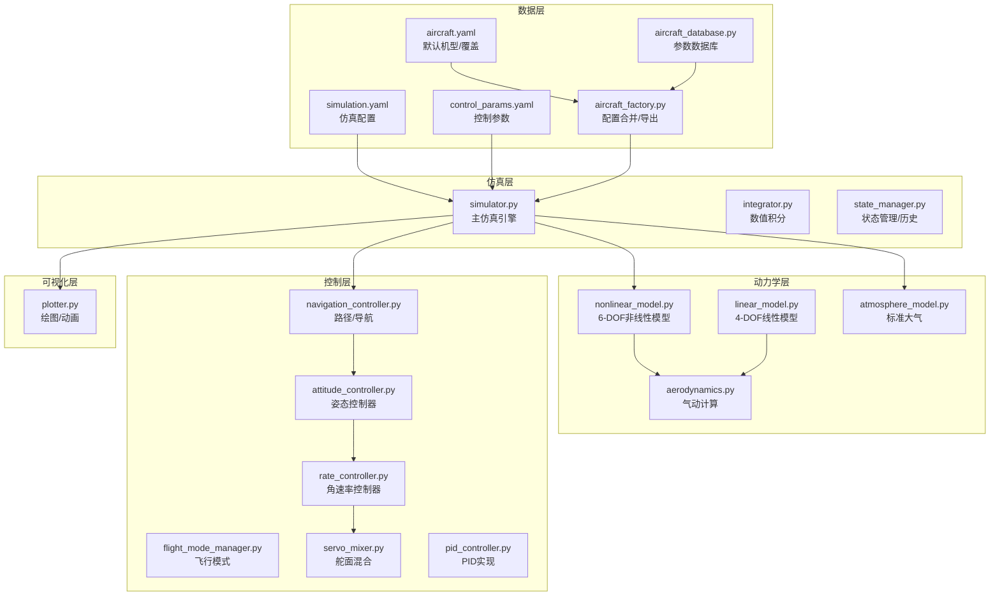
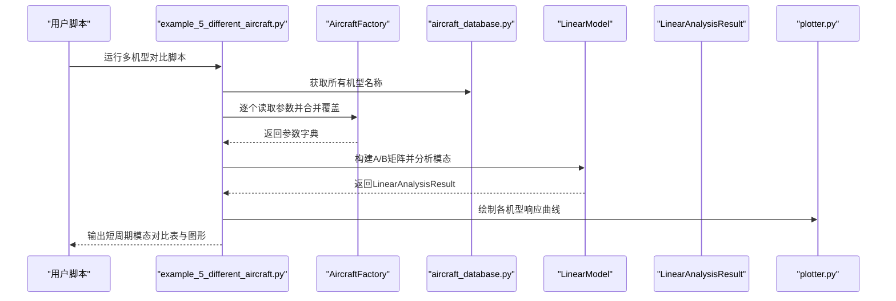
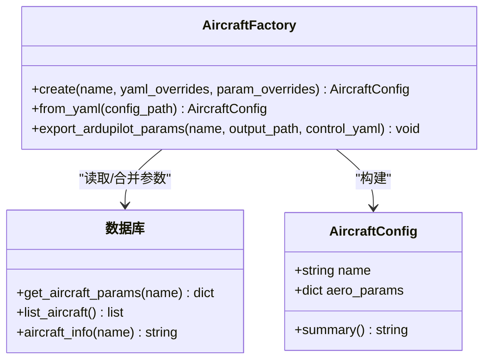
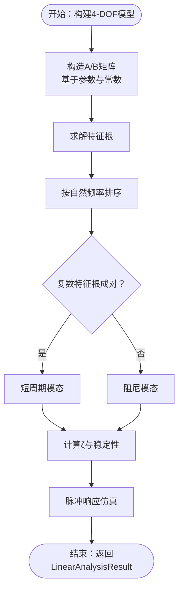
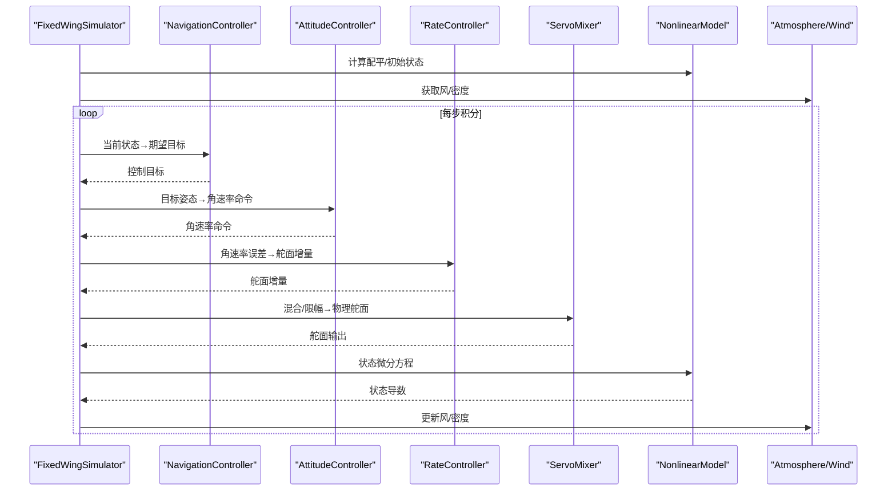
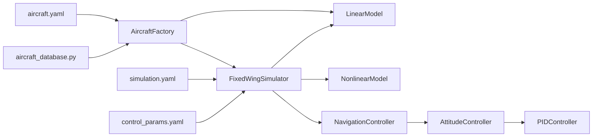

# 不同飞机比较

<cite>
**本文引用的文件**
- [examples/example_5_different_aircraft.py](file://examples/example_5_different_aircraft.py)
- [src/models/aircraft_database.py](file://src/models/aircraft_database.py)
- [src/models/aircraft_factory.py](file://src/models/aircraft_factory.py)
- [src/dynamics/linear_model.py](file://src/dynamics/linear_model.py)
- [src/dynamics/aerodynamics.py](file://src/dynamics/aerodynamics.py)
- [src/simulation/simulator.py](file://src/simulation/simulator.py)
- [src/control/attitude_controller.py](file://src/control/attitude_controller.py)
- [src/control/pid_controller.py](file://src/control/pid_controller.py)
- [src/visualization/plotter.py](file://src/visualization/plotter.py)
- [config/aircraft.yaml](file://config/aircraft.yaml)
- [config/simulation.yaml](file://config/simulation.yaml)
- [config/control_params.yaml](file://config/control_params.yaml)
- [src/utils/math_utils.py](file://src/utils/math_utils.py)
- [src/environment/atmosphere_model.py](file://src/environment/atmosphere_model.py)
</cite>

## 目录
1. [引言](#引言)
2. [项目结构](#项目结构)
3. [核心组件](#核心组件)
4. [架构总览](#架构总览)
5. [详细组件分析](#详细组件分析)
6. [依赖关系分析](#依赖关系分析)
7. [性能考量](#性能考量)
8. [故障排查指南](#故障排查指南)
9. [结论](#结论)
10. [附录](#附录)

## 引言
本文件围绕“不同飞机比较”主题，系统化阐述多机型参数对比分析的方法与意义，结合代码库中的数据库、线性建模、控制链路与仿真引擎，给出可操作的比较流程与评估维度。重点覆盖：
- 气动特性：升阻特性、俯仰力矩特性、侧向力矩特性
- 发动机/推进特性：通过稳态配平与能量控制（TECS）体现的推重比与能量管理
- 操控特性：姿态与角速率控制回路、模态稳定性与阻尼
- 参数调整策略：通过数据库参数与控制参数进行对比与优化
- 性能评估指标：最大速度、爬升率、转弯半径、稳定裕度等
- 选型建议：基于任务需求（续航、速度、机动、载荷）的决策依据

## 项目结构
该模拟器采用模块化设计，按“模型-动力学-环境-控制-规划-仿真-可视化”分层组织。核心文件与职责如下：
- 数据层：飞机参数数据库与工厂类，负责参数加载、合并与导出
- 动力学层：线性4-DOF模型与非线性6-DOF模型，支持模态分析与时间域仿真
- 控制层：五级ArduPilot风格控制链路（导航→姿态→角速率→舵面混合→执行器）
- 环境层：标准大气与风场模型
- 仿真层：集成器、状态管理与历史记录
- 可视化层：Matplotlib/Plotly图形输出

图表来源
- [src/models/aircraft_database.py](file://src/models/aircraft_database.py#L29-L133)
- [src/models/aircraft_factory.py](file://src/models/aircraft_factory.py#L39-L93)
- [src/dynamics/linear_model.py](file://src/dynamics/linear_model.py#L107-L200)
- [src/dynamics/aerodynamics.py](file://src/dynamics/aerodynamics.py#L35-L148)
- [src/simulation/simulator.py](file://src/simulation/simulator.py#L115-L234)
- [src/control/attitude_controller.py](file://src/control/attitude_controller.py#L33-L134)
- [src/control/pid_controller.py](file://src/control/pid_controller.py#L17-L117)
- [src/visualization/plotter.py](file://src/visualization/plotter.py#L19-L154)
- [config/aircraft.yaml](file://config/aircraft.yaml#L1-L13)
- [config/simulation.yaml](file://config/simulation.yaml#L1-L30)
- [config/control_params.yaml](file://config/control_params.yaml#L1-L45)

章节来源
- [config/aircraft.yaml](file://config/aircraft.yaml#L1-L13)
- [config/simulation.yaml](file://config/simulation.yaml#L1-L30)
- [config/control_params.yaml](file://config/control_params.yaml#L1-L45)

## 核心组件
- 飞机参数数据库：内置7种无人机参数，涵盖几何/质量/惯性、纵向/横向气动导数、马赫数等，自动派生空速与动压等派生参数
- 线性4-DOF模型：基于纵向状态空间，支持特征根分解识别短周期/长周期模态，输出阻尼比与自然频率
- 非线性6-DOF仿真：ArduPilot风格控制链路，支持多种飞行模式与轨迹跟踪
- 控制系统：姿态/角速率PID、舵面混合、限幅与抗积分饱和
- 可视化：2D/3D轨迹与状态时序图，支持保存为图像或交互式Plotly图

章节来源
- [src/models/aircraft_database.py](file://src/models/aircraft_database.py#L143-L183)
- [src/dynamics/linear_model.py](file://src/dynamics/linear_model.py#L107-L319)
- [src/simulation/simulator.py](file://src/simulation/simulator.py#L115-L642)
- [src/control/attitude_controller.py](file://src/control/attitude_controller.py#L33-L134)
- [src/visualization/plotter.py](file://src/visualization/plotter.py#L19-L244)

## 架构总览
下图展示从配置到仿真结果的端到端流程，以及多机型对比的关键节点。

图表来源
- [examples/example_5_different_aircraft.py](file://examples/example_5_different_aircraft.py#L24-L64)
- [src/models/aircraft_factory.py](file://src/models/aircraft_factory.py#L42-L75)
- [src/models/aircraft_database.py](file://src/models/aircraft_database.py#L143-L167)
- [src/dynamics/linear_model.py](file://src/dynamics/linear_model.py#L312-L319)
- [src/visualization/plotter.py](file://src/visualization/plotter.py#L19-L112)

## 详细组件分析

### 飞机参数数据库与工厂
- 数据库提供7种机型的完整气动/几何/惯性参数，统一命名与扩展字段，便于与ArduPilot兼容
- 工厂支持从YAML配置文件与字典参数进行覆盖合并，生成最终用于仿真/控制的参数集
- 支持导出ArduPilot参数文件，便于硬件在环验证

图表来源
- [src/models/aircraft_factory.py](file://src/models/aircraft_factory.py#L15-L93)
- [src/models/aircraft_database.py](file://src/models/aircraft_database.py#L143-L183)

章节来源
- [src/models/aircraft_database.py](file://src/models/aircraft_database.py#L29-L133)
- [src/models/aircraft_factory.py](file://src/models/aircraft_factory.py#L39-L136)
- [config/aircraft.yaml](file://config/aircraft.yaml#L1-L13)

### 线性4-DOF模型与模态分析
- 状态向量：纵向扰动速度、攻角、俯仰速率、俯仰角
- 输入向量：节流与升降舵扰动
- 特征根分解识别短周期、长周期与阻尼模态，输出阻尼比与自然频率
- 提供脉冲响应仿真，支持对比不同机型在同一输入下的动态响应

图表来源
- [src/dynamics/linear_model.py](file://src/dynamics/linear_model.py#L129-L252)
- [src/dynamics/linear_model.py](file://src/dynamics/linear_model.py#L258-L319)

章节来源
- [src/dynamics/linear_model.py](file://src/dynamics/linear_model.py#L107-L319)
- [examples/example_5_different_aircraft.py](file://examples/example_5_different_aircraft.py#L24-L64)

### 非线性6-DOF仿真与控制链路
- 主仿真引擎集成环境（风/大气）、动力学、控制链路与轨迹规划
- 控制链路：导航→姿态→角速率→舵面混合→执行器，支持多种飞行模式
- TECS能量控制系统参与爬升/下滑与速度-高度解耦控制

图表来源
- [src/simulation/simulator.py](file://src/simulation/simulator.py#L239-L567)
- [src/control/attitude_controller.py](file://src/control/attitude_controller.py#L81-L134)
- [src/control/pid_controller.py](file://src/control/pid_controller.py#L55-L117)
- [src/environment/atmosphere_model.py](file://src/environment/atmosphere_model.py#L61-L77)

章节来源
- [src/simulation/simulator.py](file://src/simulation/simulator.py#L115-L642)
- [src/control/attitude_controller.py](file://src/control/attitude_controller.py#L33-L134)
- [src/control/pid_controller.py](file://src/control/pid_controller.py#L17-L117)

### 气动计算与角度工具
- 气动计算：基于迎角、侧滑角与非维角速率，计算升阻与力矩系数，再换算为身体坐标系力与力矩
- 角度工具：攻角、侧滑角、动态压力、欧拉角变换矩阵等

章节来源
- [src/dynamics/aerodynamics.py](file://src/dynamics/aerodynamics.py#L35-L148)
- [src/utils/math_utils.py](file://src/utils/math_utils.py#L107-L124)

### 多机型对比示例与可视化
- 示例脚本遍历数据库中所有机型，施加相同的升降舵脉冲，比较各机型的短周期与长周期模态
- 输出短周期模态对比表，并绘制俯仰速率与俯仰角响应曲线

章节来源
- [examples/example_5_different_aircraft.py](file://examples/example_5_different_aircraft.py#L1-L65)
- [src/visualization/plotter.py](file://src/visualization/plotter.py#L19-L112)

## 依赖关系分析
- 配置驱动：aircraft.yaml决定默认机型；simulation.yaml与control_params.yaml分别控制仿真步长、风场与控制参数
- 数据依赖：线性模型依赖数据库参数；仿真引擎依赖控制参数与环境模型
- 控制耦合：姿态控制器与角速率控制器相互依赖，共同影响舵面输出

图表来源
- [config/aircraft.yaml](file://config/aircraft.yaml#L1-L13)
- [config/simulation.yaml](file://config/simulation.yaml#L1-L30)
- [config/control_params.yaml](file://config/control_params.yaml#L1-L45)
- [src/models/aircraft_factory.py](file://src/models/aircraft_factory.py#L42-L93)
- [src/models/aircraft_database.py](file://src/models/aircraft_database.py#L143-L167)
- [src/dynamics/linear_model.py](file://src/dynamics/linear_model.py#L129-L200)
- [src/simulation/simulator.py](file://src/simulation/simulator.py#L174-L234)
- [src/control/attitude_controller.py](file://src/control/attitude_controller.py#L50-L134)
- [src/control/pid_controller.py](file://src/control/pid_controller.py#L30-L117)

章节来源
- [src/simulation/simulator.py](file://src/simulation/simulator.py#L115-L234)
- [src/dynamics/linear_model.py](file://src/dynamics/linear_model.py#L107-L200)

## 性能考量
- 模态稳定性与阻尼
  - 短周期模态阻尼比ζ越高，俯仰响应越快且超调越小；过低则不稳定或振荡严重
  - 长周期（phugoid）模态主导能量交换，影响爬升/下滑与速度-高度耦合
- 气动特性差异
  - 升力曲线斜率（CL_alpha）与俯仰力矩导数（Cm_alpha、Cm_q）影响静稳定性与操纵效率
  - 侧向导数（CYb、Clb、Cnr等）影响横滚/偏航阻尼与侧向稳定性
- 推进与能量管理
  - 通过配平与TECS参数反映推重比与能量管理能力；不同机型在相同速度/高度目标下的油门需求不同
- 数值积分与时间分辨率
  - 更高的采样频率与更高阶积分器有助于捕捉快速模态与非线性细节

[本节为通用指导，无需列出具体文件来源]

## 故障排查指南
- 无法找到机型参数
  - 检查aircraft.yaml中的aircraft_name是否在数据库中存在
  - 使用工厂类的from_yaml接口确认覆盖项未超出参数范围
- 线性分析无响应或异常
  - 确认参数已注入U0、rho、q_bar等派生参数
  - 检查特征根是否全部为复数或出现不稳定根
- 仿真发散或数值错误
  - 检查控制参数（如PID增益、限幅）是否过大
  - 检查风场与大气模型是否合理
  - 适当降低步长或更换积分器
- 可视化保存失败
  - 确认输出目录权限与路径正确

章节来源
- [src/models/aircraft_database.py](file://src/models/aircraft_database.py#L143-L167)
- [src/models/aircraft_factory.py](file://src/models/aircraft_factory.py#L64-L74)
- [src/simulation/simulator.py](file://src/simulation/simulator.py#L558-L562)
- [src/visualization/plotter.py](file://src/visualization/plotter.py#L186-L195)

## 结论
通过参数数据库与线性/非线性仿真框架，本项目提供了系统化的多机型对比能力。短周期与长周期模态、气动导数、控制参数与环境条件共同决定了不同机型的飞行性能与操控特性。结合本指南的评估指标与优化思路，可在不同任务场景下做出更科学的选型与参数调整决策。

[本节为总结性内容，无需列出具体文件来源]

## 附录

### 不同飞机型号的性能差异与对比维度
- 气动特性
  - 升阻特性：影响最大速度与滑翔比；可通过CL_alpha、CD0、CDalpha等参数间接反映
  - 俯仰稳定性：由Cm_alpha、Cm_q与CL_alpha共同决定；影响短周期阻尼与静稳定性
  - 侧向稳定性：由CYb、Clb、Cnr等决定；影响横滚/偏航阻尼与侧风响应
- 发动机/推进特性
  - 通过配平与TECS参数体现推重比与能量管理能力；不同机型在相同目标下的油门需求不同
- 操控特性
  - 姿态/角速率控制回路的响应速度与超调；可通过PID参数与模态阻尼比综合评估

章节来源
- [src/models/aircraft_database.py](file://src/models/aircraft_database.py#L29-L133)
- [src/dynamics/aerodynamics.py](file://src/dynamics/aerodynamics.py#L90-L127)
- [src/simulation/simulator.py](file://src/simulation/simulator.py#L270-L300)

### 如何通过参数调整比较不同飞机的飞行性能
- 固定输入：对所有机型施加相同的升降舵脉冲，比较短周期与长周期模态
- 固定目标：在闭环仿真中设定相同的高度/速度目标，比较控制回路的响应与稳态误差
- 参数覆盖：使用aircraft.yaml与工厂类的覆盖机制，对比同一机型在不同配置下的性能变化

章节来源
- [examples/example_5_different_aircraft.py](file://examples/example_5_different_aircraft.py#L21-L34)
- [src/models/aircraft_factory.py](file://src/models/aircraft_factory.py#L64-L74)
- [config/aircraft.yaml](file://config/aircraft.yaml#L7-L12)

### 飞机性能评估的关键指标
- 稳定性与模态
  - 短周期阻尼比ζ与自然频率ωn；长周期衰减与振荡频率
- 动态响应
  - 俯仰速率与俯仰角响应峰值、调节时间、超调量
- 能量管理
  - TECS爬升/下滑最大速率、油门前馈与阻尼参数
- 几何与气动
  - 展弦比、平均气动弦长、升阻比、失速特性（通过AoA与CL曲线）

章节来源
- [src/dynamics/linear_model.py](file://src/dynamics/linear_model.py#L30-L81)
- [config/control_params.yaml](file://config/control_params.yaml#L30-L45)

### 根据任务需求选择合适的飞机型号
- 高速长航：关注升阻比与最小功率点；适合较大翼面积与较小展弦比
- 机动性优先：关注短周期阻尼比与操纵效率；适合较轻质量与良好气动效率
- 低空慢速：关注侧向稳定性与低速失速特性；适合较高CL_alpha与良好侧阻尼
- 载荷与推重：通过TECS参数与配平油门评估推重比与能量管理能力

[本节为概念性指导，无需列出具体文件来源]

### 飞机参数优化的设计思路与方法
- 设计目标明确：确定关键性能指标（如最大速度、爬升率、转弯半径、稳定裕度）
- 参数敏感性分析：对关键导数（CL_alpha、Cm_alpha、CYb、Clb等）进行单因素扰动，观察指标变化
- 多目标权衡：在升阻比、稳定性与操控性之间折中
- 控制参数整定：基于线性模态结果整定PID参数，确保闭环响应满足要求
- 仿真验证：在非线性6-DOF仿真中验证优化效果，必要时迭代调整

[本节为通用方法论，无需列出具体文件来源]