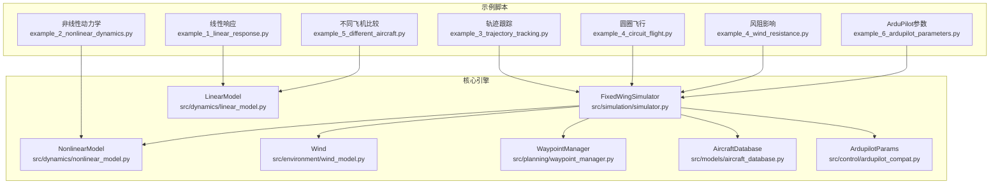
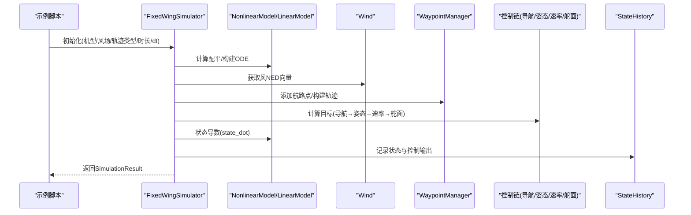
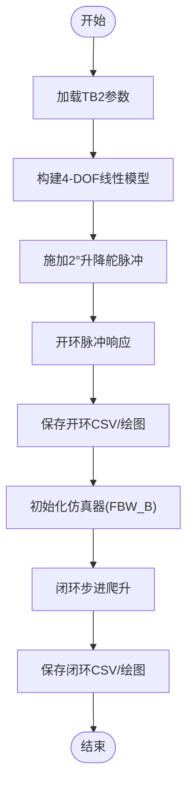
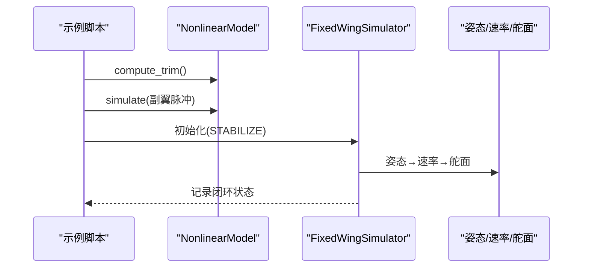
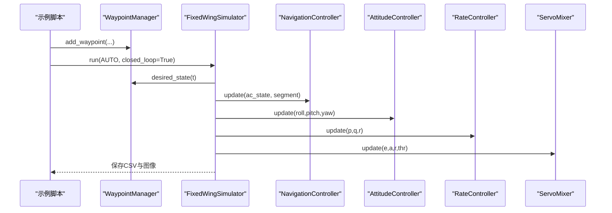
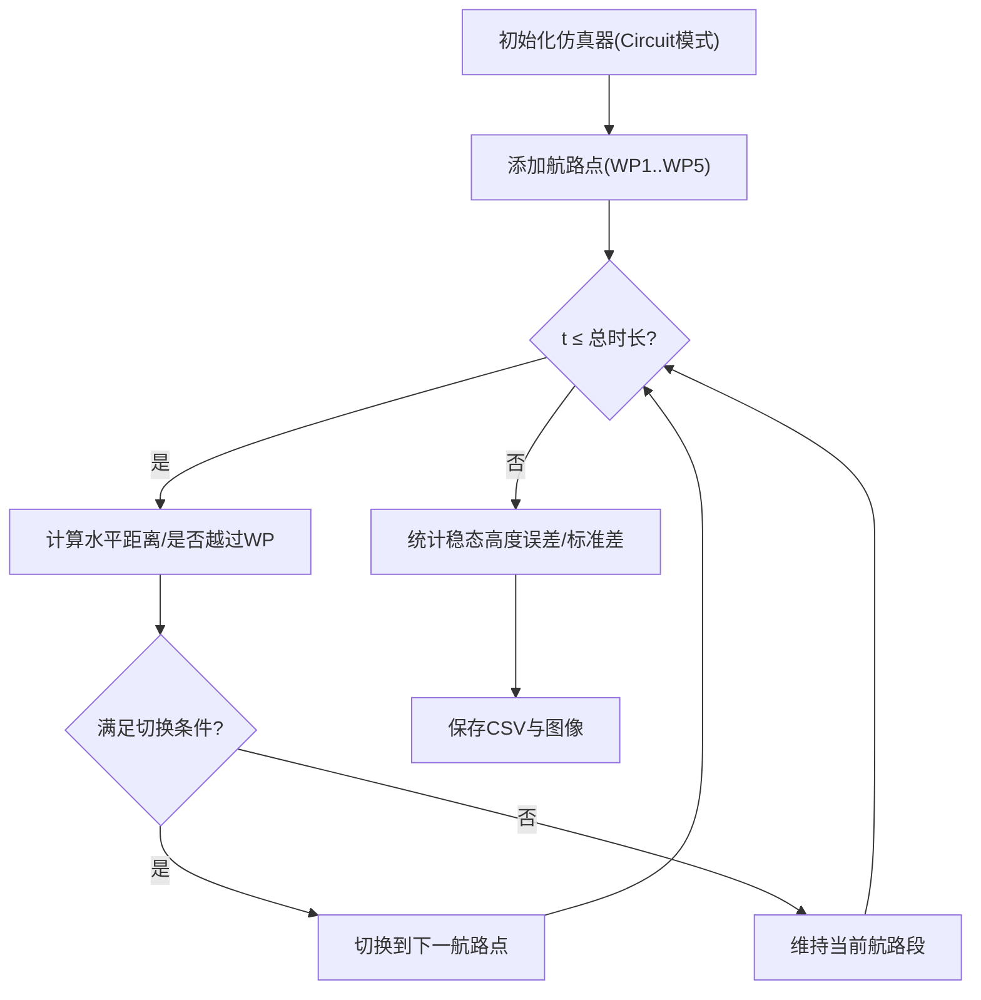
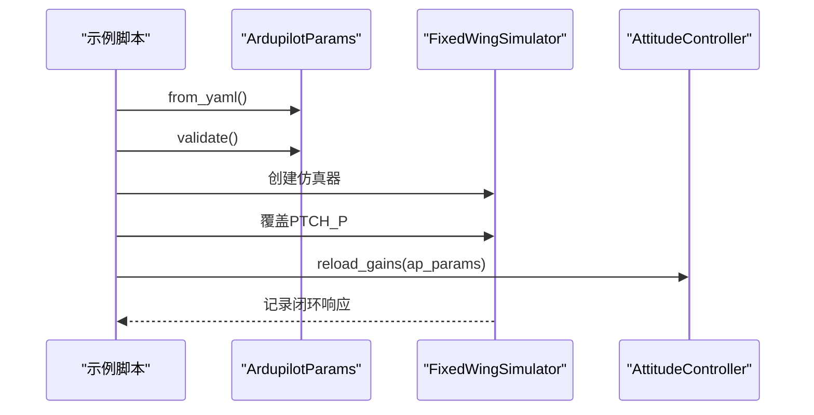
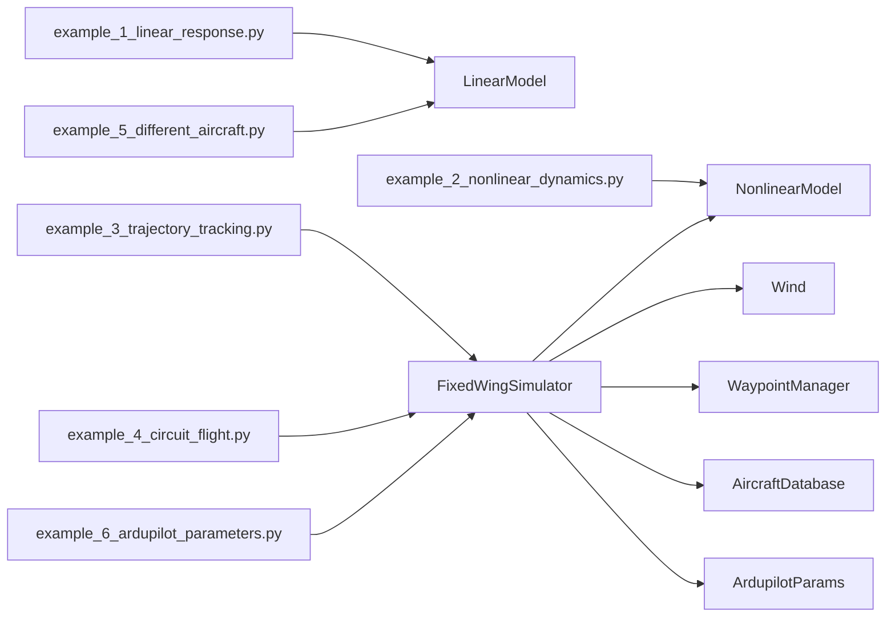

# 使用示例

<cite>
**本文引用的文件**
- [examples/example_1_linear_response.py](file://examples/example_1_linear_response.py)
- [examples/example_2_nonlinear_dynamics.py](file://examples/example_2_nonlinear_dynamics.py)
- [examples/example_3_trajectory_tracking.py](file://examples/example_3_trajectory_tracking.py)
- [examples/example_4_circuit_flight.py](file://examples/example_4_circuit_flight.py)
- [examples/example_4_wind_resistance.py](file://examples/example_4_wind_resistance.py)
- [examples/example_5_different_aircraft.py](file://examples/example_5_different_aircraft.py)
- [examples/example_6_ardupilot_parameters.py](file://examples/example_6_ardupilot_parameters.py)
- [src/simulation/simulator.py](file://src/simulation/simulator.py)
- [src/dynamics/linear_model.py](file://src/dynamics/linear_model.py)
- [src/dynamics/nonlinear_model.py](file://src/dynamics/nonlinear_model.py)
- [src/models/aircraft_database.py](file://src/models/aircraft_database.py)
- [src/planning/waypoint_manager.py](file://src/planning/waypoint_manager.py)
- [src/environment/wind_model.py](file://src/environment/wind_model.py)
- [src/control/ardupilot_compat.py](file://src/control/ardupilot_compat.py)
- [config/aircraft.yaml](file://config/aircraft.yaml)
- [config/control_params.yaml](file://config/control_params.yaml)
- [main.py](file://main.py)
</cite>

## 目录
1. [简介](#简介)
2. [项目结构](#项目结构)
3. [核心组件](#核心组件)
4. [架构总览](#架构总览)
5. [详细组件分析](#详细组件分析)
6. [依赖关系分析](#依赖关系分析)
7. [性能与数值特性](#性能与数值特性)
8. [故障排查指南](#故障排查指南)
9. [结论](#结论)
10. [附录](#附录)

## 简介
本文件面向FixedWingSimulator的使用者，提供从基础到进阶的完整使用示例说明。内容覆盖线性响应分析、非线性动力学仿真、轨迹跟踪、圆圈飞行、风阻影响、不同飞机比较以及ArduPilot参数配置等主题，并给出可扩展的实践建议。

## 项目结构
- 示例脚本位于examples目录，每个脚本独立演示一类仿真场景。
- 核心仿真引擎在src/simulation/simulator.py中，负责组织动力学、控制、规划、环境与可视化模块。
- 动力学模型分别在src/dynamics/linear_model.py（4-DOF线性）与src/dynamics/nonlinear_model.py（6-DOF非线性）。
- 飞机参数数据库在src/models/aircraft_database.py，支持7种机型。
- 航路点管理在src/planning/waypoint_manager.py，支持最小Snap/最小Jerk轨迹。
- 风场模型在src/environment/wind_model.py，支持静风、固定风、正弦风与随机正弦风。
- ArduPilot参数容器在src/control/ardupilot_compat.py，支持YAML加载/保存与参数校验。
- 配置文件在config目录，包括aircraft.yaml与control_params.yaml。
- 命令行入口在main.py，便于快速运行与对比分析。

图表来源
- [examples/example_1_linear_response.py](file://examples/example_1_linear_response.py#L1-L206)
- [examples/example_2_nonlinear_dynamics.py](file://examples/example_2_nonlinear_dynamics.py#L1-L215)
- [examples/example_3_trajectory_tracking.py](file://examples/example_3_trajectory_tracking.py#L1-L194)
- [examples/example_4_circuit_flight.py](file://examples/example_4_circuit_flight.py#L1-L275)
- [examples/example_4_wind_resistance.py](file://examples/example_4_wind_resistance.py#L1-L52)
- [examples/example_5_different_aircraft.py](file://examples/example_5_different_aircraft.py#L1-L65)
- [examples/example_6_ardupilot_parameters.py](file://examples/example_6_ardupilot_parameters.py#L1-L85)
- [src/simulation/simulator.py](file://src/simulation/simulator.py#L115-L642)
- [src/dynamics/linear_model.py](file://src/dynamics/linear_model.py#L107-L319)
- [src/dynamics/nonlinear_model.py](file://src/dynamics/nonlinear_model.py#L104-L386)
- [src/environment/wind_model.py](file://src/environment/wind_model.py#L18-L113)
- [src/planning/waypoint_manager.py](file://src/planning/waypoint_manager.py#L20-L208)
- [src/models/aircraft_database.py](file://src/models/aircraft_database.py#L29-L183)
- [src/control/ardupilot_compat.py](file://src/control/ardupilot_compat.py#L17-L130)

章节来源
- [examples/example_1_linear_response.py](file://examples/example_1_linear_response.py#L1-L206)
- [examples/example_2_nonlinear_dynamics.py](file://examples/example_2_nonlinear_dynamics.py#L1-L215)
- [examples/example_3_trajectory_tracking.py](file://examples/example_3_trajectory_tracking.py#L1-L194)
- [examples/example_4_circuit_flight.py](file://examples/example_4_circuit_flight.py#L1-L275)
- [examples/example_4_wind_resistance.py](file://examples/example_4_wind_resistance.py#L1-L52)
- [examples/example_5_different_aircraft.py](file://examples/example_5_different_aircraft.py#L1-L65)
- [examples/example_6_ardupilot_parameters.py](file://examples/example_6_ardupilot_parameters.py#L1-L85)
- [src/simulation/simulator.py](file://src/simulation/simulator.py#L115-L642)
- [src/dynamics/linear_model.py](file://src/dynamics/linear_model.py#L107-L319)
- [src/dynamics/nonlinear_model.py](file://src/dynamics/nonlinear_model.py#L104-L386)
- [src/models/aircraft_database.py](file://src/models/aircraft_database.py#L29-L183)
- [src/planning/waypoint_manager.py](file://src/planning/waypoint_manager.py#L20-L208)
- [src/environment/wind_model.py](file://src/environment/wind_model.py#L18-L113)
- [src/control/ardupilot_compat.py](file://src/control/ardupilot_compat.py#L17-L130)
- [config/aircraft.yaml](file://config/aircraft.yaml#L1-L13)
- [config/control_params.yaml](file://config/control_params.yaml#L1-L45)
- [main.py](file://main.py#L1-L145)

## 核心组件
- 固定翼仿真器（FixedWingSimulator）：封装控制链（导航、姿态、速率、舵面混合）、动力学（6-DOF非线性）、环境（风场）、规划（航路点/轨迹）与状态记录，提供run/closed-loop与run_linear_analysis/open-loop两种运行模式。
- 线性模型（LinearModel）：4-DOF纵向线性化状态空间，支持模态分析（短周期、滑翔/长周期）与脉冲响应仿真。
- 非线性模型（NonlinearModel）：6-DOF全阶非线性方程，支持计算配平与开环脉冲仿真。
- 飞机数据库（AircraftDatabase）：内置7型无人机参数，提供派生气动参数。
- 航路点管理（WaypointManager）：构建最小Snap/最小Jerk轨迹，提供当前段与期望状态查询。
- 风模型（Wind）：支持静风、固定风、正弦风与随机正弦风。
- ArduPilot参数（ArdupilotParams）：参数容器，支持YAML导入导出与范围校验。

章节来源
- [src/simulation/simulator.py](file://src/simulation/simulator.py#L115-L642)
- [src/dynamics/linear_model.py](file://src/dynamics/linear_model.py#L107-L319)
- [src/dynamics/nonlinear_model.py](file://src/dynamics/nonlinear_model.py#L104-L386)
- [src/models/aircraft_database.py](file://src/models/aircraft_database.py#L29-L183)
- [src/planning/waypoint_manager.py](file://src/planning/waypoint_manager.py#L20-L208)
- [src/environment/wind_model.py](file://src/environment/wind_model.py#L18-L113)
- [src/control/ardupilot_compat.py](file://src/control/ardupilot_compat.py#L17-L130)

## 架构总览
下图展示了示例脚本与核心引擎之间的调用关系与数据流。

图表来源
- [src/simulation/simulator.py](file://src/simulation/simulator.py#L239-L567)
- [src/dynamics/nonlinear_model.py](file://src/dynamics/nonlinear_model.py#L160-L255)
- [src/environment/wind_model.py](file://src/environment/wind_model.py#L76-L108)
- [src/planning/waypoint_manager.py](file://src/planning/waypoint_manager.py#L127-L167)

## 详细组件分析

### 线性响应分析示例（example_1_linear_response.py）
- 目的：通过4-DOF线性模型对升降舵阶跃输入进行开环脉冲响应分析，识别短周期与滑翔模态；并与闭环PID（FBW_B）步进响应对比，验证控制器抑制能力。
- 实现要点：
  - 使用LinearModel.run_analysis执行开环脉冲响应，得到模态信息与状态历史。
  - 使用FixedWingSimulator在FBW_B模式下执行闭环步进（爬升至目标高度），记录闭环状态。
  - 输出CSV与叠加对比图，便于对比开环与闭环在俯仰角与俯仰速率上的差异。
- 预期结果：
  - 开环响应呈现短周期与滑翔耦合振荡；闭环在目标高度附近快速收敛，超调较小。
  - 数据文件与图像自动保存至output目录。

图表来源
- [examples/example_1_linear_response.py](file://examples/example_1_linear_response.py#L88-L164)
- [src/dynamics/linear_model.py](file://src/dynamics/linear_model.py#L312-L319)
- [src/simulation/simulator.py](file://src/simulation/simulator.py#L130-L139)

章节来源
- [examples/example_1_linear_response.py](file://examples/example_1_linear_response.py#L1-L206)
- [src/dynamics/linear_model.py](file://src/dynamics/linear_model.py#L107-L319)
- [src/simulation/simulator.py](file://src/simulation/simulator.py#L130-L139)

扩展与修改建议
- 将脉冲幅度改为多组（如±1°、±3°）对比短周期模态幅频特性。
- 在闭环中引入扰动（如风或非线性气动）观察控制器抗扰性能。
- 导出模态参数用于控制器设计（如极点配置）。

### 非线性动力学仿真示例（example_2_nonlinear_dynamics.py）
- 目的：计算水平平飞配平，施加副翼阶跃脉冲，对比开环与闭环（STABILIZE）滚转响应，验证姿态控制系统的抑制能力。
- 实现要点：
  - NonlinearModel.compute_trim求解配平；simulate执行开环脉冲。
  - FixedWingSimulator在STABILIZE模式下保持高度，姿态回路自动抑制滚转。
  - 输出6-DOF状态历史与对比图。
- 预期结果：
  - 开环滚转角度显著且持续；闭环滚转被抑制，最终趋于零。
  - 高度保持稳定，姿态控制系统有效。

图表来源
- [examples/example_2_nonlinear_dynamics.py](file://examples/example_2_nonlinear_dynamics.py#L82-L160)
- [src/dynamics/nonlinear_model.py](file://src/dynamics/nonlinear_model.py#L132-L154)
- [src/simulation/simulator.py](file://src/simulation/simulator.py#L239-L567)

章节来源
- [examples/example_2_nonlinear_dynamics.py](file://examples/example_2_nonlinear_dynamics.py#L1-L215)
- [src/dynamics/nonlinear_model.py](file://src/dynamics/nonlinear_model.py#L104-L386)
- [src/simulation/simulator.py](file://src/simulation/simulator.py#L239-L567)

扩展与修改建议
- 引入侧风或阵风，评估滚转阻尼与偏航耦合。
- 对比不同机型在相同脉冲下的滚转响应差异。

### 轨迹跟踪示例（example_3_trajectory_tracking.py）
- 目的：TB2在AUTO模式下跟踪最小Snap方形轨迹，验证导航控制链（L1+TECS）在三维空间中的协同效果。
- 实现要点：
  - WaypointManager添加四个顶点构成闭合路径；仿真器在AUTO模式下按轨迹生成目标状态。
  - 记录位置、速度、姿态、角速率与控制面偏转，绘制多图并保存CSV。
- 预期结果：
  - 飞行轨迹贴合目标路径，高度与空速在允许范围内波动；控制面响应平滑。

图表来源
- [examples/example_3_trajectory_tracking.py](file://examples/example_3_trajectory_tracking.py#L72-L110)
- [src/planning/waypoint_manager.py](file://src/planning/waypoint_manager.py#L127-L167)
- [src/simulation/simulator.py](file://src/simulation/simulator.py#L478-L555)

章节来源
- [examples/example_3_trajectory_tracking.py](file://examples/example_3_trajectory_tracking.py#L1-L194)
- [src/planning/waypoint_manager.py](file://src/planning/waypoint_manager.py#L20-L208)
- [src/simulation/simulator.py](file://src/simulation/simulator.py#L478-L555)

扩展与修改建议
- 改为最小Jerk轨迹或自定义航路点序列，观察跟踪性能差异。
- 加入动态障碍物或风扰，评估避障/抗扰能力。

### 圆圈飞行示例（example_4_circuit_flight.py）
- 目的：TB2在AUTO模式下按矩形四边顺序飞越航路点，不使用多项式轨迹，而是基于L1导航的逐点航路点序列，验证稳态盘旋与高度保持能力。
- 实现要点：
  - 关闭轨迹模式，启用简单航路点序列；当水平距离小于阈值或越过航路点时切换下一个航路点。
  - 统计稳态阶段的高度误差、标准差与最终位置，评估循环稳定性。
- 预期结果：
  - 飞行轨迹形成规则矩形，高度在稳态窗口内波动较小，最终回到起点附近。

图表来源
- [examples/example_4_circuit_flight.py](file://examples/example_4_circuit_flight.py#L78-L122)
- [src/simulation/simulator.py](file://src/simulation/simulator.py#L431-L464)

章节来源
- [examples/example_4_circuit_flight.py](file://examples/example_4_circuit_flight.py#L1-L275)
- [src/simulation/simulator.py](file://src/simulation/simulator.py#L431-L464)

扩展与修改建议
- 调整切换距离与循环模式，观察对轨迹保真度与燃油消耗的影响。
- 引入不同高度层的矩形航线，评估爬升/下降过程的过渡质量。

### 风阻影响示例（example_4_wind_resistance.py）
- 目的：在FBW_B模式下施加随机正弦风扰，评估姿态控制对高度与空速的抑制能力。
- 实现要点：
  - Wind选择RANDOMSINE类型；仿真器在闭环下运行，记录高度与空速随时间的变化。
- 预期结果：
  - 在强扰动下，高度与空速仍能维持在目标附近，体现控制器的抗扰性能。

章节来源
- [examples/example_4_wind_resistance.py](file://examples/example_4_wind_resistance.py#L1-L52)
- [src/environment/wind_model.py](file://src/environment/wind_model.py#L76-L108)
- [src/simulation/simulator.py](file://src/simulation/simulator.py#L239-L567)

扩展与修改建议
- 对比不同风型（固定风、正弦风）对控制量与轨迹的影响。
- 调整TECS参数，观察对风扰抑制的敏感性。

### 不同飞机比较示例（example_5_different_aircraft.py）
- 目的：在同一升降舵脉冲下，对比7种机型的4-DOF线性响应，分析短周期模态阻尼比与稳定性。
- 实现要点：
  - 遍历AIRCRAFT_NAMES，对每架飞机执行线性分析，绘制俯仰速率与俯仰角响应曲线。
  - 打印短周期模态阻尼比，辅助比较不同飞机的动态特性。
- 预期结果：
  - 不同飞机在相同输入下的响应存在差异，短周期阻尼比反映其稳定性与可控性。

章节来源
- [examples/example_5_different_aircraft.py](file://examples/example_5_different_aircraft.py#L1-L65)
- [src/models/aircraft_database.py](file://src/models/aircraft_database.py#L135-L183)
- [src/dynamics/linear_model.py](file://src/dynamics/linear_model.py#L312-L319)

扩展与修改建议
- 增加滚转/偏航模态对比，或引入不同配平条件（如不同空速/高度）。
- 将结果导出为表格，用于报告或参数设计参考。

### ArduPilot参数配置示例（example_6_ardupilot_parameters.py）
- 目的：加载ArduPilot风格控制参数，热重载关键增益（如PTCH_P），对比不同增益下的爬升高度与俯仰角响应。
- 实现要点：
  - ArdupilotParams.from_yaml加载控制参数；validate进行范围检查。
  - 通过sim.ap_params.PTCH_P覆盖默认值，并调用att_ctrl.reload_gains生效。
  - 记录并绘制不同增益下的高度与俯仰角响应。
- 预期结果：
  - 提高俯仰外环比例增益可改善爬升响应，但需避免过大导致过冲或振荡。

图表来源
- [examples/example_6_ardupilot_parameters.py](file://examples/example_6_ardupilot_parameters.py#L23-L70)
- [src/control/ardupilot_compat.py](file://src/control/ardupilot_compat.py#L82-L129)
- [src/simulation/simulator.py](file://src/simulation/simulator.py#L501-L528)

章节来源
- [examples/example_6_ardupilot_parameters.py](file://examples/example_6_ardupilot_parameters.py#L1-L85)
- [src/control/ardupilot_compat.py](file://src/control/ardupilot_compat.py#L17-L130)
- [src/simulation/simulator.py](file://src/simulation/simulator.py#L501-L528)

扩展与修改建议
- 对ROLL_P、YAW_RATE_P等轴向增益进行单变量扫描，建立增益-性能映射。
- 结合实际飞控硬件，将参数导出为ArduPilot兼容格式进行实飞验证。

## 依赖关系分析
- 示例脚本依赖FixedWingSimulator与相应模型/管理器；部分示例直接使用LinearModel/NonlinearModel。
- FixedWingSimulator内部依赖：
  - 动力学：NonlinearModel（6-DOF）与LinearModel（4-DOF分析）
  - 环境：Wind（风场）
  - 规划：WaypointManager（航路点/轨迹）
  - 控制：NavigationController、AttitudeController、RateController、ServoMixer
  - 参数：ArdupilotParams（ArduPilot风格参数）
  - 数据库：AircraftDatabase（飞机参数）

图表来源
- [examples/example_1_linear_response.py](file://examples/example_1_linear_response.py#L34-L36)
- [examples/example_2_nonlinear_dynamics.py](file://examples/example_2_nonlinear_dynamics.py#L34-L36)
- [examples/example_3_trajectory_tracking.py](file://examples/example_3_trajectory_tracking.py#L35-L35)
- [examples/example_4_circuit_flight.py](file://examples/example_4_circuit_flight.py#L39-L39)
- [examples/example_5_different_aircraft.py](file://examples/example_5_different_aircraft.py#L18-L19)
- [examples/example_6_ardupilot_parameters.py](file://examples/example_6_ardupilot_parameters.py#L20-L21)
- [src/simulation/simulator.py](file://src/simulation/simulator.py#L33-L51)

章节来源
- [src/simulation/simulator.py](file://src/simulation/simulator.py#L33-L51)
- [src/dynamics/linear_model.py](file://src/dynamics/linear_model.py#L18-L20)
- [src/dynamics/nonlinear_model.py](file://src/dynamics/nonlinear_model.py#L23-L28)
- [src/models/aircraft_database.py](file://src/models/aircraft_database.py#L12-L20)
- [src/planning/waypoint_manager.py](file://src/planning/waypoint_manager.py#L15-L17)
- [src/environment/wind_model.py](file://src/environment/wind_model.py#L14-L15)
- [src/control/ardupilot_compat.py](file://src/control/ardupilot_compat.py#L13-L14)

## 性能与数值特性
- 时间步长与积分器：仿真器采用自适应积分器（dopri5），示例脚本普遍使用0.01秒步长，兼顾精度与效率。
- 模态分析：线性模型基于特征值分解识别短周期与滑翔模态，阻尼比用于评估稳定性。
- 风场建模：RANDOMSINE提供类似湍流的随机波动，有助于评估控制器鲁棒性。
- 参数范围校验：ArdupilotParams.validate对关键参数进行范围检查，防止异常配置导致不稳定。

章节来源
- [src/simulation/simulator.py](file://src/simulation/simulator.py#L339-L339)
- [src/dynamics/linear_model.py](file://src/dynamics/linear_model.py#L206-L252)
- [src/environment/wind_model.py](file://src/environment/wind_model.py#L58-L106)
- [src/control/ardupilot_compat.py](file://src/control/ardupilot_compat.py#L104-L129)

## 故障排查指南
- 风类型错误：Wind构造函数对风类型进行校验，若传入未知类型会抛出异常。请确保使用支持的类型（NONE/FIXED/SINE/RANDOMSINE）。
- 机型名称错误：FixedWingSimulator初始化时对机型名进行校验，不在数据库中将报错。请核对config/aircraft.yaml或示例脚本中的机型名。
- 航路点不足：WaypointManager在构建轨迹前要求至少两个航路点，否则抛出异常。请先添加航路点再运行AUTO模式。
- 参数越界：ArdupilotParams.validate对关键参数进行范围检查，越界会打印警告。请根据提示调整参数。
- 积分失败：仿真器在积分过程中捕获RuntimeError并停止推进，同时输出错误信息。请检查初始条件、控制命令与风扰是否合理。

章节来源
- [src/environment/wind_model.py](file://src/environment/wind_model.py#L39-L41)
- [src/simulation/simulator.py](file://src/simulation/simulator.py#L140-L141)
- [src/planning/waypoint_manager.py](file://src/planning/waypoint_manager.py#L139-L140)
- [src/control/ardupilot_compat.py](file://src/control/ardupilot_compat.py#L124-L129)
- [src/simulation/simulator.py](file://src/simulation/simulator.py#L560-L562)

## 结论
本使用示例文档系统梳理了FixedWingSimulator的典型应用场景：从线性模态分析到非线性轨迹跟踪，再到风扰与参数敏感性研究。通过这些示例，用户可以快速掌握仿真器的使用方法、理解各模块的职责与交互，并在此基础上开展更深入的分析与扩展。

## 附录
- 命令行入口：main.py支持多种运行模式与参数，便于批量对比与自动化测试。
- 配置文件：
  - aircraft.yaml：选择仿真机型与可选参数覆盖。
  - control_params.yaml：ArduPilot风格控制参数，包含导航、姿态、速率与TECS等子节。

章节来源
- [main.py](file://main.py#L32-L95)
- [config/aircraft.yaml](file://config/aircraft.yaml#L1-L13)
- [config/control_params.yaml](file://config/control_params.yaml#L1-L45)