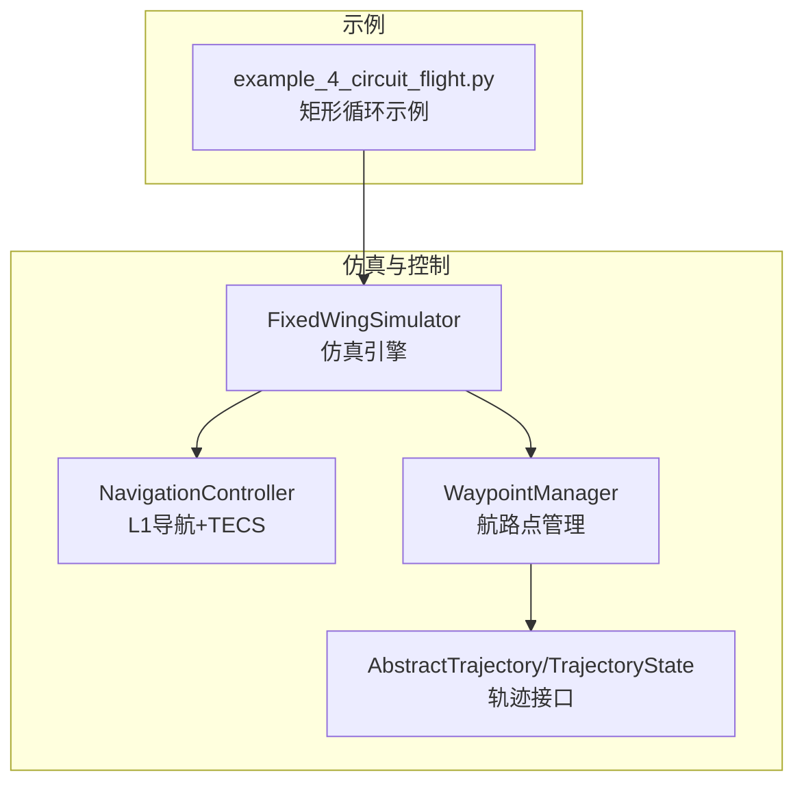
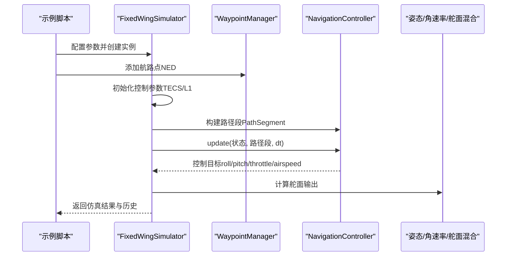
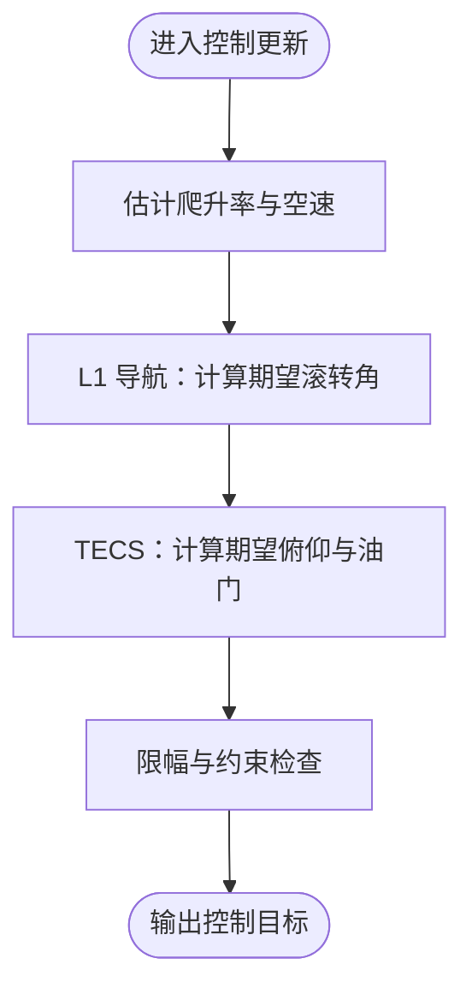
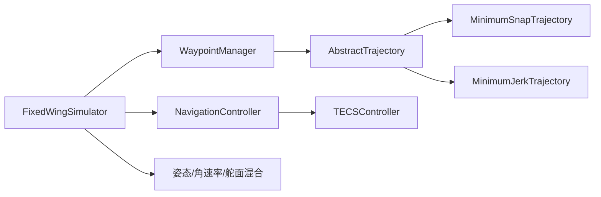

# 圆圈飞行模式

<cite>
**本文引用的文件**
- [examples/example_4_circuit_flight.py](file://examples/example_4_circuit_flight.py)
- [src/simulation/simulator.py](file://src/simulation/simulator.py)
- [src/control/navigation_controller.py](file://src/control/navigation_controller.py)
- [src/control/tecs_controller.py](file://src/control/tecs_controller.py)
- [src/planning/waypoint_manager.py](file://src/planning/waypoint_manager.py)
- [src/planning/trajectory_base.py](file://src/planning/trajectory_base.py)
- [src/planning/minimum_snap.py](file://src/planning/minimum_snap.py)
- [src/planning/minimum_jerk.py](file://src/planning/minimum_jerk.py)
- [config/control_params.yaml](file://config/control_params.yaml)
- [config/trajectory.yaml](file://config/trajectory.yaml)
</cite>

## 目录
1. [引言](#引言)
2. [项目结构](#项目结构)
3. [核心组件](#核心组件)
4. [架构总览](#架构总览)
5. [详细组件分析](#详细组件分析)
6. [依赖关系分析](#依赖关系分析)
7. [性能考量](#性能考量)
8. [故障排查指南](#故障排查指南)
9. [结论](#结论)
10. [附录](#附录)

## 引言
本文件围绕固定翼飞行模拟器中的“圆圈飞行”展开，结合现有示例与控制架构，系统阐述稳定盘旋的控制原理、几何参数设置、控制策略、质量评估标准、参数调整方法、常见问题与解决方案，以及扩展应用（编队与战术机动）的实践建议。需要特别说明的是：当前仓库未提供专门的“圆形轨迹生成器”，但可通过“矩形航线示例”（四边循环）间接体现圆圈飞行的控制闭环与导航策略，从而为设计稳定的圆圈飞行提供工程依据。

## 项目结构
该模拟器采用模块化分层设计，核心由“建模—环境—控制—规划—仿真—可视化”组成。与圆圈飞行密切相关的模块包括：
- 控制层：导航控制器（L1 航路点跟踪）+ TECS（总能量控制）
- 规划层：航路点管理与轨迹生成（最小急动率/最小急 snap）
- 仿真层：集成求解器与状态历史记录
- 示例层：矩形四边循环示例展示闭环路径跟踪与参数设定

**图表来源**
- [src/simulation/simulator.py](file://src/simulation/simulator.py#L115-L642)
- [src/control/navigation_controller.py](file://src/control/navigation_controller.py#L45-L293)
- [src/planning/waypoint_manager.py](file://src/planning/waypoint_manager.py#L20-L208)
- [src/planning/trajectory_base.py](file://src/planning/trajectory_base.py#L16-L47)
- [examples/example_4_circuit_flight.py](file://examples/example_4_circuit_flight.py#L1-L275)

**章节来源**
- [src/simulation/simulator.py](file://src/simulation/simulator.py#L115-L642)
- [src/control/navigation_controller.py](file://src/control/navigation_controller.py#L45-L293)
- [src/planning/waypoint_manager.py](file://src/planning/waypoint_manager.py#L20-L208)
- [src/planning/trajectory_base.py](file://src/planning/trajectory_base.py#L16-L47)
- [examples/example_4_circuit_flight.py](file://examples/example_4_circuit_flight.py#L1-L275)

## 核心组件
- 导航控制器（L1 + TECS）
  - L1 航路点跟踪：基于纵向空速与地面速度方向夹角计算横向加速度，进而转换为坡度角指令，实现沿直线航段的稳定跟踪。
  - TECS：统一控制总比能量（势能+动能），通过油门与俯仰分配比实现高度与空速的协同控制。
- 航路点管理与轨迹
  - WaypointManager 提供航路点的增删、加载/保存、活动航段查询与轨迹对象构建。
  - TrajectoryBase 定义统一接口；MinimumSnap/MimimumJerk 提供最小急动率/最小急跃的分段多项式轨迹。
- 仿真引擎
  - FixedWingSimulator 组织各模块，执行闭环控制链（姿态/角速率/舵面混合），并记录状态历史。

**章节来源**
- [src/control/navigation_controller.py](file://src/control/navigation_controller.py#L45-L293)
- [src/control/tecs_controller.py](file://src/control/tecs_controller.py#L50-L647)
- [src/planning/waypoint_manager.py](file://src/planning/waypoint_manager.py#L20-L208)
- [src/planning/trajectory_base.py](file://src/planning/trajectory_base.py#L16-L47)
- [src/planning/minimum_snap.py](file://src/planning/minimum_snap.py#L167-L253)
- [src/planning/minimum_jerk.py](file://src/planning/minimum_jerk.py#L17-L70)
- [src/simulation/simulator.py](file://src/simulation/simulator.py#L115-L642)

## 架构总览
下图展示了从示例到仿真、控制与规划的端到端流程，以及关键参数来源。

**图表来源**
- [examples/example_4_circuit_flight.py](file://examples/example_4_circuit_flight.py#L81-L119)
- [src/simulation/simulator.py](file://src/simulation/simulator.py#L190-L567)
- [src/control/navigation_controller.py](file://src/control/navigation_controller.py#L134-L202)
- [src/planning/waypoint_manager.py](file://src/planning/waypoint_manager.py#L54-L107)

## 详细组件分析

### 圆圈飞行的几何参数设置
- 半径与速度
  - 在矩形循环示例中，边长与速度由配置决定，可据此推导转弯半径与速度的关系。例如，示例中使用了较大的边长与较长的仿真时长，以观察稳态下的轨迹与控制行为。
  - 转弯半径与速度的关系可参考 L1 导航参数与最大坡度限制，实际半径由空速与坡度角共同决定。
- 高度
  - 示例中固定高度用于验证高度保持与路径跟踪的协同控制。TECS 的高度需求经低通滤波后平滑过渡，避免频繁抖动。
- 参数来源与默认值
  - 控制参数来自配置文件，其中包含 L1 周期、阻尼、TECS 的爬升/下沉速率、时间常数、油门/俯仰限幅等。

**章节来源**
- [examples/example_4_circuit_flight.py](file://examples/example_4_circuit_flight.py#L51-L56)
- [config/control_params.yaml](file://config/control_params.yaml#L5-L44)
- [src/control/navigation_controller.py](file://src/control/navigation_controller.py#L57-L116)
- [src/control/tecs_controller.py](file://src/control/tecs_controller.py#L80-L127)

### 圆圈飞行的控制策略
- 坡度控制（L1 导航）
  - L1 导航根据纵向空速与地面速度方向夹角计算横向加速度，再换算为坡度角指令，确保沿航段稳定跟踪。
  - 该策略在存在侧风时，利用体轴速度投影得到更准确的地面航迹角，提升转弯预瞄与抗扰能力。
- 推力/俯仰调节（TECS）
  - TECS 将高度与空速控制统一到总比能量框架，通过油门与俯仰分配实现协同控制。
  - TECS 包含欠速保护、不可达下沉检测、坡度油门补偿等机制，保证稳定与安全。
- 闭环控制链
  - 导航控制器输出 roll/pitch/throttle，经姿态/角速率控制器与舵面混合器，最终作用于动力学模型。

**图表来源**
- [src/control/navigation_controller.py](file://src/control/navigation_controller.py#L134-L202)
- [src/control/tecs_controller.py](file://src/control/tecs_controller.py#L247-L316)

**章节来源**
- [src/control/navigation_controller.py](file://src/control/navigation_controller.py#L206-L293)
- [src/control/tecs_controller.py](file://src/control/tecs_controller.py#L465-L624)
- [src/simulation/simulator.py](file://src/simulation/simulator.py#L499-L541)

### 圆圈飞行质量评估标准
- 轨迹精度
  - 通过地面轨迹对比航段参考，评估横向偏差与航段长度误差。
- 稳定性
  - 高度与空速的稳态方差、峰值误差、稳态窗口内的统计量可用于衡量。
- 平滑性
  - 俯仰角、滚转角、偏航角速率与控制输入的变化率可作为平滑性指标。
- 示例中的评估思路
  - 示例脚本对高度进行稳态窗口统计，展示稳态方差与峰值误差，可类比用于圆圈飞行的稳态评估。

**章节来源**
- [examples/example_4_circuit_flight.py](file://examples/example_4_circuit_flight.py#L249-L272)

### 如何根据飞行器性能调整圆圈参数
- 空速范围与爬升/下沉能力
  - TECS 的空速上下限、爬升/下沉速率与时间常数应与机型的推进与气动特性匹配。
- L1 参数
  - L1 周期与阻尼影响转弯预瞄与超调；最大坡度限制与滚转/俯仰控制器参数需协调。
- 油门/俯仰限幅
  - 避免在转弯时出现油门饱和或俯仰饱和，必要时降低转弯速度或增大爬升/下沉速率上限。

**章节来源**
- [config/control_params.yaml](file://config/control_params.yaml#L30-L44)
- [src/control/navigation_controller.py](file://src/control/navigation_controller.py#L57-L82)
- [src/control/tecs_controller.py](file://src/control/tecs_controller.py#L80-L127)

### 圆圈飞行中的常见问题与解决方法
- 侧风影响
  - L1 导航使用体轴速度投影得到地面航迹角，优于仅用航向角，有助于在侧风条件下维持预期轨迹。
- 控制系统饱和
  - TECS 的欠速保护与坡度油门补偿可缓解低速与大坡度下的油门饱和；必要时降低转弯坡度或速度。
- 高度/空速振荡
  - 增大 TECS 时间常数与阻尼，降低积分增益，有助于抑制振荡。
- 航段切换与超调
  - 在矩形循环示例中，航段切换距离与冷却时间可减少频繁切换带来的超调；圆圈飞行可借鉴此策略，适当提前切入下一航段或采用更平滑的航路点序列。

**章节来源**
- [src/control/navigation_controller.py](file://src/control/navigation_controller.py#L273-L282)
- [src/control/tecs_controller.py](file://src/control/tecs_controller.py#L432-L444)
- [examples/example_4_circuit_flight.py](file://examples/example_4_circuit_flight.py#L449-L464)

### 圆圈飞行的扩展应用
- 编队飞行
  - 可在 WaypointManager 中定义多机航路点，结合相对位置保持策略，实现协同转弯与队形维持。
- 战术机动
  - 通过 TrajectoryBase 接口与 MinimumSnap/MimimumJerk 生成快速机动轨迹，结合 TECS 的快速响应能力，实现快速转弯与高度变化。

**章节来源**
- [src/planning/waypoint_manager.py](file://src/planning/waypoint_manager.py#L127-L167)
- [src/planning/minimum_snap.py](file://src/planning/minimum_snap.py#L167-L253)
- [src/planning/minimum_jerk.py](file://src/planning/minimum_jerk.py#L17-L70)

## 依赖关系分析
- 控制层依赖
  - NavigationController 依赖 TECSController 与数学工具（角度包裹、饱和）。
  - TECSController 内部维护多种积分器与滤波器状态，输出油门与俯仰指令。
- 规划层依赖
  - WaypointManager 依赖 TrajectoryBase 与具体轨迹实现（MinimumSnap/MimimumJerk）。
- 仿真层依赖
  - FixedWingSimulator 组装控制链（姿态/角速率/舵面混合），并驱动动力学求解器。

**图表来源**
- [src/planning/waypoint_manager.py](file://src/planning/waypoint_manager.py#L127-L167)
- [src/planning/minimum_snap.py](file://src/planning/minimum_snap.py#L167-L253)
- [src/planning/minimum_jerk.py](file://src/planning/minimum_jerk.py#L17-L70)
- [src/simulation/simulator.py](file://src/simulation/simulator.py#L190-L216)

**章节来源**
- [src/planning/waypoint_manager.py](file://src/planning/waypoint_manager.py#L20-L208)
- [src/planning/trajectory_base.py](file://src/planning/trajectory_base.py#L16-L47)
- [src/simulation/simulator.py](file://src/simulation/simulator.py#L190-L216)

## 性能考量
- 控制参数与稳态性能
  - TECS 的时间常数与阻尼直接影响稳态误差与超调；L1 周期与阻尼影响转弯预瞄与收敛速度。
- 数值积分与稳定性
  - 固定步长与求解器的选择会影响轨迹跟踪与控制响应；示例中使用固定步长，适合演示与对比。
- 计算复杂度
  - 轨迹生成涉及矩阵求解，但在仿真运行时按需构建；航路点数量与段数影响计算开销。

[本节为通用指导，无需特定文件引用]

## 故障排查指南
- 高度/空速持续波动
  - 检查 TECS 的时间常数、阻尼与积分增益；确认空速上下限与爬升/下沉速率设置合理。
- 转弯坡度过大或油门饱和
  - 降低转弯速度或增大爬升/下沉速率上限；启用坡度油门补偿并检查限幅。
- 航段切换频繁导致超调
  - 增大航段切换距离阈值与冷却时间；在圆圈场景中可采用更平滑的航路点序列。
- 侧风下轨迹偏离
  - 确认 L1 使用体轴速度投影计算地面航迹角；适当提高 L1 周期以增强预瞄。

**章节来源**
- [src/control/tecs_controller.py](file://src/control/tecs_controller.py#L432-L444)
- [src/control/navigation_controller.py](file://src/control/navigation_controller.py#L273-L282)
- [examples/example_4_circuit_flight.py](file://examples/example_4_circuit_flight.py#L449-L464)

## 结论
圆圈飞行在本模拟器中可通过“矩形循环示例”的控制链路与参数设置进行工程化落地。其核心在于：利用 L1 导航实现稳定的航段跟踪与坡度控制，结合 TECS 的高度/空速协同控制与油门/俯仰分配，辅以航段切换策略与参数整定，即可获得稳定、平滑且可重复的质量表现。对于更高阶的圆弧轨迹，可基于 TrajectoryBase 接口扩展轨迹生成器，以满足更复杂的机动需求。

[本节为总结性内容，无需特定文件引用]

## 附录
- 示例脚本参数说明
  - 飞机名称、高度、边长、仿真时长、航段切换距离、是否循环等参数均可在示例脚本中修改，以适配不同半径与速度的圆圈飞行。
- 配置文件要点
  - 控制参数文件提供了 TECS 与 L1 的关键参数，默认值已针对典型无人机优化，可根据机型特性进行微调。

**章节来源**
- [examples/example_4_circuit_flight.py](file://examples/example_4_circuit_flight.py#L51-L56)
- [config/control_params.yaml](file://config/control_params.yaml#L5-L44)