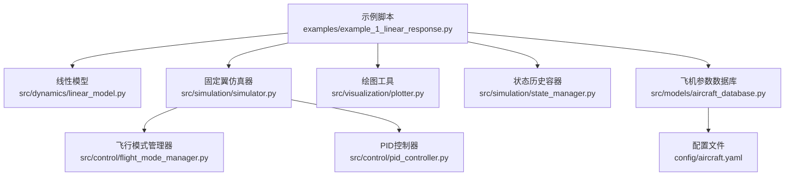
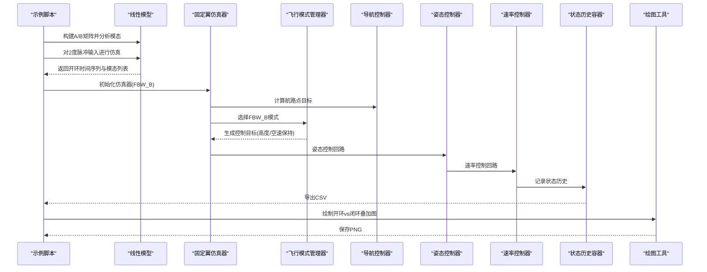
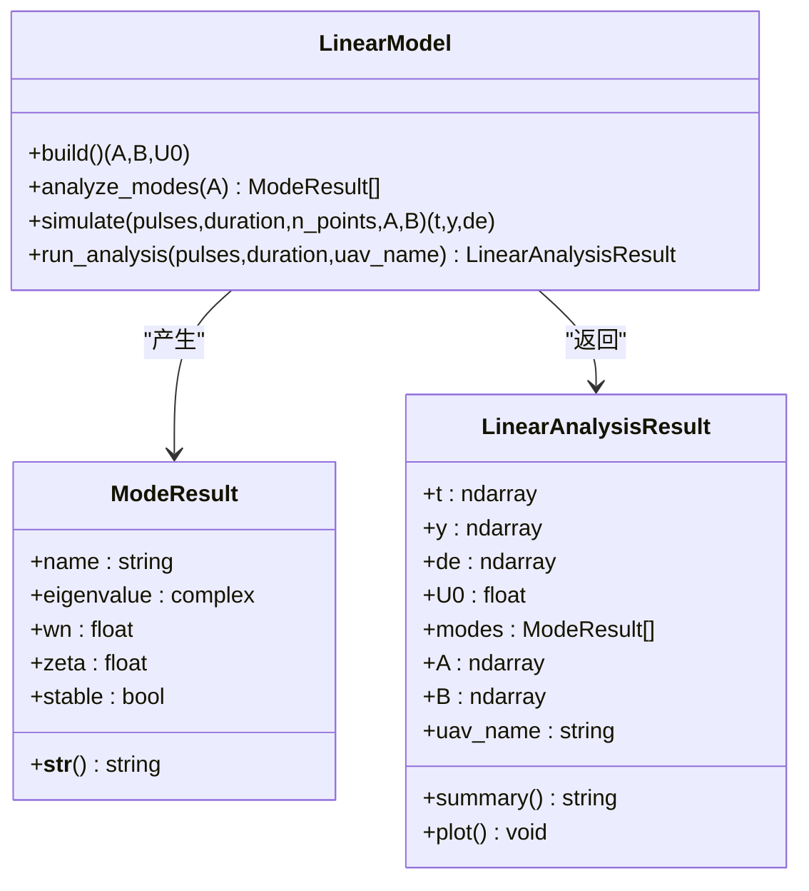
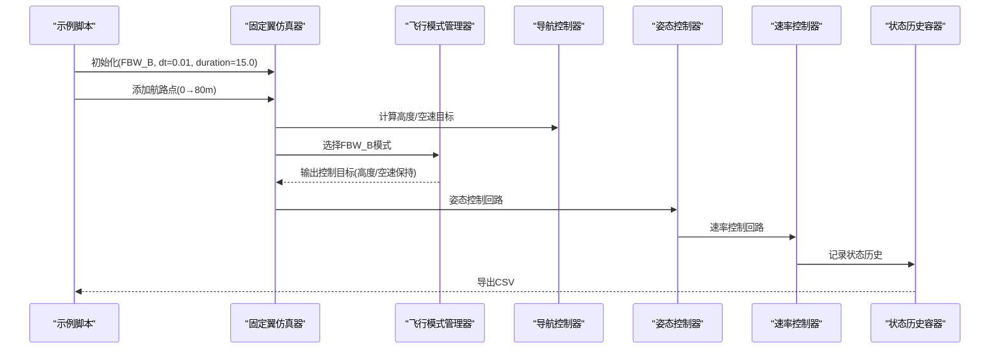
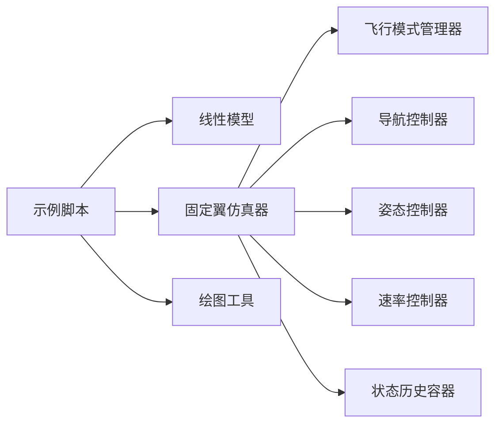

# 线性响应分析

<cite>
**本文引用的文件**
- [example_1_linear_response.py](file://examples/example_1_linear_response.py)
- [linear_model.py](file://src/dynamics/linear_model.py)
- [simulator.py](file://src/simulation/simulator.py)
- [flight_mode_manager.py](file://src/control/flight_mode_manager.py)
- [pid_controller.py](file://src/control/pid_controller.py)
- [plotter.py](file://src/visualization/plotter.py)
- [state_manager.py](file://src/simulation/state_manager.py)
- [aircraft_database.py](file://src/models/aircraft_database.py)
- [aircraft.yaml](file://config/aircraft.yaml)
</cite>

## 目录
1. [简介](#简介)
2. [项目结构](#项目结构)
3. [核心组件](#核心组件)
4. [架构总览](#架构总览)
5. [详细组件分析](#详细组件分析)
6. [依赖关系分析](#依赖关系分析)
7. [性能考量](#性能考量)
8. [故障排查指南](#故障排查指南)
9. [结论](#结论)
10. [附录](#附录)

## 简介
本文件面向“线性响应分析”示例，系统阐述4自由度（4-DOF）线性模型在纵向平面内的脉冲响应分析与开环模态分析方法，并结合FBW_B模式下的闭环PID步进响应测试，完成开环与闭环的对比分析。文档涵盖：
- 开环模态分析（短周期模态与长周期模态）的原理与实现
- FBW_B模式下的闭环PID步进响应测试流程
- 模态分析结果的解读方法（稳定性、阻尼比、自然频率）
- 从仿真结果中提取关键性能指标（最大俯仰角、稳态误差等）
- CSV数据导出与PNG图像保存的完整流程

## 项目结构
该示例位于examples目录下，调用src模块中的动力学、控制、仿真与可视化组件，形成从线性建模到闭环仿真的完整链路。

图表来源
- [example_1_linear_response.py](file://examples/example_1_linear_response.py#L30-L36)
- [linear_model.py](file://src/dynamics/linear_model.py#L107-L319)
- [simulator.py](file://src/simulation/simulator.py#L115-L642)
- [flight_mode_manager.py](file://src/control/flight_mode_manager.py#L115-L298)
- [pid_controller.py](file://src/control/pid_controller.py#L17-L117)
- [plotter.py](file://src/visualization/plotter.py#L19-L244)
- [state_manager.py](file://src/simulation/state_manager.py#L95-L193)
- [aircraft_database.py](file://src/models/aircraft_database.py#L143-L166)
- [aircraft.yaml](file://config/aircraft.yaml#L1-L13)

章节来源
- [example_1_linear_response.py](file://examples/example_1_linear_response.py#L30-L36)
- [aircraft_database.py](file://src/models/aircraft_database.py#L143-L166)
- [aircraft.yaml](file://config/aircraft.yaml#L1-L13)

## 核心组件
- 线性模型（4-DOF纵向）：构建状态空间矩阵A、B，进行模态分析与脉冲响应仿真
- 固定翼仿真器：封装非线性6-DOF动力学、环境、控制层与轨迹规划，支持闭环运行
- 飞行模式管理器：定义FBW_A、FBW_B等模式，生成控制目标
- PID控制器：提供带抗饱和的离散PID算法
- 可视化与数据导出：Matplotlib静态图与CSV导出
- 状态历史容器：高效记录仿真时序数据

章节来源
- [linear_model.py](file://src/dynamics/linear_model.py#L107-L319)
- [simulator.py](file://src/simulation/simulator.py#L115-L642)
- [flight_mode_manager.py](file://src/control/flight_mode_manager.py#L115-L298)
- [pid_controller.py](file://src/control/pid_controller.py#L17-L117)
- [plotter.py](file://src/visualization/plotter.py#L161-L244)
- [state_manager.py](file://src/simulation/state_manager.py#L95-L193)

## 架构总览
示例执行两条主线：
- 开环分析：使用线性模型对单次2度阶跃输入进行脉冲响应仿真，输出时间序列与模态结果
- 闭环分析：以FBW_B模式运行仿真器，通过导航控制器与多级控制回路生成闭环响应，记录状态历史

图表来源
- [example_1_linear_response.py](file://examples/example_1_linear_response.py#L86-L206)
- [linear_model.py](file://src/dynamics/linear_model.py#L312-L319)
- [simulator.py](file://src/simulation/simulator.py#L239-L567)
- [flight_mode_manager.py](file://src/control/flight_mode_manager.py#L256-L269)
- [state_manager.py](file://src/simulation/state_manager.py#L179-L193)
- [plotter.py](file://src/visualization/plotter.py#L161-L244)

## 详细组件分析

### 4-DOF线性模型与模态分析
- 状态向量与输入
  - 状态：[前进速度扰动u_p、攻角alpha、俯仰角速度q、俯仰角theta]
  - 输入：[节流delta_T、升降舵delta_e]
- 状态空间构建
  - 通过几何与气动参数计算非维质量/惯量系数，推导A、B矩阵
  - A矩阵决定系统动态；B矩阵描述控制输入影响
- 模态分析
  - 对A进行特征值分解，按幅值排序识别短周期与长周期模态
  - 复数特征值配对，实部决定稳定性，幅值决定自然频率，虚部决定阻尼比
- 脉冲响应仿真
  - 定义脉冲输入函数，求解线性常微分方程组，得到状态随时间演化

图表来源
- [linear_model.py](file://src/dynamics/linear_model.py#L107-L319)

章节来源
- [linear_model.py](file://src/dynamics/linear_model.py#L129-L200)
- [linear_model.py](file://src/dynamics/linear_model.py#L206-L252)
- [linear_model.py](file://src/dynamics/linear_model.py#L258-L306)
- [linear_model.py](file://src/dynamics/linear_model.py#L312-L319)

### 开环模态分析（短周期与长周期）
- 短周期模态
  - 特征值幅值较大，主导快速振荡（通常由攻角与俯仰角耦合引起）
  - 阻尼比通常较小，反映快速但易振荡的动态响应
- 长周期模态（Phugoid）
  - 特征值幅值较小，主导缓慢的长周期运动（能量交换导致的振荡）
  - 阻尼比通常较大，表现为缓慢衰减或近似无阻尼振荡
- 稳定性判断
  - 实部为负表示稳定；越负代表衰减越快
  - 实部为正表示不稳定；接近零可能处于临界稳定附近

章节来源
- [linear_model.py](file://src/dynamics/linear_model.py#L30-L54)
- [linear_model.py](file://src/dynamics/linear_model.py#L206-L252)

### FBW_B模式下的闭环PID步进响应测试
- FBW_B模式要点
  - 飞行模式管理器在FBW_B下输出“高度保持+空速保持”的控制目标
  - 若存在导航目标，则优先采用导航提供的俯仰指令与油门指令
- 闭环控制链路
  - 导航控制器给出期望高度与空速目标
  - 姿态控制器将期望角速度转换为控制面指令
  - 速率控制器将期望角加速度转换为控制面指令
  - 伺服混合器将控制指令转换为实际控制面偏转
- 步进响应触发
  - 示例通过添加航路点（从初始高度爬升至目标高度）触发高度PID步进

图表来源
- [example_1_linear_response.py](file://examples/example_1_linear_response.py#L132-L144)
- [simulator.py](file://src/simulation/simulator.py#L239-L567)
- [flight_mode_manager.py](file://src/control/flight_mode_manager.py#L256-L269)
- [state_manager.py](file://src/simulation/state_manager.py#L179-L193)

章节来源
- [flight_mode_manager.py](file://src/control/flight_mode_manager.py#L256-L269)
- [simulator.py](file://src/simulation/simulator.py#L499-L521)
- [example_1_linear_response.py](file://examples/example_1_linear_response.py#L132-L144)

### 开环 vs 闭环对比分析
- 对比维度
  - 时间尺度：开环脉冲响应通常更短；闭环步进响应包含PID调节过程
  - 响应形态：开环呈现自然模态振荡；闭环受控后振荡被抑制或收敛
  - 稳态：开环可能发散或缓慢衰减；闭环在目标高度/空速处趋于稳态
- 数据提取
  - 开环：从线性分析结果中提取俯仰角与俯仰角速度的时间序列
  - 闭环：从状态历史中提取俯仰角、俯仰角速度、高度与控制面偏转

章节来源
- [example_1_linear_response.py](file://examples/example_1_linear_response.py#L107-L151)
- [plotter.py](file://src/visualization/plotter.py#L161-L244)

### 模态分析结果的解读方法
- 自然频率（ωn）与阻尼比（ζ）
  - ωn越大，响应越快；ζ越小，振荡越强
- 稳定性
  - 实部为负：稳定；实部为正：不稳定
- 物理意义
  - 短周期：攻角与俯仰角耦合，快速响应
  - Phugoid：能量交换主导的慢速长周期运动

章节来源
- [linear_model.py](file://src/dynamics/linear_model.py#L30-L54)
- [linear_model.py](file://src/dynamics/linear_model.py#L206-L252)

### 关键性能指标提取
- 最大俯仰角：从闭环俯仰角序列取最大值
- 稳态误差：目标高度与最终高度之差
- 调整时间：从开始到进入目标高度±阈值范围所需时间（可扩展）
- 超调量：最大俯仰角与稳态俯仰角之差（可扩展）

章节来源
- [example_1_linear_response.py](file://examples/example_1_linear_response.py#L153-L154)

### CSV数据导出与PNG图像保存
- CSV导出
  - 开环：将时间、状态与控制输入列合并写入CSV
  - 闭环：使用状态历史容器内置的CSV导出功能
- PNG保存
  - 使用Matplotlib绘制叠加图，设置标题、坐标轴标签与网格，保存为PNG

章节来源
- [example_1_linear_response.py](file://examples/example_1_linear_response.py#L73-L81)
- [example_1_linear_response.py](file://examples/example_1_linear_response.py#L114-L123)
- [example_1_linear_response.py](file://examples/example_1_linear_response.py#L158-L163)
- [example_1_linear_response.py](file://examples/example_1_linear_response.py#L168-L202)
- [state_manager.py](file://src/simulation/state_manager.py#L182-L193)

## 依赖关系分析
- 示例脚本依赖线性模型与仿真器，二者分别负责开环与闭环仿真
- 仿真器内部依赖飞行模式管理器、导航控制器、姿态/速率控制器与状态历史容器
- 可视化工具用于生成静态图，数据导出由状态历史容器提供

图表来源
- [example_1_linear_response.py](file://examples/example_1_linear_response.py#L30-L36)
- [simulator.py](file://src/simulation/simulator.py#L33-L51)
- [plotter.py](file://src/visualization/plotter.py#L19-L244)

章节来源
- [simulator.py](file://src/simulation/simulator.py#L33-L51)
- [state_manager.py](file://src/simulation/state_manager.py#L95-L193)

## 性能考量
- 数值积分精度
  - 线性仿真使用高精度求解器；闭环仿真使用自适应步长积分器
- 控制回路延迟
  - 闭环响应包含多级控制回路的处理延迟，需考虑采样周期与滤波器影响
- 数据记录效率
  - 状态历史容器采用预分配数组，避免频繁内存重分配

## 故障排查指南
- 参数缺失或不合法
  - 确认飞机参数数据库中存在目标机型，且参数完整
- 飞行模式错误
  - FBW_B模式需要有效的导航目标；若未设置航路点，控制目标可能为空
- 积分异常
  - 闭环仿真过程中可能出现数值积分错误，检查风场与气动模型设置
- 文件保存失败
  - 确认输出目录存在写权限；Matplotlib后端设置为Agg以避免GUI窗口

章节来源
- [aircraft_database.py](file://src/models/aircraft_database.py#L143-L166)
- [flight_mode_manager.py](file://src/control/flight_mode_manager.py#L256-L269)
- [simulator.py](file://src/simulation/simulator.py#L558-L562)
- [example_1_linear_response.py](file://examples/example_1_linear_response.py#L60-L68)
- [example_1_linear_response.py](file://examples/example_1_linear_response.py#L73-L81)

## 结论
本示例展示了从线性模型到闭环仿真的完整流程，通过开环模态分析与闭环步进响应对比，能够有效评估系统的稳定性、阻尼特性与控制性能。结合CSV导出与PNG保存，便于后续离线分析与报告生成。

## 附录
- 飞机参数来源
  - 飞机参数来自数据库，包含几何、气动与惯性参数
- 配置文件
  - 可通过配置文件选择默认机型并进行参数覆盖

章节来源
- [aircraft_database.py](file://src/models/aircraft_database.py#L143-L166)
- [aircraft.yaml](file://config/aircraft.yaml#L1-L13)