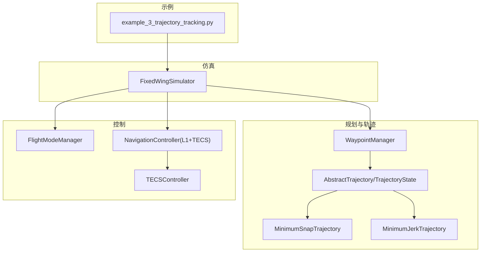
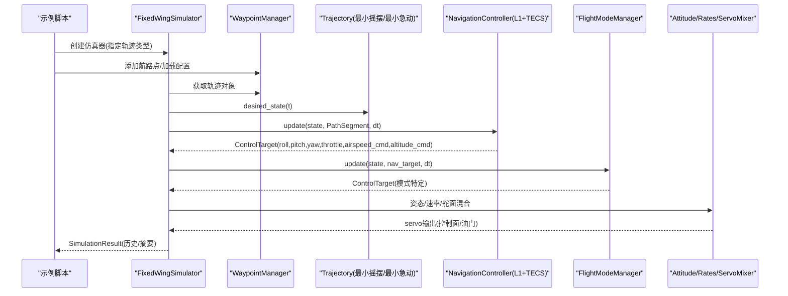
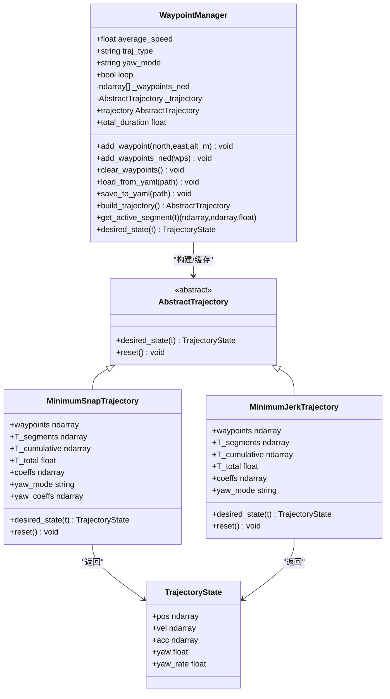
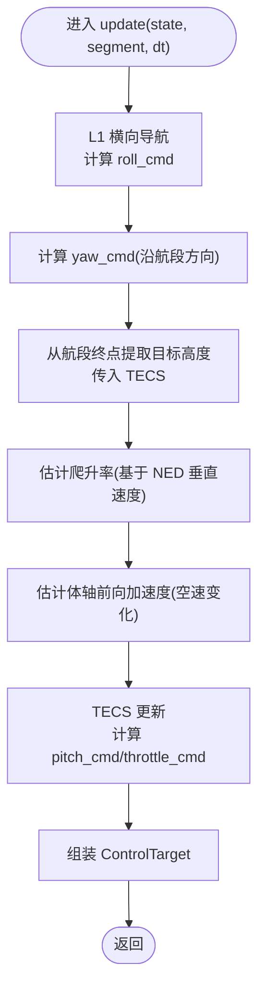
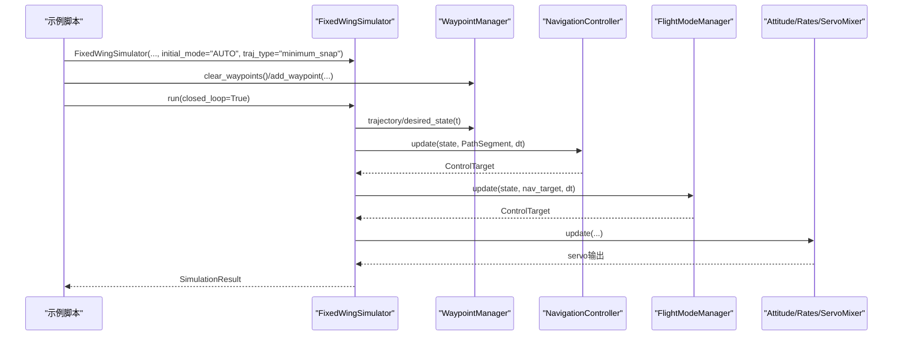
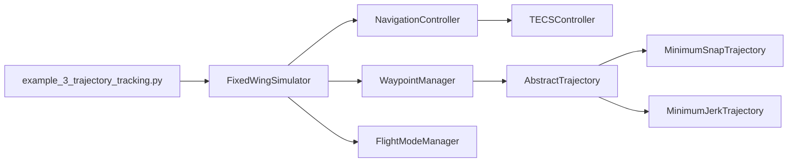

# 轨迹跟踪控制

<cite>
**本文引用的文件列表**
- [examples/example_3_trajectory_tracking.py](file://examples/example_3_trajectory_tracking.py)
- [src/planning/waypoint_manager.py](file://src/planning/waypoint_manager.py)
- [src/planning/trajectory_base.py](file://src/planning/trajectory_base.py)
- [src/planning/minimum_snap.py](file://src/planning/minimum_snap.py)
- [src/planning/minimum_jerk.py](file://src/planning/minimum_jerk.py)
- [src/control/navigation_controller.py](file://src/control/navigation_controller.py)
- [src/control/tecs_controller.py](file://src/control/tecs_controller.py)
- [src/simulation/simulator.py](file://src/simulation/simulator.py)
- [src/control/flight_mode_manager.py](file://src/control/flight_mode_manager.py)
- [config/trajectory.yaml](file://config/trajectory.yaml)
- [config/control_params.yaml](file://config/control_params.yaml)
</cite>

## 目录
1. [引言](#引言)
2. [项目结构](#项目结构)
3. [核心组件](#核心组件)
4. [架构总览](#架构总览)
5. [详细组件分析](#详细组件分析)
6. [依赖关系分析](#依赖关系分析)
7. [性能考量](#性能考量)
8. [故障排查指南](#故障排查指南)
9. [结论](#结论)
10. [附录](#附录)

## 引言
本文件围绕固定翼无人机的轨迹跟踪控制示例进行系统化技术文档编写，重点解释以下方面：
- 轨迹跟踪控制的基本原理与实现路径
- WaypointManager 的工作机制与航路点管理策略
- 导航控制器（L1 + TECS）的实现细节，包括位置控制与速度/高度控制算法
- 轨迹跟踪性能评估指标（跟踪误差、控制输入、系统响应）
- 合理的轨迹参数设计（航路点坐标、速度约束、加速度限制）
- 轨迹跟踪失败的常见原因与解决方案
- 参数调优建议与最佳实践

## 项目结构
该仓库采用模块化组织方式，围绕“仿真引擎 + 控制链 + 规划与轨迹”三层展开：
- examples：示例脚本，演示轨迹跟踪闭环运行与结果可视化
- src/planning：航路点管理与轨迹生成（WaypointManager + 多种轨迹类型）
- src/control：飞行模式管理与多层控制回路（导航控制器、TECS、姿态/速率控制器）
- src/simulation：主仿真引擎，编排各模块并执行闭环仿真
- config：配置文件（轨迹参数、控制参数）

图表来源
- [examples/example_3_trajectory_tracking.py](file://examples/example_3_trajectory_tracking.py#L70-L98)
- [src/simulation/simulator.py](file://src/simulation/simulator.py#L218-L230)
- [src/planning/waypoint_manager.py](file://src/planning/waypoint_manager.py#L127-L167)
- [src/planning/trajectory_base.py](file://src/planning/trajectory_base.py#L16-L47)
- [src/planning/minimum_snap.py](file://src/planning/minimum_snap.py#L167-L253)
- [src/planning/minimum_jerk.py](file://src/planning/minimum_jerk.py#L17-L71)
- [src/control/navigation_controller.py](file://src/control/navigation_controller.py#L45-L116)
- [src/control/tecs_controller.py](file://src/control/tecs_controller.py#L50-L130)
- [src/control/flight_mode_manager.py](file://src/control/flight_mode_manager.py#L115-L138)

章节来源
- [examples/example_3_trajectory_tracking.py](file://examples/example_3_trajectory_tracking.py#L1-L194)
- [src/simulation/simulator.py](file://src/simulation/simulator.py#L115-L230)

## 核心组件
- WaypointManager：管理航路点、构建轨迹对象、提供当前活动航段与期望状态
- AbstractTrajectory/TrajectoryState：定义轨迹状态接口与数据载体
- MinimumSnapTrajectory/MinimumJerkTrajectory：基于多项式插值的轨迹生成器
- NavigationController：L1横向导航 + TECS纵向/能量控制
- TECSController：总比能量控制，协调油门与俯仰以实现高度与空速稳定
- FixedWingSimulator：主仿真引擎，驱动闭环控制链与动力学集成
- FlightModeManager：飞行模式管理（AUTO/STABILIZE/FBW等），输出控制目标

章节来源
- [src/planning/waypoint_manager.py](file://src/planning/waypoint_manager.py#L20-L208)
- [src/planning/trajectory_base.py](file://src/planning/trajectory_base.py#L16-L47)
- [src/planning/minimum_snap.py](file://src/planning/minimum_snap.py#L167-L253)
- [src/planning/minimum_jerk.py](file://src/planning/minimum_jerk.py#L17-L71)
- [src/control/navigation_controller.py](file://src/control/navigation_controller.py#L45-L293)
- [src/control/tecs_controller.py](file://src/control/tecs_controller.py#L50-L200)
- [src/simulation/simulator.py](file://src/simulation/simulator.py#L115-L230)
- [src/control/flight_mode_manager.py](file://src/control/flight_mode_manager.py#L115-L200)

## 架构总览
下图展示从示例脚本到仿真引擎、再到控制链与轨迹生成的整体流程。

图表来源
- [examples/example_3_trajectory_tracking.py](file://examples/example_3_trajectory_tracking.py#L70-L98)
- [src/simulation/simulator.py](file://src/simulation/simulator.py#L239-L567)
- [src/planning/waypoint_manager.py](file://src/planning/waypoint_manager.py#L127-L208)
- [src/control/navigation_controller.py](file://src/control/navigation_controller.py#L134-L202)
- [src/control/flight_mode_manager.py](file://src/control/flight_mode_manager.py#L173-L191)

## 详细组件分析

### WaypointManager 工作机制与航路点管理策略
- 航路点存储与格式：以 NED（北/东/下）存储，海拔为正向上，内部转换为 NED 下
- 航路点操作：支持单点/批量添加、清空、从 YAML 加载/保存
- 轨迹构建：按类型选择最小摇摆或最小急动轨迹，缓存轨迹对象，自动闭合环形任务
- 活动航段查询：给定时间 t，返回当前航段起点/终点与剩余时间
- 期望状态：委托底层轨迹对象返回 desired_state(t)

图表来源
- [src/planning/waypoint_manager.py](file://src/planning/waypoint_manager.py#L20-L208)
- [src/planning/trajectory_base.py](file://src/planning/trajectory_base.py#L16-L47)
- [src/planning/minimum_snap.py](file://src/planning/minimum_snap.py#L167-L253)
- [src/planning/minimum_jerk.py](file://src/planning/minimum_jerk.py#L17-L71)

章节来源
- [src/planning/waypoint_manager.py](file://src/planning/waypoint_manager.py#L20-L208)
- [config/trajectory.yaml](file://config/trajectory.yaml#L1-L23)

### 导航控制器：L1 横向导航与 TECS 纵向控制
- L1 横向导航：基于“前瞻点”与地面速方向夹角计算所需侧向加速度，进而得到期望坡度角
- TECS 纵向控制：以总比能量（SPE+SKE）为控制对象，协调油门与俯仰，实现高度与空速稳定
- 控制目标：输出 roll_cmd/yaw_cmd/pitch_cmd/throttle_cmd/airspeed_cmd/altitude_cmd

图表来源
- [src/control/navigation_controller.py](file://src/control/navigation_controller.py#L134-L202)
- [src/control/tecs_controller.py](file://src/control/tecs_controller.py#L197-L200)

章节来源
- [src/control/navigation_controller.py](file://src/control/navigation_controller.py#L45-L293)
- [src/control/tecs_controller.py](file://src/control/tecs_controller.py#L50-L200)

### 示例：轨迹跟踪闭环运行
- 示例脚本创建仿真器，设定 AUTO 模式与最小摇摆轨迹
- 定义方形航路点，添加到 WaypointManager
- 执行闭环仿真，记录历史并生成多类图表与 CSV 数据

图表来源
- [examples/example_3_trajectory_tracking.py](file://examples/example_3_trajectory_tracking.py#L70-L98)
- [src/simulation/simulator.py](file://src/simulation/simulator.py#L239-L567)

章节来源
- [examples/example_3_trajectory_tracking.py](file://examples/example_3_trajectory_tracking.py#L1-L194)
- [src/simulation/simulator.py](file://src/simulation/simulator.py#L239-L567)

## 依赖关系分析
- WaypointManager 依赖 AbstractTrajectory 接口与具体轨迹实现（最小摇摆/最小急动）
- NavigationController 依赖 TECSController，并通过 FlightModeManager 提供的 ControlTarget 接口
- FixedWingSimulator 组织上述组件，负责状态转换、航段切换、轨迹裁剪与闭环控制链执行
- 示例脚本通过 WaypointManager 配置航路点，驱动仿真器运行

图表来源
- [examples/example_3_trajectory_tracking.py](file://examples/example_3_trajectory_tracking.py#L70-L98)
- [src/simulation/simulator.py](file://src/simulation/simulator.py#L218-L230)
- [src/planning/waypoint_manager.py](file://src/planning/waypoint_manager.py#L127-L167)
- [src/control/navigation_controller.py](file://src/control/navigation_controller.py#L94-L116)
- [src/control/tecs_controller.py](file://src/control/tecs_controller.py#L50-L130)

章节来源
- [src/simulation/simulator.py](file://src/simulation/simulator.py#L115-L230)
- [src/planning/waypoint_manager.py](file://src/planning/waypoint_manager.py#L127-L167)
- [src/control/navigation_controller.py](file://src/control/navigation_controller.py#L94-L116)

## 性能考量
- 轨迹跟踪误差评估
  - 位置误差：实际位置与期望轨迹位置的欧氏距离（NED 平面与垂直方向）
  - 速度误差：实际空速与期望空速差值
  - 航向误差：实际航向与期望航向差值（经角度包裹）
  - 可通过仿真历史数据计算这些指标，用于闭环收敛性与稳态误差分析
- 控制输入
  - 油门/俯仰/坡度角命令是否在限幅范围内
  - 控制器输出是否出现高频抖动或饱和
- 系统响应
  - 轨迹穿越航段时的过渡时间与超调
  - TECS 在不同高度/空速条件下的响应平滑性与稳定性

[本节为通用性能讨论，无需列出具体文件来源]

## 故障排查指南
- 轨迹无法构建
  - 原因：航路点数量不足或航路点不合法
  - 解决：至少提供两个航路点；检查 YAML 文件格式与单位一致性
- 航段切换异常
  - 原因：航路点顺序错误或高度不匹配
  - 解决：确保航路点顺序正确；必要时对齐起始航路点高度
- 跟踪发散或振荡
  - 原因：L1 参数过大/过小、TECS 时间常数不当、油门/俯仰限幅过严
  - 解决：适当降低 L1 周期或阻尼；增大 TECS 时间常数；放宽限幅
- 低空速/失速风险
  - 原因：TECS 速度权重偏向高度、欠速保护未触发
  - 解决：启用欠速保护；提高速度权重；检查空速上下限
- 轨迹越界
  - 原因：期望高度超出航段边界未裁剪
  - 解决：在仿真循环中对期望高度进行航段范围裁剪

章节来源
- [src/planning/waypoint_manager.py](file://src/planning/waypoint_manager.py#L139-L140)
- [src/simulation/simulator.py](file://src/simulation/simulator.py#L481-L489)
- [src/control/tecs_controller.py](file://src/control/tecs_controller.py#L432-L444)

## 结论
本示例展示了固定翼无人机在 AUTO 模式下的轨迹跟踪闭环实现：WaypointManager 提供航路点与期望轨迹，NavigationController 通过 L1 横向导航与 TECS 纵向控制实现稳定跟踪，仿真引擎将各模块串联形成完整控制链。通过合理设计航路点与轨迹参数、调优 L1 与 TECS 参数，可获得良好的跟踪性能与鲁棒性。

[本节为总结性内容，无需列出具体文件来源]

## 附录

### 轨迹参数设计指南
- 航路点坐标
  - 使用 NED 坐标系，海拔为正向上，内部转换为 NED 下
  - 建议航路点间距适中，避免过短导致轨迹频繁切换与控制抖动
- 速度约束
  - cruise_speed 由 ArduPilot 参数决定，TECS 以此为目标空速
  - 最小/最大空速应与飞机包线一致，避免欠速或超速
- 加速度限制
  - 通过轨迹类型与段时长间接限制加速度；最小摇摆轨迹在连续性上更平滑
- 航向策略
  - yaw_mode 支持跟随速度方向或固定航向；根据任务需求选择

章节来源
- [src/planning/waypoint_manager.py](file://src/planning/waypoint_manager.py#L24-L33)
- [config/trajectory.yaml](file://config/trajectory.yaml#L1-L23)
- [config/control_params.yaml](file://config/control_params.yaml#L1-L45)

### 参数调优建议与最佳实践
- L1 参数
  - NAVL1_PERIOD：增大可提升响应但易产生振荡；结合 NAVL1_DAMPING 平滑
  - max_roll：与飞机气动能力匹配，避免过度坡度
- TECS 参数
  - TECS_TIME_CONST：增大可降低振荡，但会增加响应时间
  - TECS_THR_DAMP/TECS_PTCH_DAMP：抑制油门/俯仰振荡
  - TECS_INTEG_GAIN：过大会导致积分饱和与超调
  - TECS_SPDWEIGHT：根据任务侧重高度或速度进行权衡
  - TECS_PITCH_MIN/MAX/THR_MIN/THR_MAX：严格遵循飞机包线
- 示例脚本中的默认航路点与仿真参数可作为起点，结合实际飞机特性进一步校准

章节来源
- [src/control/navigation_controller.py](file://src/control/navigation_controller.py#L57-L82)
- [src/control/tecs_controller.py](file://src/control/tecs_controller.py#L80-L127)
- [config/control_params.yaml](file://config/control_params.yaml#L30-L45)
- [examples/example_3_trajectory_tracking.py](file://examples/example_3_trajectory_tracking.py#L82-L98)